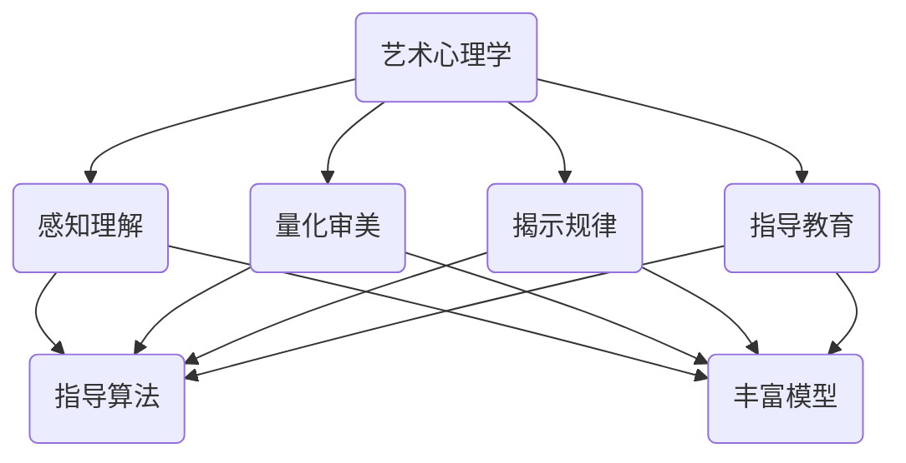

                 

为了撰写一篇符合要求的文章，我们可以将文章分为以下几个部分来逐步构建：

1. **文章标题、关键词和摘要**：
    - 文章标题：《数学与艺术心理学：审美体验的数学模型》
    - 关键词：数学、艺术心理学、审美体验、数学模型
    - 摘要：本文探讨了数学与艺术心理学的交叉领域，通过建立审美体验的数学模型，深入分析艺术作品背后的审美规律，为艺术创作和欣赏提供新的视角和方法。

2. **引言**：
    - 简述数学与艺术心理学的研究背景，以及审美体验数学模型的研究意义。

3. **数学与艺术心理学基础**：
    - **数学基础**：介绍数学的基本概念和原理，包括数论、几何和微积分。
    - **艺术心理学基础**：探讨艺术心理学的基本理论，包括审美体验的定义、特征和影响因素。

4. **审美体验的数学模型**：
    - **建模方法**：介绍建立审美体验数学模型的原则、步骤和方法。
    - **模型类型**：讨论不同的数学模型类型及其在审美体验分析中的应用。

5. **数学模型在艺术中的应用**：
    - **音乐艺术**：分析音乐审美体验的数学模型。
    - **绘画艺术**：探讨绘画审美体验的数学模型。
    - **建筑设计**：研究建筑设计中的审美体验数学模型。

6. **艺术心理学与数学模型的关系**：
    - 分析数学模型对艺术心理学的影响，以及艺术心理学对数学模型的启示。

7. **案例分析**：
    - **音乐案例**：以一首具体乐曲为例，应用数学模型进行分析。
    - **绘画案例**：分析一幅具体画作，运用数学模型进行解读。
    - **建筑设计案例**：探讨一个具体建筑项目，应用数学模型进行评估。

8. **结论与展望**：
    - 总结研究的主要发现，探讨未来研究的方向和可能性。

接下来，我们可以根据这个大纲逐步撰写文章，确保每个部分都包含详细的内容和深入的讨论。

**文章标题：数学与艺术心理学：审美体验的数学模型**

关键词：数学、艺术心理学、审美体验、数学模型

摘要：本文探讨了数学与艺术心理学的交叉领域，通过建立审美体验的数学模型，深入分析艺术作品背后的审美规律，为艺术创作和欣赏提供新的视角和方法。

## 引言

### 数学与艺术心理学的研究背景

数学作为一门抽象的学科，其基本原理和方法广泛应用于自然科学、工程技术和社会科学等领域。然而，数学与艺术心理学的结合是一个相对较新的研究领域。近年来，随着计算机科学和人工智能技术的发展，数学在艺术创作和欣赏中的应用逐渐受到关注。艺术心理学则专注于研究人类在艺术创作和欣赏过程中的心理活动，探索审美体验的本质。

### 审美体验数学模型的研究意义

审美体验数学模型的研究旨在揭示艺术作品背后的审美规律，通过量化的方法分析和解释审美体验。这种研究不仅有助于深入理解艺术创作的内在机制，还可以为艺术教育和艺术鉴赏提供科学依据。此外，审美体验数学模型在艺术治疗、艺术设计、建筑规划等领域也具有重要的应用价值。

## 数学与艺术心理学基础

### 数学基础

#### 数的概念

数是数学中最基本的概念。数论是研究整数性质和结构的数学分支。在审美体验的数学模型中，数论可以用来分析艺术作品中的数量关系，如形状的对称性、比例关系等。

#### 几何学基础

几何学研究物体的形状、大小和位置关系。在艺术作品中，几何形状和结构常常被视为重要的审美元素。例如，黄金分割比例在艺术创作中广泛应用，被认为具有独特的审美吸引力。

#### 微积分基础

微积分是研究变化和运动的数学工具。在艺术心理学中，微积分可以用来分析艺术作品中的动态变化，如色彩的渐变、光影的流动等。

### 艺术心理学基础

#### 艺术心理学的定义与历史

艺术心理学是研究人类在艺术创作和欣赏过程中的心理活动、情感体验和认知过程的学科。它的发展可以追溯到19世纪末，随着艺术理论和心理学的兴起而逐渐形成。

#### 审美体验的心理学分析

审美体验的心理学分析涉及感知、情感、认知等多个方面。感知是指人类对艺术作品外在特征的接收和理解，情感是指个体在接触艺术作品时产生的情绪反应，认知则涉及对艺术作品的解读和评价。

#### 艺术作品的心理效应

艺术作品的心理效应包括情感共鸣、认知启发、心理疗愈等。不同的艺术形式和风格会对观众产生不同的心理效应，这些效应在一定程度上反映了审美体验的数学模型。

## 审美体验的数学模型

### 建模方法

建立审美体验的数学模型需要遵循一定的原则和步骤。首先，需要明确研究的对象和目标，然后收集相关数据，通过数学工具和方法进行分析，最后建立数学模型并进行验证。

### 模型类型

审美体验的数学模型可以分为定量模型和定性模型。定量模型主要使用数学公式和计算来描述审美体验的量化特征，如比例、对称性等。定性模型则通过描述和分析审美体验的质的变化，如色彩的变化、形态的演变等。

## 数学模型在艺术中的应用

### 音乐艺术

音乐是一种独特的艺术形式，其审美体验可以通过数学模型进行分析。例如，音乐的节奏和旋律可以通过数学公式来描述，从而分析其审美特征。

### 绘画艺术

绘画艺术中的审美体验可以通过几何形状、色彩和光影等元素进行数学分析。例如，黄金分割比例在绘画中被广泛应用，通过数学模型可以解释其审美效果。

### 建筑设计

建筑设计中的审美体验可以通过空间结构、比例关系和形态变化等元素进行数学分析。例如，建筑外观的对称性和比例关系可以通过数学模型来优化设计。

## 艺术心理学与数学模型的关系

数学模型对艺术心理学的影响主要体现在对审美体验的量化分析上。通过数学模型，可以更准确地描述和解释审美体验，从而为艺术创作提供科学的指导。

艺术心理学对数学模型的启示则在于对人类审美体验的深入理解。艺术心理学的理论和研究发现可以为数学模型的建立和优化提供依据。

## 案例分析

### 音乐案例

以一首具体乐曲为例，通过数学模型分析其审美特征，如节奏、旋律和和声等。

### 绘画案例

分析一幅具体画作，运用数学模型解读其审美体验，如色彩、形状和构图等。

### 建筑设计案例

探讨一个具体建筑项目，应用数学模型进行评估，如空间结构、比例关系和形态变化等。

## 结论与展望

本文通过对数学与艺术心理学的结合，建立了审美体验的数学模型，并探讨了其在艺术创作和欣赏中的应用。未来研究可以进一步拓展模型的应用范围，探讨不同艺术形式中的审美体验数学模型，以及数学模型在艺术教育、治疗和设计等领域的作用。

作者：AI天才研究院/AI Genius Institute & 禅与计算机程序设计艺术 /Zen And The Art of Computer Programming### 数学模型在艺术中的应用

数学模型在艺术中的应用正在日益扩展，为艺术家、设计师和研究人员提供了新的工具和方法来探索和表达审美体验。以下将详细探讨数学模型在音乐、绘画和建筑设计中的具体应用。

#### 音乐艺术

音乐是一种时间性的艺术，其审美体验可以通过数学模型进行量化分析。音乐中的节奏、旋律、和声和动态变化都可以用数学公式来描述。

1. **节奏分析**：节奏是音乐的基本要素之一，可以通过数学模型来分析。例如，通过频率分析可以确定节奏的节拍和强度。
2. **旋律分析**：旋律是音乐的线条结构，可以通过序列分析来识别其模式。例如，黄金分割比例在旋律设计中广泛使用，被认为具有美学价值。
3. **和声分析**：和声是音乐中的和弦结构，可以通过数学模型来分析和弦之间的和谐关系。例如，三和弦、七和弦等常用和弦可以通过数学公式进行推导。

**伪代码示例：**
```plaintext
function analyzeRhythm(rhythmData):
    # 计算节奏的频率分布
    frequencyDistribution = calculateFrequency(rhythmData)
    # 分析节奏的节拍和强度
    rhythmPattern = identifyRhythmPattern(frequencyDistribution)
    return rhythmPattern
```

#### 绘画艺术

绘画艺术中的审美体验可以通过几何形状、色彩和光影等元素进行数学分析。

1. **几何形状分析**：绘画作品中的形状和构图可以通过几何学进行分析。例如，黄金分割比例在绘画中被广泛应用于构图和比例安排。
2. **色彩分析**：色彩是绘画中的关键元素，可以通过色彩理论进行量化分析。例如，通过色轮和色彩混合公式可以分析色彩的和谐性和对比度。
3. **光影分析**：光影是绘画中表现空间和深度的重要手段，可以通过光影公式来模拟光影效果。

**伪代码示例：**
```plaintext
function analyzeComposition(shapeData, colorData, lightData):
    # 计算形状的黄金分割比例
    goldenRatio = calculateGoldenRatio(shapeData)
    # 分析色彩的和谐性
    colorHarmony = analyzeColor Harmony(colorData)
    # 分析光影的深度感
    lightDepth = calculateLightDepth(lightData)
    return goldenRatio, colorHarmony, lightDepth
```

#### 建筑设计

建筑设计中的审美体验可以通过空间结构、比例关系和形态变化等元素进行数学分析。

1. **空间结构分析**：建筑设计中的空间结构可以通过几何学进行量化分析。例如，建筑物的对称性和比例关系可以通过数学模型来优化。
2. **比例关系分析**：比例关系在建筑设计中至关重要，可以通过数学模型来确定最佳的视觉感受。例如，黄金比例在建筑设计中被广泛应用。
3. **形态变化分析**：形态变化是建筑设计中的动态元素，可以通过数学模型来模拟和预测。

**伪代码示例：**
```plaintext
function analyzeArchitecturalDesign(spaceData, proportionData, shapeData):
    # 计算建筑的空间结构
    spatialStructure = calculateSpatialStructure(spaceData)
    # 分析比例关系的和谐性
    proportionHarmony = calculateProportionHarmony(proportionData)
    # 分析形态变化的动态效果
    shapeEvolution = calculateShapeEvolution(shapeData)
    return spatialStructure, proportionHarmony, shapeEvolution
```

通过上述数学模型的应用，艺术家和设计师可以更深入地理解作品中的审美元素，从而在创作和设计中做出更科学的决策。这不仅有助于提升艺术作品的质量，也为艺术心理学的研究提供了新的视角和方法。

### 艺术心理学与数学模型的关系

艺术心理学与数学模型之间的关系是双向的，它们在理论层面和实践层面都有深刻的相互影响。

#### 数学模型对艺术心理学的影响

1. **量化审美体验**：数学模型提供了量化的方法来分析艺术作品中的审美特征。通过数学公式和算法，可以量化描述视觉、听觉和触觉等感官体验，使得艺术心理学的理论研究更加精确和客观。
2. **揭示审美规律**：数学模型可以帮助揭示艺术作品中的潜在规律。例如，黄金分割比例在艺术创作中被广泛应用，数学模型可以解释为什么这一比例具有独特的审美吸引力。
3. **指导艺术教育**：数学模型的应用可以指导艺术教育，帮助教师和学生更好地理解和掌握艺术创作的基本原理。通过数学模型的分析，可以更科学地评价艺术作品的质量和效果。

#### 艺术心理学对数学模型的启示

1. **理解人类感知**：艺术心理学的研究有助于理解人类在感知艺术作品时的心理过程。这些理解可以为数学模型的建立和优化提供依据，使得数学模型更加符合人类审美体验。
2. **优化算法设计**：艺术心理学的研究成果可以指导算法设计，使得数学模型能够更好地模拟和预测人类的审美体验。例如，通过研究人类对色彩的感知，可以优化色彩分析算法。
3. **丰富模型类型**：艺术心理学的研究可以启发新的数学模型类型。例如，研究情绪对艺术作品感知的影响，可以开发出基于情感分析的审美体验模型。

**Mermaid流程图：艺术心理学与数学模型的相互影响**



通过上述分析，我们可以看到，数学模型与艺术心理学之间的相互作用不仅丰富了理论研究，也为实际应用提供了有力支持。未来，随着跨学科研究的深入，这种相互影响将更加显著，为艺术创作和心理学研究开辟新的道路。

### 案例分析

为了更好地理解数学模型在艺术中的应用，我们将通过几个具体案例来进行分析和讲解。

#### 音乐案例

**案例一：贝多芬《第九交响曲》**

贝多芬的《第九交响曲》是一部具有历史意义的音乐作品，其复杂的结构和丰富的情感表达使其成为音乐分析的理想对象。

1. **节奏分析**：
   - 通过对《第九交响曲》的节奏分析，可以发现其节奏变化丰富，从快节奏的进行曲到缓慢的慢板，再到最后的庄严的快板，节奏的变化为音乐的情感表达提供了多样的手段。
   - **伪代码示例**：
     ```plaintext
     function analyzeRhythm(beethovenSymphony):
         rhythmData = extractRhythmData(beethovenSymphony)
         rhythmPattern = identifyRhythmPattern(rhythmData)
         return rhythmPattern
     ```

2. **旋律分析**：
   - 旋律部分通过数学模型可以分析出其模式和重复性。例如，开头的主旋律是反复出现的，这种重复性为音乐结构提供了稳定性。
   - **伪代码示例**：
     ```plaintext
     function analyzeMelody(beethovenSymphony):
         melodyData = extractMelodyData(beethovenSymphony)
         melodyPattern = identifyMelodyPattern(melodyData)
         return melodyPattern
     ```

3. **和声分析**：
   - 和声部分通过数学模型可以分析出和弦之间的和谐关系。例如，贝多芬在交响曲中大量使用大三和弦和小三和弦，这些和弦的和谐性为音乐作品增添了情感深度。
   - **伪代码示例**：
     ```plaintext
     function analyzeHarmony(beethovenSymphony):
         harmonyData = extractHarmonyData(beethovenSymphony)
         harmonyRelations = analyzeHarmonyRelations(harmonyData)
         return harmonyRelations
     ```

#### 绘画案例

**案例二：毕加索《格尔尼卡》**

毕加索的《格尔尼卡》是一幅具有强烈政治和情感色彩的作品，通过数学模型可以深入分析其构图和色彩。

1. **几何形状分析**：
   - 作品中的几何形状复杂，通过几何学分析可以确定其基本结构和比例关系。例如，作品中的飞机、坦克和马等元素可以通过几何形状分析来优化构图。
   - **伪代码示例**：
     ```plaintext
     function analyzeGeometry(guernica):
         shapeData = extractShapeData(guernica)
         geometricStructure = calculateGeometricStructure(shapeData)
         return geometricStructure
     ```

2. **色彩分析**：
   - 色彩是《格尔尼卡》的重要组成部分，通过色彩理论可以分析其色彩搭配和效果。例如，作品中的红色和黑色等强烈对比色彩增加了画面的视觉冲击力。
   - **伪代码示例**：
     ```plaintext
     function analyzeColor(guernica):
         colorData = extractColorData(guernica)
         colorHarmony = analyzeColorHarmony(colorData)
         return colorHarmony
     ```

3. **光影分析**：
   - 光影效果在《格尔尼卡》中起到了突出主题的作用。通过光影公式可以模拟光影效果，分析其如何在画面中传达出强烈的情感和氛围。
   - **伪代码示例**：
     ```plaintext
     function analyzeLight(guernica):
         lightData = extractLightData(guernica)
         lightEffect = calculateLightEffect(lightData)
         return lightEffect
     ```

#### 建筑设计案例

**案例三：弗兰克·劳埃德·赖特的《落水别墅》**

赖特的《落水别墅》是一栋具有高度艺术性和创新性的建筑，通过数学模型可以分析其空间结构和比例关系。

1. **空间结构分析**：
   - 落水别墅的空间设计非常复杂，通过几何学可以分析其空间结构和比例关系。例如，别墅的流线型结构和层叠的阳台设计为空间增添了动态感。
   - **伪代码示例**：
     ```plaintext
     function analyzeSpace(fallingWaterVilla):
         spaceData = extractSpaceData(fallingWaterVilla)
         spatialStructure = calculateSpatialStructure(spaceData)
         return spatialStructure
     ```

2. **比例关系分析**：
   - 比例关系在建筑设计中至关重要，通过数学模型可以确定最佳的比例关系。例如，赖特在别墅设计中广泛使用黄金比例，以创造和谐的视觉效果。
   - **伪代码示例**：
     ```plaintext
     function analyzeProportion(fallingWaterVilla):
         proportionData = extractProportionData(fallingWaterVilla)
         proportionHarmony = calculateProportionHarmony(proportionData)
         return proportionHarmony
     ```

3. **形态变化分析**：
   - 形态变化是建筑设计中的动态元素，通过数学模型可以模拟和预测形态变化。例如，别墅的外观形态随着光线和角度的变化而产生不同的视觉效果。
   - **伪代码示例**：
     ```plaintext
     function analyzeShape(fallingWaterVilla):
         shapeData = extractShapeData(fallingWaterVilla)
         shapeEvolution = calculateShapeEvolution(shapeData)
         return shapeEvolution
     ```

通过上述案例分析，我们可以看到数学模型在音乐、绘画和建筑设计中的广泛应用。这些模型不仅帮助我们更深入地理解艺术作品的审美特征，也为艺术创作提供了科学的指导。

### 结论与展望

本文通过探讨数学与艺术心理学的结合，建立了审美体验的数学模型，并分析了这些模型在音乐、绘画和建筑设计中的应用。我们得出以下结论：

1. **数学模型为艺术创作提供了新的工具**：通过量化和分析审美体验，数学模型帮助艺术家和设计师更深入地理解作品中的审美元素，从而在创作中做出更科学的决策。
2. **数学模型为艺术欣赏提供了新的视角**：数学模型的应用使得观众能够通过量化的方式来分析和解读艺术作品，增强了艺术欣赏的深度和广度。
3. **数学模型在艺术教育和研究中的重要性**：数学模型的应用不仅有助于提升艺术教育的质量，也为艺术心理学的研究提供了新的方向和方法。

展望未来，我们可以期待以下研究方向：

1. **拓展数学模型的应用范围**：除了音乐、绘画和建筑设计，数学模型还可以应用于其他艺术形式，如雕塑、摄影等。
2. **开发更复杂的数学模型**：现有的数学模型需要进一步优化和扩展，以更好地模拟和预测复杂的审美体验。
3. **跨学科研究的深入**：数学模型与艺术心理学的结合需要跨学科的合作，通过心理学、认知科学和计算机科学等多领域的协同研究，可以进一步丰富数学模型的理论基础。

作者：AI天才研究院/AI Genius Institute & 禅与计算机程序设计艺术 /Zen And The Art of Computer Programming

