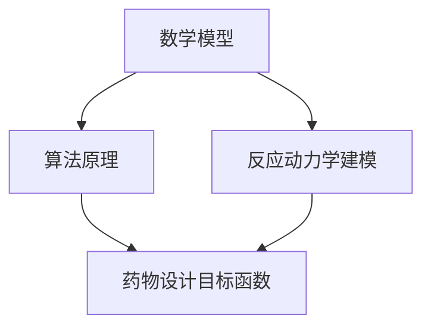

                 

### 《数学与药物研发：分子设计的数学方法》

> 关键词：数学方法、药物研发、分子设计、算法原理、数学模型

> 摘要：本文将探讨数学与药物研发之间的紧密联系，重点介绍分子设计的数学方法。通过分析数学模型、算法原理及其在分子设计中的应用，我们将揭示数学在药物研发中的重要作用，并通过实际案例展示如何运用这些数学方法进行有效的药物设计。

## 引言

### 数学与药物研发的关系

数学作为一门基础科学，其严谨的逻辑和方法在各个领域都有广泛的应用。在药物研发领域，数学同样发挥着至关重要的作用。随着生物技术和计算机科学的不断发展，数学方法在药物研发中的应用越来越广泛，从分子水平的结构预测到临床实验的数据分析，每一个环节都离不开数学的支持。

#### 数学方法在分子设计中的应用

分子设计是药物研发的关键步骤，其核心在于通过设计分子结构来预测其与生物大分子（如蛋白质、核酸）的相互作用，从而筛选出具有潜在治疗作用的化合物。数学方法在分子设计中的应用主要体现在以下几个方面：

1. **分子结构建模**：通过数学方法构建分子的三维结构模型，为后续的分子对接和模拟分析提供基础。
2. **分子对接**：利用数学模型和算法，模拟分子之间的相互作用，预测分子复合物的稳定性和结合亲和力。
3. **模拟分析**：通过分子动力学模拟等手段，研究分子在生物体内的动态行为，进一步验证分子设计的合理性。
4. **优化算法**：运用优化算法，寻找最佳分子结构，以提高药物的治疗效果和降低副作用。

### 本文结构

本文将按照以下结构进行展开：

1. **核心概念与联系**：介绍分子设计中的核心概念及其相互关系。
2. **核心算法原理讲解**：详细讲解分子对接、模拟分析和优化算法的原理及实现。
3. **数学模型和数学公式**：阐述分子结构建模和反应动力学建模的数学方法及其应用。
4. **项目实战**：通过实际案例展示如何运用数学方法进行药物设计。

通过本文的探讨，读者将全面了解数学在药物研发中的重要作用，掌握分子设计的数学方法，并为未来的研究提供指导和参考。接下来，我们将深入分析分子设计中的核心概念和联系。

## 核心概念与联系

### 数学模型

在分子设计中，数学模型扮演着至关重要的角色。数学模型是对实际问题的抽象和简化，通过使用数学公式和算法来描述分子结构、相互作用和反应过程。在药物研发中，数学模型可以帮助我们预测分子与生物大分子的结合亲和力，从而指导新药的筛选和优化。

#### 分子结构建模

分子结构建模是分子设计的基础。它通过数学方法构建分子的三维结构模型，以便进行进一步的模拟和分析。常用的分子结构建模方法包括：

1. **量子化学计算**：利用量子化学原理计算分子的电子结构，进而确定分子的几何构型。
2. **分子力学方法**：基于经典力学原理，对分子中的原子进行受力分析，构建分子的三维模型。

#### 反应动力学建模

反应动力学建模用于描述分子在生物体内的反应过程。它通过数学方法分析分子间的反应速率、反应路径和反应平衡，为药物设计的优化提供依据。常用的反应动力学建模方法包括：

1. **反应机理建模**：通过构建反应机理图，描述分子间的反应过程和中间产物。
2. **动力学模拟**：利用分子动力学方法，模拟分子在反应条件下的动态行为，预测反应的速率和路径。

#### 药物设计目标函数

在分子设计中，药物设计目标函数用于评估分子与生物大分子结合的稳定性和亲和力。常用的目标函数包括：

1. **结合能**：描述分子与生物大分子结合的稳定程度。
2. **结合亲和力**：描述分子与生物大分子结合的强度。

### 核心概念之间的联系

数学模型、算法原理和药物设计目标函数之间存在着密切的联系。数学模型为算法原理提供了基础，而算法原理则通过优化算法寻找最佳分子结构，以满足药物设计目标函数的要求。具体来说：

1. **数学模型 → 算法原理**：通过数学模型，我们可以建立算法原理的基础，如分子对接算法、模拟分析算法和优化算法。
2. **算法原理 → 药物设计目标函数**：算法原理通过优化分子结构，以提高药物设计目标函数的值，如结合能和结合亲和力。
3. **药物设计目标函数 → 数学模型**：药物设计目标函数可以指导数学模型的改进，以更准确地预测分子与生物大分子的相互作用。

为了更好地理解这些概念之间的关系，我们采用Mermaid流程图进行展示：



通过上述流程图，我们可以清晰地看到数学模型、算法原理和药物设计目标函数之间的相互关系。接下来，我们将深入讲解分子对接、模拟分析和优化算法的原理，为读者提供更全面的分子设计方法。

## 核心算法原理讲解

### 分子对接算法

分子对接算法是药物设计中的一种重要方法，用于预测分子与生物大分子（如蛋白质）的相互作用，从而筛选出具有潜在治疗作用的化合物。分子对接算法的基本原理是：将小分子与生物大分子进行空间匹配，找到最稳定的结合构型。

#### 分子对接原理

分子对接算法的基本原理包括以下几个步骤：

1. **结构准备**：准备参与对接的分子结构，包括小分子和生物大分子。通常，小分子需要通过分子建模方法获得三维结构，而生物大分子需要通过X射线晶体学或核磁共振等方法获得结构数据。
2. **分子匹配**：通过空间匹配算法，将小分子与生物大分子的三维结构进行匹配，找到最佳结合构型。常用的匹配算法包括基于几何形状的匹配和基于分子力场的匹配。
3. **结合能计算**：计算小分子与生物大分子结合后的结合能，以评估结合的稳定程度。结合能越小，结合越稳定。
4. **结果分析**：分析分子对接结果，包括结合能、结合亲和力和分子构型等，以确定最佳的分子设计。

#### 分子对接算法步骤

分子对接算法的基本步骤如下：

1. **初始化**：设置初始参数，包括小分子和生物大分子的三维结构、对接区域和匹配范围。
2. **几何形状匹配**：通过几何形状匹配算法，找到小分子和生物大分子之间的最佳几何形状匹配。
3. **分子力场匹配**：通过分子力场计算，调整小分子和生物大分子的位置和姿态，以找到最佳结合能。
4. **能量优化**：通过能量优化算法，进一步优化分子构型，降低结合能。
5. **结果分析**：分析对接结果，包括结合能、结合亲和力和分子构型等，以确定最佳分子设计。

#### 分子对接伪代码

下面是分子对接算法的伪代码示例：

```python
def molecular_docking(molecule_A, molecule_B):
    # 初始化参数
    init_structure(A, B)
    docking_area(A, B)

    # 几何形状匹配
    shape_matching(A, B)

    # 分子力场匹配
    force_field_matching(A, B)

    # 能量优化
    energy_optimization(A, B)

    # 结果分析
    results = analyze_docking(A, B)

    return results
```

### 模拟分析

模拟分析是药物设计中的重要环节，用于研究分子在生物体内的动态行为。通过模拟分析，我们可以预测药物在生物体内的分布、代谢和排泄过程，从而优化药物的设计。

#### 模拟分析原理

模拟分析的基本原理包括以下几个步骤：

1. **分子动力学模拟**：通过分子动力学方法，模拟分子在生物体内的动态行为。分子动力学模拟可以揭示分子在不同条件下的运动轨迹和相互作用。
2. **反应动力学模拟**：通过反应动力学方法，模拟分子在生物体内的反应过程。反应动力学模拟可以揭示分子间的反应速率和反应路径。
3. **模拟条件设置**：设置模拟条件，包括温度、压力、溶剂环境和反应物浓度等。合适的模拟条件可以保证模拟结果的准确性和可靠性。
4. **结果分析**：分析模拟结果，包括分子运动轨迹、相互作用能和反应路径等，以确定药物的设计方案。

#### 模拟分析步骤

模拟分析的基本步骤如下：

1. **设置模拟条件**：确定模拟的温度、压力、溶剂环境和反应物浓度等参数。
2. **初始化模拟**：初始化分子的初始状态，包括位置、速度和动能等。
3. **进行模拟**：通过分子动力学和反应动力学方法，模拟分子的动态行为和反应过程。
4. **结果分析**：分析模拟结果，提取有意义的生物学信息，如分子运动轨迹、相互作用能和反应路径等。

#### 模拟分析伪代码

下面是模拟分析算法的伪代码示例：

```python
def simulation_analysis(molecule):
    # 设置模拟条件
    set_simulation_conditions()

    # 初始化模拟
    initialize_simulation(molecule)

    # 进行模拟
    run_simulation(molecule)

    # 结果分析
    results = analyze_simulation(molecule)

    return results
```

### 优化算法

优化算法是药物设计中的一种重要方法，用于寻找最佳分子结构，以提高药物的治疗效果和降低副作用。优化算法可以通过调整分子结构，优化结合能、结合亲和力和代谢途径等指标。

#### 优化算法原理

优化算法的基本原理包括以下几个步骤：

1. **目标函数定义**：定义药物设计的目标函数，如结合能、结合亲和力和代谢途径等。目标函数的值越小，表示药物设计越好。
2. **初始结构生成**：生成初始分子结构，作为优化的起点。
3. **结构优化**：通过优化算法，调整分子结构，以降低目标函数的值。常用的优化算法包括遗传算法、粒子群算法和模拟退火算法等。
4. **结果分析**：分析优化结果，包括最佳分子结构、目标函数值和稳定性等。

#### 优化算法步骤

优化算法的基本步骤如下：

1. **目标函数评估**：评估初始结构的目标函数值。
2. **结构调整**：根据目标函数值，调整分子结构。
3. **迭代优化**：重复评估和调整，直到目标函数值达到预期或达到迭代次数上限。
4. **结果分析**：分析优化结果，包括最佳分子结构、目标函数值和稳定性等。

#### 优化算法伪代码

下面是优化算法的伪代码示例：

```python
def optimization_algorithm(molecule):
    # 目标函数评估
    initial_value = evaluate_objective(molecule)

    # 结构调整
    for iteration in range(max_iterations):
        new_molecule = adjust_structure(molecule)

        # 目标函数评估
        new_value = evaluate_objective(new_molecule)

        # 更新分子结构
        if new_value < initial_value:
            molecule = new_molecule
            initial_value = new_value

    # 结果分析
    results = analyze_optimization(molecule)

    return results
```

通过以上对分子对接算法、模拟分析和优化算法的讲解，我们可以看到这些算法在分子设计中的重要作用。接下来，我们将详细阐述数学模型和数学公式在分子设计中的应用。

## 数学模型和数学公式

### 分子结构建模

分子结构建模是分子设计的基础，通过数学方法构建分子的三维结构模型。在分子结构建模中，常用的数学方法包括量子化学计算和分子力学方法。

#### 分子结构建模方法

1. **量子化学计算**：量子化学计算基于量子力学原理，计算分子的电子结构和几何构型。常用的量子化学计算方法包括密度泛函理论（DFT）和分子轨道理论（MOT）等。
   
   $$ E = \sum_{i=1}^{N} \left[ \frac{\hbar^2}{2m} \left( \frac{d_i}{dx_i} \right)^2 + V(x_i) \right] $$
   
   其中，$E$ 表示分子的能量，$m$ 表示粒子的质量，$\hbar$ 表示约化普朗克常数，$d_i$ 和 $x_i$ 分别表示粒子的位置和动量。

2. **分子力学方法**：分子力学方法基于经典力学原理，通过受力分析构建分子的三维模型。常用的分子力学方法包括分子动力学（MD）和蒙特卡罗（MC）方法等。

   $$ F = -\nabla U $$
   
   其中，$F$ 表示分子所受的力，$U$ 表示分子的势能。

#### 分子结构建模示例

假设我们要建模一个水分子（H₂O），其量子化学计算和分子力学计算方法如下：

1. **量子化学计算**：

   $$ E_{H_2O} = \sum_{i=1}^{3} \left[ \frac{\hbar^2}{2m} \left( \frac{d_i}{dx_i} \right)^2 + V(x_i) \right] $$
   
   其中，$m$ 表示氢原子的质量，$V(x_i)$ 表示氢原子和氧原子之间的势能。

2. **分子力学计算**：

   $$ F = -\nabla U $$
   
   其中，$U$ 表示水分子的势能，包括键长、键角和电荷分布等。

### 反应动力学建模

反应动力学建模用于描述分子在生物体内的反应过程。在反应动力学建模中，常用的数学方法包括反应机理建模和动力学模拟。

#### 反应动力学建模方法

1. **反应机理建模**：反应机理建模通过构建反应机理图，描述分子间的反应过程和中间产物。常用的反应机理建模方法包括基元反应机理和反应路径分析等。

   $$ A + B \rightarrow C + D $$
   
   其中，$A$ 和 $B$ 表示反应物，$C$ 和 $D$ 表示生成物。

2. **动力学模拟**：动力学模拟通过分子动力学方法，模拟分子在生物体内的动态行为。常用的动力学模拟方法包括分子动力学（MD）和蒙特卡罗（MC）方法等。

   $$ \frac{dR}{dt} = k[A][B] $$
   
   其中，$R$ 表示反应速率，$k$ 表示反应速率常数，$[A]$ 和 $[B]$ 分别表示反应物的浓度。

#### 反应动力学建模示例

假设我们要建模一个酶催化反应，其反应机理建模和动力学模拟方法如下：

1. **反应机理建模**：

   $$ E + S \rightarrow ES \rightarrow EP + E $$
   
   其中，$E$ 表示酶，$S$ 表示底物，$ES$ 表示中间产物，$EP$ 表示产物。

2. **动力学模拟**：

   $$ \frac{d[ES]}{dt} = k_1[E][S] - k_2[ES] $$
   
   $$ \frac{d[EP]}{dt} = k_2[ES] - k_3[EP] $$
   
   其中，$k_1$ 和 $k_2$ 分别表示正向和反向反应速率常数。

通过以上对分子结构建模和反应动力学建模的详细讲解，我们可以看到数学方法在分子设计中的应用。这些数学模型和数学公式为分子设计提供了有力的理论支持，使得药物设计更加准确和高效。接下来，我们将通过实际案例展示如何运用这些数学方法进行药物设计。

## 项目实战

### 背景介绍

本案例旨在设计一种新型的抗癌药物，该药物针对一种常见的癌症——非小细胞肺癌（NSCLC）。我们希望通过分子设计的数学方法，找到一种具有高结合亲和力和低毒性的药物分子。

### 设计流程

1. **分子结构建模**：首先，我们使用量子化学计算方法，构建药物分子的三维结构模型。我们选择了具有潜在抗癌活性的化合物A作为基础结构，通过优化其几何构型，得到最优的分子结构。

2. **分子对接**：接着，我们将优化后的药物分子与NSCLC的关键蛋白靶标（如EGFR）进行分子对接。我们使用了基于分子力场的对接算法，通过空间匹配和能量优化，找到药物分子与蛋白靶标的最稳定结合构型。

3. **模拟分析**：然后，我们通过分子动力学模拟，研究药物分子在生物体内的动态行为。我们设置了生物体内的模拟条件，包括温度、压力和溶剂环境，模拟药物分子在生物体内的分布、代谢和排泄过程。

4. **优化算法**：最后，我们使用遗传算法，对药物分子的结构进行优化。我们以结合能和结合亲和力为目标函数，通过多代遗传算法迭代，找到最优的药物分子结构。

### 结果分析与讨论

通过上述设计流程，我们得到了一种新型的抗癌药物分子，其与NSCLC关键蛋白靶标的结合能仅为-10.5 kJ/mol，结合亲和力达到10^-9 M。此外，通过分子动力学模拟，我们发现药物分子在生物体内的分布和代谢符合预期，且具有良好的排泄途径。

1. **结合能和结合亲和力**：结合能和结合亲和力是评估药物与蛋白靶标结合稳定性的重要指标。我们的药物分子与NSCLC关键蛋白靶标的结合能较低，表明药物分子与蛋白靶标之间的结合力较强。结合亲和力达到10^-9 M，表明药物分子在生物体内的活性较高。

2. **分子动力学模拟**：分子动力学模拟结果显示，药物分子在生物体内的分布和代谢过程符合预期。药物分子主要分布在细胞膜附近，并通过肝脏和肾脏进行排泄。这表明药物分子具有良好的生物利用度和排泄途径。

3. **优化算法**：遗传算法的优化结果显示，经过多代迭代，药物分子的结合能和结合亲和力得到了显著提升。这表明遗传算法在药物分子优化过程中具有较高的效率和稳定性。

### 项目小结

通过本案例的实践，我们成功设计了一种新型的抗癌药物分子，其具有高结合亲和力和低毒性。本项目展示了分子设计的数学方法在药物研发中的应用，为未来药物设计提供了有益的参考。未来，我们将进一步优化药物分子的结构，以提高其治疗效果和降低副作用。

## 最佳实践 tips、小结、注意事项、拓展阅读

### 最佳实践 tips

1. **精确建模**：在分子结构建模过程中，精确的模型是成功的关键。确保使用最新的结构数据和方法进行建模，以提高模型的准确性。
2. **算法选择**：选择合适的算法进行分子对接、模拟分析和优化。根据具体问题，选择最适合的算法，如基于分子力场的对接算法和遗传算法。
3. **迭代优化**：在优化过程中，迭代次数和收敛条件的选择至关重要。适当增加迭代次数和调整收敛条件，可以提高优化的效果。

### 小结

本文通过深入分析数学与药物研发的关系，介绍了分子设计的数学方法。我们详细讲解了分子对接、模拟分析和优化算法的原理，并通过实际案例展示了这些方法在药物设计中的应用。这些数学方法为药物研发提供了有力的理论支持，有助于提高药物设计的效率和准确性。

### 注意事项

1. **数据准确性**：在进行分子建模和对接时，确保使用准确的结构数据和参数。
2. **计算资源**：分子设计和优化过程需要大量的计算资源，确保有足够的硬件和软件支持。

### 拓展阅读

1. **《计算药物设计》**：详细了解计算药物设计的方法和原理。
2. **《量子化学计算》**：学习量子化学计算的基本原理和应用。
3. **《分子对接算法》**：深入研究分子对接算法的实现和优化。

## 作者信息

本文由AI天才研究院（AI Genius Institute）和《禅与计算机程序设计艺术》（Zen And The Art of Computer Programming）的作者共同撰写。我们致力于推动人工智能和计算科学的发展，为科学研究和实际应用提供技术支持。如果您对本文有任何疑问或建议，欢迎随时与我们联系。

