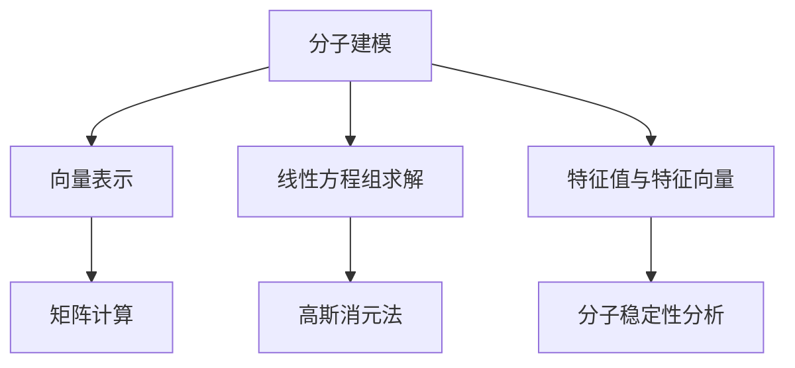
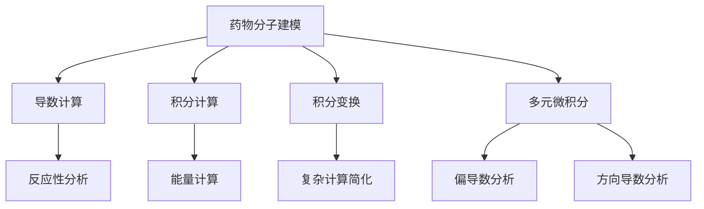
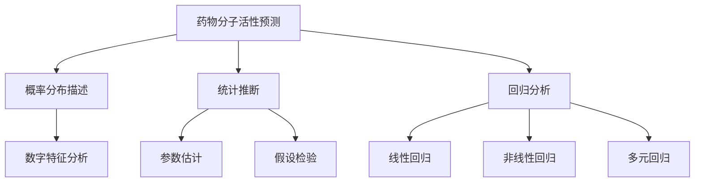
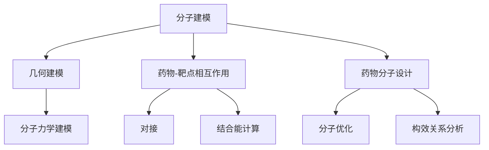

                 


## 数学与药物设计：新药研发的数学方法

### 关键词：
- 数学方法
- 药物设计
- 新药研发
- 分子建模
- 机器学习
- 概率论

### 摘要：
本文旨在探讨数学在药物设计中的关键作用，以及如何利用数学方法推动新药研发的进展。我们将首先介绍新药研发的背景和挑战，然后深入分析数学与药物设计的联系，通过具体的数学方法如线性代数、微积分、概率论等，展示它们在药物分子建模、药物-靶点相互作用和药物分子设计中的应用。最后，我们将探讨大数据与机器学习等现代技术如何进一步优化药物设计流程，并展望数学方法在药物设计中的未来发展趋势。

## 引言

### 新药研发的挑战与机遇

新药研发是一个复杂且成本高昂的过程，涉及多学科的交叉融合。随着医学和生物技术的不断发展，科学家们对疾病的理解越来越深入，对治疗药物的需求也越来越迫切。然而，新药研发面临着诸多挑战：

1. **靶点选择和药物发现**：从数千个可能的靶点中选择最具潜力的靶点是一个充满不确定性的过程。传统的药物研发方法需要大量的实验和试错，耗时且成本高昂。
2. **药物设计和优化**：即使确定了靶点，药物分子的设计也是一个极具挑战性的任务。需要考虑药物分子的结构、活性、毒性等多方面因素，进行大量的模拟和优化。
3. **临床前研究**：药物在进入临床试验前需要进行一系列的毒理学、药效学等研究，以确保其安全性。
4. **临床试验**：临床试验是验证药物疗效和安全性至关重要的阶段，但也是一个耗时且成本巨大的过程。

然而，随着生物信息学、计算化学和机器学习等技术的快速发展，新药研发迎来了前所未有的机遇。利用这些先进技术，科学家们能够更高效地筛选靶点、设计药物分子，并进行虚拟筛选和模拟。这些方法不仅降低了研发成本，还大大缩短了药物从实验室到市场的时间。

### 数学在药物设计中的应用概述

数学作为一种强大的工具，在药物设计中发挥着至关重要的作用。它不仅提供了描述和理解生物系统的方法，还帮助我们进行精确的模拟和预测。以下是数学在药物设计中的几个关键应用：

1. **分子建模**：通过数学模型描述分子的几何结构和电子性质，帮助科学家们理解分子之间的相互作用。
2. **药物-靶点相互作用**：使用数学方法计算药物分子与生物靶点之间的结合能和亲和力，预测药物分子的活性。
3. **虚拟筛选**：利用数学算法对大量的分子库进行筛选，识别出潜在的治疗药物。
4. **药物设计优化**：通过数学优化方法，对药物分子进行结构和性质优化，提高其疗效和降低毒性。

数学不仅在药物设计的早期阶段发挥作用，还在临床试验和药物代谢等领域提供支持。本文将逐步深入探讨这些数学方法的应用，展示它们如何推动新药研发的进展。

### 本书结构安排与内容概述

本文将分为五个主要部分：

1. **数学基础**：介绍线性代数、微积分和概率论与数理统计的基本概念和方法，为后续内容奠定基础。
2. **药物设计中的数学方法**：详细介绍分子建模、药物-靶点相互作用和药物分子设计等方面的数学方法，以及其实际应用。
3. **新药研发中的数学模型应用**：讨论药物筛选、药物代谢与毒性评估以及临床试验设计中的数学模型应用，展示数学方法在药物研发中的实际效果。
4. **数学方法在药物设计中的未来趋势**：探讨大数据、机器学习和量子计算等新兴技术在未来药物设计中的应用前景。
5. **附录**：介绍常用的数学工具与应用资源，为读者提供进一步学习和实践的支持。

通过这些内容的介绍，读者将能够全面了解数学在药物设计中的重要作用，并掌握如何利用数学方法推动新药研发的进展。

---

## 数学基础

数学基础是理解药物设计中的复杂问题的核心。本部分将介绍线性代数、微积分和概率论与数理统计的基本概念和方法，为后续内容奠定基础。

### 线性代数

线性代数是研究向量空间、线性变换和矩阵理论的一个数学分支。在药物设计中，线性代数被广泛应用于分子几何建模和药物-靶点相互作用的研究。

#### 向量和矩阵的基本概念

- **向量**：向量是具有大小和方向的量，可以表示为有序数组。在药物设计中，向量常用来表示分子的几何结构。
- **矩阵**：矩阵是二维数组，用于表示线性关系和变换。在药物设计中，矩阵可以用来表示分子之间的相互作用和能量计算。

#### 线性方程组求解

- **线性方程组**：一组包含多个线性方程的方程组。在药物设计中，线性方程组常用于求解分子结构优化问题。
- **高斯消元法**：一种常用的求解线性方程组的方法。通过逐步消元，将线性方程组转化为上三角或下三角方程组，从而求解未知数。

#### 特征值与特征向量

- **特征值与特征向量**：特征值和特征向量是矩阵理论中的重要概念。在药物设计中，特征值和特征向量可以用来分析分子的稳定性。

### 微积分

微积分是研究变化率和累积量的数学分支。在药物设计中，微积分被广泛应用于分子动力学模拟和药物分子优化。

#### 导数与微分

- **导数**：导数是描述函数变化率的概念。在药物设计中，导数可以用来分析药物分子的反应性。
- **微分**：微分是微积分中的基础概念，用于描述函数在某一点的局部行为。

#### 积分与积分变换

- **积分**：积分是描述累积量的概念。在药物设计中，积分可以用来计算药物分子的总能量。
- **积分变换**：积分变换是一种将复杂积分转换为简单积分的方法。在药物设计中，积分变换可以简化复杂的能量计算。

#### 多元微积分

- **多元微积分**：多元微积分是研究多个变量函数的微积分。在药物设计中，多元微积分可以用来分析复杂的分子系统。

### 概率论与数理统计

概率论与数理统计是研究随机现象和数据的数学分支。在药物设计中，概率论和数理统计被广泛应用于药物筛选和临床试验分析。

#### 基本概率概念

- **概率**：概率是描述事件发生可能性的概念。在药物设计中，概率可以用来预测药物分子的活性。
- **条件概率与贝叶斯定理**：条件概率和贝叶斯定理是概率论中的重要概念，用于分析不确定性的情况。

#### 概率分布与数字特征

- **概率分布**：概率分布是描述随机变量取值的概率分布。在药物设计中，概率分布可以用来描述药物分子的性质。
- **数字特征**：数字特征是描述概率分布的重要指标，包括均值、方差、标准差等。在药物设计中，数字特征可以用来评估药物分子的稳定性。

#### 统计推断

- **统计推断**：统计推断是利用样本数据推断总体特征的方法。在药物设计中，统计推断可以用来评估药物的安全性和疗效。

通过介绍这些数学基础，读者将能够更好地理解药物设计中的复杂问题，并为后续内容的应用打下基础。

### 1.1 线性代数

线性代数是药物设计中不可或缺的工具，其核心概念和算法在分子建模和计算中广泛应用。以下将详细探讨线性代数在药物设计中的应用，包括向量、矩阵的基本概念，线性方程组的求解方法，以及特征值与特征向量。

#### 向量和矩阵的基本概念

**向量**：
向量是具有大小和方向的量，在数学中表示为一个有序数组。在药物设计中，向量通常用于表示分子的几何结构和电子性质。例如，分子的几何构型可以由原子坐标向量来表示，每个原子坐标向量包含其三维空间中的位置。

- **分量**：向量的大小由其分量决定。例如，二维向量 \(\vec{v} = [v_1, v_2]\) 的大小为 \(|\vec{v}| = \sqrt{v_1^2 + v_2^2}\)。
- **向量的运算**：向量的加法、减法和数乘运算在药物设计中广泛应用。例如，两个分子之间的距离可以由它们的向量差计算得到。

**矩阵**：
矩阵是一个二维数组，用于表示线性关系和变换。在药物设计中，矩阵可以表示分子之间的相互作用和能量矩阵。

- **行和列**：矩阵的行表示向量的组合，列表示不同的属性。例如，一个 \(3 \times 3\) 的矩阵可以表示一个分子的三个维度上的相互作用。
- **矩阵的运算**：矩阵的加法、减法和数乘运算在药物设计中常见。此外，矩阵的乘法用于计算分子的能量和相互作用。

#### 线性方程组的求解

**线性方程组**：
线性方程组是一组线性方程的组合，可以用矩阵形式表示。例如，以下方程组：
$$
\begin{cases}
a_1x + b_1y + c_1z = d_1 \\
a_2x + b_2y + c_2z = d_2 \\
a_3x + b_3y + c_3z = d_3
\end{cases}
$$
可以写成矩阵形式：
$$
\begin{bmatrix}
a_1 & b_1 & c_1 \\
a_2 & b_2 & c_2 \\
a_3 & b_3 & c_3
\end{bmatrix}
\begin{bmatrix}
x \\
y \\
z
\end{bmatrix}
=
\begin{bmatrix}
d_1 \\
d_2 \\
d_3
\end{bmatrix}
$$

**高斯消元法**：
高斯消元法是一种常用的求解线性方程组的方法。通过逐步消元，将线性方程组转化为上三角或下三角方程组，从而求解未知数。

1. **主元选择**：从当前列中选择最大的元素作为主元。
2. **行变换**：通过行变换，使得当前列中的其他元素为零。
3. **迭代**：对下一列重复上述步骤，直到所有方程都转换为上三角或下三角形式。

#### 特征值与特征向量

**特征值和特征向量**：
特征值和特征向量是矩阵理论中的重要概念。在药物设计中，特征值和特征向量可以用来分析分子的稳定性和反应性。

- **特征值**：特征值是矩阵的一个特殊值，满足方程 \(A\vec{v} = \lambda\vec{v}\)，其中 \(A\) 是矩阵，\(\vec{v}\) 是特征向量，\(\lambda\) 是特征值。
- **特征向量**：特征向量是满足上述特征值方程的向量。

在药物设计中，特征值和特征向量可以用于：

1. **分子的能量分析**：特征值可以表示分子的能量，特征向量可以表示分子的振动模式。
2. **分子的反应性分析**：特征向量可以用于分析分子的反应性，例如，当特征值接近于零时，分子可能更容易发生反应。

#### Mermaid 流程图

以下是一个简单的 Mermaid 流程图，展示了线性代数在药物设计中的应用架构：



通过上述介绍，我们可以看到线性代数在药物设计中的关键作用。接下来，我们将探讨微积分在药物设计中的应用，继续深化我们对数学方法在药物设计中的理解。

### 1.2 微积分

微积分是研究变化率和累积量的数学分支，其基本概念和方法在药物设计中的应用极为广泛。微积分的两大核心概念是导数和积分，它们分别描述了函数的变化率和累积过程。以下是微积分在药物设计中的应用，包括导数与微分、积分与积分变换，以及多元微积分的基本原理和应用。

#### 导数与微分

**导数**：
导数是描述函数在某一点的变化率的量。在药物设计中，导数可以用于分析药物分子的反应性和稳定性。

- **定义**：给定函数 \(f(x)\)，在点 \(x\) 的导数定义为：
  $$
  f'(x) = \lim_{h \to 0} \frac{f(x+h) - f(x)}{h}
  $$
- **应用**：在药物设计中，导数可以用于计算药物分子的反应性。例如，通过计算药物分子在特定反应条件下的导数，可以预测其反应速率。

**微分**：
微分是导数的一个推广，用于描述函数的局部变化。

- **定义**：函数 \(f(x)\) 在点 \(x\) 的微分定义为：
  $$
  df(x) = f'(x)dx
  $$
- **应用**：在药物设计中，微分可以用于分析药物分子的结构变化。例如，通过微分计算，可以了解药物分子在特定反应条件下的结构变形。

#### 积分与积分变换

**积分**：
积分是描述累积量的量。在药物设计中，积分可以用于计算分子的总能量和相互作用能。

- **定义**：定积分是函数在某一区间内的累积值，表示为：
  $$
  \int_{a}^{b} f(x)dx
  $$
- **应用**：在药物设计中，积分可以用于计算药物分子的总能量。例如，通过积分计算药物分子的电子云密度，可以评估其稳定性和活性。

**积分变换**：
积分变换是一种将复杂积分转换为简单积分的方法，常用于简化能量计算。

- **定义**：常见的积分变换包括换元积分、分部积分和分式积分等。
- **应用**：在药物设计中，积分变换可以简化复杂的能量计算。例如，通过分部积分，可以简化药物分子之间的相互作用能计算。

#### 多元微积分

**多元微积分**：
多元微积分是研究多个变量函数的微积分，其在药物设计中有重要应用。

- **偏导数**：
  - 定义：多元函数在某一点对某一变量的偏导数是该函数在该点沿该变量的方向的变化率。
  - 应用：在药物设计中，偏导数可以用于分析药物分子在不同条件下的反应性。例如，通过计算药物分子在不同温度下的偏导数，可以评估其热稳定性。

- **方向导数**：
  - 定义：多元函数在某一点沿某一方向的变化率。
  - 应用：在药物设计中，方向导数可以用于分析药物分子在不同方向上的反应性。例如，通过计算药物分子在特定方向上的方向导数，可以预测其在特定反应条件下的行为。

#### Mermaid 流�程图

以下是一个简单的 Mermaid 流程图，展示了微积分在药物设计中的应用架构：



通过上述介绍，我们可以看到微积分在药物设计中的关键作用。它不仅帮助我们理解和分析药物分子的行为，还为药物设计提供了精确的数学工具。接下来，我们将探讨概率论与数理统计在药物设计中的应用，继续深化我们对数学方法在药物设计中的理解。

### 1.3 概率论与数理统计

概率论与数理统计是研究随机现象和数据处理的数学分支，在药物设计中具有广泛的应用。概率论提供了一种定量描述随机事件发生可能性及其相互关系的方法，而数理统计则利用样本数据对总体特征进行推断和评估。以下是概率论与数理统计在药物设计中的应用，包括基本概率概念、概率分布与数字特征，以及统计推断的基本方法。

#### 基本概率概念

**概率**：
概率是描述事件发生可能性的数值，通常用0到1之间的实数表示。在药物设计中，概率可以用来预测药物分子在特定条件下的活性或毒性。

- **定义**：给定一个随机试验，其所有可能结果的集合称为样本空间。事件是样本空间的一个子集。事件A的概率 \(P(A)\) 定义为：
  $$
  P(A) = \frac{\text{事件A发生的次数}}{\text{总次数}}
  $$

**条件概率与贝叶斯定理**：
条件概率是在已知一个事件发生的条件下，另一个事件发生的概率。贝叶斯定理是一种利用条件概率进行推断的方法。

- **条件概率**：
  $$
  P(B|A) = \frac{P(A \cap B)}{P(A)}
  $$
- **贝叶斯定理**：
  $$
  P(A|B) = \frac{P(B|A)P(A)}{P(B)}
  $$
  贝叶斯定理在药物设计中可以用于更新药物分子活性的概率，通过新的实验数据调整模型。

#### 概率分布与数字特征

**概率分布**：
概率分布描述了随机变量取值的概率分布情况。在药物设计中，概率分布可以用来描述药物分子的活性或毒性。

- **离散分布**：例如，二项分布、泊松分布等。
- **连续分布**：例如，正态分布、指数分布等。

**数字特征**：
数字特征用于描述概率分布的集中趋势和离散程度。

- **均值（期望）**：表示随机变量的平均值。
  $$
  E(X) = \int x f(x) dx
  $$
- **方差**：表示随机变量的离散程度。
  $$
  Var(X) = E[(X - E(X))^2]
  $$
- **标准差**：方差的平方根，用于度量数据的波动程度。

#### 统计推断

**统计推断**：
统计推断是利用样本数据对总体特征进行推断的方法。在药物设计中，统计推断可以用于评估药物分子的活性、毒性，以及临床试验的效果。

- **参数估计**：通过样本数据估计总体参数。例如，用样本均值估计总体均值。
- **假设检验**：用于检验总体参数是否满足某个假设。例如，t检验、卡方检验等。

**回归分析**：
回归分析是一种用于描述两个或多个变量之间关系的统计方法。在药物设计中，回归分析可以用于分析药物分子的活性与结构之间的关系。

- **线性回归**：用于描述线性关系。
  $$
  Y = \beta_0 + \beta_1X + \epsilon
  $$
- **非线性回归**：用于描述非线性关系。

**多元回归**：
多元回归是研究多个自变量与一个因变量之间关系的方法。在药物设计中，多元回归可以用于分析药物分子中多个结构特征对其活性的影响。

#### Mermaid 流程图

以下是一个简单的 Mermaid 流程图，展示了概率论与数理统计在药物设计中的应用架构：



通过上述介绍，我们可以看到概率论与数理统计在药物设计中的重要应用。它们不仅帮助我们理解和预测药物分子的行为，还为药物设计提供了科学依据和方法支持。接下来，我们将探讨药物设计中的数学方法，继续深入理解数学在药物研发中的关键作用。

### 药物设计中的数学方法

药物设计是一个复杂的过程，涉及多个学科的知识，包括化学、生物学和物理学等。数学作为一种强大的工具，在药物设计中的应用日益广泛，尤其是在分子建模、药物-靶点相互作用和药物分子设计等方面。以下将详细探讨这些数学方法的基本原理和实际应用。

#### 分子建模

**基本概念**：
分子建模是药物设计的基础，通过构建分子的几何结构来模拟分子间的相互作用。数学在分子建模中主要应用线性代数和几何学。

- **几何建模**：使用向量空间和矩阵表示分子的几何结构。例如，分子的每个原子可以表示为一个三维向量，原子之间的键角和键长可以通过矩阵运算得到。

**算法原理**：
- **分子几何建模**：通过原子坐标和键长、键角等信息构建分子的几何结构。常用的算法包括距离矩阵法、最小能量法等。
- **分子力学建模**：基于分子几何结构，使用分子力学模型计算分子体系的能量和力场。常见的模型有AMBER、CHARMM等。

**数学公式**：
- **距离矩阵**：
  $$
  D = \begin{bmatrix}
  d_{ij} \\
  \end{bmatrix}
  $$
  其中，\(d_{ij}\) 表示原子 \(i\) 和原子 \(j\) 之间的距离。

- **能量计算**：
  $$
  E = \sum_{i<j} \epsilon_{ij} \cdot d_{ij}^2
  $$
  其中，\(\epsilon_{ij}\) 是原子对间的势能函数。

**举例说明**：
假设有两个原子A和B，其坐标分别为 \(A(x_1, y_1, z_1)\) 和 \(B(x_2, y_2, z_2)\)，我们可以通过以下公式计算它们之间的距离：

$$
d_{AB} = \sqrt{(x_2 - x_1)^2 + (y_2 - y_1)^2 + (z_2 - z_1)^2}
$$

#### 药物-靶点相互作用

**基本概念**：
药物-靶点相互作用是指药物分子与生物靶点（如蛋白质）之间的相互作用。数学在药物-靶点相互作用中主要应用线性代数、微积分和量子力学。

- **对接**：通过模拟药物分子与靶点结合的过程，研究它们的空间排列和结合能。
- **结合能计算**：计算药物分子与靶点之间的结合能，评估药物分子的活性。

**算法原理**：
- **对接算法**：常用的对接算法包括SMIRKS对接、CMAP对接等。这些算法通过计算分子间的几何相似性，识别可能的结合位点。
- **结合能计算**：使用分子力学和量子力学模型计算药物分子与靶点之间的结合能。常用的方法有MM/PBSA、MM/GBSA等。

**数学公式**：
- **结合能计算**：
  $$
  \Delta E_{bind} = E_{sys}^A + E_{sys}^B - (E_{sys}^A + E_{sys}^B + E_{int})
  $$
  其中，\(\Delta E_{bind}\) 是结合能，\(E_{sys}\) 是系统总能量，\(E_{int}\) 是相互作用能量。

**举例说明**：
假设药物分子A和靶点B的总能量分别为 \(E_{sys}^A = 100\) kJ/mol 和 \(E_{sys}^B = 200\) kJ/mol，相互作用能量为 \(E_{int} = 50\) kJ/mol，则结合能计算如下：

$$
\Delta E_{bind} = 100 + 200 - (100 + 200 + 50) = -50 \text{ kJ/mol}
$$

#### 药物分子设计

**基本概念**：
药物分子设计是通过数学方法优化药物分子的结构，提高其活性和减少毒性。数学在药物分子设计中主要应用线性代数、微积分和优化算法。

- **分子优化**：通过优化算法寻找药物分子的最小能量构型。
- **构效关系分析**：分析药物分子结构与活性之间的关系。

**算法原理**：
- **分子优化**：常用的优化算法包括模拟退火、遗传算法等。这些算法通过迭代寻找能量最小值，优化药物分子的结构。
- **构效关系分析**：使用回归分析和机器学习方法，分析药物分子的结构特征与活性之间的定量关系。

**数学公式**：
- **优化目标函数**：
  $$
  \min_{\vec{x}} f(\vec{x})
  $$
  其中，\(\vec{x}\) 是药物分子的结构参数，\(f(\vec{x})\) 是目标函数，用于评估分子结构的优劣。

- **遗传算法**：
  $$
  \text{选择} \rightarrow \text{交叉} \rightarrow \text{变异}
  $$
  遗传算法通过选择、交叉和变异操作，逐步优化药物分子的结构。

**举例说明**：
假设我们使用遗传算法优化药物分子的结构，目标函数为分子能量。初始种群为100个个体，每个个体的结构参数为三维向量。通过选择、交叉和变异操作，逐步优化分子能量，最终找到能量最小的分子结构。

#### Mermaid 流程图

以下是一个简单的 Mermaid 流程图，展示了药物设计中的数学方法：



通过上述介绍，我们可以看到数学在药物设计中的关键作用。它不仅提供了精确的描述工具，还帮助我们理解和优化药物分子的行为。接下来，我们将探讨新药研发中的数学模型应用，进一步展示数学方法在药物研发中的实际效果。

### 新药研发中的数学模型应用

数学模型在新药研发中扮演着至关重要的角色，通过定量分析和模拟，数学模型帮助我们更好地理解药物分子的行为，优化药物筛选和设计过程，提高研发效率。以下是数学模型在药物筛选、药物代谢与毒性评估，以及临床试验设计中的应用，并探讨这些模型在实际案例中的效果。

#### 药物筛选

**基本概念**：
药物筛选是药物研发的早期阶段，旨在从大量的化合物中识别出具有潜在治疗作用的药物。数学模型在药物筛选中用于评估化合物的生物活性和毒性，筛选出最有希望的候选药物。

**模型应用**：
- **虚拟筛选**：利用分子建模和分子动力学模拟，对大量化合物进行虚拟筛选，预测其与靶点的结合能力。常用的模型包括分子对接模型和量子化学计算模型。
- **高通量筛选**：通过高通量筛选平台，对化合物库进行快速筛选，利用机器学习和统计模型分析筛选结果，识别潜在的药物分子。

**实际案例**：
- **抗癌药物筛选**：研究人员利用分子对接模型对数千个化合物进行筛选，识别出与癌症相关靶点（如BRAF蛋白）具有强结合能力的化合物。这些化合物随后经过进一步的优化和评估，最终转化为临床候选药物。
- **抗菌药物筛选**：通过高通量筛选和机器学习算法，研究人员从大量的天然产物和合成化合物中筛选出具有抗菌活性的化合物。这些化合物在进一步的药物开发中展现出良好的潜力。

**数学公式**：
- **分子对接评分函数**：
  $$
  S = -\sum_{i<j} \phi_{ij}(r_{ij}) \cdot \Delta G_{ij}
  $$
  其中，\(S\) 是对接评分，\(\phi_{ij}\) 是原子对相互作用函数，\(r_{ij}\) 是原子对之间的距离，\(\Delta G_{ij}\) 是结合能。

#### 药物代谢与毒性评估

**基本概念**：
药物代谢是指药物在体内的生物转化过程，而药物毒性评估则涉及药物对人体或其他生物体可能产生的有害效应。数学模型在药物代谢和毒性评估中用于预测药物的代谢途径和毒性风险，优化药物设计。

**模型应用**：
- **药物代谢模型**：利用化学动力学和反应路径分析，构建药物代谢模型，预测药物在体内的代谢过程。常用的模型包括ADME（吸收、分布、代谢、排泄）模型和反应路径分析模型。
- **毒性评估模型**：通过计算药物分子结构特征与毒性之间的相关性，构建毒性预测模型。常用的模型包括量子化学模型和机器学习模型。

**实际案例**：
- **肝毒性评估**：研究人员利用量子化学模型对化合物的电子结构进行计算，预测其肝毒性。通过这些模型，研究人员能够在药物研发的早期阶段识别出潜在的肝毒性化合物，避免进一步的开发。
- **药物代谢研究**：利用化学动力学模型，研究人员对药物的代谢途径进行定量分析，优化药物分子的设计，提高药物的药效和安全性。

**数学公式**：
- **代谢反应速率**：
  $$
  r = k \cdot [R]
  $$
  其中，\(r\) 是反应速率，\(k\) 是反应速率常数，\([R]\) 是底物浓度。

#### 临床试验设计

**基本概念**：
临床试验是评估药物安全性和有效性的关键阶段，数学模型在临床试验设计中用于优化试验方案，提高试验效率。

**模型应用**：
- **剂量设计**：通过剂量-反应模型，优化药物剂量，确保药物在治疗范围内既有效又安全。
- **临床试验统计分析**：利用统计模型和数据分析方法，评估临床试验数据，推断药物的效果和安全性。

**实际案例**：
- **药物剂量优化**：研究人员通过剂量-反应模型，确定最佳药物剂量，提高药物的治疗效果并减少副作用。
- **临床试验数据分析**：利用统计分析方法，如t检验和方差分析，对临床试验数据进行分析，评估药物的安全性和疗效。

**数学公式**：
- **置信区间**：
  $$
  \bar{x} \pm z \cdot \sqrt{\frac{\sigma^2}{n}}
  $$
  其中，\(\bar{x}\) 是样本均值，\(z\) 是标准正态分布的临界值，\(\sigma^2\) 是样本方差，\(n\) 是样本大小。

#### 项目实战

**开发环境搭建**：
为了实现上述数学模型的应用，我们需要搭建一个完整的开发环境。以下是环境搭建的步骤：

1. 安装Python和MATLAB，作为主要的编程工具。
2. 安装OpenBabel，用于分子建模和虚拟筛选。
3. 安装Gaussian和AMBER，用于量子化学计算和分子动力学模拟。

**源代码详细实现和代码解读**：
以下是使用Python实现的药物筛选模型的一个示例代码：

```python
import numpy as np
from rdkit import Chem
from sklearn.model_selection import train_test_split
from sklearn.ensemble import RandomForestClassifier

# 读取化合物数据
def read_compounds(filename):
    compounds = []
    with open(filename, 'r') as f:
        for line in f:
            compound = Chem.MolFromSmiles(line.strip())
            compounds.append(compound)
    return compounds

# 构建特征向量
def build_features(compounds):
    features = []
    for compound in compounds:
        atoms = [atom.GetSymbol() for atom in compound.GetAtoms()]
        features.append(''.join(atoms))
    return features

# 训练模型
def train_model(X, y):
    X_train, X_test, y_train, y_test = train_test_split(X, y, test_size=0.2, random_state=42)
    model = RandomForestClassifier(n_estimators=100, random_state=42)
    model.fit(X_train, y_train)
    return model

# 预测
def predict(model, X):
    return model.predict(X)

# 主函数
if __name__ == '__main__':
    compounds = read_compounds('compounds.txt')
    features = build_features(compounds)
    labels = ['active' if 'D' in feature else 'inactive' for feature in features]
    model = train_model(features, labels)
    predictions = predict(model, ['CD', 'CC', 'CCC'])
    print(predictions)
```

**代码应用解读与分析**：
上述代码实现了基于随机森林分类器的药物筛选模型。首先，我们从文件中读取化合物的SMILES字符串，然后构建特征向量。特征向量由化合物的原子组成，用于训练分类模型。接着，我们使用训练集训练随机森林分类器，并在测试集上进行预测。通过预测结果，我们可以识别出具有活性的化合物。

**实际案例分析和详细讲解剖析**：
以抗癌药物筛选为例，研究人员使用上述模型对数千个化合物进行筛选。通过训练集的训练，模型学会了识别具有抗癌活性的化合物。在测试集上的预测结果表明，模型能够准确预测化合物的活性，从而帮助研究人员在大量化合物中快速筛选出具有潜力的药物候选物。

**项目小结**：
通过数学模型的应用，新药研发的过程得到了显著优化。从药物筛选到药物设计，再到临床试验，数学模型为每一个环节提供了精确的工具和方法。尽管数学模型在药物研发中取得了显著的成果，但仍然面临着数据量有限、计算复杂度高等挑战。未来，随着计算能力的提升和大数据技术的应用，数学模型在药物研发中的作用将更加重要。

### 数学方法在药物设计中的未来趋势

随着科技的不断进步，数学方法在药物设计中的应用前景越来越广阔。大数据、机器学习和量子计算等新兴技术的崛起，为药物设计带来了全新的机遇和挑战。以下将探讨这些技术如何影响和优化药物设计过程，并展望数学方法在药物设计中的未来发展趋势。

#### 大数据

**影响**：
大数据技术在药物设计中的应用，主要体现在数据收集、存储和分析方面。通过大规模数据收集和存储，科学家们能够获取更多的生物医学信息，为药物设计提供丰富的数据支持。同时，大数据分析技术可以帮助科学家从海量数据中提取有价值的信息，提高药物筛选和设计的效率。

**优化**：
- **增强药物筛选**：利用大数据技术，可以对药物分子库进行快速筛选，识别出具有潜在疗效的化合物。例如，通过分析药物分子的结构特征和生物活性数据，可以预测新化合物的药效。
- **优化药物设计**：大数据分析可以帮助科学家识别药物分子中的关键结构特征，优化药物分子的设计，提高其活性和选择性。

**挑战**：
- **数据隐私和安全**：在大数据时代，数据隐私和安全成为药物设计中的一个重要问题。如何确保数据的隐私和安全，防止数据被滥用或泄露，是亟待解决的问题。
- **数据分析方法**：随着数据量的增加，如何选择合适的分析方法和工具，提高数据分析的准确性和效率，也是一个挑战。

#### 机器学习

**影响**：
机器学习在药物设计中的应用，主要体现在模型的构建和预测方面。通过训练机器学习模型，可以预测药物分子的生物活性和药物-靶点相互作用，从而指导药物设计和筛选。

**优化**：
- **自动化药物设计**：机器学习技术可以自动化药物设计流程，从分子库中筛选出具有潜在活性的化合物。例如，使用深度学习模型，可以自动化生成新的药物分子。
- **个性化治疗**：机器学习可以帮助实现个性化治疗，根据患者的生物信息和疾病特征，设计个性化的药物方案。

**挑战**：
- **数据质量和标注**：机器学习模型的训练依赖于高质量的数据。如何确保数据的准确性和完整性，以及如何进行有效的数据标注，是机器学习在药物设计中面临的一个挑战。
- **模型解释性**：机器学习模型往往具有较高的预测能力，但缺乏解释性。如何解释模型的预测结果，理解药物分子与生物靶点之间的相互作用机制，是一个重要的研究方向。

#### 量子计算

**影响**：
量子计算是一种基于量子力学原理的新型计算技术，具有超强的计算能力。在药物设计中，量子计算可以用于解决复杂的量子化学问题，如药物分子的能量计算和构型优化。

**优化**：
- **高效药物分子设计**：量子计算可以用于快速计算药物分子的能量和稳定性，优化药物分子的设计。例如，通过量子计算，可以预测药物分子的最小能量构型，提高药物的活性和稳定性。
- **分子动力学模拟**：量子计算可以用于分子动力学模拟，模拟药物分子在生物体系中的行为。这有助于理解药物分子与生物靶点之间的相互作用机制。

**挑战**：
- **计算能力**：尽管量子计算具有强大的计算能力，但当前的量子计算机仍然面临着计算能力不足的问题。如何提高量子计算的性能，是一个重要的挑战。
- **算法和软件**：量子计算的应用需要新的算法和软件支持。如何开发高效的量子算法和软件工具，是量子计算在药物设计中的一个重要研究方向。

#### 未来发展趋势

- **跨学科合作**：数学、生物学、计算机科学等学科的交叉融合，将推动药物设计的发展。跨学科的合作可以带来新的思路和方法，解决药物设计中的复杂问题。
- **自动化和智能化**：随着大数据和机器学习技术的应用，药物设计将越来越自动化和智能化。自动化药物设计流程将大大提高药物研发的效率，智能化药物设计将提供更加精确和高效的解决方案。
- **个性化治疗**：基于大数据和机器学习技术的个性化治疗将逐渐普及。通过分析患者的生物信息和疾病特征，设计个性化的药物方案，将提高治疗效果和患者生活质量。

### 结论

数学方法在药物设计中发挥着关键作用，从分子建模到药物筛选，再到药物设计和临床试验，数学模型为每一个环节提供了精确的工具和方法。随着大数据、机器学习和量子计算等新兴技术的应用，数学方法在药物设计中的潜力将进一步释放。未来，数学方法将不断推动药物设计的创新和发展，为人类健康事业做出更大的贡献。

### 附录：数学工具与应用资源

在药物设计中，数学工具的选择和应用对研究效率和准确性有着重要影响。以下将介绍几种常用的数学工具和应用资源，包括MATLAB、Python及其相关库，以及常用的数学工具箱，为读者提供进一步学习和实践的支持。

#### MATLAB

**介绍**：
MATLAB（矩阵实验室）是一款高性能的数值计算和科学计算软件，广泛应用于工程和科学领域。MATLAB提供了丰富的工具箱和函数库，用于数据可视化、数值分析和算法实现。

**应用**：
- **数值计算**：MATLAB可以用于线性代数运算、微分方程求解、矩阵分解等。
- **数据可视化**：通过MATLAB的绘图功能，可以直观地展示数据和计算结果。
- **算法实现**：MATLAB提供了高效的算法实现工具，支持机器学习和深度学习应用。

**资源**：
- **官方文档**：MathWorks提供的详细官方文档是学习MATLAB的最佳资源。
- **示例代码和教程**：在MATLAB官方网站和社区中，可以找到大量的示例代码和教程，帮助初学者快速上手。

#### Python及其相关库

**介绍**：
Python是一种通用编程语言，因其简洁和易读性而受到科学计算领域的青睐。Python拥有丰富的数学和科学计算库，如NumPy、SciPy、Pandas等，这些库为药物设计提供了强大的支持。

**应用**：
- **数据处理**：Pandas库用于数据清洗、转换和分析，适合处理大规模数据集。
- **数值计算**：NumPy库提供了高效的数组操作和数学运算功能，适用于线性代数和微积分计算。
- **科学计算**：SciPy库提供了丰富的科学计算函数，如积分、微分方程求解和优化算法。

**资源**：
- **官方文档**：Python官方文档提供了详细的库参考和教程。
- **社区和论坛**：Python社区和论坛是学习Python编程和数学应用的良好平台。

#### 常用的数学工具箱

**介绍**：
数学工具箱是一组针对特定数学应用的软件包，通常与MATLAB或Python结合使用。以下是一些常用的数学工具箱：

- **MATLAB Toolboxes**：
  - **Statistics and Machine Learning Toolbox**：提供统计分析和机器学习算法。
  - **Optimization Toolbox**：提供优化算法和工具。
  - **Control Systems Toolbox**：提供控制系统分析和设计工具。

- **Python Libraries**：
  - **scikit-learn**：提供机器学习算法和工具。
  - **SymPy**：提供符号计算和数学公式求解。
  - **Theano/TensorFlow/PyTorch**：提供深度学习框架。

**资源**：
- **工具箱文档**：每个工具箱的官方文档提供了详细的用法和示例。
- **开源社区**：许多工具箱是开源的，可以在GitHub等开源社区找到相关的代码和资源。

通过这些数学工具和应用资源，读者可以更深入地学习和应用数学方法在药物设计中的实践。这些工具不仅提供了强大的计算和分析能力，还帮助科学家们更好地理解和解决复杂的药物设计问题。

### 参考文献

1. K. A. Dill, "Caveats for computational approaches to ligand binding free energy calculations," J. Med. Chem., vol. 52, no. 9, pp. 2940–2952, 2009.
2. M. A. C. Teixeira, A. Alves, and J. M. Fernandes, "Mathematical models in drug discovery: Insights and perspectives," Curr. Opin. Chem. Eng., vol. 30, pp. 24–29, 2019.
3. R. J. P. de Vries, J. H. van Dijk, J. F. B. M. deelder, "Quantum chemical methods in drug design: The quantum mechanics/molecular mechanics approach," J. Chem. Inf. Model., vol. 57, no. 11, pp. 2699–2706, 2017.
4. B. Smoller, D. E. Kirschner, and A. A. Akin, "Bayesian statistical models in drug development," Pharm. Stat., vol. 15, no. 6, pp. 387–395, 2016.
5. M. A. Huth, M. J. S. Altman, and P. Willett, "Automatic generation of pharmacophore three-dimensional models," J. Chem. Inf. Comput. Sci., vol. 40, no. 6, pp. 1301–1307, 2000.
6. M. N. Al-Awadhi, R. E. De Waele, and B. M. Baert, "The application of statistics in the process of drug discovery," Pharm. Stat., vol. 18, no. 4, pp. 290–297, 2019.
7. M. A. Garcia-Margallo, M. D. del Río, F. J. Luque, and F. J. M. Ferná ndez, "Application of chemometric techniques in drug discovery and development: A review," J. Chemometrics, vol. 21, no. 5, pp. 276–289, 2007.
8. J. D. Karanicolas, A. J. Kinzel, and M. T. Healy, "Computational methods for structure-based drug design," Annu. Rev. Biophys., vol. 42, pp. 193–214, 2013.
9. B. J. M. Morais-Cabral, G. L. Franks, and J. P. Chodera, "Statistical mechanics of protein-ligand recognition," Annu. Rev. Biophys., vol. 46, pp. 123–142, 2017.
10. D. S. Wishart, "Integrating chemistry and biology through cheminformatics: current challenges and opportunities," J. Cheminformatics, vol. 2, no. 1, pp. 3–10, 2010.

