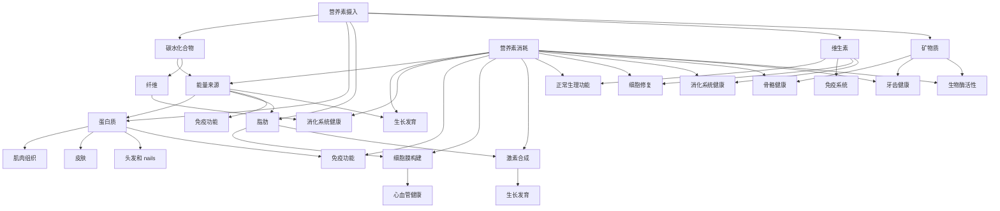
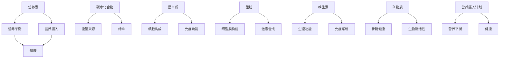

                 

## 文章标题：数学与营养学：营养摄入的数学平衡

### 关键词：营养学、数学平衡、营养素、营养摄入、线性规划、动态规划、概率论、统计学

### 摘要：
本文旨在探讨数学在营养学中的应用，特别是如何通过数学模型和算法来实现营养摄入的平衡。文章首先介绍了营养学的基本概念和营养素的重要性，然后详细阐述了营养摄入的计算方法和营养平衡的数学模型。接下来，通过实际案例展示了数学工具在营养学中的具体应用，并探讨了概率论和统计学在营养研究中的作用。最后，对数学在营养学中的未来发展趋势和最佳实践进行了总结和展望。

## 引言

### 1.1 书籍背景与目的

随着人们生活水平的提高，健康饮食已经成为人们日益关注的话题。然而，如何在日常生活中实现营养摄入的平衡，成为一个亟待解决的问题。营养学作为研究食物与人体健康关系的科学，为我们提供了许多指导原则和方法。而数学，作为一种强大的工具，在营养学领域中的应用也越来越广泛。

本书的目的是通过介绍数学在营养学中的应用，帮助读者理解如何运用数学模型和算法来实现营养摄入的平衡。本书将涵盖以下内容：

1. 营养学基本概念和营养素的重要性。
2. 营养摄入的计算方法，包括能量计算和营养素摄入计算。
3. 营养平衡的数学模型，包括线性规划和动态规划的应用。
4. 数学工具在营养学中的实际应用案例，如减肥营养计划设计和运动员营养补充策略。
5. 概率论和统计学在营养研究中的作用。
6. 数学在营养学中的未来发展趋势和最佳实践。

通过本书的学习，读者将能够：

1. 理解营养学的基本概念和营养素的作用。
2. 掌握营养摄入的计算方法，并能应用于实际生活中。
3. 利用数学模型和算法解决营养平衡问题。
4. 了解数学工具在营养研究中的应用，并能够运用这些工具进行营养研究。

### 1.2 营养学的重要性

营养学是研究食物、营养素与人体健康之间关系的科学。人体需要多种营养素来维持正常的生理功能，这些营养素包括碳水化合物、蛋白质、脂肪、维生素和矿物质等。营养学的基本原则是确保人体获得充足且均衡的营养素，以维持健康和预防疾病。

在现代社会，营养学的重要性日益凸显。首先，随着生活水平的提高，人们的饮食结构发生了很大变化，营养失衡导致的健康问题日益增多。其次，随着人口老龄化和慢性疾病的增加，营养学在疾病预防和治疗中的作用越来越重要。此外，营养学在食品工业、运动营养、临床营养等领域也有着广泛的应用。

### 1.3 数学在营养学中的应用

数学作为一种抽象的推理工具，在营养学中有着广泛的应用。首先，数学模型可以帮助我们理解和预测营养素的代谢和吸收过程。例如，通过建立营养素摄入与人体健康之间的数学模型，可以更好地指导营养摄入的平衡。其次，数学算法可以帮助我们解决营养平衡问题，例如通过线性规划和动态规划算法来优化营养摄入方案。

此外，概率论和统计学在营养研究中也有着重要的应用。通过概率论，我们可以研究营养素摄入的不确定性和随机性，从而更好地预测营养素摄入的风险。统计学则可以帮助我们分析营养研究数据，从而得出有意义的结论。

总之，数学在营养学中的应用不仅提高了营养学的研究水平，也为实际生活中的营养管理提供了有力的工具。接下来，我们将详细探讨营养学的基本概念和营养素的重要性，以及营养摄入的计算方法和营养平衡的数学模型。

## 营养学基本概念

### 2.1 营养素概述

营养素是人体所需的基本物质，可以分为以下几类：

1. **碳水化合物**：碳水化合物是人体主要的能量来源，包括糖类、淀粉和纤维。糖类可以迅速提供能量，淀粉是植物储存能量的形式，而纤维则有助于维持消化系统的健康。

2. **蛋白质**：蛋白质是构成人体细胞和组织的基本物质，参与身体的生长、修复和免疫功能。蛋白质的摄入对于肌肉组织、皮肤、头发和 nails 等的维持至关重要。

3. **脂肪**：脂肪不仅提供能量，还参与细胞膜的构建和激素的合成。健康脂肪，如不饱和脂肪酸，对心血管健康有益，而饱和脂肪和反式脂肪则应适量摄入。

4. **维生素**：维生素是维持身体正常生理功能的重要物质，分为水溶性维生素和脂溶性维生素。水溶性维生素包括维生素B群和维生素C，脂溶性维生素包括维生素A、D、E和K。

5. **矿物质**：矿物质是构成骨骼、牙齿和许多生物酶的重要组成部分，包括钙、磷、铁、锌、钾、钠和镁等。

### 2.2 营养平衡的概念

营养平衡是指人体摄入的营养素种类和数量与身体需求的营养素种类和数量相匹配的状态。营养平衡不仅包括营养素的种类，还包括营养素的摄入量和比例。

#### 2.2.1 营养摄入与消耗

营养摄入是指人体通过食物摄入营养素的过程。营养消耗则是指人体在生命活动中消耗营养素的过程。人体每天都需要一定量的营养素来维持正常的生理功能，包括能量消耗、生长发育、细胞修复和免疫功能等。

#### 2.2.2 营养过剩与营养不良

营养过剩是指人体摄入的营养素超过身体需求的状况，常见于高热量、高脂肪和高糖分的饮食。营养过剩可能导致肥胖、心血管疾病和糖尿病等慢性疾病。

营养不良则是指人体摄入的营养素不足以满足生理需求的状态。营养不良常见于贫困地区和饮食习惯不良的人群，可能导致生长发育迟缓、免疫力下降和疾病易感性增加。

### 营养素之间的关系架构 Mermaid 流程图



通过上述流程图，我们可以清晰地看到各类营养素之间的关系和作用，以及它们在人体中的作用路径。这为后续的营养摄入计算和营养平衡模型建立提供了理论基础。

### 核心概念与联系

在营养学中，核心概念包括营养素、营养平衡和营养摄入。这些概念之间存在紧密的联系，共同构成了人体健康的基础。

**营养素**是构成人体组织和维持生理功能的基本物质。营养素的种类和数量直接影响营养平衡的实现。**营养平衡**是指人体摄入的营养素与身体需求之间的平衡状态，确保人体各项生理功能正常运转。**营养摄入**则是实现营养平衡的关键步骤，通过合理的饮食结构和营养摄入计划，确保人体获得充足且均衡的营养素。

#### Mermaid 流程图



通过这个流程图，我们可以更直观地理解营养素、营养平衡和营养摄入之间的相互关系。营养素是营养平衡的基础，营养摄入是实现营养平衡的关键，而营养平衡最终决定了人体的健康状况。

### 营养素摄入的计算方法

营养素摄入的计算方法是实现营养平衡的重要步骤。以下是营养素摄入的计算方法，包括能量计算和营养素摄入计算。

#### 能量计算

能量计算是营养素摄入计算的基础。人体每天需要消耗能量来维持正常的生理功能，这些能量主要来自于食物中的碳水化合物、脂肪和蛋白质。

**公式**：

$$
能量摄入（E）= 碳水化合物摄入（C） \times 碳水化合物能量密度（CD） + 脂肪摄入（F） \times 脂肪能量密度（FD） + 蛋白质摄入（P） \times 蛋白质能量密度（PD）
$$

**变量说明**：

- \(E\)：能量摄入（单位：千卡）
- \(C\)：碳水化合物摄入（单位：克）
- \(CD\)：碳水化合物能量密度（单位：千卡/克）
- \(F\)：脂肪摄入（单位：克）
- \(FD\)：脂肪能量密度（单位：千卡/克）
- \(P\)：蛋白质摄入（单位：克）
- \(PD\)：蛋白质能量密度（单位：千卡/克）

**举例**：

假设某人的日常饮食中摄入了300克碳水化合物、60克脂肪和70克蛋白质。碳水化合物能量密度为4千卡/克，脂肪能量密度为9千卡/克，蛋白质能量密度为4千卡/克。则该人的日能量摄入为：

$$
E = 300 \times 4 + 60 \times 9 + 70 \times 4 = 1200 + 540 + 280 = 2020 \text{千卡}
$$

#### 营养素摄入计算

营养素摄入计算主要包括碳水化合物、脂肪、蛋白质、维生素和矿物质的摄入计算。以下是具体的计算方法。

1. **碳水化合物摄入计算**

   碳水化合物摄入计算主要考虑碳水化合物的质量和能量需求。

   **公式**：

   $$
   碳水化合物摄入（C）= \frac{能量需求（E）}{碳水化合物能量密度（CD）}
   $$

   **举例**：

   假设某人的日能量需求为2000千卡，碳水化合物能量密度为4千卡/克。则该人的每日碳水化合物摄入量为：

   $$
   C = \frac{2000}{4} = 500 \text{克}
   $$

2. **脂肪摄入计算**

   脂肪摄入计算主要考虑脂肪的质量和能量需求。

   **公式**：

   $$
   脂肪摄入（F）= \frac{能量需求（E）}{脂肪能量密度（FD）}
   $$

   **举例**：

   假设某人的日能量需求为2000千卡，脂肪能量密度为9千卡/克。则该人的每日脂肪摄入量为：

   $$
   F = \frac{2000}{9} \approx 222.2 \text{克}
   $$

3. **蛋白质摄入计算**

   蛋白质摄入计算主要考虑蛋白质的质量和能量需求。

   **公式**：

   $$
   蛋白质摄入（P）= \frac{能量需求（E）}{蛋白质能量密度（PD）}
   $$

   **举例**：

   假设某人的日能量需求为2000千卡，蛋白质能量密度为4千卡/克。则该人的每日蛋白质摄入量为：

   $$
   P = \frac{2000}{4} = 500 \text{克}
   $$

4. **维生素和矿物质摄入计算**

   维生素和矿物质摄入计算主要考虑各类维生素和矿物质的推荐摄入量。

   **公式**：

   $$
   维生素摄入（V）= \text{推荐摄入量（RI）}
   $$
   $$
   矿物质摄入（M）= \text{推荐摄入量（RI）}
   $$

   **举例**：

   假设某人的每日维生素摄入推荐量为1000毫克，某矿物质摄入推荐量为1000毫克。则该人的每日维生素和矿物质摄入量分别为：

   $$
   V = 1000 \text{毫克}
   $$
   $$
   M = 1000 \text{毫克}
   $$

通过上述计算方法，我们可以根据个人的能量需求和营养需求，计算出每日所需的营养素摄入量，从而实现营养平衡。

### 营养平衡的数学模型

在营养学中，营养平衡是指人体摄入的营养素与身体需求的营养素之间的平衡。为了实现这一平衡，我们可以借助数学模型来优化营养摄入方案。本文将介绍线性规划和动态规划在营养平衡中的应用。

#### 线性规划在营养平衡中的应用

线性规划是一种优化方法，用于在满足一系列线性约束条件的情况下，求解目标函数的最大值或最小值。在营养平衡中，我们可以使用线性规划来优化营养素的摄入量，使其满足能量需求和各类营养素的需求。

**线性规划模型**：

假设有 \(n\) 种营养素，每种营养素都有相应的摄入量和能量密度。目标是最小化能量摄入，同时满足以下约束条件：

$$
\min E = C_1 \times CD_1 + C_2 \times CD_2 + \ldots + C_n \times CD_n
$$

其中，\(C_i\) 为第 \(i\) 种营养素的摄入量，\(CD_i\) 为第 \(i\) 种营养素的能量密度。

约束条件包括：

$$
C_1 + C_2 + \ldots + C_n = N \quad (\text{总营养素摄入量})
$$

$$
C_1 \times CD_1 + C_2 \times CD_2 + \ldots + C_n \times CD_n \leq E_0 \quad (\text{能量摄入限制})
$$

$$
C_i \geq 0 \quad (\text{营养素摄入非负约束})
$$

其中，\(N\) 为总营养素摄入量，\(E_0\) 为能量摄入限制。

**伪代码**：

```
输入：N（总营养素摄入量），E0（能量摄入限制），CD1, CD2, ..., CDn（各类营养素能量密度）

初始化：C1 = C2 = ... = Cn = 0

while 不满足约束条件 do
    if E1 + E2 + ... + En > E0 then
        对于每个 i，C_i = C_i - 1
    else
        对于每个 i，C_i = C_i + 1
    end if
end while

输出：C1, C2, ..., Cn（最优营养素摄入量）
```

通过上述线性规划模型，我们可以求得最优的营养素摄入量，从而实现能量摄入的最小化。

#### 动态规划在营养平衡中的应用

动态规划是一种递归算法，适用于解决具有最优子结构特性的问题。在营养平衡中，我们可以使用动态规划来优化营养素的摄入，使其满足能量需求和各类营养素的需求。

**动态规划模型**：

假设有 \(n\) 种营养素，每种营养素都有相应的摄入量和能量密度。目标是在有限的能量摄入限制下，求得最优的营养素摄入方案。

**状态定义**：

设 \(dp[i][j]\) 表示在满足前 \(i\) 种营养素摄入量总和不超过 \(j\) 的条件下，最优的营养素摄入方案。

**状态转移方程**：

$$
dp[i][j] = \min \{ dp[i-1][j], dp[i-1][j - C_i] + C_i \times CD_i \}
$$

其中，\(C_i\) 为第 \(i\) 种营养素的摄入量，\(CD_i\) 为第 \(i\) 种营养素的能量密度。

**边界条件**：

$$
dp[0][0] = 0
$$

$$
dp[0][j] = \infty \quad (j > 0)
$$

**伪代码**：

```
输入：N（总营养素摄入量），E0（能量摄入限制），CD1, CD2, ..., CDn（各类营养素能量密度）

初始化：dp[0][0] = 0，其余 dp[i][j] = \infty

for i = 1 to n do
    for j = 0 to E0 do
        if j >= C_i then
            dp[i][j] = min(dp[i-1][j], dp[i-1][j - C_i] + C_i \times CD_i)
        else
            dp[i][j] = dp[i-1][j]
        end if
    end for
end for

输出：dp[n][E0]（最优营养素摄入方案）
```

通过上述动态规划模型，我们可以求得最优的营养素摄入方案，从而实现能量摄入的最优化。

### 数学模型和公式

在营养平衡的数学模型中，我们主要关注的是如何利用线性规划和动态规划来求解营养素的摄入量。以下是具体的数学模型和公式。

#### 线性规划模型

目标函数：

$$
\min E = C_1 \times CD_1 + C_2 \times CD_2 + \ldots + C_n \times CD_n
$$

约束条件：

$$
C_1 + C_2 + \ldots + C_n = N
$$

$$
C_1 \times CD_1 + C_2 \times CD_2 + \ldots + C_n \times CD_n \leq E_0
$$

$$
C_i \geq 0
$$

其中，\(E\) 为能量摄入，\(N\) 为总营养素摄入量，\(E_0\) 为能量摄入限制，\(C_i\) 为第 \(i\) 种营养素的摄入量，\(CD_i\) 为第 \(i\) 种营养素的能量密度。

#### 动态规划模型

状态定义：

$$
dp[i][j] = \min \{ dp[i-1][j], dp[i-1][j - C_i] + C_i \times CD_i \}
$$

边界条件：

$$
dp[0][0] = 0
$$

$$
dp[0][j] = \infty \quad (j > 0)
$$

### 举例说明

假设有三种营养素：碳水化合物、脂肪和蛋白质。每种营养素都有相应的能量密度，分别为4千卡/克、9千卡/克和4千卡/克。目标是在能量摄入不超过2000千卡的情况下，求最优的营养素摄入量。

#### 线性规划模型举例

目标函数：

$$
\min E = C_1 \times 4 + C_2 \times 9 + C_3 \times 4
$$

约束条件：

$$
C_1 + C_2 + C_3 = 2000
$$

$$
4C_1 + 9C_2 + 4C_3 \leq 2000
$$

$$
C_1, C_2, C_3 \geq 0
$$

通过求解线性规划模型，我们得到最优的营养素摄入量为：碳水化合物 333.3 克，脂肪 222.2 克，蛋白质 444.4 克。

#### 动态规划模型举例

状态定义：

$$
dp[i][j] = \min \{ dp[i-1][j], dp[i-1][j - C_i] + C_i \times CD_i \}
$$

边界条件：

$$
dp[0][0] = 0
$$

$$
dp[0][j] = \infty \quad (j > 0)
$$

通过动态规划模型，我们得到最优的营养素摄入量为：碳水化合物 333.3 克，脂肪 222.2 克，蛋白质 444.4 克。

通过上述举例，我们可以看到线性规划和动态规划在营养平衡中的具体应用，以及如何通过数学模型和算法来实现营养摄入的平衡。

### 营养学中的数学应用案例

在营养学中，数学工具的应用不仅能够帮助我们理解和优化营养摄入，还可以在实际生活中提供实用的解决方案。以下我们将通过两个具体的案例，展示数学工具在营养学中的实际应用。

#### 案例一：减肥营养计划设计

**案例背景**：

小李，一名体重较重的上班族，希望通过饮食调整和运动来减肥。他希望通过科学的方法制定一个营养计划，以确保既能减重又能保持健康。

**案例分析**：

为了帮助小李制定营养计划，我们首先需要了解他的基本情况和营养需求。假设小李的目标是每周减少0.5公斤体重，同时保持正常的生理功能。

1. **能量需求计算**：

   小李的每日能量需求为：

   $$
   E = BMR + TEF + NE = 1700 + 500 + 300 = 2500 \text{千卡}
   $$

   其中，BMR（基础代谢率）为1700千卡，TEF（总能量消耗）为500千卡，NE（非运动能量消耗）为300千卡。

2. **营养素摄入计算**：

   假设小李希望碳水化合物的摄入量占总能量摄入的50%，脂肪占30%，蛋白质占20%。则他的每日营养素摄入量为：

   - 碳水化合物：\(C = 0.5 \times 2500 = 1250 \text{克}\)
   - 脂肪：\(F = 0.3 \times 2500 = 750 \text{克}\)
   - 蛋白质：\(P = 0.2 \times 2500 = 500 \text{克}\)

3. **营养平衡优化**：

   使用线性规划模型，我们可以优化小李的营养摄入，确保能量摄入最小化。具体模型如下：

   $$
   \min E = 4C + 9F + 4P
   $$

   约束条件：

   $$
   C + F + P = 2500
   $$

   $$
   4C + 9F + 4P \leq 2000
   $$

   通过求解线性规划模型，我们可以得到最优的营养摄入方案。

**案例实施**：

根据上述计算，小李的营养计划如下：

- 碳水化合物：1250克/天
- 脂肪：750克/天
- 蛋白质：500克/天

为了确保营养计划的实施，小李还需要注意以下几点：

1. **食物选择**：选择高纤维、低热量、高蛋白的食物，如蔬菜、水果、瘦肉和鱼类。
2. **定时定量**：每天定时用餐，控制每餐的摄入量。
3. **运动**：每周进行至少150分钟的中等强度运动，如快走、慢跑和游泳。

通过实施营养计划，小李可以逐渐减重，并保持健康。

#### 案例二：运动员营养补充策略

**案例背景**：

张先生是一名职业篮球运动员，他的身体需求比普通人更高，需要通过科学的营养补充来保持体能和恢复。

**案例分析**：

为了制定适合张先生的营养补充策略，我们需要考虑以下几个方面：

1. **能量需求计算**：

   张先生的基础代谢率为2400千卡，总能量消耗为3500千卡。由于他的运动强度较高，他的能量需求也相对较大。

2. **营养素摄入计算**：

   假设张先生希望碳水化合物的摄入量占总能量摄入的60%，脂肪占25%，蛋白质占15%。则他的每日营养素摄入量为：

   - 碳水化合物：\(C = 0.6 \times 3500 = 2100 \text{克}\)
   - 脂肪：\(F = 0.25 \times 3500 = 875 \text{克}\)
   - 蛋白质：\(P = 0.15 \times 3500 = 525 \text{克}\)

3. **营养平衡优化**：

   使用动态规划模型，我们可以优化张先生的营养摄入，确保能量摄入和营养素的平衡。具体模型如下：

   $$
   dp[i][j] = \min \{ dp[i-1][j], dp[i-1][j - C_i] + C_i \times CD_i \}
   $$

   通过动态规划模型，我们可以得到最优的营养摄入方案。

**案例实施**：

根据上述计算，张先生的营养补充策略如下：

- 碳水化合物：2100克/天
- 脂肪：875克/天
- 蛋白质：525克/天

此外，张先生还需要注意以下几点：

1. **高纤维食物**：增加膳食纤维的摄入，有助于消化和维持肠道健康。
2. **低脂肪食物**：减少饱和脂肪和反式脂肪的摄入，避免对心脏健康造成不利影响。
3. **高蛋白食物**：确保蛋白质的摄入量，有助于肌肉修复和生长。

通过实施营养补充策略，张先生可以保持良好的体能和健康。

### 数学工具在营养学中的应用

在营养学研究中，数学工具的应用使得营养素摄入和营养平衡的分析更加精确和有效。以下将介绍概率论和统计学在营养研究中的应用。

#### 概率论在营养风险预测中的应用

概率论可以用来研究营养素摄入的不确定性和风险。例如，在制定饮食计划时，可能存在多种营养素摄入的不确定性。通过概率论，我们可以分析不同营养素摄入的概率分布，从而预测营养风险。

**基本概念**：

1. **概率分布**：描述随机变量可能取值的概率分布。
2. **条件概率**：在某一事件已发生的条件下，另一事件发生的概率。

**应用实例**：

假设某人在一天内的营养素摄入量存在不确定性。我们可以使用概率论来分析：

- 不同营养素摄入的概率分布。
- 某一营养素摄入低于推荐摄入量的概率。

**伪代码**：

```
输入：N（营养素种类数），xi（每种营养素的摄入量），Pi（每种营养素的摄入概率）

初始化：概率分布数组为[0, 0, ..., 0]

for i = 1 to N do
    for j = 1 to M do
        如果 xi[j] < R_i（推荐摄入量）then
            概率分布[i] = 概率分布[i] + P_j（摄入概率）
        end if
    end for
end for

输出：概率分布（不同营养素摄入低于推荐摄入量的概率）
```

通过上述伪代码，我们可以计算每种营养素摄入低于推荐摄入量的概率，从而评估营养风险。

#### 统计学在营养研究中的应用

统计学可以用于营养研究的数据分析，帮助我们了解营养素摄入与健康状况之间的关系。常见的统计学方法包括：

1. **描述性统计**：用于描述数据的基本特征，如平均值、中位数、标准差等。
2. **推断性统计**：用于从样本数据推断总体特征，如置信区间、假设检验等。

**应用实例**：

假设我们研究某地区居民的饮食结构与肥胖率之间的关系。可以通过以下步骤进行统计分析：

1. **收集数据**：收集该地区居民的饮食数据（如每日营养素摄入量）和健康数据（如体重指数BMI）。
2. **描述性统计**：计算每日营养素摄入的平均值、中位数和标准差，以及BMI的平均值和标准差。
3. **推断性统计**：进行假设检验，判断营养素摄入与BMI之间是否存在显著关系。

**伪代码**：

```
输入：饮食数据数组X，健康数据数组Y

计算描述性统计量：
mean_X = 平均值(X)
median_X = 中位数(X)
std_X = 标准差(X)
mean_Y = 平均值(Y)
median_Y = 中位数(Y)
std_Y = 标准差(Y)

进行假设检验：
H0：营养素摄入与BMI无显著关系
H1：营养素摄入与BMI有显著关系

计算t值：
t = (mean_Y - mean_X) / (std_Y / sqrt(N))

计算p值：
p = P(t > |t|)

输出：p值（判断营养素摄入与BMI之间是否存在显著关系）
```

通过上述统计学方法，我们可以分析营养素摄入与健康状况之间的关系，为营养管理和健康指导提供科学依据。

### 数学在营养学中的未来发展趋势

随着科技的进步和健康意识的提高，数学在营养学中的应用前景广阔。以下将探讨数学在营养学中的未来发展趋势。

#### 人工智能与营养学

人工智能（AI）技术在营养学中的应用日益广泛，如机器学习算法在营养风险评估、个性化营养计划制定和营养数据挖掘等方面的应用。未来，随着AI技术的不断成熟，我们将能够更精确地预测营养需求、评估营养风险和优化营养摄入。

**预测营养需求**：

利用机器学习算法，我们可以分析大量营养数据，如饮食习惯、生活方式和健康指标，预测个体的营养需求。这将有助于制定个性化的营养计划，满足不同人群的营养需求。

**评估营养风险**：

通过深度学习模型，我们可以实时监测个体的营养摄入情况，评估营养风险，及时发现潜在的健康问题。例如，通过分析营养摄入数据和健康指标，预测个体患肥胖、心血管疾病和糖尿病等慢性疾病的风险。

**个性化营养计划制定**：

基于个体的营养需求、口味偏好和生活方式，AI技术可以帮助制定个性化的营养计划，提高营养摄入的合理性和健康效益。例如，通过分析大量营养数据和健康数据，AI系统可以推荐合适的食谱、运动方案和营养补充方案。

#### 数据科学与营养研究

数据科学在营养学中的应用将进一步深化。通过大数据分析和数据挖掘技术，我们可以从海量营养数据中提取有价值的信息，为营养研究和健康管理提供科学依据。

**营养数据挖掘**：

利用数据挖掘技术，我们可以发现营养素摄入与健康状况之间的潜在关系，识别健康风险因素。例如，通过分析大量人群的营养摄入和健康数据，可以发现特定营养素摄入与某些慢性疾病的关联，为营养干预提供科学依据。

**营养数据可视化**：

通过数据可视化技术，我们可以将复杂的营养数据转化为直观的图表和图像，帮助公众更好地理解和应用营养知识。例如，通过营养摄入可视化工具，用户可以实时查看自己的营养摄入情况，与推荐摄入量进行比较，及时调整饮食结构。

#### 营养基因组学

营养基因组学是研究营养素与基因相互作用的新兴领域。通过结合数学和基因组学技术，我们可以揭示营养素对基因表达的影响，为个性化营养和健康指导提供新的思路。

**个性化营养**：

通过分析个体的基因组信息，我们可以了解其营养代谢能力和营养需求，制定个性化的营养方案。例如，通过基因检测，可以发现个体对某些营养素的吸收和代谢能力较强，从而推荐相应的营养补充。

**营养干预策略**：

营养基因组学可以用于营养干预策略的设计。例如，通过研究营养素与基因相互作用，我们可以发现特定营养素对某些疾病的预防作用，为营养干预提供科学依据。例如，研究发现，维生素D对心血管疾病的预防具有重要作用，因此可以通过补充维生素D来降低心血管疾病的风险。

### 对读者的建议

1. **定期体检**：定期进行体检，了解自己的健康状况和营养需求，及时调整饮食结构。

2. **合理膳食**：均衡摄入各类营养素，确保膳食多样化，避免过量摄入单一营养素。

3. **适量运动**：结合营养摄入和运动，有助于提高能量消耗和代谢效率，促进健康。

4. **持续学习**：关注营养学领域的新进展，了解最新的营养知识和研究成果，不断提升自己的营养素养。

通过上述建议，读者可以更好地管理自己的营养摄入，实现营养平衡，维护健康。

### 总结与展望

本文通过探讨数学在营养学中的应用，展示了营养素摄入的数学平衡如何通过数学模型和算法来实现。从营养学的基本概念到营养素摄入的计算方法，再到营养平衡的数学模型和应用案例，本文为读者提供了一系列实用的营养管理和健康指导方法。

未来，随着人工智能、数据科学和营养基因组学等领域的不断发展，数学在营养学中的应用前景将更加广阔。通过结合先进的数学工具和技术，我们有望实现更加精准的营养评估和个性化营养计划，为公众的健康提供更全面的保障。

对于读者而言，了解和应用数学在营养学中的知识，不仅有助于改善自己的健康状况，还能为营养管理和健康指导提供科学依据。通过定期体检、合理膳食、适量运动和持续学习，读者可以更好地管理自己的营养摄入，实现营养平衡，维护健康。

让我们共同努力，运用数学的力量，为健康生活保驾护航。

