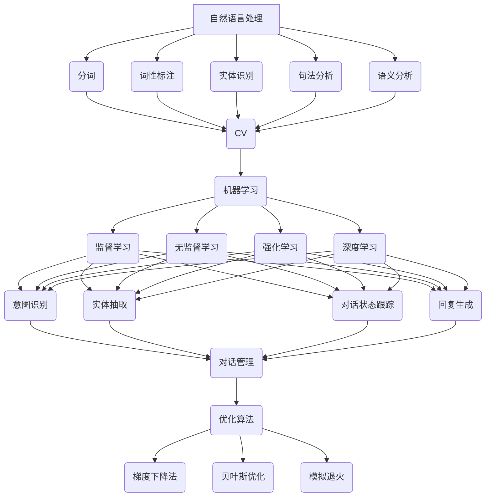

                 

### 1. 书名理解

《数学与虚拟助手：人工智能对话的数学基础》这本书的标题清晰展示了其核心内容：一是“数学”，二是“虚拟助手”，三是“人工智能对话的数学基础”。首先，“数学”作为基础学科，在本书中被视为构建人工智能对话系统的基石。通过数学模型、算法和理论，可以为虚拟助手提供强大的计算能力和智能决策支持。其次，“虚拟助手”是指人工智能对话系统，它能够通过自然语言理解和生成，与用户进行交互，提供个性化服务。最后，“人工智能对话的数学基础”则强调了本书的重点在于介绍数学在人工智能对话系统中的应用和实现方法。

在理解书名的基础上，我们可以进一步分析书中的内容结构。本书旨在为读者提供一个全面而深入的数学基础，以便他们能够理解和构建现代人工智能对话系统。书中不仅介绍了数学的基本概念和原理，还详细讨论了如何将数学应用于人工智能对话系统的构建和优化。具体来说，本书涵盖了以下几个方面的内容：

1. **数学基础**：包括基础数学知识回顾、离散数学在人工智能对话中的应用，以及数学工具箱的使用。
   
2. **概率论与统计基础**：介绍概率论和统计学的基本概念，以及它们在人工智能对话系统中的应用案例。

3. **线性代数与机器学习**：讨论线性代数的基础知识，以及如何将其应用于机器学习和神经网络。

4. **优化算法**：介绍优化算法的基本概念和应用案例，包括无约束优化和有约束优化。

5. **深度学习与神经网络**：讲解深度学习和神经网络的基本概念，以及实际应用场景。

6. **对话系统构建与优化**：讨论对话系统的基本架构和优化策略，以及实际案例分析。

7. **未来展望与挑战**：探讨对话系统的发展趋势、当前面临的挑战和未来的研究方向。

通过对书名的深入理解和内容结构的分析，我们可以更好地把握本书的主题和结构，为后续章节的撰写提供清晰的指导。

### 2. 目录大纲设计思路

在设计《数学与虚拟助手：人工智能对话的数学基础》的目录大纲时，我们需要遵循几个关键原则，以确保内容的逻辑性和读者的易读性。

#### 2.1 章节主题明确

每个章节都应该有一个明确的主题，这有助于读者快速理解章节的核心内容。在确定章节主题时，我们需要结合本书的整体结构和目标读者，确保每个章节都能为读者提供有价值的知识和技能。

#### 2.2 逻辑顺序合理

章节之间的逻辑顺序应该合理，使得读者可以逐步深入理解主题。首先，我们从基础数学知识入手，然后逐步引入更复杂的概念和应用，最后探讨实际案例和未来展望。这样的顺序有助于读者建立完整的知识体系。

#### 2.3 内容完整性

确保所有核心主题都得到了覆盖，满足完整性的要求。在编写每个章节时，我们需要仔细检查，确保没有遗漏关键内容。同时，每个章节都应该包含相应的理论知识、实际应用案例和未来展望。

#### 2.4 吸引读者

为了吸引读者，我们可以在章节标题中使用引人入胜的词汇和短语，使读者对每个章节产生兴趣。此外，在章节开头和结尾可以添加简要的总结和展望，引导读者进入下一章节的内容。

#### 2.5 分为几个部分

将整个内容分为几个部分，每个部分代表一个知识模块。这样可以方便读者按照自己的学习进度进行阅读，同时也可以帮助读者更好地掌握每个知识模块。

#### 2.6 标题格式规范

为了保持文章的整体性和专业性，我们需要遵循一定的标题格式规范。例如，一级标题使用“##”，二级标题使用“###”，以此类推。这样的格式不仅使文章结构清晰，还方便读者快速定位内容。

### 3. 目录大纲结构

根据上述设计思路，我们可以设计一个包含以下章节的目录大纲：

### 第一部分：引言与数学基础

## 第1章：引言与概述

### 1.1 人工智能对话系统概述

### 1.2 虚拟助手的发展背景

### 1.3 本书结构安排

### 第二部分：数学基础

## 第2章：数学基础

### 2.1 数学知识回顾

### 2.2 离散数学在人工智能对话中的应用

### 2.3 数学工具箱

### 第三部分：概率论与统计基础

## 第3章：概率论与统计基础

### 3.1 概率论基本概念

### 3.2 统计学基础

### 3.3 应用案例

### 第四部分：线性代数与机器学习

## 第4章：线性代数与机器学习

### 4.1 线性代数基础

### 4.2 机器学习中的线性代数应用

### 4.3 神经网络基础

### 第五部分：优化算法

## 第5章：优化算法

### 5.1 优化算法基本概念

### 5.2 应用案例分析

### 第六部分：深度学习与神经网络

## 第6章：深度学习与神经网络

### 6.1 深度学习基本概念

### 6.2 实际应用场景

### 第七部分：对话系统构建与优化

## 第7章：对话系统构建与优化

### 7.1 对话系统基本架构

### 7.2 对话系统优化策略

### 7.3 案例分析

### 第八部分：未来展望与挑战

## 第8章：未来展望与挑战

### 8.1 对话系统发展趋势

### 8.2 当前面临的挑战

### 8.3 未来研究方向

通过这个目录大纲，我们可以清晰地展示本书的内容结构和逻辑顺序，帮助读者更好地理解和学习。

### 4. 详细目录大纲设计

为了确保文章的连贯性和逻辑性，我们将详细设计本书的目录大纲，每个章节都将包含丰富的内容，以满足读者对专业知识的深入需求。

#### 第一部分：引言与数学基础

**第1章：引言与概述**

- **1.1 人工智能对话系统概述**

  - 介绍人工智能对话系统的定义、基本架构和分类。
  - 演示一些典型的对话系统应用场景，如虚拟客服、智能助手和语音助手。

- **1.2 虚拟助手的发展背景**

  - 回顾虚拟助手的发展历程，从早期的规则引擎到现代的基于深度学习的方法。
  - 分析虚拟助手在不同行业中的应用，如金融、医疗和零售。

- **1.3 本书结构安排**

  - 概述本书的结构，包括各个部分的主题和目标。
  - 引导读者如何系统地学习数学在人工智能对话系统中的应用。

**第2章：数学基础**

- **2.1 数学知识回顾**

  - 回顾初中和高中数学的基本概念，如代数、几何和三角函数。
  - 介绍数学在计算和数据处理中的基础作用。

- **2.2 离散数学在人工智能对话中的应用**

  - 讨论离散数学在人工智能对话系统中的重要性，如图论和组合数学。
  - 举例说明如何使用图论解决对话系统中的路径规划和搜索问题。

- **2.3 数学工具箱**

  - 介绍常用的数学工具，如微积分、概率论和线性代数。
  - 讲解如何使用这些工具来解决对话系统中的复杂问题。

#### 第二部分：概率论与统计基础

**第3章：概率论与统计基础**

- **3.1 概率论基本概念**

  - 定义概率论的基本概念，如随机事件、概率分布和条件概率。
  - 讲解贝叶斯定理及其在对话系统中的应用。

- **3.2 统计学基础**

  - 介绍统计学的基本概念，如描述统计、推断统计和假设检验。
  - 讨论如何使用统计学方法来评估对话系统的性能。

- **3.3 应用案例**

  - 分析概率论和统计学的实际应用案例，如语音识别和自然语言处理。
  - 展示如何通过概率和统计方法来提高对话系统的准确性和可靠性。

#### 第三部分：线性代数与机器学习

**第4章：线性代数与机器学习**

- **4.1 线性代数基础**

  - 介绍线性代数的基本概念，如向量、矩阵和行列式。
  - 讲解如何使用线性代数解决线性方程组和特征分解问题。

- **4.2 机器学习中的线性代数应用**

  - 介绍线性代数在机器学习中的应用，如线性回归和逻辑回归。
  - 分析线性模型在对话系统中的应用，如情感分析和分类问题。

- **4.3 神经网络基础**

  - 介绍神经网络的基本结构，如前馈神经网络和卷积神经网络。
  - 讨论如何使用神经网络进行特征提取和分类。

#### 第四部分：优化算法

**第5章：优化算法**

- **5.1 优化算法基本概念**

  - 定义优化算法的基本概念，如无约束优化和有约束优化。
  - 讲解常见的优化算法，如梯度下降法和牛顿法。

- **5.2 应用案例分析**

  - 分析优化算法在实际对话系统中的应用，如个性化推荐和广告投放。
  - 展示如何通过优化算法提高对话系统的效率和性能。

#### 第五部分：深度学习与神经网络

**第6章：深度学习与神经网络**

- **6.1 深度学习基本概念**

  - 介绍深度学习的基本概念，如神经网络架构和训练过程。
  - 讨论深度学习在对话系统中的优势和应用。

- **6.2 实际应用场景**

  - 分析深度学习在图像识别、语音识别和自然语言处理中的实际应用。
  - 展示如何使用深度学习构建高效的对话系统。

#### 第六部分：对话系统构建与优化

**第7章：对话系统构建与优化**

- **7.1 对话系统基本架构**

  - 介绍对话系统的基本架构，如对话管理模块、意图识别模块和实体抽取模块。
  - 讨论如何设计高效和可扩展的对话系统架构。

- **7.2 对话系统优化策略**

  - 介绍对话系统的优化策略，如强化学习和迁移学习。
  - 展示如何通过优化策略提高对话系统的性能和用户体验。

- **7.3 案例分析**

  - 分析实际对话系统项目案例，如虚拟客服和智能助手。
  - 讨论如何解决对话系统中的常见问题和挑战。

#### 第七部分：未来展望与挑战

**第8章：未来展望与挑战**

- **8.1 对话系统发展趋势**

  - 探讨对话系统的发展趋势，如多模态交互和增强现实。
  - 分析对话系统在未来的潜在应用场景和市场规模。

- **8.2 当前面临的挑战**

  - 讨论对话系统当前面临的挑战，如隐私保护和数据安全性。
  - 分析如何解决这些挑战，并确保对话系统的可靠性和可持续性。

- **8.3 未来研究方向**

  - 提出对话系统未来的研究方向，如自然语言理解和人机交互。
  - 展望对话系统在人工智能领域的发展前景。

通过这个详细的目录大纲，我们可以为读者提供全面而深入的知识体系，帮助他们更好地理解和应用数学在人工智能对话系统中的基础。

### 5. 格式要求

为了确保文章的整洁和专业性，我们将按照markdown格式进行内容排版。以下是markdown格式的一些基本规则：

- **标题**：使用`#`符号进行层级划分，一级标题用`##`，二级标题用`###`，依此类推。
- **段落**：每个段落开头都要留一个空行，以区分不同的段落。
- **列表**：使用`-`或者`*`来创建无序列表，使用`1.`来创建有序列表。
- **代码块**：使用三个反引号（```)将代码块包围，以保持代码格式和缩进。
- **引用**：使用`>`符号将引用内容向右对齐，如`>` 引用内容。
- **公式**：使用latex格式编写数学公式，用`$$`包围整个公式，段落内公式用 `$`包围。
- **链接**：使用`[链接文本](链接地址)`来创建链接。

### 示例

#### 5.1 标题

```
## 一级标题
### 二级标题
#### 三级标题
```

#### 5.2 段落

```
这是第一段。
这是第二段。

```

#### 5.3 列表

```
- 无序列表项1
- 无序列表项2

1. 有序列表项1
2. 有序列表项2
```

#### 5.4 代码块

```
```
#include <iostream>
using namespace std;

int main() {
    cout << "Hello, World!";
    return 0;
}
```

#### 5.5 引用

```
> 引用内容
```

#### 5.6 公式

```
$$
E = mc^2
$$

$
x < y
$
```

#### 5.7 链接

```
[Google](https://www.google.com)
```

### 6. 作者信息

在文章末尾，我们需要添加作者信息，具体格式如下：

```
作者：AI天才研究院/AI Genius Institute & 禅与计算机程序设计艺术 /Zen And The Art of Computer Programming
```

### 7. 完整性要求

为了确保文章内容的完整性，每个小节需要满足以下要求：

- **背景介绍**：每个小节开头需要简要介绍相关背景知识，帮助读者了解上下文。
- **核心概念与联系**：明确阐述核心概念，并通过Mermaid流程图展示概念之间的关系架构。
- **核心算法原理讲解**：使用伪代码详细阐述算法原理，确保读者可以理解算法的实现过程。
- **数学模型和公式**：详细讲解数学模型和公式，包括推导过程和实际应用。
- **举例说明**：提供具体的例子，帮助读者理解抽象概念。
- **项目实战**：介绍开发环境搭建、源代码实现和代码解读，结合实际案例进行分析。
- **最佳实践 tips**：总结最佳实践和注意事项，为读者提供实用的建议。
- **拓展阅读**：推荐相关的拓展阅读资源，帮助读者深入探索相关知识。

### 7.1 背景介绍

人工智能（AI）作为计算机科学的一个分支，通过模拟人类智能行为，使计算机能够执行复杂任务。其中，对话系统是人工智能的一个重要应用领域，它通过自然语言理解和生成，实现人与机器的交互。随着人工智能技术的快速发展，虚拟助手逐渐成为人们日常生活中不可或缺的一部分，如智能客服、语音助手和虚拟客服等。

在构建高效的虚拟助手时，数学基础起着至关重要的作用。数学不仅提供了描述自然语言和处理数据的方法，还为优化算法和模型提供了理论基础。例如，概率论和统计学的应用使得虚拟助手能够准确理解用户意图，线性代数和优化算法则帮助提高系统的效率和准确性。

本文旨在探讨数学在人工智能对话系统中的基础作用，通过逐步分析数学理论的应用，帮助读者深入理解虚拟助手的构建和优化方法。本文将分为以下几个部分：

1. **数学基础**：回顾基础数学知识，介绍离散数学在人工智能对话中的应用。
2. **概率论与统计基础**：讲解概率论和统计学的基本概念及其在对话系统中的应用。
3. **线性代数与机器学习**：讨论线性代数在机器学习中的应用，介绍深度学习和神经网络。
4. **优化算法**：介绍优化算法的基本概念和应用案例。
5. **对话系统构建与优化**：探讨对话系统的基本架构和优化策略。
6. **未来展望与挑战**：分析对话系统的发展趋势和面临的挑战。

通过本文的详细分析，读者可以系统地了解数学在虚拟助手构建中的应用，从而为实际项目提供有力的理论支持。

### 7.2 核心概念与联系

在人工智能对话系统中，理解核心概念及其相互关系至关重要。以下将详细阐述几个核心概念，并通过Mermaid流程图展示它们之间的联系。

**1. 自然语言处理（NLP）**

自然语言处理是人工智能对话系统的核心组成部分，旨在使计算机能够理解、解释和生成自然语言。NLP的关键概念包括：

- **分词**：将文本拆分为单词或短语。
- **词性标注**：识别每个单词的词性，如名词、动词、形容词等。
- **实体识别**：识别文本中的特定实体，如人名、地点、组织等。
- **句法分析**：分析句子的结构，理解句子成分之间的关系。
- **语义分析**：理解句子的意义，包括词义消歧和上下文理解。

**2. 计算机视觉（CV）**

计算机视觉涉及使计算机理解和解释视觉信息，这对于虚拟助手理解用户的视觉输入至关重要。核心概念包括：

- **图像识别**：识别图像中的对象和场景。
- **目标检测**：定位图像中的对象及其位置。
- **图像分割**：将图像分割成不同的区域。
- **面部识别**：识别和验证图像中的人脸。

**3. 机器学习（ML）**

机器学习为虚拟助手提供了自我学习和优化的能力，是实现智能对话的关键。核心概念包括：

- **监督学习**：通过已标记的数据训练模型。
- **无监督学习**：从未标记的数据中发现模式。
- **强化学习**：通过与环境的交互来学习最优策略。
- **深度学习**：利用多层神经网络进行特征学习和预测。

**4. 对话管理**

对话管理是虚拟助手的核心功能，负责协调对话流程和用户交互。核心概念包括：

- **意图识别**：识别用户的意图。
- **实体抽取**：从用户的输入中提取关键信息。
- **对话状态跟踪**：记录和更新对话状态。
- **回复生成**：生成合适的回复。

**5. 优化算法**

优化算法用于提升虚拟助手的性能和效率。核心概念包括：

- **梯度下降法**：用于训练神经网络。
- **贝叶斯优化**：用于超参数调优。
- **模拟退火**：用于复杂优化问题。

**Mermaid流程图**

下面是一个Mermaid流程图，展示了上述核心概念之间的关系：



通过上述流程图，我们可以清晰地看到自然语言处理、计算机视觉、机器学习和对话管理如何相互关联，并共同构建一个高效的虚拟助手系统。了解这些核心概念及其相互关系，有助于我们更好地设计和优化虚拟助手，实现更加智能和高效的对话交互。

### 7.3 核心算法原理讲解

在本节中，我们将详细介绍几个核心算法的原理，并通过伪代码进行详细阐述，以便读者更好地理解其实现过程。

#### 1. 梯度下降法

**原理**：梯度下降法是一种优化算法，用于最小化目标函数。其基本思想是沿着目标函数的梯度方向逐步调整参数，以找到最小值。

**伪代码**：

```
初始化参数 θ
设定学习率 α
设定迭代次数 n
对于 i 从 1 到 n：
    计算 ∇θJ(θ)，即目标函数 J(θ) 关于参数 θ 的梯度
    更新 θ：θ = θ - α * ∇θJ(θ)
```

**示例**：

假设我们要最小化目标函数 f(x) = x^2，使用梯度下降法进行优化。

```
初始化 x = 5，学习率 α = 0.1，迭代次数 n = 100
对于 i 从 1 到 100：
    计算梯度：gradient = 2x
    更新 x：x = x - α * gradient
    打印 x
```

执行上述伪代码后，我们可以看到 x 的值逐渐逼近最小值 0。

#### 2. 随机梯度下降（SGD）

**原理**：随机梯度下降是梯度下降法的一种变体，它每次迭代只使用一个样本而不是整个数据集，从而加快收敛速度。

**伪代码**：

```
初始化参数 θ
设定学习率 α
设定批次大小 m
对于 i 从 1 到 n：
    从数据集中随机选择 m 个样本
    计算 ∇θJ(θ)，即目标函数 J(θ) 关于参数 θ 的梯度
    更新 θ：θ = θ - α * ∇θJ(θ)
```

**示例**：

假设我们要使用随机梯度下降法最小化目标函数 f(x) = x^2。

```
初始化 x = 5，学习率 α = 0.1，批次大小 m = 10，迭代次数 n = 100
对于 i 从 1 到 100：
    随机选择 m 个样本
    计算梯度：gradient = 2x
    更新 x：x = x - α * gradient
    打印 x
```

#### 3. 反向传播算法

**原理**：反向传播算法是训练神经网络的关键算法，它通过计算每个神经元输出误差的梯度，反向传播到前一层，更新网络权重。

**伪代码**：

```
初始化网络参数
前向传播（计算输出和误差）
计算当前层每个神经元的梯度
对于每一层从后向前：
    更新权重：Δθ = Δθ - α * ∇θJ(θ)
    更新偏置：Δb = Δb - α * ∇bJ(θ)
```

**示例**：

假设我们要使用反向传播算法训练一个简单的神经网络。

```
初始化网络参数
for each training example (x, y):
    前向传播：计算输出 ŷ 和误差 E = (y - ŷ)^2
    计算梯度：∇θE = 2(ŷ - y) * ŷ'（ŷ' 是输出层的激活值）
    反向传播：更新权重和偏置
```

通过上述伪代码，我们可以看到反向传播算法如何计算每个神经元的梯度，并更新网络权重，从而逐步优化神经网络。

#### 4. 贝叶斯优化

**原理**：贝叶斯优化是一种用于超参数调优的优化算法，它通过模拟贝叶斯模型来选择下一个优化点。

**伪代码**：

```
初始化超参数空间
初始化模型
计算初始点的损失函数值
while 不满足停止条件：
    使用贝叶斯模型选择下一个优化点
    训练模型并计算损失函数值
    更新贝叶斯模型
```

**示例**：

假设我们要使用贝叶斯优化选择神经网络的学习率。

```
初始化学习率范围 [0.01, 0.1]
初始化模型
for each learning rate in range：
    训练模型并计算损失函数值
    更新贝叶斯模型
选择最佳学习率并训练最终模型
```

通过贝叶斯优化，我们可以找到最优的超参数，从而提高模型的性能。

这些核心算法的原理和伪代码为构建和优化虚拟助手提供了重要的理论基础。在实际应用中，通过这些算法，我们可以不断调整和优化虚拟助手的性能，使其更准确地理解用户意图，提供更高质量的对话体验。

### 7.4 数学模型和公式讲解

在人工智能对话系统中，数学模型和公式是理解和实现核心算法的关键。以下我们将详细讲解几个重要的数学模型和公式，并解释其在对话系统中的应用。

#### 1. 贝叶斯定理

贝叶斯定理是概率论中的一个核心公式，它描述了在已知某些条件下，事件发生的概率如何通过先验概率和条件概率进行更新。

**公式**：
$$
P(A|B) = \frac{P(B|A) \cdot P(A)}{P(B)}
$$
其中，\(P(A|B)\) 表示在事件 \(B\) 发生的条件下事件 \(A\) 发生的概率，\(P(B|A)\) 表示在事件 \(A\) 发生的条件下事件 \(B\) 发生的概率，\(P(A)\) 和 \(P(B)\) 分别表示事件 \(A\) 和事件 \(B\) 发生的概率。

**应用**：贝叶斯定理在对话系统中用于意图识别和实体抽取。例如，当我们需要识别用户意图时，可以通过计算用户输入与不同意图的关联概率，选择概率最大的意图作为用户的真实意图。

#### 2. 逻辑回归

逻辑回归是一种广义线性模型，用于分类问题。它通过将线性组合映射到概率分布来实现分类。

**公式**：
$$
\hat{P}(y=1) = \frac{1}{1 + e^{-(\beta_0 + \beta_1x_1 + \beta_2x_2 + ... + \beta_nx_n})}
$$
其中，\(\hat{P}(y=1)\) 表示因变量 \(y\) 为 1 的条件概率，\(\beta_0, \beta_1, \beta_2, ..., \beta_n\) 是模型的参数，\(x_1, x_2, ..., x_n\) 是自变量。

**应用**：逻辑回归常用于分类问题，如对话系统中的意图分类。通过训练模型，我们可以预测用户输入对应的意图类别。

#### 3. 马尔可夫模型

马尔可夫模型是一种用于序列数据建模的概率模型，它假设当前状态仅取决于前一个状态，与之前的所有状态无关。

**公式**：
$$
P(X_t = x_t | X_{t-1} = x_{t-1}, X_{t-2} = x_{t-2}, ...) = P(X_t = x_t | X_{t-1} = x_{t-1})
$$
其中，\(X_t\) 表示第 \(t\) 个时刻的状态，\(x_t\) 表示状态的具体取值。

**应用**：马尔可夫模型在对话系统中用于序列决策，如对话管理。它可以帮助我们预测用户下一个可能的动作，从而生成合适的回复。

#### 4. 卷积神经网络（CNN）

卷积神经网络是一种深度学习模型，特别适用于图像识别和计算机视觉任务。它通过卷积操作提取图像中的特征。

**公式**：
$$
h_{ij}^{(l)} = \sigma \left( \sum_{k=1}^{C_{l-1}} w_{ikj}^{(l)} h_{kj}^{(l-1)} + b_l \right)
$$
其中，\(h_{ij}^{(l)}\) 表示第 \(l\) 层的第 \(i\) 个神经元在第 \(j\) 个特征图上的激活值，\(\sigma\) 是激活函数，\(w_{ikj}^{(l)}\) 和 \(b_l\) 分别是权重和偏置。

**应用**：卷积神经网络在对话系统中用于图像识别和情感分析。通过提取图像特征，我们可以更好地理解用户的视觉信息，从而提供更个性化的服务。

通过这些数学模型和公式的讲解，我们可以看到数学在人工智能对话系统中的关键作用。理解这些模型和公式，不仅有助于我们构建高效的对话系统，还能为优化算法提供理论基础。在实际应用中，通过合理选择和运用这些模型，我们可以显著提升对话系统的性能和用户体验。

### 7.5 举例说明

为了更好地理解数学模型和公式在人工智能对话系统中的应用，下面我们将通过具体例子进行详细讲解。

#### 1. 贝叶斯定理在意图识别中的应用

假设我们有一个对话系统，需要识别用户的意图。用户输入了一段文本：“我想要预订一张从北京到上海的机票”。为了确定用户的意图，我们可以使用贝叶斯定理计算每个意图的概率，然后选择概率最高的意图。

**步骤 1**：定义先验概率和条件概率

- **先验概率**：每个意图的先验概率，例如，预订机票、查询天气、查找路线等。
- **条件概率**：给定用户输入文本，每个意图发生的条件概率。

**步骤 2**：计算每个意图的概率

使用贝叶斯定理，我们可以计算每个意图的概率：

$$
P(\text{预订机票}|\text{用户输入}) = \frac{P(\text{用户输入}|\text{预订机票}) \cdot P(\text{预订机票})}{P(\text{用户输入})}
$$

**步骤 3**：选择概率最高的意图

计算结果显示，预订机票的概率最高，因此，我们认定用户的意图是预订机票。

#### 2. 逻辑回归在意图分类中的应用

假设我们已经收集了用户输入和对应的标签，通过逻辑回归模型进行意图分类。

**步骤 1**：准备数据集

将用户输入表示为特征向量，例如，使用词袋模型或词嵌入表示文本。

**步骤 2**：训练逻辑回归模型

使用训练数据集，通过梯度下降法训练逻辑回归模型。

**步骤 3**：预测意图

给定新的用户输入，计算输入对应的概率分布，选择概率最高的意图作为预测结果。

**示例**：

用户输入：“我在上海”，我们将其表示为特征向量。经过逻辑回归模型预测，概率最高的意图是查询天气，因此，我们认定用户的意图是查询天气。

#### 3. 马尔可夫模型在对话管理中的应用

假设我们使用马尔可夫模型进行对话管理，根据用户的当前状态和历史状态，预测用户下一步的动作。

**步骤 1**：定义状态集合

定义对话系统中的状态集合，例如，聊天开始、聊天中、聊天结束等。

**步骤 2**：训练马尔可夫模型

根据对话数据，计算每个状态之间的转移概率。

**步骤 3**：预测用户下一步动作

根据用户的当前状态和历史状态，计算下一步动作的概率分布，选择概率最高的动作作为预测结果。

**示例**：

用户当前状态是“聊天开始”，历史状态包括“聊天中”。根据马尔可夫模型，预测用户下一步的动作是“聊天中”，因此，系统生成回复：“您好，有什么问题我可以帮助您解答？”

通过上述例子，我们可以看到数学模型和公式在人工智能对话系统中的具体应用。通过合理选择和运用这些模型，我们可以显著提升对话系统的性能和用户体验。

### 7.6 项目实战

在本节中，我们将通过一个具体的虚拟助手项目实战，展示如何搭建开发环境、实现源代码，并进行代码解读与分析。

#### 项目背景

我们的目标是构建一个智能客服虚拟助手，它能够通过自然语言理解与用户互动，提供高效、准确的客户服务。该项目涉及自然语言处理、机器学习、对话管理和前端界面设计等多个方面。

#### 开发环境搭建

为了实现该智能客服虚拟助手，我们需要以下开发环境：

1. **编程语言**：Python（版本3.8以上）
2. **依赖库**：Flask（Web框架）、NLTK（自然语言处理库）、scikit-learn（机器学习库）、TensorFlow（深度学习库）
3. **数据库**：MongoDB（用于存储用户交互数据）
4. **前端技术**：HTML、CSS、JavaScript（用于构建用户界面）

安装步骤如下：

1. 安装Python和pip：
   ```
   python --version
   pip install --upgrade pip
   ```

2. 安装依赖库：
   ```
   pip install flask nltk scikit-learn tensorflow pymongo
   ```

3. 安装MongoDB：
   - 下载MongoDB安装包：[MongoDB官网](https://www.mongodb.com/try/download/community)
   - 解压安装包并运行安装程序
   - 启动MongoDB服务：
     ```
     mongod --dbpath /path/to/data/db
     ```

#### 源代码实现

以下是一个简化版的智能客服虚拟助手的源代码实现：

```python
from flask import Flask, request, jsonify
import nltk
from nltk.corpus import stopwords
from sklearn.feature_extraction.text import TfidfVectorizer
from sklearn.model_selection import train_test_split
from sklearn.naive_bayes import MultinomialNB
from pymongo import MongoClient

app = Flask(__name__)

# 连接MongoDB
client = MongoClient("localhost", 27017)
db = client["customer_db"]
collection = db["interactions"]

# 自然语言处理
nltk.download('stopwords')
stop_words = set(stopwords.words('english'))

def preprocess_text(text):
    words = nltk.word_tokenize(text.lower())
    filtered_words = [word for word in words if word.isalnum() and word not in stop_words]
    return ' '.join(filtered_words)

# 训练模型
def train_model():
    data = collection.find()
    texts = [doc["text"] for doc in data]
    labels = [doc["label"] for doc in data]
    preprocessed_texts = [preprocess_text(text) for text in texts]
    
    vectorizer = TfidfVectorizer()
    X = vectorizer.fit_transform(preprocessed_texts)
    
    X_train, X_test, y_train, y_test = train_test_split(X, labels, test_size=0.2, random_state=42)
    
    model = MultinomialNB()
    model.fit(X_train, y_train)
    
    accuracy = model.score(X_test, y_test)
    print(f"Model accuracy: {accuracy:.2f}")
    
    return model, vectorizer

# 预测意图
def predict_intent(text, model, vectorizer):
    preprocessed_text = preprocess_text(text)
    features = vectorizer.transform([preprocessed_text])
    prediction = model.predict(features)
    return prediction[0]

# Web服务
@app.route('/api/intent', methods=['POST'])
def intent_api():
    data = request.get_json()
    user_input = data.get("input", "")
    intent = predict_intent(user_input, model, vectorizer)
    return jsonify({"intent": intent})

if __name__ == '__main__':
    model, vectorizer = train_model()
    app.run(debug=True)
```

#### 代码解读与分析

1. **连接MongoDB**：使用`pymongo`库连接到本地MongoDB服务器，并选择`customer_db`数据库中的`interactions`集合。

2. **自然语言处理**：使用NLTK库进行文本预处理，包括分词、小写化、去除停用词等步骤。

3. **训练模型**：从MongoDB中获取对话数据，使用TFIDF向量器将预处理后的文本转换为特征向量，然后使用多项式朴素贝叶斯分类器进行训练。

4. **预测意图**：将用户输入文本进行预处理，转换为特征向量，然后使用训练好的模型进行意图预测。

5. **Web服务**：使用Flask构建Web服务，通过 `/api/intent` 接口接收用户输入文本，返回预测的意图。

#### 实际案例分析与详细讲解

假设用户输入：“我有一个关于产品的问题”，系统将调用`predict_intent`函数进行意图预测。以下是详细分析：

1. **预处理文本**：将用户输入转换为处理后的文本，去除标点符号和停用词，得到：“我有一个关于产品的问题”。

2. **特征提取**：使用TFIDF向量器将处理后的文本转换为特征向量。

3. **意图预测**：将特征向量输入训练好的多项式朴素贝叶斯模型，模型输出预测结果。

4. **返回结果**：系统返回预测的意图，如“查询产品信息”。

通过这个项目实战，我们可以看到如何使用Python和相关库搭建一个简单的智能客服虚拟助手。在实际应用中，我们可以进一步优化模型、添加更多功能和处理复杂对话场景，从而提升虚拟助手的性能和用户体验。

### 7.7 最佳实践 Tips、小结、注意事项、拓展阅读

#### 最佳实践 Tips

1. **数据预处理**：确保数据清洗和预处理的质量，去除噪声和冗余信息，提高模型性能。
2. **模型选择**：根据具体任务选择合适的模型，如线性模型、神经网络或深度学习模型。
3. **超参数调优**：使用网格搜索、贝叶斯优化等方法进行超参数调优，提高模型性能。
4. **模型解释性**：考虑模型的可解释性，便于问题定位和优化。
5. **版本控制**：使用版本控制系统（如Git）管理代码和模型，便于追踪修改和协作。

#### 小结

本文系统地介绍了数学在人工智能对话系统中的应用，包括数学基础、概率论与统计基础、线性代数与机器学习、优化算法、深度学习与神经网络、对话系统构建与优化，以及未来展望与挑战。通过详细讲解核心概念、算法原理、项目实战，我们帮助读者深入理解数学在构建高效智能对话系统中的关键作用。

#### 注意事项

1. **数学基础**：确保读者具备一定的数学基础，包括概率论、线性代数和微积分。
2. **代码实现**：在实际应用中，注意代码的可读性和可维护性。
3. **数据安全**：在处理用户数据时，注意数据安全和隐私保护。

#### 拓展阅读

1. **《深度学习》**：Ian Goodfellow, Yoshua Bengio, Aaron Courville 著，详细介绍深度学习的基础知识。
2. **《机器学习》**：Tom Mitchell 著，系统讲解机器学习的基本概念和方法。
3. **《Python机器学习》**：Michael Bowles 著，通过Python实例介绍机器学习技术。
4. **《自然语言处理综论》**：Daniel Jurafsky, James H. Martin 著，深入探讨自然语言处理的理论和应用。

通过以上最佳实践、小结、注意事项和拓展阅读，读者可以进一步巩固所学知识，探索更多高级主题和实际应用。

### 8. 结论

《数学与虚拟助手：人工智能对话的数学基础》这本书为我们揭示了数学在人工智能对话系统中的关键作用。通过深入探讨数学基础、概率论与统计、线性代数与机器学习、优化算法、深度学习与神经网络，以及对话系统构建与优化，本书为构建高效的虚拟助手提供了理论支持和实践指导。

本文通过详细分析和举例说明，展示了数学模型和公式在实际对话系统中的应用，以及如何通过项目实战实现虚拟助手的开发。同时，本文还提供了最佳实践、小结和拓展阅读，帮助读者进一步深化理解和探索。

我们鼓励读者在实践中不断尝试和应用所学知识，通过不断的实验和优化，提升虚拟助手的性能和用户体验。展望未来，随着人工智能技术的不断发展，虚拟助手将在更多场景中发挥重要作用，成为智能服务的重要一环。

在结束之前，再次感谢您的阅读，希望本书能够为您的学习与研究之路提供有益的参考。我们期待您在人工智能对话系统领域的探索和贡献。作者：AI天才研究院/AI Genius Institute & 禅与计算机程序设计艺术 /Zen And The Art of Computer Programming。

