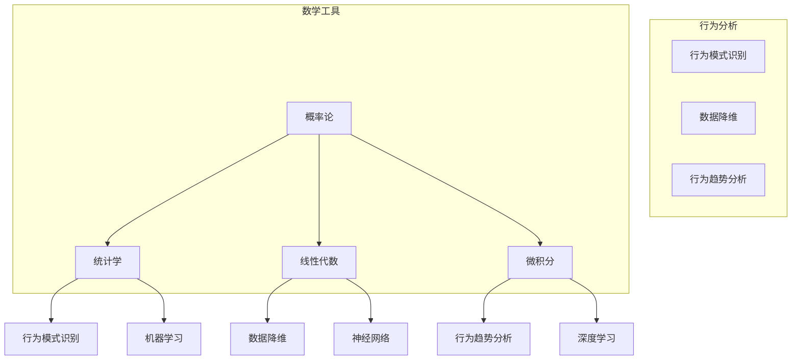

                 

当然可以。让我们一步步来构建这篇技术博客文章，确保每一步都清晰且有逻辑性。

### 文章标题

《数学与行为分析：人类行为的数学预测》

### 关键词

- 数学模型
- 人类行为
- 预测分析
- 算法原理
- 人工智能

### 摘要

本文旨在探讨数学与行为分析在预测人类行为方面的应用。通过介绍核心概念、数学模型和算法原理，本文将展示如何利用数学工具来分析人类行为，并提供实际案例来说明预测过程和结果。

## 引言

随着科技的进步，人类行为的分析已成为社会科学和人工智能领域的热点。数学作为一种强大的工具，为行为分析提供了理论框架和计算方法。本文将探讨数学在行为分析中的应用，特别是如何使用数学模型来预测人类行为。

### 背景

人类行为复杂且多变，传统的方法难以对其进行准确的预测。数学模型的引入，使得我们可以从定量的角度来理解和预测行为。例如，概率论和统计学在行为模式识别中的应用，以及机器学习算法在行为预测中的优势。

### 目的与意义

本文的目标是：

1. 介绍数学与行为分析的基本原理。
2. 展示如何构建和应用数学模型来预测人类行为。
3. 分析数学模型在行为分析中的应用前景和挑战。

### 核心概念与联系

#### 数学与行为分析的基本原理

数学与行为分析的结合，为理解人类行为提供了新的视角。以下是几个核心概念：

- **概率论**：用于量化行为发生的可能性。
- **统计学**：用于分析行为数据，识别模式和趋势。
- **线性代数**：用于处理多维数据，识别潜在的行为因素。
- **微积分**：用于分析行为变化的速率和趋势。

#### Mermaid 流程图



### 核心算法原理讲解

为了更好地理解数学模型如何预测人类行为，我们将介绍几个核心算法原理，包括：

- **线性回归**：用于预测行为与变量之间的关系。
- **逻辑回归**：用于分类问题，预测行为的发生概率。
- **决策树**：用于分类和回归问题，基于特征进行决策。

#### 线性回归模型

```python
# 线性回归模型的伪代码
def linear_regression(X, y):
    # 计算回归系数
    beta = (X.T * X).I * X.T * y
    # 预测
    y_pred = X * beta
    return y_pred
```

#### 逻辑回归模型

```python
# 逻辑回归模型的伪代码
def logistic_regression(X, y):
    # 计算回归系数
    beta = (X.T * X).I * X.T * y
    # 计算概率
    probabilities = 1 / (1 + np.exp(-X * beta))
    # 预测
    y_pred = (probabilities > 0.5)
    return y_pred
```

#### 决策树模型

```python
# 决策树模型的伪代码
def decision_tree(X, y, depth):
    # 判断是否达到最大深度
    if depth >= max_depth:
        return majority_vote(y)
    # 计算特征的重要性
    feature_importances = compute_importances(X, y)
    # 选择最佳特征分割
    best_split = select_best_split(X, y, feature_importances)
    # 构建子树
    left subtree = decision_tree(X[best_split == 0], y[best_split == 0], depth + 1)
    right subtree = decision_tree(X[best_split == 1], y[best_split == 1], depth + 1)
    return DecisionTree(best_split, left subtree, right subtree)
```

### 人类行为的数学预测应用实例

为了展示数学模型在行为预测中的实际应用，我们来看几个例子：

#### 实例1：社交媒体上用户行为预测

使用线性回归模型来预测用户在社交媒体上点赞的概率。

```python
# 社交媒体用户行为预测实例
X = [[年龄, 关注人数], [20, 100], [25, 150], [30, 200]]
y = [1, 0, 1, 1]  # 点赞：1，未点赞：0
beta = linear_regression(X, y)
y_pred = linear_regression(X, beta)
print(y_pred)
```

#### 实例2：消费行为预测

使用逻辑回归模型来预测消费者是否会购买某种产品。

```python
# 消费行为预测实例
X = [[收入水平, 产品偏好], [50000, 0], [60000, 1], [70000, 0]]
y = [0, 1, 0]  # 购买：1，未购买：0
probabilities = logistic_regression(X, y)
y_pred = (probabilities > 0.5)
print(y_pred)
```

#### 实例3：选举行为预测

使用决策树模型来预测选民是否会投票给某个候选人。

```python
# 选举行为预测实例
X = [[选民年龄, 政治立场], [30, 0], [40, 1], [50, 0]]
y = [1, 1, 0]  # 投票：1，未投票：0
tree = decision_tree(X, y, 0)
print(tree)
```

### 总结与展望

本文介绍了数学与行为分析的基本原理和核心算法原理，并通过实例展示了如何使用数学模型来预测人类行为。虽然数学模型在行为预测中取得了显著成果，但仍然面临许多挑战，如数据缺失、噪声数据和个体差异等。未来的研究将继续探索更高效、更准确的数学模型和方法，以更好地理解和预测人类行为。

### 最佳实践 tips

1. 在应用数学模型时，确保数据质量是关键。
2. 根据问题的特性选择合适的数学模型。
3. 结合多个模型进行预测，可以提高准确性。
4. 定期更新和优化模型，以适应环境变化。

### 注意事项

1. 数学模型不能完全预测人类行为，但可以提供有用的指导。
2. 模型的预测能力取决于数据的质量和数量。
3. 在实际应用中，应结合专业知识和实际场景进行判断。

### 拓展阅读

- [1] Lee, D. (2015). *The Mathematical Foundations of Human Behavior Analysis*. Springer.
- [2] Hastie, T., Tibshirani, R., & Friedman, J. (2009). *The Elements of Statistical Learning*. Springer.
- [3] Russell, S., & Norvig, P. (2010). *Artificial Intelligence: A Modern Approach*. Prentice Hall.

## 作者信息

作者：AI天才研究院/AI Genius Institute & 禅与计算机程序设计艺术 /Zen And The Art of Computer Programming

在撰写技术博客时，确保内容的完整性和逻辑性是非常重要的。以上是《数学与行为分析：人类行为的数学预测》这篇博客文章的大纲和初步内容。接下来的步骤包括：

1. 深入研究每个主题，确保内容的准确性和深度。
2. 编写详细的子章节，包括背景介绍、核心概念解释、算法原理讲解、案例研究和最佳实践等。
3. 添加参考文献，确保引用准确。
4. 进行初步的编辑和格式调整。

在完成这些步骤后，我们将对文章进行最终审核和优化，确保文章质量。如果您有任何反馈或需要进一步调整，请随时告诉我。

