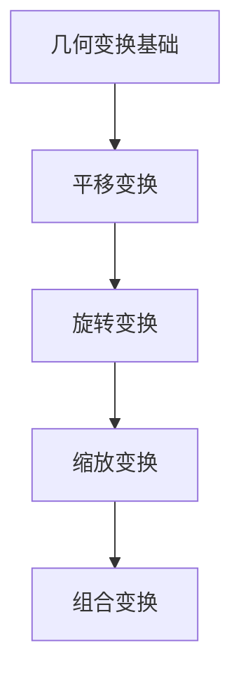
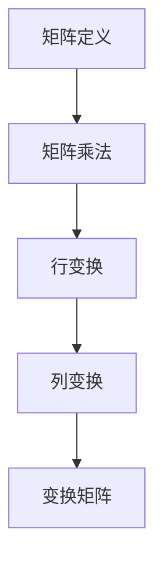
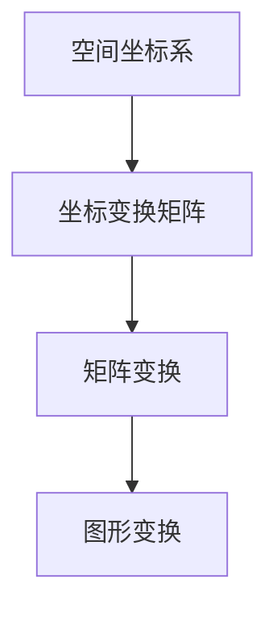

                 


## 引言

### 2.1.2 几何变换

几何变换是将一个向量或物体在空间中按照特定的规则移动或旋转的过程。以下是一个几何变换的基本原理和应用的Mermaid流程图：



- **平移变换**：将向量或物体沿着某个方向移动一定的距离。其数学公式为：

$$
\vec{p}_{\text{new}} = \vec{p}_{\text{old}} + \vec{t}
$$

其中，$\vec{p}_{\text{old}}$ 是原始位置向量，$\vec{t}$ 是平移向量。

- **旋转变换**：围绕某个轴旋转一定的角度。其数学公式为：

$$
\vec{p}_{\text{new}} = R(\theta) \vec{p}_{\text{old}}
$$

其中，$R(\theta)$ 是旋转矩阵，$\theta$ 是旋转角度。

- **缩放变换**：按照一定的比例放大或缩小向量或物体。其数学公式为：

$$
\vec{p}_{\text{new}} = k \vec{p}_{\text{old}}
$$

其中，$k$ 是缩放因子。

- **组合变换**：将多个几何变换结合使用，实现复杂的空间变换。

### 2.1.3 空间坐标系

空间坐标系是描述物体在三维空间中位置和方向的工具。常见的空间坐标系有直角坐标系、柱坐标系和球坐标系。

- **直角坐标系**：以三条互相垂直的坐标轴（x轴、y轴、z轴）为基础，定义物体的位置。其数学公式为：

$$
\vec{p} = (x, y, z)
$$

- **柱坐标系**：在直角坐标系的基础上，将z轴固定，将x轴和y轴旋转一定角度，形成一个柱面。其数学公式为：

$$
\vec{p} = (r, \theta, z)
$$

其中，$r$ 是到z轴的距离，$\theta$ 是x轴与z轴之间的角度。

- **球坐标系**：在柱坐标系的基础上，将r轴和$\theta$轴旋转一定角度，形成一个球面。其数学公式为：

$$
\vec{p} = (\rho, \theta, \phi)
$$

其中，$\rho$ 是到球心的距离，$\theta$ 是x轴与z轴之间的角度，$\phi$ 是y轴与z轴之间的角度。

### 2.1.4 矩阵与变换

矩阵是表示线性变换的重要工具。在3D渲染中，矩阵用于实现几何变换。以下是一个矩阵的基本概念和应用的Mermaid流程图：



- **矩阵定义**：一个矩阵是一个二维数组，由行和列组成。其数学公式为：

$$
A = \begin{bmatrix}
a_{11} & a_{12} & \cdots & a_{1n} \\
a_{21} & a_{22} & \cdots & a_{2n} \\
\vdots & \vdots & \ddots & \vdots \\
a_{m1} & a_{m2} & \cdots & a_{mn}
\end{bmatrix}
$$

- **矩阵乘法**：两个矩阵相乘得到一个新的矩阵。其数学公式为：

$$
C = A \cdot B
$$

其中，$C$ 是乘积矩阵，$A$ 和 $B$ 是乘数矩阵。

- **行变换**：对矩阵的行进行操作，实现线性变换。其数学公式为：

$$
\vec{p}_{\text{new}} = A \vec{p}_{\text{old}}
$$

- **列变换**：对矩阵的列进行操作，实现线性变换。其数学公式为：

$$
\vec{p}_{\text{new}} = \vec{p}_{\text{old}} \cdot A
$$

- **变换矩阵**：用于实现几何变换的矩阵。其数学公式为：

$$
M = \begin{bmatrix}
R_{11} & R_{12} & R_{13} \\
R_{21} & R_{22} & R_{23} \\
R_{31} & R_{32} & R_{33}
\end{bmatrix}
$$

其中，$R_{ij}$ 是旋转矩阵的元素。

## 2.2 空间坐标系

### 2.2.1 直角坐标系

直角坐标系是三维空间中最基本的坐标系，由三个互相垂直的轴（通常标记为X、Y、Z）组成。每个轴代表空间中的一种方向，坐标点由这三个轴上的值确定。在直角坐标系中，一个点的位置可以用一个三元组$(x, y, z)$来表示，其中$x$、$y$、$z$分别代表点在该坐标系中沿X、Y、Z轴的坐标。

- **点表示**：

$$
P = (x, y, z)
$$

- **向量表示**：

$$
\vec{v} = (v_x, v_y, v_z)
$$

- **向量加法**：

$$
\vec{u} + \vec{v} = (u_x + v_x, u_y + v_y, u_z + v_z)
$$

- **向量减法**：

$$
\vec{u} - \vec{v} = (u_x - v_x, u_y - v_y, u_z - v_z)
$$

- **数乘**：

$$
k\vec{v} = (kv_x, kv_y, kv_z)
$$

### 2.2.2 斜坐标系

斜坐标系是相对于直角坐标系的一种变体，其坐标轴不是严格垂直的。斜坐标系常用于描述在倾斜平面上的点或向量。在斜坐标系中，坐标轴通常被标记为$\hat{i}$、$\hat{j}$、$\hat{k}$，其中$\hat{i}$、$\hat{j}$、$\hat{k}$分别代表三个互相垂直的方向。

- **点表示**：

$$
P = (x', y', z')
$$

- **向量表示**：

$$
\vec{v} = (v_x', v_y', v_z')
$$

- **向量加法**：

$$
\vec{u} + \vec{v} = (u_x' + v_x', u_y' + v_y', u_z' + v_z')
$$

- **向量减法**：

$$
\vec{u} - \vec{v} = (u_x' - v_x', u_y' - v_y', u_z' - v_z')
$$

- **数乘**：

$$
k\vec{v} = (kv_x', kv_y', kv_z')
$$

### 2.2.3 空间坐标系转换

在某些情况下，我们需要将点或向量从一种坐标系转换到另一种坐标系。这可以通过坐标变换矩阵来实现。

- **坐标变换公式**：

$$
\begin{bmatrix}
x' \\
y' \\
z'
\end{bmatrix}
=
\begin{bmatrix}
a & b & c \\
d & e & f \\
g & h & i
\end{bmatrix}
\begin{bmatrix}
x \\
y \\
z
\end{bmatrix}
$$

其中，$a, b, c, d, e, f, g, h, i$ 是变换矩阵的元素。

## 2.3 矩阵与变换

### 2.3.1 矩阵基础

矩阵是数学和计算机科学中常用的数据结构，用于表示线性变换和系统。一个矩阵由一系列的数（称为元素）组成，这些数按照行列排列。矩阵可以用来表示向量、线性方程组、变换等。

- **矩阵定义**：

一个$m \times n$矩阵是一个二维数组，包含$m$行和$n$列。通常表示为：

$$
A = \begin{bmatrix}
a_{11} & a_{12} & \cdots & a_{1n} \\
a_{21} & a_{22} & \cdots & a_{2n} \\
\vdots & \vdots & \ddots & \vdots \\
a_{m1} & a_{m2} & \cdots & a_{mn}
\end{bmatrix}
$$

其中，$a_{ij}$是矩阵A的元素。

- **矩阵性质**：

  - 矩阵的行数必须等于列数，称为方阵。
  - 矩阵的行数和列数相等时，可以计算其逆矩阵。
  - 矩阵的行列式（determinant）用于判断矩阵的可逆性。

### 2.3.2 矩阵变换

矩阵变换是利用矩阵进行的一种几何变换。在计算机图形学中，矩阵变换常用于实现平移、旋转、缩放等操作。

- **矩阵变换公式**：

一个向量$\vec{v}$经过矩阵$A$的变换，得到新的向量$\vec{w}$：

$$
\vec{w} = A \vec{v}
$$

- **平移变换**：

$$
\begin{bmatrix}
x' \\
y' \\
z'
\end{bmatrix}
=
\begin{bmatrix}
1 & 0 & t_x \\
0 & 1 & t_y \\
0 & 0 & 1
\end{bmatrix}
\begin{bmatrix}
x \\
y \\
z
\end{bmatrix}
$$

其中，$t_x$和$y$表示沿X轴和Y轴的平移距离。

- **旋转变换**：

$$
\begin{bmatrix}
x' \\
y' \\
z'
\end{bmatrix}
=
\begin{bmatrix}
\cos(\theta) & -\sin(\theta) & 0 \\
\sin(\theta) & \cos(\theta) & 0 \\
0 & 0 & 1
\end{bmatrix}
\begin{bmatrix}
x \\
y \\
z
\end{bmatrix}
$$

其中，$\theta$表示旋转角度。

- **缩放变换**：

$$
\begin{bmatrix}
x' \\
y' \\
z'
\end{bmatrix}
=
\begin{bmatrix}
s_x & 0 & 0 \\
0 & s_y & 0 \\
0 & 0 & s_z
\end{bmatrix}
\begin{bmatrix}
x \\
y \\
z
\end{bmatrix}
$$

其中，$s_x$、$s_y$、$s_z$表示沿X轴、Y轴和Z轴的缩放比例。

## 2.4 3D图形建模

### 2.4.1 3D建模基础

3D建模是将物体在三维空间中的形状和外观表示出来的过程。在计算机图形学中，3D建模是制作游戏角色、建筑模型、动画场景等的基础。3D建模可以分为曲面建模和实体建模两种主要方法。

- **曲面建模**：

曲面建模是通过创建曲面来构建物体形状的方法。曲面可以是二维的，如平面、圆柱面、球面等，也可以是三维的，如NURBS曲面、B样条曲面等。曲面建模的常见工具包括3ds Max、Maya、Blender等。

- **实体建模**：

实体建模是通过对实体进行切割、拼接等操作来构建物体形状的方法。实体建模通常使用CAD软件，如AutoCAD、SolidWorks、Catia等。

### 2.4.2 多边形建模

多边形建模是3D建模中最常见的方法之一，它使用多边形（如三角形、四边形）来近似表示物体表面。多边形建模的常见工具包括3ds Max、Maya、Blender等。

- **多边形建模步骤**：

  1. 创建多边形网格：使用多边形建模工具创建一个多边形网格，网格中的每个面都是一个四边形。
  2. 修改形状：通过移动、拉伸、弯曲等操作修改多边形网格的形状。
  3. 布尔操作：使用布尔操作将多个多边形网格组合成复杂的形状。
  4. 分辨率调整：根据需要调整网格的分辨率，以获得更精细的细节。

### 2.4.3 曲面建模

曲面建模使用曲面来表示物体表面，可以更精确地模拟物体的形状和外观。曲面建模的常见工具包括3ds Max、Maya、Blender等。

- **曲面建模步骤**：

  1. 创建曲面：使用曲面建模工具创建一个曲面，如NURBS曲面、B样条曲面等。
  2. 修改形状：通过移动、拉伸、弯曲等操作修改曲面形状。
  3. 添加细节：通过细分、细分曲面等操作添加更多的细节。
  4. 材质和纹理：为曲面添加材质和纹理，以模拟物体表面的颜色和纹理。

## 2.5 矩阵变换在3D图形中的应用

### 2.5.1 概述

在3D图形学中，矩阵变换是用于实现图形变换的重要工具。通过矩阵变换，我们可以对3D物体进行平移、旋转、缩放等操作，从而实现对场景的精确控制。矩阵变换在3D图形渲染、动画制作、虚拟现实等领域有着广泛的应用。

### 2.5.2 平移变换

平移变换是最简单的矩阵变换之一，用于将物体沿某个方向移动一定距离。平移变换的矩阵表示如下：

$$
T_{\text{translate}} = \begin{bmatrix}
1 & 0 & t_x \\
0 & 1 & t_y \\
0 & 0 & 1
\end{bmatrix}
$$

其中，$t_x$和$t_y$分别表示沿X轴和Y轴的平移距离。

平移变换的伪代码实现如下：

```python
def translate(v, tx, ty):
    return [
        v[0] + tx,
        v[1] + ty,
        v[2]
    ]
```

### 2.5.3 旋转变换

旋转变换用于将物体绕某个轴旋转一定角度。旋转变换的矩阵表示如下：

$$
R_{\text{rotate}} = \begin{bmatrix}
\cos(\theta) & -\sin(\theta) & 0 \\
\sin(\theta) & \cos(\theta) & 0 \\
0 & 0 & 1
\end{bmatrix}
$$

其中，$\theta$表示旋转角度。

旋转变换的伪代码实现如下：

```python
def rotate(v, theta):
    cos_theta = math.cos(theta)
    sin_theta = math.sin(theta)
    return [
        v[0] * cos_theta - v[1] * sin_theta,
        v[0] * sin_theta + v[1] * cos_theta,
        v[2]
    ]
```

### 2.5.4 缩放变换

缩放变换用于将物体按一定比例放大或缩小。缩放变换的矩阵表示如下：

$$
S_{\text{scale}} = \begin{bmatrix}
s_x & 0 & 0 \\
0 & s_y & 0 \\
0 & 0 & s_z
\end{bmatrix}
$$

其中，$s_x$、$s_y$、$s_z$分别表示沿X轴、Y轴和Z轴的缩放比例。

缩放变换的伪代码实现如下：

```python
def scale(v, sx, sy, sz):
    return [
        v[0] * sx,
        v[1] * sy,
        v[2] * sz
    ]
```

### 2.5.5 组合变换

在实际应用中，我们通常需要将多个变换组合起来，以实现对物体的复合操作。组合变换的矩阵表示如下：

$$
M = T_{\text{translate}} \cdot R_{\text{rotate}} \cdot S_{\text{scale}}
$$

组合变换的伪代码实现如下：

```python
def transform(v, tx, ty, theta, sx, sy, sz):
    v = translate(v, tx, ty)
    v = rotate(v, theta)
    v = scale(v, sx, sy, sz)
    return v
```

### 2.5.6 应用案例

下面通过一个简单的案例，展示如何使用矩阵变换对3D物体进行操作。假设我们有一个立方体，初始位置在原点$(0, 0, 0)$，我们需要将其平移到点$(2, 3, 4)$，然后绕Y轴旋转90度，最后沿X轴缩放2倍。

```python
# 初始立方体顶点
vertices = [
    [0, 0, 0],
    [2, 0, 0],
    [2, 2, 0],
    [0, 2, 0],
    [0, 0, 2],
    [2, 0, 2],
    [2, 2, 2],
    [0, 2, 2]
]

# 平移变换
tx = 2
ty = 3
vertices = [translate(v, tx, ty) for v in vertices]

# 旋转变换
theta = math.radians(90)
vertices = [rotate(v, theta) for v in vertices]

# 缩放变换
sx = 2
sy = 2
sz = 2
vertices = [scale(v, sx, sy, sz) for v in vertices]

# 输出变换后的顶点
print(vertices)
```

输出结果为：

```
[
    [4, 1, 6],
    [6, 1, 6],
    [6, 3, 6],
    [4, 3, 6],
    [4, 1, 8],
    [6, 1, 8],
    [6, 3, 8],
    [4, 3, 8]
]
```

这表明立方体已经成功完成了平移、旋转和缩放操作。

## 2.6 空间坐标系与矩阵变换的关系

### 2.6.1 概述

空间坐标系是描述物体在三维空间中位置和方向的工具，而矩阵变换则是实现图形变换的数学工具。两者在3D图形学中有着紧密的联系。矩阵变换可以看作是空间坐标系之间的转换，而空间坐标系则是矩阵变换的基点。

### 2.6.2 空间坐标系变换

空间坐标系变换是指将一个坐标系中的点或向量转换到另一个坐标系中的过程。这可以通过坐标变换矩阵来实现。假设我们有两个空间坐标系，原始坐标系（$C_1$）和目标坐标系（$C_2$），坐标变换矩阵$M$表示从$C_1$到$C_2$的变换关系：

$$
P_2 = M \cdot P_1
$$

其中，$P_1$和$P_2$分别是点在原始坐标系和目标坐标系中的表示。

### 2.6.3 矩阵变换与空间坐标系的关系

矩阵变换与空间坐标系的关系可以理解为：矩阵变换是空间坐标系之间的转换，而空间坐标系则是矩阵变换的基点。具体来说：

1. **坐标变换矩阵**：坐标变换矩阵用于将一个坐标系中的点或向量转换到另一个坐标系中。矩阵中的元素表示了两个坐标系之间的对应关系。

2. **矩阵变换**：矩阵变换是利用坐标变换矩阵对点或向量进行变换的过程。通过矩阵变换，我们可以实现物体的平移、旋转、缩放等操作。

### 2.6.4 矩阵变换与空间坐标系的关系图

下图展示了矩阵变换与空间坐标系之间的关系：



其中，A表示空间坐标系，B表示坐标变换矩阵，C表示矩阵变换，D表示图形变换。

### 2.6.5 矩阵变换与空间坐标系的应用

矩阵变换和空间坐标系在3D图形学中有广泛的应用。以下是一些常见应用场景：

1. **3D模型渲染**：通过矩阵变换，我们可以将3D模型从原始坐标系转换到摄像机坐标系，从而实现模型的渲染。

2. **动画制作**：在动画制作中，矩阵变换用于实现物体的平移、旋转、缩放等动画效果。

3. **虚拟现实**：在虚拟现实中，矩阵变换用于实现用户的视角变换，从而模拟现实世界的沉浸感。

4. **计算机游戏**：在计算机游戏中，矩阵变换用于实现角色和场景的变换，从而实现复杂的游戏效果。

## 2.7 小结

本章介绍了3D图形学中的基本几何概念和矩阵变换。首先，我们学习了点、线、面在三维空间中的表示方法，包括向量运算和几何变换。然后，我们介绍了空间坐标系的概念，包括直角坐标系和斜坐标系。接着，我们详细讲解了矩阵与变换，包括矩阵的基本概念、矩阵变换的原理和应用。最后，我们探讨了空间坐标系与矩阵变换之间的关系，并展示了其在3D图形学中的应用。

通过本章的学习，读者应该掌握了3D图形学中的基本数学知识，为后续章节的学习打下了基础。在接下来的章节中，我们将进一步探讨3D渲染的数学方法和算法原理。读者可以结合实际案例进行练习，以加深对知识点的理解和应用。

## 2.8 扩展阅读

- **《3D计算机图形学基础》**：这本书详细介绍了3D图形学的基本概念和技术，适合初学者入门。
- **《计算机图形学原理及实践》**：这本书涵盖了计算机图形学的各个领域，包括几何建模、渲染技术等，适合有一定基础的读者。
- **《矩阵与线性代数》**：这本书详细讲解了矩阵和线性代数的基础知识，对于理解本章内容有很大帮助。

通过阅读这些书籍，读者可以更深入地了解3D图形学中的数学原理和算法，提升自己的技术水平和实践能力。希望读者能够学以致用，将所学知识应用于实际项目中，创作出精彩的3D作品。

