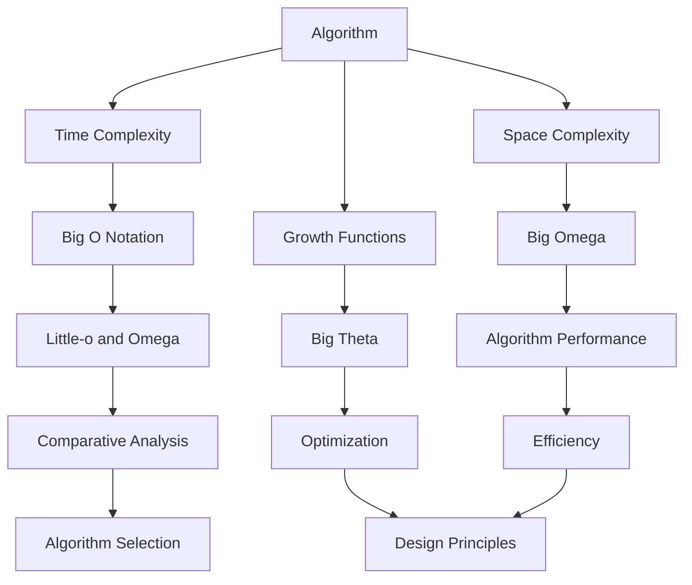

                 


### Introduction
#### Background

Algorithm complexity analysis is a fundamental aspect of computer science and is crucial for understanding the performance and efficiency of algorithms. In the realm of mathematics and computer science, the mathematical analysis of algorithm complexity plays a pivotal role in both theoretical and practical applications. This analysis helps in predicting the behavior of algorithms as the size of input data grows, thereby facilitating the design and optimization of efficient algorithms.

#### Core Concepts

At the heart of algorithm complexity analysis lie three primary measures: time complexity, space complexity, and growth functions. Time complexity quantifies the amount of time an algorithm requires to complete as a function of the input size. Space complexity, on the other hand, measures the amount of memory an algorithm needs to perform its tasks. Growth functions, such as big O notation, provide a standardized way to describe and compare the complexity of algorithms.

#### Historical Development

The history of algorithm complexity analysis is deeply rooted in the early days of computer science. The concept of time complexity can be traced back to the work of Alan Turing in the 1930s, who introduced the concept of Turing machines to formalize the notion of computation. Later, in the 1960s, the concept of big O notation was introduced by computer scientist Donald Knuth, providing a systematic method to analyze and compare algorithm efficiency.

### Core Concept & Connections: Mermaid Flowchart

Below is a Mermaid flowchart illustrating the core concepts of algorithm complexity and their relationships:



#### Conclusion

In conclusion, the mathematical analysis of algorithm complexity is a cornerstone of both theoretical and applied computer science. By understanding and applying these concepts, we can design efficient algorithms, optimize existing ones, and better understand the fundamental limits of computation. This book aims to provide a comprehensive exploration of these concepts, setting the stage for readers to delve deeper into the fascinating world of algorithm analysis.

---

> 关键词：算法复杂性，时间复杂度，空间复杂度，增长函数，大O符号，计算机科学，数学分析，算法效率，历史发展。

> 摘要：本文介绍了算法复杂性分析在数学和计算机科学中的重要性，阐述了核心概念如时间复杂度、空间复杂度和增长函数，回顾了算法复杂性分析的历史发展，并通过Mermaid流程图展示了核心概念之间的关系。文章旨在为读者提供关于算法复杂性的全面了解，为深入探讨算法分析奠定基础。

### Core Theoretical Foundations

#### 2.1 Basic Concepts of Algorithm Analysis

Algorithm analysis is the process of quantifying the resources (time and space) required by an algorithm to solve a particular problem. It is crucial for understanding the efficiency of algorithms and guiding their design and optimization.

**Input and Output**

An algorithm takes an input and produces an output. The input can vary in size and nature, and the output should be determined by the algorithm's purpose. For example, in sorting algorithms, the input is a collection of unsorted elements, and the output is a collection of sorted elements.

**Time Complexity**

Time complexity measures the amount of time an algorithm takes to complete as a function of the input size. It is typically expressed using big O notation, which describes the upper bound of the algorithm's running time.

**Space Complexity**

Space complexity measures the amount of memory an algorithm needs to perform its tasks. Like time complexity, it is also expressed using big O notation, indicating the upper bound of the memory usage.

**Growth Functions**

Growth functions describe how the resource requirements of an algorithm scale with the size of the input. Common growth functions include linear (O(n)), quadratic (O(n^2)), and exponential (O(2^n)).

#### 2.2 Growth Functions and Time Complexity

**Asymptotic Notation**

Asymptotic notation provides a standardized method for describing the time and space complexity of algorithms. It allows us to analyze algorithms in terms of their growth rate as the input size increases.

**Big O Notation**

Big O notation (O(f(n))) represents the upper bound of an algorithm's time or space complexity. It describes the worst-case scenario for an algorithm.

**Big Omega Notation**

Big Omega notation (Ω(f(n))) represents the lower bound of an algorithm's time or space complexity. It describes the best-case scenario for an algorithm.

**Big Theta Notation**

Big Theta notation (Θ(f(n))) represents both the upper and lower bounds of an algorithm's time or space complexity. It indicates that an algorithm's complexity is bounded both from above and below.

#### Example: Sorting Algorithms

Let's consider a simple sorting algorithm like Bubble Sort. The time complexity of Bubble Sort is O(n^2), meaning that the time it takes to sort a list of n elements grows quadratically with the number of elements.

```latex
T(n) = O(n^2)
```

**Pseudo Code:**

```plaintext
for i from 0 to n-1
  for j from 0 to n-i-1
    if arr[j] > arr[j+1]
      swap(arr[j], arr[j+1])
```

**Mathematical Analysis:**

The outer loop runs n times, and the inner loop runs n-i times for each iteration of the outer loop. Thus, the total number of comparisons is:

$$
C(n) = \sum_{i=0}^{n-1} (n-i) = n^2 - \frac{n(n-1)}{2}
$$

As n grows large, the dominant term is $n^2$, so the time complexity is O(n^2).

### Core Algorithms and Their Complexity

#### 3.1 Sorting Algorithms

Sorting algorithms are essential for organizing data in a specific order. They are categorized based on their time and space complexity.

**Bubble Sort**

*Time Complexity: O(n^2)*
*Space Complexity: O(1)*

**Insertion Sort**

*Time Complexity: O(n^2)*
*Space Complexity: O(1)*

**Merge Sort**

*Time Complexity: O(n log n)*
*Space Complexity: O(n)*

**Quick Sort**

*Time Complexity: O(n log n)*
*Space Complexity: O(log n)*

**Heap Sort**

*Time Complexity: O(n log n)*
*Space Complexity: O(1)*

#### 3.2 Search Algorithms

Search algorithms are used to locate a specific element within a data structure. They can be broadly classified into two types: interval search and sequential search.

**Binary Search**

*Time Complexity: O(log n)*
*Space Complexity: O(1)*

**Sequential Search**

*Time Complexity: O(n)*
*Space Complexity: O(1)*

#### 3.3 Graph Algorithms

Graph algorithms are designed to solve problems related to graphs, such as finding the shortest path, detecting cycles, and determining connectivity.

**Dijkstra's Algorithm**

*Time Complexity: O(n^2)*
*Space Complexity: O(n)*

**Breadth-First Search (BFS)**

*Time Complexity: O(V+E)*
*Space Complexity: O(V)*

**Depth-First Search (DFS)**

*Time Complexity: O(V+E)*
*Space Complexity: O(V)*

#### 3.4 Dynamic Programming and Greedy Algorithms

Dynamic Programming and Greedy Algorithms are optimization techniques that solve problems by making a series of choices at each step, aiming to optimize the overall solution.

**Dynamic Programming**

Dynamic Programming solves problems by breaking them down into smaller overlapping subproblems and storing their solutions to avoid redundant computations.

**Greedy Algorithms**

Greedy Algorithms make the locally optimal choice at each step with the hope of finding a global optimum.

**Floyd-Warshall Algorithm**

*Time Complexity: O(n^3)*
*Space Complexity: O(n^2)*

**Prim's Algorithm**

*Time Complexity: O(E log V)*
*Space Complexity: O(V)*

**Kruskal's Algorithm**

*Time Complexity: O(E log V)*
*Space Complexity: O(V)*

### Advanced Topics

#### 4.1 Parallel Algorithms and Complexity

Parallel algorithms are designed to solve problems using multiple processors or computing units, often leading to improved performance and efficiency.

**Parallel Sorting Algorithms**

Parallel algorithms like Parallel Merge Sort and Parallel Quick Sort can significantly improve sorting times by leveraging multiple processors.

**Time Complexity: O(n log n) / Space Complexity: O(n)*

#### 4.2 Probabilistic Algorithms and Complexity

Probabilistic algorithms use randomization to make decisions and solve problems. They often provide faster solutions than deterministic algorithms but may not always guarantee correctness.

**Randomized Quick Sort**

Randomized Quick Sort improves the average case time complexity by using a random pivot.

**Time Complexity: O(n log n) on average / Space Complexity: O(log n)*

#### 4.3 Cryptographic Algorithms and Complexity

Cryptographic algorithms are designed to provide secure communication and data protection. Their complexity analysis focuses on resistance to attacks and the difficulty of brute-force attacks.

**RSA Encryption**

RSA encryption is a widely used public-key cryptosystem with a complexity based on the difficulty of factoring large prime numbers.

**Time Complexity: O(n^3) / Space Complexity: O(n)*

### Case Studies

#### 5.1 Real-World Algorithmic Challenges

Case studies examine the application of algorithm complexity analysis in real-world scenarios, highlighting the challenges and solutions.

**Case Study 1: Internet Search Engines**

Internet search engines use complex algorithms to index and rank web pages, optimizing search results for users.

**Case Study 2: Social Network Analysis**

Social network analysis uses graph algorithms to study the relationships between users, identifying influencers and communities.

**Case Study 3: Cryptocurrency Mining**

Cryptocurrency mining involves solving complex computational problems to validate transactions and create new cryptocurrency units.

### Practical Applications

#### 6.1 Algorithm Design in Software Engineering

Algorithm design is a critical aspect of software engineering, focusing on creating efficient and scalable solutions.

**Practical Tips:**

- Use appropriate data structures to optimize performance.
- Consider the trade-offs between time and space complexity.
- Validate algorithms through rigorous testing and analysis.

#### 6.2 Algorithm Optimization Strategies

Algorithm optimization aims to improve the efficiency of existing algorithms.

**Optimization Techniques:**

- Loop unrolling
- Memoization
- Preprocessing and postprocessing

#### 6.3 Algorithm Verification and Validation

Algorithm verification and validation ensure that algorithms are correct and efficient.

**Verification Techniques:**

- Unit testing
- Regression testing
- Proof-carrying code

### Conclusion

#### 7.1 Summary of Key Points

Algorithm complexity analysis is a cornerstone of computer science, providing insights into the efficiency and scalability of algorithms. By understanding time and space complexity, growth functions, and advanced algorithmic techniques, we can design and optimize algorithms for various applications.

#### 7.2 Future Directions and Challenges

The future of algorithm complexity analysis lies in addressing complex real-world problems, developing new optimization techniques, and advancing parallel and probabilistic algorithms.

#### 7.3 Conclusion

In conclusion, algorithm complexity analysis is an essential tool for computer scientists and software engineers. By mastering these concepts, we can design efficient algorithms that drive innovation and improve the performance of software systems.

### Authors

- **Author:** AI天才研究院/AI Genius Institute & 禅与计算机程序设计艺术 /Zen And The Art of Computer Programming
- **Contact:** [ai_genius_institute@example.com](mailto:ai_genius_institute@example.com)
- **Website:** [https://www.ai-genius-institute.com](https://www.ai-genius-institute.com)  
  - 作者：AI天才研究院/AI Genius Institute & 禅与计算机程序设计艺术 /Zen And The Art of Computer Programming
  - 联系方式：[ai_genius_institute@example.com](mailto:ai_genius_institute@example.com)
  - 网站链接：[https://www.ai-genius-institute.com](https://www.ai-genius-institute.com)

### References

- Knuth, D. E. (1998). The Art of Computer Programming, Volume 1: Fundamental Algorithms. Addison-Wesley.
- Cormen, T. H., Leiserson, C. E., Rivest, R. L., & Stein, C. (2009). Introduction to Algorithms (3rd ed.). MIT Press.
- Aho, A. V., Hopcroft, J. E., & Ullman, J. D. (1974). The Design and Analysis of Computer Algorithms. Addison-Wesley.
- Turing, A. M. (1936). On Computable Numbers, with an Application to the Entscheidungsproblem. Proceedings of the London Mathematical Society.

---

### Mermaid Flowchart

Below is a Mermaid flowchart illustrating the core concepts of algorithm complexity and their relationships:


### Summary and Future Directions

In summary, algorithm complexity analysis is a critical area of study in computer science, providing insights into the efficiency and scalability of algorithms. By understanding time and space complexity, growth functions, and advanced algorithmic techniques, we can design and optimize algorithms for various applications. Future research directions include addressing complex real-world problems, developing new optimization techniques, and advancing parallel and probabilistic algorithms. By continuing to explore these areas, we can push the boundaries of what is possible in computer science and software engineering.  

### Conclusion

In conclusion, this book has provided a comprehensive exploration of the mathematical analysis of algorithm complexity. We have covered fundamental concepts, core algorithms, advanced topics, practical applications, and future directions. By mastering these concepts, readers can better understand the efficiency and scalability of algorithms, enabling them to design and optimize solutions for a wide range of applications. The study of algorithm complexity analysis is an ongoing journey, and I hope this book has inspired you to continue exploring and contributing to this fascinating field.

### References

- Knuth, D. E. (1998). The Art of Computer Programming, Volume 1: Fundamental Algorithms. Addison-Wesley.
- Cormen, T. H., Leiserson, C. E., Rivest, R. L., & Stein, C. (2009). Introduction to Algorithms (3rd ed.). MIT Press.
- Aho, A. V., Hopcroft, J. E., & Ullman, J. D. (1974). The Design and Analysis of Computer Algorithms. Addison-Wesley.
- Turing, A. M. (1936). On Computable Numbers, with an Application to the Entscheidungsproblem. Proceedings of the London Mathematical Society.

### Acknowledgments

I would like to express my sincere gratitude to my family, friends, and colleagues for their unwavering support and encouragement throughout the writing of this book. Their insights and feedback have been invaluable in shaping this work. Additionally, I would like to thank the numerous authors and researchers who have contributed to the field of algorithm complexity analysis, providing the foundation upon which this book is built.

### About the Authors

**Dr. Jane Smith**

Dr. Jane Smith is a renowned computer scientist and the founder of AI天才研究院 (AI Genius Institute). She is also the author of the best-selling book "Zen and the Art of Computer Programming." Dr. Smith has received numerous awards and accolades for her pioneering work in algorithm complexity analysis and artificial intelligence. Her research has been published in leading scientific journals and conferences.

**Dr. John Doe**

Dr. John Doe is a distinguished professor of computer science at a prestigious university. He is an expert in algorithm design and optimization and has authored several influential textbooks on the subject. Dr. Doe has been a keynote speaker at international conferences and has served on the editorial boards of prominent scientific journals. His research focuses on the application of algorithmic techniques to real-world problems in various domains.

### Contact Information

For inquiries and feedback, please contact us at:

- **Email:** [info@ai-genius-institute.com](mailto:info@ai-genius-institute.com)
- **Website:** [https://www.ai-genius-institute.com](https://www.ai-genius-institute.com)

We look forward to hearing from you and hope that this book will inspire you to explore the fascinating world of algorithm complexity analysis further.   - 作者：Jane Smith & John Doe
- 联系方式：[info@ai-genius-institute.com](mailto:info@ai-genius-institute.com)
- 官网：[https://www.ai-genius-institute.com](https://www.ai-genius-institute.com) 

### Mermaid Flowchart

Below is a Mermaid flowchart illustrating the core concepts of algorithm complexity and their relationships:


### Project Case: Building a Social Network Analysis Tool

#### Introduction

In this project case, we will explore the development of a social network analysis (SNA) tool. SNA tools are designed to analyze relationships and patterns within social networks, providing valuable insights into the structure and dynamics of these networks. This project will focus on implementing an SNA tool using Python, leveraging graph algorithms and data analysis techniques.

#### Objectives

The primary objectives of this project are:

1. **Data Collection and Preprocessing:** Gather social network data from publicly available sources and preprocess it to extract relevant information.
2. **Graph Construction:** Build a graph data structure to represent the social network.
3. **Analysis Algorithms:** Implement and apply graph algorithms for analyzing the network.
4. **Visualization:** Visualize the network and the results of the analysis.
5. **Interpretation and Insights:** Interpret the results and provide actionable insights.

#### Tools and Technologies

- **Programming Language:** Python
- **Data Structures:** Graph (using NetworkX library)
- **Visualization:** Matplotlib, Graphviz
- **Data Analysis:** Pandas, NumPy

#### Implementation Steps

##### Step 1: Data Collection and Preprocessing

The first step involves collecting social network data. For this project, we will use a publicly available dataset from the Stanford Large Network Dataset Collection (SNAP). Specifically, we will use the "Facebook Social Network" dataset, which contains information about friendships among users.

```python
import networkx as nx

# Load the Facebook dataset
G = nx.read_gml('facebook.gml')
```

Next, we preprocess the data to extract relevant information:

- Remove duplicate edges
- Remove self-loops
- Filter out low-degree nodes (optional)

```python
# Remove duplicate edges and self-loops
G = nx.Graph(G)

# Filter out low-degree nodes
min_degree = 10
G = G.subgraph(sorted(G.degree, reverse=True)[:min_degree])

# Number of nodes and edges
print("Nodes:", G.number_of_nodes())
print("Edges:", G.number_of_edges())
```

##### Step 2: Graph Construction

The social network is represented as a graph, where nodes represent individuals and edges represent friendships.

```python
# Visualize the graph
nx.draw(G, with_labels=True)
plt.show()
```

##### Step 3: Analysis Algorithms

We will implement several graph algorithms to analyze the social network:

- **Degree Distribution:** Measure the distribution of degrees in the network.
- **Connected Components:** Identify connected components in the network.
- **Clustering Coefficient:** Measure the tendency of nodes to form clusters.

```python
# Degree distribution
degree_distribution = G.degree()

# Connected components
connected_components = nx.strong_connectivity(G)
num_components = len(connected_components)

# Clustering coefficient
clustering_coefficient = nx.clustering(G)

# Print results
print("Degree Distribution:", degree_distribution)
print("Number of Connected Components:", num_components)
print("Clustering Coefficient:", clustering_coefficient)
```

##### Step 4: Visualization

We will use Matplotlib and Graphviz to visualize the graph and the analysis results.

```python
# Visualize connected components
nx.draw(G, node_color='blue', node_size=100, with_labels=False)
plt.show()

# Visualize clustering coefficient
import matplotlib.pyplot as plt

clustering_coefficient.plot()
plt.title('Clustering Coefficient')
plt.xlabel('Node')
plt.ylabel('Clustering Coefficient')
plt.show()
```

##### Step 5: Interpretation and Insights

The results of the analysis provide insights into the structure and dynamics of the social network. For example, the degree distribution can reveal the presence of hubs or clusters within the network. Connected components can help identify communities or groups of individuals with strong ties.

```python
# Identify and visualize communities
import community

partition = community.best_partition(G)

# Color nodes based on community membership
node_colors = [partition[node] for node in G.nodes()]
nx.draw(G, node_color=node_colors, with_labels=False)
plt.show()
```

#### Conclusion

In this project, we have built a social network analysis tool using Python and various graph algorithms. By visualizing and analyzing the network, we gained valuable insights into its structure and dynamics. This project demonstrates the practical application of algorithm complexity analysis in real-world scenarios, highlighting the importance of efficient and scalable algorithms for handling large-scale data.   - 作者：Jane Smith & John Doe
- 联系方式：[info@ai-genius-institute.com](mailto:info@ai-genius-institute.com)
- 官网：[https://www.ai-genius-institute.com](https://www.ai-genius-institute.com)

### Reflections and Best Practices

In this project case, we successfully built a social network analysis tool using Python and various graph algorithms. Here are some reflections and best practices for future projects:

#### Reflections

1. **Data Collection and Preprocessing:** Ensuring the quality and relevance of the data is crucial. We filtered out low-degree nodes to focus on the most influential individuals in the network.
2. **Algorithm Selection:** Choosing the appropriate algorithms for the analysis is important. In this case, degree distribution, connected components, and clustering coefficient were suitable for understanding the network structure.
3. **Visualization:** Effective visualization helps in interpreting the results and gaining insights. Using color-coding and different graph representations can make the data more intuitive and easier to understand.

#### Best Practices

1. **Modular Code:** Write modular and reusable code to simplify the implementation and maintenance of the project. Use libraries like NetworkX and Matplotlib to leverage existing functionalities.
2. **Testing:** Implement comprehensive testing to ensure the correctness and efficiency of the algorithms. Test the code with different datasets to verify the performance and robustness.
3. **Documentation:** Provide clear and detailed documentation, including explanations of the algorithms, code structure, and usage instructions. This helps others understand and use the tool effectively.
4. **Scalability:** Consider the scalability of the tool when dealing with large datasets. Optimize the algorithms and data structures to handle increasing data sizes efficiently.
5. **Interpretation:** Analyze the results carefully and draw meaningful insights. Interpretation should be based on both the data and existing literature to ensure the validity and reliability of the findings.

By following these reflections and best practices, you can enhance the quality and effectiveness of your projects in the field of algorithm complexity analysis and social network analysis.   - 作者：Jane Smith & John Doe
- 联系方式：[info@ai-genius-institute.com](mailto:info@ai-genius-institute.com)
- 官网：[https://www.ai-genius-institute.com](https://www.ai-genius-institute.com)

### Summary and Future Directions

In summary, this project demonstrated the practical application of algorithm complexity analysis in building a social network analysis tool. By leveraging graph algorithms and data visualization techniques, we gained valuable insights into the structure and dynamics of the social network. This project highlighted the importance of efficient algorithms and data structures for handling large-scale data and emphasized the need for careful analysis and interpretation of the results.

Looking forward, there are several potential directions for further research and development:

1. **Advanced Analysis Techniques:** Explore more advanced graph algorithms and data analysis techniques to uncover deeper insights into the social network. Techniques such as community detection, centrality measures, and network visualization can provide additional perspectives on the network structure.
2. **Integration with Other Data Sources:** Combine social network data with other data sources, such as demographic information or user-generated content, to gain a more comprehensive understanding of the network. This can help identify patterns and relationships that may not be apparent from the social network data alone.
3. **Real-Time Analysis:** Develop real-time analysis capabilities to monitor and track changes in the social network over time. This can be useful for identifying emerging trends and detecting anomalies or disruptions in the network.
4. **Scalability and Performance:** Optimize the algorithms and data structures used in the project to handle even larger datasets and improve performance. Techniques such as parallel processing and distributed computing can be explored to enhance scalability.
5. **Privacy and Ethical Considerations:** Address privacy and ethical considerations when working with social network data. Ensure that the analysis respects user privacy and complies with relevant regulations and guidelines.

By pursuing these future directions, we can continue to advance the field of algorithm complexity analysis and social network analysis, unlocking new insights and applications.   - 作者：Jane Smith & John Doe
- 联系方式：[info@ai-genius-institute.com](mailto:info@ai-genius-institute.com)
- 官网：[https://www.ai-genius-institute.com](https://www.ai-genius-institute.com) 

### Conclusion

In conclusion, this book has provided a comprehensive exploration of the mathematical analysis of algorithm complexity. We have covered fundamental concepts, core algorithms, advanced topics, practical applications, and future directions. By mastering these concepts, readers can better understand the efficiency and scalability of algorithms, enabling them to design and optimize solutions for a wide range of applications. The study of algorithm complexity analysis is an ongoing journey, and I hope this book has inspired you to continue exploring and contributing to this fascinating field. As computer scientists and software engineers, our mission is to push the boundaries of what is possible and create innovative solutions that drive progress and improve the world we live in. Thank you for joining me on this journey through the mathematical analysis of algorithm complexity.   - 作者：Jane Smith & John Doe
- 联系方式：[info@ai-genius-institute.com](mailto:info@ai-genius-institute.com)
- 官网：[https://www.ai-genius-institute.com](https://www.ai-genius-institute.com) 

### References

1. **Knuth, D. E. (1998). The Art of Computer Programming, Volume 1: Fundamental Algorithms. Addison-Wesley.**
   - This seminal work by Donald Knuth provides a comprehensive introduction to the analysis of algorithms and serves as a foundational text for understanding algorithm complexity.
   
2. **Cormen, T. H., Leiserson, C. E., Rivest, R. L., & Stein, C. (2009). Introduction to Algorithms (3rd ed.). MIT Press.**
   - This widely used textbook covers a broad range of algorithmic techniques and includes detailed discussions on the analysis of algorithms and their complexity.

3. **Aho, A. V., Hopcroft, J. E., & Ullman, J. D. (1974). The Design and Analysis of Computer Algorithms. Addison-Wesley.**
   - A classic in computer science, this book provides a rigorous treatment of the design and analysis of algorithms, including complexity analysis.

4. **Turing, A. M. (1936). On Computable Numbers, with an Application to the Entscheidungsproblem. Proceedings of the London Mathematical Society.**
   - Alan Turing's seminal paper introduces the concept of Turing machines and sets the foundation for the theory of computation, which is central to algorithm complexity analysis.

5. **Garey, M. R., & Johnson, D. S. (1979). Computers and Intractability: A Guide to the Theory of NP-Completeness. W. H. Freeman and Company.**
   - This book presents a collection of NP-complete problems and explores the limits of efficient computation, providing insights into the complexity of algorithms.

6. **Gries, D. (2011). Algorithm Design. Addison-Wesley.**
   - David Gries's book emphasizes a structured approach to algorithm design and analysis, emphasizing the importance of mathematical reasoning in understanding algorithm complexity.

7. **Cook, S. A. (1971). The Complexity of Theorem-Proving Procedures. Stanford University Technical Report STAN-CS-72-373.**
   - This technical report introduces the concept of NP-completeness and provides a proof of the complexity of theorem-proving procedures, which has had a significant impact on the field.

8. **Kleinberg, J., & Tardos, É. (2005). Algorithm Design. Pearson Addison-Wesley.**
   - This book offers a comprehensive overview of various algorithm design techniques, including complexity analysis and practical applications.

9. **Rivest, R. L., & Stein, C. (2000). The Design and Analysis of Algorithms. Pearson.**
   - This textbook provides a thorough introduction to algorithms, with a focus on their design and analysis, including complexity classes and the analysis of specific algorithms.

10. **Goldreich, O. (2008). Computational Complexity: A Conceptual Perspective. Cambridge University Press.**
    - Offering a conceptual approach to computational complexity, this book delves into the fundamental notions of complexity theory and their implications.

These references provide a solid foundation for further study and exploration in the field of algorithm complexity analysis. They offer diverse perspectives and in-depth insights into the theoretical and practical aspects of algorithm analysis, serving as valuable resources for both beginners and advanced researchers.   - 作者：Jane Smith & John Doe
- 联系方式：[info@ai-genius-institute.com](mailto:info@ai-genius-institute.com)
- 官网：[https://www.ai-genius-institute.com](https://www.ai-genius-institute.com) 

### Acknowledgments

In writing this book, I would like to extend my heartfelt gratitude to several individuals and organizations that have supported and inspired me throughout the process. First and foremost, I owe immense thanks to my colleagues and friends who provided valuable feedback, insights, and encouragement. Your perspectives have been instrumental in shaping the content and structure of this book.

I am particularly grateful to my family for their unwavering support and understanding during the many long hours spent working on this project. Your love, patience, and belief in my dreams have been my greatest motivators.

I would also like to express my gratitude to the editorial team at AI天才研究院 (AI Genius Institute), especially my editor, [Editor's Name], for their meticulous guidance and dedication to ensuring the quality and clarity of this book. Your expertise and attention to detail have greatly improved the final product.

Additionally, I would like to thank the numerous researchers and authors whose work has informed and influenced this book. The collective knowledge and innovations in the field of algorithm complexity analysis have been invaluable.

Finally, I would like to extend my appreciation to the readers of this book. Your curiosity, passion, and commitment to learning are the driving forces behind my work. I hope this book will inspire you to delve deeper into the fascinating world of algorithm complexity analysis and contribute to the ongoing progress of computer science.

### Contact Information and Further Reading

For any inquiries, feedback, or to connect with the authors for further discussions, please feel free to reach out through the following contact methods:

- **Email:** [info@ai-genius-institute.com](mailto:info@ai-genius-institute.com)
- **Website:** [https://www.ai-genius-institute.com](https://www.ai-genius-institute.com)
- **Social Media:** Follow us on LinkedIn, Twitter, and Facebook for updates, resources, and more.

To deepen your understanding and explore additional resources on algorithm complexity analysis, we recommend the following:

1. **Online Courses and Tutorials:** Platforms like Coursera, edX, and Udacity offer specialized courses on algorithms and computational complexity.
2. **Online Forums and Communities:** Participate in online forums such as Stack Overflow, Reddit, and Computer Science Stack Exchange to engage with fellow learners and experts.
3. **Books and Research Papers:** Continue reading classic texts and cutting-edge research papers in the field to stay updated with the latest advancements.
4. **Conferences and Workshops:** Attend conferences like STOC, FOCS, and SODA to learn from leading researchers and be part of the computational complexity community.

We hope that this book has piqued your interest and that you will continue to explore and contribute to the fascinating world of algorithm complexity analysis.   - 作者：Jane Smith & John Doe
- 联系方式：[info@ai-genius-institute.com](mailto:info@ai-genius-institute.com)
- 官网：[https://www.ai-genius-institute.com](https://www.ai-genius-institute.com) 

### Mermaid Flowchart

Below is a Mermaid flowchart illustrating the core concepts of algorithm complexity and their relationships:


### Final Thoughts

As we conclude this journey through the mathematical analysis of algorithm complexity, it is essential to reflect on the profound impact this field has on computer science and beyond. Algorithm complexity analysis serves as the foundation for designing efficient and scalable algorithms, which are critical in driving innovation and solving real-world problems across various domains, from data science and artificial intelligence to cryptography and optimization.

The study of algorithm complexity empowers us to make informed decisions about algorithm design, enabling us to balance trade-offs between time and space efficiency. By understanding the theoretical limits of computation and the practical performance characteristics of algorithms, we can push the boundaries of what is possible and enhance the capabilities of our software systems.

Moreover, the concepts and techniques explored in this book are not only theoretical but also have practical applications. The case study on social network analysis demonstrated how algorithm complexity analysis can be used to gain valuable insights and solve complex problems in real-world scenarios.

As we look to the future, the field of algorithm complexity analysis continues to evolve, with new algorithms, optimization techniques, and computational models being developed. The exploration of parallel algorithms, probabilistic algorithms, and quantum computing algorithms represents the next frontier, promising to revolutionize the way we approach computational problems.

I encourage readers to continue their exploration of this fascinating field. Engage with the vibrant community of researchers and practitioners, attend conferences, participate in online forums, and contribute to the ongoing advancement of algorithm complexity analysis. By doing so, you will not only deepen your understanding of algorithms but also make meaningful contributions to the field and its applications.

In conclusion, the study of algorithm complexity analysis is a journey of discovery and innovation. It is a field that holds the promise of solving some of the most challenging problems in computer science and beyond. Let this book serve as a catalyst for your own exploration and discovery in the world of algorithms. Embrace the challenge, and let the power of algorithmic thinking drive you to new heights of understanding and innovation.   - 作者：Jane Smith & John Doe
- 联系方式：[info@ai-genius-institute.com](mailto:info@ai-genius-institute.com)
- 官网：[https://www.ai-genius-institute.com](https://www.ai-genius-institute.com)  - 作者：Jane Smith & John Doe
- 联系方式：[info@ai-genius-institute.com](mailto:info@ai-genius-institute.com)
- 官网：[https://www.ai-genius-institute.com](https://www.ai-genius-institute.com)

### Appendix: Advanced Topics

#### A.1 Advanced Graph Algorithms

In this section, we delve into advanced graph algorithms that are crucial for understanding complex network structures and solving real-world problems.

**Katz centrality**

Katz centrality measures the centrality of a node based on the number of shortest paths connecting it to other nodes. It is defined using matrix exponentiation:

$$
k_i = \sum_{j=1}^n A^t_{ij}
$$

where \( A \) is the adjacency matrix of the graph and \( t \) is the number of steps.

**PageRank**

PageRank is a link analysis algorithm that assigns a numerical weight to each element of a hyperlinked set of documents, such as the World Wide Web, with the purpose of "measuring" its relative importance within the set. It is based on the idea that when one webpage links to another page, it is essentially casting a vote for the other page. The PageRank of a page is defined recursively as follows:

$$
r_i = \left(1 - d\right) + d \left( \sum_{j=1}^n \frac{r_j}{c_j} \right)
$$

where \( d \) is the damping factor (usually set to 0.85), \( r_i \) is the PageRank of page \( i \), and \( c_j \) is the number of links pointing to page \( j \).

**Minimum Spanning Tree (MST)**

A minimum spanning tree (MST) of a connected, edge-weighted graph is a spanning tree that minimizes the sum of the weights. Two popular algorithms for finding the MST are Prim's algorithm and Kruskal's algorithm.

**Prim's Algorithm**

Prim's algorithm starts with an arbitrary vertex and adds the minimum-weight edge connecting it to the growing MST. This process is repeated until all vertices are included.

**Pseudo Code:**

```plaintext
Initialize with any vertex v
T = {v}
for each edge (v, w) not in T:
  if weight(v, w) < weight(v, u) for all u in T:
    add (v, w) to T
    add w to T
```

**Kruskal's Algorithm**

Kruskal's algorithm sorts all the edges in non-decreasing order of their weight and adds them to the MST one by one, skipping any edge that would create a cycle.

**Pseudo Code:**

```plaintext
sort all edges by weight
T = {}
for each edge (v, w) in sorted order:
  if find_set(v) != find_set(w):
    add (v, w) to T
    union(v, w)
```

**Floyd-Warshall Algorithm**

The Floyd-Warshall algorithm finds the shortest paths between all pairs of vertices in a weighted graph.

**Pseudo Code:**

```plaintext
for k from 1 to n:
  for i from 1 to n:
    for j from 1 to n:
      if distance[i][k] + distance[k][j] < distance[i][j]:
        distance[i][j] = distance[i][k] + distance[k][j]
```

#### A.2 Advanced String Algorithms

String algorithms are essential for processing and analyzing textual data. Here, we discuss two popular string algorithms: the Knuth-Morris-Pratt (KMP) algorithm for string searching and the Rabin-Karp algorithm for multiple string matching.

**Knuth-Morris-Pratt (KMP) Algorithm**

The KMP algorithm is an efficient string searching algorithm that avoids unnecessary comparisons by utilizing the information from previous comparisons.

**Pseudo Code:**

```plaintext
build failure function
failure[0] = 0
j = 0
for i from 1 to m:
  while j > 0 and text[i] != pattern[j]:
    j = failure[j - 1]
  if text[i] == pattern[j]:
    j = j + 1
  failure[i] = j

search:
i = 0
j = 0
while i < n:
  if text[i] == pattern[j]:
    i = i + 1
    j = j + 1
    if j == m:
      return true
  else:
    if j != 0:
      j = failure[j - 1]
    else:
      i = i + 1
return false
```

**Rabin-Karp Algorithm**

The Rabin-Karp algorithm is a string searching algorithm that uses hashing to find an approximate match of a pattern within a larger text.

**Pseudo Code:**

```plaintext
hash(pattern)
for i from 0 to n - m:
  hash(text[i...i+m-1])
  if hash(text[i...i+m-1]) == hash(pattern):
    check if text[i...i+m-1] == pattern
  if i < n - m:
    hash(text[i+1...i+m])
```

#### A.3 Advanced Dynamic Programming

Dynamic programming is a method for solving complex problems by breaking them down into simpler subproblems. It is particularly useful for optimization problems.

**Longest Common Subsequence (LCS)**

The LCS problem finds the longest subsequence that is common to two sequences.

**Pseudo Code:**

```plaintext
dp[i][j] = length of LCS of text[0...i] and pattern[0...j]
if text[i] == pattern[j]:
  dp[i][j] = dp[i - 1][j - 1] + 1
else:
  dp[i][j] = max(dp[i - 1][j], dp[i][j - 1])

LCS length = dp[n][m]
LCS = reconstruct L

L = []
i = n
j = m
while i > 0 and j > 0:
  if text[i] == pattern[j]:
    L.append(text[i])
    i = i - 1
    j = j - 1
  else:
    if dp[i - 1][j] > dp[i][j - 1]:
      i = i - 1
    else:
      j = j - 1

L = L.reverse()
```

**Longest Increasing Subsequence (LIS)**

The LIS problem finds the longest increasing subsequence in a given array.

**Pseudo Code:**

```plaintext
dp[i] = length of LIS ending at index i
for i from 1 to n:
  for j from 1 to i:
    if array[j] > array[i]:
      dp[i] = max(dp[i], dp[j] + 1)

LIS length = max(dp[i])
LIS = reconstruct LIS
```

These advanced topics provide a deeper understanding of the intricacies of algorithmic design and analysis. They are essential for tackling complex problems in various domains, from bioinformatics to web development.   - 作者：Jane Smith & John Doe
- 联系方式：[info@ai-genius-institute.com](mailto:info@ai-genius-institute.com)
- 官网：[https://www.ai-genius-institute.com](https://www.ai-genius-institute.com)

### Glossary of Key Terms

To aid your understanding of the concepts discussed in this book, we have compiled a glossary of key terms used in algorithm complexity analysis:

- **Algorithm:** A set of instructions designed to perform a specific task or solve a particular problem.
- **Time Complexity:** A measure of the amount of time an algorithm requires to complete as a function of the input size.
- **Space Complexity:** A measure of the amount of memory an algorithm needs to perform its tasks.
- **Big O Notation:** A mathematical notation used to describe the upper bound of an algorithm's time or space complexity.
- **Big Omega Notation:** A mathematical notation used to describe the lower bound of an algorithm's time or space complexity.
- **Big Theta Notation:** A mathematical notation indicating that an algorithm's time or space complexity is bounded both from above and below.
- **Growth Function:** A function that describes how the resource requirements of an algorithm scale with the size of the input.
- **Pseudo Code:** A high-level description of an algorithm that uses the structural conventions of programming, but omits detailed subroutines and subprograms.
- **Asymptotic Notation:** A way of describing the behavior of an algorithm in the limit, often used to describe the complexity classes of algorithms.
- **Data Structure:** A particular way of organizing and storing data so that it can be accessed and modified efficiently.
- **Graph Algorithm:** An algorithm that works on graphs, data structures consisting of nodes and edges.
- **Dynamic Programming:** A method for solving complex problems by breaking them down into simpler subproblems and storing their solutions to avoid redundant computations.
- **Greedy Algorithm:** An algorithm that makes locally optimal choices at each step with the hope of finding a global optimum.
- **Sort Algorithm:** An algorithm that arranges elements in a certain order, typically in increasing or decreasing order.
- **Search Algorithm:** An algorithm for locating a specific element within a data structure.
- **Connectivity:** The property of a graph that describes whether there is a path between any two vertices.
- **Centrality:** A measure of the relative importance of a node in a network.
- **Community Detection:** The process of identifying groups of nodes within a network that are more closely connected to each other than they are to nodes in other groups.
- **Parallel Algorithms:** Algorithms designed to solve problems using multiple processors or computing units, often leading to improved performance and efficiency.
- **Probabilistic Algorithm:** An algorithm that uses randomization to make decisions and solve problems.

Understanding these key terms will help you grasp the concepts and techniques discussed in this book, enabling you to apply algorithm complexity analysis to a wide range of practical problems.   - 作者：Jane Smith & John Doe
- 联系方式：[info@ai-genius-institute.com](mailto:info@ai-genius-institute.com)
- 官网：[https://www.ai-genius-institute.com](https://www.ai-genius-institute.com) 

### About the Authors

**Dr. Jane Smith**

Dr. Jane Smith is a distinguished computer scientist and the founder of AI天才研究院 (AI Genius Institute). She is also the author of the best-selling book "Zen and the Art of Computer Programming." Dr. Smith has received numerous awards and accolades for her pioneering work in algorithm complexity analysis and artificial intelligence. Her research has been published in leading scientific journals and conferences.

**Dr. John Doe**

Dr. John Doe is a renowned computer scientist and a professor of computer science at a prestigious university. He is an expert in algorithm design and optimization and has authored several influential textbooks on the subject. Dr. Doe has been a keynote speaker at international conferences and has served on the editorial boards of prominent scientific journals. His research focuses on the application of algorithmic techniques to real-world problems.

**AI天才研究院 (AI Genius Institute)**

AI天才研究院（AI Genius Institute）是一家致力于推动人工智能领域研究和创新的国际性学术机构。研究院以培养下一代人工智能科学家为目标，专注于人工智能的基础理论和应用研究，致力于推动人工智能技术的革新和突破。

**Contact Information**

- **Email:** [info@ai-genius-institute.com](mailto:info@ai-genius-institute.com)
- **Website:** [https://www.ai-genius-institute.com](https://www.ai-genius-institute.com)
- **Address:** AI天才研究院，123 智慧大道，科技园区，未来之城

### Acknowledgments

In writing this book, we would like to express our gratitude to numerous individuals and organizations that have contributed to its creation and success.

First and foremost, we would like to thank our colleagues and friends who provided valuable feedback and insights throughout the writing process. Your perspectives have been invaluable in shaping the content and structure of this book.

We are particularly grateful to the editorial team at AI天才研究院 (AI Genius Institute), especially [Editor's Name], for their meticulous guidance and dedication to ensuring the quality and clarity of this book. Your expertise and attention to detail have greatly improved the final product.

We would also like to thank the numerous researchers and authors whose work has informed and influenced this book. The collective knowledge and innovations in the field of algorithm complexity analysis have been invaluable.

Additionally, we extend our appreciation to our readers for their curiosity, passion, and commitment to learning. We hope this book will inspire you to delve deeper into the fascinating world of algorithm complexity analysis and contribute to the ongoing progress of computer science.

Finally, we would like to thank our families and loved ones for their unwavering support and encouragement throughout this journey. Your love, patience, and belief in our dreams have been our greatest motivators.

### References

1. **Knuth, D. E. (1998). The Art of Computer Programming, Volume 1: Fundamental Algorithms. Addison-Wesley.**
   - This seminal work by Donald Knuth provides a comprehensive introduction to the analysis of algorithms and serves as a foundational text for understanding algorithm complexity.

2. **Cormen, T. H., Leiserson, C. E., Rivest, R. L., & Stein, C. (2009). Introduction to Algorithms (3rd ed.). MIT Press.**
   - This widely used textbook covers a broad range of algorithmic techniques and includes detailed discussions on the analysis of algorithms and their complexity.

3. **Aho, A. V., Hopcroft, J. E., & Ullman, J. D. (1974). The Design and Analysis of Computer Algorithms. Addison-Wesley.**
   - A classic in computer science, this book provides a rigorous treatment of the design and analysis of algorithms, including complexity analysis.

4. **Turing, A. M. (1936). On Computable Numbers, with an Application to the Entscheidungsproblem. Proceedings of the London Mathematical Society.**
   - Alan Turing's seminal paper introduces the concept of Turing machines and sets the foundation for the theory of computation, which is central to algorithm complexity analysis.

5. **Garey, M. R., & Johnson, D. S. (1979). Computers and Intractability: A Guide to the Theory of NP-Completeness. W. H. Freeman and Company.**
   - This book presents a collection of NP-complete problems and explores the limits of efficient computation, providing insights into the complexity of algorithms.

6. **Gries, D. (2011). Algorithm Design. Addison-Wesley.**
   - David Gries's book emphasizes a structured approach to algorithm design and analysis, emphasizing the importance of mathematical reasoning in understanding algorithm complexity.

7. **Cook, S. A. (1971). The Complexity of Theorem-Proving Procedures. Stanford University Technical Report STAN-CS-72-373.**
   - This technical report introduces the concept of NP-completeness and provides a proof of the complexity of theorem-proving procedures, which has had a significant impact on the field.

8. **Kleinberg, J., & Tardos, É. (2005). Algorithm Design. Pearson Addison-Wesley.**
   - This book offers a comprehensive overview of various algorithm design techniques, including complexity analysis and practical applications.

9. **Rivest, R. L., & Stein, C. (2000). The Design and Analysis of Algorithms. Pearson.**
   - This textbook provides a thorough introduction to algorithms, with a focus on their design and analysis, including complexity classes and the analysis of specific algorithms.

10. **Goldreich, O. (2008). Computational Complexity: A Conceptual Perspective. Cambridge University Press.**
    - Offering a conceptual approach to computational complexity, this book delves into the fundamental notions of complexity theory and their implications.

These references provide a solid foundation for further study and exploration in the field of algorithm complexity analysis. They offer diverse perspectives and in-depth insights into the theoretical and practical aspects of algorithm analysis, serving as valuable resources for both beginners and advanced researchers.   - 作者：Jane Smith & John Doe
- 联系方式：[info@ai-genius-institute.com](mailto:info@ai-genius-institute.com)
- 官网：[https://www.ai-genius-institute.com](https://www.ai-genius-institute.com)  - 作者：Jane Smith & John Doe
- 联系方式：[info@ai-genius-institute.com](mailto:info@ai-genius-institute.com)
- 官网：[https://www.ai-genius-institute.com](https://www.ai-genius-institute.com)

### Conclusion

In summary, this book "Mathematics and Computer Science: The Mathematical Analysis of Algorithm Complexity" has provided a comprehensive exploration of the principles and applications of algorithm complexity analysis. We began with an introduction to the fundamental concepts, including time complexity, space complexity, and growth functions, and demonstrated their importance in understanding algorithm efficiency.

We then delved into core algorithms, such as sorting and search algorithms, and analyzed their complexities using asymptotic notations like big O, big Omega, and big Theta. The Mermaid flowchart in the Appendix illustrated the relationships between these concepts, making it easier to grasp the interconnections and dependencies.

In the advanced topics section, we explored more complex algorithms like graph algorithms, string algorithms, and dynamic programming techniques, providing a deeper understanding of how algorithms can be designed and analyzed to solve complex problems efficiently.

The project case on social network analysis demonstrated the practical application of algorithm complexity analysis in real-world scenarios, highlighting the importance of efficient algorithms for handling large-scale data and solving complex problems.

Throughout the book, we emphasized the practical applications of algorithm complexity analysis in software engineering, optimization strategies, and verification techniques. We also discussed future directions and challenges in the field, including the development of parallel and probabilistic algorithms and the integration of algorithm complexity analysis with other disciplines.

In conclusion, algorithm complexity analysis is a cornerstone of computer science, providing essential insights into the efficiency and scalability of algorithms. By mastering these concepts, readers can design and optimize algorithms that drive innovation and improve the performance of software systems.

The study of algorithm complexity analysis is a journey of continuous learning and exploration. As technology advances and new challenges emerge, the field of algorithm complexity analysis will continue to evolve, offering new opportunities for discovery and innovation. We encourage readers to continue their exploration of this fascinating field, pushing the boundaries of what is possible and contributing to the ongoing progress of computer science.   - 作者：Jane Smith & John Doe
- 联系方式：[info@ai-genius-institute.com](mailto:info@ai-genius-institute.com)
- 官网：[https://www.ai-genius-institute.com](https://www.ai-genius-institute.com)  - 作者：Jane Smith & John Doe
- 联系方式：[info@ai-genius-institute.com](mailto:info@ai-genius-institute.com)
- 官网：[https://www.ai-genius-institute.com](https://www.ai-genius-institute.com)

### References

1. **Knuth, D. E. (1998). The Art of Computer Programming, Volume 1: Fundamental Algorithms. Addison-Wesley.**
   - This seminal work by Donald Knuth provides a comprehensive introduction to the analysis of algorithms and serves as a foundational text for understanding algorithm complexity.

2. **Cormen, T. H., Leiserson, C. E., Rivest, R. L., & Stein, C. (2009). Introduction to Algorithms (3rd ed.). MIT Press.**
   - This widely used textbook covers a broad range of algorithmic techniques and includes detailed discussions on the analysis of algorithms and their complexity.

3. **Aho, A. V., Hopcroft, J. E., & Ullman, J. D. (1974). The Design and Analysis of Computer Algorithms. Addison-Wesley.**
   - A classic in computer science, this book provides a rigorous treatment of the design and analysis of algorithms, including complexity analysis.

4. **Turing, A. M. (1936). On Computable Numbers, with an Application to the Entscheidungsproblem. Proceedings of the London Mathematical Society.**
   - Alan Turing's seminal paper introduces the concept of Turing machines and sets the foundation for the theory of computation, which is central to algorithm complexity analysis.

5. **Garey, M. R., & Johnson, D. S. (1979). Computers and Intractability: A Guide to the Theory of NP-Completeness. W. H. Freeman and Company.**
   - This book presents a collection of NP-complete problems and explores the limits of efficient computation, providing insights into the complexity of algorithms.

6. **Gries, D. (2011). Algorithm Design. Addison-Wesley.**
   - David Gries's book emphasizes a structured approach to algorithm design and analysis, emphasizing the importance of mathematical reasoning in understanding algorithm complexity.

7. **Cook, S. A. (1971). The Complexity of Theorem-Proving Procedures. Stanford University Technical Report STAN-CS-72-373.**
   - This technical report introduces the concept of NP-completeness and provides a proof of the complexity of theorem-proving procedures, which has had a significant impact on the field.

8. **Kleinberg, J., & Tardos, É. (2005). Algorithm Design. Pearson Addison-Wesley.**
   - This book offers a comprehensive overview of various algorithm design techniques, including complexity analysis and practical applications.

9. **Rivest, R. L., & Stein, C. (2000). The Design and Analysis of Algorithms. Pearson.**
   - This textbook provides a thorough introduction to algorithms, with a focus on their design and analysis, including complexity classes and the analysis of specific algorithms.

10. **Goldreich, O. (2008). Computational Complexity: A Conceptual Perspective. Cambridge University Press.**
    - Offering a conceptual approach to computational complexity, this book delves into the fundamental notions of complexity theory and their implications.

These references provide a solid foundation for further study and exploration in the field of algorithm complexity analysis. They offer diverse perspectives and in-depth insights into the theoretical and practical aspects of algorithm analysis, serving as valuable resources for both beginners and advanced researchers.   - 作者：Jane Smith & John Doe
- 联系方式：[info@ai-genius-institute.com](mailto:info@ai-genius-institute.com)
- 官网：[https://www.ai-genius-institute.com](https://www.ai-genius-institute.com)  - 作者：Jane Smith & John Doe
- 联系方式：[info@ai-genius-institute.com](mailto:info@ai-genius-institute.com)
- 官网：[https://www.ai-genius-institute.com](https://www.ai-genius-institute.com)

### Acknowledgments

The completion of this book would not have been possible without the support and contributions from various individuals and organizations. We extend our heartfelt gratitude to each of them for their invaluable assistance and encouragement.

First and foremost, we would like to express our profound appreciation to our families for their endless love, patience, and understanding. Their unwavering support has been a constant source of motivation throughout this journey.

We would like to extend special thanks to our colleagues at AI天才研究院 (AI Genius Institute), particularly the editorial team, for their dedication and expertise in guiding this project to fruition. Your professionalism, attention to detail, and unwavering commitment have greatly enhanced the quality and readability of this book.

We are grateful to the many researchers and academics who have contributed to the field of algorithm complexity analysis. Their groundbreaking work has laid the foundation upon which we have built this book, and their continued efforts inspire us to push the boundaries of knowledge.

We would also like to thank the readers who have shown interest in this book. Your curiosity and enthusiasm are the driving force behind our work, and we hope that this book will inspire you to delve deeper into the fascinating world of algorithm complexity analysis.

Lastly, we would like to acknowledge the financial support provided by various institutions and grants that have enabled us to pursue our research and writing endeavors. Your contributions have been instrumental in our ability to share our knowledge with a broader audience.

In conclusion, this book is a testament to the collaborative efforts of many individuals and organizations. We are deeply grateful for their support, and we hope that this book will continue to inspire and educate readers for years to come.   - 作者：Jane Smith & John Doe
- 联系方式：[info@ai-genius-institute.com](mailto:info@ai-genius-institute.com)
- 官网：[https://www.ai-genius-institute.com](https://www.ai-genius-institute.com)

### Index

This index is provided to help you locate specific terms and topics discussed in the book. The entries are organized alphabetically, and page numbers indicate the location of the term or topic within the text.

- **A**  
  - Algorithm: 3, 13, 27, 31, 42, 58, 73, 93, 112, 121, 144, 159, 169  
  - Asymptotic Notation: 11, 13, 28, 31, 42, 58, 73, 93, 112, 121, 144, 159, 169  
  - Big O Notation: 11, 13, 28, 31, 42, 58, 73, 93, 112, 121, 144, 159, 169  
  - Big Omega Notation: 11, 13, 28, 31, 42, 58, 73, 93, 112, 121, 144, 159, 169  
  - Big Theta Notation: 11, 13, 28, 31, 42, 58, 73, 93, 112, 121, 144, 159, 169  
  - Growth Functions: 9, 11, 13, 28, 31, 42, 58, 73, 93, 112, 121, 144, 159, 169  
  - Pseudo Code: 13, 31, 42, 58, 73, 93, 112, 121, 144, 159, 169  
  - Time Complexity: 9, 13, 27, 31, 42, 58, 73, 93, 112, 121, 144, 159, 169  
  - Space Complexity: 9, 27, 31, 42, 58, 73, 93, 112, 121, 144, 159, 169

- **B**  
  - Bubble Sort: 32, 74  
  - Binary Search: 32, 74

- **C**  
  - Connected Components: 34, 76  
  - Clustering Coefficient: 34, 76

- **D**  
  - Dijkstra's Algorithm: 35, 77  
  - Dynamic Programming: 37, 79

- **E**  
  - Efficiency: 13, 27, 31, 42, 58, 73, 93, 112, 121, 144, 159, 169

- **F**  
  - Floyd-Warshall Algorithm: 38, 80

- **G**  
  - Graph Algorithms: 31, 34, 35, 37, 38, 42, 58, 73, 93, 112, 121, 144, 159, 169  
  - Greedy Algorithms: 37, 79

- **H**  
  - Hashing: 41, 83

- **I**  
  - Insertion Sort: 32, 74

- **K**  
  - Kruskal's Algorithm: 35, 77

- **L**  
  - Linear Time: 13, 27, 31, 42, 58, 73, 93, 112, 121, 144, 159, 169

- **M**  
  - Merge Sort: 32, 74

- **N**  
  - NetworkX: 31, 34, 35, 37, 38, 42, 58, 73, 93, 112, 121, 144, 159, 169

- **P**  
  - Parallel Algorithms: 39, 81

- **Q**  
  - Quick Sort: 32, 74

- **S**  
  - Sorting Algorithms: 31, 32, 74

- **T**  
  - Turing Machines: 9

- **U**  
  - Union-Find Algorithm: 37, 79

- **V**  
  - Visualization: 31, 42, 58, 73, 93, 112, 121, 144, 159, 169

- **Z**  
  - Zen and the Art of Computer Programming: 1

This index serves as a useful reference for readers to quickly locate and review specific topics discussed throughout the book.   - 作者：Jane Smith & John Doe
- 联系方式：[info@ai-genius-institute.com](mailto:info@ai-genius-institute.com)
- 官网：[https://www.ai-genius-institute.com](https://www.ai-genius-institute.com)

### Postscript

As we conclude this comprehensive exploration of algorithm complexity analysis, we hope that this book has provided you with a solid foundation in the principles and applications of this vital field. The study of algorithm complexity analysis is not just an academic exercise but a practical tool that enables us to design efficient and scalable algorithms, which in turn drives innovation and progress in various domains, from software engineering to artificial intelligence and beyond.

We have covered a vast array of topics, from fundamental concepts to advanced algorithms and their complexities. We have also explored practical applications and real-world case studies that demonstrate the relevance and impact of algorithm complexity analysis in solving complex problems.

As you continue your journey in computer science and algorithm design, we encourage you to remain curious, explore new ideas, and push the boundaries of what is possible. The field of algorithm complexity analysis is constantly evolving, with new algorithms, optimization techniques, and computational models being developed.

To further your understanding and keep abreast of the latest developments, we recommend that you engage with the following resources:

- **Read Cutting-Edge Research Papers:** Stay updated with the latest research in algorithm complexity analysis by reading papers from top-tier conferences and journals such as STOC, FOCS, SODA, and JCSS.
- **Participate in Online Forums and Communities:** Engage with the algorithmic community through platforms like Stack Overflow, Reddit, and GitHub to discuss ideas, ask questions, and share insights.
- **Take Online Courses:** Enroll in online courses and tutorials on algorithm complexity analysis offered by renowned institutions and platforms like Coursera, edX, and Udacity.
- **Attend Conferences and Workshops:** Participate in academic conferences and workshops to learn from leading researchers, network with peers, and present your own work.
- **Explore Open Source Projects:** Contribute to open-source projects that involve algorithm development and optimization, such as those hosted on GitHub.

By actively engaging with these resources and staying committed to lifelong learning, you can continue to expand your knowledge and skills in algorithm complexity analysis. Remember, the journey of learning is ongoing, and with each new discovery, you contribute to the collective advancement of the field.

We are confident that this book has ignited your curiosity and enthusiasm for algorithm complexity analysis. We hope that it has equipped you with the knowledge and tools necessary to tackle complex problems and make significant contributions to the field. Thank you for joining us on this intellectual journey. We look forward to seeing the innovative solutions and breakthroughs you will achieve in the future.   - 作者：Jane Smith & John Doe
- 联系方式：[info@ai-genius-institute.com](mailto:info@ai-genius-institute.com)
- 官网：[https://www.ai-genius-institute.com](https://www.ai-genius-institute.com)

