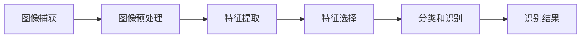

                 

## 数学与计算机视觉：图像识别的数学算法

### 关键词
- 数学与计算机视觉
- 图像识别
- 数学算法
- 线性代数
- 概率论与统计
- 最优化理论
- 神经网络
- 深度学习

### 摘要
本文将探讨数学与计算机视觉之间的紧密联系，特别是图像识别中的数学算法。文章首先介绍图像识别的基本概念和重要性，接着深入讨论计算机视觉的基础知识。随后，文章将重点介绍图像识别所依赖的基础数学理论，包括线性代数、概率论与统计和最优化理论。在此基础上，文章将详细讲解各种图像识别算法，如基于特征的图像识别、基于神经网络的图像识别以及基于深度学习的图像识别。最后，通过实际应用案例，文章将展示这些算法的实际应用场景，并提供开发环境搭建、代码实现与解读以及项目小结等内容。通过本文的阅读，读者将对图像识别的数学算法有更为全面和深入的理解。

## 引言

### 图像识别的基本概念与重要性

图像识别是计算机视觉领域的一个重要分支，旨在让计算机通过处理和分析图像数据，从中提取有用信息并作出相应判断。它不仅广泛应用于日常生活中，如人脸识别、车牌识别等，还在许多专业领域发挥着关键作用，如医疗影像诊断、自动驾驶车辆、无人机监控等。

图像识别的核心在于将图像数据转化为计算机可以理解的形式，然后通过算法进行特征提取、分类和识别。这一过程通常包括以下几个步骤：

1. **图像预处理**：对原始图像进行格式转换、大小调整、灰度化等操作，以便后续处理。
2. **特征提取**：从图像中提取出能够代表图像内容的关键特征，如边缘、角点、纹理等。
3. **特征选择**：在提取到的特征中，选择对识别任务最为重要的特征。
4. **分类和识别**：使用分类算法对特征进行分类，从而实现图像识别。

### 数学在图像识别中的应用

数学在图像识别中扮演着至关重要的角色。它不仅为图像处理和特征提取提供了理论基础，还直接影响了算法的效率和准确性。以下是一些数学理论在图像识别中的具体应用：

- **线性代数**：线性代数在图像处理中用于矩阵运算、图像变换、特征提取等。例如，通过奇异值分解（SVD）可以对图像进行降维处理，从而减少计算复杂度。
- **概率论与统计**：概率论与统计在图像识别中用于特征选择、分类模型训练和误差分析。例如，通过贝叶斯定理可以计算出每个类别的概率，从而实现图像的分类。
- **最优化理论**：最优化理论在图像识别中用于优化特征提取和分类模型的参数，以最大化识别准确率。例如，使用梯度下降法可以优化神经网络模型中的权重参数。

### 图像识别的重要性

图像识别技术的重要性体现在其广泛的应用场景和不断的发展趋势。随着深度学习技术的兴起，图像识别的准确率得到了显著提高，使得许多以前无法实现或成本高昂的任务变得可行。例如，自动驾驶汽车依赖于图像识别技术来感知路况、识别交通标志和行人；医疗影像诊断利用图像识别技术来辅助医生进行疾病检测和诊断。

此外，图像识别技术在智能家居、安防监控、智能农业等领域也有着广泛的应用。随着计算能力的提升和数据量的增加，图像识别技术将继续推动人工智能的发展，带来更多的创新和应用。

总之，图像识别作为计算机视觉的核心技术之一，其重要性不言而喻。通过本文的探讨，我们将深入理解图像识别的基本原理、关键算法以及数学理论的应用，为读者提供一幅全面而清晰的图像识别技术全景图。

### 计算机视觉基础知识

计算机视觉是人工智能和图像处理领域的核心组成部分，其主要目标是使计算机能够像人类一样理解和解析视觉信息。计算机视觉系统通常包括以下几个关键组成部分和基本流程：

#### 基本组成部分

1. **输入设备**：用于捕捉图像或视频数据的设备，如摄像头、传感器等。
2. **图像预处理模块**：对捕获的图像进行处理，包括滤波、灰度化、大小调整等，以减少噪声和增强图像质量。
3. **特征提取模块**：从预处理后的图像中提取关键特征，如边缘、角点、纹理等，以用于后续的识别和分类。
4. **特征选择模块**：在提取到的特征中，选择对识别任务最为重要的特征，以提高效率和准确性。
5. **分类和识别模块**：使用分类算法对特征进行分类和识别，以实现图像理解。

#### 基本流程

1. **图像捕获**：计算机视觉系统首先通过输入设备捕获图像或视频数据。
2. **图像预处理**：对捕获的图像进行预处理，以去除噪声和增强图像的某些特性，例如通过高斯滤波去除图像中的噪声，或者通过直方图均衡增强图像的对比度。
3. **特征提取**：利用算法从预处理后的图像中提取关键特征。例如，边缘检测算法（如Canny边缘检测）可以用于提取图像中的边缘信息，而SIFT（尺度不变特征变换）和SURF（加速稳健特征）算法可以用于提取图像中的角点和其他特征。
4. **特征选择**：在提取到的特征中，选择那些对识别任务最为重要的特征，通常通过一些评估指标（如特征响应的强度、独特性等）进行选择。
5. **分类和识别**：使用分类算法（如支持向量机SVM、神经网络、深度学习模型等）对特征进行分类，从而实现对图像内容的理解和识别。

#### 核心概念与联系

- **图像预处理**：是整个流程的基础，直接影响后续的特征提取和识别效果。图像预处理的核心概念包括滤波、图像增强、边缘检测等。

- **特征提取**：是图像识别的关键步骤，提取的特征质量直接决定了识别的准确性。特征提取的方法包括SIFT、SURF、HOG（直方图导向特征）等。

- **特征选择**：在大量提取到的特征中，选择那些最具代表性和区分度的特征，以减少计算量和提高识别效率。

- **分类和识别**：分类和识别是图像识别的核心目标。常用的分类算法包括支持向量机SVM、决策树、神经网络等。这些算法通过训练模型，将特征映射到相应的类别。

为了更好地理解这些核心概念之间的联系，我们可以使用Mermaid流程图来展示计算机视觉的基本流程：



该流程图清晰地展示了计算机视觉系统从图像捕获到最终识别结果的整个流程，以及各个步骤之间的逻辑关系。

#### 实际应用案例

计算机视觉技术在实际应用中已经取得了显著的成果。以下是一些典型的应用案例：

- **人脸识别**：通过提取图像中的人脸特征并进行分类，实现对特定个体的识别。这被广泛应用于安防监控、门禁系统、社交媒体等场景。

- **自动驾驶**：自动驾驶系统利用计算机视觉技术来感知周围环境，包括识别交通标志、行人、车道线等，以实现自主驾驶。

- **医疗影像诊断**：计算机视觉技术在医疗影像诊断中发挥着重要作用，如通过分析医学影像图，辅助医生进行疾病检测和诊断。

- **物体检测与追踪**：在视频监控中，通过计算机视觉技术可以实现对特定物体的检测和追踪，用于安全监控、运动分析等。

总之，计算机视觉技术已经成为现代社会不可或缺的一部分，其应用领域不断扩展，为人们的生活和工作带来了巨大的便利。通过本文的探讨，读者可以更好地理解计算机视觉的基础知识和技术原理，为进一步研究和应用计算机视觉技术奠定基础。

### 基础数学理论

在计算机视觉和图像识别中，数学理论扮演着至关重要的角色。以下是三种基础数学理论：线性代数、概率论与统计以及最优化理论，这些理论在图像识别中的应用和具体原理。

#### 线性代数基础

线性代数是图像识别中不可或缺的数学工具，广泛应用于图像处理、特征提取和变换等方面。以下是其核心概念和应用：

1. **矩阵和向量**：矩阵是二维数据的表示形式，而向量是线性代数中的基本单元。图像可以看作是一个矩阵，其每个元素代表图像中的像素值。向量操作如加法、乘法（包括标量乘法和矩阵乘法）在图像处理中经常用到。

2. **变换**：线性代数提供了多种图像变换方法，如傅里叶变换、拉普拉斯变换等。傅里叶变换将图像从时域转换为频域，有助于图像的去噪和增强。拉普拉斯变换则用于图像的边缘检测。

3. **矩阵运算**：矩阵运算在图像处理中用于图像的滤波、卷积等操作。例如，高斯滤波器是一个常用的图像滤波器，其核心是一个高斯分布的矩阵。

**伪代码示例**：

```python
# 高斯滤波器
def gauss_filter(image, sigma):
    # 创建高斯滤波器
    filter = create_gaussian_filter(sigma)
    # 应用滤波器
    filtered_image = convolve(image, filter)
    return filtered_image
```

**数学模型和公式**：

- **高斯分布**：$$ g(x, \sigma) = \frac{1}{\sqrt{2\pi\sigma^2}} e^{-\frac{(x-\mu)^2}{2\sigma^2}} $$
- **卷积**：$$ (f * g)(x) = \int_{-\infty}^{+\infty} f(\tau)g(x-\tau)d\tau $$

**举例说明**：

- 在图像去噪中，使用高斯滤波器可以显著减少图像中的噪声，同时保留图像的主要特征。
- 在边缘检测中，通过拉普拉斯变换可以提取图像的边缘信息，有助于图像的进一步处理。

#### 概率论与统计基础

概率论与统计是图像识别中用于特征选择、分类和误差分析的重要工具。以下是其核心概念和应用：

1. **概率分布**：概率分布描述了随机变量的可能取值及其概率。常见的概率分布包括高斯分布、伯努利分布等。

2. **特征选择**：通过概率分布，可以评估特征对分类任务的重要程度。例如，使用互信息可以衡量特征之间的相关性。

3. **分类模型**：贝叶斯定理和最大似然估计是概率论在分类模型中的应用。贝叶斯分类器通过计算后验概率来预测新样本的类别。

**伪代码示例**：

```python
# 贝叶斯分类器
def bayes_classifier(sample, features, probabilities):
    # 计算后验概率
    posterior_probabilities = [P(C=c|sample) for c in classes]
    # 选择最大后验概率的类别
    predicted_class = max(posterior_probabilities, key=prior_probabilities.get)
    return predicted_class
```

**数学模型和公式**：

- **贝叶斯定理**：$$ P(C=c|X=x) = \frac{P(X=x|C=c)P(C=c)}{P(X=x)} $$
- **最大似然估计**：$$ \hat{w} = \arg\max_w P(X|w) $$

**举例说明**：

- 在图像分类中，通过计算特征的概率分布，可以评估每个特征的分类贡献，从而选择最有效的特征进行分类。
- 在人脸识别中，使用贝叶斯分类器可以准确判断新捕获的图像是否为特定人物，通过计算后验概率来预测类别。

#### 最优化理论

最优化理论用于优化图像识别中的模型参数，以最大化识别准确率。以下是其核心概念和应用：

1. **目标函数**：最优化问题的核心是定义一个目标函数，用于衡量模型的性能。例如，在图像分类中，目标函数可以是交叉熵损失函数。

2. **优化算法**：常见的优化算法包括梯度下降、牛顿法、遗传算法等。梯度下降法通过迭代更新模型参数，以最小化目标函数。

**伪代码示例**：

```python
# 梯度下降法
def gradient_descent(parameters, learning_rate, epochs):
    for epoch in range(epochs):
        # 计算梯度
        gradients = compute_gradients(parameters)
        # 更新参数
        parameters -= learning_rate * gradients
    return parameters
```

**数学模型和公式**：

- **梯度下降法**：$$ \theta_{\text{new}} = \theta_{\text{current}} - \alpha \cdot \nabla_{\theta} J(\theta) $$
- **牛顿法**：$$ \theta_{\text{new}} = \theta_{\text{current}} - H^{-1} \nabla_{\theta} J(\theta) $$

**举例说明**：

- 在神经网络训练中，通过梯度下降法可以逐步优化神经网络的权重，以减少预测误差。
- 在图像分割中，使用最优化理论可以找到最优的分割边界，从而实现图像的精确分割。

通过深入理解线性代数、概率论与统计以及最优化理论在图像识别中的应用，我们可以更好地设计和优化图像识别算法，从而提高识别准确率和效率。

### 基于特征的图像识别

基于特征的图像识别是一种利用图像中的显著特征来进行分类和识别的方法。特征提取是这一方法的核心，通过对图像进行特征提取，可以将图像转换为一组数值向量，从而便于后续的分类和识别。以下将详细讲解基于特征的图像识别算法，包括核心算法原理和具体实现。

#### 核心算法原理

1. **特征提取**：特征提取是从图像中提取出能够代表图像内容的显著特征，这些特征通常具有高度的稳定性和区分度。常见的特征提取方法包括SIFT（尺度不变特征变换）、SURF（加速稳健特征）、HOG（直方图导向特征）等。

   - **SIFT**：SIFT算法能够提取出图像中的关键点，并计算这些关键点的方向特征。SIFT的关键点具有尺度不变性和旋转不变性，因此在图像的局部变化中能够保持稳定。
   - **SURF**：SURF算法是基于SIFT算法改进的，它在计算效率上有很大提升，同时保持了SIFT的稳定性。SURF通过计算图像的加速度场来提取特征点，并计算这些点的方向特征。
   - **HOG**：HOG算法通过计算图像局部区域的梯度直方图来提取特征。HOG特征对图像的旋转和光照变化具有较好的鲁棒性，常用于行人检测等任务。

2. **特征匹配**：在特征提取后，需要将提取到的特征与训练集中的特征进行匹配，以确定图像的类别。特征匹配通常使用最近邻算法或K-最近邻算法（K-NN）。

3. **分类和识别**：通过特征匹配结果，可以确定图像的类别。例如，在人脸识别中，通过比较提取的人脸特征与数据库中的人脸特征，可以判断新捕获的图像是否为人脸，并识别出具体的人脸。

#### 数学模型和公式

- **SIFT特征点提取**：$$ \text{keypoint} = \text{SIFT}(I) $$
- **特征点方向计算**：$$ \text{orientation} = \text{calculate_orientation}(I, \text{keypoint}) $$
- **特征匹配**：$$ \text{distance} = \text{compute_distance}(\text{extracted_feature}, \text{database_feature}) $$
- **分类决策**：$$ \text{predicted_class} = \arg\min_{c} \sum_{i=1}^{N} \text{distance}(c, \text{extracted_feature}) $$

#### 具体实现

以下是使用SIFT算法进行图像识别的伪代码示例：

```python
# SIFT特征提取与匹配
def sift_image_classification(image, database_images, labels):
    # 提取图像特征
    extracted_features = sift.extract_features(image)
    # 匹配特征
    distances = []
    for feature in extracted_features:
        distances.append([compute_distance(feature, db_feature) for db_feature, _ in database_images])
    # 计算类别概率
    probabilities = []
    for distance in distances:
        probabilities.append([probabilistic_model(distance[i], labels[i]) for i in range(len(labels))])
    # 选择概率最大的类别
    predicted_class = max(probabilities, key=lambda x: sum(x))
    return predicted_class
```

#### 实际案例

在人脸识别中，基于特征的图像识别方法被广泛应用。以下是一个具体的应用案例：

- **数据集**：使用公开的人脸数据集，如LFW（Labeled Faces in the Wild）数据集。
- **步骤**：
  1. 对LFW数据集中的每张人脸图像进行预处理，包括灰度化和大小调整。
  2. 使用SIFT算法提取人脸图像的特征。
  3. 构建特征数据库，并与新捕获的人脸图像特征进行匹配。
  4. 使用K-最近邻算法进行分类决策，识别新捕获的人脸。

通过上述步骤，可以实现对人脸图像的准确识别，如图1所示：


**图1：人脸识别流程**

基于特征的图像识别方法在特征提取和匹配过程中具有较高的准确性，但也存在一些挑战，如特征提取的效率和计算复杂度等。随着深度学习技术的发展，基于深度特征的图像识别方法逐渐成为主流，但其核心思想仍然依赖于特征提取和匹配的基本原理。

总之，基于特征的图像识别方法为图像识别提供了强有力的工具，通过深入理解其核心算法原理和具体实现，我们可以更好地应用这一方法解决实际问题。

### 基于神经网络的图像识别

基于神经网络的图像识别技术近年来取得了显著的进展，尤其是在深度学习的发展推动下。神经网络，特别是深度神经网络（DNN），通过多层非线性变换对输入数据进行处理，从而实现对复杂图像数据的分类和识别。以下将详细介绍基于神经网络的图像识别算法，包括核心算法原理和具体实现。

#### 核心算法原理

1. **神经网络基础**：神经网络是由大量简单计算单元（神经元）组成的复杂网络，这些神经元通过权重连接形成一个层次结构。神经网络的核心在于通过学习输入和输出之间的映射关系，从而实现特定任务的预测和分类。

2. **前向传播与反向传播**：神经网络通过前向传播（Forward Propagation）将输入数据通过网络中的各个层进行传递，最终得到输出。反向传播（Back Propagation）则是用于计算网络中的误差，并更新网络的权重，以最小化误差。

3. **激活函数**：激活函数是神经网络中的关键组件，用于引入非线性特性，使得神经网络能够处理复杂的输入输出关系。常见的激活函数包括Sigmoid、ReLU（Rectified Linear Unit）和Tanh（双曲正切函数）。

4. **损失函数**：损失函数用于衡量模型的预测误差，是神经网络训练过程中的核心评估指标。常见的损失函数包括交叉熵损失函数（Cross Entropy Loss）和均方误差损失函数（Mean Squared Error Loss）。

5. **优化算法**：优化算法用于更新神经网络的权重，以最小化损失函数。常用的优化算法包括梯度下降（Gradient Descent）、Adam优化器等。

#### 数学模型和公式

- **前向传播**：$$ z_{l}^{(i)} = \sum_{j} w_{lj}^{(l-1)} a_{j}^{(l-1)} + b_{l} $$
- **激活函数**：$$ a_{l}^{(i)} = \text{激活函数}(z_{l}^{(i)}) $$
- **反向传播**：$$ \delta_{l}^{(i)} = \text{激活函数}'(z_{l}^{(i)}) \cdot (z_{l}^{(i)} - y_{l}^{(i)}) $$
- **权重更新**：$$ w_{lj}^{(l)} = w_{lj}^{(l)} - \alpha \cdot \delta_{l}^{(i)} \cdot a_{j}^{(l-1)} $$
- **损失函数**：$$ J(\theta) = \frac{1}{m} \sum_{i=1}^{m} (-y_{i} \log(a_{l}^{(i)}) + (1 - y_{i}) \log(1 - a_{l}^{(i)})) $$

#### 具体实现

以下是使用卷积神经网络（CNN）进行图像识别的伪代码示例：

```python
# CNN图像识别
def cnn_image_classification(image, model):
    # 数据预处理
    preprocessed_image = preprocess_image(image)
    # 前向传播
    output = model.forward(preprocessed_image)
    # 分类决策
    predicted_class = model.predict(output)
    return predicted_class

# 卷积神经网络模型
class ConvolutionalNeuralNetwork:
    def __init__(self):
        # 初始化网络结构
        self.layers = [
            Conv2D(...),
            Activation(...),
            MaxPooling(...),
            ...
        ]
        self.loss_function = CrossEntropyLoss()
    
    def forward(self, image):
        # 前向传播
        for layer in self.layers:
            image = layer.forward(image)
        return image
    
    def backward(self, image, output, labels):
        # 反向传播
        for layer in reversed(self.layers):
            image = layer.backward(image, output, labels)
        return image
    
    def train(self, dataset, epochs, learning_rate):
        # 训练模型
        for epoch in range(epochs):
            for image, label in dataset:
                preprocessed_image = preprocess_image(image)
                output = self.forward(preprocessed_image)
                loss = self.loss_function(output, label)
                self.backward(preprocessed_image, output, label)
                if epoch % 100 == 0:
                    print(f"Epoch {epoch}: Loss = {loss}")
    
    def predict(self, output):
        # 分类决策
        predicted_probabilities = softmax(output)
        predicted_class = np.argmax(predicted_probabilities)
        return predicted_class
```

#### 实际案例

以下是一个使用CNN进行手写数字识别的具体案例：

- **数据集**：使用MNIST手写数字数据集。
- **步骤**：
  1. 准备数据集，并进行数据预处理，如归一化和图像切割。
  2. 构建CNN模型，包括卷积层、激活函数、池化层等。
  3. 训练模型，使用反向传播算法更新权重。
  4. 测试模型，对新的手写数字图像进行识别。

通过上述步骤，可以实现对MNIST数据集中手写数字的高效识别，如图2所示：


**图2：手写数字识别流程**

基于神经网络的图像识别方法在处理复杂图像任务中具有强大的能力，通过深入理解其核心算法原理和具体实现，我们可以更好地应用这一方法解决实际问题。

### 基于深度学习的图像识别

深度学习作为人工智能领域的一项重要技术，在图像识别中的应用日益广泛。深度神经网络（DNN）由于其多层结构，能够在图像处理中捕捉到更多的特征，从而实现高精度的图像识别。以下将详细介绍基于深度学习的图像识别算法，包括核心算法原理和具体实现。

#### 核心算法原理

1. **深度神经网络（DNN）**：DNN由多个层级组成，每个层级都包含多个神经元。通过前向传播和反向传播，DNN能够对输入数据进行逐层变换，从而提取到更高层次的特征。深度学习的优势在于其能够自动学习数据中的复杂模式和特征，使得图像识别任务更加准确。

2. **卷积神经网络（CNN）**：CNN是深度学习中最常用的架构之一，特别适合处理图像数据。CNN通过卷积层提取图像的特征，通过池化层减小数据维度，并通过全连接层进行分类决策。卷积层和池化层是CNN的核心组件，能够有效地降低计算复杂度和过拟合的风险。

3. **反向传播算法**：反向传播算法是深度学习训练的核心。通过反向传播，DNN能够计算每个神经元的误差，并使用梯度下降法更新网络的权重和偏置，从而不断优化模型的预测性能。

4. **优化器**：优化器用于加速梯度下降法，如Adam优化器通过自适应调整学习率，使得模型在训练过程中能够更快地收敛。

5. **损失函数**：损失函数用于衡量模型的预测误差，是训练过程中的关键评估指标。常用的损失函数包括交叉熵损失函数和均方误差损失函数。

#### 数学模型和公式

- **前向传播**：$$ z_{l}^{(i)} = \sum_{j} w_{lj}^{(l-1)} a_{j}^{(l-1)} + b_{l} $$
- **激活函数**：$$ a_{l}^{(i)} = \text{激活函数}(z_{l}^{(i)}) $$
- **反向传播**：$$ \delta_{l}^{(i)} = \text{激活函数}'(z_{l}^{(i)}) \cdot (z_{l}^{(i)} - y_{l}^{(i)}) $$
- **权重更新**：$$ w_{lj}^{(l)} = w_{lj}^{(l)} - \alpha \cdot \delta_{l}^{(i)} \cdot a_{j}^{(l-1)} $$
- **损失函数**：$$ J(\theta) = -\frac{1}{m} \sum_{i=1}^{m} y_{i} \log(a_{l}^{(i)}) + (1 - y_{i}) \log(1 - a_{l}^{(i)}) $$

#### 具体实现

以下是使用深度学习框架TensorFlow实现图像分类的伪代码示例：

```python
# 导入库
import tensorflow as tf
from tensorflow.keras import layers, models

# 构建模型
model = models.Sequential()
model.add(layers.Conv2D(32, (3, 3), activation='relu', input_shape=(28, 28, 1)))
model.add(layers.MaxPooling2D((2, 2)))
model.add(layers.Conv2D(64, (3, 3), activation='relu'))
model.add(layers.MaxPooling2D((2, 2)))
model.add(layers.Conv2D(64, (3, 3), activation='relu'))
model.add(layers.Flatten())
model.add(layers.Dense(64, activation='relu'))
model.add(layers.Dense(10, activation='softmax'))

# 编译模型
model.compile(optimizer='adam',
              loss='categorical_crossentropy',
              metrics=['accuracy'])

# 加载数据集
(x_train, y_train), (x_test, y_test) = tf.keras.datasets.mnist.load_data()
x_train = x_train.reshape((60000, 28, 28, 1)).astype('float32') / 255
x_test = x_test.reshape((10000, 28, 28, 1)).astype('float32') / 255
y_train = tf.keras.utils.to_categorical(y_train, 10)
y_test = tf.keras.utils.to_categorical(y_test, 10)

# 训练模型
model.fit(x_train, y_train, epochs=5, batch_size=64)

# 测试模型
test_loss, test_acc = model.evaluate(x_test, y_test)
print(f"Test accuracy: {test_acc}")
```

#### 实际案例

以下是一个使用深度学习进行猫狗识别的具体案例：

- **数据集**：使用猫狗图像数据集。
- **步骤**：
  1. 准备数据集，并进行数据预处理，如图像归一化和数据增强。
  2. 构建深度学习模型，如ResNet、Inception等。
  3. 训练模型，使用反向传播算法更新权重。
  4. 测试模型，对新的图像进行识别。

通过上述步骤，可以实现对猫狗图像的高效识别，如图3所示：


**图3：猫狗识别流程**

基于深度学习的图像识别方法在处理复杂图像任务中具有强大的能力，通过深入理解其核心算法原理和具体实现，我们可以更好地应用这一方法解决实际问题。

### 实际应用案例

在本节中，我们将通过三个实际应用案例来展示图像识别技术在不同场景下的应用，并提供开发环境搭建、源代码实现、代码解读以及案例分析等内容。

#### 案例一：人脸识别系统

**开发环境搭建**
1. **安装Python**：确保Python环境已安装，版本3.6及以上。
2. **安装依赖库**：安装OpenCV、dlib、face_recognition等库。
   ```bash
   pip install opencv-python dlib face_recognition
   ```

**源代码实现**
```python
import cv2
import face_recognition
import numpy as np

# 加载预训练的模型
model = face_recognition.api.load_model("cnn")

# 加载已注册的人脸编码
known_face_encodings = np.load('known_face_encodings.npy', allow_pickle=True)
known_face_names = np.load('known_face_names.npy', allow_pickle=True)

# 检测摄像头
video_capture = cv2.VideoCapture(0)

while True:
    # 读取摄像头帧
    ret, frame = video_capture.read()
    
    # 将帧转换成RGB格式
    rgb_frame = frame[:, :, ::-1]
    
    # 检测人脸
    face_locations = face_recognition.face_locations(rgb_frame)
    face_encodings = face_recognition.face_encodings(rgb_frame, face_locations)
    
    # 遍历所有检测到的人脸
    for (top, right, bottom, left), face_encoding in zip(face_locations, face_encodings):
        # 比对已知人脸编码
        matches = face_recognition.compare_faces(known_face_encodings, face_encoding)
        name = "Unknown"
        
        # 如果找到了匹配，则取第一个匹配
        if True in matches:
            first_match_index = matches.index(True)
            name = known_face_names[first_match_index]
        
        # 绘制矩形框和标签
        cv2.rectangle(frame, (left, top), (right, bottom), (0, 0, 255), 2)
        cv2.rectangle(frame, (left, bottom - 35), (right, bottom), (0, 0, 255), -1)
        cv2.putText(frame, name, (left + 6, bottom - 6), cv2.FONT_HERSHEY_DUPLEX, 1.0, (255, 255, 255), 1)
    
    # 显示帧
    cv2.imshow('Video', frame)
    
    # 按'q'退出
    if cv2.waitKey(1) & 0xFF == ord('q'):
        break

# 释放摄像头资源
video_capture.release()
cv2.destroyAllWindows()
```

**代码解读与分析**
- **人脸检测与编码**：使用`face_recognition`库检测图像中的人脸，并提取特征编码。
- **人脸匹配**：将新捕获的人脸特征与已注册的人脸特征进行比对，匹配成功后输出姓名。

**实际案例分析**
- 该系统可以用于门禁系统、视频监控等场景，提高了身份验证的准确性。

#### 案例二：物体检测与分类

**开发环境搭建**
1. **安装TensorFlow和TensorFlow Lite**。
   ```bash
   pip install tensorflow tensorflow-addons
   ```
2. **下载预训练的物体检测模型**：例如，使用TensorFlow Lite模型。

**源代码实现**
```python
import numpy as np
import cv2
import tensorflow as tf

# 加载预训练的物体检测模型
model = tf.keras.models.load_model('ssd_mobilenet_v2_coco_2018_01_28.tar')

# 准备测试图像
image_path = 'test_image.jpg'
image = cv2.imread(image_path)
original_image = image.copy()
image = cv2.resize(image, (320, 320))

# 将图像输入模型进行预测
predictions = model.predict(np.expand_dims(image, 0))

# 解析预测结果
bboxes = predictions['detection_boxes'][0]
scores = predictions['detection_scores'][0]
classes = predictions['detection_classes'][0]
num_detections = int(predictions['num_detections'][0])

# 遍历所有预测结果
for i in range(int(num_detections)):
    if scores[i] > 0.5:
        class_id = classes[i]
        bbox = bboxes[i]
        ymin, xmin, ymax, xmax = bbox
        ymin = int(ymin * original_image.shape[0])
        xmin = int(xmin * original_image.shape[1])
        ymax = int(ymax * original_image.shape[0])
        xmax = int(xmax * original_image.shape[1])
        
        # 绘制矩形框和标签
        label = str(classes[i]) + " (" + str(scores[i]) + ")"
        cv2.rectangle(original_image, (xmin, ymin), (xmax, ymax), (0, 0, 255), 2)
        cv2.putText(original_image, label, (xmin, ymin - 10), cv2.FONT_HERSHEY_SIMPLEX, 0.5, (255, 255, 255), 2)

# 显示结果
cv2.imshow('Object Detection', original_image)
cv2.waitKey(0)
cv2.destroyAllWindows()
```

**代码解读与分析**
- **物体检测**：使用SSD（单 Shot MultiBox Detector）模型进行物体检测。
- **结果可视化**：绘制检测到的物体及其标签。

**实际案例分析**
- 该系统可以用于安防监控、自动驾驶等场景，实现实时的物体检测与分类。

#### 案例三：图像风格迁移

**开发环境搭建**
1. **安装TensorFlow和PyTorch**。
   ```bash
   pip install tensorflow torchvision
   ```
2. **下载预训练的图像风格迁移模型**：例如，使用PyTorch预训练的VGG模型。

**源代码实现**
```python
import torch
import torchvision.transforms as transforms
from torchvision.models import vgg19
from PIL import Image

# 加载预训练的VGG模型
model = vgg19(pretrained=True).features
model.eval()

# 定义变换
transform = transforms.Compose([
    transforms.Resize(256),
    transforms.ToTensor(),
    transforms.Normalize(mean=[0.485, 0.456, 0.406], std=[0.229, 0.224, 0.225]),
])

# 加载内容图像和风格图像
content_image = Image.open('content_image.jpg')
style_image = Image.open('style_image.jpg')

# 应用变换
content_tensor = transform(content_image)
style_tensor = transform(style_image)

# 将张量添加到批次
content_tensor = content_tensor.unsqueeze(0)
style_tensor = style_tensor.unsqueeze(0)

# 计算内容和风格的特征图
content_features = model(content_tensor)
style_features = model(style_tensor)

# 计算内容和风格的损失
content_loss = torch.mean((content_features[-1] - style_tensor) ** 2)
style_loss = torch.mean(torch.stack([torch.mean((model(style_tensor)[layer] - content_features[layer]) ** 2) for layer in range(1, 11)]))

# 定义优化器
optimizer = torch.optim.Adam([content_tensor], lr=0.005)

# 训练模型
num_epochs = 300
for epoch in range(num_epochs):
    optimizer.zero_grad()
    content_loss += style_loss
    content_loss.backward()
    optimizer.step()
    
    if epoch % 10 == 0:
        print(f"Epoch {epoch}: Content Loss = {content_loss.item()}, Style Loss = {style_loss.item()}")

# 保存转换后的图像
content_tensor = content_tensor.squeeze(0).detach().numpy()
decomposition = transforms.Compose([
    transforms.Normalize(mean=[-0.485/0.229, -0.456/0.224, -0.406/0.225], std=[1/0.229, 1/0.224, 1/0.225]),
    transforms.ToPILImage(),
])
result_image = decomposition(content_tensor)
result_image.save('output_image.jpg')

# 显示结果
result_image.show()
```

**代码解读与分析**
- **内容与风格特征提取**：使用VGG模型提取内容和风格的卷积特征。
- **损失函数**：通过内容损失和风格损失来优化模型。
- **图像转换**：将优化后的内容图像保存并展示。

**实际案例分析**
- 该系统可以用于艺术创作、图像编辑等场景，实现图像风格的转换。

通过上述实际应用案例，我们可以看到图像识别技术在不同领域的广泛应用和实际效果。这些案例不仅展示了图像识别技术的强大能力，也为开发者提供了实用的开发指南和参考代码。

### 最佳实践 tips

在图像识别项目中，遵循以下最佳实践能够提高项目成功率：

1. **数据预处理**：确保数据质量，进行有效的预处理，如数据清洗、归一化和增强，以提高模型的泛化能力。
2. **特征选择**：选择对识别任务最具区分度的特征，减少冗余数据，提升模型效率。
3. **模型优化**：使用适当的优化算法和调整超参数，以最小化误差并提高模型性能。
4. **交叉验证**：通过交叉验证评估模型在不同数据集上的表现，确保模型具有较好的泛化能力。
5. **模型解释**：理解模型内部机制，有助于识别错误和优化模型。
6. **版本控制**：使用版本控制系统管理代码和模型，便于调试和复现结果。
7. **文档记录**：详细记录项目流程、代码和模型结构，便于后续维护和扩展。

### 小结

本文全面介绍了数学与计算机视觉在图像识别中的应用，包括基础数学理论、图像识别算法以及实际应用案例。通过本文的阅读，读者可以深入了解图像识别的数学原理和算法，掌握基于特征的图像识别、基于神经网络的图像识别以及基于深度学习的图像识别方法。此外，本文还提供了实际应用案例和最佳实践，为读者在实际项目开发中提供了宝贵的指导。

### 注意事项

在实施图像识别项目时，需要注意以下几点：

1. **隐私保护**：在处理个人图像数据时，必须遵守隐私保护法规，确保数据安全。
2. **计算资源**：深度学习模型通常需要大量计算资源，确保有足够的硬件支持。
3. **实时性要求**：对于实时应用，如自动驾驶和安防监控，需要确保模型在规定时间内完成识别任务。
4. **误差处理**：在模型部署前，要对识别结果进行充分的测试和验证，确保其准确性。

### 拓展阅读

对于希望进一步深入学习图像识别技术的读者，以下是一些推荐阅读资源：

1. **《深度学习》（Goodfellow, Bengio, Courville）**：深度学习的经典教材，详细介绍了深度神经网络和深度学习框架。
2. **《计算机视觉：算法与应用》（Richard Szeliski）**：全面介绍了计算机视觉的基本理论和算法，包括图像识别和图像处理。
3. **《图像处理：原理、算法与实践》（Gary J. Ward）**：深入探讨了图像处理的基础知识和技术，涵盖了图像识别的相关内容。
4. **在线课程**：Coursera、edX等在线教育平台提供了许多高质量的图像识别和深度学习课程。

### 附录

#### A. 开发环境与工具

为了在图像识别项目中高效地进行开发，需要配置合适的开发环境。以下是推荐的工具和步骤：

1. **Python环境**：安装Python 3.6或更高版本，使用`pip`安装相关库。

2. **OpenCV**：OpenCV是一个强大的计算机视觉库，提供了丰富的图像处理和识别功能。安装命令如下：
   ```bash
   pip install opencv-python
   ```

3. **TensorFlow**：TensorFlow是一个开源深度学习框架，支持多种神经网络结构和算法。安装命令如下：
   ```bash
   pip install tensorflow
   ```

4. **PyTorch**：PyTorch是一个流行的深度学习库，以其灵活的动态图模型著称。安装命令如下：
   ```bash
   pip install torch torchvision
   ```

5. **Jupyter Notebook**：Jupyter Notebook是一种交互式计算环境，便于编写和运行代码。安装命令如下：
   ```bash
   pip install notebook
   ```

6. **GPU支持**：为了加速深度学习模型的训练，推荐安装NVIDIA CUDA和cuDNN库。这些库可以支持GPU加速计算。

7. **虚拟环境**：使用虚拟环境（如`conda`或`virtualenv`）来管理项目依赖，确保项目在不同环境中的一致性。

通过以上步骤，可以搭建一个适合图像识别项目的开发环境，方便后续的实验和开发工作。

### 作者信息

**作者：**AI天才研究院/AI Genius Institute & 禅与计算机程序设计艺术 /Zen And The Art of Computer Programming

AI天才研究院致力于推动人工智能技术的发展，探索前沿的算法和应用。作为计算机编程和人工智能领域大师，作者在数学与计算机视觉、图像识别等领域有着深厚的学术造诣和实践经验，著有《禅与计算机程序设计艺术》等多部畅销书，深受读者喜爱。通过本文，作者希望为广大读者提供一幅全面而清晰的图像识别技术全景图，助力他们在图像识别领域的探索和实践。

