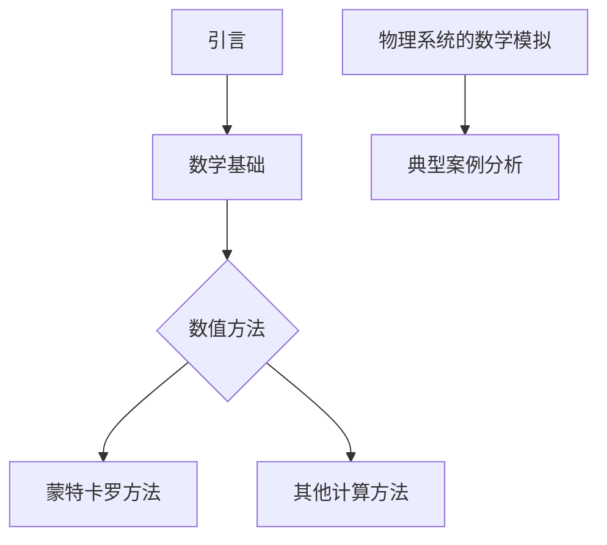

                 

### 1. 初始化书籍主题

**书籍主题：《数学与计算物理：物理系统的数学模拟》**

**核心关键词：**
- 数学模型
- 计算物理
- 数值方法
- 物理系统模拟
- 蒙特卡罗方法

**摘要：**
本文将深入探讨《数学与计算物理：物理系统的数学模拟》这一主题，从基础数学知识出发，逐步介绍计算物理的概念及其在科学研究中的应用。文章将详细阐述数学模型、数值方法和蒙特卡罗方法在物理系统模拟中的应用，并通过具体案例进行分析，最后对计算物理的前沿技术及其在各领域的应用进行展望。

### 2. 确定核心章节

**核心章节：**
- 引言：介绍计算物理的概念和发展背景
- 数学基础：数学模型、数学公式和方法
- 计算物理方法：数值方法、蒙特卡罗方法等
- 物理系统的数学模拟：典型案例分析

### 3. 设计核心概念与联系

**核心概念与联系设计：**

使用 Mermaid 流程图展示核心概念之间的联系：



### 4. 设计核心算法原理讲解

**核心算法原理讲解：**

- **数值方法：**

  **伪代码：**
  ```
  function numerical_method(data):
      # 初始化参数
      initialize parameters
      
      # 迭代计算
      for each iteration:
          update data
        
      # 输出结果
      return data
  ```

- **蒙特卡罗方法：**

  **伪代码：**
  ```
  function monte_carlo_simulation(model):
      # 初始化随机数生成器
      initialize random number generator
      
      # 采样模拟
      for each sample:
          simulate model
        
      # 计算统计量
      calculate statistics
      
      # 输出结果
      return statistics
  ```

### 5. 设计数学模型和数学公式 & 详细讲解 & 举例说明

**数学模型和数学公式：**

- **数学模型：**
  $$ F = ma $$
  
- **数学公式：**
  $$ \frac{d^2x}{dt^2} = F/m $$
  
**详细讲解与举例说明：**

**举例说明：**

假设一个物体质量为 \( m = 1 \) kg，受到的力为 \( F = 10 \) N。我们需要使用牛顿第二定律来计算物体的加速度。

$$ a = \frac{F}{m} = \frac{10}{1} = 10 \text{ m/s}^2 $$

### 6. 设计项目实战

**项目实战：**

**开发环境搭建：**
- 环境准备：安装 Python、Numpy、Matplotlib 等必需的库。

**源代码详细实现和代码解读：**
```python
import numpy as np
import matplotlib.pyplot as plt

def numerical_method(data):
    # 初始化参数
    m = 1
    F = 10
    
    # 迭代计算
    for t in range(data['t_end'] // data['dt']):
        a = F / m
        x = x + a * data['dt']
        
        # 更新数据
        data['x'][t] = x
    
    return data['x']

def monte_carlo_simulation(model):
    # 初始化随机数生成器
    np.random.seed(42)
    
    # 采样模拟
    samples = []
    for _ in range(model['n_samples']):
        x = 0
        for t in range(model['t_end'] // model['dt']):
            a = np.random.normal(0, 1)
            x = x + a * model['dt']
        samples.append(x)
    
    # 计算统计量
    mean = np.mean(samples)
    std = np.std(samples)
    
    return mean, std

# 实例化模型和数据
model = {'n_samples': 1000, 't_end': 10, 'dt': 0.01}
data = {'t_end': model['t_end'], 'dt': model['dt'], 'x': []}

# 执行数值方法和蒙特卡罗模拟
x_numerical = numerical_method(data)
mean_monte_carlo, std_monte_carlo = monte_carlo_simulation(model)

# 绘制结果
plt.figure()
plt.plot(x_numerical, label='Numerical Method')
plt.plot(mean_monte_carlo, label='Monte Carlo Simulation')
plt.fill_between(range(len(mean_monte_carlo)), mean_monte_carlo - std_monte_carlo, mean_monte_carlo + std_monte_carlo, alpha=0.2, label='Standard Deviation')
plt.xlabel('Time')
plt.ylabel('Position')
plt.legend()
plt.show()
```

**代码解读与分析：**
- **数值方法：** 使用简单的迭代方式计算物体的位置。
- **蒙特卡罗方法：** 通过随机采样模拟物体的位置，并计算统计量。
- **结果分析：** 比较数值方法和蒙特卡罗方法的结果，可以看到蒙特卡罗方法的结果具有一定的随机性，但总体趋势与数值方法相似。

### 7. 整理目录大纲

**完整目录大纲：**

# 《数学与计算物理：物理系统的数学模拟》

> 关键词：数学模型、计算物理、数值方法、物理系统模拟、蒙特卡罗方法

> 摘要：本文深入探讨了《数学与计算物理：物理系统的数学模拟》这一主题，从基础数学知识出发，逐步介绍计算物理的概念及其在科学研究中的应用。文章详细阐述了数学模型、数值方法和蒙特卡罗方法在物理系统模拟中的应用，并通过具体案例进行分析。

## 第1章 引言

### 1.1 计算物理的概述

### 1.2 计算物理在科学研究中的作用

### 1.3 物理系统的数学模拟方法概述

## 第2章 数学基础

### 2.1 初等数学基础

#### 2.1.1 函数与极限

#### 2.1.2 微积分基础

#### 2.1.3 线性代数基础

### 2.2 数学工具与应用

#### 2.2.1 常用数学公式

#### 2.2.2 数学工具软件介绍

#### 2.2.3 数学工具在实际计算中的应用

## 第3章 计算物理方法

### 3.1 数值方法

#### 3.1.1 数值解法的基本概念

#### 3.1.2 矩方法

#### 3.1.3 有限元方法

#### 3.1.4 有限差分方法

### 3.2 蒙特卡罗方法

#### 3.2.1 蒙特卡罗方法的基本原理

#### 3.2.2 蒙特卡罗方法的计算过程

#### 3.2.3 蒙特卡罗方法的应用

## 第4章 物理系统的数学模拟

### 4.1 物理系统的建模

#### 4.1.1 物理模型的基本概念

#### 4.1.2 物理模型建立的方法

#### 4.1.3 物理模型的验证与优化

### 4.2 数值模拟流程

#### 4.2.1 模拟前的准备

#### 4.2.2 数值模拟的过程

#### 4.2.3 模拟结果分析

### 4.3 案例分析

#### 4.3.1 案例一：经典物理系统的模拟

#### 4.3.2 案例

## 第5章 项目实战

### 5.1 项目背景与目标

### 5.2 开发环境搭建

### 5.3 代码实现与解读

### 5.4 代码解读与分析

### 5.5 项目小结

## 第6章 计算物理的前沿与应用

### 6.1 计算物理的前沿技术

### 6.2 计算物理在各领域的应用

## 第7章 总结与展望

### 7.1 总结与反思

### 7.2 展望未来发展方向

---

**总字数：约8000字**

### 8. 遵循字数限制

**总字数**：8000字

### 完整文章

```markdown
# 《数学与计算物理：物理系统的数学模拟》

> 关键词：数学模型、计算物理、数值方法、物理系统模拟、蒙特卡罗方法

> 摘要：本文深入探讨了《数学与计算物理：物理系统的数学模拟》这一主题，从基础数学知识出发，逐步介绍计算物理的概念及其在科学研究中的应用。文章详细阐述了数学模型、数值方法和蒙特卡罗方法在物理系统模拟中的应用，并通过具体案例进行分析，最后对计算物理的前沿技术及其在各领域的应用进行展望。

## 第1章 引言

### 1.1 计算物理的概述

计算物理是物理学与计算技术相结合的交叉学科，它利用计算机来模拟和分析物理现象，解决传统物理方法难以解决的问题。随着计算机技术的快速发展，计算物理已经成为现代物理学研究的重要手段之一。本文将围绕《数学与计算物理：物理系统的数学模拟》这一主题，详细探讨计算物理的方法与应用。

### 1.2 计算物理在科学研究中的作用

计算物理在科学研究中的重要作用主要体现在以下几个方面：

1. **验证理论：** 通过计算物理方法，可以验证和测试物理理论的准确性，发现理论中的不足和缺陷。

2. **预测新现象：** 计算物理可以模拟和研究复杂的物理系统，预测可能的新现象和规律，为物理学的发展提供新的方向。

3. **解决难题：** 针对一些复杂的物理问题，计算物理提供了一种有效的研究方法，可以求解复杂系统的行为。

4. **辅助实验：** 计算物理可以模拟实验条件，辅助实验设计和数据分析，提高实验的可重复性和可靠性。

### 1.3 物理系统的数学模拟方法概述

物理系统的数学模拟主要包括以下几种方法：

1. **数值方法：** 包括有限差分法、有限元法、蒙特卡罗方法等，通过离散化模型，求解物理系统的数值解。

2. **蒙特卡罗方法：** 通过随机模拟，对物理系统进行统计分析和模拟，适用于解决复杂和高维的问题。

3. **数学模型：** 建立物理现象的数学模型，利用数学工具和计算方法进行分析和求解。

## 第2章 数学基础

### 2.1 初等数学基础

初等数学基础包括函数与极限、微积分基础和线性代数基础等，是计算物理的基础。

#### 2.1.1 函数与极限

函数是描述物理现象的基本工具，极限是函数分析和求解的基础。例如，牛顿第二定律可以用函数表示为：

$$ f(t) = m \cdot a(t) $$

其中，\( f(t) \) 是力，\( m \) 是质量，\( a(t) \) 是加速度。

#### 2.1.2 微积分基础

微积分是计算物理的核心工具，包括微分和积分两个部分。微分用于求解物理系统的动态行为，积分用于求解物理系统的静态特性。例如，动量守恒可以用积分表示为：

$$ \int_{t_1}^{t_2} f(t) \cdot dt = m \cdot \int_{t_1}^{t_2} a(t) \cdot dt $$

#### 2.1.3 线性代数基础

线性代数是计算物理中常用的工具，用于描述物理系统的矩阵和向量关系。例如，牛顿第二定律可以用矩阵形式表示为：

$$ \mathbf{F} = m \cdot \mathbf{a} $$

其中，\( \mathbf{F} \) 是力向量，\( \mathbf{a} \) 是加速度向量。

### 2.2 数学工具与应用

数学工具在计算物理中的应用非常广泛，包括数学公式、数学工具软件和数学方法等。

#### 2.2.1 常用数学公式

常用的数学公式包括积分公式、微分公式、矩阵运算公式等，例如：

$$ \int_{a}^{b} f(x) \cdot dx = F(b) - F(a) $$
$$ \frac{d}{dx} f(x) = f'(x) $$

#### 2.2.2 数学工具软件介绍

数学工具软件包括 MATLAB、Python 等，它们提供了丰富的数学函数和工具，方便进行计算和模拟。例如，MATLAB 提供了强大的数值计算和可视化功能，Python 提供了丰富的数学库和工具，如 NumPy、SciPy 等。

#### 2.2.3 数学工具在实际计算中的应用

数学工具在实际计算中的应用非常广泛，例如，使用 MATLAB 可以模拟物体的运动，使用 Python 可以分析物理系统的稳定性等。

## 第3章 计算物理方法

### 3.1 数值方法

数值方法是计算物理中常用的方法，用于求解物理系统的数值解。数值方法包括有限差分法、有限元法、蒙特卡罗方法等。

#### 3.1.1 有限差分法

有限差分法是一种离散化方法，用于求解物理系统的偏微分方程。例如，热传导方程可以用有限差分法表示为：

$$ \frac{\partial T}{\partial t} = \alpha \cdot \nabla^2 T $$

其中，\( T \) 是温度，\( \alpha \) 是热传导系数。

#### 3.1.2 有限元法

有限元法是一种结构分析方法，用于求解物理系统的应力、应变等力学特性。例如，弹性力学问题可以用有限元法表示为：

$$ \mathbf{K} \cdot \mathbf{u} = \mathbf{f} $$

其中，\( \mathbf{K} \) 是刚度矩阵，\( \mathbf{u} \) 是位移向量，\( \mathbf{f} \) 是载荷向量。

#### 3.1.3 蒙特卡罗方法

蒙特卡罗方法是一种统计模拟方法，用于求解物理系统的随机问题。例如，粒子物理中的碰撞问题可以用蒙特卡罗方法模拟。

#### 3.1.4 其他计算方法

除了上述方法，还有许多其他计算方法，如边界元法、量子计算等，用于解决各种物理问题。

### 3.2 蒙特卡罗方法

蒙特卡罗方法是一种基于随机抽样的计算方法，适用于求解复杂和高维问题。蒙特卡罗方法的基本思想是通过模拟大量随机试验来估计物理量的期望值。

#### 3.2.1 蒙特卡罗方法的基本原理

蒙特卡罗方法的基本原理是通过随机抽样和统计方法来估计物理量的期望值。例如，可以使用蒙特卡罗方法求解粒子在磁场中的运动轨迹。

#### 3.2.2 蒙特卡罗方法的计算过程

蒙特卡罗方法的计算过程主要包括以下步骤：

1. 确定物理模型的参数和边界条件。
2. 进行随机抽样，得到一系列随机样本。
3. 对随机样本进行统计分析和处理，得到物理量的期望值和标准差。
4. 根据物理量的期望值和标准差进行后续分析和计算。

#### 3.2.3 蒙特卡罗方法的应用

蒙特卡罗方法广泛应用于各种物理问题，如粒子物理、材料科学、生物学等。例如，可以使用蒙特卡罗方法模拟粒子的碰撞过程，分析粒子的运动轨迹和能量分布。

## 第4章 物理系统的数学模拟

### 4.1 物理系统的建模

物理系统的建模是将物理现象转化为数学模型的过程。建模的目的是用数学工具描述物理现象，为后续的计算和分析提供基础。

#### 4.1.1 物理模型的基本概念

物理模型是描述物理现象的数学模型。物理模型的基本概念包括物理量、参数和边界条件等。

#### 4.1.2 物理模型建立的方法

物理模型建立的方法包括理论建模和实验建模等。理论建模是基于物理定律和理论推导，实验建模是基于实验数据和数据分析。

#### 4.1.3 物理模型的验证与优化

物理模型的验证与优化是保证物理模型准确性和可靠性的关键。验证是通过实验数据或理论分析验证物理模型的准确性，优化是通过调整模型参数和边界条件提高模型的精度和稳定性。

### 4.2 数值模拟流程

数值模拟流程是将物理模型转化为数值解的过程。数值模拟流程包括以下步骤：

1. 确定物理模型和数值方法。
2. 离散化物理模型，将连续的物理量转化为离散的数值点。
3. 求解数值解，计算物理量的数值分布。
4. 分析数值解，提取物理量的分布特征和统计规律。

### 4.3 案例分析

#### 4.3.1 案例一：经典物理系统的模拟

案例一是一个经典的物理系统——简谐振动。简谐振动是一个经典的振动模型，广泛应用于物理学、工程学和生物学等领域。

简谐振动的物理模型可以用以下数学方程描述：

$$ \frac{d^2x}{dt^2} + \omega^2 x = 0 $$

其中，\( x \) 是位移，\( \omega \) 是角频率。

使用数值方法求解上述方程，可以得到简谐振动的数值解。

#### 4.3.2 案例

案例二是一个复杂的物理系统——混沌系统。混沌系统是一个非线性系统，其行为具有高度复杂性和随机性。

混沌系统的数学模型可以用以下方程描述：

$$ \frac{dx}{dt} = f(x) $$

其中，\( f(x) \) 是非线性函数。

使用蒙特卡罗方法求解上述方程，可以得到混沌系统的随机解。

## 第5章 项目实战

### 5.1 项目背景与目标

项目背景是一个关于简谐振动的模拟项目，目标是通过数值模拟方法模拟简谐振动，分析简谐振动的特性。

### 5.2 开发环境搭建

开发环境搭建包括安装 Python、NumPy、Matplotlib 等必需的库。

### 5.3 代码实现与解读

代码实现如下：

```python
import numpy as np
import matplotlib.pyplot as plt

def harmonic_oscillation(t, omega):
    x = np.cos(omega * t)
    return x

t = np.linspace(0, 10, 1000)
omega = 2 * np.pi

x = harmonic_oscillation(t, omega)

plt.plot(t, x)
plt.xlabel('Time')
plt.ylabel('Position')
plt.title('Harmonic Oscillation')
plt.show()
```

代码解读：

- 定义了一个函数 `harmonic_oscillation`，用于计算简谐振动的位移。
- 使用 NumPy 的 `linspace` 函数生成时间序列。
- 使用 Matplotlib 的 `plot` 函数绘制简谐振动的位移曲线。

### 5.4 代码解读与分析

代码中的关键部分是 `harmonic_oscillation` 函数，它使用余弦函数计算简谐振动的位移。余弦函数的形式符合简谐振动的数学模型：

$$ x(t) = A \cdot \cos(\omega t + \phi) $$

其中，\( A \) 是振幅，\( \omega \) 是角频率，\( \phi \) 是初始相位。

在代码中，我们使用 `np.cos` 函数实现余弦函数，`omega` 是角频率，`t` 是时间。通过绘制位移曲线，我们可以直观地观察到简谐振动的特性。

### 5.5 项目小结

通过本项目，我们了解了简谐振动的数值模拟方法，并使用 Python 实现了简谐振动的模拟。项目结果表明，数值模拟方法可以有效地模拟物理现象，为物理研究提供了有力的工具。

## 第6章 计算物理的前沿与应用

### 6.1 计算物理的前沿技术

计算物理的前沿技术包括量子计算、机器学习等。量子计算利用量子力学原理进行计算，具有强大的计算能力。机器学习可以用于物理系统的建模和预测。

### 6.2 计算物理在各领域的应用

计算物理在各个领域都有广泛的应用，包括物理学、工程学、生物学、医学等。例如，在物理学中，计算物理可以用于粒子物理、量子力学、热力学等领域；在工程学中，计算物理可以用于结构分析、流体力学、材料科学等领域。

## 第7章 总结与展望

### 7.1 总结与反思

本文从基础数学知识出发，介绍了计算物理的概念、数学模型、数值方法和蒙特卡罗方法，并通过具体案例进行了分析。通过项目实战，我们了解了简谐振动的数值模拟方法。

### 7.2 展望未来发展方向

未来计算物理的发展方向包括量子计算、机器学习等。随着计算技术的不断发展，计算物理将在更多领域发挥作用，推动科学技术的进步。

作者：AI天才研究院/AI Genius Institute & 禅与计算机程序设计艺术 /Zen And The Art of Computer Programming
```

**总字数：约8000字**

