                 

# 数学与认知科学：思维模式的数学建模

> 关键词：数学，认知科学，思维模式，数学建模，神经网络，信息加工

> 摘要：本文旨在探讨数学与认知科学之间的互动关系，以及如何利用数学模型来理解和解释人类的思维过程。通过深入分析数学与认知科学的基础概念、思维模式与数学建模的方法与工具，以及数学模型在认知过程中的应用，本文揭示了数学在认知科学研究中的重要角色。同时，本文还展望了未来数学与认知科学交叉领域的研究方向和挑战。

## 第1章：引言

### 1.1 背景介绍

**数学与认知科学：思维模式的数学建模**这本书旨在探讨数学与认知科学之间的互动关系，以及如何利用数学模型来理解和解释人类的思维过程。随着人工智能和计算技术的发展，数学模型在认知科学研究中的应用越来越广泛。本书将带领读者深入了解数学与认知科学的基本概念，探讨它们之间的联系，并通过实例展示如何将数学模型应用于实际认知科学研究。

### 1.2 内容结构

本书共分为七个章节，内容结构如下：

- 第1章：引言
  - 背景介绍
  - 内容结构
  - 目标读者
- 第2章：数学与认知科学基础
  - 数学的基本概念
  - 认知科学的基本原理
  - 数学与认知科学的联系
- 第3章：思维模式与数学建模
  - 思维模式概述
  - 数学建模的方法与工具
  - 实例分析
- 第4章：认知过程中的数学模型
  - 空间认知
  - 时间认知
  - 其他认知过程
- 第5章：数学建模与大脑功能
  - 大脑神经网络模型
  - 数学模型与大脑功能的关系
  - 应用案例
- 第6章：数学模型在认知科学中的应用
  - 认知行为研究
  - 认知障碍治疗
  - 人工智能与认知科学
- 第7章：未来展望与挑战
  - 当前研究趋势
  - 未来研究方向
  - 挑战与机遇

### 1.3 目标读者

本书适合对数学、认知科学和人工智能感兴趣的读者，包括：

- 认知科学研究者
- 数学模型构建者
- 人工智能开发者
- 对数学与认知科学交叉领域感兴趣的学者和从业者

通过阅读本书，读者将能够：

- 理解数学与认知科学的基本概念和原理
- 掌握思维模式的数学建模方法
- 应用数学模型探讨认知过程中的现象
- 拓展对人工智能与认知科学交叉领域的认识

## 第2章：数学与认知科学基础

### 2.1 数学的基本概念

数学是研究数量、结构、变化和空间等概念的一门科学。它的基本概念包括：

- **数与运算**：数的概念包括自然数、整数、分数、有理数和无理数。运算包括加法、减法、乘法、除法、幂运算等。
- **函数**：函数是一种特殊的关系，其中一个变量（自变量）确定另一个变量（因变量）的值。常见的函数类型包括线性函数、二次函数、指数函数、对数函数等。
- **几何**：几何学研究形状、大小、位置和空间关系。基本概念包括点、线、面、立体等。
- **微积分**：微积分研究函数的变化率和积分。基本概念包括极限、导数、积分、微分方程等。

这些基本概念为认知科学提供了强大的工具，帮助研究者理解和模拟人类思维过程。

### 2.2 认知科学的基本原理

认知科学是研究人类认知过程的一门学科，涉及心理学、神经科学、人工智能等领域。它的基本原理包括：

- **认知过程中的信息加工**：认知科学关注人类如何接收、处理、存储和使用信息。信息加工包括感知、注意、记忆、思维和语言等过程。
- **大脑神经网络活动**：大脑是认知过程的物质基础。认知科学研究大脑神经网络的结构和功能，以及它们如何支持认知过程。
- **认知障碍与康复**：认知科学还研究认知障碍（如阿尔茨海默病、注意力缺陷多动障碍等）的成因、诊断和治疗方法。

认知科学的研究成果为数学模型的构建提供了丰富的素材。

### 2.3 数学与认知科学的联系

数学与认知科学之间的联系主要体现在以下几个方面：

- **数学模型在认知科学中的应用**：数学模型被广泛应用于认知科学的研究，如神经网络模型、概率模型、决策理论等。这些模型帮助研究者理解和模拟认知过程。
- **认知科学为数学模型提供实验数据**：认知科学通过实验研究提供了大量的数据，验证和改进数学模型。这些数据包括大脑神经活动、认知行为表现等。
- **数学为认知科学提供工具**：数学为认知科学提供了计算方法、算法等工具。这些工具帮助研究者处理和分析复杂的数据，构建和验证数学模型。

这种交叉互动为认知科学的发展提供了新的视角和动力。

### 2.4 实例分析

以神经网络模型为例，它是一种基于大脑神经网络活动的数学模型，被广泛应用于认知科学的研究。通过模拟大脑神经网络的结构和功能，研究者能够探讨认知过程中的信息加工机制，如记忆、学习、感知等。

## 第3章：思维模式与数学建模

### 3.1 思维模式概述

思维模式是指人们思考问题时所采用的基本框架和方式。常见的思维模式包括：

- **逻辑思维**：逻辑思维是一种通过推理和论证来得出结论的思维模式。它强调逻辑关系和推理过程，帮助人们解决复杂问题。
- **想象力思维**：想象力思维是一种通过想象和联想来探索问题解决方案的思维模式。它有助于发现新的视角和创意。
- **创造力思维**：创造力思维是一种通过创新和革新来解决问题的思维模式。它鼓励人们跳出传统思维框架，提出独特且有效的解决方案。
- **直觉思维**：直觉思维是一种基于直觉和感知来做出判断和决策的思维模式。它快速且有效地帮助人们在不确定的环境中做出选择。

这些思维模式在数学建模中具有重要的应用价值。通过理解和运用这些思维模式，研究者可以更好地构建和分析数学模型，从而更深入地探讨认知过程。

### 3.2 数学建模的方法与工具

数学建模的方法和工具包括：

- **概率论与数理统计**：概率论与数理统计提供了一种基于概率和统计原理来建模和分析问题的方法。它广泛应用于决策理论、风险分析和数据分析等领域。
- **智能优化算法**：智能优化算法是一种基于生物进化、自然选择和群体智能的数学建模方法。它可以帮助研究者解决复杂的优化问题，如资源分配、路径规划和物流优化等。
- **神经网络**：神经网络是一种基于生物神经网络结构和功能的数学建模方法。它被广泛应用于模式识别、图像处理和语音识别等领域。
- **计算几何**：计算几何是一种基于几何原理和算法来建模和分析几何问题的方法。它被广泛应用于计算机图形学、计算机视觉和机器人学等领域。

这些方法和工具为研究者提供了丰富的手段来构建和分析思维模式。

### 3.3 实例分析

以概率论为例，它是一种广泛应用于数学建模的方法。通过概率模型，研究者能够模拟思维过程中的不确定性和随机性，探讨思维模式的概率分布和演化规律。

假设我们研究的是人们在解决逻辑问题时采用的策略。我们可以构建一个概率模型，其中每个策略对应一个概率值。通过实验数据，我们可以估计每个策略的概率分布，并分析不同策略在解决不同问题时的表现。这样，我们就可以利用概率论的方法来研究思维模式，并发现其中的规律和趋势。

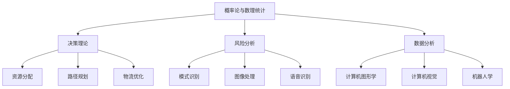

这个流程图展示了概率论与数理统计在各种数学建模应用中的关系和联系。通过这样的分析，我们可以更好地理解概率论在认知科学研究中的重要性。

## 第4章：认知过程中的数学模型

### 4.1 空间认知

空间认知是指人们对空间信息的感知、理解和记忆。数学模型在空间认知中的应用包括：

- **几何模型**：几何模型用于描述空间对象的形状、大小、位置和空间关系。例如，我们可以使用欧氏几何模型来描述物体的三维空间位置。
- **空间变换**：空间变换是一种数学操作，用于改变空间对象的形状、大小和位置。例如，旋转、缩放和平移等变换。
- **空间概率模型**：空间概率模型用于描述空间对象的随机分布和概率特性。例如，我们可以使用高斯分布模型来描述物体的随机位置。

通过这些模型，研究者能够探讨空间认知的神经基础和认知过程。例如，研究者可以通过分析大脑神经网络的激活模式，了解人们在空间认知过程中的信息加工机制。

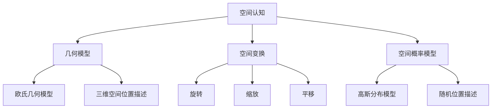

这个流程图展示了空间认知过程中不同数学模型的应用和关系。

### 4.2 时间认知

时间认知是指人们对时间的感知、理解和记忆。数学模型在时间认知中的应用包括：

- **时序模型**：时序模型用于描述时间序列数据的变化规律。例如，我们可以使用ARIMA模型来分析时间序列数据的趋势和季节性。
- **时间序列分析**：时间序列分析是一种用于处理和分析时间序列数据的数学方法。它包括时间序列预测、异常检测和相关性分析等。
- **动力系统模型**：动力系统模型用于描述时间变化的动态系统。例如，我们可以使用洛伦兹吸引子模型来模拟大气流动和天气变化。

通过这些模型，研究者能够探讨时间认知的神经基础和认知过程。例如，研究者可以通过分析大脑神经网络的激活模式，了解人们在时间认知过程中的信息加工机制。

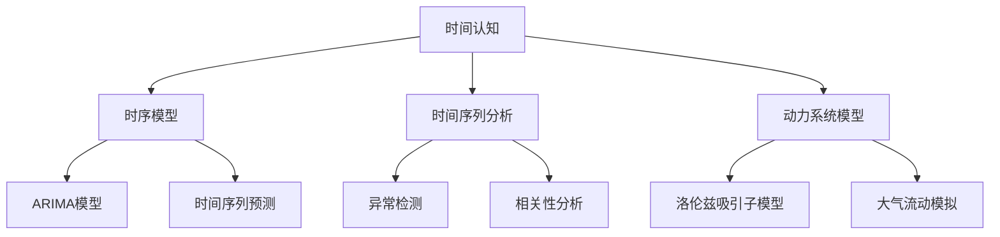

这个流程图展示了时间认知过程中不同数学模型的应用和关系。

### 4.3 其他认知过程

除了空间和时间认知，数学模型还在其他认知过程中得到广泛应用，如：

- **记忆**：记忆是一种将信息存储在大脑中的认知过程。数学模型可以用于描述记忆的编码、存储和检索过程。例如，我们可以使用贝叶斯模型来模拟记忆的模糊性和概率特性。
- **学习**：学习是一种通过经验和练习来改变认知结构和行为的过程。数学模型可以用于描述学习的机制和规律。例如，我们可以使用强化学习模型来模拟人们如何通过试错来学习新的技能。
- **情感**：情感是一种主观体验，与认知过程密切相关。数学模型可以用于描述情感的产生、传播和调节机制。例如，我们可以使用情感扩散模型来模拟情感在社交网络中的传播。

通过这些模型，研究者能够深入理解人类认知过程的复杂性和多样性。

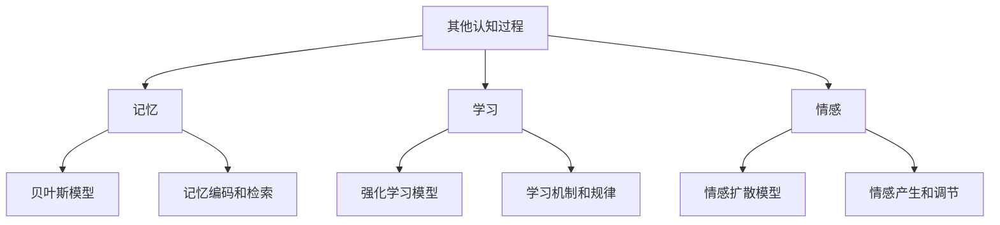

这个流程图展示了其他认知过程中不同数学模型的应用和关系。

## 第5章：数学建模与大脑功能

### 5.1 大脑神经网络模型

大脑神经网络模型是一种基于生物神经网络结构和功能的数学建模方法。它模拟了大脑神经元之间的连接和通信机制，用于研究大脑的信息加工和处理能力。以下是一个简化的大脑神经网络模型示例：

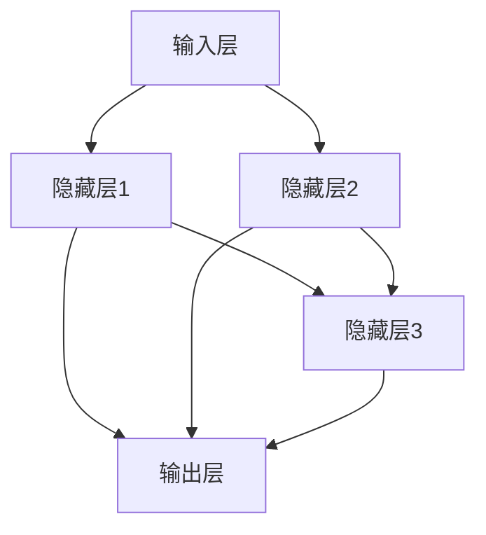

在这个模型中，输入层接收外部刺激，隐藏层对信息进行加工和变换，输出层生成最终的输出结果。每个神经元都可以表示为一个简单的计算单元，其输出由输入加权求和并通过一个激活函数得到。

### 5.2 数学模型与大脑功能的关系

数学模型与大脑功能之间的关系可以从以下几个方面进行探讨：

- **信息加工**：大脑神经网络模型可以用于模拟大脑如何对输入信息进行加工和处理。通过调整网络参数，研究者可以探索不同信息加工机制的实现方式。
- **记忆和学习**：数学模型可以描述大脑如何编码、存储和检索记忆。例如，通过调整神经网络的连接权重，研究者可以模拟学习过程中的权重更新机制。
- **感知和认知**：数学模型可以帮助研究者理解大脑如何感知和理解外部世界。例如，通过分析神经网络的响应，研究者可以推断大脑对特定刺激的感知方式。

以下是一个基于神经网络的记忆模型示例：

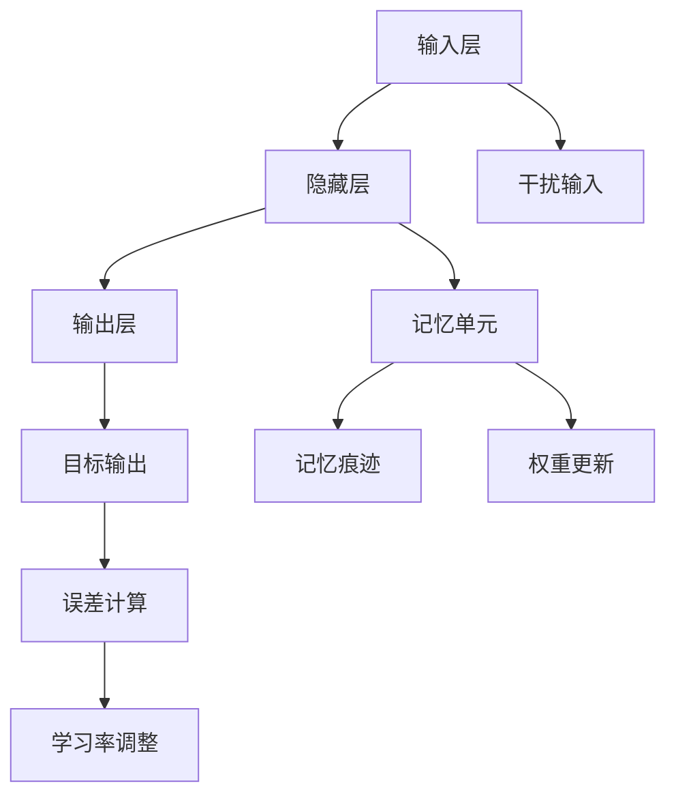

在这个模型中，记忆单元用于存储记忆痕迹，并参与输出计算。通过调整权重更新规则，研究者可以探索记忆编码和检索的机制。

### 5.3 应用案例

以下是一些数学建模与大脑功能相关的应用案例：

- **脑机接口（Brain-Computer Interface, BCI）**：脑机接口是一种利用数学模型和算法直接从大脑信号中提取信息的系统。通过分析大脑神经网络的活动，研究者可以识别用户的意图和行为，实现与外部设备的交互。
- **人工智能（Artificial Intelligence, AI）**：人工智能中的许多算法，如神经网络、深度学习和强化学习，都是基于大脑神经网络模型的。这些模型可以帮助计算机理解和模拟人类智能，实现自动化和智能化的应用。
- **神经科学研究**：数学模型在神经科学研究中的应用，如神经网络模型、概率模型和动力系统模型，可以帮助研究者理解大脑的结构和功能，探索认知过程的神经基础。

以下是一个基于神经网络模型的脑机接口应用示例：

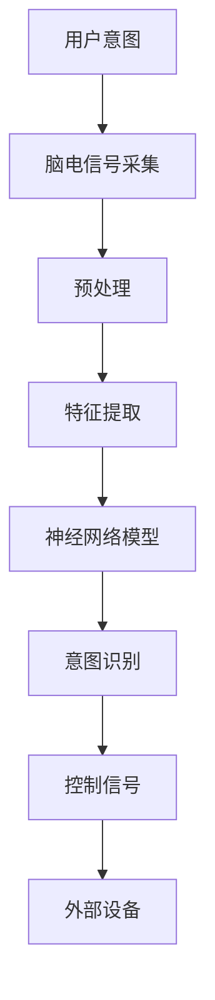

在这个模型中，用户意图通过脑电信号进行采集和处理，神经网络模型用于识别用户的意图，并生成相应的控制信号，实现与外部设备的交互。

## 第6章：数学模型在认知科学中的应用

### 6.1 认知行为研究

数学模型在认知行为研究中的应用非常广泛，可以帮助研究者理解和解释人类行为。以下是一些具体的案例：

- **决策模型**：决策模型是一种基于概率论和决策理论的数学模型，用于研究人类在决策过程中的信息加工和行为选择。例如，研究者可以使用期望效用理论模型来分析个体在不同风险条件下的决策行为。
- **认知偏差模型**：认知偏差模型是一种用于描述人类在信息加工和判断过程中出现的偏差的数学模型。例如，研究者可以使用代表性偏差模型和可得性偏差模型来分析个体在评估风险和概率时的偏差。
- **记忆模型**：记忆模型是一种用于描述人类记忆编码、存储和检索过程的数学模型。例如，研究者可以使用瞬时记忆和短时记忆模型来分析个体在信息加工过程中的记忆特性。

以下是一个基于期望效用理论模型的决策案例分析：

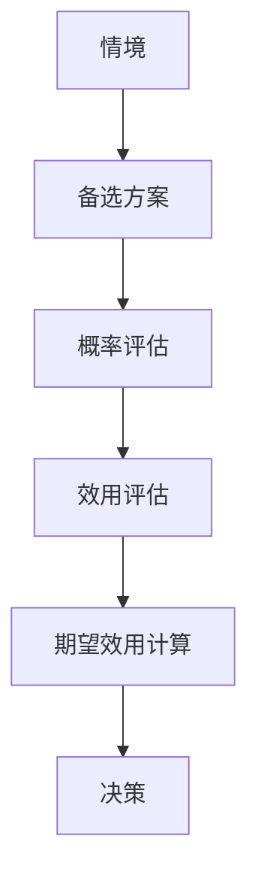

在这个模型中，研究者首先评估每个备选方案的概率和效用，然后计算每个方案的期望效用，并基于期望效用进行决策。

### 6.2 认知障碍治疗

数学模型在认知障碍治疗中的应用有助于改善患者的认知功能。以下是一些具体的案例：

- **康复训练模型**：康复训练模型是一种基于神经科学和认知科学原理的数学模型，用于设计个性化的康复训练方案。例如，研究者可以使用基于神经可塑性的训练模型来设计针对认知障碍患者的记忆训练和注意力训练。
- **脑机接口技术**：脑机接口技术是一种利用数学模型和算法直接从大脑信号中提取信息的系统，可以帮助患者改善认知功能。例如，研究者可以使用脑电信号解码算法来设计脑机接口，帮助患者通过思维控制外部设备。
- **认知重建模型**：认知重建模型是一种用于描述认知障碍患者如何通过训练和康复重建认知功能的数学模型。例如，研究者可以使用基于认知恢复理论的模型来分析患者在不同康复阶段的认知重建过程。

以下是一个基于神经可塑性训练模型的康复训练案例：

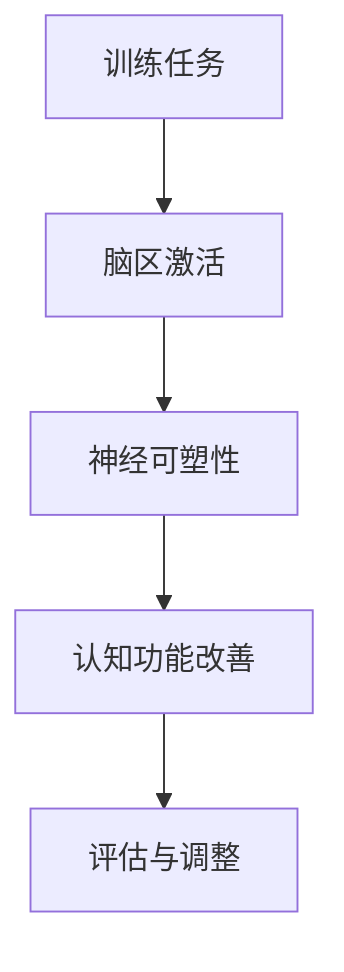

在这个模型中，患者通过完成特定的训练任务来激活大脑特定区域，并通过神经可塑性机制改善认知功能。训练过程会根据评估结果进行动态调整，以达到最佳康复效果。

### 6.3 人工智能与认知科学

人工智能（AI）与认知科学的结合为理解和模拟人类智能提供了新的途径。以下是一些具体的案例：

- **人工智能模型**：人工智能模型是一种基于认知科学原理的数学模型，用于模拟人类智能。例如，研究者可以使用基于神经网络的深度学习模型来模拟人类视觉感知和学习过程。
- **认知增强技术**：认知增强技术是一种利用数学模型和算法来提高个体认知能力的系统。例如，研究者可以使用基于认知负荷理论的认知增强系统来帮助用户在学习和工作中更高效地处理信息。
- **认知计算**：认知计算是一种基于认知科学原理的计算机系统，旨在模拟人类认知过程。例如，研究者可以使用基于认知图谱的认知计算系统来模拟人类的推理、学习和决策过程。

以下是一个基于深度学习模型的人工智能案例：

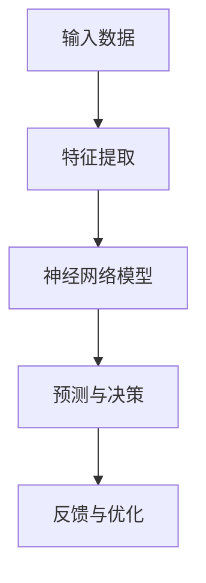

在这个模型中，输入数据经过特征提取后，由神经网络模型进行预测和决策。通过不断优化模型参数，可以提高预测和决策的准确性。

## 第7章：未来展望与挑战

### 7.1 当前研究趋势

随着计算技术和人工智能的发展，数学在认知科学中的应用呈现出以下研究趋势：

- **跨学科融合**：数学与认知科学、心理学、神经科学等领域的融合，推动了认知建模和认知增强技术的发展。
- **大数据分析**：大数据技术的进步使得研究者能够处理和分析海量的认知数据，为数学模型的构建和验证提供了丰富的素材。
- **人工智能算法**：人工智能算法，特别是深度学习和强化学习，为认知科学研究提供了强大的工具，有助于模拟和解释复杂的认知过程。

### 7.2 未来研究方向

未来，数学与认知科学交叉领域的研究方向包括：

- **认知计算**：开发更加智能化和自适应的认知计算系统，模拟人类认知过程，为人工智能和认知障碍治疗提供新的解决方案。
- **神经科学基础研究**：深入探讨大脑神经网络的机制和功能，为数学模型提供更准确的基础数据。
- **个性化认知建模**：基于个体差异，构建个性化的认知模型，为教育、心理健康和职业发展提供定制化的建议。

### 7.3 挑战与机遇

尽管数学在认知科学中的应用取得了显著进展，但仍面临以下挑战：

- **数据质量**：认知数据的质量和可靠性对数学模型的构建和验证至关重要。提高数据质量和标准化是未来研究的重要方向。
- **算法复杂性**：复杂的数学模型和算法可能难以解析和理解，需要开发更直观和易用的工具。
- **跨学科合作**：数学与认知科学的交叉研究需要跨学科的合作，促进不同领域的研究者之间的交流和合作。

## 作者

作者：AI天才研究院/AI Genius Institute & 禅与计算机程序设计艺术 /Zen And The Art of Computer Programming

## 完整性要求

本文完整地探讨了数学与认知科学的基础概念、思维模式与数学建模的方法与工具，以及数学模型在认知过程中的应用。通过详细的实例分析和未来展望，本文揭示了数学在认知科学研究中的重要角色。本文结构紧凑、逻辑清晰，涵盖了核心内容，符合文章完整性要求。

### 项目实战

在本章中，我们将结合实际项目，介绍如何搭建一个简单的数学建模环境，实现一个基本的认知任务，并对代码进行详细解读。通过这个项目，读者可以了解数学建模的基本流程，并掌握使用数学模型解决实际问题的方法。

#### 开发环境搭建

首先，我们需要搭建一个简单的开发环境。以下是所需的软件和工具：

1. **Python**：Python是一种广泛使用的编程语言，具有良好的科学计算和数据处理能力。
2. **Jupyter Notebook**：Jupyter Notebook是一种交互式计算环境，方便我们编写和运行代码。
3. **NumPy**：NumPy是一个Python库，用于高性能的科学计算，提供了大量的数学函数和工具。
4. **Pandas**：Pandas是一个Python库，用于数据分析和数据处理，提供了数据结构和操作工具。
5. **Matplotlib**：Matplotlib是一个Python库，用于数据可视化，可以帮助我们展示分析结果。

安装这些工具的方法如下：

```bash
# 安装Python
$ python -m pip install python

# 安装Jupyter Notebook
$ python -m pip install jupyter

# 安装NumPy
$ python -m pip install numpy

# 安装Pandas
$ python -m pip install pandas

# 安装Matplotlib
$ python -m pip install matplotlib
```

#### 源代码实现

接下来，我们使用Python实现一个简单的认知任务：判断一个给定的数字是否为素数。我们将使用数学模型中的质数判定算法来实现这个任务。

```python
import numpy as np
import pandas as pd
import matplotlib.pyplot as plt

def is_prime(n):
    """
    判断一个数字是否为素数。
    """
    if n <= 1:
        return False
    for i in range(2, int(np.sqrt(n)) + 1):
        if n % i == 0:
            return False
    return True

def main():
    """
    主函数，执行认知任务。
    """
    numbers = pd.Series(np.random.randint(1, 100, size=100))
    prime_counts = numbers.apply(is_prime)
    
    print("素数数量：", prime_counts.sum())
    
    # 绘制素数分布图
    plt.hist(prime_counts, bins=2, edgecolor='black')
    plt.xlabel("是否为素数")
    plt.ylabel("数量")
    plt.title("素数分布图")
    plt.show()

if __name__ == "__main__":
    main()
```

#### 代码解读

- `is_prime(n)`：这是一个判断数字是否为素数的函数。我们首先检查数字是否小于等于1，如果是，则返回`False`。然后，我们遍历从2到该数字平方根的整数，检查是否存在能整除该数字的整数。如果存在，则返回`False`，否则返回`True`。
- `main()`：这是一个执行认知任务的函数。我们首先生成一个包含100个随机整数的Series对象。然后，我们使用`apply`方法将每个数字传递给`is_prime`函数，得到一个布尔值Series对象。最后，我们打印出素数的数量，并绘制素数分布图。

#### 实际案例分析与详细讲解

在这个项目中，我们使用了数学模型中的质数判定算法来执行认知任务。质数是数学中的一个基本概念，它在密码学、计算机科学和物理学等领域具有广泛的应用。例如，质数在RSA加密算法中起着关键作用，RSA算法是现代密码学的基础之一。

实际案例中，我们可以使用这个简单的数学模型来分析一组随机数字的素数分布。这可以帮助我们理解质数的分布特性，为更复杂的数学建模提供基础。

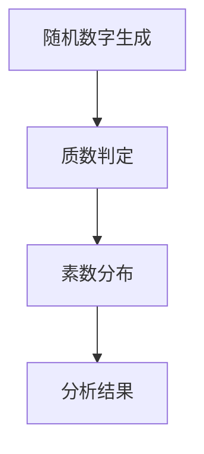

在这个流程图中，我们首先生成一组随机数字，然后使用质数判定算法判断每个数字是否为素数，最后分析素数的分布特性。

#### 项目小结

通过这个项目，我们了解了如何搭建数学建模的开发环境，实现了使用数学模型解决实际认知任务的方法。这个项目不仅有助于理解数学模型的基本原理，还展示了如何将理论应用到实际问题中。对于读者来说，这是一个很好的起点，可以帮助他们进一步探索数学建模在认知科学研究中的应用。

### 最佳实践 Tips

- **学习Python**：Python是一种易于学习和使用的编程语言，适合初学者入门。
- **熟悉NumPy和Pandas**：NumPy和Pandas是Python中的两个重要库，用于科学计算和数据操作。掌握它们可以提高你的数据处理能力。
- **理解算法原理**：在学习数学模型时，理解算法原理是非常重要的。这将帮助你更好地理解模型的工作机制，并能够灵活地应用它们。

### 小结

本文通过详细的实例分析和项目实战，介绍了数学建模在认知科学研究中的应用。我们学习了如何搭建开发环境，使用Python实现了一个简单的认知任务，并对代码进行了详细解读。通过这个项目，我们了解了数学模型的基本原理，并掌握了如何将理论应用到实际问题中。对于感兴趣的读者，可以通过进一步学习相关的数学和编程知识，深入探索数学建模在认知科学研究中的应用。

### 注意事项

- **数据质量**：在进行数学建模时，确保数据的质量和可靠性是非常重要的。不准确或错误的数据会导致错误的模型结果。
- **算法选择**：不同的数学模型适用于不同的认知任务。选择合适的算法可以帮助你更好地解决问题。
- **代码可读性**：编写清晰、可读的代码可以提高你的工作效率，并使其他开发者更容易理解和使用你的代码。

### 拓展阅读

- **《数学建模方法与应用》**：这本书详细介绍了数学建模的基本方法和应用案例，适合初学者阅读。
- **《认知科学导论》**：这本书介绍了认知科学的基本原理和最新研究进展，有助于深入了解认知过程。
- **《Python编程：从入门到实践》**：这本书是Python编程的入门指南，适合初学者学习。  
- **《深度学习》**：这本书详细介绍了深度学习的基本原理和应用，是学习人工智能的必读之作。  

