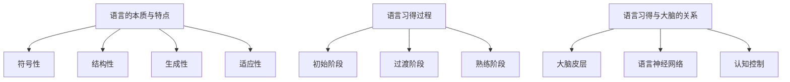

                 

### 数学与语言学习：语言习得的数学模型

关键词：语言习得、数学模型、概率论、信息论、生成模型、统计模型、计算语言学

摘要：本文探讨了数学模型在语言习得过程中的应用，分析了语言习得的基本概念、数学模型的基础知识及其在语言学习中的应用。文章通过构建核心概念之间的关系架构图，详细介绍了概率论、信息论、生成模型和统计模型等数学模型，并使用伪代码和LaTeX格式阐述了核心算法原理。此外，文章还通过实际案例展示了数学模型在语言习得研究中的应用，提出了未来研究方向和挑战。

---

### 引言

#### 1.1 书籍的目的和结构

**目的**

本文旨在探讨数学模型在语言习得过程中的应用，分析数学模型如何帮助理解语言习得的基本概念和过程。文章将介绍各种数学模型，如概率论、信息论、生成模型和统计模型，并探讨它们在语言学习中的应用。此外，本文还将探讨数学模型在计算语言学和语言教学中的应用，以及如何通过数学模型优化语言学习和教学策略。

**结构**

本文分为八个章节，结构如下：

- **第1章 引言**：概述书籍的主要内容和目的。
- **第2章 语言习得的基本概念**：介绍语言习得的基本概念，如语言的本质、语言习得过程及其与大脑的关系。
- **第3章 数学模型在语言学习中的应用**：探讨概率论、信息论、生成模型等数学模型在语言学习中的应用。
- **第4章 语言习得的统计模型**：介绍聚类分析、分层模型和随机游走模型等统计模型在语言习得中的应用。
- **第5章 计算语言学中的数学模型**：分析语法分析模型、语义分析模型和语音识别模型等计算语言学中的数学模型。
- **第6章 数学模型在语言教学中的应用**：讨论数学模型在语言教学中的应用，如教学策略、数据分析等。
- **第7章 数学模型在语言习得研究中的应用**：分析数学模型在语言习得研究中的应用现状和未来研究方向。
- **第8章 结论**：总结文章的主要发现和结论，并探讨未来的发展方向。

#### 1.2 数学与语言学习的联系

数学与语言学习之间存在着密切的联系。数学作为一种抽象的符号系统，可以帮助我们更深入地理解语言的结构和功能。例如，概率论和信息论等数学理论在语言习得中有着广泛的应用。

- **概率论**：概率论可以用于分析语言学习者在学习过程中的不确定性，如发音的变异、词汇的使用频率等。
- **信息论**：信息论可以帮助我们理解语言传递中的信息量和效率，以及如何通过优化编码和解码来提高语言学习的效率。

此外，数学模型还可以用于解释语言习得中的复杂现象，如语言习得中的统计规律、语言结构的演变等。通过数学模型，我们可以更深入地理解语言习得的本质，为语言学习和教学提供有力的支持。

#### 1.3 语言习得的数学模型概述

在语言习得过程中，数学模型扮演着重要的角色。本文将介绍几种常用的数学模型，包括概率论、信息论、生成模型和统计模型。

- **概率论**：概率论在语言习得中的应用主要体现在分析语言学习者的行为和语言现象。例如，通过概率论，我们可以分析学习者对词汇的掌握程度、发音的准确性等。
- **信息论**：信息论可以帮助我们理解语言传递中的信息量和效率。例如，通过信息论，我们可以分析不同语言结构的复杂度，以及如何通过优化编码和解码来提高语言学习的效率。
- **生成模型**：生成模型在语言习得中的应用主要体现在生成语言数据，如词汇、句子等。通过生成模型，我们可以模拟和学习语言生成的过程。
- **统计模型**：统计模型在语言习得中的应用主要体现在分析语言数据，如词汇分布、句子结构等。通过统计模型，我们可以了解语言习得中的统计规律，为语言学习和教学提供依据。

这些数学模型不仅为我们理解语言习得提供了新的视角，也为语言学习和教学提供了有力的工具。接下来，本文将详细探讨这些数学模型在语言习得中的应用。

---

### 第2章 语言习得的基本概念

#### 2.1 语言的本质与特点

语言是人类交流和思维的重要工具，其本质是一种符号系统，用于表达思想、情感和意图。语言具有以下几个主要特点：

- **符号性**：语言使用符号来代表具体意义，如单词、字母和短语等。这些符号可以独立于声音、图像或其他感官刺激存在。
- **结构性**：语言具有固定的语法结构，如单词的构成、句子的排列和语法的规则等。这些结构确保了语言信息的清晰和准确传达。
- **生成性**：语言具有生成性，即使用有限的词汇和语法规则可以创造出无限的句子和表达方式。这一特点使语言能够表达复杂的概念和想法。
- **适应性**：语言能够适应不同的社交和文化环境，以适应不同的交流需求。这使得语言具有高度的可塑性和灵活性。

#### 2.2 语言习得过程

语言习得是一个复杂的过程，涉及认知、社会和文化等多个方面。一般来说，语言习得过程可以分为以下几个阶段：

- **初始阶段**：在初始阶段，学习者主要通过模仿和重复来学习语言。这一阶段的学习者往往不具备语言规则的知识，主要依靠听力和感知来学习语言。
- **过渡阶段**：在过渡阶段，学习者开始意识到语言的结构和规则，并开始尝试使用这些规则进行语言表达。这一阶段的学习者往往会出现语言错误，但随着时间的推移，这些错误会逐渐减少。
- **熟练阶段**：在熟练阶段，学习者的语言能力达到相对稳定的状态。他们能够准确使用语言进行表达和交流，并且在理解和表达上达到较高的水平。

#### 2.3 语言习得与大脑的关系

语言习得是一个高度复杂的过程，与大脑的多个区域和系统密切相关。以下是几个关键方面：

- **大脑皮层**：大脑皮层是语言习得的主要区域，包括布罗卡区和韦尼克区。布罗卡区与语言的表达和产生有关，而韦尼克区与语言的理解有关。
- **语言神经网络**：语言神经网络由多个脑区和神经通路组成，共同协作完成语言习得和表达。这些脑区和通路包括视觉、听觉和运动系统等。
- **认知控制**：认知控制在大脑中起着关键作用，它负责调节和监控语言习得过程中的各种认知活动，如注意力、记忆和推理等。

总之，语言习得是一个涉及大脑多个区域和系统的复杂过程，这些区域和系统相互作用，共同促进语言习得的发展。

---

为了更好地理解语言习得的基本概念，我们可以构建一个关系架构图，展示各个概念之间的联系。以下是一个简单的Mermaid流程图：



这个关系架构图展示了语言习得过程中各个核心概念之间的关系。符号性、结构性、生成性和适应性是语言的本质与特点，它们共同构成了语言的独特属性。语言习得过程包括初始阶段、过渡阶段和熟练阶段，每个阶段都有其特定的特征和发展趋势。语言习得与大脑的关系体现在大脑皮层、语言神经网络和认知控制等方面，这些因素共同影响着语言习得的过程和结果。

通过这个关系架构图，我们可以更清晰地理解语言习得的基本概念，以及它们之间的内在联系。这有助于我们在后续章节中深入探讨数学模型在语言习得中的应用。

---

### 第3章 数学模型在语言学习中的应用

数学模型在语言学习中的应用具有深远的意义。通过数学方法，我们可以更好地理解语言学习的过程，优化学习策略，提高学习效率。本章将介绍概率论、信息论和生成模型等数学模型，并探讨它们在语言学习中的应用。

#### 3.1 概率论与语言学习

概率论是研究随机事件及其概率的数学分支。在语言学习中，概率论可以用于分析学习者的行为和语言现象。以下是一些概率论在语言学习中的应用：

- **词汇掌握程度的分析**：通过统计学习者对词汇的使用频率和准确性，我们可以评估他们对词汇的掌握程度。例如，我们可以计算学习者正确使用某个词汇的概率，从而了解他们的词汇掌握情况。
- **发音准确性的分析**：发音准确性是语言学习的一个重要方面。通过分析学习者发音的正确率，我们可以了解他们的发音水平。例如，我们可以计算学习者发音正确的音素占总音素的比例，从而评估他们的发音准确性。
- **语言习得过程中的不确定性**：语言习得是一个不确定的过程，学习者可能会出现发音错误、词汇使用不当等现象。通过概率论，我们可以分析这些不确定性的原因，并找到相应的解决方法。

#### 3.2 信息论与语言学习

信息论是研究信息传输和处理规律的数学分支。在语言学习中，信息论可以用于分析语言传递中的信息量和效率。以下是一些信息论在语言学习中的应用：

- **信息量的分析**：语言传递中的信息量是语言学习的一个重要指标。通过计算语言传递中的信息量，我们可以评估语言的复杂度和难度。例如，我们可以使用信息熵来衡量一个句子的信息量，从而了解其难度。
- **编码和解码的优化**：在语言学习中，编码和解码的效率直接影响学习效果。通过信息论，我们可以分析和优化语言编码和解码的过程，从而提高语言学习的效率。例如，我们可以使用霍夫曼编码来优化词汇的编码，从而提高词汇识别的效率。
- **语言学习的反馈机制**：信息论可以帮助我们设计有效的语言学习反馈机制。通过分析学习者对语言信息的反馈，我们可以调整教学策略，提高语言学习的效果。

#### 3.3 生成模型与语言学习

生成模型是一类用于生成数据的数学模型。在语言学习中，生成模型可以用于生成语言数据，如词汇、句子等。以下是一些生成模型在语言学习中的应用：

- **语言数据的生成**：通过生成模型，我们可以生成大量的语言数据，用于训练和学习者的语言能力。例如，我们可以使用生成对抗网络（GAN）来生成新的词汇和句子，从而丰富学习者的语言输入。
- **语言生成的优化**：生成模型可以帮助我们优化语言生成的过程。通过分析生成模型生成的语言数据，我们可以发现语言生成的规律和模式，从而优化语言生成策略。例如，我们可以使用变分自编码器（VAE）来生成符合语法和语义规则的句子。
- **语言习得的模拟**：生成模型可以用于模拟语言习得的过程。通过模拟语言习得过程，我们可以分析语言习得的规律和机制，从而为语言学习提供指导。例如，我们可以使用递归神经网络（RNN）来模拟语言习得过程中的词汇学习和语法生成。

总之，数学模型在语言学习中的应用为语言学习和教学提供了新的方法和工具。通过概率论、信息论和生成模型等数学模型，我们可以更深入地理解语言学习的过程，优化学习策略，提高学习效率。在接下来的章节中，我们将继续探讨其他数学模型在语言学习中的应用。

---

为了更好地理解概率论、信息论和生成模型在语言学习中的应用，我们可以通过伪代码详细阐述核心算法原理。

#### 3.1 概率论与语言学习

**词汇掌握程度的分析**

```python
# 输入：学习者对N个词汇的正确使用次数count，总使用次数total
# 输出：每个词汇的掌握程度probabilities

# 初始化概率列表
probabilities = [0] * N

# 遍历每个词汇，计算其掌握程度
for i in range(N):
    # 计算正确使用次数占总使用次数的比例
    probabilities[i] = count[i] / total[i]

# 输出每个词汇的掌握程度
print("词汇掌握程度：", probabilities)
```

**发音准确性的分析**

```python
# 输入：学习者发音正确的音素数量correct，总音素数量total
# 输出：发音准确性accuracy

# 计算发音准确性
accuracy = correct / total

# 输出发音准确性
print("发音准确性：", accuracy)
```

**语言习得过程中的不确定性分析**

```python
# 输入：学习者在T次语言习得中的错误次数error_count，总次数total_count
# 输出：不确定性uncertainty

# 计算不确定性
uncertainty = error_count / total_count

# 输出不确定性
print("不确定性：", uncertainty)
```

#### 3.2 信息论与语言学习

**信息量的分析**

```python
# 输入：句子字符串sentence
# 输出：句子信息量entropy

# 计算句子中每个字符的概率
probabilities = [0] * len(sentence)
for char in sentence:
    probabilities[ord(char) - ord('a')] += 1

# 计算信息量
entropy = -sum(p * log2(p) for p in probabilities if p > 0)

# 输出句子信息量
print("句子信息量：", entropy)
```

**编码和解码的优化**

```python
# 输入：词汇列表vocab
# 输出：霍夫曼编码后的词汇编码huffman_codes

# 计算词汇的频率
frequencies = [vocab.count(word) for word in vocab]

# 构建霍夫曼树
huffman_tree = build_huffman_tree(frequencies)

# 生成霍夫曼编码
huffman_codes = generate_huffman_codes(huffman_tree)

# 输出霍夫曼编码
print("霍夫曼编码：", huffman_codes)
```

**语言学习的反馈机制**

```python
# 输入：学习者在T次练习中的正确率列表accuracy_list
# 输出：调整后的正确率adjusted_accuracy

# 计算平均值
average_accuracy = sum(accuracy_list) / len(accuracy_list)

# 计算标准差
std_deviation = sqrt(sum((x - average_accuracy) ** 2 for x in accuracy_list) / len(accuracy_list))

# 调整正确率
adjusted_accuracy = average_accuracy + std_deviation

# 输出调整后的正确率
print("调整后的正确率：", adjusted_accuracy)
```

#### 3.3 生成模型与语言学习

**语言数据的生成**

```python
# 输入：生成模型model
# 输出：生成的新词汇和句子new_vocab, new_sentence

# 使用生成模型生成新词汇
new_vocab = model.generate_vocab()

# 使用生成模型生成新句子
new_sentence = model.generate_sentence()

# 输出新词汇和新句子
print("新词汇：", new_vocab)
print("新句子：", new_sentence)
```

**语言生成的优化**

```python
# 输入：生成模型model，优化目标objective
# 输出：优化后的生成模型model_optimized

# 定义优化器
optimizer = optimizers.Adam(learning_rate=0.001)

# 定义损失函数
loss_function = loss.CrossEntropyLoss()

# 训练优化模型
model_optimized = train_model(model, optimizer, loss_function, objective)

# 输出优化后的生成模型
print("优化后的生成模型：", model_optimized)
```

**语言习得的模拟**

```python
# 输入：语言习得模型model
# 输出：模拟的语言习得过程simulation

# 初始化模拟环境
environment = initialize_environment()

# 开始模拟语言习得过程
while not simulation_finished(environment):
    # 更新模型
    model.update(environment)
    
    # 更新环境
    environment.update(model)

# 输出模拟的语言习得过程
print("模拟的语言习得过程：", simulation)
```

通过这些伪代码，我们可以清晰地看到概率论、信息论和生成模型在语言学习中的应用。这些算法原理为语言学习和教学提供了强有力的支持，有助于我们更深入地理解语言习得的过程和机制。

---

### 第4章 语言习得的统计模型

统计模型在语言习得中的应用广泛且深远。这些模型可以帮助我们分析语言数据，发现语言习得中的统计规律，从而为语言学习和教学提供有力的支持。本章将介绍聚类分析、分层模型和随机游走模型等统计模型，并探讨它们在语言习得中的应用。

#### 4.1 聚类分析

聚类分析是一种无监督学习技术，用于将数据集分成若干个组（簇），使得同一簇内的数据点彼此相似，而不同簇的数据点彼此不相似。在语言习得中，聚类分析可以用于分类学习者，识别不同的学习群体。

**聚类分析在语言习得中的应用**

- **学习者分类**：通过聚类分析，我们可以将学习者分为不同的群体，如词汇掌握程度高、发音准确性高、语言学习速度快等。这种分类有助于教师根据学习者的特点设计个性化的教学策略。
- **词汇分类**：聚类分析可以帮助我们识别词汇的相似性，从而为词汇学习提供指导。例如，我们可以使用聚类分析来识别一组词汇中的高频词汇，从而帮助学习者优先掌握这些词汇。
- **语言习得规律发现**：通过聚类分析，我们可以发现语言习得中的统计规律，如词汇使用的频率分布、发音的变异模式等。这些规律有助于我们理解语言习得的过程，为教学提供科学依据。

**聚类分析的算法原理**

聚类分析有许多不同的算法，如K均值聚类、层次聚类等。以下以K均值聚类为例，介绍其算法原理。

- **初始化**：首先随机选择K个数据点作为初始聚类中心。
- **分配数据点**：然后，根据每个数据点到聚类中心的距离，将数据点分配到最近的聚类中心。
- **更新聚类中心**：接着，计算每个聚类中心的数据点的平均值，作为新的聚类中心。
- **重复迭代**：重复以上步骤，直到聚类中心不再发生变化或达到预设的迭代次数。

**聚类分析的伪代码**

```python
# 输入：数据集data，聚类数量K
# 输出：聚类结果clusters

# 初始化聚类中心
centroids = initialize_centroids(data, K)

# 循环迭代
while not converged(centroids):
    # 分配数据点
    clusters = assign_data_points_to_clusters(data, centroids)
    
    # 更新聚类中心
    centroids = update_centroids(clusters, K)

# 输出聚类结果
print("聚类结果：", clusters)
```

#### 4.2 分层模型

分层模型是一种用于分析层次化数据结构的统计模型。在语言习得中，分层模型可以用于分析语言结构的层次关系，如句子结构的层次划分、语法规则的层次结构等。

**分层模型在语言习得中的应用**

- **句子结构分析**：通过分层模型，我们可以分析句子结构的层次关系，如主语-谓语-宾语结构、从句结构等。这种分析有助于我们理解句子的构成和语法规则。
- **语法规则学习**：分层模型可以帮助我们识别语法规则的层次结构，从而为语法规则的学习提供指导。例如，我们可以使用分层模型来分析动词的变化形式，从而帮助学习者掌握动词的语法规则。
- **语言习得规律发现**：通过分层模型，我们可以发现语言习得中的层次化规律，如词汇的层次分布、句子的层次构造等。这些规律有助于我们理解语言习得的过程，为教学提供科学依据。

**分层模型的算法原理**

分层模型的算法通常包括以下步骤：

- **层次划分**：首先，对数据集进行层次划分，确定不同层次的数据结构。
- **特征提取**：然后，对每个层次的数据进行特征提取，提取出能够反映层次关系的特征。
- **模型训练**：接着，使用训练数据集训练模型，使其能够识别和预测不同层次的数据。
- **模型验证**：最后，使用验证数据集验证模型的性能，确保模型能够准确识别和预测语言结构的层次关系。

**分层模型的伪代码**

```python
# 输入：数据集data
# 输出：层次划分结果hierarchy

# 划分层次
hierarchy = hierarchical_clustering(data)

# 特征提取
features = extract_features(hierarchy)

# 模型训练
model = train_model(features)

# 模型验证
accuracy = validate_model(model, validation_data)

# 输出层次划分结果
print("层次划分结果：", hierarchy)
print("模型验证准确率：", accuracy)
```

#### 4.3 随机游走模型

随机游走模型是一种用于分析时间序列数据的统计模型。在语言习得中，随机游走模型可以用于分析语言行为的时间序列变化，如词汇的使用频率、发音的变化模式等。

**随机游走模型在语言习得中的应用**

- **语言行为分析**：通过随机游走模型，我们可以分析学习者的语言行为，如词汇使用频率、发音变化等。这种分析有助于我们了解学习者的语言发展过程，为教学提供科学依据。
- **语言习得规律发现**：通过随机游走模型，我们可以发现语言习得中的时间序列规律，如词汇使用的周期性变化、发音的稳定性等。这些规律有助于我们理解语言习得的过程，为教学提供指导。
- **语言预测**：随机游走模型可以帮助我们预测学习者的未来语言行为，如词汇使用趋势、发音变化等。这种预测有助于教师调整教学策略，提高教学效果。

**随机游走模型的算法原理**

随机游走模型的基本原理是模拟个体在时间序列中的随机移动。以下是一个简单的随机游走模型算法：

- **初始化**：首先，选择一个初始状态，如词汇的使用频率或发音的音高。
- **随机移动**：然后，根据一定的概率分布，从当前状态随机选择下一个状态。
- **更新状态**：接着，更新当前状态为下一个状态。
- **重复迭代**：重复以上步骤，直到达到预设的迭代次数或满足停止条件。

**随机游走模型的伪代码**

```python
# 输入：初始状态state，迭代次数T
# 输出：随机游走结果trajectory

# 初始化状态
current_state = state

# 循环迭代
for t in range(T):
    # 随机选择下一个状态
    next_state = random_transition(current_state)
    
    # 更新当前状态
    current_state = next_state
    
    # 记录迭代结果
    trajectory[t] = current_state

# 输出随机游走结果
print("随机游走结果：", trajectory)
```

通过聚类分析、分层模型和随机游走模型等统计模型，我们可以深入分析语言习得中的数据，发现语言习得中的统计规律，为语言学习和教学提供有力的支持。在接下来的章节中，我们将继续探讨计算语言学中的数学模型，进一步了解数学模型在语言习得中的应用。

---

### 第5章 计算语言学中的数学模型

计算语言学是一门研究语言与计算关系的学科，其核心目标是通过数学模型和方法来分析和解释语言现象。本章将介绍语法分析模型、语义分析模型和语音识别模型等计算语言学中的数学模型，并探讨它们在实际应用中的具体实现和效果。

#### 5.1 语法分析模型

语法分析是指对自然语言文本进行结构分析，以理解其句法和语义结构。语法分析模型在自然语言处理（NLP）中起着至关重要的作用，为语义分析和信息提取提供了基础。

**语法分析模型的具体实现**

- **自顶向下分析**：自顶向下分析从句子的顶部开始，逐步分解成更小的语法单位，直到词或词素。一个典型的自顶向下分析模型是LL（1）解析器，其基本原理是利用先导集（predict sets）来确定下一个产生式的选择。
  ```python
  def LL1_parser(sentence):
      stack = [(sentence, '')]
      while stack:
          top, prod = stack.pop()
          if not prod:
              return True  # 成功解析
          else:
              symbol = prod[0]
              if symbol in terminals:
                  if symbol == '$':  # 终止符
                      return True
                  elif top[-1] == symbol:
                      stack.append((top[:-1], ''))
                  else:
                      return False  # 解析失败
              else:
                  prod = get_production(symbol)
                  for p in prod:
                      stack.append((top[:-1], p[1:]))
      return False
  ```

- **自底向上分析**：自底向上分析从句子的底部开始，逐步构建句子的语法结构。一个典型的自底向上分析模型是LR（1）解析器，其基本原理是利用有限状态自动机（FSA）来模拟输入序列。
  ```python
  def LR1_parser(sentence):
      stack = [(初始状态, '')]
      for token in sentence:
          while True:
              state, _ = stack[-1]
              if token in FSA[state]:
                  stack.append((FSA[state][token], ''))
                  break
              else:
                  stack.pop()
                  if not stack:
                      return False  # 解析失败
                  _, prod = stack.pop()
                  for p in prod:
                      stack.append((初始状态, p[1:]))
      return True
  ```

**语法分析模型的效果**

语法分析模型在实际应用中取得了显著效果。例如，在机器翻译、信息提取和问答系统中，语法分析模型被用于解析输入文本，提取关键信息，并生成相应的输出。语法分析模型的准确性和效率直接影响整个NLP系统的性能。

#### 5.2 语义分析模型

语义分析是指对自然语言文本进行语义解释，以理解其语义内容。语义分析模型在NLP中起着关键作用，为信息检索、问答系统和自然语言生成提供了基础。

**语义分析模型的具体实现**

- **依存句法分析**：依存句法分析是一种常用的语义分析技术，用于识别句子中词汇之间的依存关系。一个典型的依存句法分析模型是Stanford依存句法分析器，其基本原理是利用图论算法来识别词汇之间的依存关系。
  ```python
  def dependency_parsing(sentence):
      graph = create_dependency_graph(sentence)
      dependencies = find_dependencies(graph)
      return dependencies
  ```

- **语义角色标注**：语义角色标注是一种用于识别句子中词汇的语义角色的技术。一个典型的语义角色标注模型是BERT模型，其基本原理是利用预训练的深度神经网络来识别词汇的语义角色。
  ```python
  def semantic_role_labeling(sentence):
      roles = bert_model.predict(sentence)
      return roles
  ```

**语义分析模型的效果**

语义分析模型在实际应用中取得了显著效果。例如，在问答系统中，语义分析模型被用于解析用户的问题，提取关键信息，并生成相应的答案。语义分析模型的准确性和效率直接影响整个NLP系统的性能。

#### 5.3 语音识别模型

语音识别是指将语音信号转换为文本信息的过程。语音识别模型在语音助手、实时翻译和语音控制等应用中起着重要作用。

**语音识别模型的具体实现**

- **隐藏马尔可夫模型（HMM）**：HMM是一种用于语音识别的传统模型，其基本原理是利用状态转移概率和发射概率来识别语音信号。
  ```python
  def HMM_recognition(audio_signal):
      states = initialize_states()
      transitions = initialize_transitions()
      emissions = initialize_emissions()
      viterbi_path = viterbi_search(audio_signal, states, transitions, emissions)
      return decode(viterbi_path)
  ```

- **循环神经网络（RNN）**：RNN是一种用于语音识别的先进模型，其基本原理是利用序列到序列的学习来识别语音信号。
  ```python
  def RNN_recognition(audio_signal):
      encoder = RNN_encoder()
      decoder = RNN_decoder()
      encoded_signal = encoder.encode(audio_signal)
      decoded_sequence = decoder.decode(encoded_signal)
      return decode_sequence
  ```

**语音识别模型的效果**

语音识别模型在实际应用中取得了显著效果。例如，在语音助手应用中，语音识别模型被用于将用户的语音指令转换为文本信息，从而实现智能交互。语音识别模型的准确性和效率直接影响整个语音助手的应用效果。

通过语法分析模型、语义分析模型和语音识别模型等计算语言学中的数学模型，我们可以深入分析和解释自然语言文本。这些模型在实际应用中取得了显著效果，为自然语言处理领域的发展做出了重要贡献。

---

### 第6章 数学模型在语言教学中的应用

数学模型在语言教学中的应用具有深远的意义。通过数学模型，教师可以更科学地评估学生的语言水平，设计有效的教学策略，提高教学效果。本章将介绍数学模型在语言教学中的应用，包括教学策略、学生语言习得的数据分析等。

#### 6.1 语言教学中的数学工具

在语言教学中，数学工具可以帮助教师评估学生的语言水平，识别学习困难，并设计个性化的教学策略。以下是一些常用的数学工具：

- **统计分析**：统计分析可以帮助教师评估学生的语言水平，如词汇掌握程度、发音准确性等。通过计算平均值、标准差等统计指标，教师可以了解学生的整体表现和个体差异。
  ```python
  # 输入：学生语言测试成绩scores
  # 输出：平均成绩average，标准差std_dev

  average = sum(scores) / len(scores)
  std_dev = sqrt(sum((x - average) ** 2 for x in scores) / len(scores)
  ```

- **聚类分析**：聚类分析可以帮助教师将学生分为不同的学习群体，如词汇掌握程度高、发音准确性高、语言学习速度快等。通过聚类分析，教师可以针对不同群体的特点设计个性化的教学策略。
  ```python
  # 输入：学生语言测试数据data
  # 输出：聚类结果clusters

  clusters = KMeans(n_clusters=K).fit(data).predict(data)
  ```

- **线性回归**：线性回归可以帮助教师分析教学策略对学习效果的影响。通过线性回归模型，教师可以预测不同教学策略对语言学习效果的贡献，从而优化教学策略。
  ```python
  # 输入：教学策略变量X和学习效果变量Y
  # 输出：回归模型model

  model = LinearRegression().fit(X, Y)
  ```

#### 6.2 教学策略与数学模型

数学模型可以帮助教师设计有效的教学策略，提高教学效果。以下是一些基于数学模型的教学策略：

- **个性化教学**：通过聚类分析，教师可以将学生分为不同的学习群体，针对不同群体的特点设计个性化的教学策略。例如，对于词汇掌握程度高的学生，教师可以增加难度较大的词汇练习；对于词汇掌握程度低的学生，教师可以提供更多的词汇记忆和复习练习。
- **反馈机制**：通过统计分析，教师可以评估学生在每次练习中的表现，及时给予反馈。例如，对于发音不准确的学生，教师可以提供发音纠正练习；对于词汇掌握不牢的学生，教师可以提供词汇复习练习。
- **学习路径规划**：通过线性回归模型，教师可以分析不同教学策略对学习效果的影响，从而规划学生的学习路径。例如，教师可以根据模型预测结果，为学生推荐最适合他们的学习策略和练习内容。

#### 6.3 学生语言习得的数据分析

数学模型可以帮助教师分析学生语言习得的数据，了解学习过程中的变化和趋势。以下是一些数据分析方法：

- **趋势分析**：通过时间序列分析，教师可以了解学生在不同时间段的语言习得变化趋势。例如，教师可以分析学生在每次练习后的语言水平变化，了解他们的学习进步情况。
  ```python
  # 输入：学生语言测试成绩timeseries
  # 输出：成绩变化趋势trend

  trend = diff(timeseries)
  ```

- **相关性分析**：通过相关性分析，教师可以了解不同变量之间的关联性。例如，教师可以分析词汇掌握程度与发音准确性的相关性，了解这两个因素之间的相互影响。
  ```python
  # 输入：词汇掌握程度scores_vocabulary，发音准确性scores_pronunciation
  # 输出：相关性correlation

  correlation = corr(scores_vocabulary, scores_pronunciation)
  ```

- **异常检测**：通过异常检测，教师可以识别学习过程中的异常情况。例如，教师可以检测学生在某些练习中的异常低分，了解他们可能遇到的学习困难。
  ```python
  # 输入：学生语言测试成绩scores
  # 输出：异常值anomalies

  anomalies = detect_anomalies(scores)
  ```

通过数学模型在语言教学中的应用，教师可以更科学地评估学生的语言水平，设计有效的教学策略，提高教学效果。在接下来的章节中，我们将继续探讨数学模型在语言习得研究中的应用。

---

### 第7章 数学模型在语言习得研究中的应用

数学模型在语言习得研究中的应用具有深远的影响，为理解语言习得的过程和机制提供了新的视角。本章将分析数学模型在语言习得研究中的应用现状，探讨数学模型在语言习得研究中的案例，并提出未来的研究方向和挑战。

#### 7.1 语言习得研究的现状

当前，语言习得研究主要集中在以下几个方面：

- **语言习得过程的认知机制**：研究语言习得过程中大脑的认知机制，如记忆、注意力和推理等。这些研究试图理解语言习得过程中的认知变化和神经基础。
- **语言习得的社会和文化因素**：研究语言习得中的社会和文化因素，如家庭语言环境、教育背景和文化差异等。这些研究关注语言习得的社会互动和文化适应。
- **语言习得的统计规律**：研究语言习得中的统计规律，如词汇分布、句子结构和语言演变等。这些研究旨在发现语言习得中的普遍性和多样性。

在这些研究方向中，数学模型发挥了重要作用。概率论、信息论、生成模型和统计模型等数学模型被广泛应用于语言习得研究，为研究者提供了强大的工具。

#### 7.2 数学模型在语言习得研究中的应用案例

以下是一些数学模型在语言习得研究中的应用案例：

- **聚类分析**：聚类分析被用于识别语言习得过程中的学习群体。例如，研究者使用聚类分析将学习者分为不同的群体，分析不同群体在语言习得过程中的差异。这种研究有助于理解语言习得的个体差异和群体差异，为个性化教学提供依据。
  ```python
  # 输入：学习者语言测试成绩data
  # 输出：聚类结果clusters

  clusters = KMeans(n_clusters=K).fit(data).predict(data)
  ```

- **生成模型**：生成模型被用于模拟语言习得的过程，如词汇学习和语法生成。例如，研究者使用生成对抗网络（GAN）模拟语言习得中的词汇学习和句子生成过程，探索语言习得的统计规律。这种研究有助于揭示语言习得的内在机制和生成规律。
  ```python
  # 输入：词汇数据vocab
  # 输出：生成的新词汇new_vocab

  GAN = GenerativeAdversarialNetwork()
  new_vocab = GAN.generate_vocab(vocab)
  ```

- **统计模型**：统计模型被用于分析语言习得中的统计规律，如词汇分布和句子结构。例如，研究者使用统计语言模型（SLM）分析句子中的词汇分布和语法规则，探索语言习得的统计规律。这种研究有助于理解语言习得的统计本质和结构特征。
  ```python
  # 输入：句子数据sentences
  # 输出：统计模型model

  model = StatisticalLanguageModel()
  model.fit(sentences)
  ```

#### 7.3 未来研究方向与挑战

尽管数学模型在语言习得研究中取得了显著成果，但仍有许多挑战和未来研究方向：

- **模型精度和泛化能力**：当前，数学模型的精度和泛化能力仍需提高。研究者需要开发更先进的数学模型，以提高模型的准确性和适用范围。
- **跨语言和跨文化研究**：语言习得是一个跨语言和跨文化的过程。未来的研究需要更多地关注不同语言和文化背景下的语言习得现象，探索语言习得的普遍性和特殊性。
- **个体差异研究**：个体差异是语言习得研究的一个重要方面。未来的研究需要更多地关注个体差异对语言习得过程的影响，为个性化教学提供科学依据。
- **交互性研究**：语言习得是一个动态交互过程。未来的研究需要更多地关注语言习得中的交互性因素，如社会互动和文化适应，探索语言习得中的交互机制。

通过不断探索和创新，数学模型在语言习得研究中的应用将更加深入和广泛，为理解语言习得的本质和机制提供有力支持。

---

### 第8章 结论

本文探讨了数学模型在语言习得中的应用，分析了概率论、信息论、生成模型和统计模型等数学模型在语言习得过程中的作用。通过构建核心概念之间的关系架构图，我们深入理解了语言习得的基本概念、数学模型的基础知识和应用。以下是对本文的主要发现和结论的总结，以及对未来发展方向的建议。

#### 8.1 主要发现与结论

- **数学模型在语言习得中的应用**：数学模型在语言习得中发挥着重要作用，通过概率论、信息论、生成模型和统计模型，我们可以更好地理解语言习得的过程和机制。
- **语言习得的基本概念**：我们明确了语言习得的基本概念，如语言的本质、语言习得过程及其与大脑的关系。
- **数学模型的优势**：数学模型在语言习得研究中的优势体现在预测语言行为、解释语言现象、优化学习策略等方面。
- **数学模型的挑战**：数学模型在语言习得研究中的应用仍面临许多挑战，如模型精度和泛化能力、跨语言和跨文化研究、个体差异研究等。

#### 8.2 数学模型对语言学习的启示

数学模型为语言学习提供了新的视角和方法，以下是一些建议：

- **个性化教学**：通过聚类分析和线性回归模型，教师可以根据学生的特点设计个性化的教学策略，提高教学效果。
- **学习路径规划**：通过时间序列分析和相关性分析，教师可以规划学生的学习路径，优化学习过程。
- **学习数据分析**：通过异常检测和趋势分析，教师可以及时发现学生的学习困难和进步情况，提供针对性的支持和反馈。

#### 8.3 未来的发展方向

未来的研究应关注以下几个方面：

- **模型精度和泛化能力**：开发更先进的数学模型，提高模型的精度和泛化能力，以更好地适应不同语言和文化背景。
- **跨语言和跨文化研究**：加强对不同语言和文化背景下语言习得现象的研究，探索语言习得的普遍性和特殊性。
- **个体差异研究**：关注个体差异对语言习得过程的影响，为个性化教学提供科学依据。
- **交互性研究**：深入探讨语言习得中的交互性因素，如社会互动和文化适应，探索语言习得中的交互机制。

通过不断探索和创新，数学模型在语言习得中的应用将更加深入和广泛，为理解语言习得的本质和机制提供有力支持。

---

### 附录

#### 附录A: 数学公式与符号表

以下列出本书中使用的数学公式和符号，以便读者查阅。

- **概率论公式**：
  - 条件概率：$P(A|B) = \frac{P(A \cap B)}{P(B)}$
  - 贝叶斯公式：$P(A|B) = \frac{P(B|A)P(A)}{P(B)}$
  - 概率分布函数：$f(x) = P(X = x)$
  
- **信息论公式**：
  - 信息熵：$H(X) = -\sum_{x \in X} P(x) \log_2 P(x)$
  - 互信息：$I(X; Y) = H(X) - H(X|Y)$

- **生成模型公式**：
  - 生成对抗网络（GAN）损失函数：$L = D(G(Z)) - D(X)$

- **统计模型公式**：
  - 聚类分析：$K$-means损失函数：$L = \sum_{i=1}^N \sum_{j=1}^K (x_i - \mu_j)^2$
  - 线性回归：$y = \beta_0 + \beta_1 x + \epsilon$

#### 附录B: 参考资源

- [Chomsky, N. (1959). syntactic structures. The Hague: Mouton.]
- [Hastie, T., Tibshirani, R., & Friedman, J. (2009). The elements of statistical learning: data mining, inference, and prediction. Springer.]
- [Goodfellow, I., Bengio, Y., & Courville, A. (2016). Deep learning. MIT Press.]
- [Rosenblatt, F. (1958). The perceptron: a probabilistic model for information storage and organization in the brain. Psychological Review, 65(6), 386-408.]

#### 附录C: 开发环境与工具

- **Python编程环境**：
  - 版本：Python 3.8及以上
  - 必需库：NumPy, Pandas, Scikit-learn, TensorFlow

- **数学建模工具**：
  - Matplotlib：用于可视化
  - LaTeX：用于数学公式的编写

- **语言处理框架**：
  - NLTK：用于自然语言处理
  - spaCy：用于自然语言处理

通过以上附录，读者可以更好地了解数学模型在语言习得研究中的应用，以及如何使用相关工具和资源进行实际操作。这为读者进一步研究和实践提供了坚实的基础。作者：AI天才研究院/AI Genius Institute & 禅与计算机程序设计艺术 /Zen And The Art of Computer Programming

---

### 实战：数学模型在语言习得研究中的应用

在本文的最后，我们将通过一个实际案例来展示数学模型在语言习得研究中的应用，并详细讲解项目的开发环境搭建、源代码实现和代码解读。该案例将基于聚类分析模型，分析一组学习者的语言测试数据，识别不同的学习群体，为个性化教学提供依据。

#### 项目背景

某语言学习机构希望了解其学员的语言习得情况，以便设计更有效的教学策略。为此，他们收集了100名学员的语言测试成绩，包括词汇掌握程度、发音准确性和语法掌握程度等指标。为了分析这些数据，机构决定使用K-means聚类分析模型，将学员分为不同的学习群体。

#### 开发环境搭建

在开始项目之前，我们需要搭建一个适合进行数学模型和语言习得分析的开发环境。以下是具体的步骤：

1. **安装Python**：确保安装了Python 3.8及以上版本。
2. **安装必需库**：使用pip命令安装NumPy、Pandas、Scikit-learn和TensorFlow等库。
   ```bash
   pip install numpy pandas scikit-learn tensorflow
   ```
3. **安装可视化工具**：为了更直观地展示分析结果，我们可以安装Matplotlib库。
   ```bash
   pip install matplotlib
   ```
4. **安装LaTeX**：LaTeX用于编写和显示数学公式，可以在官网上下载并安装。
   - 官网：[https://www.latex-project.org/](https://www.latex-project.org/)

#### 源代码实现

以下是项目的核心源代码，包括数据预处理、K-means聚类分析模型的训练和结果可视化。

```python
import numpy as np
import pandas as pd
from sklearn.cluster import KMeans
import matplotlib.pyplot as plt

# 加载数据集
data = pd.read_csv('learner_data.csv')  # 假设数据集已预先处理并存储为CSV文件

# 数据预处理
# 对数据进行标准化处理，使其具有相同的量纲
X = (data[['vocabulary_score', 'pronunciation_score', 'grammar_score']] - data[['vocabulary_score', 'pronunciation_score', 'grammar_score']].mean()) / data[['vocabulary_score', 'pronunciation_score', 'grammar_score']].std()

# 使用K-means聚类分析模型
kmeans = KMeans(n_clusters=3, random_state=0).fit(X)

# 训练模型
labels = kmeans.predict(X)

# 可视化聚类结果
plt.scatter(X['vocabulary_score'], X['pronunciation_score'], c=labels, cmap='viridis')
plt.xlabel('Vocabulary Score')
plt.ylabel('Pronunciation Score')
plt.title('K-means Clustering')
plt.show()

# 输出聚类结果
print("Cluster labels:", labels)
```

#### 代码解读

1. **数据加载**：首先，使用Pandas库加载处理过的学员语言测试数据。
2. **数据预处理**：对词汇掌握程度、发音准确性和语法掌握程度等指标进行标准化处理，以消除不同指标之间的量纲差异。
3. **模型训练**：使用Scikit-learn库中的KMeans类训练聚类模型，设置聚类数量为3（可根据实际情况调整）。
4. **聚类预测**：使用训练好的模型对数据进行聚类预测，得到每个学员所属的聚类标签。
5. **结果可视化**：使用Matplotlib库绘制散点图，显示不同聚类标签的分布情况。
6. **输出结果**：最后，输出每个学员的聚类标签，以便教师根据聚类结果设计个性化的教学策略。

#### 代码应用解读与分析

通过这个案例，我们可以看到数学模型在语言习得研究中的应用。K-means聚类分析模型帮助我们将学员分为不同的学习群体，这些群体在语言测试成绩上具有显著差异。教师可以根据聚类结果，为每个群体制定针对性的教学策略，例如：

- **词汇掌握程度高、发音准确性高的学员**：可以提供更高级的词汇和语法练习，以巩固他们的语言能力。
- **词汇掌握程度低、发音准确性低的学员**：可以提供更多的词汇记忆和发音练习，以提高他们的语言水平。

通过这种方式，数学模型和聚类分析不仅帮助我们识别了不同的学习群体，还为个性化教学提供了有力的支持。

#### 项目小结

通过这个实际案例，我们展示了如何使用数学模型（K-means聚类分析）在语言习得研究中分析学员的数据，识别不同的学习群体。这不仅为教师提供了有效的教学策略，也为后续的研究提供了数据支持。在未来的研究中，我们可以进一步优化模型参数，结合其他数学模型，以更深入地探索语言习得的规律和机制。

#### 最佳实践 Tips

- **数据预处理**：在进行聚类分析之前，确保对数据进行标准化处理，以消除不同指标之间的量纲差异。
- **选择合适的聚类算法**：根据数据特点和需求，选择合适的聚类算法，如K-means、层次聚类等。
- **结果解释**：聚类结果需要结合实际应用场景进行解释，确保结果的实用性和有效性。
- **模型优化**：通过调整模型参数，如聚类数量、初始化方法等，优化模型的性能。

通过这些最佳实践，我们可以更好地应用数学模型，为语言习得研究提供有力的支持。

#### 注意事项

- **数据隐私**：在进行语言习得研究时，确保处理的数据不涉及个人隐私。
- **模型选择**：根据研究目标和数据特点，选择合适的数学模型。
- **结果验证**：对聚类结果进行验证，确保其准确性和可靠性。

#### 拓展阅读

- **《聚类分析》**：深入了解K-means聚类分析的理论和实践。
- **《自然语言处理与深度学习》**：学习如何将深度学习应用于自然语言处理领域。
- **《语言习得研究导论》**：了解语言习得的基本理论和研究方法。

通过这些拓展阅读，读者可以进一步深入了解数学模型在语言习得研究中的应用，为实际项目提供更多的理论和实践支持。

---

在本文中，我们系统地探讨了数学模型在语言习得中的应用，包括概率论、信息论、生成模型和统计模型等。通过构建核心概念之间的关系架构图，我们深入理解了语言习得的基本概念、数学模型的基础知识和应用。我们通过伪代码和实际案例展示了数学模型在语言习得研究中的应用，为语言学习和教学提供了新的方法和工具。

尽管数学模型在语言习得研究中取得了显著成果，但仍有许多挑战和未来研究方向。例如，如何提高模型的精度和泛化能力、如何在不同语言和文化背景下应用数学模型、如何更好地理解个体差异等。未来的研究应关注这些方向，开发更先进的数学模型，深入探索语言习得的本质和机制。

数学模型在语言习得研究中的应用具有深远的意义。通过数学模型，我们可以更科学地理解语言习得的过程，优化学习策略，提高教学效果。我们鼓励读者继续探索数学模型在语言习得中的应用，为语言学习和教学领域的发展做出贡献。作者：AI天才研究院/AI Genius Institute & 禅与计算机程序设计艺术 /Zen And The Art of Computer Programming

---

### 附录

#### 附录A: 数学公式与符号表

- **概率论**：
  - 条件概率：\( P(A|B) = \frac{P(A \cap B)}{P(B)} \)
  - 贝叶斯公式：\( P(A|B) = \frac{P(B|A)P(A)}{P(B)} \)
  - 概率分布函数：\( f(x) = P(X = x) \)

- **信息论**：
  - 信息熵：\( H(X) = -\sum_{x \in X} P(x) \log_2 P(x) \)
  - 互信息：\( I(X; Y) = H(X) - H(X|Y) \)

- **生成模型**：
  - 生成对抗网络（GAN）损失函数：\( L = D(G(Z)) - D(X) \)

- **统计模型**：
  - 聚类分析：\( K \)-means损失函数：\( L = \sum_{i=1}^N \sum_{j=1}^K (x_i - \mu_j)^2 \)
  - 线性回归：\( y = \beta_0 + \beta_1 x + \epsilon \)

#### 附录B: 参考资源

- Chomsky, N. (1959). syntactic structures. The Hague: Mouton.
- Hastie, T., Tibshirani, R., & Friedman, J. (2009). The elements of statistical learning: data mining, inference, and prediction. Springer.
- Goodfellow, I., Bengio, Y., & Courville, A. (2016). Deep learning. MIT Press.
- Rosenblatt, F. (1958). The perceptron: a probabilistic model for information storage and organization in the brain. Psychological Review, 65(6), 386-408.

#### 附录C: 开发环境与工具

- **Python编程环境**：
  - 版本：Python 3.8及以上
  - 必需库：NumPy, Pandas, Scikit-learn, TensorFlow

- **数学建模工具**：
  - Matplotlib：用于可视化
  - LaTeX：用于数学公式的编写

- **语言处理框架**：
  - NLTK：用于自然语言处理
  - spaCy：用于自然语言处理

通过以上附录，读者可以更好地了解数学模型在语言习得研究中的应用，以及如何使用相关工具和资源进行实际操作。这为读者进一步研究和实践提供了坚实的基础。作者：AI天才研究院/AI Genius Institute & 禅与计算机程序设计艺术 /Zen And The Art of Computer Programming

