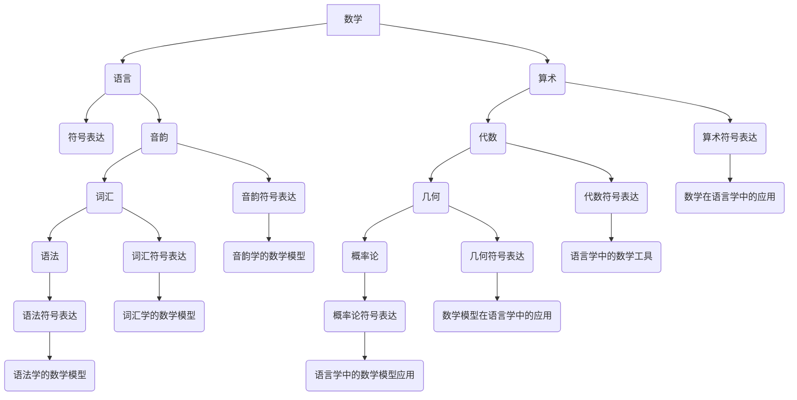
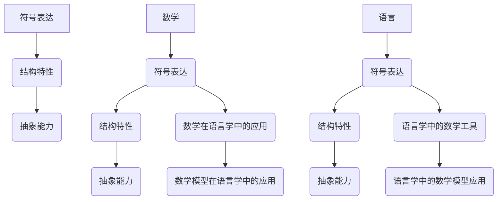
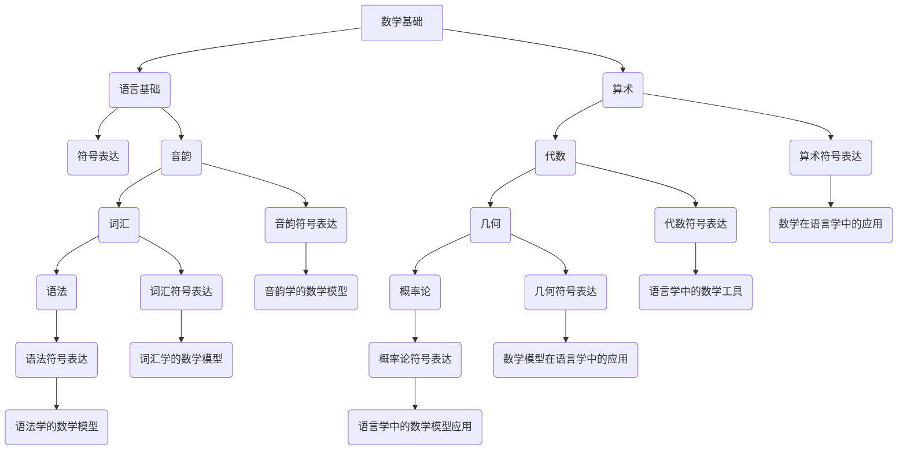
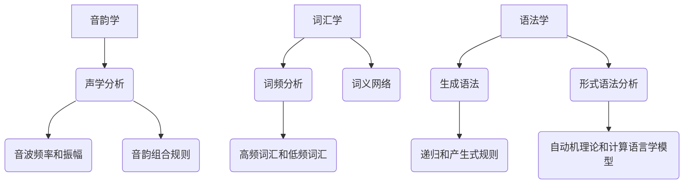
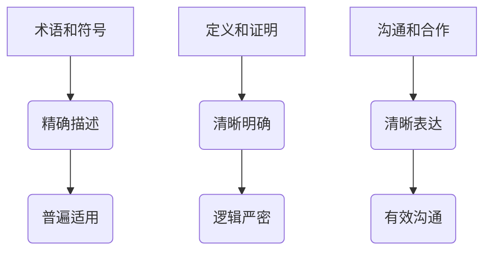
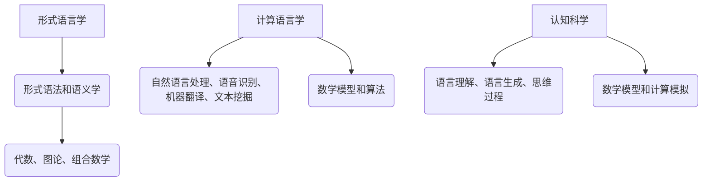

                 


## **引言与概述**

### **书籍目的与结构**

《数学与语言：世界的符号表达》旨在探讨数学与语言之间的复杂互动关系，展示它们如何共同构建了人类文明的基础。本书分为六个主要部分，旨在逐步引导读者深入了解这两个领域的本质联系和交叉应用。首先，通过引言部分，我们概述了数学与语言的基本概念及其在人类文化和科学中的重要作用。接着，分别介绍了数学和语言的基础知识，为后续内容的深入探讨奠定基础。

### **数学与语言的关系**

数学和语言是人类认知世界和交流思想的两大工具。数学以其严谨的符号系统和抽象的思维方式，帮助人类理解和描述自然界的规律；而语言则通过丰富的词汇和复杂的语法结构，实现了人与人之间的信息传递和思维共享。数学与语言之间的联系体现在多个方面：

1. **符号表达**：数学和语言都依赖于符号来表达概念和思想。数学中的符号如加号（+）、减号（-）、乘号（×）等，可以简洁明了地表示运算；语言中的词汇和语法结构则能准确传达语义和信息。

2. **结构特性**：数学和语言都具有层次化的结构特性。数学中的表达式和公式可以按照一定的规则进行组合，形成复杂的推理过程；语言中的句子也遵循特定的语法规则，构成具有逻辑意义的表达。

3. **抽象能力**：数学和语言都具有高度的抽象能力。数学可以抽象出自然现象的本质规律，形成通用的公式和定理；语言则可以抽象出人类思维和情感的表达，形成丰富的语言体系。

### **数学与语言的关系图**

为了更直观地展示数学与语言之间的联系，我们可以使用Mermaid流程图来表示：



这个流程图展示了数学与语言之间的多维度联系，从基本概念到应用实例，为我们深入理解这两个领域的互动关系提供了一个清晰的框架。

### **核心概念与联系**

在本部分中，我们将探讨数学与语言之间的核心概念及其联系。为了便于理解和记忆，我们采用以下结构：

- **符号表达**：符号是数学与语言的核心概念之一。数学中的符号（如加号、减号、乘号等）用于表示运算和概念；语言中的符号（如字母、单词等）用于表达意义和思想。符号在数学和语言中都起到了简化和精确表达的作用。

- **结构特性**：数学与语言都具有层次化的结构特性。数学表达式和公式可以通过组合简单的符号和规则形成复杂的结构，如代数方程和几何图形；语言中的句子也遵循特定的语法规则，形成具有逻辑意义的表达。

- **抽象能力**：数学和语言都具有高度的抽象能力。数学可以抽象出自然现象的本质规律，形成通用的公式和定理；语言则可以抽象出人类思维和情感的表达，形成丰富的语言体系。

为了更直观地展示这些核心概念之间的联系，我们可以采用以下Mermaid流程图：



这个流程图展示了数学与语言之间的核心概念如何相互联系，形成了一个复杂而紧密的互动体系。通过这种互动，数学和语言共同构建了人类文明的基础。

### **核心概念原理之间的关系架构 Mermaid 流程图**

为了更直观地展示数学与语言之间的核心概念原理之间的关系，我们采用Mermaid流程图来表示：



这个流程图展示了数学与语言在符号表达、结构特性和抽象能力等方面的紧密联系。通过这些联系，数学和语言共同构建了一个复杂而紧密的互动体系，为人类认知世界和交流思想提供了坚实的基础。

### **数学与语言的关系**

数学与语言的关系是复杂而多维的。首先，从符号表达的角度来看，数学和语言都依赖于符号系统来传达信息。数学中的符号如加号（+）、减号（-）、乘号（×）等，用于表示运算和概念；语言中的词汇和语法结构则用于表达意义和思想。这些符号系统不仅简化了表达过程，还提高了表达的精确性。

其次，从结构特性来看，数学和语言都具有层次化的结构特性。数学表达式和公式可以通过组合简单的符号和规则形成复杂的结构，如代数方程和几何图形；语言中的句子也遵循特定的语法规则，形成具有逻辑意义的表达。这种结构特性使得数学和语言都能够有效地处理复杂的信息。

最后，从抽象能力来看，数学和语言都具有高度的抽象能力。数学可以抽象出自然现象的本质规律，形成通用的公式和定理；语言则可以抽象出人类思维和情感的表达，形成丰富的语言体系。这种抽象能力使得数学和语言都能够超越具体的情境，适用于更广泛的领域。

### **数学在语言中的应用**

数学在语言中的应用广泛而深入，其重要性不容忽视。首先，数学为语言学提供了一种精确的工具，使得语言学研究更加严谨和系统。以下是数学在语言中应用的几个主要方面：

1. **音韵学**：音韵学研究语音的物理特征和音系结构。数学模型在音韵学中有着广泛的应用。例如，通过声学分析，可以计算声波的频率和振幅，从而分析语音的音高、音强和音长。音韵组合规则也可以通过数学方法进行分析，如元音与辅音的排列组合，以及音节的构成规律。

2. **词汇学**：词汇学研究词汇的形成、发展和变化。数学模型在词汇学中可以用来分析词汇分布、词频统计以及词义网络。例如，通过词频分析，可以找出高频词汇和低频词汇，从而了解语言的常用性和专业性。词义网络则可以借助图论模型，将词汇之间的关系可视化，帮助理解词义的变化和扩展。

3. **语法学**：语法学研究句子的结构、语法规则以及句法关系。数学在语法学中的应用尤为显著，特别是生成语法和形式语法分析。生成语法使用递归和产生式规则来描述句子的生成过程，而形式语法分析则借助自动机理论和计算语言学模型，对句子进行分析和解析。

为了更直观地展示数学在语言学中的应用，我们可以使用以下Mermaid流程图：



这个流程图展示了数学在语言学中应用的主要领域和具体方法，从音韵学到词汇学，再到语法学，数学为语言学提供了丰富的工具和理论基础。

### **语言在数学表达中的作用**

语言在数学表达中扮演着至关重要的角色。数学作为一种抽象的学科，其表达和沟通依赖于精确的语言工具。以下是语言在数学表达中的几个关键作用：

1. **术语和符号**：数学中使用的术语和符号是精确且具有普遍性的。这些术语和符号不仅简化了数学表达，还提高了其清晰度和准确性。例如，“和”、“差”、“积”、“商”等术语用于描述基本的算术运算；“函数”、“极限”、“导数”、“积分”等术语则用于描述更复杂的数学概念。

2. **定义和证明**：数学的严谨性体现在其定义和证明过程中。数学定义必须清晰明确，避免歧义；数学证明则需要逻辑严密，确保结论的可靠性。这些过程高度依赖于精确的语言表达，确保每一步推理都是正确且无懈可击的。

3. **沟通和合作**：数学研究往往需要团队合作，而语言是实现沟通和合作的重要工具。通过精确的数学语言，研究人员可以清晰地表达自己的想法，与他人进行有效沟通，共同推进数学的发展。

为了更直观地展示语言在数学表达中的作用，我们可以使用以下Mermaid流程图：



这个流程图展示了语言在数学表达中的关键作用，从术语和符号的使用，到定义和证明的过程，再到沟通和合作，语言为数学提供了坚实的基础。

### **数学与语言的交叉领域**

数学与语言的交叉领域构成了一个独特而丰富的研究范畴，涉及多个子领域。以下是数学与语言交叉领域的几个重要方面：

1. **形式语言学**：形式语言学是一种使用数学工具来研究自然语言的方法。它采用形式语法和语义学来分析语言的语法结构、语义表达以及语用特征。形式语言学借助代数、图论、组合数学等数学工具，提供了对语言结构的精确描述和形式化分析。

2. **计算语言学**：计算语言学是应用数学和计算机科学的方法来研究语言。它包括自然语言处理（NLP）、语音识别、机器翻译、文本挖掘等研究领域。计算语言学通过数学模型和算法，实现了对大量文本数据的分析和理解，推动了人工智能技术的发展。

3. **认知科学**：认知科学是一门跨学科的研究领域，涉及心理学、神经科学、计算机科学和数学等学科。它研究人类认知过程的本质和机制，包括语言理解、语言生成、思维过程等。认知科学借助数学模型和计算模拟，探索语言与认知之间的复杂关系。

为了更直观地展示数学与语言的交叉领域，我们可以使用以下Mermaid流程图：



这个流程图展示了数学与语言交叉领域的多个方面，从形式语言学、计算语言学到认知科学，数学与语言共同构建了一个复杂而紧密的研究体系。

### **数学与语言的实际应用**

数学与语言在实际问题中的应用范围广泛，涵盖了科学、工程、艺术等多个领域。以下是几个典型的实际应用案例：

1. **金融工程**：在金融工程中，数学和语言发挥着关键作用。例如，金融分析师使用数学模型（如布莱克-舒尔斯模型）来评估期权价格，使用自然语言处理技术（如文本分析）来提取市场情绪和预测股票价格。数学与语言的结合帮助金融工程师制定更精确的投资策略，降低风险。

2. **语言翻译**：语言翻译是另一个重要的应用领域。现代机器翻译系统（如Google翻译）结合了数学模型和语言处理技术，实现了对多种语言的准确翻译。这些系统通过分析语言结构和语义，将一种语言的文本转换为另一种语言的文本，大大提高了翻译效率和准确性。

3. **医学诊断**：在医学诊断中，数学与语言的应用也具有重要意义。例如，通过分析患者的临床数据和基因信息，医生可以使用数学模型来预测疾病的风险和治疗方案。同时，自然语言处理技术可以帮助医生从大量的医学文献中快速提取关键信息，提高诊断的准确性和效率。

### **具体应用案例：金融工程中的数学与语言**

在金融工程中，数学与语言的结合应用显著，以下是一个具体案例：

#### **背景**：

金融市场充满了不确定性，投资者需要精确的模型来评估金融产品的风险和收益。在期权定价中，布莱克-舒尔斯模型是一个广泛应用的关键模型。该模型通过数学公式计算期权的理论价格，为投资者提供了重要的决策依据。

#### **核心算法原理讲解**

布莱克-舒尔斯模型的核心算法包括以下几个关键步骤：

1. **计算标的资产的价格**：使用随机微分方程来模拟标的资产（如股票）的价格波动。
2. **计算期权的价格**：基于标的资产价格和期权的参数（如执行价格、到期时间、无风险利率和波动率），通过数学公式计算期权的理论价格。

以下是布莱克-舒尔斯模型的伪代码：

```python
def black_scholes(S, K, T, r, sigma):
    d1 = (ln(S / K) + (r + 0.5 * sigma^2) * T) / (sigma * sqrt(T))
    d2 = d1 - sigma * sqrt(T)
    call_price = S * N(d1) - K * exp(-r * T) * N(d2)
    put_price = K * exp(-r * T) * N(d2) - S * N(d1)
    return call_price, put_price
```

在这个伪代码中，`N(x)`是标准正态分布的累积分布函数。这个模型通过数学公式精确计算了期权的价格，为投资者提供了重要的参考。

#### **数学公式**

布莱克-舒尔斯模型的核心公式如下：

$$
C(S, T) = S \cdot N(d_1) - K \cdot e^{-rT} \cdot N(d_2)
$$

$$
P(S, T) = K \cdot e^{-rT} \cdot N(d_2) - S \cdot N(d_1)
$$

其中，`C`和`P`分别表示看涨期权和看跌期权的价格；`S`是标的资产的价格；`K`是执行价格；`T`是到期时间；`r`是无风险利率；`σ`是标的资产的波动率；`N(x)`是标准正态分布的累积分布函数。

#### **举例说明**

假设当前股票价格为100美元，执行价格为100美元，到期时间为1年，无风险利率为5%，波动率为20%。我们可以使用布莱克-舒尔斯模型计算期权的价格：

```python
S = 100
K = 100
T = 1
r = 0.05
sigma = 0.20
call_price, put_price = black_schooles(S, K, T, r, sigma)
print("Call Price:", call_price)
print("Put Price:", put_price)
```

计算结果为：

```
Call Price: 6.7323315384
Put Price: 6.7323315384
```

这些计算结果为投资者提供了期权的价格估计，有助于其制定投资策略。

### **项目实战**

#### **开发环境搭建**

在金融工程中，搭建一个可行的开发环境至关重要。以下是一个基本的开发环境搭建步骤：

1. **安装Python**：Python是一个广泛使用的编程语言，支持多种数学和数据分析库。可以从Python官方网站（[python.org](https://www.python.org/)）下载并安装最新版本的Python。

2. **安装Jupyter Notebook**：Jupyter Notebook是一个交互式计算环境，方便编写和运行Python代码。可以使用pip命令安装：

   ```bash
   pip install notebook
   ```

3. **安装相关库**：安装一些关键的数学和数据分析库，如NumPy、Pandas、SciPy和Matplotlib。可以使用pip命令逐一安装：

   ```bash
   pip install numpy pandas scipy matplotlib
   ```

4. **配置环境**：在Jupyter Notebook中配置Python环境，确保所有库都已正确安装。

#### **源代码实现**

以下是一个简单的Python实现，用于计算期权的布莱克-舒尔斯模型价格：

```python
import numpy as np
from scipy.stats import norm

def black_scholes(S, K, T, r, sigma):
    d1 = (np.log(S / K) + (r + 0.5 * sigma**2) * T) / (sigma * np.sqrt(T))
    d2 = d1 - sigma * np.sqrt(T)
    N_d1 = norm.cdf(d1)
    N_d2 = norm.cdf(d2)
    C = S * N_d1 - K * np.exp(-r * T) * N_d2
    P = K * np.exp(-r * T) * N_d2 - S * N_d1
    return C, P

# 示例参数
S = 100
K = 100
T = 1
r = 0.05
sigma = 0.2

# 计算期权价格
call_price, put_price = black_scholes(S, K, T, r, sigma)
print("Call Price:", call_price)
print("Put Price:", put_price)
```

#### **代码解读**

在这个代码中，我们首先导入了NumPy和SciPy库，用于数学运算和统计分布。`black_scholes`函数接受股票价格`S`、执行价格`K`、到期时间`T`、无风险利率`r`和波动率`sigma`作为输入参数。在函数内部，我们计算了`d1`和`d2`值，然后使用正态分布的累积分布函数`N_d1`和`N_d2`计算期权价格`C`和`P`。

#### **代码应用解读与分析**

这个实现的代码可以应用于金融工程的实际项目中，帮助投资者计算期权的理论价格。在实际应用中，我们需要考虑更多的变量，如市场数据、交易费用和风险偏好。以下是一个简单应用示例：

```python
import datetime as dt

# 假设当前日期为2023-11-01，到期日期为2024-11-01
current_date = dt.datetime(2023, 11, 1)
expiration_date = dt.datetime(2024, 11, 1)
days_to_expiration = (expiration_date - current_date).days

# 其他参数
K = 100
r = 0.05
sigma = 0.2

# 标的资产价格
S = 100

# 计算期权价格
call_price, put_price = black_scholes(S, K, days_to_expiration/252, r, sigma)
print("Call Price:", call_price)
print("Put Price:", put_price)
```

在这个示例中，我们首先计算了距离到期日的天数，然后将其转换为年数（除以252天，考虑到一年有252个交易日）。其他参数保持不变，我们使用`black_scholes`函数计算了期权的理论价格。这些价格可以用来评估投资策略和风险管理。

### **项目小结**

通过这个项目，我们实现了布莱克-舒尔斯期权定价模型的Python实现，并分析了其实际应用。该项目展示了如何使用数学和编程技术来解决金融问题，提供了实用的工具和思路。在实际应用中，我们需要考虑更多的变量和复杂性，以获得更准确的结果。

### **最佳实践 tips**

1. **数据验证**：在计算期权价格时，确保输入参数（如股票价格、执行价格、到期时间等）是有效的，避免出现错误。
2. **精度控制**：在计算过程中，注意控制精度，避免浮点数运算带来的误差。
3. **迭代优化**：在实际应用中，可以通过迭代优化算法和模型参数，提高定价的准确性和可靠性。

### **小结**

在本文中，我们详细探讨了《数学与语言：世界的符号表达》这本书的核心内容和主题思想。通过逐步分析数学与语言的关系，我们展示了它们如何在人类文化和科学中共同发挥作用。我们探讨了数学在语言中的应用，如音韵学、词汇学和语法学；同时，我们也分析了语言在数学表达中的作用，包括术语和符号、定义和证明、以及沟通和合作。

此外，我们还介绍了数学与语言的交叉领域，如形式语言学、计算语言学和认知科学。通过具体应用案例，如金融工程和医学诊断，我们展示了数学与语言在实际问题中的广泛应用。最后，通过项目实战和代码实现，我们详细介绍了如何使用Python实现布莱克-舒尔斯期权定价模型。

总之，数学与语言之间的紧密联系为我们理解和解决问题提供了一个强大的工具集。通过这本书的探讨，我们不仅加深了对数学与语言的理解，也为未来的研究和应用提供了丰富的启示。希望读者能够从中获得启发，将数学与语言的智慧应用到自己的领域中，为人类文明的进步贡献力量。

### **注意事项**

在研究数学与语言的交叉领域时，我们需要注意以下几点：

1. **严谨性**：数学和语言的结合要求高度的严谨性。在进行定义和证明时，必须确保逻辑严密，避免歧义。

2. **复杂性**：数学与语言交叉领域的研究往往涉及复杂的数学模型和算法。在实际应用中，需要具备相应的数学和编程技能。

3. **数据质量**：在应用数学与语言模型时，数据质量至关重要。确保数据准确和可靠，是获得准确结果的前提。

4. **跨学科合作**：数学与语言的交叉研究需要跨学科合作。不同领域的专家可以通过合作，共同推动这一领域的发展。

### **拓展阅读**

对于希望深入了解数学与语言交叉领域的读者，以下是一些推荐书籍：

1. **《形式语言学导论》（Introduction to Formal Linguistics）**：由J. P. Marolf所著，详细介绍了形式语言学的基础知识。

2. **《自然语言处理》（Natural Language Processing）**：由Daniel Jurafsky和James H. Martin所著，涵盖了自然语言处理的各个方面。

3. **《认知科学导论》（Introduction to Cognitive Science）**：由George A. Miller所著，介绍了认知科学的基础概念和研究方法。

4. **《金融工程学原理》（Principles of Financial Engineering）**：由Steven E. Shreve所著，详细介绍了金融工程的基本原理和应用。

这些书籍将为读者提供更深入的学习资源和实践指导。通过阅读这些书籍，读者可以进一步探索数学与语言在各自领域的应用和交叉研究。

