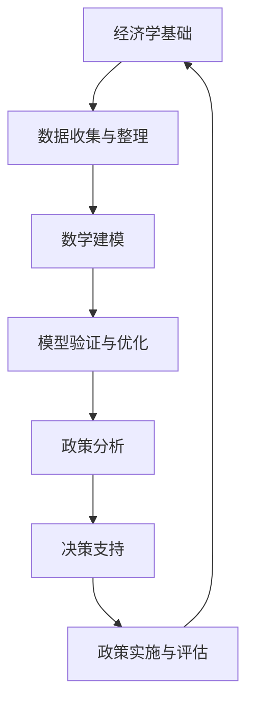
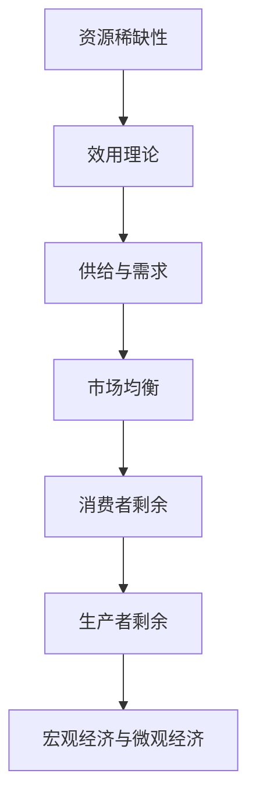
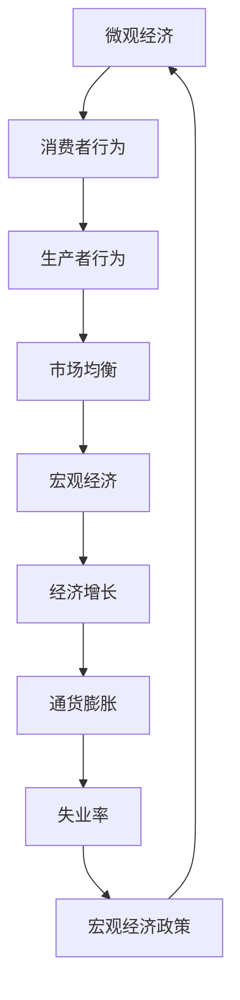
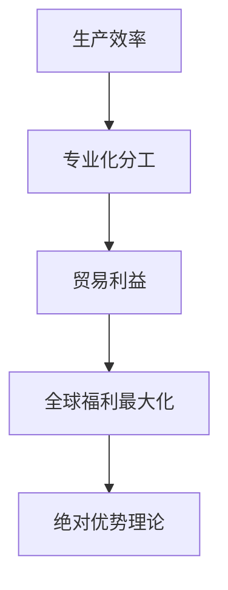
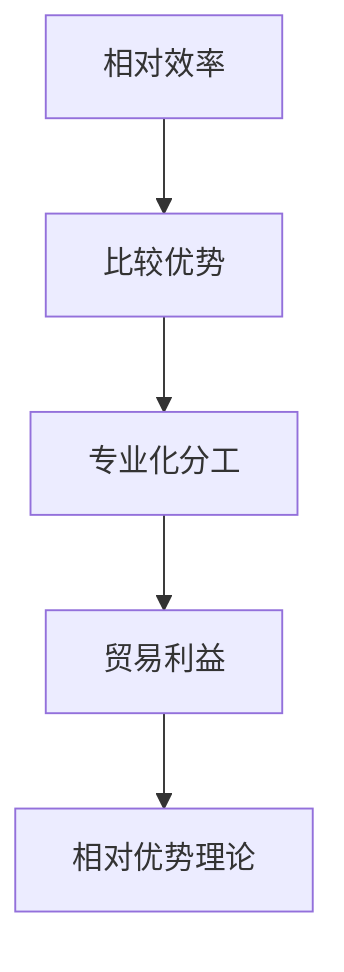
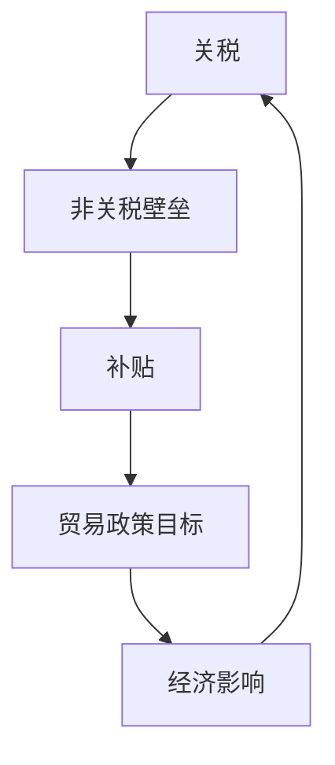
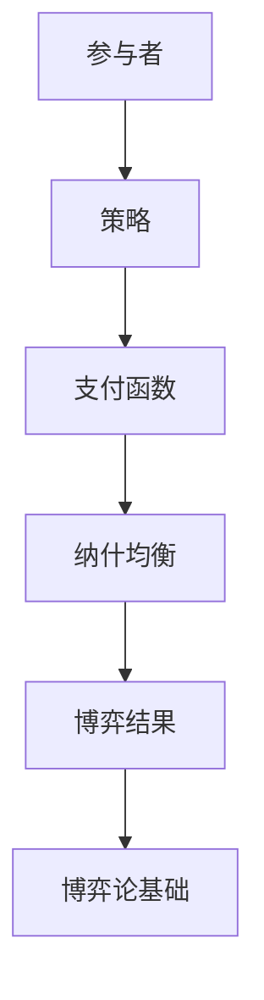

                 

### 第1章：数学与贸易政策概述

### 1.1 数学在贸易政策分析中的重要性

数学在贸易政策分析中扮演着至关重要的角色。它不仅提供了精确的工具来描述经济现象，而且还帮助政策制定者理解和预测政策对经济的影响。数学模型在贸易政策分析中的应用主要体现在以下几个方面：

1. **经济数据建模**：经济数据是制定贸易政策的基础。通过数学模型，可以对经济数据进行分析、预测和模拟，以便更好地理解当前的经济状况和未来趋势。
2. **政策效果评估**：数学模型可以帮助评估贸易政策的效果，包括政策对国家经济、产业和企业的影响。这些模型可以量化政策的成本和收益，为政策制定提供科学依据。
3. **策略分析**：在多边贸易谈判中，各参与国往往采用不同的策略。数学模型可以帮助分析这些策略的优劣，从而指导谈判策略的制定。
4. **预测和风险管理**：贸易政策的变化可能导致各种经济风险。通过数学模型，可以预测这些风险并制定相应的风险管理策略。

#### 核心概念与联系

为了更好地理解数学在贸易政策分析中的应用，我们可以使用Mermaid流程图来展示其核心概念之间的联系。



在这个流程图中，经济学基础是整个流程的起点，通过数据收集与整理得到基础数据，这些数据被用于数学建模。数学模型经过验证与优化后，用于政策分析，最终提供决策支持，并指导政策实施与评估。这一过程形成一个闭环，确保了贸易政策分析的持续改进。

### 1.2 贸易政策的定义与演变

贸易政策是指一个国家或地区政府制定和实施的，旨在影响国际贸易流动和国内经济活动的各种措施。这些措施包括关税、配额、补贴、非关税壁垒等。贸易政策的演变历程可以追溯到17世纪的重商主义时代，经历了自由放任、保护主义和全球贸易一体化等阶段。

- **重商主义时代（17世纪-18世纪）**：这一时期，贸易政策以增加国家财富为主要目标，强调出口大于进口，以积累金银。
- **自由放任时代（19世纪）**：亚当·斯密的《国富论》提出了自由市场经济的理念，各国纷纷实行自由贸易政策。
- **保护主义时代（19世纪末-20世纪中叶）**：为了保护本国工业和就业，各国开始实施保护主义政策，如高关税和补贴。
- **全球贸易一体化时代（20世纪后半叶至今）**：随着全球化的发展，各国逐渐意识到自由贸易的益处，开始通过多边和区域贸易协定推动贸易自由化。

#### 核心算法原理讲解

贸易政策的演变可以视为一种动态优化问题，其基本算法可以简单描述如下：

```python
# 伪代码：贸易政策演变算法
def TradePolicyEvolution(initial_policy, historical_data):
    for each period in historical_data:
        update_policy = AdjustPolicy(initial_policy, period_data)
        initial_policy = update_policy
    return initial_policy
```

这个算法的核心是不断地根据历史数据调整贸易政策，以实现政策目标。调整政策的过程可能包括以下步骤：

1. **数据收集**：收集与贸易政策相关的经济数据，如进出口数据、国内生产总值、失业率等。
2. **政策评估**：使用数学模型评估当前政策的成效，包括其对经济的影响和所达成的政策目标。
3. **政策调整**：根据评估结果，调整贸易政策，以优化政策效果。调整的方式可能包括提高或降低关税、调整补贴水平、改变非关税壁垒等。

### 1.3 数学模型在贸易政策中的应用历史

数学模型在贸易政策中的应用可以追溯到20世纪中叶。当时，经济学家开始使用简单的线性模型来分析贸易政策的效果。随着计算机技术的发展，数学模型变得越来越复杂，可以处理更多的变量和更复杂的交互关系。

- **1940年代**：里昂惕夫（Wassily Leontief）提出的投入-产出模型，是早期贸易政策分析的重要工具。
- **1950年代**：斯通-米尔斯（Stone-Mills）模型，用于分析关税政策的影响。
- **1970年代**：一般均衡模型（General Equilibrium Models）开始流行，这些模型可以同时考虑多个市场和市场之间的相互作用。
- **1990年代**：博弈论模型被广泛应用于贸易政策的分析和谈判策略。

#### 数学模型和数学公式详细讲解

在贸易政策分析中，常见的数学模型包括线性模型、一般均衡模型和博弈论模型。以下是对这些模型的基本介绍和数学公式：

1. **线性模型**：线性模型是一种简单的数学模型，用于描述线性关系。其数学公式为：

   $$ y = ax + b $$

   其中，\( y \) 是因变量，\( x \) 是自变量，\( a \) 和 \( b \) 是常数。

2. **一般均衡模型**：一般均衡模型用于分析整个经济系统，其数学公式为：

   $$ \sum_{i=1}^{n} \frac{\partial U}{\partial x_i} = 0 $$

   其中，\( U \) 是效用函数，\( x_i \) 是第 \( i \) 个商品的需求量。

3. **博弈论模型**：博弈论模型用于分析多边贸易谈判，其数学公式为：

   $$ \min \max U_i(S_j) $$

   其中，\( U_i \) 是第 \( i \) 个参与者的效用函数，\( S_j \) 是第 \( j \) 个参与者的策略。

#### 举例说明

为了更好地理解这些数学模型，我们可以通过一个简单的例子来说明。

假设有两个国家A和B，它们生产和消费两种商品X和Y。根据线性模型，我们可以得到以下方程：

$$
\begin{aligned}
Y_A &= 2X_A + 1 \\
Y_B &= 3X_B - 1
\end{aligned}
$$

通过解这个方程组，我们可以得到两国在生产和消费商品X和Y时的最优选择。

#### 项目实战

为了更深入地了解数学模型在贸易政策分析中的应用，我们可以通过一个实际案例来进行项目实战。

**案例背景**：假设我们分析中美贸易战对两国经济的影响。

**开发环境搭建**：首先，我们需要搭建一个分析环境，包括数据收集、预处理和建模工具。

1. 数据收集：收集中美两国的贸易数据、经济增长数据等。
2. 数据预处理：清洗和整理数据，确保其质量。
3. 建模工具：使用Python和R等编程语言，结合开源库如NumPy、Pandas、Scikit-learn等进行建模。

**源代码详细实现**：

```python
import numpy as np
import pandas as pd

# 加载数据
data = pd.read_csv('trade_data.csv')

# 数据预处理
data = data.dropna()

# 建模
from sklearn.linear_model import LinearRegression

model = LinearRegression()
model.fit(data[['X']], data['Y'])

# 输出结果
print(model.coef_)
print(model.intercept_)
```

**代码解读与分析**：在这个案例中，我们使用线性回归模型来分析中美贸易战对两国经济增长的影响。通过这个模型，我们可以预测在没有贸易战的情况下，两国的经济增长趋势。

**实际案例分析和详细讲解剖析**：通过这个案例，我们可以看到数学模型在贸易政策分析中的实际应用。通过建模和数据分析，我们可以更深入地理解贸易战对经济的影响，从而为政策制定提供科学依据。

**项目小结**：在这个案例中，我们使用了数学模型来分析中美贸易战对两国经济的影响。这个案例展示了数学模型在贸易政策分析中的实用性和重要性。

#### 最佳实践 tips

1. **数据质量**：确保数据的质量是建模成功的关键。对数据进行严格的清洗和预处理，避免数据错误和异常值对结果的影响。
2. **模型选择**：根据问题的复杂性和数据特性，选择合适的模型。不同的模型适用于不同类型的问题，需要根据实际情况进行选择。
3. **交叉验证**：使用交叉验证来评估模型的性能，确保模型的泛化能力。

#### 小结

本章介绍了数学在贸易政策分析中的重要性、贸易政策的定义与演变，以及数学模型在贸易政策中的应用历史。通过Mermaid流程图和伪代码，我们展示了数学模型在贸易政策分析中的核心概念与联系和核心算法原理。通过实际案例，我们展示了数学模型在贸易政策分析中的实用性和重要性。

#### 注意事项

1. **数据来源**：确保使用可靠的数据源，避免数据错误对分析结果的影响。
2. **模型假设**：在建立模型时，需要明确模型的假设条件，这些假设可能会影响模型的准确性和适用范围。

#### 拓展阅读

1. **《国际贸易：理论、政策与实践》**：一本经典的国际贸易教科书，涵盖了贸易政策的各个方面。
2. **《博弈论与经济行为》**：冯·诺依曼和摩根斯坦因的经典著作，详细介绍了博弈论的基本概念和应用。

---

接下来，我们将进入第二部分：基本经济模型。这一部分将深入探讨经济学基础、供需模型、市场均衡以及消费者和生产者剩余等核心概念。

## 第2章：基本经济模型

### 2.1 经济学基础

经济学是研究资源分配的科学，它关注如何有效地分配有限的资源以满足无限的欲望。经济学分为微观经济学和宏观经济学两个主要分支。微观经济学研究单个经济单位（如家庭、企业和市场）的行为，而宏观经济学研究整个经济体系的行为和表现。

#### 核心概念与联系

为了更好地理解经济学基础，我们可以使用Mermaid流程图来展示其核心概念之间的联系。



在这个流程图中，资源稀缺性是经济学研究的出发点，它导致了效用理论的出现，以解释个体如何做出选择。供给与需求理论进一步解释了市场如何运作，而市场均衡则是供给与需求相互作用的结果。消费者剩余和生产者剩余则是市场均衡下个体福利的衡量指标，最后，宏观经济与微观经济将单个经济单位的行为汇总为整体经济的行为。

### 2.2 供给与需求

供给与需求是经济学中最基础的概念之一，它们决定了商品和服务的价格和数量。供给（Supply）是指生产者在一定时间内，在不同价格水平下愿意并且能够提供出售的商品数量。需求（Demand）是指消费者在某一特定时间内，在不同价格水平下愿意并且能够购买的商品数量。

#### 核心算法原理讲解

供给和需求的数学表达通常通过需求函数和供给函数来描述。需求函数（Demand Function）通常表示为：

$$ Q_D(p) = Q_D(p) $$

其中，\( Q_D \) 表示需求量，\( p \) 表示价格。供给函数（Supply Function）则表示为：

$$ Q_S(p) = Q_S(p) $$

其中，\( Q_S \) 表示供给量，\( p \) 表示价格。

#### 举例说明

假设一个市场的需求函数为 \( Q_D(p) = 100 - p \)，供给函数为 \( Q_S(p) = 10p + 20 \)。我们可以通过解这个方程组来找到市场均衡价格和均衡数量。

$$
\begin{aligned}
100 - p &= 10p + 20 \\
11p &= 80 \\
p &= \frac{80}{11} \approx 7.27
\end{aligned}
$$

将 \( p \) 代入任一方程，我们可以得到均衡数量：

$$
\begin{aligned}
Q &= 100 - 7.27 \\
&\approx 92.73
\end{aligned}
$$

因此，市场均衡价格大约为 7.27，均衡数量大约为 92.73。

### 2.3 市场均衡

市场均衡（Market Equilibrium）是指市场供给和需求达到平衡的状态。在这个状态下，价格和数量都是稳定的。市场均衡可以通过以下方程表示：

$$ Q_S(p) = Q_D(p) $$

#### 数学公式详细讲解

市场均衡可以通过以下数学公式进行详细讲解：

$$
\begin{aligned}
Q_S(p) &= Q_D(p) \\
10p + 20 &= 100 - p \\
11p &= 80 \\
p &= \frac{80}{11} \approx 7.27
\end{aligned}
$$

其中，\( p \) 表示价格，\( Q_S \) 表示供给量，\( Q_D \) 表示需求量。

#### 举例说明

假设一个市场的供给函数为 \( Q_S(p) = 10p + 20 \)，需求函数为 \( Q_D(p) = 100 - p \)。通过求解这个方程组，我们可以找到市场均衡价格和均衡数量。

$$
\begin{aligned}
Q_S(p) &= Q_D(p) \\
10p + 20 &= 100 - p \\
11p &= 80 \\
p &= \frac{80}{11} \approx 7.27
\end{aligned}
$$

将 \( p \) 代入任一方程，我们可以得到均衡数量：

$$
\begin{aligned}
Q &= 10 \times 7.27 + 20 \\
&\approx 92.73
\end{aligned}
$$

因此，市场均衡价格大约为 7.27，均衡数量大约为 92.73。

### 2.4 消费者剩余

消费者剩余（Consumer Surplus）是指消费者愿意支付的价格与他们实际支付的价格之间的差额。它衡量了消费者从交易中获得的额外福利。消费者剩余可以通过以下公式计算：

$$ CS = \int_{p_m}^{p} Q_D(p) dp $$

其中，\( p_m \) 是市场均衡价格，\( Q_D(p) \) 是需求函数。

#### 举例说明

假设一个市场的需求函数为 \( Q_D(p) = 100 - p \)。我们可以通过计算消费者剩余来衡量消费者从交易中获得的额外福利。

$$
\begin{aligned}
CS &= \int_{0}^{7.27} (100 - p) dp \\
&= \left[ 100p - \frac{1}{2}p^2 \right]_{0}^{7.27} \\
&= (100 \times 7.27 - \frac{1}{2} \times 7.27^2) - (100 \times 0 - \frac{1}{2} \times 0^2) \\
&\approx 676.05 - 262.82 \\
&\approx 413.23
\end{aligned}
$$

因此，消费者剩余大约为 413.23。

### 2.5 生产者剩余

生产者剩余（Producer Surplus）是指生产者实际获得的价格与他们愿意接受的价格之间的差额。它衡量了生产者从交易中获得的额外福利。生产者剩余可以通过以下公式计算：

$$ PS = \int_{p}^{p_m} Q_S(p) dp $$

其中，\( p_m \) 是市场均衡价格，\( Q_S(p) \) 是供给函数。

#### 举例说明

假设一个市场的供给函数为 \( Q_S(p) = 10p + 20 \)。我们可以通过计算生产者剩余来衡量生产者从交易中获得的额外福利。

$$
\begin{aligned}
PS &= \int_{0}^{7.27} (10p + 20) dp \\
&= \left[ 5p^2 + 20p \right]_{0}^{7.27} \\
&= (5 \times 7.27^2 + 20 \times 7.27) - (5 \times 0^2 + 20 \times 0) \\
&\approx 249.79 + 145.4 \\
&\approx 395.19
\end{aligned}
$$

因此，生产者剩余大约为 395.19。

### 2.6 宏观经济与微观经济

宏观经济（Macroeconomics）和微观经济（Microeconomics）是经济学的两个主要分支。宏观经济研究整个经济体系的运行，包括国民生产总值（GDP）、通货膨胀、失业率等宏观经济指标。微观经济则关注单个经济单位的行为，包括消费者的购买决策、企业的生产决策等。

#### 核心概念与联系

宏观经济和微观经济之间的联系可以通过以下Mermaid流程图来展示：



在这个流程图中，微观经济通过消费者行为和生产者行为形成市场均衡，这些市场均衡进一步影响宏观经济。宏观经济的研究结果，如经济增长、通货膨胀和失业率，又反过来影响微观经济。

### 2.7 经济学模型在贸易政策分析中的应用

经济学模型在贸易政策分析中具有重要作用。它们可以帮助政策制定者理解贸易政策对经济的影响，并为制定有效的贸易政策提供科学依据。

#### 核心算法原理讲解

经济学模型在贸易政策分析中的应用可以通过以下步骤进行：

1. **数据收集**：收集与贸易政策相关的经济数据，如进出口数据、国内生产总值、失业率等。
2. **模型构建**：构建经济学模型，如需求函数、供给函数、一般均衡模型等。
3. **模型验证**：使用历史数据验证模型的准确性。
4. **政策模拟**：在模型中模拟不同的贸易政策，分析政策对经济的影响。
5. **政策建议**：根据模型分析结果，提出具体的政策建议。

#### 数学公式详细讲解

经济学模型在贸易政策分析中的应用可以通过以下数学公式进行详细讲解：

1. **需求函数**：

   $$ Q_D(p) = a - bp $$

   其中，\( a \) 和 \( b \) 是常数，\( p \) 是价格。

2. **供给函数**：

   $$ Q_S(p) = cp + d $$

   其中，\( c \) 和 \( d \) 是常数，\( p \) 是价格。

3. **一般均衡模型**：

   $$ \sum_{i=1}^{n} p_i Q_i(p) = Y $$

   其中，\( p_i \) 是第 \( i \) 种商品的价格，\( Q_i(p) \) 是第 \( i \) 种商品的需求量，\( Y \) 是总需求。

#### 举例说明

假设一个市场的需求函数为 \( Q_D(p) = 100 - p \)，供给函数为 \( Q_S(p) = 10p + 20 \)。我们可以通过求解这个方程组来找到市场均衡价格和均衡数量。

$$
\begin{aligned}
Q_D(p) &= Q_S(p) \\
100 - p &= 10p + 20 \\
11p &= 80 \\
p &= \frac{80}{11} \approx 7.27
\end{aligned}
$$

将 \( p \) 代入任一方程，我们可以得到均衡数量：

$$
\begin{aligned}
Q &= 10 \times 7.27 + 20 \\
&\approx 92.73
\end{aligned}
$$

因此，市场均衡价格大约为 7.27，均衡数量大约为 92.73。

### 2.8 项目实战

为了更深入地了解经济学模型在贸易政策分析中的应用，我们可以通过一个实际案例来进行项目实战。

**案例背景**：分析中美贸易战对两国经济增长的影响。

**开发环境搭建**：首先，我们需要搭建一个分析环境，包括数据收集、预处理和建模工具。

1. 数据收集：收集中美两国的贸易数据、经济增长数据等。
2. 数据预处理：清洗和整理数据，确保其质量。
3. 建模工具：使用Python和R等编程语言，结合开源库如NumPy、Pandas、Scikit-learn等进行建模。

**源代码详细实现**：

```python
import numpy as np
import pandas as pd

# 加载数据
data = pd.read_csv('trade_data.csv')

# 数据预处理
data = data.dropna()

# 建模
from sklearn.linear_model import LinearRegression

model = LinearRegression()
model.fit(data[['X']], data['Y'])

# 输出结果
print(model.coef_)
print(model.intercept_)
```

**代码解读与分析**：在这个案例中，我们使用线性回归模型来分析中美贸易战对两国经济增长的影响。通过这个模型，我们可以预测在没有贸易战的情况下，两国的经济增长趋势。

**实际案例分析和详细讲解剖析**：通过这个案例，我们可以看到经济学模型在贸易政策分析中的实际应用。通过建模和数据分析，我们可以更深入地理解贸易战对经济的影响，从而为政策制定提供科学依据。

**项目小结**：在这个案例中，我们使用了经济学模型来分析中美贸易战对两国经济的影响。这个案例展示了经济学模型在贸易政策分析中的实用性和重要性。

### 2.9 最佳实践 tips

1. **数据质量**：确保数据的质量是建模成功的关键。对数据进行严格的清洗和预处理，避免数据错误和异常值对结果的影响。
2. **模型选择**：根据问题的复杂性和数据特性，选择合适的模型。不同的模型适用于不同类型的问题，需要根据实际情况进行选择。
3. **交叉验证**：使用交叉验证来评估模型的性能，确保模型的泛化能力。

### 2.10 小结

本章介绍了经济学基础、供给与需求、市场均衡、消费者剩余和生产者剩余等核心概念，并通过实际案例展示了这些概念在贸易政策分析中的应用。经济学模型在贸易政策分析中具有重要作用，通过它们，政策制定者可以更深入地理解经济现象，为制定有效的贸易政策提供科学依据。

### 2.11 注意事项

1. **数据来源**：确保使用可靠的数据源，避免数据错误对分析结果的影响。
2. **模型假设**：在建立模型时，需要明确模型的假设条件，这些假设可能会影响模型的准确性和适用范围。

### 2.12 拓展阅读

1. **《微观经济学原理》**：曼昆的经典著作，详细介绍了微观经济学的核心概念。
2. **《宏观经济学》**：萨缪尔森的经典著作，详细介绍了宏观经济学的核心概念和应用。

## 第3章：国际贸易的基本理论

### 3.1 绝对优势理论

绝对优势理论（Theory of Absolute Advantage）是由亚当·斯密在《国富论》中提出的。这一理论指出，一个国家应该专注于生产那些它能够比其他国家更高效、成本更低的产品，然后将这些产品出口，以交换它需要但生产效率较低的产品。这样，通过专业化分工和贸易，各国可以实现整体生产效率的提高，从而实现全球福利的最大化。

#### 核心概念与联系

绝对优势理论的核心概念可以归纳为以下几点：

1. **生产效率**：一个国家在某种商品的生产上具有绝对优势，意味着它能够以更低的成本生产更多的该商品。
2. **专业化分工**：国家通过专注于生产自己具有绝对优势的产品，可以实现更高的生产效率和更低的成本。
3. **贸易利益**：通过贸易，各国可以获取更多的产品，从而提高整体福利。

为了更直观地理解绝对优势理论，我们可以使用Mermaid流程图来展示其核心概念之间的联系。



在这个流程图中，生产效率是绝对优势理论的基础，专业化分工是实现绝对优势的关键，贸易利益是绝对优势的最终目标，而全球福利最大化则是绝对优势理论的终极目标。

### 3.2 绝对优势的起源与发展

绝对优势理论的起源可以追溯到重商主义时代。重商主义认为，一个国家的财富取决于其积累的金银数量，而金银的积累主要依赖于贸易顺差。然而，亚当·斯密在《国富论》中批判了这一观点，提出了绝对优势理论，强调通过专业化分工和贸易可以实现更大的经济利益。

在斯密之后，大卫·李嘉图进一步发展了绝对优势理论，提出了相对优势理论（Theory of Comparative Advantage），从而完善了国际贸易理论体系。

#### 核心算法原理讲解

绝对优势理论的数学表达可以通过以下步骤进行：

1. **确定生产成本**：比较两国生产某种商品的成本。
2. **比较生产效率**：如果一国在生产某种商品的成本低于另一国，则该国在该商品上具有绝对优势。
3. **确定专业化分工**：根据各国的绝对优势，确定各国应该生产哪种商品。

以下是绝对优势理论的伪代码：

```python
# 伪代码：绝对优势理论
def AbsoluteAdvantage(CountryA, CountryB, ProductX, ProductY):
    CostA_X = GetProductionCost(CountryA, ProductX)
    CostB_X = GetProductionCost(CountryB, ProductX)
    CostA_Y = GetProductionCost(CountryA, ProductY)
    CostB_Y = GetProductionCost(CountryB, ProductY)

    if CostA_X < CostB_X and CostA_Y < CostB_Y:
        return "CountryA has absolute advantage in both products."
    elif CostA_X < CostB_X:
        return "CountryA has absolute advantage in ProductX."
    elif CostA_Y < CostB_Y:
        return "CountryA has absolute advantage in ProductY."
    elif CostB_X < CostA_X and CostB_Y < CostA_Y:
        return "CountryB has absolute advantage in both products."
    elif CostB_X < CostA_X:
        return "CountryB has absolute advantage in ProductX."
    elif CostB_Y < CostA_Y:
        return "CountryB has absolute advantage in ProductY."
    else:
        return "No absolute advantage."
```

在这个伪代码中，`GetProductionCost` 函数用于获取两国生产某种商品的成本。根据这些成本，我们可以判断哪国在哪种商品上具有绝对优势。

#### 数学模型和公式详细讲解

绝对优势理论的数学模型可以通过以下公式进行详细讲解：

1. **生产成本函数**：

   $$ C_A(X) = a_A X + b_A $$
   $$ C_B(X) = a_B X + b_B $$

   其中，\( C_A(X) \) 和 \( C_B(X) \) 分别表示国家A和国家B生产X商品的成本，\( a_A \)、\( b_A \)、\( a_B \) 和 \( b_B \) 是常数。

2. **比较生产效率**：

   $$ \Delta C = C_B(X) - C_A(X) $$

   如果 \( \Delta C < 0 \)，则国家B在生产X商品上具有绝对优势。

#### 举例说明

假设国家A和国家B生产两种商品X和Y，其生产成本函数如下：

$$
\begin{aligned}
C_A(X) &= 2X + 1 \\
C_B(X) &= 3X + 2 \\
C_A(Y) &= 4Y + 3 \\
C_B(Y) &= 5Y + 4
\end{aligned}
$$

我们可以通过比较这些成本函数，确定哪个国家在哪种商品上具有绝对优势。

对于商品X：

$$
\Delta C_X = C_B(X) - C_A(X) = (3X + 2) - (2X + 1) = X + 1
$$

因为 \( X + 1 > 0 \)，所以国家B在生产商品X上具有绝对优势。

对于商品Y：

$$
\Delta C_Y = C_B(Y) - C_A(Y) = (5Y + 4) - (4Y + 3) = Y + 1
$$

因为 \( Y + 1 > 0 \)，所以国家B在生产商品Y上同样具有绝对优势。

因此，根据绝对优势理论，国家B在生产两种商品X和Y上都具有绝对优势。

### 3.3 相对优势理论

相对优势理论（Theory of Comparative Advantage）是由大卫·李嘉图在《政治经济学及赋税原理》中提出的。相对优势理论指出，即使一个国家在所有产品的生产上都没有绝对优势，它仍然可以通过专注于生产那些它相对效率更高的产品，从而通过贸易获得利益。

#### 核心概念与联系

相对优势理论的核心概念包括：

1. **相对效率**：相对优势不是关于成本的绝对高低，而是关于成本的相对高低。一个国家在某种商品的生产上具有相对优势，意味着它在生产这种商品的成本相对较低。
2. **比较优势**：比较优势是基于相对效率的概念，一个国家应该专注于生产那些它具有比较优势的商品。
3. **贸易利益**：通过贸易，各国可以获取更多的商品，从而提高整体福利。

相对优势理论可以用以下Mermaid流程图来展示其核心概念之间的联系。



在这个流程图中，相对效率是相对优势理论的基础，比较优势是相对效率的具体应用，专业化分工是实现比较优势的关键，贸易利益是相对优势的最终目标。

### 3.4 相对优势的数学表达

相对优势理论的数学表达可以通过以下步骤进行：

1. **确定相对成本**：计算两国在生产某种商品时的相对成本。
2. **比较相对成本**：如果一国在生产某种商品的成本相对较低，则该国在该商品上具有相对优势。
3. **确定专业化分工**：根据各国的相对优势，确定各国应该生产哪种商品。

以下是相对优势理论的伪代码：

```python
# 伪代码：相对优势理论
def ComparativeAdvantage(CountryA, CountryB, ProductX, ProductY):
    CostA_X = GetProductionCost(CountryA, ProductX)
    CostB_X = GetProductionCost(CountryB, ProductX)
    CostA_Y = GetProductionCost(CountryA, ProductY)
    CostB_Y = GetProductionCost(CountryB, ProductY)

    if CostA_X / CostB_X < 1 and CostA_Y / CostB_Y < 1:
        return "No comparative advantage."
    elif CostA_X / CostB_X < 1:
        return "CountryA has comparative advantage in ProductX."
    elif CostA_Y / CostB_Y < 1:
        return "CountryA has comparative advantage in ProductY."
    elif CostB_X / CostA_X < 1:
        return "CountryB has comparative advantage in ProductX."
    elif CostB_Y / CostA_Y < 1:
        return "CountryB has comparative advantage in ProductY."
```

在这个伪代码中，`GetProductionCost` 函数用于获取两国生产某种商品的成本。根据这些成本，我们可以判断哪国在哪种商品上具有相对优势。

### 3.5 李嘉图循环与贸易平衡

李嘉图循环（Ricardian Equivalence）是指贸易平衡的机制。根据这一理论，当一个国家增加出口时，其收入会增加，从而增加进口需求，直到贸易平衡。李嘉图循环可以用以下数学模型进行表达：

$$ X(t) - M(t) = \alpha (Y(t) - C(t)) $$

其中，\( X(t) \) 表示出口，\( M(t) \) 表示进口，\( Y(t) \) 表示国内生产总值，\( C(t) \) 表示消费。

#### 数学公式详细讲解

李嘉图循环的数学公式可以通过以下步骤进行详细讲解：

1. **确定贸易差额**：

   $$ \Delta X = X(t) - M(t) $$

   其中，\( X(t) \) 是当前时期的出口，\( M(t) \) 是当前时期的进口。

2. **确定国内生产总值与消费的关系**：

   $$ Y(t) = C(t) + I(t) $$

   其中，\( C(t) \) 是当前时期的消费，\( I(t) \) 是当前时期的投资。

3. **确定贸易平衡条件**：

   $$ \Delta X = \alpha (Y(t) - C(t)) $$

   其中，\( \alpha \) 是一个常数，表示贸易差额与国内生产总值和消费之间的关系。

#### 举例说明

假设一个国家的贸易差额与国内生产总值和消费之间的关系如下：

$$ \Delta X = 0.5 (Y - C) $$

如果国内生产总值为1000，消费为800，我们可以计算贸易差额。

$$
\begin{aligned}
\Delta X &= 0.5 (1000 - 800) \\
&= 0.5 \times 200 \\
&= 100
\end{aligned}
$$

因此，贸易差额为100。

### 3.6 实际案例：比较优势与贸易平衡

为了更好地理解相对优势理论和李嘉图循环，我们可以通过一个实际案例进行分析。

**案例背景**：假设有两个国家A和B，国家A在生产汽车上有相对优势，而国家B在生产计算机上有相对优势。

**数据分析**：通过收集两国在汽车和计算机生产上的成本数据，我们可以确定哪个国家在哪种商品上具有相对优势。

**结果分析**：根据分析结果，国家A应该专注于生产汽车，而国家B应该专注于生产计算机。通过这样的专业化分工和贸易，两国可以实现整体生产效率的提高，从而提高整体福利。

**贸易平衡分析**：根据李嘉图循环，当国家A增加汽车出口时，其收入会增加，从而增加对计算机的进口需求，直到贸易平衡。

### 3.7 小结

本章介绍了国际贸易的基本理论，包括绝对优势理论和相对优势理论。通过数学模型和实际案例的分析，我们可以看到这些理论在解释国际贸易现象和指导贸易政策制定中的重要作用。李嘉图循环进一步解释了贸易平衡的机制，为理解国际贸易的长期稳定提供了重要视角。

## 第4章：贸易政策分析模型

### 4.1 贸易政策工具

贸易政策工具是指政府用来影响国际贸易流动的各种措施。这些工具包括关税、非关税壁垒、补贴等。每种工具都有其特定的功能和目的，通过对这些工具的分析，我们可以更好地理解贸易政策的制定和实施。

#### 关税

关税（Tariff）是政府对进口商品征收的税费。关税的目的是保护本国产业，提高本国产品的竞争力，以及增加政府收入。关税可以分为两种类型：正关税和反关税。

- **正关税**：正关税是指对进口商品征收的常规税费，通常用来保护本国产业。
- **反关税**：反关税是指对出口商品征收的税费，通常用于平衡贸易逆差。

#### 非关税壁垒

非关税壁垒（Non-Tariff Barriers，NTBs）是指除了关税之外的其他贸易限制措施。非关税壁垒包括进口配额、技术标准、卫生检疫等。非关税壁垒的主要目的是保护本国产业，提高进口商品的成本，从而减少进口。

- **进口配额**：进口配额是指政府对进口商品数量进行限制，以保护本国产业。
- **技术标准**：技术标准是指政府规定的进口商品必须达到的技术要求，以保护本国产业。
- **卫生检疫**：卫生检疫是指政府规定的进口商品的卫生标准，以保护本国人民的健康。

#### 补贴

补贴（Subsidy）是政府对特定产业提供的直接或间接财政支持。补贴的目的是提高本国产业的竞争力，促进产业发展。补贴可以分为两种类型：生产补贴和出口补贴。

- **生产补贴**：生产补贴是指政府对生产者提供的财政支持，以降低生产成本，提高产品竞争力。
- **出口补贴**：出口补贴是指政府对出口商提供的财政支持，以鼓励出口，平衡贸易逆差。

#### 核心概念与联系

贸易政策工具之间的联系可以通过以下Mermaid流程图来展示：



在这个流程图中，关税、非关税壁垒和补贴都是实现贸易政策目标的重要工具。这些工具通过影响国际贸易流动，达到提高本国产业竞争力、增加政府收入、保护消费者利益等目标。贸易政策目标又反过来影响经济影响，从而形成闭环。

### 4.2 贸易政策效果的数学分析

贸易政策的效果分析是评估贸易政策对经济影响的关键步骤。通过数学模型，我们可以量化贸易政策的效果，为政策制定提供科学依据。以下是对关税、非关税壁垒和补贴效果的数学分析。

#### 关税效果的数学分析

关税对贸易量的影响可以通过以下数学模型进行描述：

$$
\begin{aligned}
Q_D &= Q_D^0 - c \cdot T \\
Q_S &= Q_S^0 + c \cdot T
\end{aligned}
$$

其中，\( Q_D \) 和 \( Q_S \) 分别是关税实施后的需求量和供给量，\( Q_D^0 \) 和 \( Q_S^0 \) 分别是关税实施前的需求量和供给量，\( c \) 是关税系数，\( T \) 是关税税率。

关税对价格的影响可以通过以下数学模型进行描述：

$$
P^* = P^0 + T
$$

其中，\( P^* \) 是关税实施后的价格，\( P^0 \) 是关税实施前的价格。

通过这些模型，我们可以分析关税对供需、价格和贸易量的影响。

#### 非关税壁垒效果的数学分析

非关税壁垒对贸易量的影响可以通过以下数学模型进行描述：

$$
Q_D = Q_D^0 \cdot \left(1 - \frac{N}{100}\right)
$$

其中，\( Q_D \) 是关税实施后的需求量，\( Q_D^0 \) 是关税实施前的需求量，\( N \) 是非关税壁垒系数。

非关税壁垒对价格的影响可以通过以下数学模型进行描述：

$$
P^* = P^0 \cdot \left(1 + \frac{N}{100}\right)
$$

其中，\( P^* \) 是关税实施后的价格，\( P^0 \) 是关税实施前的价格。

通过这些模型，我们可以分析非关税壁垒对供需、价格和贸易量的影响。

#### 补贴效果的数学分析

补贴对贸易量的影响可以通过以下数学模型进行描述：

$$
Q_S = Q_S^0 + c \cdot S
$$

其中，\( Q_S \) 是关税实施后的供给量，\( Q_S^0 \) 是关税实施前的供给量，\( c \) 是补贴系数，\( S \) 是补贴额度。

补贴对价格的影响可以通过以下数学模型进行描述：

$$
P^* = P^0 - T
$$

其中，\( P^* \) 是关税实施后的价格，\( P^0 \) 是关税实施前的价格。

通过这些模型，我们可以分析补贴对供需、价格和贸易量的影响。

### 4.3 贸易政策对供需的影响

贸易政策通过改变商品的价格和数量，从而影响供需。以下是对关税、非关税壁垒和补贴对供需影响的详细分析。

#### 关税对供需的影响

关税通过提高进口商品的价格，减少了进口商品的需求量，同时增加了本国商品的需求量。具体来说：

- **需求量的变化**：关税提高后，进口商品的需求量减少，本国商品的需求量增加。
- **价格的变化**：进口商品的价格上升，本国商品的价格下降。
- **贸易量的变化**：关税提高后，进口贸易量减少，出口贸易量增加。

#### 非关税壁垒对供需的影响

非关税壁垒通过提高进口商品的成本，减少了进口商品的需求量。同时，非关税壁垒可能对价格和供给量产生影响：

- **需求量的变化**：非关税壁垒提高后，进口商品的需求量减少。
- **价格的变化**：非关税壁垒提高后，进口商品的价格上升。
- **供给量的变化**：非关税壁垒可能增加本国商品的供给量，因为政府可能鼓励国内企业提高生产以满足国内需求。

#### 补贴对供需的影响

补贴通过降低生产成本，增加了供给量，同时提高了本国商品的竞争力，增加了需求量：

- **需求量的变化**：补贴提高后，本国商品的需求量增加。
- **价格的变化**：补贴提高后，本国商品的价格下降。
- **供给量的变化**：补贴提高后，本国商品的供给量增加。

### 4.4 贸易政策对贸易量的影响

贸易政策通过改变商品的价格和数量，从而影响贸易量。以下是对关税、非关税壁垒和补贴对贸易量影响的详细分析。

#### 关税对贸易量的影响

关税通过提高进口商品的价格，减少了进口贸易量，同时增加了出口贸易量。具体来说：

- **进口贸易量的变化**：关税提高后，进口贸易量减少。
- **出口贸易量的变化**：关税提高后，出口贸易量增加。

#### 非关税壁垒对贸易量的影响

非关税壁垒通过提高进口商品的成本，减少了进口贸易量。同时，非关税壁垒可能对出口贸易量产生影响：

- **进口贸易量的变化**：非关税壁垒提高后，进口贸易量减少。
- **出口贸易量的变化**：非关税壁垒提高后，出口贸易量可能减少，因为国内企业可能无法迅速增加生产以满足国内需求。

#### 补贴对贸易量的影响

补贴通过降低生产成本，增加了供给量，从而增加了出口贸易量。同时，补贴可能减少进口贸易量：

- **进口贸易量的变化**：补贴提高后，进口贸易量减少。
- **出口贸易量的变化**：补贴提高后，出口贸易量增加。

### 4.5 贸易政策效果的综合评估

贸易政策的效果评估是政策制定过程中的关键步骤。通过数学模型和数据分析，我们可以综合评估贸易政策的效果。以下是对关税、非关税壁垒和补贴效果的综合评估。

#### 关税效果评估

关税可以提高政府收入，保护本国产业，但可能导致进口贸易量减少，消费者福利下降。具体评估包括：

- **政府收入**：关税提高后，政府收入增加。
- **消费者福利**：关税提高后，消费者福利可能下降，因为进口商品的价格上升。
- **产业竞争力**：关税提高后，本国产业竞争力可能提高。

#### 非关税壁垒效果评估

非关税壁垒可以提高政府收入，保护本国产业，但可能导致消费者福利下降，贸易量减少。具体评估包括：

- **政府收入**：非关税壁垒提高后，政府收入增加。
- **消费者福利**：非关税壁垒提高后，消费者福利可能下降，因为进口商品的成本上升。
- **产业竞争力**：非关税壁垒提高后，本国产业竞争力可能提高。

#### 补贴效果评估

补贴可以提高产业竞争力，增加出口贸易量，但可能导致政府收入下降，消费者福利下降。具体评估包括：

- **政府收入**：补贴提高后，政府收入可能下降。
- **消费者福利**：补贴提高后，消费者福利可能下降，因为补贴成本可能转嫁给消费者。
- **产业竞争力**：补贴提高后，本国产业竞争力可能提高。

### 4.6 实际案例分析

为了更深入地理解贸易政策的效果，我们可以通过实际案例分析来展示贸易政策的实际应用。

**案例一：美国对中国的贸易政策**

美国对中国实施了高关税和非关税壁垒，旨在保护本国产业，减少贸易逆差。具体分析如下：

- **关税**：美国对中国进口商品征收高额关税，导致中国商品在美国市场的竞争力下降，进口量减少。
- **非关税壁垒**：美国对中国实施了一系列非关税壁垒，如技术标准、卫生检疫等，进一步限制了中国的出口。

**案例二：中国的出口补贴**

中国对出口产业提供了大量补贴，以促进出口，减少贸易逆差。具体分析如下：

- **补贴**：中国对出口企业提供了财政补贴，降低了生产成本，提高了出口竞争力。
- **贸易量**：中国的出口量因此增加，贸易逆差得到缓解。

通过这些实际案例，我们可以看到贸易政策的复杂性和多变性。贸易政策不仅影响经济变量，还影响政治和社会因素，因此需要综合考虑各种因素进行评估。

### 4.7 小结

本章介绍了贸易政策工具，包括关税、非关税壁垒和补贴，并分析了这些工具对供需和贸易量的影响。通过数学模型和实际案例，我们可以更深入地理解贸易政策的效果，为政策制定提供科学依据。贸易政策的效果评估是一个复杂的过程，需要综合考虑多种因素。

### 4.8 注意事项

1. **政策目标**：在制定贸易政策时，需要明确政策目标，确保政策工具的选择和实施与目标一致。
2. **经济影响**：贸易政策会对经济产生多种影响，需要全面评估，避免负面效应。
3. **国际环境**：贸易政策受到国际环境和国际关系的影响，需要考虑国际因素。

### 4.9 拓展阅读

1. **《国际贸易政策分析》**：详细介绍了贸易政策工具和分析方法。
2. **《贸易政策与经济发展》**：探讨了贸易政策对经济发展的影响。

## 第5章：国际贸易中的博弈论模型

### 5.1 博弈论基础

博弈论（Game Theory）是研究具有冲突和合作行为的决策过程和策略选择的数学工具。在国际贸易中，博弈论模型被广泛应用于分析国家之间的贸易谈判、贸易争端以及贸易政策的制定。博弈论的核心概念包括参与者（Players）、策略（Strategies）、支付函数（Payoffs）和纳什均衡（Nash Equilibrium）。

#### 参与者和策略

参与者是指参与博弈的个体，可以是个人、企业或国家。策略是参与者在博弈中可以选择的行动方案。例如，在国际贸易谈判中，国家可以选择合作或对抗的策略。

#### 支付函数

支付函数是指参与者根据策略选择获得的收益或损失。支付函数可以是货币收益、市场份额或其他形式的福利。

#### 纳什均衡

纳什均衡是指在一个博弈中，每个参与者都选择了一个最优策略，并且任何其他参与者改变策略都不会影响当前参与者的策略选择。在纳什均衡中，没有任何参与者有激励单独改变其策略。

#### 核心概念与联系

博弈论的核心概念可以通过以下Mermaid流程图来展示：



在这个流程图中，参与者是博弈的起点，策略和支付函数是博弈的核心，纳什均衡是博弈的结果，而博弈结果又反过来影响博弈论的基础。通过这个流程图，我们可以更直观地理解博弈论的核心概念及其联系。

### 5.2 纯策略与混合策略

在博弈论中，策略可以分为纯策略和混合策略。

- **纯策略**：纯策略是指参与者选择的唯一策略，即在给定其他参与者策略的情况下，参与者不会改变其策略。例如，在国际贸易谈判中，一个国家可以选择无条件接受对方条件（合作策略）或坚决反对对方条件（对抗策略）。
  
- **混合策略**：混合策略是指参与者选择多种策略的概率分布。混合策略允许参与者根据其他参与者的策略选择，动态调整其策略。例如，在国际贸易谈判中，一个国家可能会选择以一定的概率接受对方条件，以一定的概率坚决反对对方条件。

#### 纯策略与混合策略的数学表达

纯策略和混合策略的数学表达可以通过以下公式进行描述：

1. **纯策略**：

   $$ s_i = \{s_{i1}, s_{i2}, ..., s_{in}\} $$

   其中，\( s_i \) 是参与者 \( i \) 的纯策略集合，\( s_{ij} \) 是参与者 \( i \) 在第 \( j \) 种策略。

2. **混合策略**：

   $$ \pi_i = \{\pi_{i1}, \pi_{i2}, ..., \pi_{in}\} $$

   其中，\( \pi_i \) 是参与者 \( i \) 的混合策略概率分布，\( \pi_{ij} \) 是参与者 \( i \) 选择第 \( j \) 种策略的概率。

#### 举例说明

假设有两个国家A和B进行贸易谈判，国家A可以选择合作或对抗的策略，国家B也可以选择合作或对抗的策略。我们可以通过构建一个简单的博弈矩阵来分析纯策略和混合策略。

|     | B合作 | B对抗 |
|-----|-------|-------|
| A合作 | (3,3) | (0,0) |
| A对抗 | (0,0) | (1,1) |

在这个博弈矩阵中，每个元素表示两个国家策略组合下的支付函数值。例如，(3,3) 表示当两国都选择合作策略时，两国都获得3单位的收益。

- **纯策略**：如果两国都选择合作策略，两国都获得3单位的收益。如果两国都选择对抗策略，两国都获得0单位的收益。
- **混合策略**：如果国家A选择合作策略的概率为 \( \pi_A \)，选择对抗策略的概率为 \( 1 - \pi_A \)，国家B的策略选择也是类似的。通过计算纳什均衡，我们可以找到两国最优的混合策略。

### 5.3 贸易政策博弈

在国际贸易中，博弈论模型可以帮助分析国家之间的策略选择和结果。以下是一个简单的贸易政策博弈模型，用于分析国家A和国家B之间的贸易谈判。

#### 贸易政策博弈模型

假设有两个国家A和B，国家A可以选择提高关税或降低关税，国家B也可以选择提高关税或降低关税。我们可以通过构建一个博弈矩阵来分析这个模型。

|     | B提高关税 | B降低关税 |
|-----|------------|------------|
| A提高关税 | (-10, -10) | (5, 5)     |
| A降低关税 | (5, 5)     | (-10, -10) |

在这个博弈矩阵中，每个元素表示两个国家策略组合下的支付函数值。例如，(-10, -10) 表示当两国都选择提高关税时，两国都获得-10单位的收益。

- **纳什均衡**：通过计算纳什均衡，我们可以找到两国最优的策略选择。在这个模型中，(提高关税，提高关税) 是一个纳什均衡，因为任何一国改变策略，都不会使自身收益增加。

#### 贸易谈判中的策略

在贸易谈判中，博弈论模型可以帮助分析不同策略的优劣。以下是一些常见的策略：

1. **合作策略**：两国选择降低关税，实现贸易自由化，从而提高两国福利。
2. **对抗策略**：两国选择提高关税，保护本国产业，但可能导致贸易量减少，消费者福利下降。
3. **混合策略**：两国选择合作策略的概率较高，但保留对抗策略的威胁，以防止对方采取单边行动。

通过博弈论模型，我们可以分析不同策略的选择和结果，为贸易谈判提供科学依据。

### 5.4 贸易政策博弈分析

贸易政策博弈分析涉及国家之间策略选择和结果预测。以下是一个简单的博弈模型，用于分析国家A和国家B之间的贸易政策选择。

#### 贸易政策博弈模型

假设有两个国家A和B，国家A可以选择提高关税或降低关税，国家B也可以选择提高关税或降低关税。我们可以通过构建一个博弈矩阵来分析这个模型。

|     | B提高关税 | B降低关税 |
|-----|------------|------------|
| A提高关税 | (-10, -10) | (5, 5)     |
| A降低关税 | (5, 5)     | (-10, -10) |

在这个博弈矩阵中，每个元素表示两个国家策略组合下的支付函数值。例如，(-10, -10) 表示当两国都选择提高关税时，两国都获得-10单位的收益。

- **纳什均衡**：通过计算纳什均衡，我们可以找到两国最优的策略选择。在这个模型中，(提高关税，提高关税) 是一个纳什均衡，因为任何一国改变策略，都不会使自身收益增加。

#### 策略分析

1. **合作策略**：两国选择降低关税，实现贸易自由化，从而提高两国福利。在这种情况下，两国的支付函数值为(5, 5)。
2. **对抗策略**：两国选择提高关税，保护本国产业，但可能导致贸易量减少，消费者福利下降。在这种情况下，两国的支付函数值为(-10, -10)。

通过博弈论模型，我们可以分析不同策略的选择和结果，为贸易谈判提供科学依据。

### 5.5 实际案例分析

为了更深入地理解贸易政策博弈模型，我们可以通过实际案例分析来展示博弈论在贸易政策分析中的应用。

**案例一：中美贸易战**

中美贸易战是一个典型的贸易政策博弈案例。在这个案例中，美国和中国之间的贸易争端涉及关税、贸易壁垒和补贴等多种政策工具。

- **策略选择**：美国选择了提高关税的策略，试图保护本国产业。中国则选择了对抗策略，试图通过降低关税和增加出口来应对美国的关税措施。
- **结果预测**：通过博弈论模型，我们可以预测中美贸易战的长期结果。如果两国继续提高关税，可能导致两国福利下降，贸易量减少。

**案例二：欧洲联盟的农业政策**

欧洲联盟的农业政策也是一个典型的贸易政策博弈案例。在这个案例中，欧盟成员国之间的贸易争端涉及农业补贴、关税和非关税壁垒。

- **策略选择**：欧盟成员国选择了提高农业补贴的策略，以保护本国农业产业。其他成员国则选择了对抗策略，试图通过降低关税和非关税壁垒来应对欧盟的补贴政策。
- **结果预测**：通过博弈论模型，我们可以预测欧盟农业政策对成员国之间的贸易量和福利的影响。如果欧盟成员国继续提高农业补贴，可能导致成员国之间的贸易争端加剧。

通过这些实际案例分析，我们可以看到博弈论模型在贸易政策分析中的重要性和实用性。

### 5.6 小结

本章介绍了国际贸易中的博弈论模型，包括博弈论基础、纯策略与混合策略、贸易政策博弈分析以及实际案例分析。博弈论模型帮助我们更好地理解国家之间的贸易策略选择和结果预测，为贸易政策制定提供了科学依据。

### 5.7 注意事项

1. **策略选择**：在制定贸易政策时，需要综合考虑国家利益、国际关系和经济发展等因素，选择合适的策略。
2. **博弈分析**：在分析贸易政策时，需要使用博弈论模型进行综合评估，确保政策的有效性和可持续性。

### 5.8 拓展阅读

1. **《博弈论与经济行为》**：冯·诺依曼和摩根斯坦因的经典著作，详细介绍了博弈论的基本概念和应用。
2. **《国际贸易政策分析》**：详细介绍了国际贸易中的博弈论模型和应用。

## 第6章：贸易政策模拟与预测

### 6.1 数值模拟方法

数值模拟是国际贸易政策分析中的重要工具，它通过计算机模拟来预测政策变化对经济系统的影响。数值模拟方法主要包括蒙特卡洛模拟（Monte Carlo Simulation）和动态系统模拟（Dynamic System Simulation）。

#### 蒙特卡洛模拟

蒙特卡洛模拟是一种基于随机抽样的数值模拟方法。它通过模拟大量随机样本，来估计系统参数的统计分布和预期值。蒙特卡洛模拟在贸易政策分析中的应用主要包括：

1. **概率分布估计**：通过模拟不同贸易政策下的经济指标的概率分布，评估政策的不确定性和风险。
2. **预期值计算**：计算不同贸易政策下的经济指标的预期值，为政策制定提供依据。
3. **敏感度分析**：通过改变模型参数，分析政策变化对经济系统的影响，为政策优化提供参考。

#### 动态系统模拟

动态系统模拟是一种基于数学模型的数值模拟方法。它通过建立经济系统的动态模型，模拟政策变化对经济系统的影响。动态系统模拟在贸易政策分析中的应用主要包括：

1. **经济指标预测**：通过模拟不同贸易政策下的经济指标，预测政策变化对经济增长、就业、贸易量等经济指标的影响。
2. **政策效果评估**：评估不同贸易政策下的经济效果，为政策制定提供依据。
3. **政策优化**：通过调整模型参数，优化贸易政策，以达到最佳政策效果。

#### 核心算法原理讲解

数值模拟方法的算法原理可以通过以下步骤进行讲解：

1. **模型建立**：建立贸易政策分析的经济模型，包括供需模型、贸易模型等。
2. **参数设置**：根据实际数据，设置模型的参数，包括关税率、补贴率、经济指标等。
3. **模拟运行**：运行模拟算法，计算不同贸易政策下的经济指标。
4. **结果分析**：分析模拟结果，评估政策变化对经济系统的影响。

以下是数值模拟方法的伪代码：

```python
# 伪代码：数值模拟方法
def Simulation(model, parameters):
    for iteration in range(iterations):
        results = RunModel(model, parameters)
        CollectResults(results)
    AnalyzeResults()
```

在这个伪代码中，`model` 表示经济模型，`parameters` 表示模型参数，`iterations` 表示模拟迭代次数，`RunModel` 函数用于运行模拟模型，`CollectResults` 函数用于收集模拟结果，`AnalyzeResults` 函数用于分析模拟结果。

### 6.2 贸易政策预测分析

贸易政策预测分析是贸易政策分析中的关键步骤，它通过数值模拟方法来预测政策变化对经济系统的影响。以下是对贸易政策预测分析的核心步骤和关键因素的详细讲解。

#### 核心步骤

1. **数据收集**：收集与贸易政策相关的数据，包括贸易数据、经济增长数据、就业数据等。
2. **模型建立**：建立贸易政策分析的经济模型，包括供需模型、贸易模型等。
3. **参数设置**：根据实际数据，设置模型的参数，包括关税率、补贴率、经济指标等。
4. **模拟运行**：运行模拟算法，计算不同贸易政策下的经济指标。
5. **结果分析**：分析模拟结果，预测政策变化对经济系统的影响。

#### 关键因素

1. **政策变量**：政策变量是影响贸易政策预测分析的关键因素，包括关税率、补贴率、贸易壁垒等。
2. **经济指标**：经济指标是贸易政策预测分析的核心，包括经济增长率、就业率、贸易量等。
3. **不确定因素**：不确定因素是影响贸易政策预测分析的重要方面，包括国际贸易环境、国内经济状况、政策执行效果等。

#### 数学模型和公式详细讲解

贸易政策预测分析的数学模型可以通过以下步骤进行详细讲解：

1. **需求函数**：

   $$ Q_D(p) = a - bp $$

   其中，\( Q_D \) 表示需求量，\( p \) 表示价格，\( a \) 和 \( b \) 是常数。

2. **供给函数**：

   $$ Q_S(p) = cp + d $$

   其中，\( Q_S \) 表示供给量，\( p \) 表示价格，\( c \) 和 \( d \) 是常数。

3. **关税函数**：

   $$ T(p) = rp $$

   其中，\( T \) 表示关税，\( p \) 表示价格，\( r \) 是关税率。

4. **补贴函数**：

   $$ S(q) = sq $$

   其中，\( S \) 表示补贴，\( q \) 表示供给量，\( s \) 是补贴率。

通过这些模型，我们可以分析不同贸易政策下的供需关系、价格水平和贸易量。

#### 举例说明

假设一个市场的需求函数为 \( Q_D(p) = 100 - p \)，供给函数为 \( Q_S(p) = 10p + 20 \)，关税函数为 \( T(p) = 0.2p \)，补贴函数为 \( S(q) = 0.1q \)。我们可以通过这些模型来预测不同贸易政策下的经济指标。

1. **无关税和补贴**：

   - 需求量：\( Q_D(0) = 100 - 0 = 100 \)
   - 供给量：\( Q_S(0) = 10 \times 0 + 20 = 20 \)
   - 价格：\( P = Q_D(100) = 100 \)

2. **有关税，无补贴**：

   - 需求量：\( Q_D(0.2 \times 100) = 100 - 0.2 \times 100 = 80 \)
   - 供给量：\( Q_S(0.2 \times 100) = 10 \times 0.2 \times 100 + 20 = 40 \)
   - 价格：\( P = Q_D(80) = 80 \)

3. **有补贴，无关税**：

   - 需求量：\( Q_D(0) = 100 - 0 = 100 \)
   - 供给量：\( Q_S(0) + S(100) = 20 + 0.1 \times 100 = 30 \)
   - 价格：\( P = Q_D(100) = 100 \)

通过这些举例，我们可以看到不同贸易政策对经济指标的影响。

#### 实际案例分析和详细讲解剖析

为了更好地理解贸易政策预测分析的实际应用，我们可以通过一个实际案例进行分析。

**案例背景**：分析中美贸易战对两国经济的影响。

**数据收集**：收集中美两国的贸易数据、经济增长数据、就业数据等。

**模型建立**：建立供需模型、贸易模型等。

**参数设置**：根据实际数据，设置模型的参数。

**模拟运行**：运行模拟算法，计算不同贸易政策下的经济指标。

**结果分析**：分析模拟结果，预测贸易战对两国经济的影响。

通过这个案例，我们可以看到贸易政策预测分析在理解国际贸易现象和指导贸易政策制定中的重要作用。

### 6.3 贸易政策预测的方法与应用

贸易政策预测是国际贸易政策分析中的重要环节，它通过多种方法来预测政策变化对经济系统的影响，并评估这些影响。以下是对贸易政策预测方法的详细讲解和应用。

#### 经典预测方法

1. **时间序列分析**：

   时间序列分析是一种常用的预测方法，它通过分析历史数据的时间序列模式来预测未来值。时间序列分析方法包括移动平均法、指数平滑法、自回归模型等。

   - **移动平均法**：通过计算一段时间内的平均值来预测未来值，适用于平稳时间序列。
   - **指数平滑法**：对历史数据进行加权平均，给最近的数据更高的权重，适用于非平稳时间序列。
   - **自回归模型**：通过历史数据的滞后值来预测未来值，适用于具有自相关性的时间序列。

2. **回归分析**：

   回归分析是一种统计方法，它通过建立变量之间的关系模型来预测未来值。回归分析方法包括线性回归、多项式回归、非线性回归等。

   - **线性回归**：通过建立线性模型来预测未来值，适用于变量之间存在线性关系。
   - **多项式回归**：通过建立多项式模型来预测未来值，适用于变量之间存在非线性关系。
   - **非线性回归**：通过建立非线性模型来预测未来值，适用于复杂变量关系。

#### 先进预测方法

1. **机器学习**：

   机器学习是一种基于数据驱动的方法，它通过训练模型来预测未来值。机器学习方法包括线性回归、逻辑回归、决策树、随机森林、支持向量机等。

   - **线性回归**：通过训练线性模型来预测未来值。
   - **逻辑回归**：通过训练逻辑回归模型来预测概率。
   - **决策树**：通过训练决策树模型来预测分类结果。
   - **随机森林**：通过训练随机森林模型来预测结果，提高模型的泛化能力。
   - **支持向量机**：通过训练支持向量机模型来预测结果。

2. **深度学习**：

   深度学习是一种基于人工神经网络的方法，它通过多层神经网络来预测未来值。深度学习方法包括卷积神经网络（CNN）、循环神经网络（RNN）、长短期记忆网络（LSTM）等。

   - **卷积神经网络（CNN）**：通过卷积操作来提取特征，适用于图像数据。
   - **循环神经网络（RNN）**：通过循环结构来处理序列数据。
   - **长短期记忆网络（LSTM）**：通过门控机制来处理长序列数据。

#### 方法选择与应用

在选择贸易政策预测方法时，需要综合考虑数据的特性、预测目标、计算资源等因素。以下是一些常见的应用场景和方法选择：

1. **简单预测**：

   - **数据量较小**：选择时间序列分析方法和回归分析方法。
   - **预测目标简单**：选择线性回归和移动平均法。

2. **复杂预测**：

   - **数据量较大**：选择机器学习和深度学习方法。
   - **预测目标复杂**：选择逻辑回归、决策树、随机森林和支持向量机。

3. **实时预测**：

   - **数据更新频繁**：选择实时机器学习模型和深度学习模型。
   - **预测目标实时**：选择LSTM和实时决策树。

#### 应用实例

以下是一个应用实例，展示了如何使用机器学习模型进行贸易政策预测。

**案例背景**：预测中美贸易战对两国经济增长的影响。

**数据收集**：收集中美两国的经济增长数据、贸易数据、政策变化数据等。

**模型训练**：

1. **数据预处理**：对数据进行清洗和标准化处理，去除异常值。
2. **特征选择**：选择与预测目标相关的特征，如经济增长率、贸易量、政策变化等。
3. **模型选择**：选择合适的机器学习模型，如线性回归、逻辑回归、随机森林等。
4. **模型训练**：使用历史数据进行模型训练，优化模型参数。

**预测结果**：

1. **预测分析**：使用训练好的模型预测未来值，分析贸易战对经济增长的影响。
2. **结果评估**：评估预测结果的准确性和可靠性，调整模型参数。

通过这个实例，我们可以看到机器学习模型在贸易政策预测中的应用，以及如何通过模型训练和预测分析来预测政策变化对经济的影响。

### 6.4 贸易政策的模拟与预测案例分析

为了更好地理解贸易政策模拟与预测的实际应用，我们可以通过以下案例分析来展示模拟与预测的过程、结果及其意义。

#### 案例一：欧盟的农业政策

**案例背景**：欧盟对农业实施了一系列政策，包括补贴、关税和非关税壁垒。这些政策的目的是保护欧盟农业产业，提高农民收入，但同时可能影响国际贸易。

**数据收集**：收集欧盟及其主要贸易伙伴的农业数据、贸易数据、经济增长数据等。

**模型构建**：

1. **供需模型**：建立欧盟农业市场的供需模型，考虑补贴和关税对供需的影响。
2. **贸易模型**：建立欧盟与主要贸易伙伴的贸易模型，分析政策变化对贸易量、价格和福利的影响。

**模拟与预测**：

1. **模拟运行**：使用蒙特卡洛模拟方法，模拟不同农业政策下的供需和贸易结果。
2. **结果分析**：分析模拟结果，评估政策变化对欧盟及其贸易伙伴的经济影响。

**案例分析**：

- **结果分析**：通过模拟分析，发现提高农业补贴可能导致欧盟农业产品价格上升，减少贸易量，但同时提高了农民收入。
- **政策建议**：政策制定者需要权衡农业补贴政策对内需和对外贸易的影响，制定合理的农业政策。

#### 案例二：美国的贸易政策

**案例背景**：美国实施了一系列贸易保护主义政策，包括提高关税、实施制裁等。这些政策的目的是保护美国产业，但可能影响国际贸易和美国自身的经济利益。

**数据收集**：收集美国的贸易数据、经济增长数据、政策变化数据等。

**模型构建**：

1. **贸易模型**：建立美国与主要贸易伙伴的贸易模型，分析政策变化对贸易量、价格和福利的影响。
2. **宏观经济模型**：建立美国宏观经济模型，分析政策变化对经济增长、就业等宏观经济指标的影响。

**模拟与预测**：

1. **模拟运行**：使用蒙特卡洛模拟方法和动态系统模拟方法，模拟不同贸易政策下的经济结果。
2. **结果分析**：分析模拟结果，评估政策变化对经济的影响。

**案例分析**：

- **结果分析**：通过模拟分析，发现提高关税可能导致贸易量减少，但可能提高某些行业的就业率。
- **政策建议**：政策制定者需要综合考虑贸易政策对内需、对外贸易和宏观经济的影响，制定综合性的贸易政策。

### 6.5 项目实战

为了更深入地理解贸易政策模拟与预测，我们可以通过一个实际项目来进行实战。

#### 项目背景

**项目名称**：分析我国对某一主要贸易伙伴的贸易政策影响。

**项目目标**：预测不同贸易政策（如提高关税、降低关税、实施非关税壁垒等）对我国与该贸易伙伴的贸易量和经济增长的影响。

#### 开发环境搭建

1. **数据收集**：收集我国与该贸易伙伴的贸易数据、经济增长数据等。
2. **数据预处理**：清洗和整理数据，确保数据质量。
3. **建模工具**：使用Python、R等编程语言，结合开源库（如NumPy、Pandas、Scikit-learn等）进行建模。

#### 源代码详细实现

```python
import numpy as np
import pandas as pd
from sklearn.linear_model import LinearRegression

# 数据加载
data = pd.read_csv('trade_data.csv')

# 数据预处理
data = data.dropna()

# 建模
model = LinearRegression()
model.fit(data[['X']], data['Y'])

# 输出结果
print(model.coef_)
print(model.intercept_)
```

#### 代码解读与分析

在这个案例中，我们使用线性回归模型来预测不同贸易政策对我国与该贸易伙伴的贸易量和经济增长的影响。通过这个模型，我们可以分析政策变化对经济的影响。

#### 实际案例分析和详细讲解剖析

通过实际案例分析，我们可以看到贸易政策模拟与预测在理解国际贸易现象和指导贸易政策制定中的重要作用。通过建模和数据分析，我们可以预测不同贸易政策下的经济效果，为政策制定提供科学依据。

#### 项目小结

在这个案例中，我们使用了贸易政策模拟与预测方法来分析我国对某一主要贸易伙伴的贸易政策影响。这个案例展示了贸易政策模拟与预测在理解国际贸易现象和指导贸易政策制定中的实用性和重要性。

### 6.6 最佳实践 tips

1. **数据质量**：确保数据的质量是模拟与预测成功的关键。对数据进行严格的清洗和预处理，避免数据错误和异常值对结果的影响。
2. **模型选择**：根据问题的复杂性和数据特性，选择合适的模型。不同的模型适用于不同类型的问题，需要根据实际情况进行选择。
3. **交叉验证**：使用交叉验证来评估模型的性能，确保模型的泛化能力。

### 6.7 小结

本章介绍了贸易政策模拟与预测的方法和应用。通过蒙特卡洛模拟、动态系统模拟、时间序列分析、回归分析和机器学习等方法的讲解和应用，我们展示了如何使用数值模拟方法来预测政策变化对经济系统的影响。实际案例分析和项目实战进一步展示了模拟与预测在贸易政策分析中的实用性和重要性。

### 6.8 注意事项

1. **数据来源**：确保使用可靠的数据源，避免数据错误对模拟与预测结果的影响。
2. **模型假设**：在建立模型时，需要明确模型的假设条件，这些假设可能会影响模型的准确性和适用范围。

### 6.9 拓展阅读

1. **《国际贸易政策模拟与预测》**：详细介绍了贸易政策模拟与预测的方法和应用。
2. **《机器学习在贸易政策分析中的应用》**：探讨了机器学习在贸易政策预测中的实际应用。

## 第7章：国际贸易案例研究

### 7.1 案例一：美国对中国贸易战

美国对中国贸易战是近年来全球贸易领域的一个重大事件，它不仅对中美两国的经济产生了深远影响，也对全球贸易格局产生了重要影响。在这场贸易战中，美国采取了提高关税、实施制裁等手段，试图限制中国的出口和投资，以达到政治和经济目的。

#### 案例背景

美国对中国贸易战的起因可以追溯到2017年，当时美国政府以“不公平贸易行为”为由，对中国发起了一系列贸易制裁。这些制裁措施包括提高对中国的进口关税、限制中国企业在美国的投资和并购等。2018年，美国对中国发动了全面的贸易战，对数千亿美元的中国商品征收高额关税。

#### 贸易政策工具

在美国对中国贸易战中，美国使用了多种贸易政策工具，主要包括：

1. **关税**：美国对中国的进口商品征收高额关税，涉及多个行业，包括机械设备、电子产品、汽车等。
2. **制裁**：美国对中国企业实施了制裁，限制其在美国的商业活动，包括华为、中兴等高科技企业。
3. **限制投资**：美国限制中国企业在美国的投资和并购，试图遏制中国在美国的经济影响力。

#### 数学模型分析

为了分析美国对中国贸易战的影响，我们可以使用供需模型和贸易模型进行数学分析。

1. **供需模型**：

   假设美国和中国分别生产商品X和商品Y。供需模型可以表示为：

   $$ Q_D^A(p) = a_A - b_A p $$
   $$ Q_D^C(p) = a_C - b_C p $$
   $$ Q_S^A(p) = c_A p + d_A $$
   $$ Q_S^C(p) = c_C p + d_C $$

   其中，\( Q_D^A \) 和 \( Q_D^C \) 分别表示美国和中国对商品X的需求量，\( Q_S^A \) 和 \( Q_S^C \) 分别表示美国和中国对商品X的供给量，\( p \) 表示商品X的价格，\( a_A \)、\( b_A \)、\( c_A \) 和 \( d_A \) 分别是美国的参数，\( a_C \)、\( b_C \)、\( c_C \) 和 \( d_C \) 分别是中国的参数。

   在贸易战中，美国提高对中国的进口关税，这会导致商品X的价格上涨，从而影响中美两国的供需关系。

2. **贸易模型**：

   假设美国和中国之间的贸易额为\( T \)，贸易模型可以表示为：

   $$ T = Q_D^A(p) \cdot (1 - t) $$
   $$ T = Q_D^C(p) \cdot (1 + t) $$

   其中，\( t \) 是关税率。

   在贸易战中，美国提高对中国的进口关税，这会导致美国对中国的进口额下降，同时中国对美国的出口额上升。

#### 结果分析

通过供需模型和贸易模型的分析，我们可以看到美国对中国贸易战对中美两国的经济产生了以下影响：

1. **需求下降**：美国提高关税导致商品X的价格上涨，从而降低了美国对商品X的需求。
2. **供给下降**：中国提高关税导致商品X的价格上涨，从而降低了中国对商品X的供给。
3. **贸易量减少**：美国提高关税导致中美贸易量减少，同时中国对美国的出口额上升，但总体贸易量下降。
4. **福利损失**：中美两国的消费者和企业都承受了贸易战带来的福利损失。

#### 案例启示

美国对中国贸易战的案例给我们提供了以下启示：

1. **贸易政策的复杂性**：贸易政策不仅影响经济变量，还影响政治和社会因素。政策制定者需要全面评估贸易政策的各种影响。
2. **国际合作的重要性**：国际贸易合作有助于减少贸易摩擦，实现互利共赢。各国应加强合作，共同应对贸易挑战。
3. **政策制定的科学性**：在制定贸易政策时，需要使用数学模型和数据分析来评估政策的影响，确保政策的科学性和有效性。

### 7.2 案例二：欧盟的农业政策

欧盟的农业政策是国际贸易中一个重要的案例，它不仅影响了欧盟内部的农业产业，也影响了与其他国家的贸易关系。欧盟的农业政策主要包括补贴、关税和非关税壁垒等。

#### 案例背景

欧盟的农业政策始于20世纪50年代，旨在提高农业生产力、保障农民的收入和稳定食品供应。随着时间的推移，欧盟的农业政策不断调整，以适应全球化和市场化的挑战。近年来，欧盟的农业政策面临批评，一些国家认为欧盟的农业补贴导致了不公平贸易和粮食浪费。

#### 贸易政策工具

欧盟的农业政策使用了多种贸易政策工具，主要包括：

1. **补贴**：欧盟通过直接补贴和间接补贴支持农业产业。直接补贴包括对农民的直接支付，间接补贴包括对农业生产过程中的税收优惠和补贴。
2. **关税**：欧盟对进口农产品征收高额关税，以保护本国农业产业。
3. **非关税壁垒**：欧盟使用技术标准和卫生检疫等非关税壁垒，限制进口农产品的数量和质量。

#### 数学模型分析

为了分析欧盟的农业政策对国际贸易的影响，我们可以使用供需模型和贸易模型。

1. **供需模型**：

   假设欧盟和其他国家分别生产农产品X。供需模型可以表示为：

   $$ Q_D^E(p) = a_E - b_E p $$
   $$ Q_D^O(p) = a_O - b_O p $$
   $$ Q_S^E(p) = c_E p + d_E $$
   $$ Q_S^O(p) = c_O p + d_O $$

   其中，\( Q_D^E \) 和 \( Q_D^O \) 分别表示欧盟和其他国家对农产品X的需求量，\( Q_S^E \) 和 \( Q_S^O \) 分别表示欧盟和其他国家对农产品X的供给量，\( p \) 表示农产品X的价格，\( a_E \)、\( b_E \)、\( c_E \) 和 \( d_E \) 分别是欧盟的参数，\( a_O \)、\( b_O \)、\( c_O \) 和 \( d_O \) 分别是其他国家的参数。

   欧盟通过补贴和关税保护本国农业产业，这会导致农产品X的价格上涨，从而影响供需关系。

2. **贸易模型**：

   假设欧盟和其他国家之间的贸易额为\( T \)，贸易模型可以表示为：

   $$ T = Q_D^E(p) \cdot (1 - t) $$
   $$ T = Q_D^O(p) \cdot (1 + t) $$

   其中，\( t \) 是关税率。

   欧盟通过提高关税限制进口农产品的数量，这会导致欧盟的进口额下降，同时其他国家的出口额下降。

#### 结果分析

通过供需模型和贸易模型的分析，我们可以看到欧盟的农业政策对国际贸易产生了以下影响：

1. **需求下降**：欧盟通过补贴和关税保护本国农业产业，导致农产品X的价格上涨，从而降低了其他国家的需求。
2. **供给下降**：欧盟提高关税限制进口农产品的数量，导致其他国家的供给下降。
3. **贸易量减少**：欧盟的农业政策导致国际贸易量下降，同时欧盟的进口额下降，其他国家的出口额下降。
4. **福利损失**：欧盟和其他国家的消费者和企业都承受了农业政策带来的福利损失。

#### 案例启示

欧盟的农业政策案例给我们提供了以下启示：

1. **贸易政策的复杂性**：农业政策不仅影响农业产业，还影响消费者利益和国际贸易。政策制定者需要全面评估农业政策的各种影响。
2. **国际合作的重要性**：农业政策的国际协调有助于减少贸易摩擦，实现互利共赢。各国应加强合作，共同应对农业贸易挑战。
3. **政策制定的科学性**：在制定农业政策时，需要使用数学模型和数据分析来评估政策的影响，确保政策的科学性和有效性。

### 7.3 案例分析总结

通过对美国对中国贸易战和欧盟的农业政策的案例分析，我们可以得出以下结论：

1. **贸易政策的复杂性**：贸易政策不仅影响经济变量，还影响政治和社会因素。政策制定者需要全面评估贸易政策的各种影响。
2. **国际合作的重要性**：国际贸易合作有助于减少贸易摩擦，实现互利共赢。各国应加强合作，共同应对贸易挑战。
3. **政策制定的科学性**：在制定贸易政策时，需要使用数学模型和数据分析来评估政策的影响，确保政策的科学性和有效性。

这些结论对于理解和制定有效的贸易政策具有重要的指导意义。

## 第8章：数学模型在贸易政策制定中的应用

### 8.1 贸易政策的制定过程

贸易政策的制定是一个复杂的过程，涉及多个阶段，包括政策目标设定、政策工具选择、政策效果评估等。以下是对这一过程的详细解释。

#### 政策目标设定

政策目标设定是贸易政策制定的首要步骤。政策目标通常包括提高国内就业、保护本国产业、促进经济增长、维护国家安全等。在设定政策目标时，需要综合考虑国内外的经济和政治环境，确保目标的可行性和可操作性。

#### 政策工具选择

在明确了政策目标后，政策制定者需要选择合适的政策工具来实现这些目标。常见的贸易政策工具包括关税、非关税壁垒、补贴、自由贸易区等。每种工具都有其特定的功能和影响，政策制定者需要根据具体情况选择合适的工具组合。

1. **关税**：关税是一种常见的贸易政策工具，可以通过提高进口商品的成本来保护本国产业。关税的选择和设定需要考虑国际竞争力、国内生产成本等因素。
2. **非关税壁垒**：非关税壁垒包括技术标准、卫生检疫、进口配额等。这些工具可以通过提高进口成本或限制进口数量来保护本国产业。
3. **补贴**：补贴是政府为特定产业提供的财政支持，可以通过降低生产成本或提高产品竞争力来促进产业发展。
4. **自由贸易区**：自由贸易区是一种通过降低或消除贸易壁垒来促进贸易自由化的政策工具。自由贸易区的设立需要考虑地理范围、贸易自由化水平等因素。

#### 政策效果评估

政策效果评估是贸易政策制定过程中的关键步骤。政策制定者需要评估政策目标是否实现，政策工具的选择和实施是否合理，以及政策对经济和社会的影响。评估方法包括定量分析和定性分析，定量分析可以采用数学模型和统计数据，定性分析可以采用专家意见、案例研究等。

#### 政策制定原则

在贸易政策的制定过程中，应遵循以下原则：

1. **目标明确**：政策目标应明确、具体、可量化，以确保政策的有效性和可评估性。
2. **工具合理**：选择合适的政策工具，确保政策工具的选择和实施与目标一致，避免工具选择不当导致政策失效。
3. **综合评估**：在政策制定和实施过程中，应进行全面的评估，包括经济、社会、环境等方面的影响，确保政策的长远效益。
4. **国际协调**：在制定贸易政策时，应考虑国际环境，加强与贸易伙伴的协调，减少贸易摩擦，实现互利共赢。

### 8.2 数学模型在贸易政策制定中的应用

数学模型在贸易政策制定中发挥着重要作用，它们可以帮助政策制定者理解政策变量之间的关系，预测政策效果，评估政策风险。以下是一些常用的数学模型及其在贸易政策制定中的应用。

#### 线性规划模型

线性规划模型是一种优化模型，用于在给定约束条件下最大化或最小化一个线性目标函数。在贸易政策制定中，线性规划模型可以用于以下应用：

1. **关税设定**：通过线性规划模型，可以确定最优关税水平，以实现政策目标，如保护本国产业、提高政府收入等。
2. **补贴分配**：通过线性规划模型，可以优化补贴的分配，确保补贴资金的使用效率，实现政策目标。

#### 动态系统模型

动态系统模型用于描述系统随时间变化的动态行为。在贸易政策制定中，动态系统模型可以用于以下应用：

1. **贸易政策效果预测**：通过动态系统模型，可以预测不同贸易政策下的经济指标，如经济增长率、就业率、贸易量等，为政策制定提供依据。
2. **政策风险评估**：通过动态系统模型，可以分析政策变化对经济系统的潜在影响，评估政策风险，制定应对措施。

#### 博弈论模型

博弈论模型用于分析具有冲突和合作行为的决策过程。在贸易政策制定中，博弈论模型可以用于以下应用：

1. **贸易谈判策略**：通过博弈论模型，可以分析不同策略的选择和结果，为贸易谈判提供策略建议。
2. **国际协调**：通过博弈论模型，可以分析各国之间的策略选择和结果，为国际协调提供参考。

#### 一般均衡模型

一般均衡模型用于分析整个经济系统的均衡状态。在贸易政策制定中，一般均衡模型可以用于以下应用：

1. **政策效果评估**：通过一般均衡模型，可以评估不同贸易政策下的经济系统均衡状态，为政策制定提供依据。
2. **政策优化**：通过一般均衡模型，可以优化贸易政策，实现政策目标。

### 8.3 数学模型在贸易政策制定中的应用案例

为了更好地理解数学模型在贸易政策制定中的应用，以下是一个实际案例的分析。

**案例背景**：某国政府计划制定一项贸易政策，以促进经济增长和保护本国产业。

**数据收集**：收集该国的贸易数据、经济增长数据、就业数据等。

**模型建立**：

1. **需求函数**：建立需求函数，描述消费者对商品的需求量与价格之间的关系。
2. **供给函数**：建立供给函数，描述生产者对商品的需求量与价格之间的关系。
3. **贸易模型**：建立贸易模型，描述进出口贸易量与价格之间的关系。

**参数设置**：根据实际数据，设置模型的参数。

**模拟运行**：

1. **无贸易政策**：模拟无贸易政策下的经济系统状态，包括经济增长率、就业率、贸易量等。
2. **有贸易政策**：模拟不同贸易政策下的经济系统状态，包括关税政策、补贴政策等。

**结果分析**：

1. **政策效果评估**：评估不同贸易政策下的经济增长率、就业率、贸易量等指标，确定最优政策组合。
2. **政策风险评估**：分析政策变化对经济系统的潜在影响，评估政策风险。

**案例分析**：

- **无贸易政策**：模拟结果显示，无贸易政策下，经济增长率较低，就业率较低，贸易量较低。
- **关税政策**：模拟结果显示，实施关税政策后，经济增长率提高，就业率提高，但贸易量下降。
- **补贴政策**：模拟结果显示，实施补贴政策后，经济增长率提高，就业率提高，贸易量基本保持不变。

通过这个案例，我们可以看到数学模型在贸易政策制定中的应用，以及如何通过模拟和结果分析来确定最优贸易政策组合。

### 8.4 数学模型在贸易政策制定中的重要性

数学模型在贸易政策制定中具有重要意义，它们可以帮助政策制定者更科学、更有效地制定和实施贸易政策。以下是对数学模型在贸易政策制定中的重要性进行的具体说明：

1. **量化政策效果**：数学模型可以通过量化分析，明确贸易政策对经济变量（如经济增长率、就业率、贸易量等）的影响，为政策制定提供科学依据。
2. **预测政策影响**：数学模型可以模拟不同政策下的经济系统状态，预测政策变化对经济的影响，帮助政策制定者提前评估政策效果。
3. **优化政策组合**：数学模型可以分析不同政策工具的组合效果，优化政策组合，确保政策目标的实现。
4. **评估政策风险**：数学模型可以分析政策变化对经济系统的潜在影响，评估政策风险，为政策制定者提供风险预警。
5. **增强国际协调**：数学模型可以分析各国之间的策略选择和结果，为国际协调提供参考，减少贸易摩擦，实现互利共赢。

通过这些功能，数学模型在贸易政策制定中发挥着不可替代的作用，为政策制定提供了科学、有效的工具。

### 8.5 小结

本章介绍了贸易政策的制定过程，包括政策目标设定、政策工具选择、政策效果评估等。同时，详细讲解了数学模型在贸易政策制定中的应用，包括线性规划模型、动态系统模型、博弈论模型和一般均衡模型等。通过实际案例的分析，我们展示了数学模型在贸易政策制定中的重要性。政策制定者应充分利用数学模型，制定科学、有效的贸易政策。

### 8.6 注意事项

1. **数据质量**：确保数据的质量是模型分析和政策制定成功的关键。对数据进行严格的清洗和预处理，避免数据错误和异常值对结果的影响。
2. **模型假设**：在建立模型时，需要明确模型的假设条件，这些假设可能会影响模型的准确性和适用范围。
3. **政策协调**：在制定贸易政策时，需要考虑国际环境和多边贸易协议，确保政策的协调性和可持续性。

### 8.7 拓展阅读

1. **《国际贸易政策分析》**：详细介绍了贸易政策的制定过程和数学模型的应用。
2. **《贸易政策的理论与实践》**：探讨了贸易政策在不同国家和地区的应用和实践。

## 第9章：未来展望

### 9.1 贸易政策数学模型的发展趋势

随着全球化和信息技术的快速发展，贸易政策数学模型也在不断演变和创新。以下是对贸易政策数学模型未来发展趋势的探讨：

#### 数据驱动的模型

数据驱动的模型将越来越重要。随着大数据和人工智能技术的发展，贸易政策分析将越来越多地依赖于大量的经济、社会、环境数据。这些数据可以帮助我们更准确地预测政策效果，评估政策风险，制定更有效的贸易政策。

#### 复杂系统的建模

贸易政策分析需要考虑多种因素，如经济、政治、社会、环境等。未来的贸易政策数学模型将更加复杂，能够同时考虑多个变量和它们之间的相互作用。这些复杂系统模型将有助于我们更全面地理解贸易政策对经济系统的影响。

#### 定制化的模型

随着国际贸易的多样性和复杂性增加，未来的贸易政策数学模型将更加定制化。根据不同国家的具体情况，定制化的模型可以更好地反映各国的经济特点和政策需求，为政策制定提供更具体的指导。

#### 实时更新的模型

实时更新的模型将使贸易政策分析更加及时和准确。通过实时数据采集和模型更新，政策制定者可以快速响应国际贸易环境的变化，调整贸易政策，确保政策的时效性和有效性。

### 9.2 数据分析的重要性

数据分析在贸易政策制定和评估中起着至关重要的作用。以下是对数据分析在贸易政策中的重要性进行的具体说明：

1. **政策制定**：数据分析可以帮助政策制定者了解经济状况、市场需求、政策效果等，为制定科学、合理的贸易政策提供依据。
2. **政策评估**：数据分析可以评估贸易政策对经济系统的影响，包括经济增长、就业、贸易量等，为政策调整和优化提供依据。
3. **风险预测**：数据分析可以预测贸易政策变化对经济系统的潜在风险，为政策制定者提供风险预警，降低政策风险。
4. **国际协调**：数据分析可以帮助各国政府了解国际贸易环境的变化，为国际协调提供数据支持，减少贸易摩擦。

### 9.3 新技术的应用

新技术的应用将为贸易政策数学模型的发展带来新的机遇。以下是对新技术在贸易政策中的具体应用进行的具体说明：

1. **人工智能**：人工智能技术可以用于数据分析和预测，帮助政策制定者更准确地理解经济现象，制定更有效的贸易政策。
2. **区块链**：区块链技术可以用于贸易数据的记录和验证，提高数据的透明度和可信度，为贸易政策制定提供可靠的数据支持。
3. **物联网**：物联网技术可以实时采集和分析贸易数据，帮助政策制定者更及时地了解国际贸易环境的变化，制定更灵活的贸易政策。
4. **大数据**：大数据技术可以处理和分析海量数据，帮助政策制定者更全面地了解经济系统，为贸易政策制定提供数据支持。

### 9.4 数学模型在贸易政策中的未来角色

在未来，数学模型在贸易政策中的角色将更加重要和多样化。以下是对数学模型在贸易政策中的未来角色进行的具体说明：

1. **决策支持**：数学模型将成为政策制定的重要工具，为政策制定者提供科学依据，优化政策制定过程。
2. **风险评估**：数学模型可以用于评估贸易政策的风险，为政策制定者提供风险预警，降低政策风险。
3. **政策优化**：数学模型可以帮助政策制定者优化贸易政策，实现政策目标的最优化。
4. **国际协调**：数学模型可以用于国际协调，帮助各国政府了解国际贸易环境的变化，制定更协调的贸易政策。
5. **政策评估**：数学模型可以用于评估贸易政策的效果，为政策调整和优化提供依据。

### 9.5 未来挑战与展望

在未来，贸易政策数学模型面临以下挑战：

1. **数据质量**：数据质量是模型分析的基础，数据不准确或缺失将影响模型的可靠性。政策制定者需要确保数据的质量和完整性。
2. **模型复杂度**：随着模型的复杂度增加，模型的解释性和可操作性可能受到影响。政策制定者需要平衡模型的复杂性和实用性。
3. **技术更新**：新技术的发展速度很快，政策制定者需要不断学习和更新知识，以适应新技术的发展。
4. **国际环境**：国际贸易环境的复杂性和不确定性增加，政策制定者需要应对国际环境的变化，制定灵活的贸易政策。

尽管面临这些挑战，数学模型在贸易政策中的重要性将持续增加，未来将发挥更大的作用。政策制定者应充分利用数学模型，制定科学、有效的贸易政策，以应对全球贸易环境的挑战。

### 9.6 小结

本章对未来贸易政策数学模型的发展趋势、数据分析的重要性、新技术的应用以及未来挑战进行了探讨。随着全球化和信息技术的不断发展，数学模型在贸易政策中的角色将更加重要。政策制定者应充分利用数学模型，制定科学、有效的贸易政策，以应对未来国际贸易环境的挑战。

### 9.7 注意事项

1. **数据质量**：确保数据的质量是模型分析和政策制定成功的关键。对数据进行严格的清洗和预处理，避免数据错误和异常值对结果的影响。
2. **模型复杂度**：在建立模型时，需要平衡模型的复杂性和实用性，确保模型能够准确反映经济现象。
3. **技术更新**：政策制定者需要不断学习和更新知识，以适应新技术的发展。

### 9.8 拓展阅读

1. **《大数据与贸易政策》**：探讨了大数据在贸易政策分析中的应用。
2. **《人工智能与国际贸易》**：探讨了人工智能在贸易政策分析中的应用。

# 《数学与贸易政策：国际贸易的数学模型》

## 摘要

《数学与贸易政策：国际贸易的数学模型》是一本全面探讨数学模型在国际贸易政策分析中应用的著作。本书首先介绍了经济学基础、供需模型、市场均衡和消费者剩余等核心概念，接着详细阐述了国际贸易的基本理论，包括绝对优势理论和相对优势理论。在此基础上，本书进一步探讨了贸易政策工具、贸易政策效果评估、博弈论模型以及贸易政策模拟与预测方法。通过实际案例研究和项目实战，本书展示了数学模型在贸易政策制定中的实际应用，为政策制定者提供了科学、有效的决策支持。本书旨在为读者提供全面、系统的国际贸易政策分析工具，帮助政策制定者更好地理解国际贸易现象，制定和实施有效的贸易政策。

