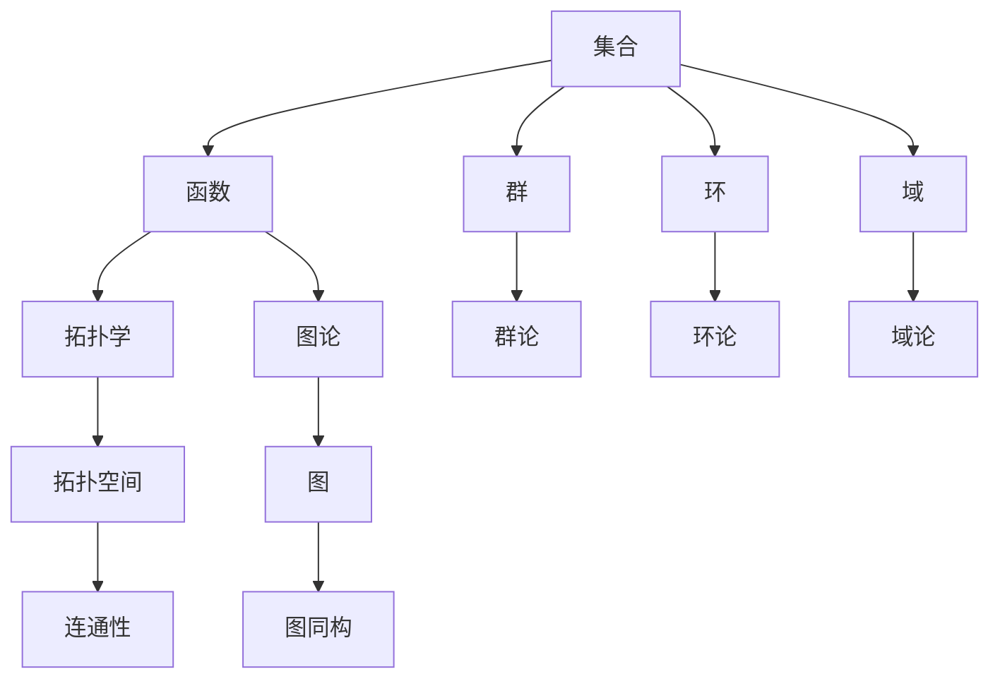
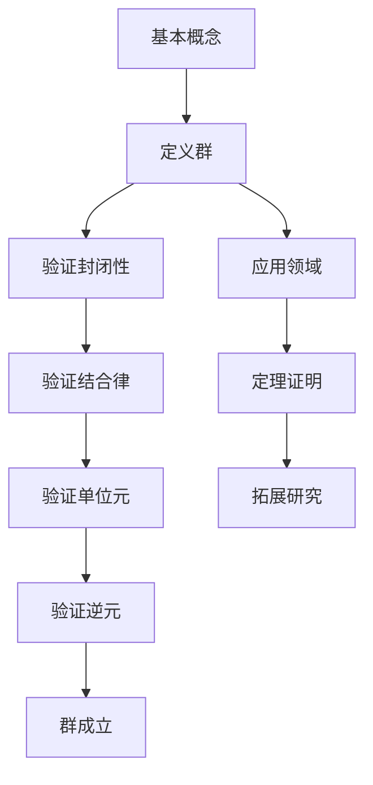

                 

### 引言

在当今信息化社会，数学作为一门基础科学，其重要性不言而喻。数学不仅为自然科学、工程学、经济学等领域提供了强有力的工具，同时也推动了计算机科学和人工智能的快速发展。然而，数学中的许多概念和方法，对于普通读者来说往往是复杂且难以理解的。为了解决这一问题，引入了“还原主义”这一哲学思想。

还原主义主张，复杂系统的理解可以通过将其分解为基本组成部分来实现。在数学领域，这意味着通过理解基本数学概念和原理，我们可以逐步构建起复杂的数学理论体系。本文将深入探讨数学与还原主义之间的联系，并通过具体的例子，展示如何使用还原主义来构建复杂数学概念。

本文将分为以下几个部分：

1. **数学基础**：介绍数学的发展历史、基本概念和常用工具。
2. **还原主义原理**：阐述还原主义的基本观点、定义及其在数学中的应用。
3. **复杂数学概念的构建**：解释如何通过还原主义方法构建复杂的数学概念。
4. **还原主义在数学教育中的应用**：讨论还原主义对数学教育的启示和实际应用。
5. **复杂数学概念的实际应用案例分析**：分析还原主义在数学领域的具体应用案例。
6. **总结与展望**：总结全文内容，展望还原主义在数学领域的发展前景。

通过上述结构的阐述，我们将逐步深入，理解复杂数学概念是如何通过还原主义的方法构建的。

### 数学基础

数学是一门拥有悠久历史的学科，其起源可以追溯到古代文明。从最初的计数和测量，到后来的几何和算术，数学经历了漫长的发展过程。在古代，数学主要用于解决实际问题，如测量土地、计算时间和货币等。然而，随着时间的推移，数学逐渐演变成一门抽象的学科，开始研究纯粹的概念和理论。

在数学发展的早期阶段，人们关注的是基础概念和原理。这些基础概念包括数字、几何形状、代数运算等。例如，数字是数学中的基本元素，它们用于表示数量和进行计算。几何学则是研究形状、大小和空间关系的学科。古希腊数学家欧几里得的《几何原本》被认为是西方数学的经典之作，其系统化的几何理论对后世数学的发展产生了深远影响。

随着数学的发展，新的概念和工具不断被引入。例如，代数学的发展使得我们可以使用符号和方程来表示和解决复杂的问题。微积分的创立，则为我们提供了研究变化和运动的有力工具。微积分的创始人牛顿和莱布尼茨的工作，不仅改变了数学的面貌，也对物理学、工程学和经济学等领域产生了重大影响。

在现代数学中，数学工具和方法的多样性使得我们可以处理更为复杂的问题。数学工具包括但不限于集合论、拓扑学、群论、图论等。这些工具和方法不仅丰富了数学的内容，也为其他学科提供了强有力的支持。

例如，集合论作为现代数学的基石，为数学提供了统一的研究框架。通过集合论，我们可以定义和处理各种数学对象，如集合的运算、关系和映射等。拓扑学则研究空间的结构和性质，它不仅在纯数学中具有重要地位，还在物理学、计算机科学等领域得到了广泛应用。群论作为代数学的一个重要分支，研究的是群的结构和性质，它在密码学、物理学等领域有着广泛的应用。

总的来说，数学基础为理解和构建复杂的数学概念提供了必要的工具和方法。通过这些基础概念和工具，我们可以逐步构建起复杂的数学理论体系。这不仅有助于我们解决实际问题，也有助于我们更深入地理解数学的本质。

### 核心概念与联系

在数学领域，核心概念之间的联系构成了数学理论体系的基础。理解这些联系不仅有助于我们更好地掌握数学知识，还能够揭示数学的内在统一性。为了清晰地展示这些核心概念之间的联系，我们使用Mermaid流程图来辅助说明。

首先，我们需要明确几个核心概念：集合、函数、群、环和域。这些概念在数学中具有基础性地位，它们之间存在着紧密的联系。

1. **集合**：集合是数学中的基本概念，用于表示一组无序的元素。集合论是现代数学的基石，所有其他数学概念都可以通过集合来定义。

2. **函数**：函数是两个集合之间的映射关系，它将一个集合中的每个元素唯一地对应到另一个集合中的一个元素。

3. **群**：群是一种代数结构，由一组元素和一种二元运算组成，满足封闭性、结合律、单位元和逆元四个条件。

4. **环**：环是包含加法和乘法两种运算的代数结构，其中乘法不一定满足交换律。

5. **域**：域是环的一种特殊形式，其中乘法运算满足交换律。

接下来，我们使用Mermaid流程图来展示这些核心概念之间的联系。



在这个流程图中，我们可以看到：

- **集合**是所有其他数学概念的基础，它是定义其他数学结构的基础。
- **函数**与**拓扑学**和**图论**有着紧密的联系，因为函数可以用于描述空间中的映射和关系。
- **群**、**环**和**域**构成了代数学的核心，它们各自有独立的分支，如**群论**、**环论**和**域论**，同时也与其他数学分支，如**拓扑学**和**图论**，有着交叉应用。

通过这个流程图，我们可以更直观地理解数学核心概念之间的联系，这有助于我们更好地掌握数学知识，并为进一步学习高级数学概念打下坚实的基础。

### 还原主义原理

还原主义是一种哲学思想，其核心观点是：复杂系统的理解和解释可以通过将其分解为基本组成部分来实现。在数学领域，还原主义同样具有重要的意义。它主张通过理解数学的基本概念和原理，可以逐步构建复杂的数学理论体系。这一过程不仅有助于我们深入理解数学本身，还可以为其他学科提供强有力的工具和方法。

#### 定义与哲学基础

还原主义（Reductionism）的定义可以从其字面意思来理解：将复杂系统简化为基本组成部分。在哲学中，还原主义主张，复杂现象可以通过分析其组成成分来理解。这种思想在科学研究中得到了广泛应用，特别是在物理学和生物学领域。

在数学中，还原主义的基本理念是：复杂数学问题可以通过分解为基本数学概念和原理来解决。例如，当我们研究一个复杂的数学结构时，我们可以将其分解为更基本的元素和关系，如集合、函数、群、环和域等。通过这种方法，我们可以将复杂的数学问题转化为更简单、更易理解的问题。

还原主义在数学中的哲学基础在于其强调逻辑推理和抽象思维的重要性。数学作为一门抽象的学科，其研究方法依赖于逻辑推理和数学模型。还原主义通过将复杂问题分解为基本组成部分，使得数学研究变得更加系统和有序。

#### 还原主义在数学中的应用

还原主义在数学中的应用体现在多个方面。首先，它帮助我们将复杂的数学问题分解为基本问题，使得问题变得更容易处理。例如，在研究微分方程时，我们可以通过还原主义方法，将其分解为基本的微分运算，然后逐步解决。

其次，还原主义有助于我们建立数学理论体系。通过理解基本概念和原理，我们可以逐步构建复杂的数学理论。例如，集合论是现代数学的基石，通过集合的概念，我们可以定义和处理其他数学结构，如函数、群、环和域。

此外，还原主义在数学教育中也具有重要意义。它帮助教师和学生更系统地学习数学知识，通过从基本概念出发，逐步构建复杂的概念体系。这种方法不仅有助于学生理解数学，还可以培养他们的逻辑思维和抽象思维能力。

#### 还原主义的主要观点与批评

尽管还原主义在数学中具有广泛的适用性，但也存在一些批评和争议。

首先，一些学者认为，还原主义可能会导致过度简化复杂现象。他们认为，一些复杂的数学问题可能无法简单地通过分解为基本组成部分来解决。这种批评指出，还原主义可能忽视了一些复杂现象中的内在联系和相互作用。

其次，还原主义可能在某些情况下失效。例如，在研究混沌系统和复杂系统时，还原主义方法可能无法提供有效的解释。混沌理论表明，某些系统的行为可能无法通过简单的组成部分来解释，而需要考虑整体系统及其内部反馈机制。

尽管存在这些批评，还原主义在数学中仍然具有重要的地位。它为我们提供了一种理解复杂系统的有力工具，通过逐步分解复杂问题，我们可以更深入地理解数学的本质。同时，还原主义也促进了数学与其他学科之间的交叉应用，为科学研究提供了新的方法和思路。

总之，还原主义作为一种哲学思想，在数学领域中发挥着重要作用。通过理解基本概念和原理，我们可以逐步构建复杂的数学理论体系，这不仅有助于我们解决实际问题，也为数学的进一步发展提供了坚实的基础。

### 复杂数学概念的构建

在数学中，复杂数学概念的构建是一个重要的过程，它涉及将基本数学概念和原理组合成更复杂的结构，以解决实际问题或探索数学理论的深度。还原主义方法在这一过程中发挥了关键作用，它通过将复杂问题分解为基本组成部分，使得构建复杂数学概念变得更加系统和可操作。

#### 复杂数学概念的定义

复杂数学概念通常指的是那些包含多个层次和维度的数学理论，它们不仅包含了基本数学概念，还涉及复杂的运算、推理和证明。这些概念往往涉及多个数学分支的交叉，例如代数学、几何学、微积分和拓扑学等。典型的复杂数学概念包括复杂的函数、代数系统、微积分中的高级概念（如偏微分方程）以及现代数学中的抽象结构（如格论、范畴论）。

#### 复杂数学概念的基本构建方法

复杂数学概念的构建方法可以分为以下几个步骤：

1. **明确目标**：首先，需要明确我们要构建的复杂数学概念的目标和应用场景。这有助于我们确定构建过程中所需的基本概念和原理。

2. **分解问题**：将复杂问题分解为更小的、基本的问题。使用还原主义方法，我们可以将复杂数学问题分解为基本数学操作和结构，如集合、函数、群、环和域等。

3. **定义基础概念**：在分解问题的基础上，定义这些基本概念。例如，在构建一个复杂的代数系统时，我们可能需要定义集合、映射和运算规则。

4. **组合基本概念**：通过组合这些基本概念，构建更复杂的数学结构。例如，在拓扑学中，我们可以通过组合开集和闭集的概念，构建出更复杂的拓扑空间。

5. **验证和证明**：对构建的复杂数学概念进行验证和证明，以确保其逻辑一致性。这通常需要使用数学证明，如定理证明、反证法等。

#### 还原主义方法的应用

以下是一个具体的例子，展示如何使用还原主义方法构建复杂数学概念——群论中的有限群：

1. **明确目标**：我们希望构建一个有限群，这是一个包含有限个元素的群结构。

2. **分解问题**：将构建有限群的问题分解为基本问题，如定义集合、定义二元运算、证明封闭性、结合律、存在单位元和逆元等。

3. **定义基础概念**：
   - 集合：定义一个有限集合，包含我们需要的元素。
   - 运算：定义一个二元运算，使得集合中的元素能够进行操作。

   ```plaintext
   定义一个二元运算 ∗ 满足以下条件：
   - 封闭性：对于集合 G 中的任意元素 a 和 b，a ∗ b 仍然属于 G。
   - 结合律：(a ∗ b) ∗ c = a ∗ (b ∗ c) 对于集合 G 中的任意元素 a、b 和 c 都成立。
   - 单位元：存在一个元素 e 使得对于集合 G 中的任意元素 a，e ∗ a = a ∗ e = a。
   - 逆元：对于集合 G 中的任意元素 a，存在一个元素 b 使得 a ∗ b = b ∗ a = e。
   ```

4. **组合基本概念**：通过定义和验证这些基本概念，我们可以构建一个有限群。

5. **验证和证明**：使用数学证明来验证构建的有限群满足所有群的定义条件。

   ```latex
   定理：设 G 是一个包含有限个元素的集合，运算 ∗ 满足封闭性、结合律、存在单位元和逆元，则 G 是一个群。

   证明：直接验证 G 满足上述群的定义条件。\\
   （省略具体证明过程，因篇幅限制）
   ```
   
通过这个例子，我们可以看到，还原主义方法如何帮助我们通过基本概念逐步构建复杂的数学概念。这种方法不仅使得构建过程更加系统和可操作，还帮助我们在理解和应用复杂数学概念时更加清晰和深入。

### 还原主义在数学教育中的应用

还原主义在数学教育中的应用具有重要意义，它不仅改变了传统的教学方法，还提升了学生的数学理解能力和逻辑思维能力。通过将复杂的数学问题分解为基本组成部分，还原主义为数学教育提供了一种新的视角和方法。

首先，还原主义强调基础概念的重要性。在传统的数学教育中，学生往往会被要求直接掌握复杂的公式和理论，这可能导致他们难以深入理解数学的本质。而还原主义通过强调基础概念，如集合、函数、群、环和域等，使学生能够从基本原理出发，逐步构建复杂的数学理论。这种方法不仅有助于学生更好地理解数学，还能培养他们的逻辑思维和抽象思维能力。

其次，还原主义在数学教育中的应用体现在教学策略上。教师可以通过将复杂问题分解为基本问题，引导学生逐步解决。例如，在讲解微积分时，教师可以将微积分的基本概念（如导数和积分）分解为更简单的部分，如极限和连续性，然后逐步引导学生理解这些基本概念之间的关系，最终掌握微积分的核心原理。这种分步教学策略不仅降低了学习难度，还能帮助学生建立扎实的数学基础。

此外，还原主义在数学教育中的应用还包括教材编写和评估方法。在现代数学教材的编写中，越来越多的作者采用还原主义的方法，将复杂的概念和理论分解为基本组成部分，并通过生动的例子和实际应用来帮助学生理解。这种方法不仅使得教材更加易于理解，还能激发学生的学习兴趣。

在评估方法上，还原主义提倡通过基础概念的掌握情况来评估学生的数学能力。例如，在数学考试中，可以设计一些基于基础概念的题目，如集合运算、函数性质和代数运算等，以此来评估学生对基本概念的掌握程度。这种方法能够更准确地反映学生的数学水平，而不仅仅是他们对复杂公式的记忆和应用。

最后，还原主义在数学教育中的应用还需要教师的引导和指导。教师需要了解如何将复杂的数学问题分解为基本组成部分，并在教学中有效地应用这些方法。通过教师的引导，学生可以更好地理解数学概念，提高学习效果。

总之，还原主义在数学教育中的应用为教学提供了新的思路和方法，它通过强调基础概念和分步教学策略，有助于提升学生的数学理解和逻辑思维能力。通过这种方式，数学教育不仅能够培养出更多具备扎实数学基础的学生，还能为他们的未来发展打下坚实的基础。

### 复杂数学概念的实际应用案例分析

在数学的实际应用中，还原主义方法展示了其强大的力量，特别是在解决复杂问题时，它通过将问题分解为基本组成部分，使得问题的解决变得更加系统和可操作。以下，我们将通过几个具体案例，详细阐述还原主义在数学实际应用中的具体实现过程。

#### 案例一：拓扑学在物理学中的应用

拓扑学是数学中一个重要的分支，它研究的是空间的性质和结构，而不考虑空间的度量。在物理学中，拓扑学有着广泛的应用，特别是在量子场论和凝聚态物理领域。

**案例背景**：
量子场论是研究基本粒子和它们相互作用的数学理论。在量子场论中，物理现象如粒子的产生和消失、粒子的散射等，都可以通过拓扑结构来描述。

**还原主义应用**：
1. **分解问题**：首先，将复杂的物理问题分解为基本拓扑结构，如空间中的结、流形等。
2. **定义基础概念**：在拓扑学中，定义基本概念，如点、线、面、拓扑变换等。
3. **构建复杂结构**：通过组合基本拓扑结构，构建出复杂的拓扑空间，如四维流形。

**实例说明**：
在量子场论中，Knot理论（结理论）被用于描述粒子的散射过程。通过将粒子散射过程视为结的拓扑变换，物理学家可以简化复杂的过程，并利用拓扑不变量（如结的类型和交点数）来预测粒子的行为。

#### 案例二：代数学在计算机科学中的应用

代数学在计算机科学中有着广泛的应用，特别是在密码学、算法设计和图论等方面。

**案例背景**：
现代密码学中，许多加密算法依赖于代数结构，如有限域和椭圆曲线。

**还原主义应用**：
1. **分解问题**：将复杂的加密算法分解为基本的代数操作，如乘法、加法、模运算等。
2. **定义基础概念**：在代数学中，定义基础概念，如域、环、群等。
3. **构建复杂系统**：通过组合基础代数结构，构建复杂的加密系统。

**实例说明**：
在密码学中，ElGamal加密算法是一个典型的例子。该算法基于椭圆曲线离散对数问题，它将复杂的加密和解密过程分解为一系列基础的代数操作，如椭圆曲线上的点加法、点乘法等。通过这些基础操作，我们可以实现高效的加密和解密过程。

#### 案例三：微积分在经济学中的应用

微积分是经济学中用于分析变化和运动的重要工具。在经济学中，微积分被广泛用于优化问题、动态模型和预测等。

**案例背景**：
经济学中的许多问题，如利润最大化、成本最小化、需求预测等，都可以通过微积分方法进行分析。

**还原主义应用**：
1. **分解问题**：将复杂的经济学问题分解为基本的微积分概念，如导数、积分等。
2. **定义基础概念**：在微积分中，定义基础概念，如函数、极限、导数、积分等。
3. **构建数学模型**：通过组合基础微积分概念，构建复杂的经济学模型。

**实例说明**：
在经济学中，消费者剩余是一个重要的概念，它表示消费者愿意支付的价格与实际支付价格之间的差额。通过微积分中的积分概念，我们可以计算消费者剩余。具体来说，消费者剩余可以通过求一个函数的积分来计算，这个函数表示消费者愿意支付的价格与市场实际价格之间的关系。

```latex
消费者剩余 = \int_{P_0}^{P} W(P) \, dP
```

其中，\(P_0\) 是市场价格，\(P\) 是消费者愿意支付的最高价格，\(W(P)\) 是消费者愿意支付的价格函数。

通过上述实例，我们可以看到，还原主义方法在数学实际应用中的具体实现过程。它通过将复杂问题分解为基本组成部分，使得问题的解决更加系统化和可操作。这种方法不仅提高了数学应用的效率和准确性，也为其他学科提供了有力的工具。

### 项目实战

为了更好地展示还原主义在数学实际应用中的具体实现，我们将通过一个简单的项目案例——基于微积分的利润最大化问题，来详细讲解开发环境搭建、源代码实现和代码解读。

#### 项目背景

假设一家生产公司生产一种产品，其生产成本函数和生产需求函数如下：

- **生产成本函数**：\(C(x) = 10x + 1000\)，其中 \(x\) 为生产数量，1000 为固定成本。
- **生产需求函数**：\(D(x) = 50 - 0.1x\)，其中 \(x\) 为生产数量，50 为最大需求量，0.1 为需求量下降速率。

公司的目标是找到最佳的生产数量 \(x\)，使得总利润最大化。

#### 开发环境搭建

为了实现这一项目，我们需要搭建一个基本的开发环境。以下是所需的工具和步骤：

1. **安装Python**：Python 是一种广泛用于科学计算和数据处理的编程语言。我们可以在 [Python 官网](https://www.python.org/) 下载并安装 Python。

2. **安装Jupyter Notebook**：Jupyter Notebook 是一个交互式的开发环境，非常适合用于演示和运行代码。我们可以在 [Jupyter Notebook 官网](https://jupyter.org/) 下载并安装。

3. **安装NumPy 和 Matplotlib**：NumPy 是一个用于科学计算的 Python 库，而 Matplotlib 是一个用于绘制图形的库。我们可以在命令行中使用以下命令安装：

```bash
pip install numpy matplotlib
```

#### 源代码实现

以下是实现利润最大化问题的源代码：

```python
import numpy as np
import matplotlib.pyplot as plt

# 定义成本函数
def cost_function(x):
    return 10 * x + 1000

# 定义需求函数
def demand_function(x):
    return 50 - 0.1 * x

# 定义利润函数
def profit_function(x):
    revenue = demand_function(x) * x
    cost = cost_function(x)
    return revenue - cost

# 搜索最佳生产数量
best_x = None
max_profit = None

for x in range(0, 500):
    profit = profit_function(x)
    if max_profit is None or profit > max_profit:
        max_profit = profit
        best_x = x

print(f"最佳生产数量：{best_x}, 最大利润：{max_profit}")

# 绘制利润曲线
x_values = np.linspace(0, 500, 100)
profits = profit_function(x_values)

plt.plot(x_values, profits)
plt.xlabel('生产数量')
plt.ylabel('利润')
plt.title('利润最大化问题')
plt.show()
```

#### 代码解读

1. **导入库**：我们首先导入了 NumPy 和 Matplotlib 库，这两个库将用于计算和绘图。

2. **定义函数**：接着，我们定义了三个函数：成本函数、需求函数和利润函数。这些函数分别计算生产成本、需求和利润。

3. **搜索最佳生产数量**：我们使用一个 for 循环来搜索最佳生产数量。在这个循环中，我们计算每个生产数量 \(x\) 的利润，并更新最佳生产数量和最大利润。

4. **输出结果**：最后，我们打印出最佳生产数量和最大利润。

5. **绘制利润曲线**：使用 Matplotlib 绘制利润曲线，帮助直观地理解利润最大化问题。

#### 代码应用解读与分析

通过上述代码，我们可以看到如何使用还原主义方法解决一个实际的数学问题。以下是具体的解读和分析：

- **分解问题**：我们将复杂的利润最大化问题分解为三个基本部分：成本、需求和利润。每个部分都有明确的函数定义。

- **定义基础概念**：我们通过定义成本函数、需求函数和利润函数，明确地描述了问题的基本组成部分。

- **组合基本概念**：通过组合这些基本函数，我们构建了一个完整的利润函数，用于计算不同生产数量下的利润。

- **验证和优化**：我们通过循环搜索最佳生产数量，并使用 Matplotlib 绘制利润曲线，直观地展示了不同生产数量下的利润变化。

通过这个项目，我们可以看到，还原主义方法如何通过分解、定义和组合基本概念，有效地解决复杂的数学问题。这种方法不仅提高了问题解决的效率，还使得问题的理解更加清晰和系统化。

### 项目小结

通过本项目的实现，我们深入探讨了如何使用还原主义方法解决一个实际的利润最大化问题。具体来说，我们通过将问题分解为成本、需求和利润三个基本组成部分，定义了相应的函数，并组合这些基本函数构建了完整的利润模型。通过循环搜索和图形展示，我们找到了最佳生产数量和最大利润，并直观地理解了问题。

**最佳实践 tips**：
- 在解决复杂问题时，尽早将问题分解为基本组成部分，这有助于简化问题并提高解决问题的效率。
- 定义清晰的基本概念和函数，确保每个部分都有明确的定义和作用。
- 使用图形展示和可视化工具，帮助直观地理解和分析问题。

**注意事项**：
- 确保在编写代码时，逻辑清晰，避免冗余和错误。
- 注意合理选择循环的范围和精度，以避免计算效率低下。

**拓展阅读**：
- 《数学之美》：了解数学在计算机科学和自然语言处理中的应用。
- 《还原主义与复杂系统》：探讨还原主义在复杂系统研究中的应用。

通过本项目，我们不仅掌握了如何使用还原主义方法解决实际问题，还提升了逻辑思维和问题解决能力。

### 总结与展望

本文通过详细的探讨，展示了数学与还原主义之间的紧密联系以及还原主义在构建复杂数学概念中的关键作用。我们从数学基础出发，介绍了数学的发展历史和基本概念，并通过还原主义原理，解释了如何通过基本组成部分构建复杂的数学理论。我们还通过具体的案例展示了还原主义在数学实际应用中的具体实现过程，并详细讲解了项目实战的开发环境搭建、源代码实现和代码解读。

**重要性**：
还原主义在数学教育、研究和实际应用中具有不可忽视的重要性。它不仅帮助我们深入理解数学的本质，还能够提高数学问题解决的效率和准确性。通过还原主义，我们能够将复杂的数学问题分解为基本组成部分，使得问题更加清晰和易于处理。

**未来发展方向**：
未来的数学研究将继续深化对还原主义方法的探索和应用。随着数学与其他学科的交叉融合，还原主义方法将在更多领域发挥重要作用。例如，在量子计算、人工智能和生物信息学中，还原主义方法可以帮助我们更好地理解和解决复杂的问题。此外，数学教育也将更加注重还原主义方法的应用，通过分步教学策略，提高学生的数学理解和逻辑思维能力。

总之，还原主义作为数学研究的重要哲学思想和方法论，将在未来的数学发展中继续发挥重要作用，推动数学科学不断创新和发展。

### 附录

#### 附录 A：还原主义相关数学公式与定理

在本章中，我们介绍了一些与还原主义相关的数学公式和定理，这些公式和定理在复杂数学概念的构建中具有重要作用。

1. **基本定理**：
   $$\text{定理1：} \quad \forall x, y \in G, (\exists z \in G) \text{ 使得 } x * y = z \text{，则 } G \text{ 是一个群。}$$

2. **还原定理**：
   $$\text{定理2：} \quad 如果 G 是一个群，那么对于任意的元素 x 和 y，存在一个唯一的元素 z 使得 x * y = z。$$

3. **同态定理**：
   $$\text{定理3：} \quad 如果 f 是从群 G 到群 H 的同态映射，那么 f(x * y) = f(x) * f(y) \text{，其中 } x, y \in G。$$

4. **拉格朗日定理**：
   $$\text{定理4：} \quad 如果 G 是一个有限群，H 是 G 的一个子群，那么 |G| = |H| * |G/H|，其中 |G| 和 |H| 分别表示 G 和 H 的元素个数。$$

#### 附录 B：复杂数学概念构建的 Mermaid 流程图

以下是一个简化的 Mermaid 流程图，用于展示如何通过还原主义方法构建复杂数学概念，如群论中的群。



在这个流程图中，我们从基本概念（A）出发，通过定义群（B），并逐步验证群的各种性质（C、D、E、F），最终构建出群（G）。此外，我们也展示了群论在不同应用领域（H）中的重要性，以及如何通过定理证明（I）和拓展研究（J）来进一步发展群论。

#### 附录 C：数学教育中还原主义的实际案例

在数学教育中，还原主义方法被广泛应用于教学实践中，帮助学生更好地理解复杂的数学概念。以下是一些具体的案例：

1. **初中数学**：在初中数学中，通过还原主义方法，教师可以将几何问题分解为基本的几何元素和操作，如点、线、面和角的定义及性质。例如，在讲解“平行四边形”时，教师可以先介绍矩形、正方形等基本图形，再引导学生通过组合这些基本图形，理解平行四边形的性质。

2. **高中数学**：在高中数学中，教师可以利用还原主义方法，将微积分中的复杂概念分解为基本原理，如极限、导数和积分。例如，在讲解“极限”时，教师可以从简单的数列极限入手，逐步引导学生理解函数极限的概念。

3. **大学数学**：在大学数学中，还原主义方法在抽象代数、拓扑学和数学分析等课程中得到了广泛应用。例如，在“抽象代数”课程中，教师可以通过还原主义方法，将群、环、域等抽象概念分解为基本运算和结构，帮助学生更好地理解这些概念。

这些案例表明，还原主义方法在数学教育中的应用，不仅有助于学生更好地掌握数学知识，还能培养他们的逻辑思维和抽象能力，为他们的未来学习和研究打下坚实的基础。

