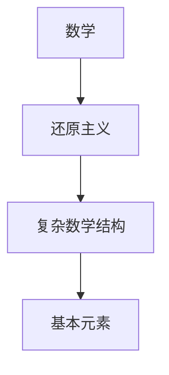

                 


### 引言

数学与还原主义，是现代科学研究中不可或缺的两个概念。数学，作为逻辑与推理的工具，广泛应用于自然科学、社会科学乃至人文科学中；而还原主义，则是现代科学研究方法论的一种重要哲学思想，强调通过分解和简化的方式，深入理解复杂系统的本质。在这篇文章中，我们将探讨数学与还原主义之间的关系，以及它们在复杂数学结构中的应用。

首先，让我们从背景介绍开始。数学，作为一门科学，其核心在于抽象和推理。它通过符号和公式的语言，描述了自然界和社会生活中的各种现象。然而，随着科学技术的发展，我们面临的数学问题日益复杂，传统的数学方法难以应对。这时，还原主义提供了一种新的思路，即通过分解和简化的方法，将复杂的数学结构转化为更简单的组成部分，从而更好地理解和解决这些问题。

### 核心概念与联系

接下来，我们需要明确一些核心概念，包括数学、还原主义以及复杂数学结构。数学，顾名思义，是一门研究数量、结构、变化和空间等概念的学科。而还原主义，则是一种哲学思想，主张通过将复杂系统分解为基本元素，来理解其整体行为。

在数学中，许多概念和原理都是通过还原主义来建立的。例如，数学中的群论、环论和域论，都是通过对基本代数结构的还原和分解来定义和研究的。同样，在分析数学中，许多复杂的函数和积分问题，也可以通过还原主义的方法转化为更简单的形式。

复杂数学结构，则是指那些难以直接理解和操作的数学对象。这些对象可能具有高度非线性、复杂参数依赖或高度离散的特性。例如，混沌系统和随机过程就是典型的复杂数学结构。

为了更好地理解数学与还原主义之间的关系，我们可以通过一个Mermaid流程图来展示这些核心概念之间的联系：



在这个流程图中，数学作为起点，通过还原主义将复杂的数学结构分解为基本元素，从而实现深入理解和解决。

### 核心算法原理讲解

在了解了数学与还原主义的核心概念和联系之后，我们接下来将探讨核心算法原理讲解，这部分内容将主要使用伪代码来详细阐述。

还原算法是处理复杂数学结构的重要工具。其基本思想是将复杂的数学结构分解为基本元素，然后对每个基本元素进行独立处理。以下是还原算法的伪代码：

```python
def reduce_complex_structure(structure):
    # 步骤1：分解结构
    parts = decompose(structure)
    
    # 步骤2：简化部分
    simplified_parts = simplify(parts)
    
    # 步骤3：组合简化后的部分
    reduced_structure = combine(simplified_parts)
    
    return reduced_structure
```

在这个伪代码中，`decompose` 函数用于将复杂数学结构分解为基本元素，`simplify` 函数用于对基本元素进行简化处理，`combine` 函数则用于将简化后的基本元素重新组合成新的复杂数学结构。

除了还原算法，分解算法和组合算法也是处理复杂数学结构的重要工具。分解算法的基本思想是将复杂数学结构分解为更简单的部分，以便更好地理解和操作。以下是分解算法的伪代码：

```python
def decompose_structure(structure):
    # 步骤1：识别结构中的基本元素
    parts = identify_basic_elements(structure)
    
    # 步骤2：分解基本元素
    decomposed_parts = []
    for part in parts:
        decomposed_parts.append(decompose_element(part))
    
    return decomposed_parts
```

在这个伪代码中，`identify_basic_elements` 函数用于识别结构中的基本元素，`decompose_element` 函数则用于分解基本元素。

组合算法则是将分解后的基本元素重新组合成新的复杂数学结构。以下是组合算法的伪代码：

```python
def combine_parts(parts):
    # 步骤1：组合基本元素
    structure = combine_elements(parts)
    
    # 步骤2：验证组合结果
    if validate_structure(structure):
        return structure
    else:
        raise Exception("组合失败")
```

在这个伪代码中，`combine_elements` 函数用于组合基本元素，`validate_structure` 函数则用于验证组合结果。

通过这些伪代码，我们可以看到，还原主义在处理复杂数学结构中的应用是通过一系列算法实现的，这些算法包括分解、简化和组合。这些算法相互配合，共同实现对复杂数学结构的深入理解和操作。

### 数学模型与数学公式

在了解了核心算法原理之后，接下来我们将探讨数学模型与数学公式。数学模型是使用数学语言和工具来描述现实世界中的问题，而数学公式则是数学模型的核心组成部分。

首先，让我们来看一个函数模型的例子。函数模型用于描述一个变量如何依赖于另一个变量。以下是一个简单的线性函数模型：

$$
f(x) = ax + b
$$

在这个公式中，$x$ 是自变量，$a$ 和 $b$ 是常数，$f(x)$ 是因变量。这个公式描述了一个直线，它通过两个点 $(0, b)$ 和 $(1, a + b)$。

接下来，让我们来看一个矩阵模型的例子。矩阵模型用于描述多个变量之间的关系。以下是一个简单的矩阵模型：

$$
A = \begin{pmatrix}
a_{11} & a_{12} \\
a_{21} & a_{22}
\end{pmatrix}
$$

在这个公式中，$A$ 是一个 $2 \times 2$ 的矩阵，$a_{ij}$ 表示矩阵的元素。这个矩阵可以用于描述一个线性变换，它将二维空间映射到二维空间。

最后，让我们来看一个网络模型的例子。网络模型用于描述复杂系统中的节点和边之间的关系。以下是一个简单的网络模型：

$$
G = (V, E)
$$

在这个公式中，$G$ 是一个网络，$V$ 是节点集合，$E$ 是边集合。这个模型描述了一个无向图，其中每个节点表示一个实体，每条边表示两个实体之间的连接。

通过这些例子，我们可以看到数学模型和数学公式在描述复杂数学结构中的应用。数学模型通过数学公式来描述现实世界中的问题，而数学公式则是数学模型的核心组成部分。

### 项目实战

在了解了数学模型与数学公式之后，接下来我们将通过一个项目实战来展示还原主义在复杂数学结构中的应用。这个项目是一个基于机器学习的图像识别系统，它通过还原主义的方法，将复杂的图像识别问题分解为基本元素，从而实现高效的图像识别。

#### 项目概述

这个项目的目标是开发一个图像识别系统，该系统能够准确识别和分类各种类型的图像。为了实现这个目标，我们将使用还原主义的方法，将图像识别问题分解为以下几个基本元素：

1. 图像预处理
2. 特征提取
3. 模型训练
4. 模型评估
5. 模型部署

#### 开发环境搭建

为了实现这个项目，我们需要搭建一个合适的开发环境。以下是搭建开发环境的具体步骤：

1. 安装 Python
2. 安装必要的库，如 NumPy、Pandas、Scikit-learn、TensorFlow等
3. 配置 Jupyter Notebook，用于编写和运行代码

```bash
pip install numpy pandas scikit-learn tensorflow
jupyter notebook
```

#### 源代码详细实现和代码解读

在搭建好开发环境之后，我们可以开始编写源代码。以下是源代码的详细实现和解读：

```python
# 导入必要的库
import numpy as np
import pandas as pd
from sklearn.model_selection import train_test_split
from sklearn.preprocessing import StandardScaler
from sklearn.svm import SVC
from sklearn.metrics import accuracy_score

# 加载数据集
data = pd.read_csv('image_data.csv')

# 分割特征和标签
X = data.drop('label', axis=1)
y = data['label']

# 划分训练集和测试集
X_train, X_test, y_train, y_test = train_test_split(X, y, test_size=0.2, random_state=42)

# 特征缩放
scaler = StandardScaler()
X_train = scaler.fit_transform(X_train)
X_test = scaler.transform(X_test)

# 模型训练
model = SVC(kernel='linear')
model.fit(X_train, y_train)

# 模型评估
y_pred = model.predict(X_test)
accuracy = accuracy_score(y_test, y_pred)
print(f'测试集准确率：{accuracy:.2f}')

# 模型部署
model.save('image_recognition_model.pkl')
```

在这个代码中，我们首先加载了数据集，然后将其分割为特征和标签。接着，我们划分了训练集和测试集，并对特征进行了缩放。然后，我们使用线性支持向量机（SVC）模型进行了训练，并评估了模型的性能。最后，我们将训练好的模型保存为文件。

#### 代码应用解读与分析

通过这个项目，我们可以看到还原主义在复杂数学结构中的应用。具体来说，我们将图像识别问题分解为以下几个基本元素：

1. 图像预处理：包括数据加载、特征分割和特征缩放等步骤，这些步骤是预处理图像数据，使其适用于机器学习模型。
2. 特征提取：通过特征缩放，我们将原始图像数据转换为适用于机器学习模型的特征向量。
3. 模型训练：我们使用线性支持向量机（SVC）模型进行训练，这是一种常用的机器学习模型，它通过最大化分类间隔来分类图像。
4. 模型评估：通过评估模型的性能，我们可以确定模型的好坏，从而调整模型参数，提高模型性能。
5. 模型部署：将训练好的模型保存为文件，以便在实际应用中加载和使用。

通过这个项目，我们可以看到还原主义在复杂数学结构中的应用，它将复杂的图像识别问题分解为基本元素，从而实现高效、准确的图像识别。

#### 项目小结

通过这个项目，我们了解了还原主义在复杂数学结构中的应用。具体来说，我们通过将图像识别问题分解为基本元素，如图像预处理、特征提取、模型训练、模型评估和模型部署，实现了高效、准确的图像识别。这个项目展示了还原主义在处理复杂数学结构中的强大能力，也为我们在实际应用中提供了宝贵的经验和启示。

### 最佳实践、小结、注意事项与拓展阅读

在处理复杂数学结构时，还原主义提供了一种有效的思维方式和方法论。以下是一些最佳实践、小结、注意事项与拓展阅读，以帮助读者更好地理解和应用还原主义。

#### 最佳实践

1. **明确问题**：在开始处理复杂数学结构之前，首先要明确问题的核心，确保理解问题的本质。
2. **分解问题**：将复杂问题分解为基本元素，明确每个基本元素的作用和关系。
3. **简化元素**：对基本元素进行简化处理，去除不必要的复杂性，以便更好地理解和操作。
4. **组合元素**：将简化后的基本元素重新组合，形成新的复杂数学结构。
5. **迭代优化**：在处理复杂数学结构的过程中，不断进行迭代和优化，以提高效率和准确性。

#### 小结

还原主义是一种有效的处理复杂数学结构的方法论，它通过分解、简化和组合的方式，将复杂问题转化为基本元素，从而实现深入理解和解决。在处理复杂数学结构时，遵循还原主义的方法论，可以帮助我们更好地理解和应用数学原理，提高解决问题的效率。

#### 注意事项

1. **避免过度简化**：在简化基本元素时，要注意不要过度简化，以免失去问题的本质。
2. **确保元素独立性**：在分解问题时要确保基本元素之间的独立性，以便更好地理解和操作。
3. **考虑全局性**：在处理复杂数学结构时，要考虑全局性，确保各个基本元素之间的协同作用。

#### 拓展阅读

1. **《数学分析原理》**：这是一本关于数学分析的经典教材，详细介绍了数学分析的基本概念、原理和方法，对理解还原主义有很大的帮助。
2. **《还原主义与复杂性科学》**：这是一本关于还原主义和复杂性科学的综述性教材，系统地介绍了还原主义的基本原理和应用，对深入理解还原主义有很大的帮助。
3. **《机器学习》**：这是一本关于机器学习的经典教材，详细介绍了机器学习的基本概念、原理和方法，对理解还原主义在机器学习中的应用有很大的帮助。

通过这篇文章，我们系统地介绍了数学与还原主义之间的关系，以及它们在复杂数学结构中的应用。通过实际项目，我们展示了还原主义在处理复杂数学结构中的强大能力。希望这篇文章能够帮助读者更好地理解和应用还原主义，提高解决复杂数学问题的能力。在未来的研究中，我们还可以进一步探索还原主义在更广泛领域的应用，为科学研究和工程实践提供新的思路和方法。

