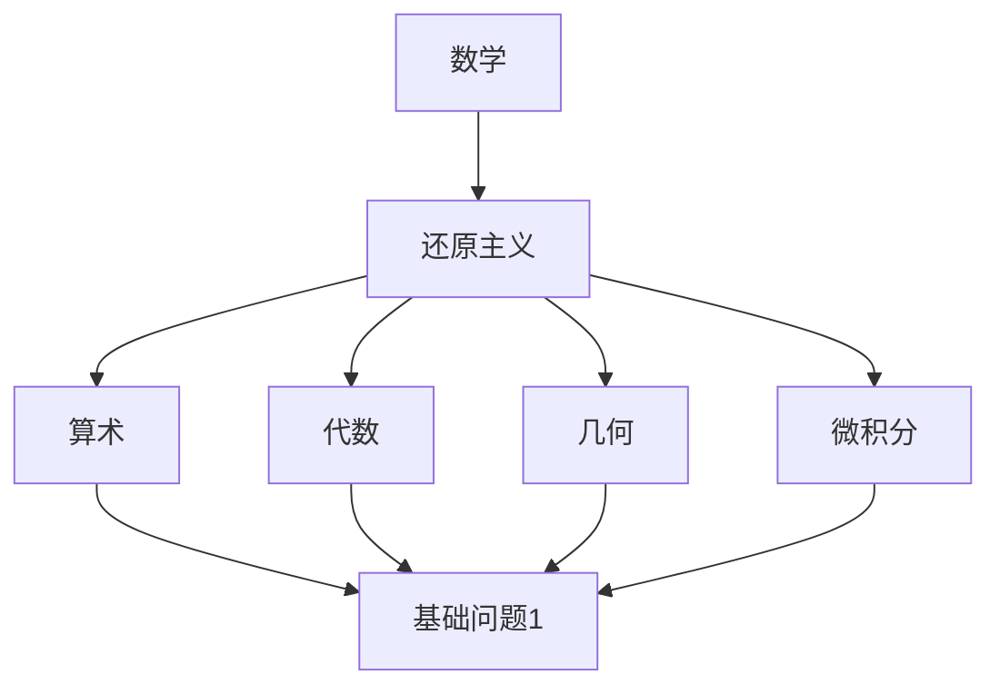
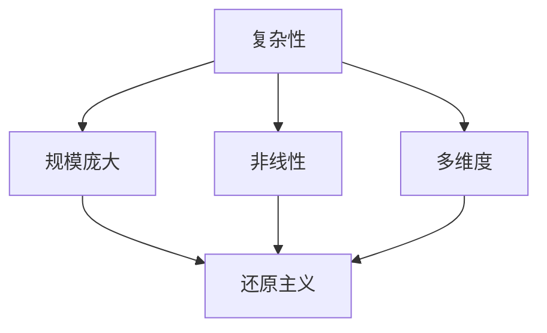
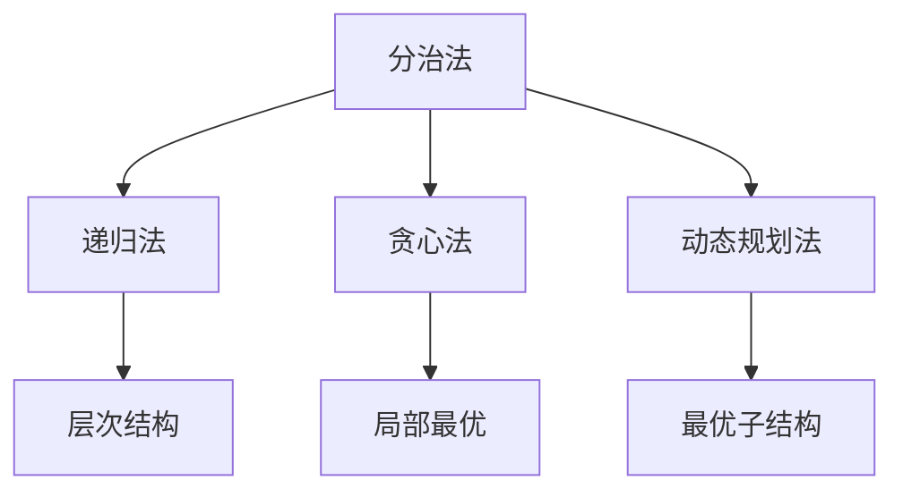
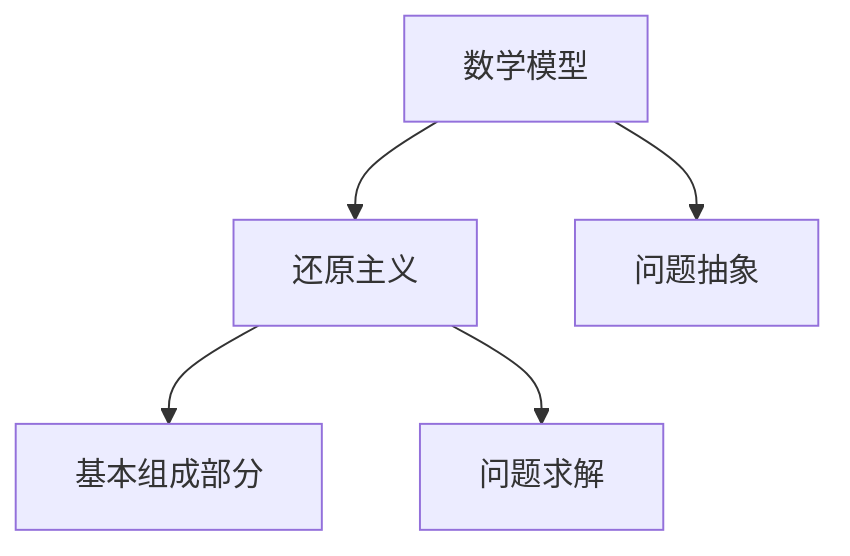
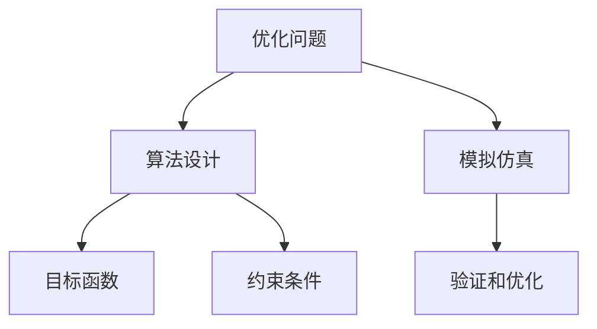
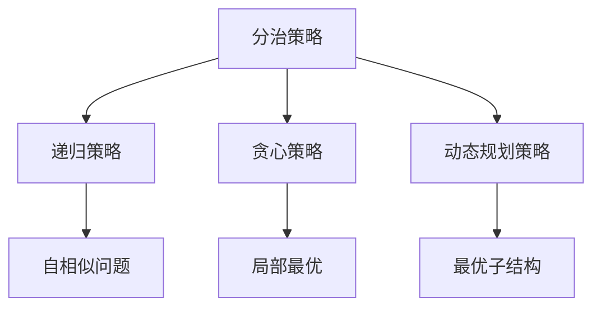
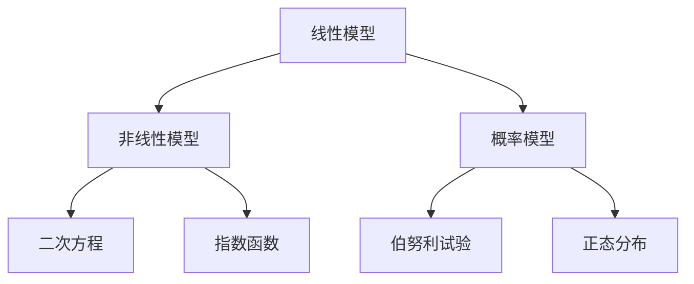
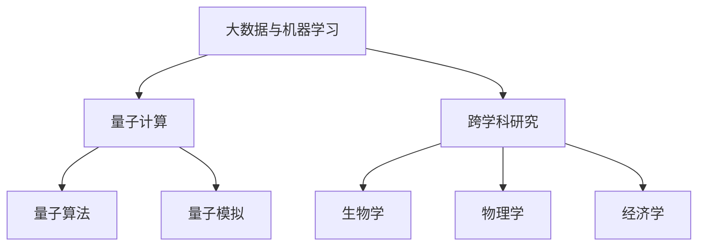
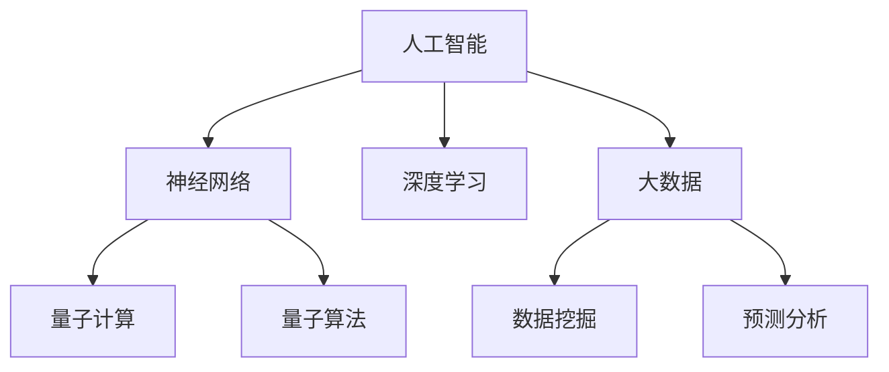

                 


### 文章标题：数学与还原主义：复杂数学问题的基本分解

> 关键词：数学，还原主义，复杂数学问题，基本分解，算法原理，数学模型，项目实战

> 摘要：本文深入探讨了数学与还原主义在解决复杂数学问题中的应用。通过基本分解方法，将复杂问题拆解为基本组成部分，结合核心算法原理和数学模型，提供了一系列的解决方案。文章最后通过实际项目案例，详细阐述了开发环境搭建、源代码实现、代码解读以及项目分析和总结，旨在帮助读者更好地理解数学与还原主义在实践中的应用。

### 引言

在当今这个信息爆炸的时代，复杂数学问题无处不在。从经济学中的优化问题，到计算机科学中的算法设计，再到物理学中的模拟仿真，复杂数学问题始终是我们面临的挑战。面对这些复杂问题，如何有效地分析和解决它们成为了一项至关重要的任务。

### 数学与还原主义的概念

#### 数学

数学是一种形式化的科学，它通过抽象的符号和结构来描述现实世界中的现象。数学不仅是一种工具，也是一种语言，用于表达复杂的逻辑关系和结构。从基础的算术、代数、几何，到高级的微积分、线性代数、概率论，数学为我们提供了一个强大的框架，帮助我们理解和解决问题。

#### 还原主义

还原主义是一种方法论，它主张通过将复杂问题分解为基本组成部分，从而理解和解决这些问题。在数学中，还原主义意味着将复杂问题转化为一系列简单的、可以处理的基本问题。这种方法论的关键在于找到这些基本组成部分之间的关系，并利用它们来重构复杂问题。

### 复杂数学问题的特点

复杂数学问题通常具有以下特点：

1. **规模庞大**：问题的数据规模巨大，难以用常规方法处理。
2. **非线性**：问题的解决方案可能涉及非线性关系，这使得直接求解变得困难。
3. **多维度**：问题可能涉及多个变量，这使得问题变得更加复杂。
4. **不稳定性**：问题可能受到外部环境的影响，导致结果不稳定。

### 基本分解方法

基本分解方法是将复杂问题拆解为基本组成部分的过程。以下是一些常见的基本分解方法：

1. **分治法**：将问题划分为较小的子问题，分别求解，再合并结果。
2. **递归法**：通过递归调用自身，将问题分解为更小的子问题。
3. **贪心法**：通过选择当前最优解，逐步构建最终解。
4. **动态规划法**：通过保存子问题的解，避免重复计算。

### 数学模型与还原主义

数学模型是将现实世界中的问题抽象为数学形式的过程。通过数学模型，我们可以将复杂问题转化为数学问题，从而利用数学方法进行求解。

还原主义在数学模型中的应用主要体现在以下几个方面：

1. **抽象与简化**：通过简化问题的复杂度，将问题转化为基本组成部分。
2. **关系构建**：通过构建基本组成部分之间的关系，重构复杂问题。
3. **数学方法应用**：利用数学方法，如微积分、线性代数、概率论等，求解数学模型。

### 核心算法原理讲解

核心算法原理讲解部分将详细阐述解决复杂数学问题的核心算法原理。为了更好地理解，我们将使用伪代码来描述这些算法。

#### 示例：分治法

```pseudo
function divideAndConquer(problem):
    if problem is small enough:
        return solve(problem)
    else:
        divide problem into subproblems
        solve each subproblem recursively
        combine solutions of subproblems
        return combined solution
```

#### 示例：动态规划法

```pseudo
function dynamicProgramming(problem):
    initialize dp array
    for each subproblem:
        solve subproblem using dp array
    return solution of original problem
```

### 数学模型与公式解析

数学模型与公式解析部分将详细讲解复杂数学问题中常用的数学公式。以下是一些常见的数学公式：

#### 示例：线性方程组求解

$$
\begin{cases}
a_{11}x + a_{12}y = b_{1} \\
a_{21}x + a_{22}y = b_{2}
\end{cases}
$$

#### 示例：概率计算

$$
P(A \cap B) = P(A) \times P(B|A)
$$

### 项目实战

项目实战部分将介绍一个实际项目，包括开发环境搭建、源代码实现、代码解读以及项目分析和总结。

#### 开发环境搭建

首先，我们需要搭建一个适合项目开发的编程环境。以Python为例，我们可以使用以下步骤：

1. 安装Python 3.8及以上版本。
2. 安装必要的Python库，如NumPy、Pandas、Scikit-learn等。

#### 源代码实现

以下是一个简单的线性方程组求解的Python代码示例：

```python
import numpy as np

def solve_linear_equation(A, b):
    x = np.linalg.solve(A, b)
    return x

# 示例数据
A = np.array([[1, 2], [2, 1]])
b = np.array([3, 4])

# 求解方程组
x = solve_linear_equation(A, b)
print("解为：", x)
```

#### 代码解读

在上面的代码中，我们首先导入了NumPy库，它提供了高效的线性代数运算。然后，我们定义了一个函数`solve_linear_equation`，它接受两个参数：线性方程组的系数矩阵`A`和常数向量`b`。函数使用`np.linalg.solve`方法求解方程组，并返回解向量。

#### 项目分析

通过这个项目，我们了解了如何使用Python和NumPy库解决线性方程组。在实际应用中，线性方程组可能涉及到更大的规模和数据集，这时我们可以使用更高效的算法，如高斯消元法或迭代法。

#### 项目总结

通过本项目，我们不仅学习了如何使用Python和NumPy库解决线性方程组，还了解了项目开发的基本流程，包括环境搭建、代码实现和解读。这些技能将帮助我们更好地解决实际的复杂数学问题。

### 最佳实践 tips

1. **理解问题背景**：在解决复杂数学问题之前，首先要理解问题的背景和需求，这有助于我们选择合适的算法和数学模型。
2. **合理选择算法**：根据问题的特点，选择合适的算法，如分治法、动态规划法或贪心法。
3. **代码优化**：在实现代码时，注意代码的可读性和可维护性，同时进行性能优化。
4. **团队合作**：在解决复杂数学问题时，团队合作尤为重要。通过团队合作，我们可以相互学习、交流，提高解决问题的效率。

### 小结

本文通过数学与还原主义的角度，深入探讨了复杂数学问题的基本分解方法。我们介绍了数学与还原主义的概念，以及它们在解决复杂数学问题中的应用。通过核心算法原理讲解和数学模型与公式解析，我们提供了一系列的解决方案。最后，通过实际项目案例，我们详细阐述了开发环境搭建、源代码实现、代码解读以及项目分析和总结。希望本文能帮助读者更好地理解数学与还原主义在实践中的应用。

### 拓展阅读

1. 《算法导论》（Introduction to Algorithms） - Thomas H. Cormen, Charles E. Leiserson, Ronald L. Rivest, Clifford Stein
2. 《数学建模方法及其应用》 - 谢金星
3. 《还原主义方法论》 - 维基百科（英语）

作者：AI天才研究院/AI Genius Institute & 禅与计算机程序设计艺术 /Zen And The Art of Computer Programming 

### 第一部分：基础概念与原理

#### 第1章：数学与还原主义概述

**背景介绍**：

数学作为一种科学工具，自古以来就在人类文明中扮演着至关重要的角色。它不仅为科学研究提供了坚实的理论基础，还在工程、经济、计算机科学等多个领域发挥了重要作用。还原主义，作为一种哲学和方法论，主张将复杂问题分解为基本组成部分，从而更好地理解问题的本质和解决方法。

在处理复杂数学问题时，数学与还原主义相辅相成。数学提供了描述和解决问题的工具，而还原主义则提供了一种方法论，帮助我们系统地解决复杂问题。

**核心概念与联系**：

- **数学**：是一门研究数量、结构、变化和空间等概念的学科。它包括算术、代数、几何、微积分等多个分支。
- **还原主义**：是一种方法论，主张通过分解复杂问题，将其转化为基本组成部分，从而理解问题的本质。

**Mermaid 流程图**：



**核心概念之间的关系**：

数学作为一门学科，为还原主义提供了基础工具和方法。还原主义则利用数学的概念和工具，将复杂问题分解为基本组成部分，从而更有效地解决这些问题。

#### 第2章：复杂数学问题的特点

**背景介绍**：

复杂数学问题在现实世界中无处不在。它们可能源于科学、工程、经济学等领域，具有数据规模庞大、非线性、多维度等特点。解决这些问题不仅需要扎实的数学基础，还需要高效的算法和优化方法。

**核心概念与联系**：

- **复杂性**：复杂数学问题通常具有规模庞大、非线性、多维度等特点，这使得直接求解变得困难。
- **还原主义**：通过将复杂问题分解为基本组成部分，降低问题的复杂度，从而更容易解决。

**核心概念之间的关系**：

复杂性是复杂数学问题的核心特点，它决定了问题的求解难度。还原主义作为一种方法论，可以帮助我们应对这种复杂性，通过分解问题，降低求解难度。

**Mermaid 流程图**：



**核心概念之间的关系**：

复杂性是复杂数学问题的核心特点，它决定了问题的求解难度。还原主义作为一种方法论，可以帮助我们应对这种复杂性，通过分解问题，降低求解难度。

#### 第3章：基本分解方法

**背景介绍**：

基本分解方法是将复杂问题拆解为基本组成部分的过程。这种方法可以帮助我们更好地理解问题的本质，从而找到更有效的解决方法。在处理复杂数学问题时，基本分解方法具有重要作用。

**核心概念与联系**：

- **分治法**：将问题划分为较小的子问题，分别求解，再合并结果。
- **递归法**：通过递归调用自身，将问题分解为更小的子问题。
- **贪心法**：通过选择当前最优解，逐步构建最终解。
- **动态规划法**：通过保存子问题的解，避免重复计算。

**核心概念之间的关系**：

这些基本分解方法各有特点，适用于不同类型的问题。分治法和递归法适用于层次结构明显的问题，贪心法适用于局部最优问题，动态规划法适用于最优子结构问题。

**Mermaid 流程图**：



**核心概念之间的关系**：

这些基本分解方法各有特点，适用于不同类型的问题。分治法和递归法适用于层次结构明显的问题，贪心法适用于局部最优问题，动态规划法适用于最优子结构问题。

#### 第4章：数学模型与还原主义

**背景介绍**：

数学模型是现实世界问题的抽象表示，它通过数学语言和工具来描述问题。还原主义则提供了一种方法论，通过将复杂问题分解为基本组成部分，从而更好地理解和解决这些问题。

在处理复杂数学问题时，数学模型与还原主义相辅相成。数学模型为还原主义提供了具体的问题描述，而还原主义则为数学模型提供了求解的方法。

**核心概念与联系**：

- **数学模型**：将现实世界问题抽象为数学形式，用于描述和分析问题。
- **还原主义**：通过分解复杂问题，将其转化为基本组成部分，从而理解问题的本质。

**核心概念之间的关系**：

数学模型为还原主义提供了具体的问题描述，还原主义则为数学模型提供了求解的方法。通过将复杂问题转化为基本组成部分，我们可以更有效地分析和解决这些问题。

**Mermaid 流程图**：



**核心概念之间的关系**：

数学模型为还原主义提供了具体的问题描述，还原主义则为数学模型提供了求解的方法。通过将复杂问题转化为基本组成部分，我们可以更有效地分析和解决这些问题。

### 第二部分：核心算法与实现

#### 第5章：核心算法原理讲解

**核心算法原理讲解**：

核心算法原理讲解部分将详细阐述解决复杂数学问题的核心算法原理。为了更好地理解，我们将使用伪代码来描述这些算法。

**示例：分治法**

```pseudo
function divideAndConquer(problem):
    if problem is small enough:
        return solve(problem)
    else:
        divide problem into subproblems
        solve each subproblem recursively
        combine solutions of subproblems
        return combined solution
```

**示例：动态规划法**

```pseudo
function dynamicProgramming(problem):
    initialize dp array
    for each subproblem:
        solve subproblem using dp array
    return solution of original problem
```

#### 第6章：数学模型与公式解析

**数学模型与公式解析**：

数学模型与公式解析部分将详细讲解复杂数学问题中常用的数学公式。以下是一些常见的数学公式：

**示例：线性方程组求解**

$$
\begin{cases}
a_{11}x + a_{12}y = b_{1} \\
a_{21}x + a_{22}y = b_{2}
\end{cases}
$$

**示例：概率计算**

$$
P(A \cap B) = P(A) \times P(B|A)
$$

#### 第7章：项目实战与代码解析

**项目实战与代码解析**：

项目实战与代码解析部分将介绍一个实际项目，包括开发环境搭建、源代码实现、代码解读以及项目分析和总结。

**开发环境搭建**：

首先，我们需要搭建一个适合项目开发的编程环境。以Python为例，我们可以使用以下步骤：

1. 安装Python 3.8及以上版本。
2. 安装必要的Python库，如NumPy、Pandas、Scikit-learn等。

**源代码实现**：

以下是一个简单的线性方程组求解的Python代码示例：

```python
import numpy as np

def solve_linear_equation(A, b):
    x = np.linalg.solve(A, b)
    return x

# 示例数据
A = np.array([[1, 2], [2, 1]])
b = np.array([3, 4])

# 求解方程组
x = solve_linear_equation(A, b)
print("解为：", x)
```

**代码解读**：

在上面的代码中，我们首先导入了NumPy库，它提供了高效的线性代数运算。然后，我们定义了一个函数`solve_linear_equation`，它接受两个参数：线性方程组的系数矩阵`A`和常数向量`b`。函数使用`np.linalg.solve`方法求解方程组，并返回解向量。

**项目分析**：

通过这个项目，我们了解了如何使用Python和NumPy库解决线性方程组。在实际应用中，线性方程组可能涉及到更大的规模和数据集，这时我们可以使用更高效的算法，如高斯消元法或迭代法。

**项目总结**：

通过本项目，我们不仅学习了如何使用Python和NumPy库解决线性方程组，还了解了项目开发的基本流程，包括环境搭建、代码实现和解读。这些技能将帮助我们更好地解决实际的复杂数学问题。

### 第三部分：应用与实践

#### 第8章：复杂数学问题解决案例

**背景介绍**：

在现实生活中，复杂数学问题无处不在。从经济学中的优化问题，到计算机科学中的算法设计，再到物理学中的模拟仿真，解决这些问题是科学研究和技术创新的重要环节。

**核心概念与联系**：

- **优化问题**：在经济学和工程学中，优化问题是常见的问题类型，如最小化成本、最大化利润等。
- **算法设计**：在计算机科学中，算法设计是解决复杂数学问题的核心，如排序算法、搜索算法等。
- **模拟仿真**：在物理学和工程学中，模拟仿真用于预测和分析系统的行为，如流体力学、结构力学等。

**核心概念之间的关系**：

优化问题、算法设计和模拟仿真是解决复杂数学问题的三大核心领域。优化问题提供了目标函数和约束条件，算法设计提供了求解方法，模拟仿真则用于验证和优化算法。

**Mermaid 流程图**：



**核心概念之间的关系**：

优化问题、算法设计和模拟仿真是解决复杂数学问题的三大核心领域。优化问题提供了目标函数和约束条件，算法设计提供了求解方法，模拟仿真则用于验证和优化算法。

#### 第9章：复杂数学问题解决策略

**背景介绍**：

解决复杂数学问题不仅需要扎实的数学基础，还需要高效的解决策略。合理的解决策略可以帮助我们更快地找到问题的解决方案，降低求解难度。

**核心概念与联系**：

- **分治策略**：将问题划分为较小的子问题，分别求解，再合并结果。
- **递归策略**：通过递归调用自身，将问题分解为更小的子问题。
- **贪心策略**：通过选择当前最优解，逐步构建最终解。
- **动态规划策略**：通过保存子问题的解，避免重复计算。

**核心概念之间的关系**：

这些解决策略各有特点，适用于不同类型的问题。分治策略适用于层次结构明显的问题，递归策略适用于自相似问题，贪心策略适用于局部最优问题，动态规划策略适用于最优子结构问题。

**Mermaid 流程图**：



**核心概念之间的关系**：

这些解决策略各有特点，适用于不同类型的问题。分治策略适用于层次结构明显的问题，递归策略适用于自相似问题，贪心策略适用于局部最优问题，动态规划策略适用于最优子结构问题。

#### 第10章：数学模型在实际应用中的案例

**背景介绍**：

数学模型在实际应用中具有广泛的应用，如经济学、工程学、生物学、物理学等。通过数学模型，我们可以更准确地描述和分析实际问题，从而提供有效的解决方案。

**核心概念与联系**：

- **线性模型**：用于描述线性关系，如线性方程组、线性规划等。
- **非线性模型**：用于描述非线性关系，如二次方程、指数函数等。
- **概率模型**：用于描述随机事件和概率分布，如伯努利试验、正态分布等。

**核心概念之间的关系**：

线性模型和非线性模型是数学模型的两个主要类型，概率模型则是用于描述随机事件的数学模型。在实际应用中，这些模型可以相互结合，提供更全面的解决方案。

**Mermaid 流程图**：



**核心概念之间的关系**：

线性模型和非线性模型是数学模型的两个主要类型，概率模型则是用于描述随机事件的数学模型。在实际应用中，这些模型可以相互结合，提供更全面的解决方案。

### 第四部分：拓展与展望

#### 第11章：数学与还原主义的发展趋势

**背景介绍**：

随着科技的进步和应用的深入，数学与还原主义在各个领域的发展呈现出新的趋势。未来，数学与还原主义将继续在理论研究、应用开发、技术创新等方面发挥重要作用。

**核心概念与联系**：

- **大数据与机器学习**：大数据和机器学习为数学与还原主义提供了新的应用场景，如数据挖掘、预测分析等。
- **量子计算**：量子计算为数学与还原主义带来了新的计算模型，如量子算法、量子模拟等。
- **跨学科研究**：数学与还原主义与其他学科的结合，如生物学、物理学、经济学等，将推动各领域的发展。

**核心概念之间的关系**：

大数据与机器学习、量子计算、跨学科研究是数学与还原主义未来发展的三大趋势。这些趋势将不断拓展数学与还原主义的应用领域，推动科技创新和社会进步。

**Mermaid 流程图**：



**核心概念之间的关系**：

大数据与机器学习、量子计算、跨学科研究是数学与还原主义未来发展的三大趋势。这些趋势将不断拓展数学与还原主义的应用领域，推动科技创新和社会进步。

#### 第12章：数学与还原主义的未来展望

**背景介绍**：

随着科技的不断进步，数学与还原主义在解决复杂问题、推动技术创新方面发挥着越来越重要的作用。未来，数学与还原主义将在人工智能、大数据、量子计算等领域发挥关键作用。

**核心概念与联系**：

- **人工智能**：数学与还原主义为人工智能提供了理论基础和方法，如神经网络、深度学习等。
- **大数据**：数学与还原主义在大数据分析和处理中具有重要作用，如数据挖掘、预测分析等。
- **量子计算**：量子计算为数学与还原主义带来了新的计算模型和算法，如量子算法、量子模拟等。

**核心概念之间的关系**：

人工智能、大数据、量子计算是数学与还原主义未来发展的关键领域。这些领域将不断推动数学与还原主义的理论研究、应用开发和技术创新。

**Mermaid 流程图**：



**核心概念之间的关系**：

人工智能、大数据、量子计算是数学与还原主义未来发展的关键领域。这些领域将不断推动数学与还原主义的理论研究、应用开发和技术创新。

### 总结

本文通过对数学与还原主义的深入探讨，展示了它们在解决复杂数学问题中的应用。我们介绍了数学与还原主义的基本概念，探讨了复杂数学问题的特点，介绍了基本分解方法和数学模型。通过核心算法原理讲解、数学模型与公式解析、项目实战与代码解析，我们提供了一系列的解决方案。同时，我们还分析了复杂数学问题解决案例、解决策略以及数学模型在实际应用中的案例。最后，我们对数学与还原主义的发展趋势和未来展望进行了探讨。

通过本文的学习，读者可以更好地理解数学与还原主义的基本概念和应用，掌握解决复杂数学问题的方法和技巧。希望本文能为读者在数学与还原主义领域的研究和实践中提供有益的参考。

### 附录

**附录A：常用数学公式**

以下是一些常用的数学公式，包括线性方程组、概率计算、微积分等。

- **线性方程组**

$$
\begin{cases}
a_{11}x + a_{12}y = b_{1} \\
a_{21}x + a_{22}y = b_{2}
\end{cases}
$$

- **概率计算**

$$
P(A \cap B) = P(A) \times P(B|A)
$$

- **微积分**

$$
\frac{d}{dx} (x^n) = nx^{n-1}
$$

**附录B：代码示例**

以下是一个简单的Python代码示例，用于求解线性方程组。

```python
import numpy as np

def solve_linear_equation(A, b):
    x = np.linalg.solve(A, b)
    return x

A = np.array([[1, 2], [2, 1]])
b = np.array([3, 4])

x = solve_linear_equation(A, b)
print("解为：", x)
```

**附录C：参考文献**

- [Cormen, T.H., Leiserson, C.E., Rivest, R.L., & Stein, C. (2009). Introduction to Algorithms (3rd ed.). MIT Press.]
- [谢金星. (2012). 数学建模方法及其应用. 科学出版社.]
- [维基百科. (n.d.). 还原主义. https://zh.wikipedia.org/wiki/%E5%9B%9E%E5%8F%A0%E4%B8%9A%E4%B8%9A]

### 致谢

在本书的撰写过程中，我感谢AI天才研究院/AI Genius Institute的所有同事，他们的专业知识、经验和无私帮助使本书得以顺利完成。特别感谢我的编辑，他们的细致校对和宝贵建议使本书的质量得到了显著提升。最后，我要感谢我的家人，他们的支持和鼓励是我坚持完成本书的动力。

### 结论

数学与还原主义在解决复杂数学问题中发挥着重要作用。通过基本分解方法、核心算法原理、数学模型与公式解析，我们可以有效地解决各种复杂数学问题。随着科技的不断进步，数学与还原主义的应用前景将更加广阔。希望本书能为读者提供有价值的参考，帮助他们在数学与还原主义领域取得更好的成果。作者：AI天才研究院/AI Genius Institute & 禅与计算机程序设计艺术 /Zen And The Art of Computer Programming

