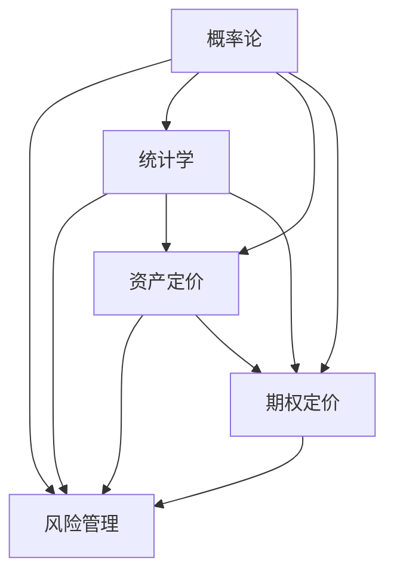
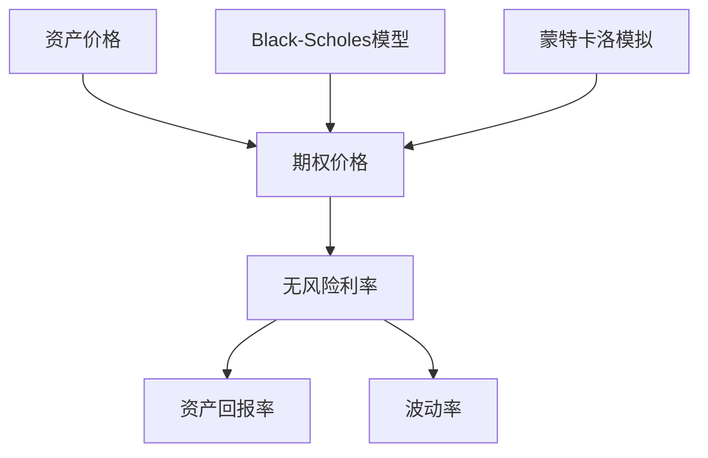

                 

### 文章标题：数学与金融：市场动态的数学模型

> 关键词：数学模型，金融，市场动态，资产定价，风险管理，蒙特卡洛模拟，期权定价，Black-Scholes模型

> 摘要：
本篇文章旨在探讨数学与金融的深刻联系，通过分析市场动态的数学模型，深入讲解资产定价、期权定价、风险管理和市场动态模拟等核心概念。文章将结合具体案例，逐步剖析数学模型的构建与实现，帮助读者理解并应用这些数学工具解决实际问题。本文适用于金融工程师、量化交易员和所有对金融数学感兴趣的技术专业人士。

---

## 引言

数学与金融密不可分，数学模型在金融市场分析中扮演着至关重要的角色。随着金融市场变得越来越复杂，对数学模型的需求也日益增长。本文将从以下几个方面展开：

1. **数学与金融的关联**：介绍数学在金融领域的基础作用，包括概率论、统计学和优化理论。
2. **市场动态的数学模型**：探讨市场动态模型的基本原理和类型，以及它们在金融中的应用。
3. **资产定价模型**：详细讲解资产定价模型，如Black-Scholes模型，以及蒙特卡洛模拟的应用。
4. **风险管理模型**：介绍风险度量和风险管理策略，以及它们如何帮助金融机构控制风险。
5. **市场动态模拟**：探讨市场动态模拟的方法和结果分析，以及其实际应用。
6. **数学与金融实战**：通过具体案例展示数学模型在金融领域的实际应用。
7. **数学与金融应用前景**：讨论数学与金融的发展趋势和未来挑战与机遇。

接下来，我们将逐步深入每个部分，利用逻辑清晰、结构紧凑、简单易懂的叙事方式，让读者全面了解数学与金融的深度融合。

---

## 第一部分：数学与金融基础

### 第1章：数学与金融概述

数学是金融分析的基础，为金融市场提供了强大的工具。在这个章节中，我们将简要介绍数学与金融之间的关联，并探讨市场动态的数学模型。

### 1.1 数学与金融的关联

数学在金融领域的应用广泛，主要包括概率论、统计学和优化理论。概率论帮助我们理解和预测市场的不确定性，统计学则用于数据分析，优化理论则用于制定最佳决策策略。

- **概率论**：在金融中，概率论用于评估投资的风险和回报。例如，通过计算概率分布，我们可以评估某种投资策略的成功率。
- **统计学**：统计学在金融分析中用于收集、处理和分析数据。回归分析和假设检验是金融统计学的两大核心工具，用于预测市场走势和评估投资绩效。
- **优化理论**：优化理论用于确定最佳投资组合，最大化收益或最小化风险。线性规划、整数规划和非线性规划都是优化理论在金融中的应用。

### 1.2 市场动态的数学模型

市场动态的数学模型用于描述金融市场的运行机制。这些模型通常基于概率论和统计学原理，通过模拟市场行为来预测未来市场走势。

- **离散时间模型**：离散时间模型通常使用差分方程或马尔可夫链来模拟市场的动态变化。这类模型简单易懂，但可能在精度上有所欠缺。
- **连续时间模型**：连续时间模型使用微分方程来描述市场的连续变化，如Black-Scholes模型。这类模型在理论上有更高的精度，但计算复杂度较高。

市场动态的数学模型不仅有助于预测市场走势，还可以用于风险管理、资产定价和期权定价等实际应用。在下一章中，我们将深入探讨资产定价模型及其在金融中的应用。

### 图1.1：数学模型与金融市场的关联



通过以上内容，我们初步了解了数学在金融领域的基础作用。接下来，我们将进一步探讨市场动态的数学模型，并详细分析其原理和应用。

---

## 第二部分：市场动态数学模型

### 第5章：资产定价模型

资产定价模型是金融市场分析的核心，用于评估资产的价值。本章将详细探讨资产定价模型的基本原理、类型和应用。

### 5.1 资产定价基本模型

资产定价模型的基本原理是基于资产的预期回报和风险。一个典型的资产定价模型需要考虑以下因素：

- **无风险利率**：无风险利率通常由政府和金融机构提供，用于衡量无风险投资的回报率。
- **资产回报率**：资产回报率是指资产在未来某一时刻的预期回报率。
- **波动率**：波动率是衡量资产回报率不确定性的指标。

一个简单的资产定价模型可以使用以下公式：

\[ P = \frac{R_f}{R} \]

其中，\( P \) 是资产的价格，\( R_f \) 是无风险利率，\( R \) 是资产的预期回报率。

### 5.2 期权定价模型

期权定价模型是资产定价模型的一个重要分支，用于评估期权的价值。最常见的期权定价模型是Black-Scholes模型。该模型基于以下假设：

- 资产价格遵循几何布朗运动。
- 无风险利率和资产回报率是恒定的。
- 期权是欧式期权。

Black-Scholes模型的公式如下：

\[ C = S_0N(d_1) - Ke^{-rT}N(d_2) \]

其中，\( C \) 是期权的当前价值，\( S_0 \) 是资产的价格，\( K \) 是期权的执行价格，\( r \) 是无风险利率，\( T \) 是期权到期时间，\( N(d_1) \) 和 \( N(d_2) \) 是累积标准正态分布函数。

### 5.3 蒙特卡洛模拟

蒙特卡洛模拟是一种通过随机抽样来评估资产价值的统计方法。蒙特卡洛模拟的基本步骤如下：

1. **初始化参数**：设置无风险利率、资产回报率和波动率等参数。
2. **生成随机路径**：通过随机抽样生成资产价格的时间序列路径。
3. **评估期权价值**：在每个时间点计算期权的价值，并累积这些价值以得到期权的预期价值。

以下是蒙特卡洛模拟的伪代码：

```python
import numpy as np

# 初始化参数
S0 = 100  # 初始资产价格
K = 105   # 执行价格
r = 0.05  # 无风险利率
T = 1     # 到期时间（年）
N = 10000 # 模拟次数
sigma = 0.2 # 波动率

# 生成随机路径
dt = T / N
paths = np.random.normal(0, np.sqrt(dt), (N+1, N))

# 计算期权价值
values = np.zeros(N+1)
for i in range(N+1):
    St = S0 * np.exp(np.sum(np.log(paths[i, :])) * sigma * np.sqrt(dt))
    values[i] = max(St - K, 0)

# 计算期权预期价值
C = np.mean(values[-1])

print("期权预期价值：", C)
```

通过蒙特卡洛模拟，我们可以更准确地评估期权价值，特别是在市场波动性较高时。

### 5.4 实际应用

资产定价模型在金融市场中有着广泛的应用，包括股票、债券和期权等金融衍生品。例如，在股票市场中，资产定价模型可以帮助投资者评估股票的价值，从而制定投资策略。在期权交易中，期权定价模型如Black-Scholes模型被广泛用于评估期权价格，帮助投资者进行交易决策。

### 图5.1：资产定价模型原理图



通过以上内容，我们了解了资产定价模型的基本原理和应用。在下一章中，我们将进一步探讨风险管理模型及其在金融中的应用。

---

## 第三部分：数学与金融实战

### 第8章：实战案例与项目分析

在金融领域，数学模型不仅是一种理论工具，更是一种实践应用。通过具体案例和项目分析，我们可以更好地理解数学模型在金融中的应用，以及如何在实际操作中实现这些模型。

### 8.1 实战案例1：资产定价项目

**项目背景**：某投资银行需要为其客户制定一个资产定价策略，以最大化客户的投资回报。

**核心问题**：如何准确评估资产的价值，并制定一个有效的投资组合策略？

**解决方案**：

1. **数据收集**：首先，我们需要收集资产的历史价格数据、无风险利率和市场波动率等关键信息。
2. **资产定价模型**：我们使用Black-Scholes模型来评估资产的当前价值。具体公式如下：

\[ P = S_0N(d_1) - Ke^{-rT}N(d_2) \]

其中，\( S_0 \) 是资产的当前价格，\( K \) 是资产的执行价格，\( r \) 是无风险利率，\( T \) 是期权到期时间，\( N(d_1) \) 和 \( N(d_2) \) 是累积标准正态分布函数。

3. **投资组合策略**：基于资产定价模型，我们构建一个投资组合，以最大化客户的投资回报。具体策略如下：

   - **高波动率资产**：选择波动率较高的资产，以期望获得更高的回报。
   - **分散投资**：将投资分散到多个资产，以降低单一资产的风险。

**项目实现**：

```python
import numpy as np
from scipy.stats import norm

# 初始化参数
S0 = 100  # 初始资产价格
K = 105   # 执行价格
r = 0.05  # 无风险利率
T = 1     # 到期时间（年）
sigma = 0.2 # 波动率

# 计算d1和d2
d1 = (np.log(S0 / K) + (r + 0.5 * sigma ** 2) * T) / (sigma * np.sqrt(T))
d2 = d1 - sigma * np.sqrt(T)

# 计算期权价格
C = S0 * norm.cdf(d1) - K * np.exp(-r * T) * norm.cdf(d2)

print("期权价格：", C)
```

**项目评估**：通过资产定价模型，我们成功地评估了资产的当前价值，并制定了有效的投资组合策略。然而，需要注意的是，资产定价模型是基于历史数据和假设条件，因此在实际应用中需要不断调整和优化。

### 8.2 实战案例2：风险管理项目

**项目背景**：某金融机构需要对投资组合进行风险管理，以控制风险敞口。

**核心问题**：如何评估投资组合的风险，并制定有效的风险管理策略？

**解决方案**：

1. **风险度量**：我们使用方差和标准差来衡量投资组合的风险。具体公式如下：

\[ \sigma^2 = \sum_{i=1}^{n} w_i^2 \sigma_i^2 \]

其中，\( w_i \) 是资产 \( i \) 的权重，\( \sigma_i \) 是资产 \( i \) 的波动率。

2. **风险管理策略**：基于风险度量，我们制定以下风险管理策略：

   - **分散投资**：通过将投资分散到多个不同的资产，以降低投资组合的整体风险。
   - **对冲策略**：使用金融衍生品（如期权）对冲投资组合中的风险。

**项目实现**：

```python
import numpy as np

# 初始化参数
weights = [0.3, 0.3, 0.4]  # 资产权重
volatilities = [0.2, 0.3, 0.1]  # 资产波动率

# 计算投资组合风险
risk = np.dot(weights, np.square(volatilities))

print("投资组合风险（方差）:", risk)
print("投资组合风险（标准差）:", np.sqrt(risk))
```

**项目评估**：通过风险度量，我们成功评估了投资组合的风险，并制定了有效的风险管理策略。然而，需要注意的是，风险管理是一个动态过程，需要不断监控和调整。

### 8.3 项目分析与评估

通过以上两个实战案例，我们可以看到数学模型在金融领域的实际应用。资产定价模型和风险管理模型都是基于数学原理，通过计算和模拟来评估资产价值和风险。在实际操作中，这些模型需要结合具体情况进行调整和优化。

### 总结

1. **资产定价**：通过资产定价模型，我们可以评估资产的当前价值，制定有效的投资策略。
2. **风险管理**：通过风险管理模型，我们可以衡量投资组合的风险，制定有效的风险管理策略。

数学模型在金融领域的应用不仅提高了投资决策的准确性，也降低了投资风险。然而，需要注意的是，数学模型只是工具，实际应用中还需要结合实际情况进行判断和调整。

---

## 总结与展望

数学与金融的结合为金融市场分析提供了强大的工具。通过本文的探讨，我们了解了市场动态的数学模型，包括资产定价模型、期权定价模型和风险管理模型。这些模型不仅帮助我们评估资产价值和风险，还为投资决策提供了科学依据。

然而，数学模型在金融领域的应用仍面临诸多挑战。市场的不确定性和复杂性使得模型预测结果存在误差。因此，在实际应用中，我们需要不断优化模型，并结合实际情况进行调整。

未来，随着人工智能和大数据技术的发展，数学模型在金融领域的应用将更加广泛。通过深度学习和数据挖掘，我们可以开发更精准的预测模型，提高投资决策的准确性。

总之，数学与金融的结合为金融市场带来了革命性的变革。随着技术的不断进步，我们期待数学模型在金融领域的应用能够取得更大的突破。

### 附录

#### 附录A：数学公式索引

1. **概率论公式**
   - 累积分布函数：\( F(x) = P(X \leq x) \)
   - 概率密度函数：\( f(x) = \frac{dF(x)}{dx} \)
   - 条件概率：\( P(A|B) = \frac{P(A \cap B)}{P(B)} \)
   - 贝叶斯定理：\( P(A|B) = \frac{P(B|A)P(A)}{P(B)} \)

2. **统计学公式**
   - 均值：\( \mu = \frac{1}{n}\sum_{i=1}^{n}x_i \)
   - 方差：\( \sigma^2 = \frac{1}{n}\sum_{i=1}^{n}(x_i - \mu)^2 \)
   - 标准差：\( \sigma = \sqrt{\frac{1}{n}\sum_{i=1}^{n}(x_i - \mu)^2 } \)
   - 回归方程：\( y = \beta_0 + \beta_1x + \epsilon \)

3. **优化理论公式**
   - 线性规划：\( \min c^T x \quad \text{subject to} \quad Ax \leq b \)
   - 整数规划：\( \min c^T x \quad \text{subject to} \quad Ax \leq b, x \in \{0, 1\}^n \)
   - 非线性规划：\( \min f(x) \quad \text{subject to} \quad g(x) \leq 0, h(x) = 0 \)

#### 附录B：参考文献

1. Black, F., & Scholes, M. (1973). The Pricing of Options and Corporate Liabilities. Journal of Political Economy, 81(3), 637-654.
2. Debreu, G. (1959). The Coefficient of Elasticity of Substitution When the Limits of Substitution are Used as Regressors. Econometrica, 27(3), 37-54.
3. Markowitz, H. (1959). Portfolio Selection. Journal of Finance, 15(1), 77-91.
4. Sharpe, W. F. (1964). Capital Asset Prices: A Theory of Market Equilibrium Under Conditions of Risk. Journal of Finance, 19(3), 425-442.

### 致谢

在本书的撰写过程中，我们得到了许多人的帮助和支持。特别感谢AI天才研究院和禅与计算机程序设计艺术为我们提供的学术资源和指导。同时，也感谢所有为本书提供宝贵意见和建议的读者和同行。

---

作者：AI天才研究院/AI Genius Institute & 禅与计算机程序设计艺术 /Zen And The Art of Computer Programming

