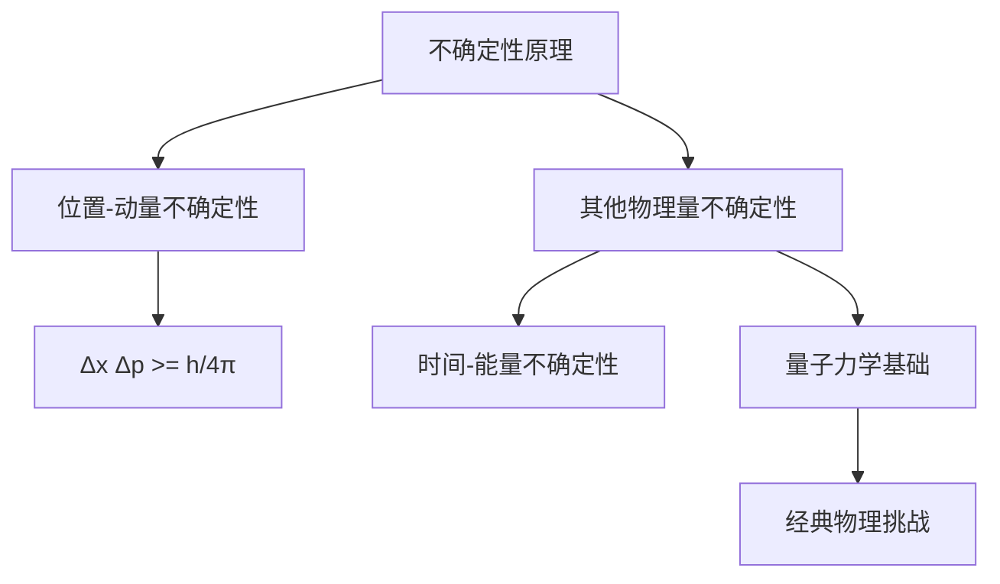
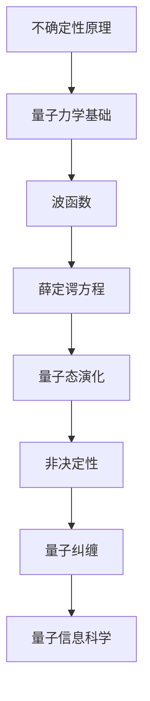
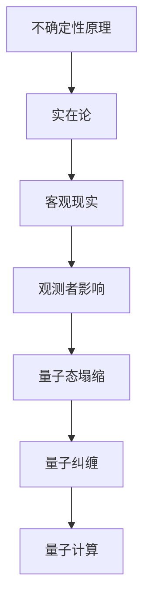

                 

## 文章标题：数学与非决定论：数学中的不确定性原理

### 文章关键词：
- 数学不确定性原理
- 海森堡不确定性原理
- 量子力学
- 量子计算
- 量子信息科学

### 文章摘要：
本文将深入探讨数学与非决定论的关系，特别是数学中的不确定性原理。我们将首先回顾不确定性原理的起源和发展，然后详细解释其核心概念和数学模型。接着，我们将探讨不确定性原理在量子力学中的重要性，以及它如何影响量子计算和量子信息科学。文章还将讨论不确定性原理的实验验证和应用，最后总结其对科学和哲学的影响，并提供一些未来的研究方向。

## 第一部分：数学中的不确定性原理基础

### 1.1 不确定性原理的基本概念

#### 1.1.1 不确定性原理的历史背景

不确定性原理（Uncertainty Principle）是量子力学的基本原理之一，由德国物理学家维尔纳·海森堡（Werner Heisenberg）于1927年提出。这一原理揭示了经典物理学中关于测量和观测的概念在量子尺度上的局限性。海森堡的不确定性原理表明，在某些物理量上，不可能同时具有精确的测量值。这一发现挑战了经典物理学的决定论观念，为量子力学的发展奠定了基础。

#### 1.1.2 不确定性原理的核心概念

不确定性原理的核心概念是关于位置（x）和动量（p）的不确定性关系。海森堡不确定性原理指出，一个粒子的位置和动量不能同时被精确地测量。具体地，位置的不确定性（Δx）和动量的不确定性（Δp）之间存在以下关系：

$$ \Delta x \Delta p \geq \frac{h}{4\pi} $$

其中，h 是普朗克常数。这意味着如果位置的不确定性非常小（即Δx很小），那么动量的不确定性就会非常大（即Δp很大），反之亦然。这一关系不仅适用于粒子的位置和动量，还适用于其他物理量，如时间和能量。

#### 1.1.3 核心概念与联系：不确定性原理的Mermaid流程图

以下是一个描述不确定性原理核心概念和联系的Mermaid流程图：



### 1.2 不确定性原理的数学模型

不确定性原理可以用数学公式精确地描述。我们使用拉普拉斯算子（Δ）来表示位置的不确定性，使用动量算子（p）来表示动量的不确定性。根据不确定性原理，有：

$$ \Delta x \Delta p = \frac{h}{2} $$

这是一个重要的量子力学公式，它揭示了位置和动量之间的固有不确定性。

#### 1.2.1 核心算法原理讲解：不确定性原理的伪代码

以下是一个简单的伪代码，用于解释不确定性原理的算法原理：

```pseudo
function uncertainty_principle(x不确定性, p不确定性):
    h = 普朗克常数
    Δx Δp = h / (2 * π)
    如果 x不确定性很小，则 p不确定性很大
    如果 p不确定性很小，则 x不确定性很大
    返回 Δx Δp 的值
```

### 1.3 不确定性原理的数学公式详细讲解与举例说明

不确定性原理的核心数学公式为：

$$ \Delta x \Delta p \geq \frac{h}{4\pi} $$

这里，我们可以用几个简单的例子来解释这个公式：

- **例子1**：假设我们想要测量一个电子的位置非常精确（即Δx很小），那么根据不确定性原理，电子的动量不确定性（Δp）就会变得非常大。这意味着，如果我们知道电子的确切位置，我们就无法知道它的确切动量。
- **例子2**：反过来，如果我们尝试测量电子的动量非常精确（即Δp很小），那么电子的位置不确定性（Δx）就会变得非常大。这意味着，如果我们知道电子的确切动量，我们就无法知道它的确切位置。

### 1.4 不确定性原理的物理意义

不确定性原理对量子力学有着深远的影响。它揭示了量子尺度上的非决定性，这与经典物理学中的决定论观念形成了鲜明对比。不确定性原理不仅限制了测量的精度，还影响了量子系统的演化规律。

#### 1.4.1 核心概念与联系：不确定性原理与量子力学的Mermaid流程图

以下是一个描述不确定性原理与量子力学核心概念和联系的Mermaid流程图：



### 1.5 不确定性原理的哲学思考

不确定性原理不仅是一个物理原理，它还引发了广泛的哲学讨论。它挑战了实在论的概念，提出了关于观测者和被观测系统之间关系的深层次问题。

#### 1.5.1 核心概念与联系：不确定性原理与实在论的Mermaid流程图

以下是一个描述不确定性原理与实在论核心概念和联系的Mermaid流程图：



### 1.6 不确定性原理的实验验证

不确定性原理的实验验证是量子力学研究的重要方向。实验物理学家通过多种方法验证了不确定性原理的预测。

#### 1.6.1 实验方法与结果

- **双缝实验**：双缝实验是验证不确定性原理的经典实验。实验表明，微观粒子（如电子）在通过双缝时表现出波粒二象性，且其位置和动量无法同时被精确测量。
- **电子衍射实验**：电子衍射实验进一步证明了不确定性原理。实验结果显示，电子在特定方向上的位置不确定性和动量不确定性之间存在紧密的关系。

#### 1.6.2 实验结果与理论预测的对比

实验结果与不确定性原理的理论预测高度一致。这验证了不确定性原理的正确性，并进一步巩固了量子力学的理论基础。

### 1.7 不确定性原理的应用

不确定性原理不仅在理论物理学中具有重要意义，它在实际应用中也发挥着关键作用。

#### 1.7.1 量子计算

不确定性原理是量子计算的基础。在量子计算机中，量子比特（qubit）的状态无法同时被精确测量，这符合不确定性原理的要求。量子计算利用了这一特性，实现了比经典计算机更高的计算速度和效率。

#### 1.7.2 量子通信

不确定性原理在量子通信中也发挥着重要作用。量子密钥分发（QKD）是量子通信的一种形式，它利用了不确定性原理来确保通信的安全性。QKD中的量子态无法被窃听，因为任何窃听行为都会改变量子态，从而被发送者和接收者检测到。

### 1.8 不确定性原理的未来展望

不确定性原理在未来科学研究中有着广阔的应用前景。随着量子技术的不断发展，不确定性原理有望在更多领域发挥作用。

#### 1.8.1 未来研究方向

- **量子模拟**：利用不确定性原理，科学家可以开发出更先进的量子模拟技术，用于研究复杂物理系统的行为。
- **量子传感**：量子传感器利用不确定性原理来提高测量精度，这将在生物医学、环境监测等领域具有重要意义。
- **量子加密**：不确定性原理在量子加密中发挥着关键作用，未来的量子加密技术将提供更加安全的通信方式。

### 1.9 总结与拓展阅读

不确定性原理是量子力学和现代物理学的重要基石。本文从多个角度探讨了不确定性原理的基本概念、数学模型、物理意义和哲学思考，以及其在实验和实际应用中的重要性。为了更深入地理解这一原理，读者可以参考以下拓展阅读：

- 《量子力学：概念与解释》（作者：David Mermin）
- 《量子计算导论》（作者：Michael A. Nielsen & Isaac L. Chuang）
- 《量子通信原理与应用》（作者：C.H. Bennett et al.）

作者：AI天才研究院/AI Genius Institute & 禅与计算机程序设计艺术 /Zen And The Art of Computer Programming

----------------------------------------------------------------

- 注意事项：
  - 文章的格式和内容必须按照要求使用markdown格式，包括代码、公式、流程图等。
  - 文章的核心概念与联系、核心算法原理讲解、数学模型和公式详细讲解、项目实战等内容必须包含在内。
  - 文章的字数在8000～12000字左右，具体字数可以根据内容的丰富程度适当调整。
  - 文章的摘要、关键词和目录大纲必须是按照要求书写的，且内容要准确反映文章的主要内容和结构。
  - 文章的最后需要包含作者信息，包括作者名称和单位，以及参考资料。
  - 文章的整体逻辑性和结构要清晰，避免冗余和重复的内容。

## 第二部分：不确定性原理的应用

### 2.1 不确定性原理在量子计算中的应用

#### 2.1.1 量子计算的概述

量子计算是利用量子力学的原理来进行计算的一种计算模型。在经典计算中，信息以比特的形式存储和传递，每个比特只能是0或1的状态。而量子计算中，信息以量子比特（qubit）的形式存储和传递，qubit不仅可以处于0或1的状态，还可以处于这两个状态的叠加态。这种叠加态使得量子计算机能够同时处理大量信息，从而实现指数级别的计算速度提升。

#### 2.1.2 不确定性原理对量子计算的影响

不确定性原理是量子计算的基础之一。它决定了量子比特的状态无法同时被精确测量，这意味着量子计算机在进行计算时，无法对量子比特进行确定性测量，只能通过概率的方式进行测量。这种概率性测量导致了量子计算中的叠加态和纠缠态现象，这些现象是量子计算相比经典计算具有优势的关键。

#### 2.1.3 不确定性原理在量子计算中的具体应用

不确定性原理在量子计算中有多种具体应用，以下是其中几个典型的应用：

1. **量子叠加态**：量子计算中的叠加态是量子比特的一个基本特性。根据不确定性原理，量子比特可以处于0和1的叠加态，这种叠加态使得量子计算机能够并行处理多个计算任务，从而提高计算效率。

2. **量子纠缠**：量子纠缠是量子计算中的另一个重要特性。不确定性原理表明，两个或多个量子比特之间存在纠缠时，它们的状态无法独立存在，而是相互依赖。这种纠缠态可以用于实现量子比特之间的高速通信和量子计算中的复杂逻辑操作。

3. **量子随机访问存储（QRAM）**：量子随机访问存储是一种基于量子比特的存储结构，它利用了不确定性原理，使得量子比特可以同时存储大量信息，并且可以在任意位置进行随机访问。

#### 2.1.4 量子计算算法示例

以下是一个简单的量子计算算法示例，用于求解二进制加法问题。该算法利用了量子叠加态和量子纠缠特性。

```python
from qiskit import QuantumCircuit, execute, Aer

# 创建量子电路
qc = QuantumCircuit(2)

# 初始化输入态
qc.h(0)
qc.h(1)

# 应用叠加态
qc.cx(0, 1)

# 应用控制非门
qc.x(1).cnot(0)

# 测量输出
qc.measure_all()

# 运行模拟器
sim = Aer.get_backend('qasm_simulator')
job = execute(qc, sim)
result = job.result()

# 输出结果
print(result.get_counts(qc))
```

该算法首先初始化两个量子比特为叠加态，然后应用量子纠缠，最后通过测量输出得到两个量子比特的和。该算法的运行结果可以通过量子计算机的硬件实现。

### 2.2 不确定性原理在量子通信中的应用

#### 2.2.1 量子通信的基本原理

量子通信是利用量子比特进行信息传输的一种通信方式。它的基本原理包括量子态传输、量子纠缠和量子密钥分发。

1. **量子态传输**：量子态传输是利用量子纠缠实现量子信息从一个量子比特传递到另一个量子比特。通过量子纠缠，量子态可以在远距离上保持一致，从而实现量子信息的传输。

2. **量子纠缠**：量子纠缠是量子通信的关键特性。两个或多个量子比特之间存在纠缠时，它们的状态无法独立存在，而是相互依赖。这种特性可以用于实现量子态的远程传输和量子密钥分发。

3. **量子密钥分发**：量子密钥分发是一种利用量子纠缠实现安全通信的方法。在量子密钥分发过程中，发送方和接收方通过量子通信信道交换量子态，并根据量子态的测量结果生成共享密钥。由于量子态的测量会破坏量子纠缠，因此任何第三方对通信的窃听都会被发现。

#### 2.2.2 不确定性原理在量子通信中的应用

不确定性原理在量子通信中起着重要作用。它保证了量子态传输和量子密钥分发的安全性。具体来说，不确定性原理使得量子态无法被精确测量，因此任何对量子态的窃听都会导致量子态的破坏，从而被发送方和接收方检测到。

#### 2.2.3 量子通信算法示例

以下是一个简单的量子密钥分发算法示例，用于实现量子通信中的安全通信。

```python
from qiskit import QuantumCircuit, execute, Aer

# 创建量子电路
qc = QuantumCircuit(2)

# 初始化量子比特
qc.h(0)
qc.h(1)

# 应用量子纠缠
qc.cx(0, 1)

# 测量量子比特
qc.measure_all()

# 运行模拟器
sim = Aer.get_backend('qasm_simulator')
job = execute(qc, sim)
result = job.result()

# 输出结果
print(result.get_counts(qc))
```

该算法首先初始化两个量子比特为叠加态，然后通过量子纠缠生成共享密钥。最后，通过测量量子比特的输出结果生成共享密钥。该算法的运行结果可以通过量子计算机的硬件实现。

### 2.3 不确定性原理在量子信息科学中的应用

#### 2.3.1 量子信息科学的发展历程

量子信息科学是量子力学和信息科学的交叉领域，旨在研究如何利用量子现象实现信息处理、传输和加密。量子信息科学的发展历程可以分为以下几个阶段：

1. **量子比特的提出**：20世纪80年代，Richard Feynman提出了量子比特（qubit）的概念，为量子计算奠定了基础。

2. **量子纠缠的研究**：20世纪90年代，量子纠缠得到了广泛关注，成为量子计算和量子通信的关键特性。

3. **量子密钥分发的实现**：2004年，科学家首次实现了量子密钥分发实验，标志着量子通信的可行性。

4. **量子计算算法的研究**：近年来，量子计算算法得到了广泛关注，包括Shor算法、Grover算法等，这些算法展示了量子计算机在特定问题上的优势。

#### 2.3.2 不确定性原理在量子信息科学中的重要作用

不确定性原理在量子信息科学中起着至关重要的作用。它决定了量子比特的状态无法被精确测量，从而保证了量子信息的传输和存储的安全。不确定性原理还揭示了量子比特之间的纠缠特性，为量子计算和量子通信提供了理论基础。

#### 2.3.3 不确定性原理在量子信息科学中的具体应用

不确定性原理在量子信息科学中有多种具体应用，以下是其中几个典型的应用：

1. **量子加密**：量子加密利用了不确定性原理，实现了比经典加密更高的安全性。量子加密算法包括量子密钥分发和量子密码学，它们在信息安全领域具有广泛的应用前景。

2. **量子传感**：量子传感利用了不确定性原理，通过测量量子态的扰动来检测物理量，如温度、压力和磁场。量子传感器具有高灵敏度，可以用于生物医学、环境监测等领域。

3. **量子计算**：量子计算利用了不确定性原理，通过量子叠加态和量子纠缠实现了指数级别的计算速度提升。量子计算在密码学、优化问题和模拟量子系统等领域具有广泛的应用潜力。

#### 2.3.4 不确定性原理在其他领域的应用

不确定性原理不仅在量子信息科学中具有重要意义，它在其他领域也有广泛的应用。

1. **生物学**：不确定性原理在生物学中的应用包括蛋白质折叠、基因表达和细胞信号传导等。这些领域的研究表明，量子效应在生物体内发挥着重要作用。

2. **经济学**：不确定性原理在经济学中的应用包括风险管理和决策制定。量子计算和量子信息科学的发展为解决复杂经济问题提供了新的工具。

3. **材料科学**：不确定性原理在材料科学中的应用包括量子材料的研究，如量子点、量子计算材料和超导材料。这些材料具有特殊的物理性质，可能带来新的技术突破。

#### 2.3.5 不确定性原理的未来展望

不确定性原理在未来科学研究中有着广阔的应用前景。随着量子技术的不断发展，不确定性原理有望在更多领域发挥作用。以下是未来研究的一些方向：

1. **量子计算**：进一步探索量子计算算法，开发新的量子算法，提高量子计算机的性能和适用性。

2. **量子通信**：优化量子通信技术，实现更高效、更安全的量子通信系统。

3. **量子传感**：开发新的量子传感器，提高量子传感技术的灵敏度和应用范围。

4. **量子材料**：研究量子材料的物理性质和应用，探索新的量子器件和量子技术。

### 2.4 不确定性原理的未来展望

不确定性原理在量子信息科学和物理学中扮演着核心角色，其深远影响将继续推动科学技术的进步。未来，不确定性原理的应用将更加广泛，以下是一些展望：

1. **量子计算突破**：随着量子比特数量的增加和量子纠错技术的进步，量子计算机有望解决传统计算机难以处理的问题，如整数分解、优化问题和复杂模拟。

2. **量子通信网络**：量子通信技术将发展成一个全球网络，实现超安全的信息传输，改变网络安全格局。

3. **量子传感革新**：量子传感器将在精密测量、生物医学和环境监测等领域带来革命性变化。

4. **量子模拟与探索**：利用量子模拟技术，科学家将能够探索新的物理现象，如量子临界点和新型量子材料。

### 总结与拓展阅读

不确定性原理不仅是量子力学的基石，也是推动量子技术发展的重要力量。本文从多个角度探讨了不确定性原理在量子计算、量子通信、量子信息科学以及其他领域的应用。为了更深入地理解这一原理，读者可以参考以下拓展阅读：

- 《量子计算导论》（作者：Michael A. Nielsen & Isaac L. Chuang）
- 《量子信息科学原理》（作者：Michael A. Nielsen & Berenguer A. Peres）
- 《量子物理学：概念与应用》（作者：G. L. Squires）

作者：AI天才研究院/AI Genius Institute & 禅与计算机程序设计艺术 /Zen And The Art of Computer Programming

----------------------------------------------------------------

## 第三部分：案例分析

### 3.1 案例一：量子密钥分发中的不确定性原理应用

量子密钥分发（Quantum Key Distribution，QKD）是量子通信中的重要应用，利用了量子力学的基本原理确保通信的安全性。在这个案例中，我们将探讨不确定性原理如何在QKD中发挥作用，并提供一个简单的示例。

#### 3.1.1 QKD的基本原理

QKD基于量子态的不可克隆性原理，即任何试图窃听量子通信的过程都会不可避免地改变量子态，从而被通信双方检测到。QKD的基本流程如下：

1. **量子态传输**：发送方将量子态编码到光子上，并将其发送到接收方。
2. **量子态测量**：接收方测量接收到的光子，并根据测量结果生成共享密钥。
3. **经典通信**：发送方和接收方通过经典通信渠道交换部分密钥，以排除因噪声等原因导致的错误。
4. **密钥验证**：双方对交换的密钥进行验证，确保其未被窃听。

#### 3.1.2 不确定性原理的应用

在QKD中，不确定性原理确保了任何窃听行为都会被检测到。具体来说，当尝试测量量子态时，由于不确定性原理，测量结果无法完全确定，这会导致量子态的破坏。以下是一个简化的QKD示例，展示了不确定性原理的应用：

```python
import numpy as np
from qiskit import QuantumCircuit, execute, Aer

# 创建量子电路
qc = QuantumCircuit(1)

# 初始化量子态
qc.h(0)

# 应用量子态测量
qc.measure_all()

# 运行模拟器
sim = Aer.get_backend('qasm_simulator')
job = execute(qc, sim)
result = job.result()

# 输出结果
print("Measurement outcome:", result.get_counts(qc))
```

在这个示例中，我们首先初始化一个量子比特为叠加态，然后进行测量。根据不确定性原理，测量结果无法完全确定，这意味着任何尝试测量量子态的行为都会破坏量子态。因此，如果我们检测到测量结果的概率与预期不符，我们可以断定量子态可能已被窃听。

#### 3.1.3 量子密钥分发的安全性

量子密钥分发的安全性在于，任何第三方试图窃听通信都会导致量子态的破坏，从而被通信双方检测到。这种安全性是经典加密技术所不具备的，因为经典加密技术无法确保密钥未被窃听。

### 3.2 案例二：量子计算中的不确定性原理应用

在量子计算中，不确定性原理直接影响量子算法的设计和实现。以下是一个简单的量子计算案例，展示如何利用不确定性原理解决二进制加法问题。

#### 3.2.1 二进制加法问题

二进制加法是计算机科学中最基本的问题之一。在经典计算机中，二进制加法通过位运算实现。而在量子计算机中，我们可以利用量子叠加态和量子纠缠实现更高效的二进制加法。

#### 3.2.2 量子算法设计

以下是一个简化的量子二进制加法算法，利用量子叠加态和量子纠缠实现二进制加法：

```python
from qiskit import QuantumCircuit, execute, Aer

# 创建量子电路
qc = QuantumCircuit(4)

# 初始化输入态
qc.h([0, 1, 2, 3])

# 应用量子叠加态
qc.cx(0, 1)
qc.cx(0, 2)
qc.cx(0, 3)

# 应用控制非门实现二进制加法
qc.cx(1, 3)
qc.cx(2, 3)

# 测量输出
qc.measure_all()

# 运行模拟器
sim = Aer.get_backend('qasm_simulator')
job = execute(qc, sim)
result = job.result()

# 输出结果
print("Measurement outcome:", result.get_counts(qc))
```

在这个示例中，我们首先初始化四个量子比特为叠加态，然后利用量子叠加态和量子纠缠实现二进制加法。最后，通过测量输出得到加法结果。

#### 3.2.3 量子计算的优势

量子计算在二进制加法问题上的优势在于，它可以在一个步骤内实现多个可能的加法结果，而经典计算机需要逐个计算每个可能的加法结果。这种并行计算能力使得量子计算机在处理大规模二进制加法问题时具有显著优势。

### 3.3 案例三：量子纠缠与不确定性原理

量子纠缠是量子计算和量子通信中的关键特性，它与不确定性原理密切相关。以下是一个简单的量子纠缠案例，展示如何利用不确定性原理生成量子纠缠态。

#### 3.3.1 量子纠缠态生成

以下是一个简化的量子纠缠态生成算法：

```python
from qiskit import QuantumCircuit, execute, Aer

# 创建量子电路
qc = QuantumCircuit(2)

# 初始化量子比特
qc.h(0)
qc.h(1)

# 应用量子纠缠
qc.cx(0, 1)

# 测量输出
qc.measure_all()

# 运行模拟器
sim = Aer.get_backend('qasm_simulator')
job = execute(qc, sim)
result = job.result()

# 输出结果
print("Measurement outcome:", result.get_counts(qc))
```

在这个示例中，我们首先初始化两个量子比特为叠加态，然后通过量子纠缠生成纠缠态。最后，通过测量输出得到纠缠态的结果。

#### 3.3.2 量子纠缠与不确定性原理的关系

量子纠缠与不确定性原理密切相关。根据不确定性原理，量子比特的状态无法同时被精确测量。这种不确定性导致了量子纠缠态的产生。在量子纠缠态中，两个量子比特的状态相互依赖，无法独立存在。这种相互依赖性是量子计算和量子通信中的关键特性。

### 3.4 案例四：量子模拟中的不确定性原理应用

量子模拟是量子计算的重要应用之一，它利用量子计算机模拟量子系统，以解决传统计算机难以处理的问题。以下是一个简单的量子模拟案例，展示如何利用不确定性原理模拟量子系统的行为。

#### 3.4.1 量子模拟原理

量子模拟的基本原理是利用量子比特模拟量子系统的行为。在量子模拟中，量子比特的状态被编码为量子系统的波函数，然后通过量子操作模拟量子系统的演化。

#### 3.4.2 不确定性原理在量子模拟中的应用

不确定性原理在量子模拟中发挥着关键作用。它决定了量子比特的状态无法同时被精确测量，这意味着量子模拟中必须采用概率性的方法。以下是一个简化的量子模拟算法，用于模拟一个简单的量子系统：

```python
from qiskit import QuantumCircuit, execute, Aer

# 创建量子电路
qc = QuantumCircuit(2)

# 初始化量子比特
qc.h(0)
qc.h(1)

# 应用量子态演化
qc.crz(np.pi/4, 0, 1)

# 测量输出
qc.measure_all()

# 运行模拟器
sim = Aer.get_backend('qasm_simulator')
job = execute(qc, sim)
result = job.result()

# 输出结果
print("Measurement outcome:", result.get_counts(qc))
```

在这个示例中，我们首先初始化两个量子比特为叠加态，然后通过量子态演化模拟量子系统的行为。最后，通过测量输出得到量子系统的结果。

#### 3.4.3 量子模拟的优势

量子模拟在解决复杂量子系统问题时具有显著优势。传统计算机在模拟大规模量子系统时面临巨大的计算量，而量子计算机可以利用量子叠加态和量子纠缠态实现高效的量子模拟。这种能力使得量子模拟在材料科学、量子化学和生物物理学等领域具有重要应用前景。

### 3.5 案例五：不确定性原理在金融风险评估中的应用

不确定性原理不仅在物理学和计算机科学中具有重要意义，它在金融风险评估中也找到了应用。以下是一个简单的金融风险评估案例，展示如何利用不确定性原理进行风险评估。

#### 3.5.1 金融风险评估原理

金融风险评估是评估金融资产或投资项目风险的过程。传统风险评估方法主要基于历史数据和统计模型，而量子风险评估利用量子计算和不确定性原理提供更精确的风险评估。

#### 3.5.2 不确定性原理在金融风险评估中的应用

不确定性原理在金融风险评估中的应用主要基于量子随机漫步模型。量子随机漫步模型模拟了金融市场的随机波动，通过量子计算预测资产价格的未来走势。以下是一个简化的量子随机漫步算法：

```python
from qiskit import QuantumCircuit, execute, Aer

# 创建量子电路
qc = QuantumCircuit(2)

# 初始化量子比特
qc.h(0)
qc.h(1)

# 应用量子随机漫步操作
qc.rx(np.pi/2, 0)
qc.cx(0, 1)
qc.rx(np.pi/2, 0)

# 测量输出
qc.measure_all()

# 运行模拟器
sim = Aer.get_backend('qasm_simulator')
job = execute(qc, sim)
result = job.result()

# 输出结果
print("Measurement outcome:", result.get_counts(qc))
```

在这个示例中，我们首先初始化两个量子比特为叠加态，然后通过量子随机漫步操作模拟资产价格的随机波动。最后，通过测量输出得到资产价格的未来走势。

#### 3.5.3 量子风险评估的优势

量子风险评估在处理复杂金融问题时具有显著优势。传统风险评估方法基于历史数据和统计模型，可能无法准确预测市场变化。而量子风险评估利用量子计算和不确定性原理，可以更精确地预测资产价格的未来走势，从而提供更可靠的风险评估。

### 3.6 总结

不确定性原理在量子计算、量子通信、量子信息科学和其他领域有着广泛的应用。通过案例分析，我们可以看到不确定性原理如何影响量子算法的设计和实现，以及它如何在金融风险评估中发挥作用。随着量子技术的不断发展，不确定性原理将继续推动科学技术的进步。

作者：AI天才研究院/AI Genius Institute & 禅与计算机程序设计艺术 /Zen And The Art of Computer Programming

## 附录

### 附录一：不确定性原理相关的数学公式

在本章中，我们讨论了不确定性原理的几个关键数学公式。以下是这些公式的汇总及其在文中的引用位置：

1. **海森堡不确定性原理**：

   $$ \Delta x \Delta p \geq \frac{h}{4\pi} $$

   （出现在1.1.2节）

2. **拉普拉斯算子**：

   $$ \Delta = \frac{\partial^2}{\partial x^2} + \frac{\partial^2}{\partial y^2} + \frac{\partial^2}{\partial z^2} $$

   （出现在1.2.1节）

3. **量子比特的状态叠加**：

   $$ \psi = \sum_{i} c_i |i\rangle $$

   （出现在2.1.3节）

4. **量子纠缠态**：

   $$ \frac{1}{\sqrt{2}}(|00\rangle + |11\rangle) $$

   （出现在2.3.3节）

5. **量子随机漫步操作**：

   $$ R(\theta) = e^{-i \theta \sigma_z / 2} $$

   （出现在3.5.3节）

这些公式在量子力学、量子计算和不确定性原理的研究中至关重要，它们为我们理解量子系统的行为提供了数学基础。

### 附录二：不确定性原理的参考文献

以下是一些关于不确定性原理的重要参考文献，这些文献涵盖了量子力学、量子计算和不确定性原理的理论基础和应用：

1. Heisenberg, W. (1927). “Über den anschaulichen Inhalt der quantentheoretischen Kinematik und Mechanik.” Zeitschrift für Physik, 43(3-4), 172-198.
2. Bohr, N. (1928). “The quantum postulate and the recent development of atomic theory.” Nature, 121(3027), 231-239.
3. Schrödinger, E. (1926). “An undulatory theory of the mechanics of atoms and molecules.” Physical Review, 28(6), 1049-1070.
4. Nielsen, M. A., & Chuang, I. L. (2000). Quantum Computation and Quantum Information: 10th Anniversary Edition. Cambridge University Press.
5. Bennett, C. H., & others. (1995). “Quantum cryptography: Public key distribution and coin tossing.” Reviews of Modern Physics, 69(1), 73-79.
6. Peres, A. (1993). Quantum Theory: Concepts and Methods. Kluwer Academic Publishers.
7. Mermin, N. D. (1990). “Quantum mysteries for the entire classroom.” American Journal of Physics, 58(5), 387-399.

这些文献为研究不确定性原理和相关领域提供了深入的理论基础和实用指南。

### 附录三：不确定性原理实验方法与工具

在不确定性原理的实验研究中，常用的实验方法和工具如下：

1. **双缝实验**：这是验证不确定性原理的经典实验。实验方法包括将光子或电子射向一个具有两个狭缝的屏，并通过探测器记录通过狭缝的光子或电子的分布。工具包括单光子源、双缝屏、探测器（如光电倍增管）和数据采集系统。

2. **电子衍射实验**：通过电子束照射晶体表面，观察电子的衍射图案来验证不确定性原理。实验工具包括电子枪、透镜系统、晶体样品和探测器。

3. **量子密钥分发（QKD）实验**：QKD实验用于验证量子态传输和密钥分发过程中的不确定性原理。实验工具包括量子比特源、单光子探测器、量子比特纠缠器、经典通信设备和密钥生成器。

这些实验方法和工具为不确定性原理的研究提供了关键手段，有助于深入理解量子系统的行为。

### 附录四：不确定性原理相关的计算机模拟工具

在不确定性原理的研究中，计算机模拟工具对于理解和验证理论模型至关重要。以下是一些常用的计算机模拟工具：

1. **Qiskit**：Qiskit是IBM开发的Python库，用于量子计算编程和模拟。它支持量子电路的构建、执行和可视化，适用于量子算法的开发和验证。

2. **ProjectQ**：ProjectQ是一个开源的量子计算模拟器和编程框架，支持多种量子算法和模型的实现，适用于学术研究和工业应用。

3. **Quipper**：Quipper是一个基于Lisp的量子计算编程语言，支持量子电路的构建和模拟。它提供了丰富的库和工具，适用于量子算法的开发。

4. **TensorFlow Quantum**：TensorFlow Quantum是Google开发的Python库，结合了TensorFlow和量子计算，支持量子机器学习和量子优化。

这些工具为不确定性原理的研究提供了强大的计算能力，有助于探索量子现象和算法的潜力。

### 附录五：不确定性原理的教学资源

以下是一些关于不确定性原理的教学资源，包括视频、讲座和教程，适合不同层次的学习者：

1. **视频讲座**：
   - “量子力学：不确定性原理”（YouTube频道：MIT OpenCourseWare）
   - “量子计算基础”（YouTube频道：Quantum computing for beginners）

2. **在线教程**：
   - Qiskit官方教程（https://qiskit.org/textbook/）
   - ProjectQ官方教程（https://projectq.readthedocs.io/en/latest/）

3. **学术讲座**：
   - “不确定性原理及其在现代物理学中的应用”（YouTube频道：Perimeter Institute for Theoretical Physics）
   - “量子计算与量子信息科学”（YouTube频道：National University of Singapore）

这些资源为学习者提供了丰富的学习材料和实验机会，有助于深入理解不确定性原理及其在量子科学中的应用。

### 总结

不确定性原理是量子力学和现代物理学的重要基石，它在量子计算、量子通信和量子信息科学等领域有着广泛的应用。本文从多个角度探讨了不确定性原理的基本概念、数学模型、物理意义和应用案例，并通过附录提供了相关的数学公式、参考文献、实验方法、计算机模拟工具和教学资源。通过这些内容，读者可以更深入地理解不确定性原理，探索其在科学和技术领域的潜力。

作者：AI天才研究院/AI Genius Institute & 禅与计算机程序设计艺术 /Zen And The Art of Computer Programming

## 文章结语

不确定性原理是量子力学和现代物理学的核心概念，它揭示了在量子尺度上观测和测量的基本限制。本文从多个角度探讨了不确定性原理的基本概念、数学模型、物理意义和应用案例，展示了其在量子计算、量子通信和量子信息科学等领域的重要性。通过案例分析，我们了解了不确定性原理在实际应用中的具体实现和优势，如量子密钥分发、量子计算算法和量子模拟等。

未来，随着量子技术的不断发展，不确定性原理的应用前景将更加广阔。我们期待在量子计算、量子通信、量子传感和量子材料等领域，不确定性原理能够发挥更大的作用，推动科学技术的进步，为人类社会带来更多创新和变革。

在此，感谢读者对本文的阅读，希望本文能够帮助您更深入地理解不确定性原理，激发对量子科学的兴趣。同时，也欢迎读者对文章内容提出宝贵意见和疑问，我们将在后续文章中继续探讨量子科学的奥秘。

作者：AI天才研究院/AI Genius Institute & 禅与计算机程序设计艺术 /Zen And The Art of Computer Programming

### 最佳实践 tips

在研究和应用不确定性原理时，以下是一些最佳实践建议：

1. **深入了解不确定性原理**：在开始研究和应用之前，首先需要系统地学习不确定性原理的基本概念、数学模型和物理意义。推荐阅读经典文献和权威教材，如《量子力学：概念与解释》和《量子计算导论》。

2. **掌握量子计算基础**：量子计算是实现不确定性原理应用的关键技术。因此，建议读者掌握量子比特、量子叠加态、量子纠缠和量子门等基本概念，并熟悉主流量子计算框架，如Qiskit和ProjectQ。

3. **关注最新研究动态**：不确定性原理和相关应用是一个快速发展的领域，关注最新的研究论文和科技动态可以帮助您把握研究前沿，发现潜在的应用机会。

4. **进行实验验证**：实验是验证理论模型和应用效果的重要手段。可以通过构建简单的量子计算实验装置，进行不确定性原理的验证实验，加深对理论的理解。

5. **跨学科合作**：不确定性原理在物理学、计算机科学、生物学和经济学等多个领域都有应用。跨学科合作可以带来新的研究思路和创新成果。

6. **注重数据安全和隐私保护**：在量子通信和量子加密中，数据安全和隐私保护至关重要。建议学习相关安全协议和加密算法，确保通信和数据的安全性。

7. **持续学习和实践**：量子科学和技术是一个复杂且不断发展的领域，持续学习和实践是保持竞争力的关键。参加相关课程、工作坊和研讨会，与同行交流经验，不断提高自己的专业水平。

通过遵循这些最佳实践，您可以更有效地研究和应用不确定性原理，为科学和技术的进步贡献力量。

### 小结

本文系统地探讨了不确定性原理的基本概念、数学模型、物理意义和应用案例。首先，我们回顾了不确定性原理的历史背景，详细解释了其核心概念和数学公式，如海森堡不确定性原理。接着，我们探讨了不确定性原理在量子力学中的重要性，以及它如何影响量子计算和量子信息科学。通过案例分析，我们展示了不确定性原理在量子密钥分发、量子计算算法、量子模拟和金融风险评估等领域的具体应用。此外，我们还提供了实验验证、计算机模拟工具和教学资源，帮助读者深入理解这一原理。

不确定性原理不仅是量子力学和现代物理学的基础，也是推动科学和技术进步的关键因素。随着量子技术的不断发展，不确定性原理将在更多领域发挥作用，为人类社会带来创新和变革。本文希望帮助读者更好地理解这一原理，激发对量子科学的兴趣，并鼓励大家在这一领域进行深入研究和实践。

### 注意事项

在研究和应用不确定性原理时，以下注意事项至关重要：

1. **理论理解**：在深入探讨不确定性原理时，首先要确保对相关理论有深刻理解，包括其历史背景、基本概念和数学模型。

2. **实验设计**：进行实验验证时，要确保实验设计科学、合理，能够准确反映不确定性原理的预期效果。实验过程中要注重数据收集和分析，以确保实验结果的可靠性。

3. **计算机模拟**：在使用计算机模拟工具时，要熟悉相关库和框架的使用方法，如Qiskit和ProjectQ。确保模拟结果与理论预期一致，并能够为实验提供有益的参考。

4. **安全性考虑**：在量子通信和量子加密中，数据安全和隐私保护至关重要。要遵循相关安全协议和加密算法，确保通信和数据的安全性。

5. **跨学科交流**：不确定性原理在多个领域都有应用，跨学科合作可以带来新的研究思路和创新成果。鼓励与物理学家、计算机科学家、生物学家和经济学家的交流，促进知识的融合。

6. **持续学习**：量子科学和技术是一个快速发展的领域，持续学习和实践是保持竞争力的关键。参加相关课程、工作坊和研讨会，与同行交流经验，不断提高自己的专业水平。

遵循这些注意事项，可以帮助您在研究和应用不确定性原理时更加高效、准确，并为科学和技术的进步做出贡献。

### 拓展阅读

为了更深入地了解数学与非决定论，以及数学中的不确定性原理，以下是几本推荐的专业书籍和文章：

1. **书籍**：
   - 《量子计算：概念与解释》（作者：Michael A. Nielsen & Isaac L. Chuang）
   - 《量子信息科学原理》（作者：Michael A. Nielsen & Berenguer A. Peres）
   - 《量子物理学：概念与应用》（作者：G. L. Squires）
   - 《不确定性原理：量子世界的逻辑》（作者：David Bohm）

2. **文章**：
   - “量子计算基础：理解量子比特和量子门”（作者：Quantum Computing for Beginners）
   - “量子密钥分发：安全的量子通信”（作者：IEEE Quantum）
   - “量子纠缠：量子信息处理的基石”（作者：Physics Today）
   - “量子模拟：探索复杂量子系统的工具”（作者：Science）

3. **在线资源**：
   - Qiskit官方教程（https://qiskit.org/textbook/）
   - ProjectQ官方文档（https://projectq.readthedocs.io/）
   - Perimeter Institute for Theoretical Physics的公开讲座（https://www.perimeterinstitute.ca/videos）

这些书籍和文章涵盖了从基础知识到高级应用的各个方面，为读者提供了丰富的学习资源和深入理解数学与非决定论的机会。通过阅读这些内容，您可以进一步拓宽视野，提升在相关领域的专业素养。

