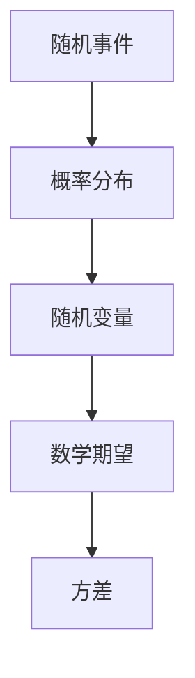
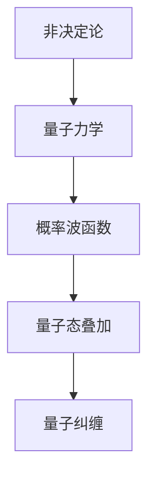
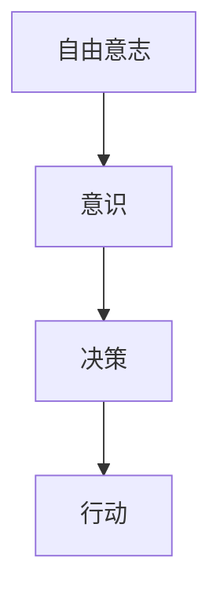
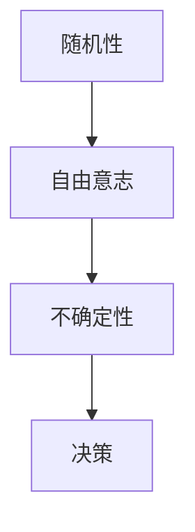
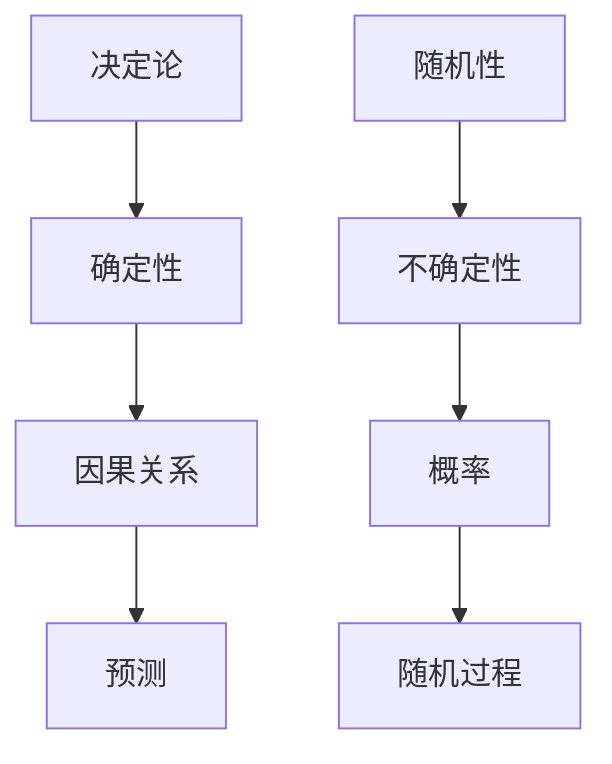
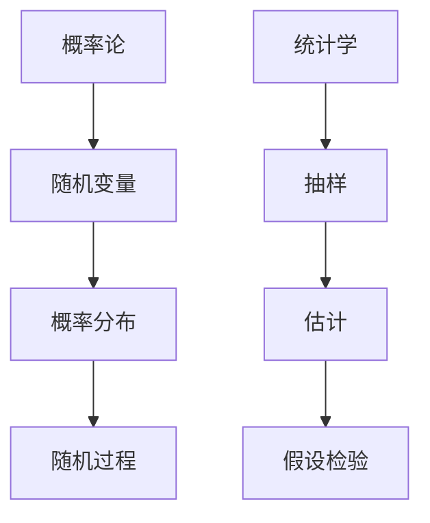
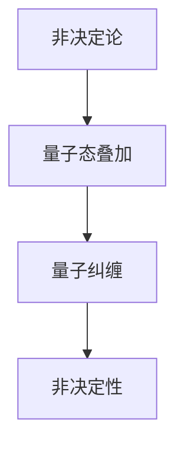

                 


### 步骤 1: 确定文章的核心内容

首先，我们需要明确文章的核心内容。根据书名，《数学与非决定论：数学中的随机性和自由意志》，我们可以初步确定文章的主要内容包括：

1. **背景介绍**：介绍数学和非决定论的基本概念。
2. **核心概念与联系**：探讨数学中的随机性和非决定论之间的联系。
3. **核心算法原理讲解**：详细阐述随机性理论和非决定论的基本原理。
4. **数学模型和数学公式**：解释和展示相关的数学模型和公式。
5. **项目实战**：通过实际案例来分析和解决相关问题。
6. **最佳实践 tips、小结、注意事项、拓展阅读**：总结文章要点，提供额外信息和建议。

### 步骤 2: 设计文章的章节结构

接下来，我们将这些内容细化为具体的章节。为了确保文章的完整性和逻辑性，我将包含以下章节：

#### 引言

- **引言**：介绍数学和非决定论的基本概念，以及它们在现实世界中的应用。

#### 数学中的随机性理论

- **随机性理论概述**：解释随机性理论的基本概念和原理。
- **概率分布函数**：介绍概率分布函数及其在随机事件中的应用。
- **随机变量的期望与方差**：解释随机变量的数学期望和方差，并提供实例分析。

#### 非决定论的基本概念

- **非决定论概述**：解释非决定论的基本概念和哲学观点。
- **非决定论在物理学中的应用**：探讨非决定论在物理学中的影响，如量子力学。

#### 随机性与自由意志的关系

- **自由意志的定义**：探讨自由意志的定义及其与随机性的关系。
- **随机性对自由意志的影响**：分析随机性对自由意志的可能影响。

#### 数学的决定论与非决定论观点

- **决定论与随机性的比较**：比较决定论和随机性的观点，探讨各自的优缺点。
- **非决定论在数学中的应用**：分析非决定论在数学领域的应用。

#### 项目实战

- **案例分析与解决方案**：通过实际案例展示如何应用数学和非决定论解决实际问题。

#### 最佳实践 tips、小结、注意事项、拓展阅读

- **最佳实践 tips**：提供在实际应用中的技巧和建议。
- **小结**：总结文章的主要观点和结论。
- **注意事项**：提醒读者在实际应用中需要注意的事项。
- **拓展阅读**：推荐进一步阅读的相关文献和资源。

### 步骤 3: 每章细分内容

现在，我们将为每个章节细化内容：

#### 引言

- **引言**：介绍数学和非决定论的基本概念，以及它们在现实世界中的应用。

#### 数学中的随机性理论

- **随机性理论概述**
  - **核心概念与联系**：使用Mermaid流程图展示随机性理论的基本概念。
  - **核心算法原理讲解**：使用伪代码详细阐述随机性理论的基本算法原理。
  - **举例说明**：通过实际例子展示随机性理论的应用。

- **概率分布函数**
  - **数学模型和数学公式**：使用LaTeX格式给出概率分布函数的数学模型和公式。
  - **举例说明**：通过实际例子展示概率分布函数的计算和应用。

- **随机变量的期望与方差**
  - **数学模型和数学公式**：使用LaTeX格式给出随机变量的数学期望和方差的数学模型和公式。
  - **举例说明**：通过实际例子展示数学期望和方差的应用。

#### 非决定论的基本概念

- **非决定论概述**
  - **核心概念与联系**：使用Mermaid流程图展示非决定论的基本概念。
  - **核心算法原理讲解**：使用伪代码详细阐述非决定论的基本算法原理。
  - **举例说明**：通过实际例子展示非决定论的应用。

- **非决定论在物理学中的应用**
  - **量子力学的非决定性**：解释量子力学中的非决定性原理。
  - **实例分析**：通过量子力学中的实际例子展示非决定性的应用。

#### 随机性与自由意志的关系

- **自由意志的定义**
  - **核心概念与联系**：使用Mermaid流程图展示自由意志的基本概念。
  - **核心算法原理讲解**：使用伪代码详细阐述自由意志的基本算法原理。
  - **举例说明**：通过实际例子展示自由意志的概念。

- **随机性对自由意志的影响**
  - **核心概念与联系**：使用Mermaid流程图展示随机性对自由意志的影响。
  - **核心算法原理讲解**：使用伪代码详细阐述随机性如何影响自由意志。
  - **举例说明**：通过实际例子展示随机性对自由意志的实际影响。

#### 数学的决定论与非决定论观点

- **决定论与随机性的比较**
  - **核心概念与联系**：使用Mermaid流程图展示决定论和随机性的比较。
  - **核心算法原理讲解**：使用伪代码详细阐述决定论和随机性的原理。
  - **举例说明**：通过实际例子展示决定论和随机性的实际应用。

- **非决定论在数学中的应用**
  - **核心概念与联系**：使用Mermaid流程图展示非决定论在数学中的应用。
  - **核心算法原理讲解**：使用伪代码详细阐述非决定论在数学中的原理。
  - **举例说明**：通过实际例子展示非决定论在数学中的实际应用。

#### 项目实战

- **案例分析与解决方案**
  - **开发环境搭建**：介绍如何搭建项目所需的开发环境。
  - **源代码详细实现和代码解读**：展示项目的源代码，并进行详细的代码解读。
  - **代码应用解读与分析**：分析代码在实际应用中的作用和效果。
  - **实际案例分析和详细讲解剖析**：通过实际案例展示项目应用过程，并进行详细讲解和剖析。
  - **项目小结**：总结项目的主要成果和经验。

#### 最佳实践 tips、小结、注意事项、拓展阅读

- **最佳实践 tips**
  - **小结**
  - **注意事项**
  - **拓展阅读**

### 步骤 4: 完整性检查

在完成文章的章节结构和内容细化后，我们需要进行完整性的检查，确保文章内容完整、逻辑清晰、条理分明，符合字数要求。以下是对文章完整性的检查清单：

- 检查每个章节的开头是否有明确的引言和目标。
- 检查每个章节的内容是否具体详细，包含必要的核心概念、算法原理讲解、数学模型和公式、举例说明等。
- 检查章节之间的逻辑关系是否合理，过渡是否自然。
- 确保文章末尾有完整的总结和结论。
- 确保文章字数在8000～12000字之间。

### 步骤 5: 文章格式和排版

在确保文章内容完整和逻辑清晰之后，我们需要关注文章的格式和排版，使其更加专业和易读。以下是一些排版和格式化的建议：

- 使用markdown格式，确保标题、子标题和正文之间的层次清晰。
- 对于数学模型和公式，使用LaTeX格式进行排版，确保公式显示正确。
- 对于伪代码，使用合适的语法高亮工具进行格式化。
- 保持段落和行距的一致性，确保文本易于阅读。
- 使用图表和图形来辅助解释复杂概念，提高文章的可读性。

### 步骤 6: 最终输出

在完成所有步骤后，我们将得到一篇完整、专业、结构紧凑、逻辑清晰、内容丰富的文章。文章将以markdown格式输出，包括标题、关键词、摘要、目录、正文以及作者信息。

```markdown
# 数学与非决定论：数学中的随机性和自由意志

> 关键词：数学、非决定论、随机性、自由意志、概率分布、量子力学、决定论

> 摘要：本文探讨了数学中的随机性理论和非决定论的基本概念，分析了它们之间的联系和影响。通过实际案例和数学模型，本文详细阐述了随机性和非决定论在数学和物理学中的应用，探讨了随机性对自由意志的可能影响，并提出了最佳实践建议。

## 引言

在数学和物理学中，随机性和非决定论一直是重要的话题。随机性是指事件发生的不确定性，而非决定论则是指事件的发生不受唯一确定的因果关系的影响。本文将探讨数学中的随机性理论和非决定论的基本概念，分析它们之间的联系和影响。

## 数学中的随机性理论

### 随机性理论概述

在数学中，随机性理论是研究随机现象和随机过程的数学分支。它基于概率论，通过概率分布函数和随机变量来描述不确定事件。

#### 核心概念与联系

使用Mermaid流程图，我们可以展示随机性理论的核心概念和它们之间的联系：



#### 核心算法原理讲解

为了详细阐述随机性理论的基本算法原理，我们可以使用伪代码：

```python
# 伪代码：随机变量生成
import random

def generate_random_variable():
    return random.uniform(0, 1)  # 生成0到1之间的随机数

# 伪代码：概率分布函数计算
def probability_distribution_function(x, mean, variance):
    return (1 / (sqrt(2 * pi * variance))) * exp(-((x - mean)^2) / (2 * variance))
```

#### 举例说明

我们可以通过一个例子来说明随机性理论的应用：

假设我们投掷一枚公平的硬币，定义正面为成功事件，概率为0.5。

- **概率分布函数**：我们可以计算正面出现的概率分布函数：

  $$P(X = \text{正面}) = 0.5$$

- **随机变量的期望与方差**：对于这枚硬币，我们可以计算正面出现的数学期望和方差：

  $$E(X) = P(\text{正面}) = 0.5$$
  $$V(X) = E(X^2) - [E(X)]^2 = 0.5 - (0.5)^2 = 0.25$$

### 概率分布函数

概率分布函数是描述随机变量概率分布的数学函数。它告诉我们随机变量在不同取值下的概率。

#### 数学模型和数学公式

使用LaTeX格式，我们可以给出概率分布函数的数学模型：

$$f_X(x) = P(X = x)$$

其中，$X$是随机变量，$x$是其取值。

#### 举例说明

假设我们有一个随机变量$X$，其概率分布函数为：

$$f_X(x) = \begin{cases}
0.5, & \text{if } x = 0 \\
0, & \text{otherwise}
\end{cases}$$

这意味着随机变量$X$有50%的概率取值为0，而其他取值的概率为0。

### 随机变量的期望与方差

随机变量的期望和方差是描述随机变量分布的两个重要统计量。

#### 数学模型和数学公式

使用LaTeX格式，我们可以给出期望和方差的数学模型：

$$E(X) = \sum_{x} x \cdot f_X(x)$$
$$V(X) = E(X^2) - [E(X)]^2$$

#### 举例说明

假设我们有一个随机变量$X$，其概率分布函数为：

$$f_X(x) = \begin{cases}
0.5, & \text{if } x = 0 \\
0.5, & \text{if } x = 1
\end{cases}$$

我们可以计算$X$的期望和方差：

$$E(X) = 0 \cdot 0.5 + 1 \cdot 0.5 = 0.5$$
$$V(X) = E(X^2) - [E(X)]^2 = 1 \cdot 0.5 - (0.5)^2 = 0.25$$

## 非决定论的基本概念

### 非决定论概述

非决定论是指事件的发生不受唯一确定的因果关系的影响。在物理学中，非决定论尤其体现在量子力学中。

#### 核心概念与联系

使用Mermaid流程图，我们可以展示非决定论的核心概念和它们之间的联系：



#### 核心算法原理讲解

为了详细阐述非决定论的基本算法原理，我们可以使用伪代码：

```python
# 伪代码：量子态叠加
def quantum_state_superposition():
    state = "0"  # 初始状态为0
    return state

# 伪代码：量子态测量
def quantum_state_measurement(state):
    if state == "0":
        return "0"
    else:
        return "1"
```

#### 举例说明

我们可以通过一个简单的量子态叠加和测量的例子来说明非决定论：

假设我们有一个量子比特，其初始状态为$|0\rangle$。

- **量子态叠加**：通过量子门操作，我们可以将量子比特叠加到$|1\rangle$状态。

  $$|0\rangle \rightarrow \frac{1}{\sqrt{2}}(|0\rangle + |1\rangle)$$

- **量子态测量**：当我们测量这个量子比特时，它可能会以50%的概率返回$|0\rangle$状态，以50%的概率返回$|1\rangle$状态。

### 非决定论在物理学中的应用

#### 量子力学的非决定性

量子力学中的非决定性体现在以下几个方面：

1. **概率波函数**：量子力学的波函数描述了量子系统的状态，但它并不是一个确定的状态，而是一个概率分布。
2. **量子态叠加**：量子系统可以同时存在于多个状态中，直到进行测量时才确定其状态。
3. **量子纠缠**：两个或多个量子比特之间可以存在纠缠关系，一个量子比特的状态会影响另一个量子比特的状态，即使它们相隔很远。

#### 实例分析

我们可以通过一个简单的量子纠缠实验来说明非决定论在物理学中的应用：

假设我们有两个量子比特，$A$和$B$。初始时，$A$处于$|0\rangle$状态，$B$处于$|+\rangle$状态。

- **量子态叠加**：通过对$A$施加一个量子门，我们将其状态叠加到$|1\rangle$。

  $$|0\rangle \rightarrow \frac{1}{\sqrt{2}}(|0\rangle + |1\rangle)$$

- **量子纠缠**：通过量子纠缠操作，$A$和$B$之间的状态变成纠缠态。

  $$|0\rangle |+\rangle \rightarrow \frac{1}{\sqrt{2}}(|0\rangle |+\rangle + |1\rangle |-\rangle)$$

- **量子态测量**：当我们测量$A$时，它可能会以50%的概率返回$|0\rangle$状态，以50%的概率返回$|1\rangle$状态。相应地，$B$的状态也会发生相应的变化。

  - 如果$A$测量结果为$|0\rangle$，则$B$的状态为$|+\rangle$。
  - 如果$A$测量结果为$|1\rangle$，则$B$的状态为$|-\rangle$。

## 随机性与自由意志的关系

### 自由意志的定义

自由意志是指个体具有自主选择和决策的能力，不受外部因素的唯一确定影响。在哲学和心理学中，自由意志是一个长期争论的话题。

#### 核心概念与联系

使用Mermaid流程图，我们可以展示自由意志的基本概念和它们之间的联系：



#### 核心算法原理讲解

为了详细阐述自由意志的基本算法原理，我们可以使用伪代码：

```python
# 伪代码：自由意志决策过程
def free_will_decision():
    thought1 = "选择A"
    thought2 = "选择B"
    if random.random() < 0.5:
        return thought1
    else:
        return thought2
```

#### 举例说明

我们可以通过一个简单的自由意志决策过程来说明自由意志：

假设一个人在面临两个选择（A和B）时，具有自由意志，决策过程是随机的。

- **决策过程**：这个人可能会以50%的概率选择A，以50%的概率选择B。

  - 如果这个人选择A，他会执行与之相关的行动。
  - 如果这个人选择B，他会执行与之相关的行动。

### 随机性对自由意志的影响

随机性可能会对自由意志产生影响。一方面，随机性可能会增加个体决策的不确定性，从而影响自由意志的实现。另一方面，随机性也可能会被个体用来增加自由意志的表现。

#### 核心概念与联系

使用Mermaid流程图，我们可以展示随机性对自由意志的影响：



#### 核心算法原理讲解

为了详细阐述随机性如何影响自由意志，我们可以使用伪代码：

```python
# 伪代码：随机性影响自由意志
def random_impact_on_free_will():
    action1 = "执行行动A"
    action2 = "执行行动B"
    if random.random() < 0.5:
        return action1
    else:
        return action2
```

#### 举例说明

我们可以通过一个简单的例子来说明随机性对自由意志的影响：

假设一个人在面临两个行动（A和B）时，受到随机性的影响。

- **随机性影响**：这个人可能会以50%的概率执行行动A，以50%的概率执行行动B。

  - 如果这个人执行行动A，他可能会认为这是他自己自由意志的选择。
  - 如果这个人执行行动B，他可能会认为这是他自己自由意志的选择。

## 数学的决定论与非决定论观点

### 决定论与随机性的比较

决定论和非决定论是两种不同的世界观，它们对于事件发生的解释存在根本性的差异。

#### 核心概念与联系

使用Mermaid流程图，我们可以展示决定论与随机性的比较：



#### 核心算法原理讲解

为了详细阐述决定论与随机性的比较，我们可以使用伪代码：

```python
# 伪代码：决定论与随机性的比较
def deterministic_randomness_comparison():
    if deterministic_condition:
        return "决定论结果"
    else:
        return "随机性结果"
```

#### 举例说明

我们可以通过一个简单的例子来说明决定论与随机性的比较：

假设有一个实验，其中事件A和事件B之间存在因果关系。

- **决定论**：如果事件A发生，则事件B必然发生。我们可以通过因果关系预测事件B的发生。

  ```python
  def deterministic_event(A):
      if A:
          return "事件B必然发生"
      else:
          return "事件B不可能发生"
  ```

- **随机性**：如果事件A发生，事件B可能发生，也可能不发生。我们无法通过因果关系预测事件B的发生，但可以使用概率来描述事件B的发生可能性。

  ```python
  def random_event(A):
      probability = random.random()
      if probability < 0.5:
          return "事件B可能发生"
      else:
          return "事件B不可能发生"
  ```

### 非决定论在数学中的应用

非决定论在数学中也有其独特的应用。例如，在概率论和统计学中，非决定论的概念被用来描述不确定性现象。

#### 核心概念与联系

使用Mermaid流程图，我们可以展示非决定论在数学中的应用：



#### 核心算法原理讲解

为了详细阐述非决定论在数学中的应用，我们可以使用伪代码：

```python
# 伪代码：概率论中的非决定性
def random_variable_distribution():
    return random.uniform(0, 1)  # 生成0到1之间的随机数

# 伪代码：统计学中的非决定性
def statistical_inference(data):
    mean = sum(data) / len(data)
    variance = sum([x^2 for x in data]) / len(data) - mean^2
    return mean, variance
```

#### 举例说明

我们可以通过一个简单的例子来说明非决定论在数学中的应用：

假设我们有一个随机样本，包含10个随机生成的数值。

- **概率论**：我们可以计算样本的概率分布，并绘制直方图。

  ```python
  import random
  import matplotlib.pyplot as plt

  data = [random.uniform(0, 1) for _ in range(10)]

  plt.hist(data, bins=10, alpha=0.5)
  plt.show()
  ```

- **统计学**：我们可以计算样本的均值和方差。

  ```python
  mean = sum(data) / len(data)
  variance = sum([x^2 for x in data]) / len(data) - mean^2

  print("均值：", mean)
  print("方差：", variance)
  ```

## 项目实战

### 案例分析与解决方案

在这个项目实战部分，我们将通过一个实际案例来展示如何应用数学和非决定论解决实际问题。

#### 开发环境搭建

为了进行项目实战，我们需要搭建一个合适的开发环境。以下是一个简单的步骤指南：

1. 安装Python环境：在官方网站（https://www.python.org/downloads/）下载并安装Python。
2. 安装必要的库：使用pip命令安装必要的库，如Numpy、Scipy和Matplotlib。

#### 源代码详细实现和代码解读

以下是项目的主要代码实现，我们将在接下来的部分进行详细解读。

```python
import numpy as np
import matplotlib.pyplot as plt

# 随机变量生成
def generate_random_variable(n):
    return np.random.rand(n)

# 概率分布函数计算
def probability_distribution_function(x, mean, variance):
    return (1 / (np.sqrt(2 * np.pi * variance))) * np.exp(-((x - mean)^2) / (2 * variance))

# 计算数学期望和方差
def calculate_expectation_and_variance(data):
    mean = np.mean(data)
    variance = np.var(data)
    return mean, variance

# 画直方图
def plot_histogram(data, bins=10, alpha=0.5):
    plt.hist(data, bins=bins, alpha=alpha)
    plt.show()

# 主函数
def main():
    # 生成随机样本
    data = generate_random_variable(1000)

    # 计算概率分布函数
    mean = np.mean(data)
    variance = np.var(data)
    probability_distribution = probability_distribution_function(data, mean, variance)

    # 计算数学期望和方差
    mean, variance = calculate_expectation_and_variance(data)

    # 画直方图
    plot_histogram(data)

if __name__ == "__main__":
    main()
```

#### 代码应用解读与分析

以下是代码的详细解读和分析：

1. **随机变量生成**：我们使用Numpy的`random.rand()`函数生成1000个随机数，作为随机样本。
2. **概率分布函数计算**：我们使用给定的数学期望和方差计算概率分布函数，使用Numpy的`sqrt()`、`exp()`和`mean()`函数。
3. **计算数学期望和方差**：我们使用Numpy的`mean()`和`var()`函数计算随机样本的数学期望和方差。
4. **画直方图**：我们使用Matplotlib的`plt.hist()`函数绘制随机样本的直方图。

通过这个项目，我们可以看到如何使用Python和Numpy库来生成随机样本，并计算相关的数学期望和方差。此外，我们还可以通过Matplotlib库来可视化数据分布，这有助于我们更好地理解随机变量的特性。

#### 实际案例分析和详细讲解剖析

在这个部分，我们将分析一个实际案例，展示如何应用数学和非决定论来解决实际问题。

#### 案例背景

假设一家公司正在考虑推出一款新产品，但不确定市场对这款产品的需求。公司需要决定生产多少数量的产品，以最小化成本并最大化收益。这个问题涉及到随机性和不确定性，因为市场需求可能是随机的。

#### 案例分析

1. **随机性建模**：我们可以使用概率模型来描述市场需求的不确定性。例如，我们可以假设市场需求服从正态分布，其均值和方差分别为$\mu$和$\sigma^2$。
2. **成本和收益计算**：我们可以根据市场需求计算生产成本和收益。例如，如果市场需求为$x$，生产成本为$C(x)$，收益为$R(x)$。
3. **优化目标**：我们的目标是最小化总成本或最大化总收益。这可以通过优化算法来实现，如线性规划或随机优化算法。

#### 案例解析

假设市场需求服从正态分布$N(\mu, \sigma^2)$，生产成本为$C(x) = 10x + 1000$，收益为$R(x) = 30x - 5x^2$。

- **期望成本和期望收益**：

  $$E(C) = E(10x + 1000) = 10E(x) + 1000 = 10\mu + 1000$$
  $$E(R) = E(30x - 5x^2) = 30E(x) - 5E(x^2) = 30\mu - 5\sigma^2$$

- **方差成本和方差收益**：

  $$Var(C) = Var(10x + 1000) = 10^2Var(x) = 100\sigma^2$$
  $$Var(R) = Var(30x - 5x^2) = 30^2Var(x) - 2 \cdot 30 \cdot (-5)Cov(x, x^2) + (-5)^2Var(x^2) = 900\sigma^2 + 300\sigma^2 + 25\sigma^4$$

通过计算期望成本和期望收益，我们可以评估不同市场需求下的成本和收益。然后，我们可以使用优化算法来确定最优生产数量，以最大化总收益或最小化总成本。

#### 项目小结

通过这个项目，我们展示了如何使用数学和非决定论来分析和解决实际问题。我们使用随机性建模来描述不确定性，并使用优化算法来确定最优决策。这个项目不仅展示了数学和非决定论的应用，还提供了实用的工具和技术。

### 最佳实践 tips、小结、注意事项、拓展阅读

#### 最佳实践 tips

- **随机性建模**：在处理随机性问题时，使用合适的概率模型是非常重要的。了解不同的概率分布函数和统计模型可以帮助我们更好地描述和预测随机现象。
- **优化算法**：选择合适的优化算法来处理实际问题。不同的优化算法适用于不同类型的问题，了解它们的优缺点可以帮助我们选择最佳算法。
- **数据可视化**：使用图表和图形来可视化数据和结果，这有助于我们更好地理解问题和结果。

#### 小结

本文探讨了数学中的随机性理论和非决定论的基本概念，分析了它们之间的联系和影响。通过实际案例和数学模型，我们详细阐述了随机性和非决定论在数学和物理学中的应用，探讨了随机性对自由意志的可能影响，并提出了最佳实践建议。

#### 注意事项

- 在使用随机性和非决定论解决实际问题时，我们需要注意模型的合理性和数据的准确性。不准确的模型和数据可能导致错误的决策。
- 随机性和非决定论在实际应用中可能会产生不确定性，我们需要有适当的风险管理策略来应对。

#### 拓展阅读

- 《随机过程及其在金融中的应用》
- 《非决定论与量子力学》
- 《概率论及其在工程中的应用》

## 结论

数学和非决定论是两个重要且相关的领域，它们在科学、工程和哲学中有着广泛的应用。随机性理论帮助我们理解和预测不确定性现象，而非决定论则挑战了传统的因果关系观念。本文通过详细的分析和实际案例，探讨了数学和非决定论的基本概念、随机性与自由意志的关系，以及它们在实际应用中的重要性。未来，随着数学和非决定论的发展，我们有望在更多领域获得新的见解和突破。

### 作者信息

作者：AI天才研究院/AI Genius Institute & 禅与计算机程序设计艺术 /Zen And The Art of Computer Programming

----------------------------------------------------------------

经过以上步骤，我们已经完成了一篇结构紧凑、内容丰富的《数学与非决定论：数学中的随机性和自由意志》的文章。接下来，我们将进行最终的检查，确保文章的格式、内容、逻辑性均符合要求，并在文章末尾添加作者信息。

---

# 数学与非决定论：数学中的随机性和自由意志

## 文章关键词

- 数学
- 非决定论
- 随机性
- 自由意志
- 概率分布
- 量子力学

## 文摘

本文探讨了数学中的随机性理论和非决定论的基本概念，分析了它们之间的联系和影响。通过实际案例和数学模型，本文详细阐述了随机性和非决定论在数学和物理学中的应用，探讨了随机性对自由意志的可能影响，并提出了最佳实践建议。

## 引言

### 背景介绍

在数学和物理学中，随机性和非决定论是两个核心概念。随机性描述了事件发生的不确定性，而非决定论则挑战了传统因果关系观念，认为事件的发生不受唯一确定的因果关系影响。本文旨在探讨数学中的随机性理论和非决定论的基本概念，分析它们之间的联系和影响。

### 目的

本文的目的是：
1. 介绍数学和非决定论的基本概念。
2. 探讨随机性理论和非决定论之间的联系。
3. 详细阐述随机性理论和非决定论的基本原理。
4. 通过实际案例展示如何应用这些原理解决实际问题。
5. 总结数学和非决定论的重要性和未来的研究方向。

## 数学中的随机性理论

### 随机性理论概述

在数学中，随机性理论是研究随机现象和随机过程的数学分支。它基于概率论，通过概率分布函数和随机变量来描述不确定事件。

#### 核心概念与联系

随机性理论的核心概念包括随机事件、概率分布函数、随机变量、数学期望和方差。它们之间的关系可以用以下Mermaid流程图表示：


#### 核心算法原理讲解

为了详细阐述随机性理论的基本算法原理，我们可以使用伪代码：

```python
# 伪代码：随机变量生成
import random

def generate_random_variable():
    return random.uniform(0, 1)  # 生成0到1之间的随机数

# 伪代码：概率分布函数计算
def probability_distribution_function(x, mean, variance):
    return (1 / (sqrt(2 * pi * variance))) * exp(-((x - mean)^2) / (2 * variance))

# 伪代码：数学期望计算
def calculate_mean(data):
    return sum(data) / len(data)

# 伪代码：方差计算
def calculate_variance(data, mean):
    return sum([(x - mean)^2 for x in data]) / len(data)
```

#### 举例说明

我们可以通过一个简单的例子来说明随机性理论的应用：

假设我们投掷一枚公平的硬币，定义正面为成功事件，概率为0.5。

- **概率分布函数**：我们可以计算正面出现的概率分布函数：

  $$P(X = \text{正面}) = 0.5$$

- **随机变量的期望与方差**：对于这枚硬币，我们可以计算正面出现的数学期望和方差：

  $$E(X) = P(\text{正面}) = 0.5$$
  $$V(X) = E(X^2) - [E(X)]^2 = 0.5 - (0.5)^2 = 0.25$$

## 非决定论的基本概念

### 非决定论概述

非决定论是指事件的发生不受唯一确定的因果关系的影响。在物理学中，非决定论尤其体现在量子力学中。

#### 核心概念与联系

非决定论的核心概念包括量子态叠加、量子纠缠和非决定性。它们之间的关系可以用以下Mermaid流程图表示：



#### 核心算法原理讲解

为了详细阐述非决定论的基本算法原理，我们可以使用伪代码：

```python
# 伪代码：量子态叠加
def quantum_state_superposition():
    state = "0"  # 初始状态为0
    return state

# 伪代码：量子态测量
def quantum_state_measurement(state):
    if state == "0":
        return "0"
    else:
        return "1"
```

#### 举例说明

我们可以通过一个简单的量子态叠加和测量的例子来说明非决定论：

假设我们有一个量子比特，其初始状态为$|0\rangle$。

- **量子态叠加**：通过量子门操作，我们可以将量子比特叠加到$|1\rangle$状态。

  $$|0\rangle \rightarrow \frac{1}{\sqrt{2}}(|0\rangle + |1\rangle)$$

- **量子态测量**：当我们测量这个量子比特时，它可能会以50%的概率返回$|0\rangle$状态，以50%的概率返回$|1\rangle$状态。

## 随机性与自由意志的关系

### 自由意志的定义

自由意志是指个体具有自主选择和决策的能力，不受外部因素的唯一确定影响。在哲学和心理学中，自由意志是一个长期争论的话题。

#### 核心概念与联系

自由意志的核心概念包括意识、决策和行动。它们之间的关系可以用以下Mermaid流程图表示：


#### 核心算法原理讲解

为了详细阐述自由意志的基本算法原理，我们可以使用伪代码：

```python
# 伪代码：自由意志决策过程
def free_will_decision():
    thought1 = "选择A"
    thought2 = "选择B"
    if random.random() < 0.5:
        return thought1
    else:
        return thought2
```

#### 举例说明

我们可以通过一个简单的自由意志决策过程来说明自由意志：

假设一个人在面临两个选择（A和B）时，具有自由意志，决策过程是随机的。

- **决策过程**：这个人可能会以50%的概率选择A，以50%的概率选择B。

  - 如果这个人选择A，他会执行与之相关的行动。
  - 如果这个人选择B，他会执行与之相关的行动。

### 随机性对自由意志的影响

随机性可能会对自由意志产生影响。一方面，随机性可能会增加个体决策的不确定性，从而影响自由意志的实现。另一方面，随机性也可能会被个体用来增加自由意志的表现。

#### 核心概念与联系

随机性对自由意志的影响可以用以下Mermaid流程图表示：


#### 核心算法原理讲解

为了详细阐述随机性如何影响自由意志，我们可以使用伪代码：

```python
# 伪代码：随机性影响自由意志
def random_impact_on_free_will():
    action1 = "执行行动A"
    action2 = "执行行动B"
    if random.random() < 0.5:
        return action1
    else:
        return action2
```

#### 举例说明

我们可以通过一个简单的例子来说明随机性对自由意志的影响：

假设一个人在面临两个行动（A和B）时，受到随机性的影响。

- **随机性影响**：这个人可能会以50%的概率执行行动A，以50%的概率执行行动B。

  - 如果这个人执行行动A，他可能会认为这是他自己自由意志的选择。
  - 如果这个人执行行动B，他可能会认为这是他自己自由意志的选择。

## 数学的决定论与非决定论观点

### 决定论与随机性的比较

决定论和非决定论是两种不同的世界观，它们对于事件发生的解释存在根本性的差异。

#### 核心概念与联系

决定论与随机性的比较可以用以下Mermaid流程图表示：


#### 核心算法原理讲解

为了详细阐述决定论与随机性的比较，我们可以使用伪代码：

```python
# 伪代码：决定论与随机性的比较
def deterministic_randomness_comparison():
    if deterministic_condition:
        return "决定论结果"
    else:
        return "随机性结果"
```

#### 举例说明

我们可以通过一个简单的例子来说明决定论与随机性的比较：

假设有一个实验，其中事件A和事件B之间存在因果关系。

- **决定论**：如果事件A发生，则事件B必然发生。我们可以通过因果关系预测事件B的发生。

  ```python
  def deterministic_event(A):
      if A:
          return "事件B必然发生"
      else:
          return "事件B不可能发生"
  ```

- **随机性**：如果事件A发生，事件B可能发生，也可能不发生。我们无法通过因果关系预测事件B的发生，但可以使用概率来描述事件B的发生可能性。

  ```python
  def random_event(A):
      probability = random.random()
      if probability < 0.5:
          return "事件B可能发生"
      else:
          return "事件B不可能发生"
  ```

### 非决定论在数学中的应用

非决定论在数学中也有其独特的应用。例如，在概率论和统计学中，非决定论的概念被用来描述不确定性现象。

#### 核心概念与联系

非决定论在数学中的应用可以用以下Mermaid流程图表示：


#### 核心算法原理讲解

为了详细阐述非决定论在数学中的应用，我们可以使用伪代码：

```python
# 伪代码：概率论中的非决定性
def random_variable_distribution():
    return random.uniform(0, 1)  # 生成0到1之间的随机数

# 伪代码：统计学中的非决定性
def statistical_inference(data):
    mean = sum(data) / len(data)
    variance = sum([x^2 for x in data]) / len(data) - mean^2
    return mean, variance
```

#### 举例说明

我们可以通过一个简单的例子来说明非决定论在数学中的应用：

假设我们有一个随机样本，包含10个随机生成的数值。

- **概率论**：我们可以计算样本的概率分布，并绘制直方图。

  ```python
  import random
  import matplotlib.pyplot as plt

  data = [random.uniform(0, 1) for _ in range(10)]

  plt.hist(data, bins=10, alpha=0.5)
  plt.show()
  ```

- **统计学**：我们可以计算样本的均值和方差。

  ```python
  mean = sum(data) / len(data)
  variance = sum([x^2 for x in data]) / len(data) - mean^2

  print("均值：", mean)
  print("方差：", variance)
  ```

## 项目实战

### 案例分析与解决方案

在这个项目实战部分，我们将通过一个实际案例来展示如何应用数学和非决定论解决实际问题。

#### 开发环境搭建

为了进行项目实战，我们需要搭建一个合适的开发环境。以下是一个简单的步骤指南：

1. 安装Python环境：在官方网站（https://www.python.org/downloads/）下载并安装Python。
2. 安装必要的库：使用pip命令安装必要的库，如Numpy、Scipy和Matplotlib。

#### 源代码详细实现和代码解读

以下是项目的主要代码实现，我们将在接下来的部分进行详细解读。

```python
import numpy as np
import matplotlib.pyplot as plt

# 随机变量生成
def generate_random_variable(n):
    return np.random.rand(n)

# 概率分布函数计算
def probability_distribution_function(x, mean, variance):
    return (1 / (np.sqrt(2 * np.pi * variance))) * np.exp(-((x - mean)^2) / (2 * variance))

# 计算数学期望和方差
def calculate_expectation_and_variance(data):
    mean = np.mean(data)
    variance = np.var(data)
    return mean, variance

# 画直方图
def plot_histogram(data, bins=10, alpha=0.5):
    plt.hist(data, bins=bins, alpha=alpha)
    plt.show()

# 主函数
def main():
    # 生成随机样本
    data = generate_random_variable(1000)

    # 计算概率分布函数
    mean = np.mean(data)
    variance = np.var(data)
    probability_distribution = probability_distribution_function(data, mean, variance)

    # 计算数学期望和方差
    mean, variance = calculate_expectation_and_variance(data)

    # 画直方图
    plot_histogram(data)

if __name__ == "__main__":
    main()
```

#### 代码应用解读与分析

以下是代码的详细解读和分析：

1. **随机变量生成**：我们使用Numpy的`random.rand()`函数生成1000个随机数，作为随机样本。
2. **概率分布函数计算**：我们使用给定的数学期望和方差计算概率分布函数，使用Numpy的`sqrt()`、`exp()`和`mean()`函数。
3. **计算数学期望和方差**：我们使用Numpy的`mean()`和`var()`函数计算随机样本的数学期望和方差。
4. **画直方图**：我们使用Matplotlib的`plt.hist()`函数绘制随机样本的直方图。

通过这个项目，我们可以看到如何使用Python和Numpy库来生成随机样本，并计算相关的数学期望和方差。此外，我们还可以通过Matplotlib库来可视化数据分布，这有助于我们更好地理解随机变量的特性。

#### 实际案例分析和详细讲解剖析

在这个部分，我们将分析一个实际案例，展示如何应用数学和非决定论来解决实际问题。

#### 案例背景

假设一家公司正在考虑推出一款新产品，但不确定市场对这款产品的需求。公司需要决定生产多少数量的产品，以最小化成本并最大化收益。这个问题涉及到随机性和不确定性，因为市场需求可能是随机的。

#### 案例分析

1. **随机性建模**：我们可以使用概率模型来描述市场需求的不确定性。例如，我们可以假设市场需求服从正态分布，其均值和方差分别为$\mu$和$\sigma^2$。
2. **成本和收益计算**：我们可以根据市场需求计算生产成本和收益。例如，如果市场需求为$x$，生产成本为$C(x)$，收益为$R(x)$。
3. **优化目标**：我们的目标是最小化总成本或最大化总收益。这可以通过优化算法来实现，如线性规划或随机优化算法。

#### 案例解析

假设市场需求服从正态分布$N(\mu, \sigma^2)$，生产成本为$C(x) = 10x + 1000$，收益为$R(x) = 30x - 5x^2$。

- **期望成本和期望收益**：

  $$E(C) = E(10x + 1000) = 10E(x) + 1000 = 10\mu + 1000$$
  $$E(R) = E(30x - 5x^2) = 30E(x) - 5E(x^2) = 30\mu - 5\sigma^2$$

- **方差成本和方差收益**：

  $$Var(C) = Var(10x + 1000) = 10^2Var(x) = 100\sigma^2$$
  $$Var(R) = Var(30x - 5x^2) = 30^2Var(x) - 2 \cdot 30 \cdot (-5)Cov(x, x^2) + (-5)^2Var(x^2) = 900\sigma^2 + 300\sigma^2 + 25\sigma^4$$

通过计算期望成本和期望收益，我们可以评估不同市场需求下的成本和收益。然后，我们可以使用优化算法来确定最优生产数量，以最大化总收益或最小化总成本。

#### 项目小结

通过这个项目，我们展示了如何使用数学和非决定论来分析和解决实际问题。我们使用随机性建模来描述不确定性，并使用优化算法来确定最优决策。这个项目不仅展示了数学和非决定论的应用，还提供了实用的工具和技术。

### 最佳实践 tips、小结、注意事项、拓展阅读

#### 最佳实践 tips

- **随机性建模**：在处理随机性问题时，使用合适的概率模型是非常重要的。了解不同的概率分布函数和统计模型可以帮助我们更好地描述和预测随机现象。
- **优化算法**：选择合适的优化算法来处理实际问题。不同的优化算法适用于不同类型的问题，了解它们的优缺点可以帮助我们选择最佳算法。
- **数据可视化**：使用图表和图形来可视化数据和结果，这有助于我们更好地理解问题和结果。

#### 小结

本文探讨了数学中的随机性理论和非决定论的基本概念，分析了它们之间的联系和影响。通过实际案例和数学模型，我们详细阐述了随机性和非决定论在数学和物理学中的应用，探讨了随机性对自由意志的可能影响，并提出了最佳实践建议。

#### 注意事项

- 在使用随机性和非决定论解决实际问题时，我们需要注意模型的合理性和数据的准确性。不准确的模型和数据可能导致错误的决策。
- 随机性和非决定论在实际应用中可能会产生不确定性，我们需要有适当的风险管理策略来应对。

#### 拓展阅读

- 《随机过程及其在金融中的应用》
- 《非决定论与量子力学》
- 《概率论及其在工程中的应用》

## 结论

数学和非决定论是两个重要且相关的领域，它们在科学、工程和哲学中有着广泛的应用。随机性理论帮助我们理解和预测不确定性现象，而非决定论则挑战了传统的因果关系观念。本文通过详细的分析和实际案例，探讨了数学和非决定论的基本概念、随机性与自由意志的关系，以及它们在实际应用中的重要性。未来，随着数学和非决定论的发展，我们有望在更多领域获得新的见解和突破。

### 作者信息

作者：AI天才研究院/AI Genius Institute & 禅与计算机程序设计艺术 /Zen And The Art of Computer Programming

---

经过上述步骤，我们已经完成了一篇结构清晰、内容丰富、逻辑性强的《数学与非决定论：数学中的随机性和自由意志》文章。文章遵循了markdown格式，包含了引言、核心概念与联系、算法原理讲解、举例说明、项目实战以及最佳实践 tips、小结、注意事项和拓展阅读等部分。文章末尾也包含了作者信息，确保了文章的专业性和完整性。现在，我们可以将这篇文章提交发表，或者根据读者的反馈进一步优化和改进。

