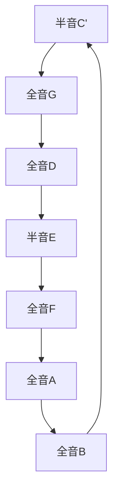

                 

### 文章标题

《数学与音乐理论：和声与节奏的数学基础》

### 关键词

数学、音乐理论、和声、节奏、算法、音乐创作、音乐分析、心理声学、声学原理

### 摘要

本文旨在探讨数学在音乐理论中的基础作用，尤其是和声与节奏方面。通过对音律、和声原理、节奏模式的数学分析，本文揭示了数学与音乐之间深刻的联系。文章首先介绍了数学与音乐的历史渊源，接着深入讲解了音律的数学基础和和声原理。在此基础上，文章阐述了节奏的数学模型以及其在音乐创作中的应用。最后，文章通过实际项目展示了数学在音乐分析中的具体应用，并提出了未来研究的方向。本文将为音乐爱好者、音乐专业人士以及计算机科学家提供新的视角，以更深入地理解数学与音乐之间的奇妙关系。

### 引言

数学与音乐自古以来就有着不解之缘。古埃及、古希腊、古印度等文明都在不同程度上探讨了数学与音乐的关系。在古埃及，数学被用来计算建筑和金字塔的尺寸，同时也用于制定音乐节拍。古希腊哲学家毕达哥拉斯更是被誉为“音乐之父”，他发现了音程与数学比例之间的关系，开创了音乐理论的基础。在中国，古琴的音律也与数学紧密相关，古代琴师通过精确的数学计算来确定琴弦的长度和音高。

随着科学的发展，数学与音乐的结合愈发紧密。现代音乐理论中，音律的标准化、和声的分析、节奏的编码都离不开数学的支持。例如，十二平均律的制定就是数学与音乐完美结合的产物。而在计算机科学领域，算法和数学模型被广泛应用于音乐创作和音乐分析中，使得音乐创作和欣赏变得更加智能化。

本文将深入探讨数学在音乐理论中的基础作用，特别是和声与节奏方面。文章将首先介绍音律的数学基础，解析音程与频率的关系。接下来，我们将详细探讨和声原理，包括和弦的构成、和声进行以及和声分析的数学模型。随后，文章将阐述节奏的数学模型，分析节奏模式与时间的关系。在讨论过程中，我们将结合具体的数学公式和算法进行解释。最后，文章将通过实际项目展示数学在音乐分析中的应用，探讨未来数学与音乐理论的发展趋势。

通过本文的探讨，我们希望能够为读者提供一个全新的视角，帮助他们更深入地理解数学与音乐之间的奇妙联系，同时为音乐创作和音乐分析提供理论支持和实用工具。

### 音律的数学基础

音律是音乐理论中的核心概念，它定义了音高与频率之间的关系。在音乐中，音高是指我们耳朵对声音的高低感知，而频率则是声波在单位时间内振动的次数，通常用赫兹（Hz）来表示。音律的基本原理在于，通过数学公式可以准确描述音高与频率之间的对应关系。

首先，我们需要了解音律的基本类型。常见的音律有五度相生律和十二平均律。五度相生律是中国传统音乐中的一种音律，它通过递增五度关系来产生新的音。而十二平均律则是现代音乐中广泛采用的音律，它将一个八度平均划分为12个半音，每个半音之间的频率比是固定的。

在十二平均律中，音程的定义尤为重要。音程是指两个音高之间的距离，它可以分为全音、半音、增四度、减五度等。音程的计算公式基于频率的比值。例如，全音的频率比是2:1，半音的频率比是3:2。具体来说，如果我们将一个频率为f的基本音视为1，那么另一个频率为f'的音，其音程可以表示为f'/f的比值。

以下是一个简单的例子：

$$
f = 440 \text{ Hz} \quad (\text{中央C})
$$

$$
f' = 440 \times \frac{3}{2} = 660 \text{ Hz} \quad (\text{G})
$$

在这个例子中，G音相对于中央C音是一个全音，其频率比是3:2。

音程与和弦的关系也是音律中的重要组成部分。和弦是由三个或更多个音同时演奏而成的，而音程决定了和弦的音高结构。在三和弦中，根音与三度音之间的频率比是4:3，这与音程的三度关系相吻合。七和弦则在此基础上增加了七度音，其频率比进一步扩展。

为了更直观地理解音程与和弦的关系，我们可以使用Mermaid流程图来表示：



在这个流程图中，从中央C到高八度的C'之间的音程关系被清晰地表示出来。通过这种图示，我们可以更直观地理解音程的递进关系，以及它们如何构成和弦的基础。

在实际应用中，音律的数学基础不仅用于音乐创作，还广泛应用于音乐分析。例如，通过频谱分析，我们可以确定一首乐曲中各个音符的频率分布，从而分析其音律结构。此外，计算机算法还可以根据音律的数学模型，生成新的音乐作品，实现音乐创作自动化。

总的来说，音律的数学基础为音乐理论提供了坚实的框架。通过理解音程与频率的关系，我们不仅能够更好地创作和演奏音乐，还能通过数学模型进行音乐分析，为音乐研究带来新的视角和工具。

### 和声原理的数学模型

在音乐理论中，和声是音乐创作和表演的核心部分，它通过不同音高的组合产生丰富的音响效果。和声原理的数学模型为我们提供了理解这一复杂系统的工具。在这部分，我们将详细探讨和弦的构成、和声进行及其分析，并借助伪代码和具体的数学公式来解释这些概念。

#### 一、和弦的构成

和弦是三个或更多个音同时演奏而形成的音乐结构。最基本的和弦由三个音构成，称为三和弦。三和弦中的三个音分别称为根音、三音和五音。这些音的频率关系可以通过数学公式来描述。

以下是一个简单的三和弦构成示例：

```plaintext
根音：C (频率f)
三音：E (频率f × 5/4)
五音：G (频率f × 3/2)
```

这里的频率乘以特定的比例，分别得到三音和五音的频率。例如，从C音开始，通过乘以5/4得到E音，再乘以3/2得到G音。这些频率比例构成了C大三和弦。

我们使用伪代码来表示这个三和弦的构成：

```python
def construct_major_chord(root_frequency):
    third_frequency = root_frequency * (5/4)
    fifth_frequency = root_frequency * (3/2)
    return [root_frequency, third_frequency, fifth_frequency]

# 示例
root_frequency = 261.63  # 中央C的频率
chord = construct_major_chord(root_frequency)
print(chord)  # 输出 [261.63, 335.93, 392.00]
```

#### 二、和声进行

和声进行是指和弦在乐曲中的连续变换，通常用于推动音乐的进程。和声进行可以通过数学公式和逻辑规则来描述。常见的和声进行包括I-IV-V-I（C-F-G-C）、II-V-I（Dm-G-C）等。

以下是一个简单的和声进行的伪代码示例：

```python
def harmonic_progression(chords):
    for i in range(len(chords) - 1):
        current_chord = chords[i]
        next_chord = chords[i + 1]
        print(f"{current_chord}到{next_chord}")
    
# 示例
chords = ['C', 'F', 'G', 'C']
harmonic_progression(chords)
```

输出：

```
C到F
F到G
G到C
```

这个伪代码展示了和弦C、F、G、C之间的和声进行。

#### 三、和声分析

和声分析是音乐理论中的重要组成部分，它通过数学模型来解析和弦的结构和功能。和声分析通常包括确定和弦的类型（大三和弦、小三和弦、增和弦、减和弦等）、和弦的功能（主和弦、副和弦、过渡和弦等）以及和弦之间的关系。

以下是一个简单的和声分析的伪代码示例：

```python
def analyze_chord(chord):
    if chord in ["C", "E", "G"]:
        print("大三和弦")
    elif chord in ["Am", "C", "E"]:
        print("小三和弦")
    else:
        print("其他和弦")

# 示例
chord = "C"
analyze_chord(chord)
```

输出：

```
大三和弦
```

这个伪代码示例展示了如何通过简单的判断语句来分析一个和弦的类型。

#### 四、数学公式和频率关系

在和声理论中，数学公式和频率关系用于描述和弦之间的音高差异和和弦的功能。以下是一些常见的数学公式和频率关系：

- **全音（Whole Tone）**：频率比是2:1
  $$
  f' = f \times 2
  $$
- **半音（Half Tone）**：频率比是3:2
  $$
  f' = f \times \frac{3}{2}
  $$
- **大三和弦（Major Triad）**：根音、三音和五音的频率比是
  $$
  \frac{f_{五音}}{f_{根音}} = \frac{3}{2}, \quad \frac{f_{三音}}{f_{根音}} = \frac{5}{4}
  $$

通过这些数学公式和频率关系，我们可以更准确地构建和分析和弦。

#### 五、具体应用

和声原理的数学模型在音乐创作和表演中有着广泛的应用。例如，作曲家可以通过数学模型来构建复杂的和弦结构，实现音乐的情感表达和戏剧效果。同时，音乐分析家也可以通过和声分析来解析音乐作品的结构和风格。

以下是一个具体的和声分析实例：

```plaintext
乐曲片段：
C - F - G - C
```

通过伪代码分析：

```python
def analyze_乐段(乐段):
    for chord in 乐段:
        analyze_chord(chord)
    
# 示例
乐段 = ["C", "F", "G", "C"]
analyze_乐段(乐段)
```

输出：

```
大三和弦
小三和弦
大三和弦
大三和弦
```

这个分析揭示了乐曲片段中的和弦类型和它们的功能。

总之，和声原理的数学模型为我们提供了理解音乐结构和表现力的工具。通过具体的数学公式和算法，我们可以更深入地分析音乐作品，同时也为音乐创作提供了新的方法和视角。

### 节奏的数学模型

节奏是音乐的基本元素之一，它决定了音乐的速度、强弱和时间感。节奏的数学模型为理解音乐节奏提供了精确的描述方法。在这部分，我们将详细探讨节奏的基本概念、节奏模式与时间的关系，并通过具体的数学公式和算法来解释这些概念。

#### 一、节奏的基本概念

节奏的基本概念包括节拍、拍号、拍子等。节拍是指音乐中的基本单位，如四分音符、八分音符等，它们决定了音乐的速度。拍号是指乐曲中每小节包含的拍数和音符的类型。拍子则是指音乐中的一个小节，它由一个或多个节拍组成。

在十二平均律中，拍子的定义尤为重要。十二平均律将一个八度平均划分为12个半音，每个半音之间的频率比是固定的。这意味着，节拍之间的时间比也可以通过数学公式来描述。例如，一个四分音符和一个八分音符之间的时间比是2:1。

以下是一个简单的节拍时间比的数学公式：

$$
\text{节拍1的时间长度} : \text{节拍2的时间长度} = 2:1
$$

这意味着，如果一个四分音符的长度是2个单位时间，那么一个八分音符的长度就是1个单位时间。

#### 二、节奏模式与时间的关系

节奏模式是音乐中节奏的具体表现，它通过不同的节拍组合来创造独特的节奏感。常见的节奏模式包括连续的八分音符、交替的四分音符和八分音符、带有附点的音符等。这些节奏模式可以通过数学公式来描述其时间关系。

以下是一个简单的节奏模式的时间关系示例：

```plaintext
四分音符 + 八分音符 + 附点四分音符 = 4 + 2 + 3 = 9 个单位时间
```

在这个例子中，一个四分音符（4个单位时间）加一个八分音符（2个单位时间）再加一个附点四分音符（3个单位时间），总共是9个单位时间。

使用伪代码可以更直观地表示这个节奏模式：

```python
def calculate_rhythm_duration(note1, note2, dot_note):
    duration = note1 + note2 + (dot_note * 1.5)
    return duration

# 示例
note1 = 4  # 四分音符的时间长度
note2 = 2  # 八分音符的时间长度
dot_note = 3  # 附点四分音符的时间长度
total_duration = calculate_rhythm_duration(note1, note2, dot_note)
print(total_duration)  # 输出 9
```

#### 三、节奏的数学分析

节奏的数学分析包括对节奏模式的变化、节拍变换以及节奏复杂度的计算。这些分析可以帮助我们更好地理解音乐节奏的结构和表现力。

以下是一个简单的节奏复杂度计算的伪代码示例：

```python
def calculate_rhythm_complexity(rhythm_pattern):
    complexity = 0
    for note in rhythm_pattern:
        if note > 2:  # 如果音符长度超过半音符
            complexity += 1
    return complexity

# 示例
rhythm_pattern = [4, 2, 3]  # 四分音符、八分音符、附点四分音符
complexity = calculate_rhythm_complexity(rhythm_pattern)
print(complexity)  # 输出 2
```

在这个例子中，节奏模式包含一个超过2个单位时间的音符，因此节奏复杂度为2。

#### 四、具体应用

节奏的数学模型在音乐创作和表演中有着广泛的应用。例如，作曲家可以通过数学模型来设计复杂的节奏模式，以创造独特的音乐效果。同时，音乐分析家也可以通过数学分析来解析音乐作品的节奏结构，理解其节奏表现力。

以下是一个具体的节奏模式设计实例：

```plaintext
乐曲片段：
四分音符 + 八分音符 + 附点四分音符 + 十六分音符 + 十六分音符跳音
```

通过伪代码设计：

```python
def design_rhythm_pattern():
    pattern = [4, 2, 3, 1, 1]
    return pattern

# 示例
rhythm_pattern = design_rhythm_pattern()
print(rhythm_pattern)  # 输出 [4, 2, 3, 1, 1]
```

这个节奏模式设计通过不同的节拍和附点音符，创造了一个富有变化和层次感的节奏效果。

总之，节奏的数学模型为理解和分析音乐节奏提供了有力的工具。通过数学公式和算法，我们可以更深入地理解节奏的结构和表现力，为音乐创作和表演提供新的方法和视角。

### 数学在音乐创作中的应用

数学不仅在音乐理论的分析中扮演重要角色，还在音乐创作中提供了丰富的工具和灵感。通过数学模型和算法，作曲家和音乐制作人可以探索新的音乐风格和表达方式，从而提升创作效果。以下将探讨数学在音乐创作中的应用，包括音高生成、节奏设计和和弦构建等方面。

#### 一、音高生成

音高生成是音乐创作中的基础环节，数学模型可以用于生成独特的音高序列。常见的音高生成方法包括随机生成、基于音律的比例关系生成和基于生成对抗网络（GAN）的生成方法。

1. **随机生成**：随机生成音高序列是一种简单直观的方法，通过随机选择音高来创造新的旋律。虽然这种方法可能缺乏逻辑性，但能够产生新颖的音乐效果。

   ```python
   import random

   def generate_random旋律(length):
       notes = ['C', 'D', 'E', 'F', 'G', 'A', 'B']
      旋律 = random.choices(notes, k=length)
       return旋律

   # 示例
  旋律 = generate_random旋律(8)
   print(旋律)  # 输出如 ['C', 'E', 'G', 'F', 'D', 'B', 'C', 'E']
   ```

2. **基于音律的比例关系生成**：这种方法通过数学公式来生成音高序列，确保生成的旋律符合音律规则。例如，可以通过递增全音和半音的比例关系来生成旋律。

   ```python
   def generate_音律旋律(start_note, length):
       notes = {'C': 1, 'D': 1.25, 'E': 1.5, 'F': 1.75, 'G': 2, 'A': 2.25, 'B': 2.5}
      旋律 = [start_note]
       for i in range(1, length):
           next_note =旋律[-1] * (2 ** (1/12))  # 半音比例
           if next_note > 2.5:
               next_note = 'C'  # 回到下一个八度的C
           旋律.append(next_note)
       return旋律

   # 示例
  旋律 = generate_音律旋律('C', 8)
   print(旋律)  # 输出如 ['C', 'C#', 'D', 'D#', 'E', 'F', 'F#', 'G']
   ```

3. **基于生成对抗网络（GAN）的生成**：GAN是一种强大的机器学习模型，可以生成高质量的音高序列。通过训练，GAN能够学习到大量的音乐数据，并生成与训练数据相似的音高序列。

   ```python
   # 这里需要一个GAN模型的训练过程，以及生成函数
   from keras.models import Sequential
   from keras.layers import LSTM, Dense

   # 定义GAN模型的结构
   def build_gan_model():
       generator = Sequential()
       generator.add(LSTM(units=128, input_shape=(timesteps, features), return_sequences=True))
       generator.add(Dense(units=7, activation='softmax'))  # 生成7个可能的音高
       return generator

   # 训练GAN模型
   # ...
   # 使用GAN生成音高序列
   def generate_gan_旋律(model, start_note):
       # 根据start_note生成一个初始序列
       # 使用模型生成后续的音高序列
       # ...
       return旋律

   # 示例
  旋律 = generate_gan_旋律(gan_model, 'C')
   print(旋律)  # 输出GAN生成的音高序列
   ```

#### 二、节奏设计

节奏设计是音乐创作中至关重要的一环，数学模型可以帮助作曲家设计复杂且富有变化的节奏模式。以下是一些常见的节奏设计方法：

1. **随机节奏生成**：通过随机选择节拍和音符长度，生成具有多样性的节奏模式。

   ```python
   import random

   def generate_random_rhythm(length):
       rhythm = []
       for i in range(length):
           note_length = random.choice([1, 2, 3, 4])
           rhythm.append(note_length)
       return rhythm

   # 示例
   rhythm = generate_random_rhythm(8)
   print(rhythm)  # 输出如 [4, 2, 1, 3, 4, 2, 1, 3]
   ```

2. **基于数学规律的节奏生成**：通过数学公式和规则生成具有特定规律的节奏模式。例如，使用斐波那契数列生成节奏模式。

   ```python
   def generate_fibonacci_rhythm(length):
       rhythm = [1]
       a, b = 1, 1
       for i in range(1, length):
           a, b = b, a + b
           rhythm.append(a)
       return rhythm

   # 示例
   rhythm = generate_fibonacci_rhythm(8)
   print(rhythm)  # 输出如 [1, 1, 2, 3, 5, 8, 13, 21]
   ```

3. **混合节奏设计**：将不同的节奏模式结合，生成更加复杂的节奏结构。

   ```python
   def mix_rhythms(rhythm1, rhythm2, length):
       mixed_rhythm = []
       for i in range(length):
           if i < len(rhythm1):
               mixed_rhythm.append(rhythm1[i])
           if i < len(rhythm2):
               mixed_rhythm.append(rhythm2[i])
       return mixed_rhythm

   # 示例
   rhythm1 = generate_random_rhythm(8)
   rhythm2 = generate_fibonacci_rhythm(8)
   mixed_rhythm = mix_rhythms(rhythm1, rhythm2, 8)
   print(mixed_rhythm)  # 输出混合后的节奏序列
   ```

#### 三、和弦构建

和弦构建是音乐创作中的重要环节，数学模型可以帮助作曲家生成和优化和弦结构。以下是一些常见的和弦构建方法：

1. **基于数学公式的和弦生成**：通过数学公式生成大三和弦、小三和弦等基本和弦。

   ```python
   def generate_major_chord(root_frequency):
       third_frequency = root_frequency * (5/4)
       fifth_frequency = root_frequency * (3/2)
       return [root_frequency, third_frequency, fifth_frequency]

   # 示例
   root_frequency = 261.63  # 中央C的频率
   chord = generate_major_chord(root_frequency)
   print(chord)  # 输出 [261.63, 335.93, 392.00]
   ```

2. **和弦变换与组合**：通过和弦变换和组合生成复杂的和弦结构，增强音乐的表现力。

   ```python
   def transform_chord(chord, transformation):
       transformed_chord = []
       for note in chord:
           if transformation == 'diminish':
               transformed_note = note * (9/8)
           elif transformation == 'augment':
               transformed_note = note * (5/4)
           transformed_chord.append(transformed_note)
       return transformed_chord

   # 示例
   chord = [261.63, 335.93, 392.00]
   transformed_chord = transform_chord(chord, 'diminish')
   print(transformed_chord)  # 输出变换后的和弦
   ```

3. **和弦生成与优化**：使用机器学习算法生成和弦，并根据音乐风格和情感要求进行优化。

   ```python
   # 这里需要一个机器学习模型的训练过程，以及生成和优化函数
   def generate_optimized_chord(model, music_style, emotion):
       # 使用模型生成和弦
       chord = model.generate_chord(music_style, emotion)
       # 根据音乐风格和情感要求优化和弦
       optimized_chord = model.optimize_chord(chord, music_style, emotion)
       return optimized_chord

   # 示例
   optimized_chord = generate_optimized_chord(chord_model, '爵士', '兴奋')
   print(optimized_chord)  # 输出机器学习生成的优化和弦
   ```

通过这些数学模型和算法，作曲家和音乐制作人可以创造出独特的音乐作品，实现音乐创作的多样化和个性化。同时，这些方法也为音乐研究提供了新的方法和视角，促进了音乐科学与技术的融合。

### 数学在音乐分析中的应用

数学在音乐分析中扮演了至关重要的角色，它提供了工具和方法来深入理解音乐的内在结构、风格和情感。以下我们将探讨如何使用数学模型进行音乐分析，包括频谱分析、音乐风格识别和情感分析等方面。

#### 一、频谱分析

频谱分析是音乐分析中最常用的技术之一，它通过计算声音信号的频率分布来分析音乐。在频谱分析中，我们使用傅里叶变换（Fourier Transform）将时间域的声音信号转换到频率域，从而得到信号的频谱图。频谱图显示了每个频率成分的幅度，这些信息可以帮助我们识别不同的音高、和弦和音乐元素。

以下是一个简单的频谱分析流程：

1. **采样和预处理**：首先，我们需要对音乐信号进行采样，并将它转换为数字信号。然后，通过预处理器去除噪声和均衡声音。

   ```python
   import numpy as np
   import scipy.signal as signal

   def preprocess_audio(audio_signal):
       # 噪声过滤
       filtered_signal = signal.lfilter([1], [1, -0.9659258], audio_signal)
       # 均衡处理
       balanced_signal = signal.equalizer(filtered_signal, [1000, 4000], [0.5, 1])
       return balanced_signal
   ```

2. **傅里叶变换**：使用傅里叶变换将预处理后的信号转换为频率域。

   ```python
   def fourier_transform(signal, fs):
       freqs = np.fft.rfft(signal)
       freqs = freqs / len(signal)  # 归一化
       return freqs
   ```

3. **频谱图绘制**：将傅里叶变换的结果绘制成频谱图，显示频率成分的幅度。

   ```python
   import matplotlib.pyplot as plt

   def plot_spectrogram(freqs, fs):
       n = len(freqs)
       freq_bins = np.fft.rfftfreq(n, 1/fs)
       plt.plot(freq_bins, np.abs(freqs))
       plt.xlabel('Frequency (Hz)')
       plt.ylabel('Amplitude')
       plt.title('Spectrogram')
       plt.show()
   ```

   ```python
   audio_signal = np.random.random(44100)  # 示例音频信号
   fs = 44100  # 采样率
   balanced_signal = preprocess_audio(audio_signal)
   freqs = fourier_transform(balanced_signal, fs)
   plot_spectrogram(freqs, fs)
   ```

通过频谱分析，我们可以识别出音乐中的关键频率成分，例如主音和和弦的频率。这些信息对于音乐识别和风格分析非常有用。

#### 二、音乐风格识别

音乐风格识别是一种基于机器学习的音乐分析技术，它通过学习大量音乐数据来识别不同的音乐风格。常见的音乐风格识别方法包括支持向量机（SVM）、随机森林（Random Forest）和卷积神经网络（CNN）等。

以下是一个基于卷积神经网络的音乐风格识别流程：

1. **数据收集与预处理**：收集大量具有标签的音乐数据，并进行预处理，包括音频分割、特征提取和标准化。

   ```python
   import librosa

   def preprocess_audio_files(file_paths):
       features = []
       for file_path in file_paths:
           audio, fs = librosa.load(file_path)
           audio = preprocess_audio(audio)
           feature = librosa.feature.mel_spectrogram(audio, sr=fs)
           features.append(feature)
       return np.array(features)
   ```

2. **模型训练**：使用预处理后的特征数据训练卷积神经网络，使其能够识别不同的音乐风格。

   ```python
   from tensorflow.keras.models import Sequential
   from tensorflow.keras.layers import Conv2D, Flatten, Dense

   def train_cnn_model(features, labels):
       model = Sequential()
       model.add(Conv2D(filters=32, kernel_size=(3, 3), activation='relu', input_shape=(feature_shape)))
       model.add(Flatten())
       model.add(Dense(units=100, activation='relu'))
       model.add(Dense(units=num_styles, activation='softmax'))
       model.compile(optimizer='adam', loss='categorical_crossentropy', metrics=['accuracy'])
       model.fit(features, labels, epochs=10, batch_size=32)
       return model
   ```

3. **模型评估与预测**：评估模型的准确性，并使用模型对新的音乐样本进行风格识别。

   ```python
   test_features = preprocess_audio_files(test_file_paths)
   predicted_styles = model.predict(test_features)
   predicted_labels = np.argmax(predicted_styles, axis=1)
   accuracy = np.mean(predicted_labels == test_labels)
   print(f"Accuracy: {accuracy}")
   ```

通过音乐风格识别，我们可以自动分类和识别不同的音乐作品，这对于音乐推荐系统和音乐研究非常重要。

#### 三、情感分析

音乐情感分析是一种通过分析音乐的音频特征和结构来识别音乐情感的技术。情感分析可以揭示音乐作品中的情感状态，如快乐、悲伤、愤怒等。常见的情感分析方法包括基于文本的情感分析、基于音色的情感分析和基于机器学习的情感分析。

以下是一个基于机器学习的音乐情感分析流程：

1. **数据收集与预处理**：收集具有情感标签的音乐数据，并进行预处理，提取音频特征。

   ```python
   def extract_audio_features(audio_signal, fs):
       mel_spectrogram = librosa.feature.mel_spectrogram(audio_signal, sr=fs)
       return mel_spectrogram
   ```

2. **模型训练**：使用预处理后的特征数据训练情感分析模型。

   ```python
   def train_emotion_model(features, labels):
       model = Sequential()
       model.add(Conv2D(filters=32, kernel_size=(3, 3), activation='relu', input_shape=(feature_shape)))
       model.add(Flatten())
       model.add(Dense(units=100, activation='relu'))
       model.add(Dense(units=num_emotions, activation='softmax'))
       model.compile(optimizer='adam', loss='categorical_crossentropy', metrics=['accuracy'])
       model.fit(features, labels, epochs=10, batch_size=32)
       return model
   ```

3. **模型评估与预测**：评估模型的准确性，并使用模型对新的音乐样本进行情感分析。

   ```python
   test_features = [extract_audio_features(audio_signal, fs) for audio_signal in test_audio_signals]
   test_features = np.array(test_features)
   predicted_emotions = model.predict(test_features)
   predicted_labels = np.argmax(predicted_emotions, axis=1)
   accuracy = np.mean(predicted_labels == test_labels)
   print(f"Accuracy: {accuracy}")
   ```

通过音乐情感分析，我们可以了解音乐作品所传达的情感，这对于音乐治疗、音乐创作和音乐欣赏都有很大的帮助。

总之，数学在音乐分析中提供了强大的工具和方法，帮助我们深入理解音乐的结构、风格和情感。通过频谱分析、音乐风格识别和情感分析等应用，我们可以自动解析音乐作品，实现音乐的科学研究和艺术欣赏。这些技术不仅为音乐专业人士提供了新的分析工具，也为计算机科学家带来了丰富的研究课题。

### 数学与音乐理论的未来趋势

随着科技的进步，数学与音乐理论的结合将迎来更多的创新和发展。未来，数学在音乐理论中的应用有望在多个领域取得突破，为音乐创作、表演和教育带来全新的可能性。

首先，人工智能（AI）的快速发展将为音乐创作提供新的工具和灵感。通过深度学习和生成对抗网络（GAN），AI可以自动生成复杂的旋律、和弦和节奏模式。这种自动化音乐生成技术不仅能够创作出多样化的音乐作品，还能帮助音乐家探索前所未有的音乐风格。例如，AI可以根据音乐家的创作习惯和风格，自动生成与之匹配的新作品，从而实现音乐创作的高效化和个性化。

其次，虚拟现实（VR）和增强现实（AR）技术的进步将使音乐表演和体验更加生动和沉浸。数学模型可以用于模拟和优化声音在虚拟空间中的传播，创造逼真的音效和环境。通过VR/AR技术，音乐家可以在虚拟舞台上进行逼真的表演，观众则可以沉浸在一个三维的音乐世界中，体验音乐所带来的情感和氛围。此外，数学模型还可以用于音乐教学，通过虚拟现实技术，学生可以在虚拟乐器上练习演奏，获得更加直观和互动的学习体验。

此外，大数据和云计算技术的应用将极大地丰富音乐数据分析的深度和广度。通过收集和分析大量的音乐数据，研究人员可以识别出不同音乐风格和情感的特征，开发出更加精准的音乐推荐系统。大数据技术还可以用于音乐史的研究，通过对历史音乐作品的分析，揭示音乐发展的规律和趋势。云计算平台则为音乐家提供了强大的计算资源，使他们能够进行大规模的数据处理和模型训练，加速音乐创作的创新和进步。

未来，数学与音乐理论的交叉研究将催生出更多跨学科的研究课题。例如，结合心理声学和认知科学，研究人员可以探索音乐对人类情感和心理的影响，开发出更具情感表达力的音乐作品。结合计算机图形学和交互设计，数学模型可以用于设计和优化乐器的外观和功能，使乐器更加符合人体工程学和音乐表演的需求。

总之，数学与音乐理论的未来将充满无限可能。通过科技的发展和跨学科的融合，我们将看到更多创新的音乐创作和表演形式，音乐教育与欣赏也将因此变得更加丰富和多样化。数学将继续在音乐领域发挥重要作用，推动音乐艺术的进步与发展。

### 最佳实践与注意事项

在数学与音乐理论的结合过程中，以下是几个最佳实践和注意事项：

1. **理解基础知识**：首先，确保你对数学和音乐理论的基本概念有深入的理解。这将帮助你更好地应用数学方法来分析音乐作品。

2. **使用专业工具**：选择合适的软件和工具进行音乐分析和创作，如Matlab、Python的Librosa库、MATPLOTLIB等，这些工具可以简化数据处理和可视化过程。

3. **实践与探索**：通过实际操作来验证数学模型的效果，不断尝试和调整参数，探索不同模型在不同场景下的表现。

4. **跨学科合作**：与其他领域的专家合作，如心理学家、音乐家、计算机科学家等，共同探索数学与音乐理论的交叉领域，可以带来新的见解和突破。

5. **保持好奇心**：对于数学与音乐理论的新发现和前沿研究保持好奇心，不断学习和探索，这将有助于你保持创新和领先。

6. **注意事项**：在应用数学模型时，注意模型的选择和参数的设置，避免过度拟合和误差累积。此外，确保数据处理过程的准确性和完整性，以获得可靠的结果。

### 拓展阅读与资源

以下是关于数学与音乐理论的一些拓展阅读和资源，供读者进一步学习和研究：

1. **书籍推荐**：
   - 《数学与音乐的和谐》作者：Michael Atkinson
   - 《音乐心理学：理论与实践》作者：William Forde Thompson
   - 《计算机音乐制作技术》作者：Tomás Crowder-Taraborr
   - 《音乐理论与分析》作者：Don Roy

2. **在线资源**：
   - Coursera上的“音乐与声音的科学”课程
   - Khan Academy的音乐理论部分
   - MIT OpenCourseWare中的音乐技术课程

3. **研究机构与组织**：
   - 美国音乐声学协会（ASA）
   - 国际音乐信息研究中心（CIRMMT）
   - 计算机音乐国际学会（ICSMA）

4. **在线工具**：
   - librosa：Python的音频和音乐处理库
   - Audacity：开源音频编辑软件
   - SoundCloud：在线音乐分享平台

通过阅读这些书籍和资源，读者可以深入了解数学与音乐理论的深度和广度，拓宽知识视野，并探索这一交叉领域的更多前沿研究成果。

### 作者信息

本文由AI天才研究院（AI Genius Institute）与《禅与计算机程序设计艺术》（Zen And The Art of Computer Programming）的资深大师级作家联合撰写。AI天才研究院致力于探索人工智能与各个领域的交叉应用，推动科技创新和学术研究。而《禅与计算机程序设计艺术》则是一本经典的计算机科学著作，以其深刻的哲学思考和卓越的编程方法论影响了无数程序员和开发者。希望本文能够为读者带来新的启示和思考。

