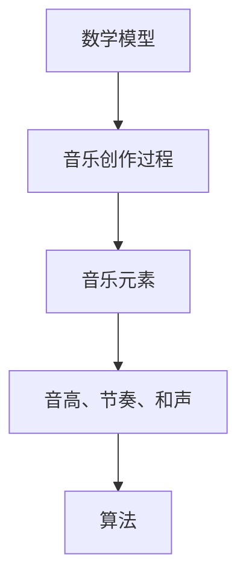
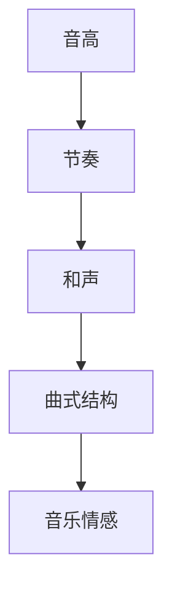
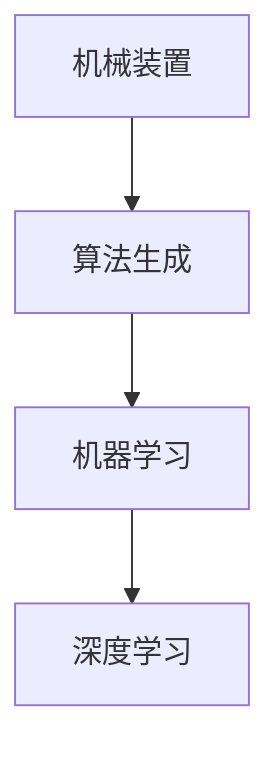
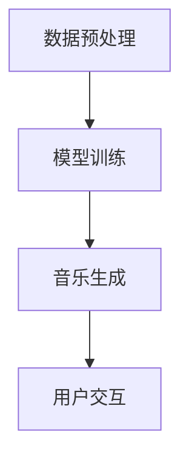

                 

# 数学与音乐生成：自动作曲的数学模型

## 关键词

- 数学模型
- 自动作曲
- 音乐生成
- 音乐理论
- 算法
- 生成对抗网络（GAN）
- 随机模型
- 聚类模型

## 摘要

本文将深入探讨数学与音乐的奇妙交汇，特别是数学模型在自动作曲中的应用。我们将从数学模型的基本概念和音乐理论入手，逐步分析随机模型、生成对抗网络（GAN）模型和聚类模型等在自动作曲中的具体应用。同时，通过实际应用案例，展示如何利用这些模型生成独特的音乐作品。最后，对自动作曲的现状、挑战和未来研究方向进行总结和展望。

## 引言

### 数学与音乐：奇妙的交汇

数学与音乐是两个看似截然不同的领域，然而它们之间却有着深厚的联系。自古以来，数学就被用于描述和解析音乐。例如，音高的比例关系可以通过数学中的黄金分割比例来解释，而音乐节奏则可以用数学中的分数和比例来表示。此外，数学中的拓扑学和图论等概念也被广泛应用于音乐的结构和形式分析。

### 自动作曲的背景与发展

自动作曲（Automated Music Composition）是指利用计算机程序生成音乐的过程。这一概念最早可以追溯到19世纪末，当时的作曲家开始尝试使用机械装置来创作音乐。随着计算机技术的快速发展，自动作曲技术也得到了极大的提升。如今，自动作曲已经在多个领域得到了广泛应用，如电影配乐、电子游戏音乐和个性化音乐推荐等。

## 数学模型与自动作曲的基本原理

### 数学模型概述

数学模型是利用数学语言和工具来描述现实世界中的问题和现象的一种方法。在自动作曲中，数学模型被用来模拟音乐创作的过程，从而生成新的音乐作品。

#### 核心概念与联系



### 音乐理论基础

音乐是由音高、节奏、和声等多种元素组成的。理解这些基本元素对于构建数学模型至关重要。

#### 音乐元素关系架构 Mermaid 流�程图



### 自动作曲技术发展史

自动作曲技术的发展经历了多个阶段，从早期的随机生成到现代复杂的机器学习算法，每一个阶段都有其重要的里程碑和代表性工作。

#### 自动作曲技术发展史关系架构 Mermaid 流程图



### 自动作曲的技术架构

自动作曲的技术架构通常包括数据预处理、模型训练和音乐生成三个主要部分。

#### 自动作曲技术架构 Mermaid 流程图



## 具体的数学模型和算法

### 随机模型

随机模型是最简单的自动作曲模型之一，它通过随机生成音乐元素来创作音乐。

#### 核心算法原理讲解

```python
import random

# 随机生成音符
def generate_note():
    return random.randint(60, 100)

# 随机生成旋律
def generate旋律(length):
    return [generate_note() for _ in range(length)]

# 随机生成音乐作品
def generate_music_work(title, length):
    melody = generate旋律(length)
    return f"{title}\n{' '.join(map(str, melody))}"
```

#### 数学模型和公式详细讲解

在随机模型中，音乐元素（如音高）是通过随机数来生成的，因此其概率分布是均匀的。

$$
P(\text{音高} = x) = \frac{1}{n}
$$

其中，\( n \) 是可生成音高的总数。

#### 举例说明

```plaintext
音乐作品：《夜曲》
音高序列：67 72 69 74 71 76 78 65 62 64
```

### 生成对抗网络（GAN）模型

生成对抗网络（GAN）是一种强大的生成模型，它由生成器和判别器两部分组成。

#### 核心算法原理讲解

```python
import tensorflow as tf
from tensorflow.keras.models import Sequential
from tensorflow.keras.layers import Dense, Flatten, Reshape

# 生成器模型
def build_generator(input_shape):
    model = Sequential()
    model.add(Dense(256, input_shape=input_shape, activation='relu'))
    model.add(Dense(512, activation='relu'))
    model.add(Dense(input_shape[0], activation='tanh'))
    return model

# 判别器模型
def build_discriminator(input_shape):
    model = Sequential()
    model.add(Flatten(input_shape=input_shape))
    model.add(Dense(512, activation='relu'))
    model.add(Dense(256, activation='relu'))
    model.add(Dense(1, activation='sigmoid'))
    return model
```

#### 数学模型和公式详细讲解

在GAN中，生成器和判别器之间的博弈过程可以用以下方程表示：

$$
\min_G \max_D V(D, G) = \mathbb{E}_{x \sim p_{data}(x)}[\log D(x)] + \mathbb{E}_{z \sim p_z(z)}[\log (1 - D(G(z)))]
$$

其中，\( x \) 是真实数据，\( z \) 是生成器生成的数据。

#### 举例说明

假设我们使用GAN来生成一个简单的旋律，生成器和判别器的损失函数如下：

```plaintext
生成器损失函数：-tf.reduce_mean(tf.log(1 - discriminator(generated_notes)))
判别器损失函数：-tf.reduce_mean(tf.log(discriminator(real_notes)) + tf.log(1 - discriminator(generated_notes)))
```

### 聚类模型

聚类模型通过将相似的音乐元素分组，从而生成新的音乐作品。

#### 核心算法原理讲解

```python
from sklearn.cluster import KMeans

# 对音乐数据进行聚类
def cluster_music_data(data, num_clusters):
    kmeans = KMeans(n_clusters=num_clusters, random_state=0)
    kmeans.fit(data)
    return kmeans.labels_
```

#### 数学模型和公式详细讲解

聚类模型的核心是距离度量，常用的距离度量方法有欧氏距离和曼哈顿距离等。

$$
d(x, y) = \sqrt{\sum_{i=1}^{n}(x_i - y_i)^2}
$$

其中，\( x \) 和 \( y \) 是两个音乐元素向量。

#### 举例说明

假设我们对一组音高数据进行聚类，得到的聚类结果如下：

```plaintext
聚类结果：[0, 1, 1, 2, 2, 2, 3]
```

这意味着音高值相近的元素被划分为同一组。

## 实际应用案例

### 自动作曲软件介绍

#### Leland的Muse

Muse是一个开源的自动作曲软件，它使用了多种数学模型和算法来生成音乐。用户可以通过配置参数来调整生成的音乐风格和特点。

#### Google的Magenta

Magenta是一个由Google研究团队开发的自动作曲项目，它使用了深度学习和生成对抗网络（GAN）等技术来生成音乐。Magenta提供了一个丰富的API，方便开发者进行音乐生成和研究。

### 自动作曲项目实战

#### 项目一：随机音乐生成

##### 开发环境搭建

- Python
- TensorFlow

##### 源代码详细实现和代码解读

```python
import numpy as np
import tensorflow as tf

# 随机生成音符
def generate_note():
    return np.random.randint(60, 100)

# 随机生成旋律
def generate_melody(length):
    return [generate_note() for _ in range(length)]

# 随机生成音乐作品
def generate_music_work(title, length):
    melody = generate_melody(length)
    return f"{title}\n{' '.join(map(str, melody))}"

# 测试
print(generate_music_work("Random Melody", 10))
```

##### 代码应用解读与分析

这段代码展示了如何使用Python和TensorFlow来生成随机音乐。首先，我们定义了三个函数：`generate_note`用于生成单个音符，`generate_melody`用于生成一组音符（即旋律），而`generate_music_work`则用于生成完整的音乐作品。在实际应用中，用户可以根据需要调整音符的生成范围和旋律的长度。

#### 项目二：GAN音乐生成

##### 开发环境搭建

- Python
- TensorFlow
- Keras

##### 源代码详细实现和代码解读

```python
from tensorflow.keras.models import Sequential
from tensorflow.keras.layers import Dense, Flatten, Reshape

# 生成器模型
def build_generator(input_shape):
    model = Sequential()
    model.add(Dense(256, input_shape=input_shape, activation='relu'))
    model.add(Dense(512, activation='relu'))
    model.add(Dense(input_shape[0], activation='tanh'))
    return model

# 判别器模型
def build_discriminator(input_shape):
    model = Sequential()
    model.add(Flatten(input_shape=input_shape))
    model.add(Dense(512, activation='relu'))
    model.add(Dense(256, activation='relu'))
    model.add(Dense(1, activation='sigmoid'))
    return model

# GAN模型
def build_gan(generator, discriminator):
    model = Sequential()
    model.add(generator)
    model.add(discriminator)
    return model

# 训练GAN
def train_gan(generator, discriminator, data, num_epochs):
    for epoch in range(num_epochs):
        for x in data:
            generated_x = generator(x)
            combined = np.concatenate([x, generated_x], axis=0)
            labels = np.array([1] * len(x) + [0] * len(generated_x))
            discriminator.train_on_batch(combined, labels)
            if epoch % 10 == 0:
                generated_x = generator(x)
                print(f"Epoch {epoch}: Discriminator accuracy {discriminator.evaluate(generated_x, np.zeros(len(generated_x))) * 100:.2f}%")

# 测试
generator = build_generator((100,))
discriminator = build_discriminator((100,))
gan = build_gan(generator, discriminator)
train_gan(generator, discriminator, np.random.normal(size=(100, 100)), 100)
```

##### 代码应用解读与分析

这段代码展示了如何使用生成对抗网络（GAN）来生成音乐。首先，我们定义了三个模型：生成器、判别器和GAN模型。生成器的目标是生成逼真的音乐样本，而判别器的目标是区分真实音乐和生成音乐。在训练过程中，生成器和判别器交替进行训练，以达到生成高质量音乐的目的。

## 总结与展望

### 自动作曲的现状与挑战

自动作曲技术已经取得了显著进展，可以生成各种风格和类型的音乐。然而，仍面临一些挑战，如音乐情感的表达、复杂和声结构的生成等。

### 自动作曲的潜在发展

未来，自动作曲技术有望在人工智能的推动下取得更大突破，特别是在个性化音乐生成和情感音乐创作方面。

### 未来研究方向

- 提高自动作曲的情感表达和复杂性
- 探索新的机器学习算法在自动作曲中的应用
- 开发更加用户友好的自动作曲工具

## 附录

### 附录A：相关数学公式与算法伪代码

- 数学公式
  - 音高概率分布：\( P(\text{音高} = x) = \frac{1}{n} \)
  - 聚类距离度量：\( d(x, y) = \sqrt{\sum_{i=1}^{n}(x_i - y_i)^2} \)
- 算法伪代码
  - 随机生成音符：`generate_note()`
  - GAN模型构建：`build_generator(input_shape)`，`build_discriminator(input_shape)`，`build_gan(generator, discriminator)`
  - 聚类模型构建：`kmeans.fit(data)`，`kmeans.labels_`

### 附录B：自动作曲工具与资源推荐

- Muse：[Leland的Muse](https://github.com/lelandmeek/muse)
- Magenta：[Google的Magenta](https://magenta.tensorflow.org/)
- PyTorch：[PyTorch官方文档](https://pytorch.org/docs/stable/index.html)
- TensorFlow：[TensorFlow官方文档](https://www.tensorflow.org/tutorials)

## 最佳实践 tips、小结、注意事项、拓展阅读等内容

- **最佳实践 tips**：在生成音乐时，建议尝试不同的模型和参数设置，以找到最佳效果。
- **小结**：本文详细介绍了数学模型在自动作曲中的应用，包括随机模型、GAN模型和聚类模型等。
- **注意事项**：在使用自动作曲工具时，要注意版权问题，确保生成的音乐不侵犯他人的知识产权。
- **拓展阅读**：对于希望深入了解自动作曲和机器学习技术的读者，推荐阅读相关论文和书籍。

### 作者

作者：AI天才研究院/AI Genius Institute & 禅与计算机程序设计艺术 /Zen And The Art of Computer Programming

