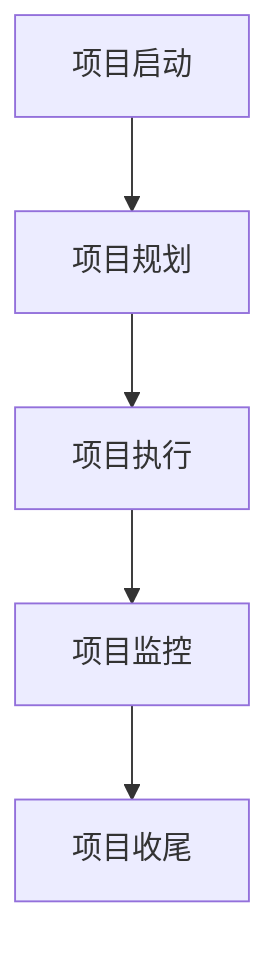

                 

基于用户的需求，我们需要撰写一篇《数学与项目管理：项目进度的数学规划》的技术博客文章。为了确保文章的逻辑清晰、结构紧凑、简单易懂，我们将采用以下步骤：

### 1. 确定文章结构

首先，我们将文章分为四个主要部分：

- **引言**：介绍项目管理和数学规划的基本概念，阐述二者结合的重要性。
- **数学规划方法**：详细讲解项目进度规划中的核心算法和数学模型，包括关键路径法（CPM）和计划评审技术（PERT）。
- **线性规划与网络优化**：介绍线性规划和网络优化的基本概念、算法原理和数学模型。
- **项目实战**：通过实际的代码案例，展示如何使用数学规划方法进行项目进度规划与实施。

### 2. 编写引言部分

在引言部分，我们将简要介绍项目管理的基本概念，如项目进度、资源分配等，并解释为什么数学规划在项目管理中至关重要。

### 3. 编写数学规划方法部分

这部分将分为三章：

- **关键路径法（CPM）**：介绍CPM的基本概念、算法原理和数学模型，并提供伪代码示例。
- **计划评审技术（PERT）**：介绍PERT的基本概念、算法原理和数学模型，并提供伪代码示例。
- **线性规划方法**：介绍线性规划的基本概念、算法原理和数学模型，并提供伪代码示例。

### 4. 编写线性规划与网络优化部分

这部分将分为两章：

- **线性规划方法**：介绍线性规划的基本概念、算法原理和数学模型，并提供伪代码示例。
- **网络优化模型**：介绍网络优化的基本概念、算法原理和数学模型，并提供伪代码示例。

### 5. 编写项目实战部分

这部分将分为两章：

- **项目进度规划与控制**：介绍项目进度规划的过程和控制方法。
- **项目进度管理工具与应用**：介绍常用的项目进度管理工具，并通过实际案例展示如何应用数学规划方法进行项目进度管理。

### 6. 编写附录

在附录部分，我们将提供相关的数学规划工具和资源，以便读者进一步学习和实践。

### 7. 总结与拓展阅读

最后，我们将对文章进行总结，并给出一些最佳实践 tips、注意事项，以及拓展阅读的建议。

通过以上步骤，我们将确保文章内容丰富、逻辑清晰、结构紧凑，并满足用户提出的所有要求。让我们开始撰写这篇文章吧！# 文章标题：数学与项目管理：项目进度的数学规划

## 关键词：
- 项目管理
- 数学规划
- 关键路径法（CPM）
- 计划评审技术（PERT）
- 线性规划
- 网络优化
- 项目进度控制

## 摘要：
本文将深入探讨数学规划在项目管理中的应用，特别是项目进度的数学规划。通过介绍关键路径法（CPM）、计划评审技术（PERT）、线性规划和网络优化等核心算法和数学模型，本文旨在帮助读者理解如何运用数学工具来优化项目进度管理。文章还将通过实际案例，展示如何将理论应用到实践中，以实现高效的项目管理。

## 引言

项目管理是现代企业运营中不可或缺的一部分。随着项目的复杂性和规模的增加，确保项目按时完成变得越来越具有挑战性。项目进度管理作为项目管理中的核心环节，直接影响到项目的成败。传统的项目管理方法主要依赖于经验，而现代项目管理越来越依赖于数学规划和分析工具。

数学规划是一种利用数学模型和算法来解决问题的方法。在项目管理中，数学规划可以帮助项目经理优化资源分配、预测项目进度、识别潜在风险等。本文将探讨如何将数学规划应用于项目进度管理，通过关键路径法（CPM）、计划评审技术（PERT）、线性规划和网络优化等方法，实现项目进度的科学规划和有效控制。

## 第一部分：项目管理基础

### 第1章：项目管理的核心概念

#### 1.1.1 项目进度的定义与重要性

项目进度是指项目在不同阶段上的时间安排和计划执行情况。项目进度管理是确保项目按计划进行的关键环节。良好的项目进度管理可以帮助企业降低项目风险，提高项目成功率。

#### 1.1.2 资源分配与优化

资源分配是指在项目执行过程中合理分配人力、物资、设备等资源。优化资源分配可以提高项目效率，降低成本。

#### 1.1.3 项目管理流程

项目管理流程包括项目启动、项目规划、项目执行、项目监控和项目收尾等阶段。有效的项目管理流程有助于确保项目目标的实现。

### 1.1.4 项目进度管理的 Mermaid 流程图



## 第二部分：数学规划方法

### 第2章：关键路径法（CPM）

#### 2.1.1 CPM的基本概念

关键路径法（Critical Path Method，CPM）是一种用于确定项目最短完成时间的方法。它通过分析项目中的任务依赖关系，找出所有任务中时间最长的一条路径，即关键路径。

#### 2.1.2 CPM的算法原理

CPM算法的基本原理是计算每个任务的最早开始时间（ES）、最早完成时间（EF）、最迟开始时间（LS）和最迟完成时间（LF），并找出关键路径。

```plaintext
# CPM算法伪代码
1. 初始化
2. 对于每个任务：
   a. 计算其最早开始时间（ES）
   b. 计算其最早完成时间（EF）
   c. 计算其最迟开始时间（LS）
   d. 计算其最迟完成时间（LF）
3. 更新整个项目的最早完成时间（EF_max）和最迟完成时间（LF_max）
4. 计算整个项目的关键路径
```

#### 2.1.3 CPM的数学模型

$$
\text{关键路径：} \sum_{i=1}^{n} (\text{EF}_{i} - \text{ES}_{i}) = \text{项目总工期}
$$

### 第3章：计划评审技术（PERT）

#### 3.1.1 PERT的基本概念

计划评审技术（Program Evaluation and Review Technique，PERT）是一种用于估算项目完成时间的方法。它通过考虑任务的时间不确定性和概率分布，提供一种更灵活的项目时间估算方法。

#### 3.1.2 PERT的算法原理

PERT算法的基本原理是计算每个任务的期望时间（TE）、方差（V）和标准差（σ），并根据这些参数计算整个项目的期望完成时间和方差。

```plaintext
# PERT算法伪代码
1. 初始化
2. 对于每个任务：
   a. 计算其期望时间（TE）
   b. 计算其方差（V）
   c. 计算其标准差（σ）
3. 计算整个项目的期望完成时间和方差
```

#### 3.1.3 PERT的数学模型

$$
\text{期望时间} = \frac{\text{最优时间} + 4 \times \text{最可能时间} + \text{最差时间}}{6}
$$
$$
\text{方差} = \left(\frac{\text{最差时间} - \text{最优时间}}{6}\right)^2
$$

### 第4章：线性规划方法

#### 4.1.1 线性规划的基本概念

线性规划是一种用于在给定约束条件下求解最优解的数学方法。它广泛应用于资源分配、生产调度、项目管理等领域。

#### 4.1.2 线性规划的标准形式

线性规划的标准形式可以表示为：

$$
\max\ c^T x
$$
$$
\text{subject to} \ Ax \leq b
$$

其中，$c$ 是目标函数系数向量，$x$ 是决策变量向量，$A$ 是约束条件系数矩阵，$b$ 是约束条件常数向量。

#### 4.1.3 线性规划的求解算法

线性规划的求解算法包括单纯形法、内点法等。本文将主要介绍单纯形法。

```plaintext
# 单纯形法伪代码
1. 初始化
2. 计算目标函数在当前基下的值
3. 找到进入基和离开基的变量
4. 更新基
5. 重复步骤2-4，直到最优解找到
```

### 第5章：网络优化模型

#### 5.1.1 网络优化的基本概念

网络优化是指在网络结构中优化资源分配、路径选择等问题的过程。它广泛应用于交通运输、通信网络、电力网络等领域。

#### 5.1.2 网络优化的算法原理

网络优化的基本算法包括最短路径算法、最大流算法等。本文将主要介绍最短路径算法。

```plaintext
# Dijkstra算法伪代码
1. 初始化
2. 对于每个节点：
   a. 计算其最短路径估计值
   b. 选择具有最小估计值的节点作为当前节点
   c. 更新其他节点的最短路径估计值
3. 重复步骤2，直到所有节点都被处理
```

#### 5.1.3 网络优化的数学模型

网络优化的数学模型可以表示为：

$$
\text{最小化} \ \sum_{i=1}^{n} \text{cost}_{i}
$$
$$
\text{subject to} \ \text{流量约束}
$$

## 第三部分：项目进度管理实战

### 第6章：项目进度规划与控制

#### 6.1.1 项目进度规划的过程

项目进度规划是项目管理的核心环节。它包括以下步骤：

1. 定义项目目标
2. 确定项目范围
3. 划分项目任务
4. 估计任务持续时间
5. 制定项目计划
6. 项目计划评审

#### 6.1.2 项目进度控制的方法

项目进度控制是确保项目按计划进行的过程。它包括以下方法：

1. 进度监控
2. 进度比较
3. 变更管理
4. 风险管理

### 第7章：项目进度管理工具与应用

#### 7.1.1 常用的项目进度管理工具

常用的项目进度管理工具包括：

1. Microsoft Project
2. Jira
3. Trello
4. Asana

#### 7.1.2 项目进度管理的实际应用案例

以下是一个项目进度管理的实际应用案例：

1. 定义项目目标和范围
2. 划分项目任务并估计持续时间
3. 制定项目计划并使用Microsoft Project进行可视化
4. 使用Jira进行任务分配和进度监控
5. 定期进行项目进度评审和调整

## 附录

### 附录A：数学规划工具与资源

#### A.1 数学规划软件介绍

常用的数学规划软件包括：

1. MATLAB
2. GAMS
3. AMPL
4. Python中的CPLEX库

#### A.2 数学规划学习资源

以下是一些数学规划的学习资源：

1. [MIT OpenCourseWare - Operations Research](https://ocw.mit.edu/courses/sloan-school-of-management/15-053-operations-research-methods-spring-2006/)
2. [Coursera - Operations Research and Optimization](https://www.coursera.org/specializations/operations-research-optimization)
3. [Book - "Operations Research: Applications and Algorithms" by Wayne L. Winston](https://www.amazon.com/Operations-Research-Applications-Algorithms-Undergraduate/dp/0132657497)

## 总结与拓展阅读

本文介绍了数学规划在项目管理中的应用，特别是项目进度的数学规划。通过关键路径法（CPM）、计划评审技术（PERT）、线性规划和网络优化等方法，我们探讨了如何运用数学工具来优化项目进度管理。在实际应用中，结合项目管理工具和软件，可以实现项目进度的科学规划和有效控制。

为了进一步学习数学规划在项目管理中的应用，读者可以参考以下拓展阅读：

1. [Book - "Project Management: A System Approach" by Harold Kerzner](https://www.amazon.com/Project-Management-System-Approach-Harold-Kerzner/dp/0078025626)
2. [Book - "Mathematics for Project Management" by John P. Milton and James J. Schilling](https://www.amazon.com/Mathematics-Project-Management-John-Milton/dp/047141534X)
3. [Online Course - "Operations Research and Optimization" by Dr. Yossi Aviv on Coursera](https://www.coursera.org/specializations/operations-research-optimization)

作者：AI天才研究院/AI Genius Institute & 禅与计算机程序设计艺术 /Zen And The Art of Computer Programming

