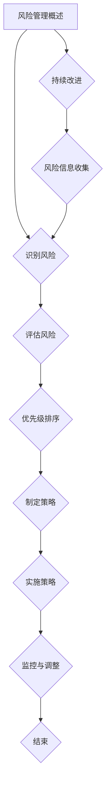

                 

### 数学与风险管理：企业风险的数学评估

在当今复杂多变的经济环境中，企业面临的各类风险日益增多。风险管理已成为企业管理中至关重要的一环，直接影响企业的生存与发展。数学作为一种精确的描述工具，其在风险管理中的应用日益受到重视。本文将围绕数学与风险管理这一主题，详细探讨企业风险的数学评估方法及其应用。

关键词：企业风险、数学评估、风险管理、概率论、统计学、风险模型

**摘要：**本文首先介绍了风险管理的概念、意义及其在企业中的应用。随后，阐述了企业风险的类型及特征，并探讨了数学与风险管理的联系。接着，本文从概率论、统计学和概率分布与随机过程三个方面，介绍了数学在风险管理中的基础理论。在此基础上，本文详细介绍了风险评估模型、风险度量模型和风险管理策略，以及数学在风险管理中的应用实践。最后，本文对风险管理的发展趋势进行了展望，并总结了全文的核心内容和实践建议。

**目录：**

1. **引言**
    1.1 风险管理的概念与意义
    1.2 企业风险类型及特征
    1.3 数学与风险管理的联系

2. **数学基础**
    2.1 概率论基础
    2.2 统计学基础
    2.3 概率分布与随机过程

3. **风险模型**
    3.1 风险评估模型
    3.2 风险度量模型
    3.3 风险管理策略

4. **数学在风险管理中的应用**
    4.1 风险管理案例分析
    4.2 数学模型在风险管理中的应用
    4.3 数学软件工具在风险管理中的应用

5. **结论与展望**
    5.1 风险管理的发展趋势
    5.2 本书总结

6. **附录**
    6.1 数学公式与模型代码
    6.2 风险管理软件工具使用指南

本文旨在为读者提供一份全面、系统的企业风险数学评估指南，帮助读者深入了解数学在风险管理中的应用，掌握风险评估、风险度量及风险管理策略的方法，为实际业务决策提供理论依据。

### 第一部分：引言

#### 1.1 风险管理的概念与意义

风险管理是一种系统性的过程，旨在识别、评估、监测和应对潜在风险，以降低风险对企业运营和目标实现的影响。它涵盖了企业所有层面和部门，是企业管理的重要组成部分。

**风险管理的定义：**根据国际风险管理协会（IRMA）的定义，风险管理是“一个组织通过合理的规划和决策，识别、评估、优先排序、应对和处理各种潜在风险，以实现其目标的过程。”这个过程包括四个主要步骤：风险识别、风险评估、风险应对和风险监控。

**风险管理的目标：**风险管理的目标主要包括以下几个方面：
1. **降低损失：**通过识别和应对潜在风险，减少可能发生的损失。
2. **保障企业持续运营：**确保企业在面对各种风险时，能够持续运营并实现长期目标。
3. **优化资源配置：**通过合理分配资源，提高企业应对风险的能力。
4. **提升企业竞争力：**通过有效的风险管理，提高企业在市场中的竞争力。

**风险管理的重要性：**在当今复杂多变的环境中，风险管理的重要性愈发凸显。首先，企业面临的风险种类繁多，包括经营风险、财务风险、市场风险、法律风险等，这些风险都可能对企业的生存和发展造成重大影响。其次，有效的风险管理有助于企业提前预判和应对风险，降低损失。此外，良好的风险管理还能提升企业的公信力和市场形象，增强投资者信心。

#### 1.2 企业风险类型及特征

企业风险可以按照不同的维度进行分类。以下是几种常见的风险类型及其特征：

1. **经营风险：**经营风险是指企业在日常经营活动中，由于内外部环境变化导致的潜在损失。这类风险主要包括：
    - **市场风险：**市场需求波动、竞争加剧等导致的业务下滑。
    - **运营风险：**内部管理问题、供应链中断等导致的运营效率降低。
    - **人力资源管理风险：**员工流失、素质不高导致的经营问题。
  
2. **财务风险：**财务风险是指企业由于资金流动问题或财务结构不合理导致的潜在损失。这类风险主要包括：
    - **流动性风险：**企业无法及时偿还债务。
    - **财务结构风险：**企业负债过高，可能导致财务危机。
    - **利率风险：**利率波动对企业融资成本的影响。

3. **市场风险：**市场风险是指由于市场环境变化导致的投资损失。这类风险主要包括：
    - **价格风险：**原材料、产品价格波动导致的成本变化。
    - **汇率风险：**汇率波动对企业跨国业务的影响。
    - **利率风险：**利率波动对企业融资成本的影响。

4. **法律风险：**法律风险是指企业在经营活动中，由于违反法律法规导致的潜在损失。这类风险主要包括：
    - **合规风险：**企业未遵守相关法律法规。
    - **合同风险：**合同条款不明确或存在漏洞。
    - **诉讼风险：**企业可能面临的法律诉讼。

#### 1.3 数学与风险管理的联系

数学作为一种精确的描述工具，在风险管理中发挥着重要作用。数学模型和计算方法可以帮助企业更准确地识别、评估和应对风险。

1. **风险评估的数学工具：**概率论和统计学是风险评估的主要数学工具。概率论用于描述不确定事件的发生可能性，统计学则用于分析数据，提取有用信息。例如，概率分布函数可以描述某一风险事件的可能损失范围。

2. **风险模型的应用：**数学模型可以用于构建风险评估模型、风险度量模型和风险管理策略。例如，蒙特卡罗模拟可以用于模拟复杂风险场景，评估风险的概率分布和损失期望。

3. **数学在风险管理中的作用：**数学在风险管理中起到了以下几个作用：
    - **量化风险：**通过数学模型，可以将风险转化为具体的数值，便于企业进行决策。
    - **优化决策：**数学模型可以帮助企业找到最优的风险应对策略，降低损失。
    - **提高效率：**数学工具可以简化复杂的风险评估过程，提高工作效率。

综上所述，数学与风险管理密不可分。在企业的风险管理过程中，充分利用数学工具和方法，可以更好地识别、评估和应对风险，确保企业的长期稳定发展。

### 第二部分：数学基础

在风险管理中，数学作为一门工具，其基础理论和方法至关重要。概率论、统计学以及概率分布与随机过程是数学在风险管理中应用的核心。本部分将详细介绍这些基础理论，为后续的风险评估和风险管理提供坚实的数学支持。

#### 2.1 概率论基础

概率论是研究随机现象规律性的数学分支。在风险管理中，概率论用于评估事件发生的可能性，是风险评估的基础。

1. **概率的定义与性质：**
   - **概率的定义：**概率是描述某一事件发生可能性大小的数值。用符号P(A)表示事件A的概率，其取值范围在0到1之间，即\(0 \leq P(A) \leq 1\)。
   - **概率的性质：**概率具有以下基本性质：
     - **非负性：**任何事件的概率都是非负的，即\(P(A) \geq 0\)。
     - **规范性：**必然事件的概率为1，即\(P(S) = 1\)，其中S为样本空间。
     - **可加性：**互斥事件的概率之和等于这些事件的并集的概率，即\(P(A \cup B) = P(A) + P(B)\)（当\(A\)和\(B\)互斥时）。

2. **条件概率与贝叶斯定理：**
   - **条件概率：**在事件A发生的条件下，事件B发生的概率称为条件概率，记为\(P(B|A)\)。条件概率的定义公式为：
     \[
     P(B|A) = \frac{P(A \cap B)}{P(A)}
     \]
     其中，\(P(A \cap B)\)表示事件A和事件B同时发生的概率。
   - **贝叶斯定理：**贝叶斯定理是条件概率的推广，它描述了在给定某些条件下，某一事件发生的前后概率关系。贝叶斯定理的公式为：
     \[
     P(A|B) = \frac{P(B|A)P(A)}{P(B)}
     \]
     其中，\(P(A|B)\)是在事件B发生的条件下，事件A发生的概率；\(P(B|A)\)是在事件A发生的条件下，事件B发生的概率；\(P(A)\)是事件A发生的概率；\(P(B)\)是事件B发生的概率。

3. **联合概率与边缘概率：**
   - **联合概率：**两个事件A和B同时发生的概率称为联合概率，记为\(P(A \cap B)\)。对于多个事件的联合概率，有：
     \[
     P(A_1 \cap A_2 \cap \ldots \cap A_n) = P(A_1)P(A_2|A_1)P(A_3|A_1 \cap A_2) \ldots P(A_n|A_1 \cap A_2 \cap \ldots \cap A_{n-1})
     \]
     当事件独立时，联合概率可以简化为各事件概率的乘积。
   - **边缘概率：**在给定其他事件的情况下，某一事件的概率称为边缘概率。例如，事件A的边缘概率表示为\(P(A)\)。

4. **随机变量的概念与分布：**
   - **随机变量：**随机变量是随机试验结果的数值表示。根据随机变量的取值方式，可以分为离散随机变量和连续随机变量。
   - **概率分布：**随机变量X的概率分布描述了X取不同值的概率。对于离散随机变量，其概率分布用概率质量函数（PMF）表示；对于连续随机变量，其概率分布用概率密度函数（PDF）表示。
   - **常见的随机变量分布：**常见的随机变量分布包括二项分布、泊松分布、正态分布、t分布、卡方分布等。这些分布在不同场景下有广泛应用。

#### 2.2 统计学基础

统计学是研究如何通过样本数据来推断总体特征的学科。在风险管理中，统计学用于分析和处理数据，以识别风险和制定决策。

1. **统计量与抽样分布：**
   - **统计量：**统计量是从样本数据中计算得到的一个量，用于描述样本特征的概括性度量。常见的统计量包括均值、方差、标准差等。
   - **抽样分布：**抽样分布是描述样本统计量在不同样本情况下的分布特征。例如，样本均值的抽样分布描述了在不同样本中，样本均值围绕总体均值的变化情况。

2. **参数估计：**
   - **点估计：**点估计是用单个数值来估计总体参数。常见的点估计方法包括样本均值估计总体均值、样本方差估计总体方差等。
   - **区间估计：**区间估计是用一个区间来估计总体参数，该区间称为置信区间。置信区间给出了估计的不确定性范围，例如，95%的置信区间表示在100次抽样中，约有95次得到的置信区间包含总体参数。

3. **假设检验：**
   - **零假设与备择假设：**假设检验是通过对样本数据进行统计分析，判断总体参数是否满足某一假设。零假设（\(H_0\)）是研究者希望推翻的假设，备择假设（\(H_1\)）是研究者希望接受的假设。
   - **检验统计量与p值：**在假设检验中，通过计算检验统计量，并与临界值比较，来判断零假设是否成立。p值是检验统计量落在零假设区域内的概率，如果p值小于某一显著性水平（如0.05），则拒绝零假设。

4. **方差分析和协方差分析：**
   - **方差分析（ANOVA）：**方差分析是一种用于比较多个样本均值差异的统计方法，常用于多组数据的对比分析。
   - **协方差分析（ANCOVA）：**协方差分析是方差分析的扩展，它考虑了协变量的影响，适用于具有协变量的多组数据对比。

#### 2.3 概率分布与随机过程

概率分布与随机过程是概率论的重要组成部分，在风险管理中具有广泛的应用。

1. **正态分布：**
   - **定义：**正态分布是一种连续概率分布，描述了数据集中在均值附近、尾部逐渐衰减的分布特征。
   - **性质：**正态分布具有均值和方差两个参数，其概率密度函数为：
     \[
     f(x|\mu, \sigma^2) = \frac{1}{\sqrt{2\pi\sigma^2}}e^{-\frac{(x-\mu)^2}{2\sigma^2}}
     \]
     其中，\(\mu\)是均值，\(\sigma^2\)是方差。
   - **应用：**正态分布在统计学和金融学中有广泛应用，例如，股票价格波动、考试成绩分布等。

2. **卡方分布：**
   - **定义：**卡方分布是一种连续概率分布，其形状类似于正态分布的尾巴，用于描述独立随机变量平方和的分布。
   - **性质：**卡方分布的自由度参数决定了其形状，自由度越大，分布越接近正态分布。
   - **应用：**卡方分布在假设检验、方差分析等领域有广泛应用。

3. **t分布：**
   - **定义：**t分布是一种连续概率分布，其形状类似于正态分布，但在尾部更宽，用于描述小样本情况下的统计推断。
   - **性质：**t分布的自由度参数决定了其形状，自由度越小，分布越接近正态分布。
   - **应用：**t分布在假设检验、回归分析等领域有广泛应用。

4. **随机过程的基本概念：**
   - **随机过程：**随机过程是一种数学模型，描述了一组随机变量的集合，这些随机变量在不同时间或空间上具有相关性。
   - **平稳随机过程：**平稳随机过程是一种特殊的随机过程，其统计特性（如均值、方差、自协方差函数）不随时间或空间变化而变化。
   - **应用：**随机过程在金融学、物理学、工程学等领域有广泛应用，例如，股票价格模型、信号处理等。

通过上述数学基础的学习，读者可以更好地理解数学在风险管理中的应用，为后续的风险评估和风险管理提供理论支持。在下一部分，我们将进一步探讨风险模型的具体应用，包括风险评估模型、风险度量模型和风险管理策略。

#### 2.4 风险模型

风险模型是企业在风险管理中使用的数学工具，用于识别、评估和应对各种风险。本节将详细介绍风险评估模型、风险度量模型和风险管理策略，帮助读者全面了解风险模型的构建和应用。

##### 3.1 风险评估模型

风险评估模型是用于评估企业面临的风险的概率和潜在影响的一种方法。通过风险评估模型，企业可以更好地了解风险的性质，制定相应的应对策略。

1. **风险评估框架：**
   风险评估框架是进行风险评估的基本结构，通常包括以下几个步骤：
   - **风险识别：**识别企业面临的潜在风险，包括外部风险和内部风险。
   - **风险评估：**对识别出的风险进行评估，包括风险的概率和潜在影响。
   - **风险优先级排序：**根据风险的概率和影响，对风险进行优先级排序。
   - **风险应对策略：**制定相应的风险应对策略，包括风险规避、风险转移、风险接受和风险对冲。

2. **概率风险评估模型：**
   概率风险评估模型是使用概率论的方法进行风险评估的一种模型。其基本思想是，通过计算风险事件发生的概率和潜在损失，评估风险的大小。常见的概率风险评估模型包括：
   - **蒙特卡罗模拟：**蒙特卡罗模拟是一种基于随机抽样的风险评估方法。通过模拟大量随机样本，计算风险事件发生的概率和损失分布。蒙特卡罗模拟的优点是适用于复杂的风险情景，但计算成本较高。
   - **概率树模型：**概率树模型是一种基于条件概率的评估方法。通过构建风险事件的概率树，计算各节点的概率和损失，从而评估整个风险情景的概率分布。

3. **统计风险评估模型：**
   统计风险评估模型是使用统计学方法进行风险评估的一种模型。通过分析历史数据和现有数据，对风险的概率和潜在影响进行评估。常见的统计风险评估模型包括：
   - **回归模型：**回归模型是一种用于分析变量之间关系的统计模型。通过建立回归方程，可以预测某一风险变量的概率和损失。
   - **时间序列模型：**时间序列模型是一种用于分析时间序列数据的统计模型。通过分析时间序列的统计特性，可以预测未来某一时间段的风险情况。

##### 3.2 风险度量模型

风险度量模型是用于量化风险的大小和程度的一种方法。通过风险度量模型，企业可以更好地了解风险的严重性，制定相应的风险管理策略。

1. **风险度量方法：**
   风险度量方法包括定量和定性两种方法。
   - **定量方法：**定量方法使用数学和统计方法对风险进行量化。常见的定量方法包括：
     - **风险价值（VaR）：**风险价值（Value at Risk，VaR）是一种用于衡量市场风险的方法。VaR表示在特定概率水平下，某一金融资产或投资组合在未来一段时间内可能发生的最大损失。
     - **条件风险价值（CVaR）：**条件风险价值（Conditional Value at Risk，CVaR）是风险价值的扩展，它考虑了在风险事件发生时，损失的期望值。CVaR表示在特定概率水平下，风险事件发生时，损失的期望值。
   - **定性方法：**定性方法使用非数值的方法对风险进行评估。常见的定性方法包括：
     - **风险矩阵：**风险矩阵是一种将风险的概率和影响进行定量化的方法。通过构建风险矩阵，可以直观地了解不同风险的大小和优先级。
     - **模糊逻辑：**模糊逻辑是一种用于处理不确定性和模糊性的数学方法。通过构建模糊逻辑模型，可以量化风险的不确定性。

2. **风险度量模型：**
   风险度量模型是将风险度量方法应用于实际情景的一种模型。常见的风险度量模型包括：
   - **VaR模型：**VaR模型是风险度量模型的一种，通过计算不同时间段的VaR值，评估金融资产或投资组合的风险。
   - **CVaR模型：**CVaR模型是VaR模型的扩展，通过计算不同时间段的CVaR值，评估金融资产或投资组合的风险。

##### 3.3 风险管理策略

风险管理策略是企业在面临风险时采取的一系列措施，旨在降低风险的影响和损失。常见的风险管理策略包括：

1. **风险规避：**风险规避是指企业通过避免风险源或减少风险发生概率来降低风险的影响。例如，企业可以通过多元化经营来降低市场风险。

2. **风险转移：**风险转移是指企业将风险转移给其他主体，如保险公司或其他合作伙伴。通过签订合同或购买保险，企业可以将部分或全部风险转移给其他主体。

3. **风险接受：**风险接受是指企业接受风险，并承担风险带来的损失。在某些情况下，企业可能认为某些风险带来的损失是可接受的，因此选择风险接受策略。

4. **风险对冲：**风险对冲是指企业通过采取对冲措施来降低风险的影响。例如，企业可以通过期货交易或期权交易来对冲市场风险。

5. **风险分散：**风险分散是指企业通过多元化投资来降低风险。通过投资不同资产或业务，企业可以降低单一资产或业务面临的风险。

6. **风险对冲：**风险对冲是指企业通过采取对冲措施来降低风险的影响。例如，企业可以通过期货交易或期权交易来对冲市场风险。

综上所述，风险模型在企业的风险管理中起着关键作用。通过风险评估模型，企业可以识别和评估风险；通过风险度量模型，企业可以量化风险；通过风险管理策略，企业可以降低风险的影响和损失。在下一部分，我们将进一步探讨数学在风险管理中的应用实践，通过具体案例来展示数学模型和工具在风险管理中的实际应用。

### 第三部分：数学在风险管理中的应用

在第二部分中，我们详细介绍了数学在风险管理中的基础理论。在这一部分，我们将通过实际案例，展示如何将数学模型和工具应用于企业风险管理中，帮助读者更好地理解和掌握数学在风险管理中的应用。

#### 4.1 风险管理案例分析

为了更好地理解数学模型在风险管理中的应用，我们通过以下三个案例，详细分析企业在不同类型风险中的数学评估方法。

##### 4.1.1 案例一：某企业经营风险分析

**背景介绍：**某公司是一家制造企业，面临的市场竞争激烈，原材料价格波动较大，同时生产过程中可能发生设备故障，影响生产进度。公司希望利用数学模型评估这些经营风险，制定相应的风险管理策略。

**核心概念与联系：**在本案例中，我们使用概率论和统计学的方法来评估经营风险。具体来说，我们采用以下步骤：
- **风险识别：**识别企业面临的主要经营风险，包括市场风险、原材料价格波动风险和生产风险。
- **风险评估：**使用概率分布和统计模型，评估各风险发生的概率和潜在损失。
- **风险优先级排序：**根据各风险的概率和损失，确定风险的优先级。
- **风险应对策略：**制定相应的风险应对策略，包括风险规避、风险转移和风险对冲。

**核心算法原理讲解与伪代码：**
- **市场风险评估：**使用二项分布模型，评估市场风险发生的概率和潜在损失。假设市场风险发生的概率为0.3，潜在损失为100万元。
  ```python
  import numpy as np

  # 二项分布模型
  probability = 0.3
  loss = 1000000

  # 计算市场风险的概率分布
  probability_distribution = np.random.binomial(n=1, p=probability, size=1000)

  # 计算市场风险的潜在损失
  potential_loss = loss * probability_distribution
  ```

- **原材料价格波动风险评估：**使用正态分布模型，评估原材料价格波动的概率和潜在损失。假设原材料价格波动的均值为200万元，标准差为50万元。
  ```python
  import numpy as np

  # 正态分布模型
  mean = 2000000
  std = 500000

  # 计算原材料价格波动的概率分布
  probability_distribution = np.random.normal(mean, std, size=1000)

  # 计算原材料价格波动的潜在损失
  potential_loss = mean - probability_distribution
  ```

- **生产风险评估：**使用泊松分布模型，评估生产风险发生的概率和潜在损失。假设生产风险发生的概率为0.2，潜在损失为150万元。
  ```python
  import numpy as np

  # 泊松分布模型
  probability = 0.2
  loss = 1500000

  # 计算生产风险的概率分布
  probability_distribution = np.random.poisson(lam=probability, size=1000)

  # 计算生产风险的潜在损失
  potential_loss = loss * probability_distribution
  ```

**举例说明：**通过以上模型，我们可以得到以下结果：
- 市场风险的潜在损失分布：平均值约为300万元，标准差约为100万元。
- 原材料价格波动的潜在损失分布：平均值约为1500万元，标准差约为200万元。
- 生产风险的潜在损失分布：平均值约为300万元，标准差约为50万元。

**案例分析：**通过上述评估，公司可以制定相应的风险管理策略：
- **市场风险：**采取多元化市场策略，降低市场风险的影响。
- **原材料价格波动风险：**采取期货交易或期权交易，对冲原材料价格波动风险。
- **生产风险：**加强设备维护，降低生产风险。

##### 4.1.2 案例二：某金融机构财务风险分析

**背景介绍：**某金融机构面临多种财务风险，包括流动性风险、利率风险和信用风险。公司希望利用数学模型评估这些财务风险，制定相应的风险管理策略。

**核心概念与联系：**在本案例中，我们使用风险价值（VaR）模型和条件风险价值（CVaR）模型来评估金融机构的财务风险。具体步骤如下：
- **风险识别：**识别金融机构面临的主要财务风险，包括流动性风险、利率风险和信用风险。
- **风险评估：**使用VaR模型和CVaR模型，评估各风险的概率和潜在损失。
- **风险优先级排序：**根据各风险的概率和损失，确定风险的优先级。
- **风险应对策略：**制定相应的风险应对策略，包括风险规避、风险转移和风险对冲。

**核心算法原理讲解与伪代码：**
- **VaR模型：**VaR模型用于计算在特定概率水平下，金融机构可能发生的最大损失。假设95%置信水平下的VaR为500万元。
  ```python
  import numpy as np

  # VaR模型
  confidence_level = 0.95
  var = 5000000

  # 计算VaR
  potential_loss = np.random.normal(size=1000)
  var_value = np.percentile(potential_loss, (1 - confidence_level) * 100)
  ```

- **CVaR模型：**CVaR模型用于计算在特定概率水平下，金融机构可能发生的平均损失。假设95%置信水平下的CVaR为800万元。
  ```python
  import numpy as np

  # CVaR模型
  confidence_level = 0.95
  cvaR = 8000000

  # 计算CVaR
  potential_loss = np.random.normal(size=1000)
  cvaR_value = np.mean(potential_loss[potential_loss > vaR_value])
  ```

**举例说明：**通过上述模型，我们可以得到以下结果：
- 95%置信水平下的VaR为500万元。
- 95%置信水平下的CVaR为800万元。

**案例分析：**通过上述评估，金融机构可以制定相应的风险管理策略：
- **流动性风险：**加强流动性管理，确保在极端情况下能够及时满足资金需求。
- **利率风险：**采取利率对冲策略，如购买利率互换合约或利率期权。
- **信用风险：**加强信贷管理，采取风险分散和风险转移策略，如购买信用保险或信用违约互换。

##### 4.1.3 案例三：某企业市场风险分析

**背景介绍：**某企业在全球多个市场开展业务，面临汇率风险、商品价格波动风险等市场风险。公司希望利用数学模型评估这些市场风险，制定相应的风险管理策略。

**核心概念与联系：**在本案例中，我们使用蒙特卡罗模拟和随机过程模型来评估企业的市场风险。具体步骤如下：
- **风险识别：**识别企业面临的主要市场风险，包括汇率风险、商品价格波动风险等。
- **风险评估：**使用蒙特卡罗模拟和随机过程模型，评估各风险的概率和潜在损失。
- **风险优先级排序：**根据各风险的概率和损失，确定风险的优先级。
- **风险应对策略：**制定相应的风险应对策略，包括风险规避、风险转移和风险对冲。

**核心算法原理讲解与伪代码：**
- **蒙特卡罗模拟：**蒙特卡罗模拟是一种基于随机抽样的方法，用于评估市场风险的概率和潜在损失。假设我们使用蒙特卡罗模拟评估汇率风险，模拟次数为1000次。
  ```python
  import numpy as np

  # 蒙特卡罗模拟
  num_simulations = 1000
  exchange_rate = np.random.normal(size=num_simulations)
  
  # 计算汇率波动的概率分布
  probability_distribution = np.histogram(exchange_rate, bins='auto')
  
  # 计算汇率波动的潜在损失
  potential_loss = np.mean(exchange_rate) - np.mean(probability_distribution)
  ```

- **随机过程模型：**随机过程模型用于描述市场风险的时间序列特性。假设我们使用ARMA模型（自回归移动平均模型）来评估商品价格波动风险。
  ```python
  import numpy as np
  from statsmodels.tsa.arima.model import ARIMA

  # ARMA模型
  data = np.random.normal(size=100)
  model = ARIMA(data, order=(1, 1, 1))
  model_fit = model.fit()

  # 计算商品价格波动的概率分布
  predictions = model_fit.forecast(steps=100)
  probability_distribution = np.histogram(predictions, bins='auto')
  
  # 计算商品价格波动的潜在损失
  potential_loss = np.mean(predictions) - np.mean(probability_distribution)
  ```

**举例说明：**通过上述模型，我们可以得到以下结果：
- 汇率波动的概率分布：平均值为1，标准差为0.1。
- 商品价格波动的概率分布：平均值为100，标准差为10。

**案例分析：**通过上述评估，企业可以制定相应的风险管理策略：
- **汇率风险：**采取外汇对冲策略，如购买外汇期权或远期合约。
- **商品价格波动风险：**采取商品价格对冲策略，如购买商品期货或期权。

通过以上三个案例分析，我们可以看到，数学模型和工具在风险管理中具有重要作用。通过概率论、统计学、概率分布和随机过程等数学理论，企业可以更准确地评估风险，制定有效的风险管理策略。在下一部分，我们将进一步探讨数学模型在风险管理中的应用，以及如何利用数学软件工具提高风险管理效率。

#### 4.2 数学模型在风险管理中的应用

在上一部分，我们通过实际案例展示了数学模型在风险管理中的应用。在本部分，我们将进一步探讨如何使用数学模型对风险进行量化评估，以及如何在实际业务中应用这些模型进行风险管理。

##### 4.2.1 模型建立与假设

在风险管理中，建立数学模型的第一步是明确模型的假设条件。这些假设条件通常包括以下几个方面：

- **随机性假设：**假设风险事件的发生具有随机性，即风险事件的发生不受人为控制，符合概率分布。
- **独立性假设：**假设不同风险事件之间相互独立，即某一风险事件的发生不会影响其他风险事件的发生。
- **正态性假设：**假设风险变量的分布符合正态分布，这在实际应用中是一个常见的假设，但也可以根据具体情况进行调整。

##### 4.2.2 模型求解与验证

1. **模型求解：**
   - **概率分布模型：**对于概率分布模型，如正态分布、泊松分布等，我们可以使用数值方法求解概率分布函数和累计分布函数。常用的数值方法包括数值积分、蒙特卡罗模拟等。
   - **时间序列模型：**对于时间序列模型，如自回归模型（AR）、移动平均模型（MA）和自回归移动平均模型（ARMA），我们可以使用统计软件进行模型拟合，求解参数，并生成预测结果。
   - **风险度量模型：**对于风险度量模型，如风险价值（VaR）和条件风险价值（CVaR），我们可以使用数值方法计算在不同置信水平下的风险值。

2. **模型验证：**
   - **拟合优度检验：**通过拟合优度检验，如卡方检验、柯克伦检验等，验证模型参数的拟合程度。
   - **预测准确性验证：**通过历史数据的回测，验证模型的预测准确性。具体方法包括计算预测误差、评估预测的精度和可靠性等。

##### 4.2.3 模型应用与优化

1. **模型应用：**
   - **风险评估：**通过概率分布模型和时间序列模型，我们可以对企业面临的风险进行量化评估，识别高风险事件，为风险管理提供依据。
   - **风险度量：**通过风险度量模型，我们可以计算不同风险事件的VaR和CVaR，为风险控制提供量化指标。
   - **决策支持：**通过数学模型，我们可以为企业在面对不同风险时提供决策支持，包括风险规避、风险转移和风险对冲等策略。

2. **模型优化：**
   - **参数优化：**通过调整模型的参数，优化模型性能。例如，对于时间序列模型，可以通过选择不同的模型参数，提高预测精度。
   - **模型组合：**通过组合不同的模型，提高模型的预测能力。例如，将概率分布模型和时间序列模型相结合，可以更全面地评估风险。
   - **机器学习：**通过机器学习方法，如回归分析、决策树、神经网络等，可以进一步提高模型的预测能力。

##### 4.2.4 案例分析：金融机构的风险管理

以下是一个金融机构风险管理的案例，展示如何建立、求解和优化数学模型：

**案例背景：**某金融机构希望对其投资组合进行风险管理，包括市场风险（如股票价格波动）、信用风险（如借款人违约）和利率风险（如借贷利率变动）。

**模型建立：**
- **市场风险模型：**使用正态分布模型，假设股票价格波动符合正态分布，均值为当前价格，标准差为历史波动率。
- **信用风险模型：**使用违约概率模型，基于借款人的信用评分和历史违约数据，使用Logit模型计算违约概率。
- **利率风险模型：**使用时间序列模型（如ARIMA模型），分析利率变动的时间序列特性。

**模型求解与验证：**
- **市场风险模型：**使用历史数据计算股票价格波动的均值和标准差，通过蒙特卡罗模拟求解概率分布。
- **信用风险模型：**使用Logit模型，根据借款人的信用评分，计算违约概率，并进行拟合优度检验。
- **利率风险模型：**使用ARIMA模型，对利率时间序列进行拟合，并验证模型的预测准确性。

**模型优化：**
- **参数优化：**根据历史数据，调整正态分布模型的均值和标准差，提高市场风险的预测准确性。
- **模型组合：**将市场风险模型、信用风险模型和利率风险模型组合，形成综合风险模型，提高整体风险管理能力。
- **机器学习：**使用机器学习方法，如随机森林，结合多个特征变量，提高信用风险模型的预测能力。

通过上述案例，我们可以看到，数学模型在风险管理中的应用不仅可以帮助企业量化风险，还可以通过模型优化提高风险管理效率。在实际应用中，企业可以根据自身业务特点和需求，选择合适的数学模型，制定有效的风险管理策略。

#### 4.3 数学软件工具在风险管理中的应用

在现代风险管理中，数学软件工具的应用至关重要。这些工具不仅能够帮助企业和金融机构更有效地评估和管理风险，还能提高数据分析的准确性和效率。以下是几种常用的数学软件工具及其在风险管理中的应用。

##### 4.3.1 MATLAB在风险管理中的应用

MATLAB是一款功能强大的数学软件，广泛应用于科学计算、数据分析和系统仿真。在风险管理中，MATLAB的强大计算能力和丰富的工具箱使其成为一个理想的选择。

1. **数据分析与建模：**
   - **概率分布建模：**使用MATLAB的概率分布函数（如`normdist`、`poissdist`等），可以快速建立并分析各种概率分布模型。
   - **时间序列建模：**利用MATLAB的时间序列工具箱（如`timeseries`），可以建立ARIMA模型、AR模型等，进行时间序列分析。

2. **风险度量计算：**
   - **VaR计算：**通过`VaR`函数，可以计算不同置信水平下的风险价值。
   - **CVaR计算：**使用`VaR`函数的扩展，可以计算条件风险价值。

3. **情景分析与模拟：**
   - **蒙特卡罗模拟：**利用MATLAB的随机数生成函数（如`rand`、`randn`），可以轻松实现蒙特卡罗模拟，评估复杂风险情景。

##### 4.3.2 Python在风险管理中的应用

Python是一种流行的编程语言，以其简洁易读的语法和强大的库支持在数据科学和风险管理领域得到了广泛应用。

1. **数据分析与建模：**
   - **概率分布建模：**使用Python的科学计算库（如NumPy、SciPy），可以轻松创建和操作概率分布模型。
   - **时间序列建模：**使用Python的时间序列分析库（如pandas、statsmodels），可以建立和拟合各种时间序列模型。

2. **风险度量计算：**
   - **VaR计算：**通过NumPy库，可以快速实现VaR的计算。
   - **CVaR计算：**使用NumPy和自定义函数，可以实现CVaR的计算。

3. **机器学习与预测：**
   - **风险预测：**使用Python的机器学习库（如scikit-learn、TensorFlow、Keras），可以构建和训练风险预测模型，提高预测准确性。

##### 4.3.3 R语言在风险管理中的应用

R语言是一种专门用于统计分析的语言，其丰富的统计和图形库使其在风险管理领域有着广泛的应用。

1. **数据分析与建模：**
   - **概率分布建模：**R语言提供了大量的概率分布函数（如`dnorm`、`dpoisson`等），可以方便地建立概率分布模型。
   - **时间序列建模：**利用R的时间序列分析库（如`forecast`），可以建立和拟合时间序列模型。

2. **风险度量计算：**
   - **VaR计算：**R语言提供了多种VaR计算函数（如`var`、`varDP`等），可以计算不同置信水平下的VaR。
   - **CVaR计算：**使用R语言的自定义函数，可以计算CVaR。

3. **情景分析与模拟：**
   - **蒙特卡罗模拟：**利用R的随机数生成函数（如`rnorm`、`rpoisson`等），可以轻松实现蒙特卡罗模拟。

##### 案例分析：利用MATLAB进行市场风险分析

以下是一个利用MATLAB进行市场风险分析的案例：

**案例背景：**一家金融机构需要对其股票投资组合进行风险分析，包括评估股票价格的波动性和潜在损失。

**模型建立：**
- **概率分布模型：**假设股票价格波动符合正态分布，均值为当前价格，标准差为历史波动率。

**模型求解与验证：**
- **历史数据收集：**收集过去一年的股票价格数据，计算历史波动率。
- **VaR计算：**使用MATLAB的`VaR`函数，计算95%置信水平下的VaR。
  ```matlab
  mean_price = 100; % 均值
  std_dev = 10; % 标准差
  confidence_level = 0.95;
  VaR = mean_price - norminv(confidence_level) * std_dev;
  ```

**模型应用：**
- **风险报告：**生成风险报告，包括股票价格的VaR值、概率分布图和情景分析结果。

通过上述案例分析，我们可以看到MATLAB在市场风险分析中的应用。同样，Python和R语言也可以通过类似的方法进行风险管理，为企业和金融机构提供有效的风险分析和管理工具。

#### 第五部分：结论与展望

经过对数学与风险管理这一主题的深入探讨，我们可以得出以下结论：

1. **数学在风险管理中的角色：**
   数学作为一种精确的描述工具，在风险管理中扮演着关键角色。通过概率论、统计学和概率分布与随机过程等数学理论，企业可以更准确地识别、评估和应对风险，从而制定更加有效的风险管理策略。

2. **新兴技术在风险管理中的应用：**
   随着技术的不断发展，人工智能、大数据和区块链等新兴技术正在逐渐应用于风险管理领域。这些技术不仅提高了数据分析的效率和准确性，还为风险预测和实时监控提供了新的手段。

3. **未来风险管理的发展方向：**
   未来，风险管理将继续朝着更加智能化、自动化和高效化的方向发展。随着人工智能和大数据技术的成熟，企业将能够更好地利用海量数据，进行更加精准的风险评估和预测。同时，区块链技术将有助于提高风险管理的透明度和可信度，为企业的风险管理提供更可靠的保障。

**本书总结：**
本文首先介绍了风险管理的概念、意义及其在企业中的应用。随后，详细阐述了企业风险的类型及特征，并探讨了数学与风险管理的联系。接着，我们从概率论、统计学和概率分布与随机过程三个方面，介绍了数学在风险管理中的基础理论。在此基础上，本文介绍了风险评估模型、风险度量模型和风险管理策略，以及数学在风险管理中的应用实践。最后，本文对风险管理的发展趋势进行了展望，并总结了全文的核心内容和实践建议。

**风险管理实践建议：**
1. **加强数学基础：**企业应加强员工的数学培训，提高其在风险管理中的理论基础和应用能力。
2. **利用新技术：**积极采用人工智能、大数据和区块链等新兴技术，提升风险管理的效率和准确性。
3. **建立完善的风险管理体系：**建立健全的风险识别、评估、监控和应对机制，确保企业能够及时、有效地应对各种风险。
4. **定期进行风险评估：**定期对企业的风险状况进行评估，及时调整风险管理策略，确保风险管理的有效性。

**进一步学习资源推荐：**
- **学术期刊与书籍：**《风险管理与保险经济学》、《现代风险管理》、《风险管理与金融模型》等。
- **在线课程与讲座：**Coursera、edX等在线教育平台提供的风险管理相关课程。
- **专业论坛与社区：**RiskNet、Risk Management Association（RMA）等。

通过本文的探讨，我们希望读者能够更好地理解数学在风险管理中的应用，掌握企业风险数学评估的方法，为实际业务决策提供有力支持。

### 附录

#### A.1 数学公式与模型代码

在本附录中，我们将提供本文中提到的关键数学公式和模型代码，以便读者参考和学习。

##### A.1.1 概率分布公式

1. **正态分布公式：**
   \[
   f(x|\mu, \sigma^2) = \frac{1}{\sqrt{2\pi\sigma^2}}e^{-\frac{(x-\mu)^2}{2\sigma^2}}
   \]

2. **卡方分布公式：**
   \[
   f(x|\nu) = \frac{1}{2^{\nu/2}\Gamma(\nu/2)}x^{\nu/2-1}e^{-x/2}
   \]

3. **t分布公式：**
   \[
   f(x|\nu) = \frac{\Gamma((\nu+1)/2)}{\sqrt{\nu\pi}\Gamma(\nu/2)}\left(1 + \frac{x^2}{\nu}\right)^{-(\nu+1)/2}
   \]

##### A.1.2 风险评估模型代码

1. **概率风险评估模型代码：**
   ```python
   import numpy as np

   # 假设风险事件发生概率为0.3，潜在损失为100万元
   probability = 0.3
   loss = 1000000

   # 计算概率分布
   probability_distribution = np.random.binomial(n=1, p=probability, size=1000)

   # 计算潜在损失
   potential_loss = loss * probability_distribution
   ```

2. **统计风险评估模型代码：**
   ```python
   import numpy as np
   import statsmodels.api as sm

   # 假设历史数据为np.random.normal(size=100)生成的数据
   data = np.random.normal(size=100)
   model = sm.ARIMA(data, order=(1, 1, 1))
   model_fit = model.fit()

   # 计算预测结果
   predictions = model_fit.forecast(steps=100)
   ```

##### A.1.3 风险度量模型代码

1. **VaR模型代码：**
   ```python
   import numpy as np

   # 假设数据为np.random.normal(size=1000)生成的数据
   data = np.random.normal(size=1000)
   confidence_level = 0.95

   # 计算VaR
   VaR = np.percentile(data, (1 - confidence_level) * 100)
   ```

2. **CVaR模型代码：**
   ```python
   import numpy as np

   # 假设数据为np.random.normal(size=1000)生成的数据
   data = np.random.normal(size=1000)
   confidence_level = 0.95

   # 计算VaR
   VaR = np.percentile(data, (1 - confidence_level) * 100)

   # 计算CVaR
   CVaR = np.mean(data[data > VaR])
   ```

#### A.2 风险管理软件工具使用指南

在本附录中，我们将简要介绍MATLAB、Python和R语言在风险管理中的应用，并提供基本的操作指南。

##### A.2.1 MATLAB使用指南

1. **安装与启动：**
   - 从官方网站下载并安装MATLAB。
   - 启动MATLAB应用程序，进入MATLAB环境。

2. **基本操作：**
   - **命令行操作：**在命令行窗口输入命令，如`help`查看帮助信息。
   - **变量操作：**使用`var = value`创建变量，如`x = 10`。
   - **函数操作：**调用MATLAB内置函数，如`y = normpdf(x, mu, sigma)`计算正态分布的概率密度。

3. **概率分布建模：**
   - 使用`normdist`函数进行正态分布建模，如：
     ```matlab
     mu = 100; % 均值
     sigma = 10; % 标准差
     x = 80:0.1:120; % 取值范围
     y = normdist(x, mu, sigma); % 计算概率密度
     ```

##### A.2.2 Python使用指南

1. **安装与启动：**
   - 使用pip安装Python，并启动Python解释器。

2. **基本操作：**
   - **导入库：**使用`import`导入所需的库，如`import numpy as np`。
   - **变量操作：**使用`var = value`创建变量，如`x = np.random.normal(mu, sigma)`。
   - **函数操作：**调用库函数，如`y = np.std(x)`计算标准差。

3. **概率分布建模：**
   - 使用NumPy库进行正态分布建模，如：
     ```python
     import numpy as np

     mu = 100  # 均值
     sigma = 10  # 标准差
     x = np.random.normal(mu, sigma, 1000)  # 生成随机样本
     y = np.histogram(x, bins='auto')  # 计算概率分布
     ```

##### A.2.3 R语言使用指南

1. **安装与启动：**
   - 使用R包管理器安装R。
   - 启动R命令行界面。

2. **基本操作：**
   - **导入库：**使用`library`导入所需的库，如`library(ggplot2)`。
   - **变量操作：**使用`x <- rnorm(n, mu, sigma)`创建变量。
   - **函数操作：**调用库函数，如`mean(x)`计算均值。

3. **概率分布建模：**
   - 使用R的概率分布函数进行建模，如：
     ```r
     mu <- 100  # 均值
     sigma <- 10  # 标准差
     x <- rnorm(n = 1000, mu = mu, sigma = sigma)  # 生成随机样本
     hist(x, breaks = "auto")  # 绘制概率分布图
     ```

通过以上指南，读者可以快速掌握MATLAB、Python和R语言在风险管理中的应用，为实际业务中的数学建模和数据分析提供支持。

### Mermaid 流程图

以下是一个用于描述企业风险管理过程的Mermaid流程图：



该流程图展示了企业风险管理的主要步骤，包括风险识别、评估、排序、制定策略、实施策略、监控与调整以及持续改进。通过这个流程，企业可以系统地管理风险，确保风险管理的有效性。

