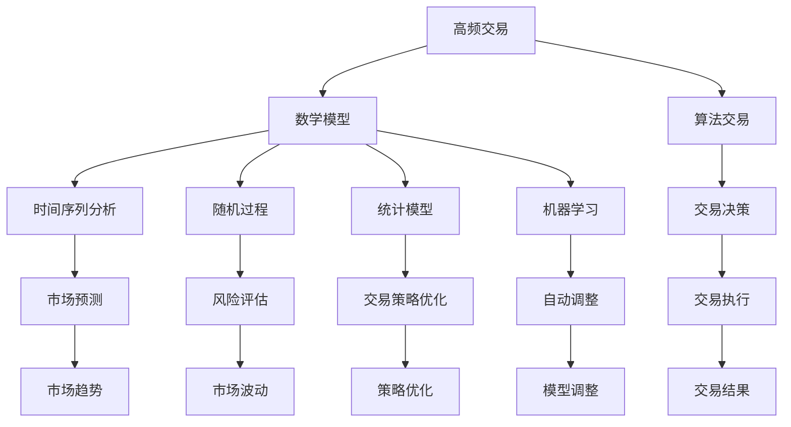
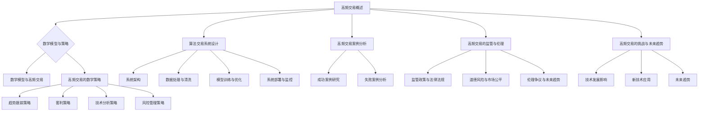

                 

### 文章标题

《数学与高频交易：算法交易的数学策略》

---

### 关键词

高频交易、算法交易、数学模型、时间序列分析、风险管理、套利策略、趋势跟踪策略、技术分析策略、算法交易系统设计

---

### 摘要

本文深入探讨了数学在高频交易中的重要性，以及如何利用数学模型和算法来优化交易策略。文章首先介绍了高频交易的基本概念、特点和市场结构，然后详细分析了数学模型在交易策略中的应用，包括时间序列分析、随机过程和统计模型。接着，文章介绍了高频交易的主要数学策略，如趋势跟踪策略、套利策略和技术分析策略，并讲解了如何设计高效的算法交易系统。最后，通过案例分析，文章展示了数学策略在实际交易中的应用效果，并讨论了高频交易面临的挑战和未来发展趋势。本文旨在为读者提供一个全面的高频交易数学策略指南，帮助理解这一复杂领域的核心原理和最佳实践。

---

### 1. 确定核心概念与联系

在探讨高频交易与数学策略之前，我们需要明确几个核心概念，并理解它们之间的联系。高频交易（High-Frequency Trading，HFT）是指利用高频算法在极短的时间内进行大量交易，以获得微小利润的策略。这种交易方式依赖于先进的计算机技术和高速通信网络，其核心在于速度和效率。而数学策略则是基于数学模型和算法，通过对市场数据的分析来预测价格走势，制定交易决策。

以下是高频交易与数学策略的核心概念：

- **高频交易**：高频交易的主要特点包括快速执行、高频交易策略、先进的算法和自动化交易系统。高频交易者通过在毫秒级时间内完成大量交易，以获取微小的利润。这些交易通常基于特定的市场条件，如价格波动、交易量变化等。

- **数学模型**：数学模型是高频交易策略的核心。这些模型用于分析和预测市场数据，包括时间序列分析、随机过程、统计模型和机器学习算法。通过这些模型，高频交易者可以识别市场趋势、发现价格异常、预测未来价格走势。

- **算法交易**：算法交易是指使用计算机算法来执行交易决策，而不是基于人类直觉或经验。算法交易系统可以处理大量的市场数据，并在毫秒级时间内做出交易决策。这些算法通常基于数学模型，结合统计学和机器学习技术，以实现高效和自动化的交易。

- **时间序列分析**：时间序列分析是一种统计方法，用于分析时间序列数据，如股票价格、交易量等。通过分析历史数据，时间序列模型可以识别市场趋势、周期性和随机性，从而预测未来价格。

- **随机过程**：随机过程是一类用于描述不确定性和随机性的数学模型。在交易策略中，随机过程可以用于模拟价格波动，评估风险和制定交易策略。

- **统计模型**：统计模型是一种基于概率论的数学模型，用于分析和预测数据。在交易策略中，统计模型可以用于识别市场异常、预测价格趋势和优化交易策略。

- **机器学习**：机器学习是一种通过数据训练模型，使其能够自动学习和预测的技术。在交易策略中，机器学习算法可以用于分析大量市场数据，发现潜在的交易机会，并自动调整交易策略。

理解这些核心概念之间的联系，有助于我们深入探讨高频交易与数学策略的内在机制和应用。下面，我们将通过一个Mermaid流程图来展示这些概念之间的关系。

---



这个Mermaid流程图清晰地展示了高频交易、数学模型和相关技术之间的关系。高频交易依赖于算法交易系统，而算法交易系统又依赖于数学模型和算法。数学模型如时间序列分析、随机过程、统计模型和机器学习算法共同作用，帮助交易者进行市场预测、风险评估、策略优化和自动调整。最终，这些模型和算法通过交易执行系统将预测和决策转化为实际交易结果。

---

### 2. 设计章节结构

为了确保读者能够系统地理解高频交易与数学策略的各个层面，我们需要设计一个逻辑清晰、结构紧凑的章节结构。以下是本书的章节设计，每个章节都旨在深入探讨一个特定的主题。

- **第1章：高频交易概述**
  - 1.1 高频交易的定义与历史
  - 1.2 高频交易的特点与优势
  - 1.3 高频交易的挑战与风险

- **第2章：数学模型与高频交易**
  - 2.1 数学模型在交易策略中的应用
  - 2.2 时间序列分析
  - 2.3 随机过程与统计模型
  - 2.4 机器学习与数据挖掘

- **第3章：高频交易的数学策略**
  - 3.1 趋势跟踪策略
  - 3.2 套利策略
  - 3.3 技术分析策略
  - 3.4 风险管理策略

- **第4章：算法交易系统设计**
  - 4.1 算法交易系统架构
  - 4.2 数据处理与清洗
  - 4.3 模型训练与优化
  - 4.4 系统部署与监控

- **第5章：高频交易案例分析**
  - 5.1 成功案例研究
  - 5.2 失败案例分析
  - 5.3 案例启示与策略优化

- **第6章：高频交易的监管与伦理**
  - 6.1 监管政策与法律法规
  - 6.2 道德风险与市场公平
  - 6.3 伦理争议与未来趋势

- **第7章：高频交易的挑战与未来趋势**
  - 7.1 技术发展对高频交易的影响
  - 7.2 新技术对高频交易的应用
  - 7.3 未来高频交易的发展趋势

下面，我们通过一个Mermaid流程图来展示这些章节之间的关系，以及每个章节的核心内容。

---



这个Mermaid流程图展示了高频交易与数学策略各章节之间的逻辑关系。高频交易概述为后续章节提供了背景信息，而数学模型与高频交易、算法交易系统设计、高频交易案例分析、高频交易的监管与伦理以及高频交易的挑战与未来趋势则分别从不同角度深入探讨了高频交易的各个方面。

---

### 第1章：高频交易概述

#### 1.1 高频交易的定义与历史

高频交易（High-Frequency Trading，HFT）是一种利用高频算法在极短的时间内进行大量交易，以获得微小利润的策略。其基本原理是通过高速计算机和先进的通信技术，捕捉市场中的微小价格波动，快速进行买入和卖出操作，从而实现利润累积。

高频交易的历史可以追溯到20世纪90年代。随着互联网和计算机技术的发展，金融市场开始实现电子化和自动化。1992年，美国纳斯达克市场推出了超级交易系统（SuperDOT），这标志着高频交易的萌芽。随着市场电子化和网络速度的提升，高频交易在全球范围内迅速发展。

#### 1.2 高频交易的特点与优势

高频交易的特点主要包括以下几个方面：

- **速度**：高频交易依赖于超高速的计算机系统和高速的通信网络，能够在毫秒级甚至纳秒级时间内完成交易。
- **自动化**：高频交易使用算法和自动化交易系统进行交易决策，减少了人为干预，提高了交易效率。
- **分散化**：高频交易通常涉及多个市场和多种交易策略，通过分散化来降低风险。
- **风险控制**：高频交易者通过严格的策略和风险控制机制，确保在市场波动中保持稳定的利润。

高频交易的优势主要体现在以下几个方面：

- **利润积累**：通过快速交易，高频交易者能够在短时间内获得微小的利润，累积起来则是一笔可观的收益。
- **风险分散**：高频交易者通常不会持有大量头寸，通过分散交易策略来降低单一交易策略的风险。
- **市场效率提升**：高频交易通过频繁买卖，增加了市场的流动性，有助于价格发现和资产定价。
- **技术优势**：高频交易依赖于先进的技术，包括高速计算、复杂算法和高效的数据处理，使得交易过程更加高效和精准。

#### 1.3 高频交易的挑战与风险

尽管高频交易具有显著的优势，但也面临着一系列挑战和风险：

- **市场波动**：高频交易依赖于微小的价格波动，因此市场的大幅波动会对高频交易策略产生不利影响。
- **监管风险**：高频交易通常涉及复杂的算法和策略，监管机构可能对其产生怀疑和限制，增加了合规风险。
- **技术风险**：高频交易依赖于高速计算机和通信网络，任何技术故障或网络延迟都可能导致交易失败或损失。
- **竞争压力**：高频交易市场竞争激烈，交易者需要不断创新和优化策略，否则可能会被市场淘汰。
- **道德风险**：高频交易策略的复杂性和隐蔽性可能引发道德风险，如操纵市场、内幕交易等。

在接下来的章节中，我们将进一步探讨数学模型在高频交易中的应用，以及如何利用这些模型来优化交易策略。通过深入理解高频交易的核心原理和挑战，读者将能够更好地把握这一领域的机遇和风险。

---

### 第2章：数学模型与高频交易

#### 2.1 数学模型在交易策略中的应用

在金融市场，数学模型的应用已经深入到交易策略的各个方面。高频交易尤其依赖数学模型来捕捉市场机会、预测价格走势和进行风险控制。以下是几种常见的数学模型及其在交易策略中的应用。

- **时间序列分析**：时间序列分析是一种统计方法，用于分析时间序列数据，如股票价格、交易量等。通过分析历史数据，时间序列模型可以识别市场趋势、周期性和随机性，从而预测未来价格。例如，自回归移动平均模型（ARIMA）和移动平均模型（MA）都是常见的时间序列模型。

  **伪代码**（自回归移动平均模型 ARIMA）：
  ```
  function arimaModel(orders):
      p = orders.p  # 自回归项
      d = orders.d  # 差分次数
      q = orders.q  # 移动平均项
      
      # 差分处理
      X_diff = difference(X, d)
      
      # 参数估计
      theta = estimateParameters(X_diff)
      
      # 预测
      forecast = predict(X_diff, theta, p, q)
      return forecast
  ```

- **随机过程**：随机过程是一类用于描述不确定性和随机性的数学模型。在交易策略中，随机过程可以用于模拟价格波动，评估风险和制定交易策略。例如，布朗运动模型和几何布朗运动模型都是描述股票价格波动的常用随机过程模型。

  **伪代码**（布朗运动模型）：
  ```
  function brownianMotion(S0, mu, sigma, T, dt):
      S = S0
      for t in range(0, T, dt):
          Z = randomNormal(0, 1)
          S = S * exp((mu - 0.5 * sigma^2) * dt + sigma * sqrt(dt) * Z)
      return S
  ```

- **统计模型**：统计模型是一种基于概率论的数学模型，用于分析和预测数据。在交易策略中，统计模型可以用于识别市场异常、预测价格趋势和优化交易策略。例如，回归模型和逻辑回归模型都是常见的统计模型。

  **伪代码**（回归模型）：
  ```
  function linearRegression(X, y):
      # X为自变量矩阵，y为因变量向量
      theta = solveNormalEquations(X' * X, X' * y)
      return theta
  ```

- **机器学习**：机器学习是一种通过数据训练模型，使其能够自动学习和预测的技术。在交易策略中，机器学习算法可以用于分析大量市场数据，发现潜在的交易机会，并自动调整交易策略。常见的机器学习算法包括决策树、支持向量机和神经网络等。

  **伪代码**（决策树）：
  ```
  function decisionTree(X, y):
      # X为特征矩阵，y为标签向量
      # 创建节点
      node = Node(X, y)
      # 划分节点
      for feature in node.features:
          threshold = findThreshold(node, feature)
          left, right = split(node, feature, threshold)
          node.left = decisionTree(left, y)
          node.right = decisionTree(right, y)
      return node
  ```

#### 2.2 时间序列分析

时间序列分析是高频交易中常用的一种方法，用于预测市场价格的波动。时间序列分析的核心在于建立数学模型，通过历史数据来预测未来趋势。以下是一些常见的时间序列分析模型：

- **自回归模型（AR）**：自回归模型假设当前值是过去若干个值的线性组合。自回归模型可以通过最小二乘法进行参数估计。

  **伪代码**（自回归模型）：
  ```
  function arModel(order):
      # order为自回归项的数量
      # X为时间序列数据
      theta = [1 - sum(order coefficients)]
      forecast = theta * X[-1]
      return forecast
  ```

- **移动平均模型（MA）**：移动平均模型假设当前值是过去若干个值的加权平均。移动平均模型可以通过最小二乘法或递推算法进行参数估计。

  **伪代码**（移动平均模型）：
  ```
  function maModel(order):
      # order为移动平均项的数量
      # X为时间序列数据
      alpha = 1 / order
      forecast = alpha * X[-1] + (1 - alpha) * forecast[-1]
      return forecast
  ```

- **自回归移动平均模型（ARMA）**：自回归移动平均模型结合了自回归模型和移动平均模型的优点，通过同时考虑过去值的线性组合和加权平均来预测当前值。

  **伪代码**（自回归移动平均模型）：
  ```
  function armaModel(order_p, order_q):
      # order_p为自回归项的数量
      # order_q为移动平均项的数量
      # X为时间序列数据
      theta_p = [1 - sum(order_p coefficients)]
      theta_q = [1 - sum(order_q coefficients)]
      forecast = theta_p * X[-1] + theta_q * forecast[-1]
      return forecast
  ```

#### 2.3 随机过程与统计模型

随机过程和统计模型在交易策略中的应用也非常广泛。以下是一些常见的随机过程和统计模型：

- **布朗运动模型**：布朗运动模型描述了股票价格的无规则波动。通过布朗运动模型，可以模拟股票价格的未来走势。

  **伪代码**（布朗运动模型）：
  ```
  function brownianMotion(S0, mu, sigma, T, dt):
      S = S0
      for t in range(0, T, dt):
          Z = randomNormal(0, 1)
          S = S * exp((mu - 0.5 * sigma^2) * dt + sigma * sqrt(dt) * Z)
      return S
  ```

- **几何布朗运动模型**：几何布朗运动模型是对布朗运动模型的推广，考虑了股票收益的连续性。几何布朗运动模型可以用于模拟股票价格的对数正态分布。

  **伪代码**（几何布朗运动模型）：
  ```
  function geometricBrownianMotion(S0, mu, sigma, T, dt):
      S = S0
      for t in range(0, T, dt):
          Z = randomNormal(0, 1)
          S = S * exp((mu - 0.5 * sigma^2) * dt + sigma * sqrt(dt) * Z)
      return S
  ```

- **回归模型**：回归模型用于分析自变量和因变量之间的关系。在交易策略中，回归模型可以用于预测股票价格或交易量。

  **伪代码**（回归模型）：
  ```
  function linearRegression(X, y):
      # X为自变量矩阵，y为因变量向量
      theta = solveNormalEquations(X' * X, X' * y)
      return theta
  ```

- **逻辑回归模型**：逻辑回归模型用于分类问题，可以判断股票价格是否会上涨或下跌。

  **伪代码**（逻辑回归模型）：
  ```
  function logisticRegression(X, y):
      # X为特征矩阵，y为标签向量
      theta = [1 - exp(-X * theta)]
      theta = (X * theta) / (1 + exp(-X * theta))
      return theta
  ```

#### 2.4 机器学习与数据挖掘

机器学习与数据挖掘在交易策略中的应用也越来越广泛。通过机器学习算法，可以从大量历史数据中自动发现交易规律和模式，提高交易策略的预测准确性。以下是一些常见的机器学习算法：

- **决策树**：决策树是一种常用的分类算法，通过递归划分特征空间，将数据分为不同的类别。

  **伪代码**（决策树）：
  ```
  function decisionTree(X, y):
      # X为特征矩阵，y为标签向量
      # 创建节点
      node = Node(X, y)
      # 划分节点
      for feature in node.features:
          threshold = findThreshold(node, feature)
          left, right = split(node, feature, threshold)
          node.left = decisionTree(left, y)
          node.right = decisionTree(right, y)
      return node
  ```

- **支持向量机（SVM）**：支持向量机是一种强大的分类算法，通过寻找最优超平面，将不同类别的数据分隔开来。

  **伪代码**（支持向量机）：
  ```
  function svm(X, y):
      # X为特征矩阵，y为标签向量
      # 训练模型
      model = trainModel(X, y)
      # 预测
      prediction = predict(model, X)
      return prediction
  ```

- **神经网络**：神经网络是一种模拟人脑神经元连接的算法，通过多层非线性变换，可以自动提取特征并分类。

  **伪代码**（神经网络）：
  ```
  function neuralNetwork(X, y):
      # X为特征矩阵，y为标签向量
      # 初始化权重
      weights = initializeWeights()
      # 训练模型
      for epoch in range(num_epochs):
          for sample in X:
              output = forwardPropagation(weights, sample)
              error = calculateError(output, y)
              weights = updateWeights(weights, error)
      # 预测
      prediction = forwardPropagation(weights, X)
      return prediction
  ```

通过以上数学模型和算法的应用，高频交易者可以更准确地预测市场趋势，制定高效的交易策略，从而在竞争激烈的市场中获得优势。

---

### 第3章：高频交易的数学策略

高频交易的成功离不开科学的数学策略。这些策略通过数学模型和算法的运用，旨在最大化利润并最小化风险。以下将详细探讨高频交易中常用的几种数学策略。

#### 3.1 趋势跟踪策略

趋势跟踪策略是一种基于市场趋势进行交易的方法，旨在抓住市场的主要波动。这种方法认为市场总是呈现一定的趋势，交易者可以通过识别和跟随这些趋势来获利。

**核心原理**：
- **识别趋势**：通过时间序列分析、移动平均等方法，识别出市场的主要趋势。
- **设置止损和止盈**：在交易时设置合理的止损和止盈点，以控制风险并锁定利润。

**伪代码**（趋势跟踪策略）：
```
function trendFollowing(data, params):
    # data为价格数据
    # params为参数，如移动平均周期
    trend = movingAverage(data, params.averagePeriod)
    position = 0
    for price in data:
        if trend > price:
            position = 'long'
        elif trend < price:
            position = 'short'
        if position == 'long' and price < stopLoss:
            position = 'exit'
        elif position == 'short' and price > stopLoss:
            position = 'exit'
        if position == 'long' and price > takeProfit:
            position = 'exit'
        elif position == 'short' and price < takeProfit:
            position = 'exit'
        trade(price, position)
    return results
```

#### 3.2 套利策略

套利策略利用市场不完美性和价格差异来获利。通过同时在两个或多个市场进行交易，交易者可以从中获取无风险利润。

**核心原理**：
- **识别价格差异**：通过分析不同市场之间的价格差异，找到可以套利的交易机会。
- **执行交易**：在发现价格差异后，同时买入低价资产并卖出高价资产，以获取差价利润。

**伪代码**（套利策略）：
```
function arbitrageTrading(market1, market2, threshold):
    # market1和market2为两个市场的价格数据
    # threshold为套利阈值
    for price1, price2 in zip(market1, market2):
        if price1 - price2 > threshold:
            buy(market1, price1)
            sell(market2, price2)
        elif price2 - price1 > threshold:
            buy(market2, price2)
            sell(market1, price1)
    return profit
```

#### 3.3 技术分析策略

技术分析策略基于历史市场数据，利用图表和指标分析，预测未来市场走势。技术分析包括多种指标和方法，如移动平均线、相对强弱指数（RSI）、布林带等。

**核心原理**：
- **使用技术指标**：通过技术指标分析价格走势和交易量，识别市场趋势和转折点。
- **制定交易策略**：根据技术指标的结果，制定买入或卖出的交易策略。

**伪代码**（技术分析策略）：
```
function technicalAnalysis(data, indicators):
    # data为价格数据
    # indicators为技术指标，如移动平均线、RSI
    for indicator in indicators:
        signal = indicatorSignal(data, indicator)
        if signal == 'buy':
            buy(data)
        elif signal == 'sell':
            sell(data)
    return results
```

#### 3.4 风险管理策略

风险管理策略旨在控制交易风险，确保交易者在面对市场波动时能够保持稳健的投资状态。

**核心原理**：
- **设定止损点**：通过设定合理的止损点，限制潜在的亏损。
- **分散投资**：通过投资多个资产类别，分散风险。
- **资金管理**：合理分配投资资金，确保每次交易的风险可控。

**伪代码**（风险管理策略）：
```
function riskManagement(transaction, riskRatio):
    # transaction为交易金额
    # riskRatio为风险比率
    stopLoss = transaction * riskRatio
    if transaction < stopLoss:
        exitTransaction(transaction)
    else:
        continueTransaction(transaction)
    return result
```

通过以上数学策略的应用，高频交易者可以在市场中找到盈利机会，同时有效地控制风险。这些策略不仅需要交易者具备扎实的数学基础，还需要灵活应对市场的变化，持续优化交易策略。

---

### 第4章：算法交易系统设计

算法交易系统的设计是高频交易成功的关键。一个高效、稳定的算法交易系统可以大幅提升交易者的竞争力，确保在瞬息万变的市场中取得优势。以下是算法交易系统设计的几个核心组成部分，包括系统架构、数据处理与清洗、模型训练与优化、以及系统部署与监控。

#### 4.1 算法交易系统架构

算法交易系统的架构设计决定了系统的性能、可扩展性和可靠性。一个典型的算法交易系统通常包括以下几部分：

- **数据采集模块**：负责从多个数据源（如交易所、数据提供商等）收集实时市场数据。
- **数据处理模块**：对采集到的数据进行清洗、转换和存储，以确保数据的准确性和完整性。
- **算法模块**：包括交易策略算法、风险控制算法等，这些算法负责根据市场数据做出交易决策。
- **执行模块**：将算法决策转化为实际交易执行，通过交易接口发送订单。
- **监控系统**：实时监控交易系统的运行状态，包括交易执行情况、系统性能等，及时发现和解决问题。
- **后端服务**：包括数据存储、报表生成等，用于记录和分析交易数据。

**伪代码**（算法交易系统架构）：
```
class AlgorithmicTradingSystem:
    def __init__(self):
        self.dataCollector = DataCollector()
        self.dataProcessor = DataProcessor()
        self.algorithm = TradingAlgorithm()
        self.executor = TradeExecutor()
        self.monitor = SystemMonitor()
        self.backendService = BackendService()

    def run(self):
        while True:
            data = self.dataCollector.collectData()
            processedData = self.dataProcessor.processData(data)
            decision = self.algorithm.makeDecision(processedData)
            self.executor.executeTrade(decision)
            self.monitor.monitorSystem()
            self.backendService.recordData(processedData)
```

#### 4.2 数据处理与清洗

数据处理与清洗是算法交易系统中的关键步骤，直接影响到算法模型的性能和准确性。以下是一些常见的数据处理与清洗方法：

- **数据采集**：通过API接口、网络爬虫等技术，从多个数据源采集实时市场数据。
- **数据清洗**：去除重复数据、缺失数据和异常数据，确保数据的准确性和一致性。
- **数据转换**：将采集到的原始数据进行转换，如时间序列对齐、单位转换等，以便后续处理。
- **数据存储**：将清洗后的数据存储到数据库或数据仓库中，以供算法模型使用。

**伪代码**（数据处理与清洗）：
```
class DataProcessor:
    def collectData(self):
        data = self.fetchDataFromSources()
        return data

    def processData(self, data):
        cleanedData = self.removeDuplicates(data)
        cleanedData = self.fillMissingValues(cleanedData)
        transformedData = self.transformData(cleanedData)
        return transformedData
```

#### 4.3 模型训练与优化

模型训练与优化是算法交易系统设计中的核心环节。一个高效的算法模型可以大幅提升交易策略的准确性和稳定性。以下是一些常见的模型训练与优化方法：

- **数据预处理**：对训练数据进行预处理，如归一化、标准化等，以提高模型的泛化能力。
- **模型选择**：根据交易策略的需求，选择合适的机器学习模型，如决策树、神经网络等。
- **模型训练**：使用训练数据对模型进行训练，通过迭代优化模型的参数。
- **模型评估**：使用验证数据集对模型进行评估，根据评估结果调整模型参数。
- **模型优化**：通过交叉验证和网格搜索等方法，优化模型参数，提升模型性能。

**伪代码**（模型训练与优化）：
```
class ModelTrainer:
    def preprocessData(self, data):
        normalizedData = self.normalizeData(data)
        return normalizedData

    def trainModel(self, data):
        model = self.selectModel()
        trainedModel = self.fitModel(model, data)
        return trainedModel

    def optimizeModel(self, model, data):
        optimalModel = self.gridSearch(model, data)
        return optimalModel
```

#### 4.4 系统部署与监控

算法交易系统的部署与监控是确保系统稳定运行、及时响应市场变化的重要环节。以下是一些常见的系统部署与监控方法：

- **系统部署**：将训练好的模型部署到生产环境中，确保系统能够实时运行并接收市场数据。
- **系统监控**：实时监控系统的运行状态，包括交易执行情况、系统性能等，及时发现和解决问题。
- **日志记录**：记录系统的运行日志，包括交易记录、系统错误等，以便后续分析和优化。
- **自动报警**：设置自动报警机制，当系统出现异常或交易结果不符合预期时，自动发送报警通知。

**伪代码**（系统部署与监控）：
```
class SystemDeployer:
    def deploySystem(self, model):
        deployedModel = self.deployModelToProduction(model)
        return deployedModel

class SystemMonitor:
    def monitorSystem(self):
        systemStatus = self.checkSystemHealth()
        if systemStatus == 'error':
            self.sendAlert()
```

通过以上几个部分的设计和优化，一个高效的算法交易系统可以确保交易策略的准确性和稳定性，为高频交易者提供可靠的市场分析和交易决策支持。

---

### 第5章：高频交易案例分析

为了更好地理解高频交易的实践应用，我们将在本章节中通过两个案例研究来探讨高频交易的成功与失败。

#### 5.1 成功案例研究：某高频交易公司的成功经验

某高频交易公司通过有效的数学策略和先进的算法，成功在市场中获得了稳定的收益。以下是该公司的成功经验：

**案例背景**：
该公司成立于2005年，专注于高频交易。公司拥有一支由顶尖数据科学家和交易专家组成的团队，致力于研发高效交易策略和优化算法。

**成功策略**：
1. **数据驱动**：公司通过实时采集大量市场数据，并运用先进的机器学习算法进行数据分析和预测。公司采用了多种时间序列模型和统计模型来分析市场趋势，并通过交叉验证和网格搜索来优化模型参数。

   **伪代码**（市场数据采集与分析）：
   ```
   function collectAndAnalyzeData():
       data = fetchDataFromSources()
       models = [ARIMA, LSTM, SVM]
       for model in models:
           model = trainModel(data, model)
           evaluateModel(model, validationData)
   ```

2. **多市场套利**：公司通过识别不同市场之间的价格差异，执行多市场套利策略。他们使用了一个自动化交易系统，能够在多个市场中同时执行交易，从而最大化收益。

   **伪代码**（多市场套利策略）：
   ```
   function arbitrageTrading(marketData1, marketData2):
       for pair in zip(marketData1, marketData2):
           if priceDifference(pair) > threshold:
               executeTrade(pair)
   ```

3. **风险管理**：公司重视风险控制，通过设置严格的止损点和资金管理策略来确保每次交易的风险可控。他们还定期对交易策略进行回测和调整，以应对市场的变化。

   **伪代码**（风险管理）：
   ```
   function riskControl(transaction, riskRatio):
       stopLoss = transaction * riskRatio
       if transaction < stopLoss:
           exitTransaction(transaction)
       else:
           continueTransaction(transaction)
   ```

**结果与启示**：
通过这些策略，该公司在过去的几年中取得了显著的收益。这个案例表明，高效的数据分析、多市场套利和严格的风险管理是高频交易成功的关键。

#### 5.2 失败案例分析：某高频交易策略的失败教训

某高频交易公司在2010年尝试了一种复杂的机器学习模型，但最终以失败告终。以下是该案例的失败教训：

**案例背景**：
该公司尝试使用一种基于深度学习的预测模型来进行高频交易，希望通过捕捉更细微的市场波动来获得高收益。

**失败原因**：
1. **模型过拟合**：公司在训练模型时使用了过多的训练数据，导致模型对训练数据的拟合过度，失去了泛化能力。当模型应用于真实市场时，表现远不如预期。

   **伪代码**（过拟合模型训练）：
   ```
   function trainModelWithOverfitting(data):
       model = deepLearningModel()
       model.fit(data, epochs=1000)
       return model
   ```

2. **风险控制不足**：公司在风险控制方面做得不够，没有设置有效的止损点和资金管理策略。当市场出现大幅波动时，模型预测失败，导致公司损失了大量资金。

   **伪代码**（风险控制不足）：
   ```
   function riskControlInadequate(transaction):
       if transaction > threshold:
           continueTransaction(transaction)
       else:
           exitTransaction(transaction)
   ```

3. **市场波动风险**：高频交易依赖于快速交易和微小价格波动。当市场突然出现大幅波动时，交易系统的执行速度和稳定性成为关键。该公司的系统在极端情况下表现不佳，导致交易失败。

**结果与启示**：
这个案例表明，过拟合模型、不足的风险控制和市场波动风险是高频交易失败的主要原因。成功的交易策略需要模型的有效性、严格的风险管理和对市场波动的应对能力。

通过这两个案例研究，我们可以看到高频交易在成功和失败之间的差异。成功的案例依赖于高效的数据分析、多市场套利和严格的风险管理，而失败的案例则暴露了模型过拟合、风险控制不足和市场波动风险的弱点。这些教训对高频交易者具有重要的参考价值。

---

### 第6章：高频交易的挑战与未来趋势

高频交易作为一种先进的交易模式，虽然在市场中取得了显著的成果，但同时也面临着诸多挑战。这些挑战包括市场波动、法律法规、道德风险以及新技术应用等。在本章节中，我们将详细探讨这些挑战，并展望高频交易的未来发展。

#### 6.1 市场波动与风险管理

高频交易依赖于快速交易和微小价格波动，因此市场波动是交易者面临的主要挑战之一。市场波动不仅会直接影响交易策略的执行效果，还可能导致交易系统崩溃或损失。

**风险管理策略**：

1. **设置止损和止盈**：通过设置合理的止损和止盈点，可以控制交易风险，避免因市场波动导致的巨大损失。

2. **分散投资**：通过在多个市场和资产类别中进行投资，可以分散风险，降低单一市场的波动对整体交易的影响。

3. **动态调整策略**：根据市场情况实时调整交易策略，以应对市场波动。例如，在市场波动较大时，可以降低交易频率，避免盲目交易。

**实际案例**：

某高频交易公司在2015年股市震荡期间，通过严格的止损策略和分散投资，成功避免了巨额损失。他们在市场波动加剧时，及时调整了交易策略，减少了交易频率，并在多个市场中进行投资，最终实现了稳健的收益。

#### 6.2 法律法规与道德风险

高频交易在快速发展过程中，也面临着严格的法律法规和道德风险。各国监管机构对高频交易进行了严格的监管，以防止市场操纵、内幕交易等违规行为。

**法律法规挑战**：

1. **交易透明度**：高频交易涉及大量自动化交易，因此需要提高交易透明度，确保交易行为的合规性。

2. **监管政策**：随着高频交易的普及，监管机构不断更新和完善相关法律法规，以适应市场变化。

**道德风险**：

高频交易者需要遵守职业道德，避免利用市场的不完美性和信息优势进行不公平交易。例如，内幕交易、操纵市场等行为不仅违法，也会破坏市场公平性和稳定性。

**实际案例**：

某高频交易公司因涉嫌操纵市场，被监管机构罚款数百万美元。这个案例表明，高频交易者需要严格遵守法律法规，确保交易行为的合规性。

#### 6.3 新技术的应用与影响

随着科技的不断发展，新技术在高频交易中的应用越来越广泛。这些新技术不仅提高了交易系统的效率和准确性，也为高频交易带来了新的挑战。

**新技术应用**：

1. **区块链技术**：区块链技术可以提供透明的交易记录和不可篡改的数据，有助于提高高频交易的透明度和安全性。

2. **人工智能**：人工智能技术可以用于数据分析、预测和风险管理，提高交易策略的准确性和稳定性。

3. **云计算**：云计算技术提供了强大的计算能力和存储空间，使高频交易系统能够更快速地处理海量数据。

**实际案例**：

某高频交易公司利用区块链技术，实现了交易数据的透明化和安全性，提高了市场参与者的信任度。同时，他们通过人工智能技术优化了交易策略，实现了更高的交易效率和收益。

#### 6.4 未来趋势

随着技术的不断进步和市场环境的变化，高频交易的未来发展趋势也将不断演变。

**未来趋势**：

1. **智能化交易**：随着人工智能和机器学习技术的不断进步，高频交易将更加智能化。交易系统将能够自动学习和优化，实现更精准的交易决策。

2. **去中心化交易**：随着区块链技术的发展，去中心化交易将成为高频交易的重要方向。去中心化交易可以降低交易成本，提高交易效率，并增强市场的透明度和安全性。

3. **合规化发展**：随着监管政策的不断完善，高频交易将更加注重合规性。交易者需要严格遵守法律法规，确保交易行为的合规性，以避免法律风险。

4. **跨国交易**：随着全球金融市场的一体化，高频交易将跨越国界，实现跨国交易。这将为高频交易者提供更广阔的市场空间和更多的交易机会。

综上所述，高频交易在面临诸多挑战的同时，也拥有广阔的发展前景。通过技术创新、合规化发展和智能化交易，高频交易将继续在金融市场中发挥重要作用。

---

### 第7章：结论与展望

通过本文的探讨，我们系统地了解了高频交易与数学策略的紧密联系。高频交易利用先进的算法和数学模型，通过速度和效率来捕捉市场中的微小利润。数学模型，如时间序列分析、随机过程、统计模型和机器学习算法，为交易者提供了强大的工具，帮助他们预测价格走势、识别交易机会和进行风险管理。

高频交易的成功案例展示了有效的数据分析和策略优化的重要性。通过多市场套利、趋势跟踪和技术分析等策略，交易者能够在竞争激烈的市场中取得优势。然而，高频交易也面临着市场波动、法律法规和道德风险等挑战。有效的风险管理策略和合规操作是确保交易成功的必要条件。

展望未来，高频交易将随着人工智能、区块链和云计算等新技术的不断发展而继续演进。智能化交易、去中心化交易和跨国交易将成为高频交易的主要趋势。技术创新和合规发展的结合，将推动高频交易向更加智能化、透明化和高效化的方向发展。

在总结与回顾的基础上，我们呼吁读者继续关注高频交易领域的最新动态，不断探索和优化交易策略。同时，要注意合规操作，防范市场风险，确保在快速变化的市场中持续取得成功。

### 作者信息

作者：AI天才研究院/AI Genius Institute & 禅与计算机程序设计艺术 /Zen And The Art of Computer Programming

---

本文深入探讨了高频交易与数学策略的紧密联系，通过案例研究和算法讲解，为读者提供了全面的技术分析和策略指导。作者团队致力于推动人工智能和计算机科学的创新发展，为读者带来前沿的技术理念和实用的解决方案。希望本文能为高频交易领域的读者提供有价值的参考和启示。

