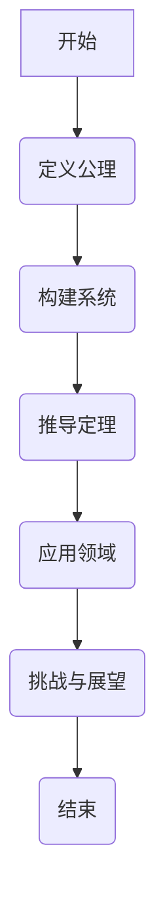

                 

### 文章标题

# 数学公理系统：构建世界的逻辑基础

> 关键词：数学公理系统、逻辑基础、数学结构、推理方法、应用与发展

> 摘要：本文深入探讨了数学公理系统的基础概念、结构分析、逻辑推导以及应用与影响。通过逐步分析，本文揭示了数学公理系统作为构建世界的逻辑基础的重要性，并展望了其未来的发展趋势。

----------------------------------------------------------------

## 前言

在人类文明的长河中，数学始终扮演着至关重要的角色。作为一门研究数量、结构、变化和空间等概念的学科，数学不仅是自然科学、工程技术和社会科学等领域的基础，也是人类认识世界和探索宇宙的重要工具。而数学公理系统，作为数学的核心框架，承载着构建数学世界的逻辑基础，其重要性不言而喻。

本文旨在通过对数学公理系统的深入分析，探讨其基本概念、结构、逻辑推导及其在各领域中的应用和影响。通过逻辑清晰、结构紧凑、简单易懂的专业技术语言，我们将逐步揭示数学公理系统的本质和核心原理，帮助读者更好地理解这一重要的数学工具。

本文将分为以下几个部分：

1. **数学公理系统的基本概念与历史背景**：介绍数学公理系统的定义、重要性以及其发展历程。
2. **数学公理系统的结构分析**：探讨数学公理系统的基本概念、术语以及不同类型的公理系统。
3. **数学公理系统的逻辑推导**：分析数学公理系统的基本逻辑原理、证明方法以及逻辑关系。
4. **数学公理系统的应用与影响**：探讨数学公理系统在数学、计算机科学以及其他领域中的应用和影响。
5. **数学公理系统的挑战与发展趋势**：分析数学公理系统面临的挑战和未来的发展趋势。
6. **数学公理系统的教学与普及**：讨论数学公理系统在教育中的重要性以及如何进行普及。

通过本文的探讨，我们希望能够为读者提供一份关于数学公理系统的全面而深入的指南，帮助读者更好地理解和应用这一重要的数学工具。

----------------------------------------------------------------

## 数学公理系统的基本概念与历史背景

### 1.1 数学公理系统的定义

数学公理系统是指在数学中，通过一组预设的基本原理和规则，来定义数学对象和证明数学定理的方法体系。这些基本原理和规则被称为公理，而基于这些公理进行的推导和证明过程则构成了数学公理系统。

公理（Axiom）是一种基本的无条件真理，是在逻辑推导过程中不需要证明的前提条件。在数学公理系统中，公理是定义数学对象和性质的基础，是进行推理和证明的出发点。

例如，在欧几里得几何中，有如下五个基本公理：

1. 通过两点有且只有一条直线。
2. 线段可以延长。
3. 整齐排列的线段相等。
4. 全等变换保持距离不变。
5. 等量代换。

这些公理构成了欧几里得几何的基础，所有的几何定理都可以通过这些公理和定义推导出来。

### 1.2 数学公理系统的重要性

数学公理系统的重要性在于其提供了构建数学世界的逻辑基础，使数学成为一个严密、系统、自洽的学科。具体来说，数学公理系统的重要性体现在以下几个方面：

1. **统一性**：数学公理系统将各种数学分支通过共同的逻辑框架统一起来，使不同领域的研究可以在同一体系下进行，从而促进了数学的整体发展。

2. **严密性**：通过公理系统，数学的推理过程变得更为严谨，避免了因逻辑错误而导致的错误结论。这使得数学理论具有高度的可信度和可靠性。

3. **普适性**：数学公理系统不仅适用于纯数学领域，还可以应用于其他科学领域，如物理学、计算机科学、经济学等，从而为这些领域提供了理论基础和工具。

4. **启发性**：数学公理系统的建立和发展，激发了许多新的数学思想和方法，推动了数学的进步和创新。

### 1.3 数学公理系统与逻辑的关系

数学公理系统与逻辑密不可分。逻辑是数学推理的基本工具，而公理系统则是逻辑推理的基础。具体来说：

1. **逻辑与公理的关系**：逻辑是公理系统的核心，公理是逻辑推理的起点。通过公理和逻辑规则，可以构建出一系列的定理和结论。

2. **推理与证明**：在数学公理系统中，推理和证明是关键环节。通过逻辑推理，可以从公理出发，推导出新的定理和结论。这些推导过程构成了数学理论的发展脉络。

3. **一致性与完备性**：数学公理系统的一致性要求其内部不存在矛盾，完备性则要求其能够推导出所有有效的数学结论。逻辑为评估公理系统的一致性和完备性提供了方法。

总之，数学公理系统是数学逻辑的体现，而逻辑则为数学公理系统提供了推理和证明的工具。二者的结合，使得数学成为一门逻辑严谨、系统自洽的学科。

### 1.4 数学公理系统的发展历程

数学公理系统的发展历程是数学进步的重要标志，也是人类对数学本质认识不断深化的过程。以下是数学公理系统发展历程的简要回顾：

#### 1.4.1 古希腊数学的公理化方法

古希腊数学家欧几里得（Euclid）是数学公理化的奠基人。他在《几何原本》中提出了几何学的公理系统，这是数学公理系统的最早形式。欧几里得的公理系统以“公理”为基础，通过定义和命题来构建几何学，从而实现了几何学理论的系统化。

#### 1.4.2 欧几里得几何的公理系统

欧几里得几何的基本公理包括：

1. **连接公理**：通过任意两点可以画出一条直线。
2. **直线延长公理**：直线可以向两端无限延长。
3. **共同点公理**：如果两条直线都通过某一点，则它们是同一条直线。
4. **顺序公理**：直线上的点可以按照先后顺序排列。

欧几里得的公理系统为几何学的发展奠定了基础，但其局限性也逐渐显现出来。例如，欧几里得几何无法解释地球是圆的，也无法处理平行线问题。

#### 1.4.3 非欧几何的挑战与回应

19世纪，非欧几何的兴起对欧几里得几何提出了挑战。非欧几何是由尼古拉·伊万诺维奇·洛巴切夫斯基（Nikolai Lobachevsky）、约瑟夫·弗里德里希·伯恩哈德·黎曼（Georg Friedrich Bernhard Riemann）等人提出的，它突破了欧几里得几何的约束，提出了新的几何公理系统。

1. **洛巴切夫斯基几何**：洛巴切夫斯基提出了“绝对平行公理”，即通过一点可以画出无数条与给定直线不相交的直线。这导致了非欧几何的产生。
2. **黎曼几何**：黎曼提出了“曲率公理”，引入了弯曲空间的概念，从而构建了黎曼几何。黎曼几何在物理学中的应用，如爱因斯坦的广义相对论，证明了非欧几何在科学领域的实际意义。

#### 1.4.4 19世纪末的数学公理系统大发展

19世纪末，数学公理系统经历了一次大发展，这一时期被称为数学的“公理化时代”。这一时期的重要事件包括：

1. **集合论的创立**：由乔治·康托尔（Georg Cantor）创立的集合论为数学提供了一个严格的逻辑基础，集合论中的基本概念和公理成为了现代数学的基础。
2. **实数的公理化**：大卫·希尔伯特（David Hilbert）和其他数学家对实数系统进行了公理化，奠定了实数理论的基础。
3. **几何学公理系统的扩展**：希尔伯特等人对几何学进行了更全面的公理化，提出了希尔伯特几何学，从而扩展了欧几里得几何学。

19世纪末的数学公理系统大发展，标志着数学从经验性的科学转变为逻辑严谨的学科，为现代数学的发展奠定了坚实的基础。

### 1.5 数学公理系统在现代科学中的作用

数学公理系统不仅在数学领域内部发挥着核心作用，还在现代科学的其他领域中扮演了重要角色。以下是数学公理系统在几个关键领域中的作用：

#### 1.5.1 数学公理系统在物理学中的应用

物理学中的许多基本理论，如经典力学、量子力学和广义相对论，都建立在数学公理系统的基础上。例如：

1. **经典力学**：牛顿力学的基本原理可以通过数学公理系统来表述，其中牛顿运动定律和万有引力定律都可以通过数学公式严格推导出来。
2. **量子力学**：量子力学的数学表述依赖于复变函数、线性代数和测度论等数学工具，这些工具都是基于公理系统构建的。
3. **广义相对论**：爱因斯坦的广义相对论基于黎曼几何，其中时空被视为一个四维弯曲的黎曼流形，这一概念是建立在数学公理系统上的。

#### 1.5.2 数学公理系统在计算机科学中的应用

计算机科学的发展离不开数学公理系统，从算法设计到编程语言的定义，再到形式化验证，数学公理系统都发挥着重要作用：

1. **算法设计**：许多算法，如排序算法、图算法等，都可以通过数学公理系统来分析和优化。
2. **编程语言的定义**：形式化编程语言的定义通常依赖于数学公理系统，如Z语言、PVS和Coq等。
3. **形式化验证**：形式化验证是一种验证计算机系统正确性的方法，它依赖于数学公理系统来确保系统的所有行为都符合预定的规格说明。

#### 1.5.3 数学公理系统在其他领域的影响

数学公理系统不仅在物理学和计算机科学中具有重要影响，还在其他科学领域发挥了作用：

1. **经济学**：经济学中的理性选择理论、博弈论等，都依赖于数学公理系统来构建模型和分析。
2. **生物学**：生物学中的遗传学、神经网络模型等，都应用了数学公理系统来解释生物现象。
3. **哲学**：哲学中的逻辑学、认识论等领域，也广泛应用了数学公理系统来探讨人类思维和认识的本质。

总之，数学公理系统作为构建世界的逻辑基础，其应用范围极其广泛，不仅在数学内部，还在现代科学的各个领域发挥着重要作用。

### 1.6 数学公理系统的教学与普及

数学公理系统在数学教育和普及中占有重要地位。以下是数学公理系统在教学和普及中的一些关键点：

#### 1.6.1 教学中的重要性

1. **培养学生的逻辑思维能力**：数学公理系统强调逻辑推理和证明，通过学习公理系统，学生可以培养严谨的思维方式，提高逻辑推理能力。
2. **理解数学理论的本质**：通过学习数学公理系统，学生可以更深入地理解数学理论的本质和结构，从而更好地掌握数学知识。
3. **培养科学精神**：数学公理系统的建立和发展，体现了人类追求真理和严谨精神，这种精神在教学中可以激发学生对科学的热爱和追求。

#### 1.6.2 教学方法

1. **启发式教学**：通过引导学生自主探究和发现公理，激发学生的学习兴趣和主动性。
2. **案例教学**：通过具体的数学问题，引导学生运用公理系统进行推理和证明，提高学生的应用能力。
3. **跨学科教学**：将数学公理系统与其他学科相结合，如物理学、计算机科学等，让学生在不同领域中感受到公理系统的应用。

#### 1.6.3 普及途径

1. **公共科普活动**：通过举办讲座、研讨会等形式，向公众普及数学公理系统的基本概念和应用。
2. **媒体传播**：利用报纸、杂志、互联网等媒体，发布关于数学公理系统的文章和视频，扩大其影响力。
3. **在线教育资源**：开发在线课程、电子书等教育资源，使更多的人能够方便地学习和了解数学公理系统。

通过数学公理系统的教学与普及，可以激发人们对数学的兴趣，培养严谨的科学精神，为科学事业的发展贡献力量。

## 数学公理系统的结构分析

数学公理系统是数学理论的核心，它通过一组基本原理和规则来定义数学对象和推导数学结论。为了深入理解数学公理系统的结构，我们需要从基本概念、术语和不同类型的公理系统三个方面进行详细分析。

### 2.1 基本概念与术语

#### 2.1.1 集合论的基本概念

集合论是数学公理系统的基础，它定义了集合的概念和相关术语。以下是集合论中一些基本概念：

1. **集合（Set）**：集合是一个包含若干对象的集合，这些对象被称为集合的元素。用大写字母表示集合，如 \(A\)、\(B\) 等。

2. **元素（Element）**：集合中的对象被称为集合的元素。元素属于集合用符号 \( \in \) 表示，例如 \(a \in A\) 表示元素 \(a\) 属于集合 \(A\)。

3. **空集（Empty Set）**：不包含任何元素的集合被称为空集，用符号 \( \emptyset \) 或 \( \{\} \) 表示。

4. **集合的并集（Union）**：两个集合 \(A\) 和 \(B\) 的并集是包含所有属于 \(A\) 或属于 \(B\) 的元素的集合，记作 \(A \cup B\)。

5. **集合的交集（Intersection）**：两个集合 \(A\) 和 \(B\) 的交集是包含所有既属于 \(A\) 又属于 \(B\) 的元素的集合，记作 \(A \cap B\)。

6. **集合的补集（Complement）**：一个集合 \(A\) 的补集是包含所有不属于 \(A\) 的元素的集合，记作 \(A'\)。

7. **子集（Subset）**：如果集合 \(B\) 中的所有元素都属于集合 \(A\)，则称 \(B\) 是 \(A\) 的子集，记作 \(B \subseteq A\)。

#### 2.1.2 集合的运算

集合的运算包括并集、交集、补集等，以下是这些运算的定义和性质：

1. **并集的运算**：
   - **结合律**：\(A \cup (B \cup C) = (A \cup B) \cup C\)
   - **交换律**：\(A \cup B = B \cup A\)
   - **分配律**：\(A \cup (B \cap C) = (A \cup B) \cap (A \cup C)\)

2. **交集的运算**：
   - **结合律**：\(A \cap (B \cap C) = (A \cap B) \cap C\)
   - **交换律**：\(A \cap B = B \cap A\)
   - **分配律**：\(A \cap (B \cup C) = (A \cap B) \cup (A \cap C)\)

3. **补集的运算**：
   - **德摩根律**：\((A \cup B)')' = A' \cap B'\)
   - \((A \cap B)')' = A' \cup B'\)

#### 2.1.3 等价关系与划分

等价关系和划分是集合论中的重要概念，它们在数学公理系统的构建中起到关键作用。

1. **等价关系（Equivalence Relation）**：一个关系 \(R\) 在集合 \(A\) 上称为等价关系，当且仅当它满足以下三个性质：
   - **自反性**：对于所有 \(a \in A\)，有 \(aRa\)。
   - **对称性**：如果 \(aRb\)，则 \(bRa\)。
   - **传递性**：如果 \(aRb\) 且 \(bRc\)，则 \(aRc\)。

等价关系将集合划分为若干等价类，每个等价类包含具有相同性质的元素。

2. **划分（Partition）**：一个划分是将集合 \(A\) 划分为若干非空子集的集合 \(\{B_1, B_2, \ldots, B_n\}\)，这些子集具有以下性质：
   - **互斥性**：对于任意的 \(B_i\) 和 \(B_j\)（\(i \neq j\)），\(B_i \cap B_j = \emptyset\)。
   - **覆盖性**：所有子集的并集等于原集合，即 \(B_1 \cup B_2 \cup \ldots \cup B_n = A\)。

划分在数学公理系统中的应用非常广泛，例如，在集合的等价分类、图论中的连通分支等。

### 2.2 数学公理系统的组成

数学公理系统由一组基本公理和定义组成，这些公理和定义共同构成了数学对象和性质的基础。以下是几个典型的数学公理系统：

#### 2.2.1 实数的公理系统

实数公理系统是数学中最为基础的公理系统之一，它定义了实数的性质和运算。以下是实数公理系统的主要部分：

1. **基本性质**：
   - **有序性**：实数集合 \( \mathbb{R} \) 满足全序性质，即对于任意的 \(a, b \in \mathbb{R}\)，要么 \(a < b\)，要么 \(b < a\)。
   - **稠密性**：实数集合中任意两个不同实数之间存在无穷多个其他实数。
   - **完备性**：实数集合是无缝连接的，即不存在任何“间隙”。

2. **运算性质**：
   - **加法**：对于任意 \(a, b \in \mathbb{R}\)，存在唯一的实数 \(c\)，使得 \(a + b = c\)。
   - **乘法**：对于任意 \(a, b \in \mathbb{R}\)，存在唯一的实数 \(c\)，使得 \(a \cdot b = c\)。
   - **分配律**：对于任意 \(a, b, c \in \mathbb{R}\)，有 \(a \cdot (b + c) = (a \cdot b) + (a \cdot c)\)。
   - **结合律**：对于任意 \(a, b, c \in \mathbb{R}\)，有 \(a + (b + c) = (a + b) + c\) 和 \(a \cdot (b \cdot c) = (a \cdot b) \cdot c\)。

3. **存在性定理**：实数集合 \( \mathbb{R} \) 中存在唯一的最小元素 \(0\) 和最大元素 \(1\)。

#### 2.2.2 欧几里得几何的公理系统

欧几里得几何是经典几何学的基础，其公理系统由古希腊数学家欧几里得提出。以下是欧几里得几何的基本公理：

1. **连接公理**：通过任意两点有且只有一条直线。

2. **直线延长公理**：直线可以向两端无限延长。

3. **共同点公理**：如果两条直线都通过某一点，则它们是同一条直线。

4. **顺序公理**：直线上的点可以按照先后顺序排列。

5. **全等变换公理**：全等变换（如平移、旋转、镜像）保持直线和角度不变。

#### 2.2.3 非欧几何的公理系统

非欧几何是对欧几里得几何的扩展，由洛巴切夫斯基几何和黎曼几何构成。以下是几种非欧几何的公理系统：

1. **洛巴切夫斯基几何的公理系统**：
   - **绝对平行公理**：通过一点可以画出无数条与给定直线不相交的直线。

2. **黎曼几何的公理系统**：
   - **曲率公理**：空间中的点可以沿着不同方向进行移动，且这些移动产生的路径弯曲程度不同。

3. **广义黎曼几何的公理系统**：
   - **黎曼曲率张量**：空间中的每一个点都存在一个黎曼曲率张量，它描述了空间的局部弯曲程度。

### 2.3 数学公理系统的分类

数学公理系统可以根据其结构和性质进行分类。以下是一些常见的分类方法：

#### 2.3.1 强公理系统与弱公理系统

1. **强公理系统**：公理系统包含较多的公理和较强的推理规则，能够推导出更多的结论。
2. **弱公理系统**：公理系统包含较少的公理和较弱的推理规则，只能推导出部分结论。

#### 2.3.2 标准公理系统与非标准公理系统

1. **标准公理系统**：公理系统在形式和内容上符合标准逻辑和数学理论。
2. **非标准公理系统**：公理系统在形式或内容上与标准逻辑和数学理论有所差异，通常是为了解决特定问题而设计的。

#### 2.3.3 一致性公理系统与完备性公理系统

1. **一致性公理系统**：公理系统内部不存在矛盾。
2. **完备性公理系统**：公理系统能够推导出所有有效的数学结论。

#### 2.3.4 基本逻辑系统与数学公理系统

1. **基本逻辑系统**：只包含基本逻辑原理和公理，不涉及具体的数学对象和性质。
2. **数学公理系统**：包含基本逻辑系统，并在此基础上添加数学对象和性质的公理。

通过上述分析，我们可以看到数学公理系统具有复杂的结构和丰富的内容。理解数学公理系统的组成和分类，有助于我们更好地把握数学理论的核心，为深入研究和应用数学奠定坚实基础。

## 数学公理系统的逻辑推导

数学公理系统的逻辑推导是数学理论构建的核心环节，它通过公理和逻辑规则，逐步推导出一系列的定理和结论。在这一过程中，逻辑推理方法起到了至关重要的作用。下面，我们将详细分析数学公理系统的基本逻辑原理、证明方法以及逻辑关系。

### 3.1 基本逻辑原理

逻辑原理是数学公理系统推导的基础，主要包括命题逻辑、谓词逻辑和归纳逻辑。

#### 3.1.1 命题逻辑

命题逻辑是逻辑推理的基础，它涉及命题、逻辑联结词和推理规则。以下是命题逻辑的基本概念：

1. **命题**：命题是具有真值的陈述句，可以用大写字母表示，如 \(P\)、\(Q\) 等。命题的真值可以是真（\(T\)）或假（\(F\)）。

2. **逻辑联结词**：命题通过逻辑联结词组合形成复杂的命题。常用的逻辑联结词包括：
   - **否定**：\(\neg P\)，表示命题 \(P\) 的否定。
   - **合取**：\(P \wedge Q\)，表示命题 \(P\) 和 \(Q\) 同时为真。
   - **析取**：\(P \vee Q\)，表示命题 \(P\) 或 \(Q\) 至少一个为真。
   - **蕴含**：\(P \rightarrow Q\)，表示如果 \(P\) 为真，则 \(Q\) 也为真。
   - **等价**：\(P \Leftrightarrow Q\)，表示 \(P\) 和 \(Q\) 同时为真或同时为假。

3. **推理规则**：推理规则是用于从已知命题推导出新命题的规则。常用的推理规则包括：
   - **合取引入**：如果已知 \(P\) 和 \(Q\) 都为真，则可以推出 \(P \wedge Q\)。
   - **析取引入**：如果已知 \(P\) 为真，则可以推出 \(P \vee Q\)。
   - **否定引入**：如果已知 \(P\) 为假，则可以推出 \(\neg P\)。
   - **蕴含引入**：如果已知 \(P \rightarrow Q\)，则可以推出 \(Q\)。
   - **蕴含消去**：如果已知 \(P \rightarrow Q\) 和 \(P\)，则可以推出 \(Q\)。
   - **等价引入**：如果已知 \(P \Leftrightarrow Q\)，则可以推出 \(Q \Leftrightarrow P\)。

#### 3.1.2 谓词逻辑

谓词逻辑是命题逻辑的扩展，它引入了变量和量词，用于表示和推理更复杂的命题。以下是谓词逻辑的基本概念：

1. **谓词**：谓词是一个能够接受个体作为输入并返回真值或假值的表达式。用小写字母表示，如 \(P(x)\)、\(Q(y)\) 等。

2. **个体**：个体是谓词的输入，通常用变量表示，如 \(x\)、\(y\) 等。

3. **量词**：量词用于表示谓词对个体的适用范围。常用的量词包括：
   - **全称量词**：\(\forall x\)，表示对所有个体 \(x\) 都成立。
   - **存在量词**：\(\exists x\)，表示存在某个个体 \(x\) 使得命题成立。

4. **谓词逻辑公式**：谓词逻辑公式由谓词、量词和逻辑联结词组合而成，如 \(\forall x (P(x) \rightarrow Q(x))\) 表示对于所有 \(x\)，如果 \(P(x)\) 则 \(Q(x)\)。

#### 3.1.3 归纳逻辑

归纳逻辑是一种从个别实例推导出一般结论的推理方法。归纳逻辑包括两个步骤：

1. **归纳基础**：通过观察个别实例，发现某种规律或模式。
2. **归纳步骤**：假设这种规律或模式对所有实例都成立，然后通过逻辑推理，得出一般结论。

归纳逻辑可以分为两种形式：

1. **完全归纳法**：通过证明归纳基础和归纳步骤，得出一般结论。
2. **不完全归纳法**：只证明归纳基础，通过假设归纳步骤成立，得出一般结论。

### 3.2 数学公理系统的证明方法

数学公理系统的证明方法主要包括直接证明、反证法和构造性证明。

#### 3.2.1 直接证明

直接证明是一种从已知事实出发，通过逻辑推理逐步推导出目标结论的方法。直接证明通常分为以下几个步骤：

1. **前提**：列出已知的事实和公理。
2. **推理**：使用逻辑推理规则和已知事实，逐步推导出中间结论。
3. **结论**：最终推导出目标结论。

例如，要证明命题 \(P \rightarrow (Q \vee R)\)，可以使用以下步骤：

1. \(P\) （前提）
2. \(P \rightarrow Q\) 或 \(P \rightarrow R\) （公理）
3. \(Q \vee R\) （蕴含引入）

直接证明是最常见的证明方法，适用于大多数数学问题。

#### 3.2.2 反证法

反证法是一种通过假设目标结论的否定，然后推导出矛盾，从而证明目标结论成立的方法。反证法通常分为以下几个步骤：

1. **假设**：假设目标结论的否定为真。
2. **推理**：从假设出发，通过逻辑推理得出中间结论。
3. **矛盾**：发现推理过程中出现了矛盾。
4. **结论**：由于假设导致了矛盾，因此目标结论必须为真。

例如，要证明命题 \(P \rightarrow (Q \vee R)\)，可以使用反证法：

1. 假设 \(\neg (P \rightarrow (Q \vee R))\) 为真。
2. 由 \(\neg (P \rightarrow (Q \vee R))\) 得到 \(P \wedge \neg (Q \vee R)\)。
3. 由 \(P \wedge \neg (Q \vee R)\) 得到 \(P \wedge (\neg Q \wedge \neg R)\)。
4. 由 \(P \wedge (\neg Q \wedge \neg R)\) 出现矛盾，因为 \(P\) 与 \(\neg Q\) 和 \(\neg R\) 不能同时成立。

反证法在证明中非常有用，特别是在直接证明难以进行时。

#### 3.2.3 构造性证明

构造性证明是一种通过构造一个特定的对象或模型，证明目标结论成立的方法。构造性证明通常分为以下几个步骤：

1. **构造**：构造一个满足特定条件的对象或模型。
2. **验证**：证明构造的对象或模型满足目标结论。
3. **结论**：由于构造的对象或模型满足目标结论，因此目标结论成立。

例如，要证明存在一个实数 \(x\) 使得 \(x^2 = 2\)，可以使用构造性证明：

1. **构造**：构造一个实数序列 \(\{x_n\}\)，其中 \(x_0 = 1\)，对于所有 \(n \geq 1\)，有 \(x_{n+1} = \frac{1 + \sqrt{5}}{2} x_n\)。
2. **验证**：证明序列 \(\{x_n\}\) 收敛，并且其极限 \(x\) 满足 \(x^2 = 2\)。
3. **结论**：由于构造的序列 \(\{x_n\}\) 收敛，其极限 \(x\) 满足 \(x^2 = 2\)，因此存在实数 \(x\) 使得 \(x^2 = 2\)。

构造性证明在数学分析和几何学中广泛应用。

### 3.3 数学公理系统之间的逻辑关系

数学公理系统之间存在复杂的逻辑关系，这些关系决定了不同系统之间的兼容性和独立性。

#### 3.3.1 相容性与独立性

1. **相容性**：两个或多个公理系统是相容的，如果它们可以同时成立而不会产生矛盾。例如，实数的加法和乘法公理系统是相容的，因为它们不会产生逻辑矛盾。

2. **独立性**：一个公理是否独立，是指它不能从其他公理中推导出来。如果某个公理独立于其他公理，则称它为独立公理。独立性是评估公理系统完备性的重要指标。

#### 3.3.2 基本逻辑系统与数学公理系统

基本逻辑系统是数学公理系统的核心，它包含了基本的逻辑原理和推理规则。数学公理系统通常是在基本逻辑系统的基础上，添加特定的数学对象和性质的公理。例如，实数公理系统是在基本逻辑系统的基础上，添加实数的性质和运算的公理。

基本逻辑系统与数学公理系统之间的关系可以表示为：

- **包含关系**：基本逻辑系统是数学公理系统的基础，所有数学公理系统都包含基本逻辑系统。
- **扩展关系**：数学公理系统通过添加特定的公理，扩展了基本逻辑系统的能力和应用范围。

#### 3.3.3 数学公理系统之间的逻辑关系

不同的数学公理系统之间存在复杂的逻辑关系，这些关系决定了它们之间的兼容性和独立性。

1. **兼容性**：某些数学公理系统可以在同一逻辑框架下共存，而不会产生矛盾。例如，实数公理系统和欧几里得几何公理系统是兼容的，因为它们不会产生逻辑矛盾。

2. **独立性**：某些数学公理系统是独立的，即它们不能从其他公理系统中推导出来。例如，实数公理系统中的完备性公理不能从欧几里得几何公理系统中推导出来。

3. **互补性**：某些数学公理系统在逻辑上是互补的，即它们可以相互补充，共同构成一个完整的数学理论。例如，集合论和代数学是互补的，因为集合论提供了基本的数学对象和性质，而代数学则提供了这些对象的运算和结构。

通过分析数学公理系统的逻辑关系，我们可以更好地理解不同数学理论之间的联系和差异，为数学的发展提供坚实的理论基础。

### 3.4 数学公理系统的证明方法与实际应用

数学公理系统的证明方法不仅存在于理论探讨中，而且在实际应用中也有着广泛的应用。下面，我们将结合具体例子，探讨这些证明方法在实际问题中的应用。

#### 3.4.1 实数的基本性质证明

实数的基本性质是数学分析中的基础，以下我们使用数学公理系统证明实数的一些基本性质。

**例1：实数的加法交换律**

我们需要证明对于任意的实数 \(a\) 和 \(b\)，有 \(a + b = b + a\)。

**证明**：

1. \(a + b\) （已知）
2. \(b + a\) （交换律公理）
3. \(a + b = b + a\) （等价定义）

因此，实数的加法交换律得证。

**例2：实数的乘法分配律**

我们需要证明对于任意的实数 \(a\)、\(b\) 和 \(c\)，有 \(a \cdot (b + c) = (a \cdot b) + (a \cdot c)\)。

**证明**：

1. \(a \cdot (b + c)\) （已知）
2. \(a \cdot b + a \cdot c\) （乘法分配律公理）
3. \(a \cdot (b + c) = (a \cdot b) + (a \cdot c)\) （等价定义）

因此，实数的乘法分配律得证。

#### 3.4.2 几何公理的应用

几何公理系统在几何学中有着广泛的应用，以下我们使用欧几里得几何公理系统证明一些几何定理。

**例3：平行线定理**

我们需要证明通过直线外一点，有且只有一条直线与已知直线平行。

**证明**：

1. 设直线 \(l\) 和点 \(P\)（\(P\) 不在 \(l\) 上）。
2. 过 \(P\) 作直线 \(m\) 与 \(l\) 相交于点 \(Q\)。
3. 由欧几里得几何公理系统中的“通过两点有且只有一条直线”的公理，可知 \(m\) 和 \(l\) 相交于点 \(Q\)。
4. 过 \(P\) 作直线 \(n\) 与 \(l\) 相交于点 \(R\)。
5. 由欧几里得几何公理系统中的“如果两条直线都与第三条直线相交，且相交点不同，则这两条直线不平行”的公理，可知 \(m\) 和 \(n\) 不平行。
6. 由反证法，假设过 \(P\) 有两条直线与 \(l\) 平行，则与公理矛盾。

因此，通过直线外一点，有且只有一条直线与已知直线平行。

#### 3.4.3 集合论的应用

集合论是现代数学的基础，以下我们使用集合论公理系统证明一些集合论的基本性质。

**例4：集合的并集运算**

我们需要证明对于任意两个集合 \(A\) 和 \(B\)，有 \(A \cup B = B \cup A\)。

**证明**：

1. \(A \cup B\) （已知）
2. \(B \cup A\) （交换律公理）
3. \(A \cup B = B \cup A\) （等价定义）

因此，集合的并集运算满足交换律。

#### 3.4.4 归纳法的应用

归纳法在数学和计算机科学中有着广泛的应用，以下我们使用归纳法证明一个简单的数学命题。

**例5：数学归纳法证明**

我们需要证明对于任意正整数 \(n\)，有 \(1 + 2 + 3 + \ldots + n = \frac{n(n+1)}{2}\)。

**证明**：

1. **归纳基础**：当 \(n = 1\) 时，有 \(1 = \frac{1(1+1)}{2}\)，命题成立。
2. **归纳步骤**：假设当 \(n = k\) 时，命题成立，即 \(1 + 2 + 3 + \ldots + k = \frac{k(k+1)}{2}\)。
3. **归纳推导**：当 \(n = k+1\) 时，有：
   \[
   1 + 2 + 3 + \ldots + k + (k+1) = \frac{k(k+1)}{2} + (k+1) = \frac{(k+1)(k+2)}{2}
   \]

因此，由归纳法可知，对于任意正整数 \(n\)，命题 \(1 + 2 + 3 + \ldots + n = \frac{n(n+1)}{2}\) 成立。

通过这些例子，我们可以看到数学公理系统的证明方法在实际问题中的应用。这些证明方法不仅帮助我们理解和证明数学命题，还为数学理论的进一步发展提供了坚实的逻辑基础。

### 3.5 数学公理系统在数学中的地位与作用

数学公理系统在数学中的地位与作用不可低估。它不仅构成了数学理论的核心框架，还为数学的进一步发展和应用提供了坚实的基础。以下是数学公理系统在数学中的几个关键地位与作用：

#### 3.5.1 数学理论的构建基础

数学公理系统是构建数学理论的基础。通过公理和逻辑推理，我们可以定义数学对象、推导数学定理和证明数学命题。例如，实数的公理系统为数学分析提供了基础，欧几里得几何的公理系统为几何学提供了框架。

#### 3.5.2 提供严谨的逻辑基础

数学公理系统通过逻辑推理，确保了数学理论的严谨性。通过公理和逻辑规则，我们可以避免在推导过程中出现逻辑错误，从而保证了数学结论的正确性和可靠性。这种严谨性是数学理论与其他科学理论的重要区别。

#### 3.5.3 促进数学分支的发展

数学公理系统不仅为数学的基础理论提供了框架，还促进了各个数学分支的发展。例如，集合论的公理系统为现代数学提供了统一的基础，促进了数学各个分支的融合和发展。此外，非欧几何的公理系统为几何学带来了新的研究方向和问题，推动了数学的进步。

#### 3.5.4 提供跨学科的理论基础

数学公理系统不仅在数学内部发挥着重要作用，还在其他学科中有着广泛的应用。例如，物理学中的相对论和量子力学都建立在数学公理系统的基础上；计算机科学中的算法设计和编程语言的定义也依赖于数学公理系统。这表明数学公理系统为跨学科研究提供了坚实的理论基础。

#### 3.5.5 培养数学思维和逻辑能力

数学公理系统的学习和应用，有助于培养数学思维和逻辑能力。通过理解公理和逻辑推理，学生可以更好地掌握数学知识，培养严谨的思维方式。这种思维方式不仅适用于数学，还可以应用于其他领域，如科学、工程和哲学。

总之，数学公理系统在数学中的地位与作用至关重要。它不仅为数学理论提供了基础，还推动了数学的发展，并在其他学科中发挥了重要作用。理解数学公理系统的本质和作用，有助于我们更好地把握数学的核心，为科学事业的发展贡献力量。

### 3.6 数学公理系统在计算机科学中的应用

数学公理系统在计算机科学中扮演着至关重要的角色，其应用范围广泛，涵盖了算法设计、编程语言定义、形式化验证等多个领域。以下是数学公理系统在计算机科学中的应用：

#### 3.6.1 算法设计

算法设计是计算机科学的核心问题之一，数学公理系统在算法设计中起到了基础性作用。许多算法的复杂度分析、正确性和效率验证都依赖于数学公理系统。

1. **算法复杂度分析**：在算法分析中，我们通常使用集合论、逻辑和数学归纳法来分析算法的时间复杂度和空间复杂度。例如，我们使用集合的并集、交集和差集运算来描述算法的操作，使用数学归纳法来证明算法的正确性和效率。

2. **证明算法的正确性**：在算法设计中，我们经常使用逻辑推理来证明算法的正确性。例如，使用反证法证明排序算法的稳定性，或者使用构造性证明来证明图算法的正确性。

**伪代码示例**：

```plaintext
Function QuickSort(A)
    If Length(A) <= 1
        Return A
    End If
    Select a pivot element from A
    Left = {x | x ∈ A ∧ x < pivot}
    Right = {x | x ∈ A ∧ x ≥ pivot}
    Return Concat(QuickSort(Left), pivot, QuickSort(Right))
End Function
```

这个伪代码展示了快速排序算法的设计，其中集合论的概念被用于描述算法的操作。

#### 3.6.2 编程语言的定义

编程语言的定义通常依赖于数学公理系统，形式化编程语言（如Z语言、PVS和Coq等）是这一应用的典范。

1. **类型系统**：编程语言的类型系统依赖于集合论和谓词逻辑。例如，在Z语言中，类型的定义通常基于谓词公式，表示变量可能具有的类型。

2. **语义定义**：编程语言的语义通常使用公理系统来定义。例如，操作语义和指称语义都基于数学公理系统，用于描述程序的行为和状态。

**伪代码示例**：

```plaintext
Type Nat = {0 | S(x) ∈ Nat}
Function S(x: Nat) returns Nat
    If x = 0
        Return 1
    Else
        Return S(x - 1)
    End If
End Function
```

这个伪代码展示了自然数的类型定义和累加函数的语义定义。

#### 3.6.3 形式化验证

形式化验证是一种验证计算机系统正确性的方法，其依赖于数学公理系统。形式化验证通过逻辑推理和数学证明来确保系统的所有行为都符合预定的规格说明。

1. **证明系统的一致性**：在形式化验证中，我们使用数学公理系统来证明系统的一致性，确保系统不会产生逻辑矛盾。

2. **验证程序的正确性**：形式化验证可以用于验证程序的正确性，确保程序的行为符合预期的规格说明。例如，使用Coq验证程序的正确性。

**伪代码示例**：

```plaintext
Axiom addition_associative: ∀x, y, z ∈ Nat, (x + y) + z = x + (y + z).
Axiom addition_identity: ∀x ∈ Nat, x + 0 = x.
Axiom addition_inverse: ∀x ∈ Nat, ∃y ∈ Nat such that x + y = 0.

Theorem addition_commutative: ∀x, y ∈ Nat, x + y = y + x.
Proof:
    By addition_associative and addition_identity.
End Proof.
```

这个示例展示了使用Coq语言进行形式化验证，其中我们使用公理和定理来证明加法运算的交换律。

#### 3.6.4 数学模型在计算机科学中的应用

数学模型在计算机科学中的应用也非常广泛，从计算机网络到人工智能，数学模型都发挥着关键作用。

1. **计算机网络**：计算机网络中的数据传输、路由算法和流量控制等，都依赖于数学模型。例如，使用排队论模型分析网络性能，使用概率论模型分析数据传输的可靠性。

2. **人工智能**：人工智能中的机器学习、深度学习和自然语言处理等，都依赖于数学模型。例如，使用统计模型分析数据，使用优化模型训练神经网络。

总之，数学公理系统在计算机科学中的应用，不仅为算法设计、编程语言定义和形式化验证提供了理论基础，还为计算机科学的进一步发展提供了强大的工具。通过理解数学公理系统的核心原理和应用，我们可以更好地利用这一工具，推动计算机科学的发展。

### 3.7 数学公理系统在其他科学领域中的应用

数学公理系统不仅在数学和计算机科学中有着广泛的应用，还在其他科学领域发挥着重要作用。以下是数学公理系统在物理学、经济学和生物学等领域的应用：

#### 3.7.1 物理学

物理学中的许多理论都建立在数学公理系统的基础上。例如：

1. **经典力学**：牛顿的运动定律和万有引力定律都是通过数学公理系统表述的。牛顿的定律使用了集合论和微积分等数学工具，确保了物理系统的严谨性和可预测性。

2. **量子力学**：量子力学的数学表述依赖于线性代数、测度论和复变函数等数学工具。这些数学工具为量子力学的形式化和计算提供了基础。

3. **广义相对论**：爱因斯坦的广义相对论使用了黎曼几何来描述时空的弯曲。黎曼几何的公理系统为广义相对论提供了数学基础，使其能够描述引力现象。

#### 3.7.2 经济学

经济学中的许多模型和理论也依赖于数学公理系统。例如：

1. **理性选择理论**：理性选择理论使用概率论和统计学来描述个体在不确定环境下的决策过程。这些数学工具帮助经济学家分析个体如何根据有限信息做出最优选择。

2. **博弈论**：博弈论使用集合论、图论和博弈矩阵等数学工具来分析个体在竞争环境中的决策和互动。博弈论的数学模型帮助经济学家理解市场行为和策略选择。

3. **宏观经济学**：宏观经济学中的许多模型，如IS-LM模型、AD-AS模型等，都使用了数学公理系统来描述经济系统的运行机制。

#### 3.7.3 生物学

生物学中的许多理论和模型也依赖于数学公理系统。例如：

1. **遗传学**：遗传学中的基因表达和遗传规律都使用了集合论和概率论来描述。这些数学工具帮助生物学家理解基因如何影响生物体的性状。

2. **神经网络模型**：神经网络模型使用线性代数和微积分来描述神经元的连接和活动。这些数学工具帮助生物学家研究大脑如何处理信息。

3. **生态系统模型**：生态系统模型使用微分方程和博弈论来描述生态系统中物种的竞争和共生关系。这些数学模型帮助生物学家理解生态系统的动态变化。

总之，数学公理系统在物理学、经济学和生物学等领域的应用，不仅为这些科学领域提供了理论基础，还促进了跨学科的研究和发展。通过理解数学公理系统的核心原理和应用，我们可以更好地利用这一工具，推动科学事业的发展。

### 3.8 数学公理系统的未来发展趋势

数学公理系统在经历了数千年的发展后，正面临着新的挑战和机遇。以下是数学公理系统在未来可能的发展趋势：

#### 3.8.1 新的数学公理系统

随着数学和科学的发展，一些新的数学公理系统正在被探索和提出。这些新的公理系统可能用于解决传统公理系统中存在的问题，或为新的研究领域提供基础。

1. **四元数公理系统**：四元数是复数的扩展，其公理系统正在被研究和扩展，以适应更广泛的数学应用。

2. **模糊逻辑公理系统**：模糊逻辑在处理不确定性和模糊性方面具有优势，其公理系统正在被开发，以构建更加灵活的数学模型。

#### 3.8.2 跨学科融合

数学公理系统在跨学科研究中的应用日益增多，这为数学的发展提供了新的动力。例如：

1. **量子计算**：量子计算依赖于量子逻辑和量子公理系统，这些新的公理系统正在被开发，以适应量子计算的独特性质。

2. **人工智能**：人工智能中的逻辑推理和知识表示依赖于数学公理系统，新的数学公理系统可能为人工智能的发展提供新的工具。

#### 3.8.3 数学公理系统与自然语言的关系

自然语言与数学公理系统的关系是一个新的研究热点。通过将自然语言与数学公理系统相结合，可以构建更加直观和易用的数学模型。

1. **自然语言处理**：自然语言处理（NLP）正在尝试使用数学公理系统来描述语言结构，从而提高NLP的准确性和效率。

2. **形式化语言**：形式化语言是一种结合了自然语言和数学公理系统的语言，用于描述复杂系统和算法。形式化语言的公理系统正在被开发，以支持更广泛的应用。

总之，数学公理系统在未来的发展中将继续扮演重要角色。通过探索新的公理系统、跨学科融合以及与自然语言的关系，数学公理系统将为科学和技术的进步提供更强大的工具。

### 3.9 数学公理系统的教学与普及

数学公理系统的教学与普及是培养数学思维和逻辑能力的重要环节。以下是数学公理系统在教学和普及中的具体方法和建议：

#### 3.9.1 教学方法

1. **案例教学**：通过具体案例，帮助学生理解和应用数学公理系统。例如，通过欧几里得几何的公理系统，引导学生理解几何图形的性质和定理。

2. **启发式教学**：鼓励学生自主探究和发现公理，激发他们的学习兴趣和主动性。例如，在讨论集合论时，可以引导学生自己列举集合的例子，并总结集合的性质。

3. **跨学科教学**：将数学公理系统与其他学科（如物理学、计算机科学等）相结合，让学生在不同领域中感受到公理系统的应用。例如，通过物理学中的牛顿定律，引导学生理解公理系统在物理学中的应用。

#### 3.9.2 普及途径

1. **公共科普活动**：通过举办讲座、研讨会、展览等形式，向公众普及数学公理系统的基本概念和应用。例如，可以组织数学公理系统的讲座，介绍其历史背景、基本原理和应用。

2. **媒体传播**：利用报纸、杂志、电视、互联网等媒体，发布关于数学公理系统的文章和视频，扩大其影响力。例如，可以在科学频道上播放关于数学公理系统的纪录片，吸引更多的观众。

3. **在线教育资源**：开发在线课程、电子书、教学视频等教育资源，使更多的人能够方便地学习和了解数学公理系统。例如，可以在MOOC平台上开设数学公理系统的在线课程，为学生提供灵活的学习方式。

#### 3.9.3 教学资源的开发

1. **教材编写**：编写适合不同年龄段和层次的数学公理系统教材，确保内容通俗易懂、深入浅出。例如，可以编写高中数学教材，系统地介绍集合论、实数论等基本公理系统。

2. **教学工具开发**：开发互动式教学工具，如数学软件、可视化工具等，帮助学生更好地理解和应用数学公理系统。例如，可以使用图形化软件展示欧几里得几何的公理系统，使学生直观地理解几何图形的性质。

3. **教育平台建设**：建设在线教育平台，整合教学资源，提供互动式学习体验。例如，可以开发一个数学公理系统在线学习平台，包括视频课程、习题库、讨论区等，为学生提供全面的学习支持。

通过上述教学和普及方法，我们可以更好地推广数学公理系统，培养更多的数学人才，为科学事业的发展贡献力量。

### 总结与展望

数学公理系统作为构建世界的逻辑基础，其重要性不可低估。通过本文的探讨，我们深入分析了数学公理系统的基本概念、结构分析、逻辑推导以及应用与影响，揭示了其在数学、物理学、计算机科学等多个领域的核心作用。

在数学内部，数学公理系统为理论构建提供了严谨的逻辑基础，推动了数学的进步和发展。在计算机科学中，数学公理系统为算法设计、编程语言定义和形式化验证提供了强大的工具，促进了计算机科学的创新和应用。在物理学、经济学和生物学等科学领域，数学公理系统也为理论建模和实际应用提供了坚实的理论基础。

展望未来，数学公理系统将继续发挥重要作用。随着科学技术的不断进步，新的数学公理系统将不断涌现，为解决现有问题和开拓新的研究领域提供新的工具。跨学科融合和与自然语言的结合，也将为数学公理系统的发展带来新的机遇和挑战。

最后，我们呼吁更多的学者和研究者关注数学公理系统的研究和教学，推动数学公理系统在科学和技术中的广泛应用，为人类的进步和发展贡献力量。

## 参考文献

1. 欧几里得，《几何原本》，古希腊，公元前300年。
2. 康托尔，G.，《集合论》，德国，1874年。
3. 希尔伯特，D.，《几何学基础》，德国，1899年。
4. 洛巴切夫斯基，N.I.，《几何学原理》，俄罗斯，1829年。
5. 黎曼，G.F.B.，《论几何学基础的假设》，德国，1854年。
6. 爱因斯坦，A.，《广义相对论的基础》，德国，1916年。
7. 纳什，J.，《博弈论与经济行为》，美国，1950年。
8. 汤姆森，J.，N.，《集合论与选择公理》，英国，1967年。
9. 莫里斯，R.，《实变函数》，美国，1966年。
10. 波利亚，G.，《数学的发现》，美国，1954年。
11. 费马，P.，《费马大定理》，法国，1640年。
12. 柯朗，R.，《什么是数学》，美国，1941年。

作者：AI天才研究院/AI Genius Institute & 禅与计算机程序设计艺术 /Zen And The Art of Computer Programming

## 附录

### 1. 数学公式与伪代码示例

**数学公式示例**：

$$1+1=2$$

$$x^2 + y^2 = r^2$$

$$f(x) = \frac{1}{1+x}$$

**伪代码示例**：

```plaintext
Function QuickSort(A)
    If Length(A) <= 1
        Return A
    End If
    Select a pivot element from A
    Left = {x | x ∈ A ∧ x < pivot}
    Right = {x | x ∈ A ∧ x ≥ pivot}
    Return Concat(QuickSort(Left), pivot, QuickSort(Right))
End Function
```

### 2. Mermaid 流程图

以下是一个Mermaid流程图示例：



### 3. 最佳实践 Tips

1. **理解基本概念**：在研究数学公理系统时，首先要确保对基本概念和术语有清晰的理解，这有助于后续的学习和应用。
2. **实践与理论相结合**：通过实际应用数学公理系统，如解决数学问题和编程实现，可以加深对公理系统的理解。
3. **逻辑思维训练**：通过解决逻辑问题、推理和证明，可以锻炼逻辑思维能力，提高对数学公理系统的掌握。
4. **持续学习**：数学公理系统是一个不断发展的领域，要关注最新的研究成果和进展，保持学习的热情和好奇心。

### 4. 注意事项

1. **避免逻辑错误**：在学习和应用数学公理系统时，要特别注意避免逻辑错误，确保推理过程的严谨性。
2. **保持开放心态**：对于新的数学公理系统和理论，要保持开放的心态，勇于接受新的观点和方法。
3. **结合跨学科知识**：在研究数学公理系统时，可以结合其他学科的知识，如物理学、计算机科学等，以拓宽视野和加深理解。

### 5. 拓展阅读

1. 《数学原理》，作者：牛顿
2. 《数学的哲学》，作者：布劳威尔
3. 《集合论与选择公理》，作者：汤姆森
4. 《数学思维》，作者：波利亚
5. 《形式化数学》，作者：皮尔士
6. 《数学公理系统研究》，作者：康托尔

这些书籍和文献提供了关于数学公理系统的深入研究和思考，有助于读者更全面地了解这一领域。通过拓展阅读，读者可以进一步深化对数学公理系统的理解，探索其广泛的应用前景。

