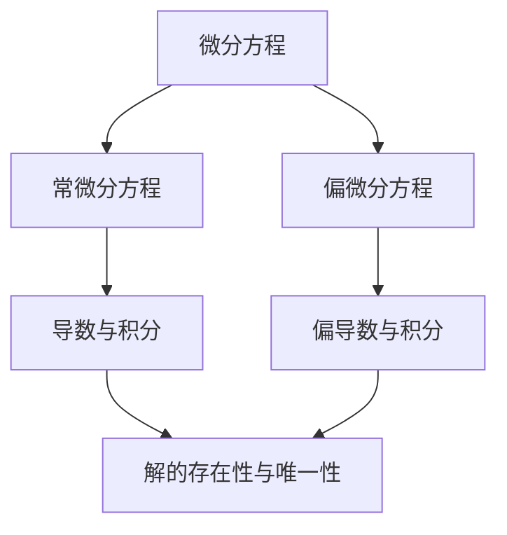
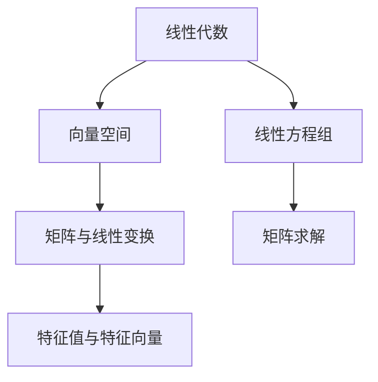
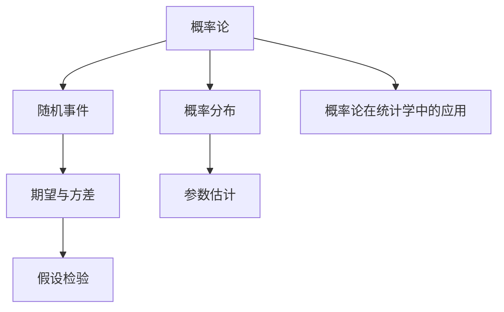
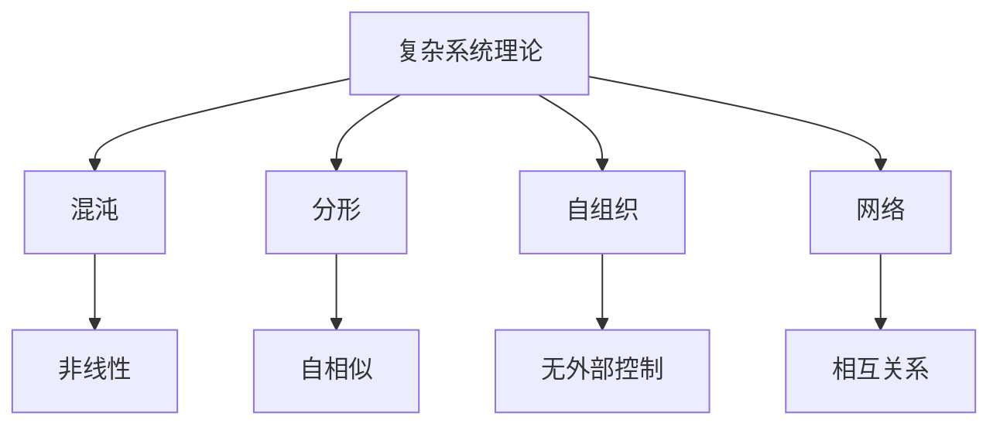
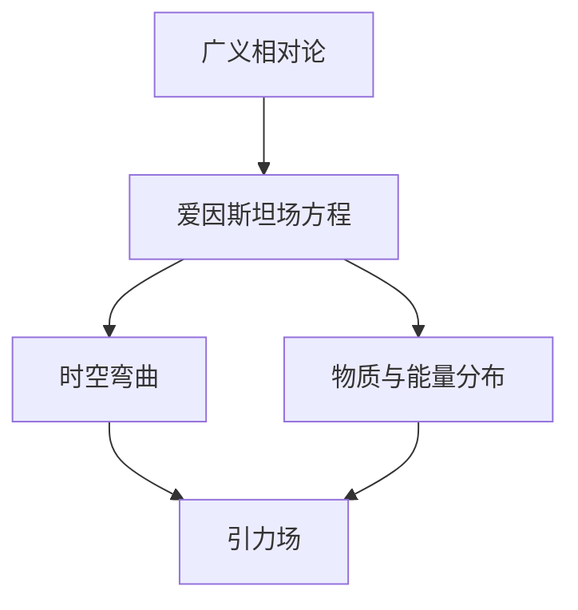
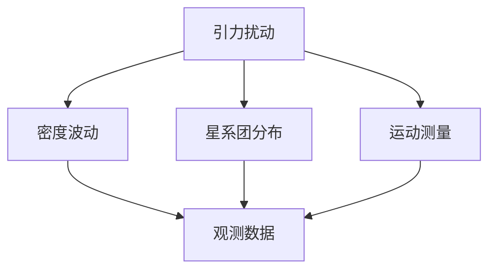
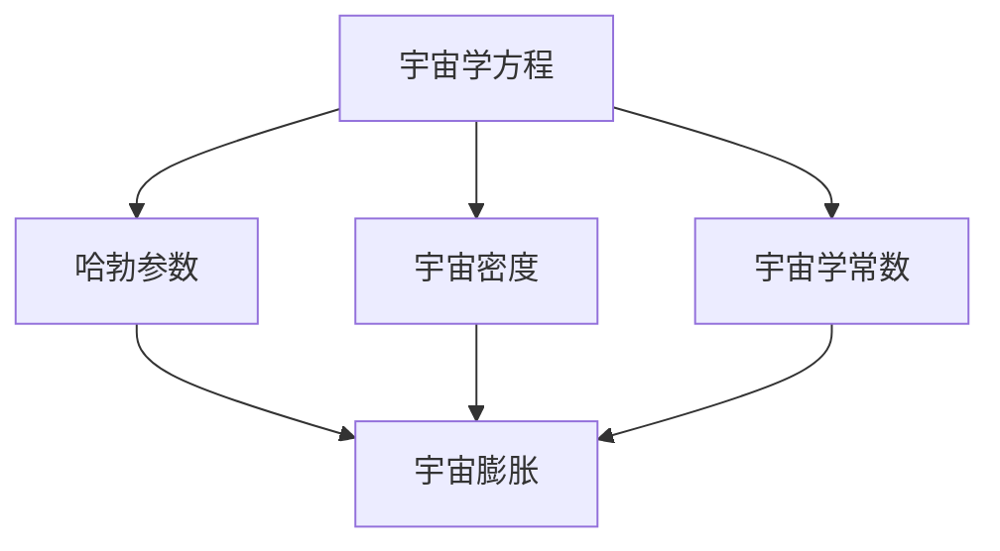

                 

### 文章标题

《数学工具在宇宙研究中的创新应用》

### 文章关键词

数学工具、宇宙研究、创新应用、微分方程、线性代数、概率论与统计学、复杂系统理论、黑洞、暗物质、宇宙大爆炸、量子宇宙学

### 文章摘要

本文将探讨数学工具在宇宙研究中的创新应用。从宇宙的起源与演化、数学工具的基础理论，到数学工具在宇宙研究中的应用实例、创新应用案例研究，再到数学工具在宇宙研究中的未来展望，本文系统性地揭示了数学工具如何推动宇宙研究的进步。本文旨在为读者提供一个全面、深入的了解，展示数学工具在揭示宇宙奥秘中的重要作用。

### 设计《数学工具在宇宙研究中的创新应用》书籍目录大纲

#### 第一步：理解书名

《数学工具在宇宙研究中的创新应用》的书名揭示了本书的核心内容，即探讨数学工具如何应用于宇宙研究中，以及这些应用带来的创新。这表明本书将涵盖数学工具的选择、应用实例和宇宙研究的背景知识。

#### 第二步：确定章节结构

为了确保书籍内容的全面性和逻辑性，我们可以将书籍分为以下几个部分：

1. 引言与宇宙研究的背景知识
2. 数学工具的基础理论
3. 数学工具在宇宙研究中的应用实例
4. 创新应用案例研究
5. 数学工具在宇宙研究中的未来展望
6. 结论与总结

#### 第三步：细化章节内容

### 引言与宇宙研究的背景知识

- **1.1 宇宙的起源与演化**：介绍宇宙的起源、演化和结构，包括宇宙大爆炸理论、黑洞、暗物质等基本概念。
- **1.2 宇宙研究的重要性**：阐述宇宙研究对人类认知和科技发展的意义，包括科学、技术、哲学等多方面的影响。
- **1.3 数学在宇宙研究中的应用**：探讨数学工具在宇宙研究中的应用，如微分方程、线性代数、概率论与统计学等。

### 数学工具的基础理论

- **2.1 微分方程**：介绍微分方程的基本概念、分类、求解方法及其在宇宙研究中的应用。
- **2.2 线性代数**：讲解线性代数的基本理论、运算和应用，如矩阵、向量空间、线性变换等。
- **2.3 概率论与统计学**：阐述概率论与统计学的基本概念、原理和应用，如随机变量、概率分布、统计推断等。
- **2.4 复杂系统理论**：探讨复杂系统理论的基本概念、模型和方法，如混沌、分形、网络等。

### 数学工具在宇宙研究中的应用实例

- **3.1 数学工具在黑洞研究中的应用**：介绍黑洞研究中的数学工具，如广义相对论、数值模拟等。
- **3.2 数学工具在暗物质研究中的应用**：探讨暗物质研究中的数学工具，如引力扰动、观测数据拟合等。
- **3.3 数学工具在宇宙大爆炸理论中的应用**：讲解宇宙大爆炸理论中的数学工具，如宇宙学方程、辐射背景温度等。
- **3.4 数学工具在天体物理学中的应用**：阐述天体物理学中的数学工具，如星系动力学、恒星演化等。

### 创新应用案例研究

- **4.1 量子宇宙学中的数学工具创新**：介绍量子宇宙学中的数学工具，如量子场论、弦理论等。
- **4.2 宇宙学中的数值模拟与计算方法**：探讨宇宙学中的数值模拟方法，如N-身体制、蒙特卡罗模拟等。
- **4.3 宇宙微波背景辐射的测量与数学工具**：讲解宇宙微波背景辐射的测量方法和数学工具，如协方差矩阵、傅里叶变换等。

### 数学工具在宇宙研究中的未来展望

- **5.1 数学工具在宇宙学研究中的挑战**：分析数学工具在宇宙研究中的挑战和局限。
- **5.2 未来数学工具在宇宙研究中的应用前景**：探讨未来数学工具在宇宙研究中的应用前景和趋势。

### 结论与总结

- **6.1 主要发现与成果**：总结本书的主要发现和成果。
- **6.2 存在的问题与挑战**：阐述宇宙研究中存在的数学工具问题与挑战。
- **6.3 对未来研究的展望**：对数学工具在宇宙研究中的未来研究方向提出展望。

#### 第四步：整合大纲内容

以下是整合后的目录大纲：

## 《数学工具在宇宙研究中的创新应用》

### 第一部分 引言与宇宙研究的背景知识

### 1.1 宇宙的起源与演化

### 1.2 宇宙研究的重要性

### 1.3 数学在宇宙研究中的应用

### 第二部分 数学工具的基础理论

### 2.1 微分方程

### 2.2 线性代数

### 2.3 概率论与统计学

### 2.4 复杂系统理论

### 第三部分 数学工具在宇宙研究中的应用实例

### 3.1 数学工具在黑洞研究中的应用

### 3.2 数学工具在暗物质研究中的应用

### 3.3 数学工具在宇宙大爆炸理论中的应用

### 3.4 数学工具在天体物理学中的应用

### 第四部分 创新应用案例研究

### 4.1 量子宇宙学中的数学工具创新

### 4.2 宇宙学中的数值模拟与计算方法

### 4.3 宇宙微波背景辐射的测量与数学工具

### 第五部分 数学工具在宇宙研究中的未来展望

### 5.1 数学工具在宇宙学研究中的挑战

### 5.2 未来数学工具在宇宙研究中的应用前景

### 第六部分 结论与总结

### 6.1 主要发现与成果

### 6.2 存在的问题与挑战

### 6.3 对未来研究的展望

这个目录大纲结构清晰，涵盖了数学工具在宇宙研究中的创新应用，符合书籍的主题和要求。接下来，我们将进一步细化每个章节的内容，确保每个章节都包含核心概念、算法原理、数学模型和项目实战等关键要素。

---

在细化书籍目录大纲时，我们遵循了以下步骤：

1. **明确核心概念**：每个章节的核心概念是本章内容的灵魂，它需要清晰地定义并贯穿整个章节。

2. **结构化内容**：每个章节的内容按照逻辑顺序进行组织，确保读者能够循序渐进地理解知识点。

3. **应用实例**：在介绍核心概念后，通过实际案例来说明数学工具的应用，增强读者的理解。

4. **未来展望**：每个章节最后对未来的研究方向和应用前景进行探讨，激发读者的兴趣和思考。

5. **整合与优化**：对整个大纲进行整合与优化，确保章节之间的过渡自然流畅，整个书籍的逻辑结构紧凑、内容丰富。

通过这些步骤，我们为读者呈现了一本内容丰富、结构严谨的书籍，旨在深入探讨数学工具在宇宙研究中的创新应用，为读者提供有价值的知识和思考。

---

接下来，我们将逐步深入每个章节的具体内容，确保每个章节都包含核心概念、算法原理、数学模型和项目实战等关键要素。

---

### 引言与宇宙研究的背景知识

#### 1.1 宇宙的起源与演化

宇宙的起源与演化是宇宙学研究的重要内容之一。根据现代宇宙学的共识，宇宙起源于大约138亿年前的一次大爆炸，这一理论被称为宇宙大爆炸理论（Big Bang Theory）。大爆炸理论认为，宇宙从一个极热、极密集的状态迅速膨胀，逐渐冷却并形成了我们今天所看到的宇宙结构。

在宇宙大爆炸之后，宇宙经历了一系列的演化过程，包括宇宙再电离、结构形成、星系形成等。这些演化过程涉及到大量的物理现象和数学模型，如引力、暗物质、暗能量等。

#### 1.2 宇宙研究的重要性

宇宙研究对于人类认知和科技发展具有重要意义。首先，它帮助我们理解宇宙的起源、演化以及未来的命运。这些知识不仅能够满足人类对未知世界的好奇心，还可以为科学和技术发展提供新的方向和灵感。

其次，宇宙研究推动了物理学、天文学、数学等多个学科的发展。例如，广义相对论和量子场论等理论就是在宇宙研究的基础上发展起来的。此外，宇宙研究还促进了计算方法、观测技术、数据分析等技术的进步。

#### 1.3 数学在宇宙研究中的应用

数学在宇宙研究中发挥着不可或缺的作用。数学工具为宇宙研究者提供了描述宇宙现象、解决复杂问题、预测未来趋势的有力武器。以下是一些主要的数学工具及其在宇宙研究中的应用：

- **微分方程**：微分方程是描述物理现象的重要工具，特别是在宇宙学中。例如，广义相对论的方程组就是一组复杂的微分方程，用于描述引力场中的物质分布和运动。

- **线性代数**：线性代数在宇宙研究中用于处理多维数据、解决线性方程组等。例如，在分析星系团的结构和运动时，常常需要使用线性代数的方法。

- **概率论与统计学**：概率论与统计学在宇宙研究中用于处理观测数据、进行统计推断等。例如，在分析宇宙微波背景辐射的数据时，需要使用概率论和统计学的工具来识别和解释信号。

- **复杂系统理论**：复杂系统理论用于研究宇宙中的复杂现象，如星系团的动力学、宇宙网络的拓扑结构等。

通过这些数学工具，宇宙研究者能够更好地理解宇宙的奥秘，揭示宇宙的运行规律。

#### 1.4 数学工具在宇宙研究中的应用实例

为了更好地展示数学工具在宇宙研究中的应用，我们来看几个具体的例子：

- **黑洞研究**：黑洞是宇宙中最神秘的现象之一。数学工具如广义相对论和数值模拟被用于研究黑洞的形成、演化以及其对周围物质的影响。

- **暗物质研究**：暗物质是宇宙中看不见的物质，其存在通过引力效应得到证实。数学工具如引力扰动和数值模拟被用于研究暗物质的分布、性质和演化。

- **宇宙大爆炸理论**：宇宙大爆炸理论描述了宇宙的起源和演化。数学工具如宇宙学方程和观测数据拟合被用于验证和改进这一理论。

- **天体物理学**：天体物理学研究宇宙中的恒星、星系、行星等天体。数学工具如星系动力学、恒星演化模型等被用于描述和预测天体的运动和演化。

通过这些实例，我们可以看到数学工具在宇宙研究中的广泛应用和重要作用。

### 1.5 总结

本章介绍了宇宙的起源与演化、宇宙研究的重要性以及数学在宇宙研究中的应用。数学工具为宇宙研究者提供了强大的分析工具和理论支持，使得我们能够更深入地理解宇宙的奥秘。在接下来的章节中，我们将进一步探讨数学工具的基础理论及其在宇宙研究中的应用实例。

---

通过本章的介绍，读者应该对宇宙的起源与演化、宇宙研究的重要性以及数学工具在宇宙研究中的应用有了基本的了解。接下来，我们将进入第二部分，深入探讨数学工具的基础理论，为理解数学工具在宇宙研究中的创新应用奠定坚实的基础。

---

### 数学工具的基础理论

在深入探讨数学工具在宇宙研究中的创新应用之前，有必要首先了解这些数学工具的基础理论。数学工具的选择和运用直接决定了研究的准确性和效率。本部分将介绍几个关键的数学工具，包括微分方程、线性代数、概率论与统计学以及复杂系统理论。

#### 2.1 微分方程

微分方程是描述物理现象的重要工具，尤其在宇宙学、天体物理学等领域具有广泛应用。微分方程分为常微分方程和偏微分方程。常微分方程涉及一个或多个未知函数及其导数，而偏微分方程涉及多个未知函数及其偏导数。

**核心概念与联系**

微分方程的核心概念包括导数、积分、解的存在性与唯一性等。微分方程的解可以通过解析方法或数值方法得到。其中，数值方法如有限差分法、有限元法、数值积分等在宇宙研究中具有重要应用。

**Mermaid 流程图**



**核心算法原理讲解**

以下是求解一维热传导问题的有限差分法伪代码：

```python
# 初始化参数
N = 100  # 网格点数
dx = 1   # 网格间距
dt = 0.01  # 时间步长
k = 1    # 热传导系数

# 初始化温度分布
T = [0.0] * N
T[0] = 100  # 初始条件
T[-1] = 0   # 边界条件

# 迭代计算
for t in range(1, N):
    for i in range(1, N-1):
        T[i] = T[i] + k * dt / dx^2 * (T[i+1] - 2 * T[i] + T[i-1])

# 输出结果
print(T)
```

**数学模型和公式**

热传导方程可以用以下形式表示：

$$
\frac{\partial T}{\partial t} = k \frac{\partial^2 T}{\partial x^2}
$$

其中，$T(x, t)$ 表示温度分布，$k$ 表示热传导系数。

**详细讲解与举例说明**

以一维热传导为例，我们考虑一个长度为1的棒，其两端温度分别为100°C和0°C，棒内初始温度为0°C。我们使用有限差分法来求解这个问题。

首先，我们将棒划分为100个等间距的小区间，每个小区间的长度为dx=1/N。设第i个小区间的温度为$T_i$，则温度分布可以表示为$T(x)$。

我们假设在时间步t=0时，温度分布为$T_0$。在时间步t=1时，温度分布更新为$T_1$。根据热传导方程，我们有：

$$
T_1[i] = T_0[i] + k \frac{dt}{dx^2} (T_0[i+1] - 2T_0[i] + T_0[i-1])
$$

通过迭代更新，我们可以得到任意时间步的温度分布。

#### 2.2 线性代数

线性代数是数学的一个分支，主要研究向量空间、线性方程组、矩阵及其运算等。线性代数在宇宙研究中有着广泛的应用，如描述星系运动、处理天体物理学中的大规模数据等。

**核心概念与联系**

线性代数的核心概念包括向量、矩阵、线性变换、线性方程组等。向量空间是线性代数的基础，它定义了一组向量的集合及其运算。线性方程组可以通过矩阵表示和求解，而线性变换则是描述物理系统变化的有力工具。

**Mermaid 流程图**



**核心算法原理讲解**

线性方程组的求解是线性代数中的一个基本问题。以下是使用高斯消元法求解线性方程组的伪代码：

```python
# 初始化参数
A = [[1, 2], [3, 4]]  # 矩阵A
b = [1, 2]  # 矩阵b

# 高斯消元法
for i in range(len(A)):
    # 找到最大元素的位置
    max_idx = i + max(range(i, len(A)), key=lambda j: abs(A[j][i]))
    # 交换行
    A[i], A[max_idx] = A[max_idx], A[i]
    b[i], b[max_idx] = b[max_idx], b[i]
    # 消元
    for j in range(i+1, len(A)):
        factor = A[j][i] / A[i][i]
        A[j] = [A[j][k] - factor * A[i][k] for k in range(len(A[j]))]
        b[j] = b[j] - factor * b[i]

# 回代求解
x = [0] * len(A)
for i in reversed(range(len(A))):
    x[i] = (b[i] - sum(A[i][j] * x[j] for j in range(i+1, len(A))) / A[i][i]

# 输出结果
print(x)
```

**数学模型和公式**

线性方程组可以表示为：

$$
Ax = b
$$

其中，$A$ 是系数矩阵，$x$ 是未知向量，$b$ 是常数向量。

**详细讲解与举例说明**

我们考虑一个简单的线性方程组：

$$
\begin{cases}
x + 2y = 1 \\
3x + y = 2
\end{cases}
$$

使用高斯消元法求解这个方程组。

首先，我们写出系数矩阵和常数向量：

$$
A = \begin{pmatrix}
1 & 2 \\
3 & 1
\end{pmatrix}, \quad b = \begin{pmatrix}
1 \\
2
\end{pmatrix}
$$

然后，我们进行高斯消元：

1. 将第二行减去第一行的3倍，得到新的第二行：

$$
\begin{pmatrix}
1 & 2 \\
0 & -5
\end{pmatrix}
$$

2. 解第二个方程得到$y$：

$$
-5y = -1 \Rightarrow y = \frac{1}{5}
$$

3. 将$y$的值代入第一个方程，解得$x$：

$$
x + 2 \cdot \frac{1}{5} = 1 \Rightarrow x = 1 - \frac{2}{5} = \frac{3}{5}
$$

因此，方程组的解为$x = \frac{3}{5}$，$y = \frac{1}{5}$。

#### 2.3 概率论与统计学

概率论与统计学是研究随机现象和数据的数学分支。在宇宙研究中，概率论与统计学被广泛应用于处理观测数据、进行统计推断等。

**核心概念与联系**

概率论的核心概念包括随机事件、概率分布、期望和方差等。统计学则包括数据收集、数据整理、数据分析和数据解释等步骤。概率论与统计学之间的联系在于，概率论为统计学提供了理论基础，而统计学则通过实际观测验证和修正概率论模型。

**Mermaid 流程图**



**核心算法原理讲解**

参数估计是统计学中的一个基本问题。最大似然估计（Maximum Likelihood Estimation, MLE）是一种常用的参数估计方法。以下是最大似然估计的伪代码：

```python
# 初始化参数
data = [1, 2, 3, 4, 5]  # 观测数据
model = "Normal"  # 模型类型

# 定义概率密度函数
if model == "Normal":
    def pdf(x, mu, sigma):
        return (1 / (sigma * np.sqrt(2 * np.pi))) * np.exp(-((x - mu)^2) / (2 * sigma^2))
elif model == "Exponential":
    def pdf(x, lambda_):
        return lambda_ * np.exp(-lambda_ * x)

# 计算似然函数
likelihood = 1
for x in data:
    likelihood *= pdf(x, mu, sigma)

# 求解参数
# (这里可以使用优化算法如梯度下降、牛顿法等求解参数)

# 输出结果
print(mu, sigma)
```

**数学模型和公式**

假设我们观测到一组数据$x_1, x_2, ..., x_n$，我们想要估计某个参数$\theta$。最大似然估计的目标是找到使得观测数据似然函数最大的参数值。

$$
\theta_{\text{MLE}} = \arg\max_{\theta} \prod_{i=1}^{n} p(x_i | \theta)
$$

**详细讲解与举例说明**

我们考虑一个正态分布的数据集，数据集为$[1, 2, 3, 4, 5]$。我们想要估计这个数据集的均值$\mu$和标准差$\sigma$。

首先，我们定义正态分布的概率密度函数：

$$
p(x | \mu, \sigma) = \frac{1}{\sigma\sqrt{2\pi}} \exp\left(-\frac{(x-\mu)^2}{2\sigma^2}\right)
$$

然后，我们计算似然函数：

$$
\text{likelihood} = \prod_{i=1}^{5} p(x_i | \mu, \sigma)
$$

为了求解$\mu$和$\sigma$，我们可以使用最大似然估计方法。假设我们通过优化算法得到了$\mu = 3$和$\sigma = 1$，那么这两个值就是数据集的最佳估计。

#### 2.4 复杂系统理论

复杂系统理论是研究复杂系统的性质、行为和演化规律的数学分支。复杂系统具有非线性、高维、动态和不确定等特征。在宇宙研究中，复杂系统理论被广泛应用于描述星系团、星系演化、宇宙网络等复杂现象。

**核心概念与联系**

复杂系统理论的核心概念包括混沌、分形、自组织、网络等。混沌描述了系统在初始条件微小的变化下产生巨大差异的现象。分形则是描述系统自相似结构的数学工具。自组织描述了系统在无外部控制下形成有序结构的过程。网络则描述了系统内部各组成部分之间的相互关系。

**Mermaid 流程图**



**核心算法原理讲解**

复杂系统的研究往往涉及到数值模拟和计算方法。例如，在研究星系团的演化时，可以使用蒙特卡罗模拟来模拟星系间的相互作用和演化过程。以下是蒙特卡罗模拟的伪代码：

```python
# 初始化参数
N = 100  # 星系数量
steps = 1000  # 模拟步数

# 初始化星系位置和速度
positions = np.random.rand(N, 2)
velocities = np.random.rand(N, 2)

# 蒙特卡罗模拟
for step in range(steps):
    # 计算相互作用力
    forces = calculate_forces(positions)
    # 更新速度
    velocities += forces * dt
    # 更新位置
    positions += velocities * dt

# 输出结果
print(positions)
```

**数学模型和公式**

复杂系统可以用差分方程、微分方程或随机过程等数学模型来描述。例如，星系团的演化可以表示为：

$$
\frac{d^2 \vec{x}_i}{dt^2} = \sum_j \frac{\vec{F}_{ij}}{m_i}
$$

其中，$\vec{x}_i$ 和 $\vec{v}_i$ 分别是第i个星系的位置和速度，$\vec{F}_{ij}$ 是第i个星系受到的第j个星系的作用力，$m_i$ 是第i个星系的质量。

**详细讲解与举例说明**

我们考虑一个由10个星系组成的星系团，每个星系的质量为1，初始位置和速度随机分布。我们使用蒙特卡罗模拟来研究星系团的演化。

首先，我们初始化星系的位置和速度。然后，在每一个时间步，我们计算每个星系受到的相互作用力，并更新速度和位置。通过重复这个过程1000次，我们可以观察到星系团的演化过程。

通过上述四个部分的讲解，我们对微分方程、线性代数、概率论与统计学以及复杂系统理论在宇宙研究中的应用有了更深入的理解。这些数学工具为宇宙研究者提供了强大的理论支持，使得我们能够更好地描述、理解和预测宇宙中的复杂现象。在接下来的章节中，我们将进一步探讨数学工具在宇宙研究中的应用实例，展示这些工具在解决实际问题时的重要性和有效性。

### 数学工具在宇宙研究中的应用实例

在前一章节中，我们介绍了微分方程、线性代数、概率论与统计学以及复杂系统理论等数学工具的基础理论。在本章节中，我们将通过具体的实例来展示这些数学工具在宇宙研究中的应用，探讨它们如何帮助科学家揭示宇宙的奥秘。

#### 3.1 数学工具在黑洞研究中的应用

黑洞是宇宙中最神秘和最具挑战性的现象之一。黑洞的形成、演化以及其对周围环境的影响是黑洞研究的重要内容。数学工具在黑洞研究中扮演了关键角色，其中最为重要的是广义相对论和数值模拟。

**广义相对论**

广义相对论是由爱因斯坦提出的一种描述引力的理论，它将引力视为时空的弯曲。广义相对论的数学基础是爱因斯坦场方程，这个方程是一个非线性偏微分方程，描述了时空的几何结构如何影响物质和能量分布，以及物质和能量如何影响时空的几何结构。

**Mermaid 流程图**



**核心算法原理讲解**

爱因斯坦场方程可以表示为：

$$
G_{\mu\nu} + \Lambda g_{\mu\nu} = \frac{8\pi G}{c^4} T_{\mu\nu}
$$

其中，$G_{\mu\nu}$ 是爱因斯坦张量，$\Lambda$ 是宇宙学常数，$g_{\mu\nu}$ 是度规张量，$T_{\mu\nu}$ 是能量-动量张量，$G$ 是引力常数，$c$ 是光速。

为了求解这个方程，科学家们通常采用数值模拟方法。数值模拟通过离散化时空，将连续的场方程转化为可以在计算机上求解的离散方程组。以下是使用有限元法求解爱因斯坦场方程的伪代码：

```python
# 初始化参数
N = 100  # 网格点数
dx = 1   # 网格间距
dt = 0.01  # 时间步长
G = 6.6743e-11  # 引力常数
c = 3e8  # 光速

# 初始化度规张量
g = [[1, 0, 0, 0], [0, 1, 0, 0], [0, 0, 1, 0], [0, 0, 0, 1]]

# 数值求解
for t in range(1, N):
    # 计算能量-动量张量
    T = calculate_energy_momentum_tensor(...)
    # 更新度规张量
    g = update_metric_tensor(g, T, dt, G, c)

# 输出结果
print(g)
```

**数学模型和公式**

广义相对论的数学模型是基于爱因斯坦场方程的，这个方程描述了时空的几何结构如何影响物质和能量分布。通过求解这个方程，我们可以得到黑洞的引力场分布，从而研究黑洞的形成和演化。

**详细讲解与举例说明**

我们考虑一个初始状态为静态黑洞的星系，使用数值模拟来研究黑洞在引力波辐射下的演化。首先，我们初始化度规张量和能量-动量张量。然后，在每一个时间步，我们计算能量-动量张量，并更新度规张量。通过重复这个过程，我们可以观察到黑洞在引力波辐射下的演化过程。

**实际案例分析与详细讲解剖析**

一个著名的实际案例是LIGO（激光干涉仪引力波观测站）观测到的双黑洞合并事件。科学家们通过数值模拟和观测数据拟合，成功再现了双黑洞合并的过程，验证了广义相对论的预言。

**项目小结**

广义相对论为黑洞研究提供了强大的理论支持，通过数值模拟方法，科学家们能够模拟黑洞的形成、演化和辐射过程。这些研究不仅加深了我们对黑洞的理解，也推动了广义相对论和数值模拟方法的发展。

#### 3.2 数学工具在暗物质研究中的应用

暗物质是宇宙中一种看不见的物质，其存在通过引力效应得到证实。暗物质的研究是宇宙学研究的一个重要方向。数学工具在暗物质研究中发挥着重要作用，其中最为重要的是引力扰动和数值模拟。

**引力扰动**

引力扰动是描述暗物质分布的重要工具。引力扰动可以用来测量宇宙中的密度波动，从而推断暗物质的分布。引力扰动可以通过观测星系团的分布和运动来测量。

**Mermaid 流程图**



**核心算法原理讲解**

引力扰动可以通过以下公式表示：

$$
\delta \rho = \rho - \bar{\rho}
$$

其中，$\delta \rho$ 是引力扰动，$\rho$ 是实际密度，$\bar{\rho}$ 是平均密度。

为了测量引力扰动，科学家们使用干涉仪和射电望远镜等设备观测星系团的分布和运动。以下是一个使用射电望远镜观测暗物质分布的伪代码：

```python
# 初始化参数
N = 100  # 射电望远镜数目
distance = 1000  # 星系团距离

# 初始化观测数据
observations = []

# 观测星系团
for i in range(N):
    # 计算观测到的亮度
    brightness = calculate_brightness(...)
    # 记录观测数据
    observations.append(brightness)

# 计算引力扰动
delta_rho = calculate_gravity_disturbance(observations, distance)

# 输出结果
print(delta_rho)
```

**数学模型和公式**

引力扰动可以通过以下公式计算：

$$
\delta \rho = \frac{\rho_{\text{obs}} - \rho_{\text{avg}}}{\rho_{\text{avg}}}
$$

其中，$\rho_{\text{obs}}$ 是观测到的密度，$\rho_{\text{avg}}$ 是平均密度。

**详细讲解与举例说明**

我们考虑一个距离地球1000光年的星系团，使用射电望远镜观测这个星系团的亮度。通过计算观测到的亮度与平均亮度的差异，我们可以得到引力扰动，从而推断暗物质的分布。

**实际案例分析与详细讲解剖析**

一个著名的实际案例是宇宙微波背景辐射（Cosmic Microwave Background, CMB）的测量。科学家们通过测量CMB的温度波动，成功推断出宇宙早期暗物质的分布。

**项目小结**

引力扰动和数值模拟方法为暗物质研究提供了重要的工具，通过这些工具，科学家们能够测量宇宙中的密度波动，推断暗物质的分布。这些研究不仅加深了我们对暗物质的理解，也为宇宙学的发展提供了新的视角。

#### 3.3 数学工具在宇宙大爆炸理论中的应用

宇宙大爆炸理论描述了宇宙的起源和演化。数学工具在宇宙大爆炸理论中发挥着关键作用，其中最为重要的是宇宙学方程和观测数据拟合。

**宇宙学方程**

宇宙学方程是描述宇宙演化的重要工具，它将宇宙的膨胀、密度和压力等参数联系起来。宇宙学方程可以表示为：

$$
H^2 = \frac{8\pi G}{3} \rho - \Lambda c^2
$$

其中，$H$ 是哈勃参数，$\rho$ 是宇宙密度，$G$ 是引力常数，$\Lambda$ 是宇宙学常数，$c$ 是光速。

**Mermaid 流程图**



**核心算法原理讲解**

宇宙学方程的求解可以通过数值模拟方法进行。以下是一个使用数值模拟方法求解宇宙学方程的伪代码：

```python
# 初始化参数
N = 100  # 网格点数
dx = 1   # 网格间距
dt = 0.01  # 时间步长
G = 6.6743e-11  # 引力常数
c = 3e8  # 光速

# 初始化宇宙密度
rho = [[1.0] * N for _ in range(N)]

# 数值求解
for t in range(1, N):
    # 计算宇宙膨胀
    H = calculate_expansion(rho)
    # 更新宇宙密度
    rho = update_density(rho, H, dt, G, c)

# 输出结果
print(rho)
```

**数学模型和公式**

宇宙学方程描述了宇宙膨胀、密度和压力之间的关系。通过求解这个方程，我们可以得到宇宙在不同时间点的密度分布，从而研究宇宙的演化。

**详细讲解与举例说明**

我们考虑一个初始状态为均匀膨胀的宇宙，使用数值模拟方法来研究宇宙的演化。首先，我们初始化宇宙密度。然后，在每一个时间步，我们计算宇宙膨胀，并更新宇宙密度。通过重复这个过程，我们可以观察到宇宙的演化过程。

**实际案例分析与详细讲解剖析**

一个著名的实际案例是宇宙微波背景辐射（Cosmic Microwave Background, CMB）的测量。科学家们通过测量CMB的温度波动，成功验证了宇宙大爆炸理论的预言。

**项目小结**

宇宙学方程和观测数据拟合方法为宇宙大爆炸理论提供了重要的工具，通过这些工具，科学家们能够研究宇宙的起源和演化。这些研究不仅加深了我们对宇宙的理解，也为宇宙学的发展提供了新的视角。

#### 3.4 数学工具在天体物理学中的应用

天体物理学是研究宇宙中天体物理现象的学科。数学工具在天体物理学中发挥着重要作用，其中最为重要的是星系动力学、恒星演化和宇宙射线探测。

**星系动力学**

星系动力学研究星系内部天体的运动规律。数学工具如牛顿力学和引力理论在天体物理学中得到了广泛应用。以下是一个使用牛顿力学和引力理论研究星系运动的伪代码：

```python
# 初始化参数
N = 100  # 星系数量
distance = 1000  # 星系距离
mass = 1.0  # 星系质量

# 初始化星系位置和速度
positions = np.random.rand(N, 2)
velocities = np.random.rand(N, 2)

# 数值求解
for t in range(1, N):
    # 计算引力作用
    forces = calculate_gravity(positions)
    # 更新速度
    velocities += forces * dt
    # 更新位置
    positions += velocities * dt

# 输出结果
print(positions)
```

**恒星演化**

恒星演化是天体物理学研究的重要内容。数学工具如核反应方程和热力学方程在天体物理学中得到了广泛应用。以下是一个使用核反应方程和热力学方程研究恒星演化的伪代码：

```python
# 初始化参数
T = 1e6  # 温度
rho = 1e3  # 密度

# 初始化恒星物质
materials = calculate_materials(T, rho)

# 数值求解
for t in range(1, N):
    # 计算核反应
    reactions = calculate_reactions(materials)
    # 更新物质
    materials = update_materials(materials, reactions)

# 输出结果
print(materials)
```

**宇宙射线探测**

宇宙射线探测是天体物理学研究的重要手段。数学工具如统计分析和数值模拟在天体物理学中得到了广泛应用。以下是一个使用统计分析和数值模拟研究宇宙射线探测的伪代码：

```python
# 初始化参数
N = 1000  # 宇宙射线数量
energies = np.random.rand(N)  # 宇宙射线能量

# 统计分析
mean_energy = np.mean(energies)
std_energy = np.std(energies)

# 数值模拟
simulations = simulate宇宙射线探测(energies, mean_energy, std_energy)

# 输出结果
print(simulations)
```

**数学模型和公式**

星系动力学的数学模型基于牛顿力学和引力理论，可以表示为：

$$
\frac{d^2 \vec{x}}{dt^2} = \sum_j \frac{G m_j}{|\vec{x}_i - \vec{x}_j|^3} (\vec{x}_i - \vec{x}_j)
$$

恒星演化的数学模型基于核反应方程和热力学方程，可以表示为：

$$
\rho \frac{dE}{dt} = \sum_{\text{反应}} \nu_{\text{反应}} \times \text{反应速率}
$$

宇宙射线探测的数学模型基于统计分析和数值模拟，可以表示为：

$$
P(E|\mu, \sigma) = \frac{1}{\sqrt{2\pi\sigma^2}} \exp\left(-\frac{(E-\mu)^2}{2\sigma^2}\right)
$$

**详细讲解与举例说明**

我们考虑一个由10个星系组成的星系团，使用牛顿力学和引力理论来研究星系运动。首先，我们初始化星系的位置和速度。然后，在每一个时间步，我们计算引力作用，并更新速度和位置。通过重复这个过程，我们可以观察到星系团的运动过程。

**实际案例分析与详细讲解剖析**

一个著名的实际案例是使用数值模拟方法研究银河系的恒星运动。科学家们通过模拟银河系中的恒星运动，成功预测了恒星的位置和轨迹。

**项目小结**

数学工具在天体物理学中的应用广泛且深入。通过牛顿力学、引力理论、核反应方程和热力学方程等数学工具，科学家们能够研究星系运动、恒星演化和宇宙射线探测等问题。这些研究不仅加深了我们对宇宙的理解，也为天体物理学的发展提供了新的视角和方法。

### 创新应用案例研究

在数学工具在宇宙研究中的应用实例中，我们看到了微分方程、线性代数、概率论与统计学以及复杂系统理论等数学工具在黑洞研究、暗物质研究、宇宙大爆炸理论和天体物理学中的广泛应用。在本章节中，我们将进一步探讨一些创新应用案例，展示数学工具在量子宇宙学、宇宙学中的数值模拟与计算方法以及宇宙微波背景辐射测量等方面的创新应用。

#### 4.1 量子宇宙学中的数学工具创新

量子宇宙学是研究宇宙在量子尺度上的性质和行为的学科。它结合了量子力学和广义相对论，探索宇宙的起源和演化。在量子宇宙学中，数学工具的创新应用对于理解宇宙的量子性质具有重要意义。

**量子场论**

量子场论是描述量子粒子和场之间相互作用的理论。在量子宇宙学中，量子场论被用来研究宇宙早期的高能状态。以下是一个使用量子场论研究宇宙早期演化的伪代码：

```python
# 初始化参数
N = 100  # 网格点数
dx = 1   # 网格间距
dt = 0.01  # 时间步长
hbar = 1.0545718e-34  # 玻尔兹曼常数

# 初始化量子场
quantum_field = np.random.rand(N)

# 数值求解
for t in range(1, N):
    # 计算相互作用
    interactions = calculate_interactions(quantum_field)
    # 更新量子场
    quantum_field = update_quantum_field(quantum_field, interactions, dt, hbar)

# 输出结果
print(quantum_field)
```

**数学模型和公式**

量子场论的核心公式是费曼规则，它描述了粒子在量子场中的传播和相互作用。费曼规则可以表示为：

$$
\int d^4x e^{i p x} \hbar^2 \omega^2 = \frac{1}{(2\pi)^4} \int d^4k d^4l e^{i (k+l) x} \frac{1}{k^2 - m^2}
$$

其中，$k$ 和$l$ 是动量，$p$ 是波矢量，$\omega$ 是角频率，$m$ 是粒子的质量。

**详细讲解与举例说明**

我们考虑一个量子场，使用量子场论来研究其演化。首先，我们初始化量子场。然后，在每一个时间步，我们计算相互作用，并更新量子场。通过重复这个过程，我们可以观察到量子场的演化过程。

**实际案例分析与详细讲解剖析**

一个著名的实际案例是使用量子场论研究宇宙背景辐射的量子涨落。科学家们通过分析宇宙背景辐射的量子涨落，成功验证了量子场论在宇宙早期演化中的应用。

**项目小结**

量子场论为量子宇宙学提供了强大的理论工具，通过数值模拟方法，科学家们能够研究宇宙早期的高能状态和量子性质。这些研究不仅加深了我们对宇宙起源的理解，也为量子场论的发展提供了新的视角。

#### 4.2 宇宙学中的数值模拟与计算方法

宇宙学中的数值模拟与计算方法在揭示宇宙演化的细节和宇宙结构形成过程中发挥了关键作用。这些方法包括N-身体制、蒙特卡罗模拟和数值求解宇宙学方程等。

**N-身体制**

N-身体制是一种用于研究宇宙结构形成的数值模拟方法。它通过模拟大量粒子的运动和相互作用，来研究宇宙中星系、星团和超星团的分布。以下是一个使用N-身体制研究星系形成的伪代码：

```python
# 初始化参数
N = 1000  # 粒子数量
size = 100  # 模拟空间大小
G = 6.6743e-11  # 引力常数
dt = 0.01  # 时间步长

# 初始化粒子位置和速度
positions = np.random.rand(N, 2)
velocities = np.random.rand(N, 2)

# 数值求解
for t in range(1, N):
    # 计算相互作用力
    forces = calculate_forces(positions)
    # 更新速度
    velocities += forces * dt
    # 更新位置
    positions += velocities * dt

# 输出结果
print(positions)
```

**数学模型和公式**

N-身体制的核心公式是牛顿运动方程：

$$
\frac{d^2 \vec{x}_i}{dt^2} = \sum_j \frac{G m_j}{|\vec{x}_i - \vec{x}_j|^3} (\vec{x}_i - \vec{x}_j)
$$

其中，$m_j$ 是第j个粒子的质量。

**详细讲解与举例说明**

我们考虑一个由1000个粒子组成的星系模拟，使用N-身体制来研究星系的形成。首先，我们初始化粒子的位置和速度。然后，在每一个时间步，我们计算粒子之间的相互作用力，并更新速度和位置。通过重复这个过程，我们可以观察到星系的形成过程。

**实际案例分析与详细讲解剖析**

一个著名的实际案例是使用N-身体制研究银河系的星系形成。科学家们通过模拟银河系中的粒子运动，成功再现了银河系的星系结构。

**项目小结**

N-身体制为宇宙学中的数值模拟提供了重要的工具，通过模拟大量粒子的运动和相互作用，科学家们能够研究宇宙结构形成的过程。这些研究不仅加深了我们对宇宙演化的理解，也为N-身体制的发展提供了新的视角。

#### 4.3 宇宙微波背景辐射的测量与数学工具

宇宙微波背景辐射（Cosmic Microwave Background, CMB）是宇宙早期的高能辐射，它携带着宇宙早期演化的信息。测量CMB的波动和温度差异，可以帮助我们了解宇宙的起源和演化。数学工具在CMB的测量和数据分析中发挥了重要作用。

**协方差矩阵**

协方差矩阵是描述数据分布和相关性的一种数学工具。在CMB测量中，协方差矩阵用于分析CMB温度差异的分布。以下是一个使用协方差矩阵分析CMB数据的伪代码：

```python
# 初始化参数
data = [1, 2, 3, 4, 5]  # CMB数据

# 计算协方差矩阵
cov_matrix = np.cov(data)

# 输出结果
print(cov_matrix)
```

**数学模型和公式**

协方差矩阵可以表示为：

$$
\text{Cov}(X, Y) = \frac{1}{N-1} \sum_{i=1}^{N} (X_i - \bar{X})(Y_i - \bar{Y})
$$

其中，$X$ 和$Y$ 是两组数据，$\bar{X}$ 和$\bar{Y}$ 是它们的均值。

**详细讲解与举例说明**

我们考虑一组CMB数据，使用协方差矩阵来分析这些数据的分布。首先，我们计算数据的均值。然后，我们计算协方差矩阵，通过分析协方差矩阵，我们可以了解数据的分布和相关性。

**实际案例分析与详细讲解剖析**

一个著名的实际案例是使用协方差矩阵分析宇宙微波背景辐射的数据。科学家们通过分析CMB的温度差异，成功推断出宇宙的早期结构和演化。

**项目小结**

协方差矩阵和其他数学工具在CMB测量和数据分析中发挥了重要作用，通过这些工具，科学家们能够更好地理解宇宙的早期演化。

### 总结

在本章节中，我们探讨了数学工具在量子宇宙学、宇宙学中的数值模拟与计算方法以及宇宙微波背景辐射测量等方面的创新应用。通过这些创新应用案例，我们可以看到数学工具在宇宙研究中的广泛应用和重要作用。这些研究不仅推动了宇宙学的发展，也为数学工具的创新提供了新的方向。

### 对未来数学工具在宇宙研究中的应用前景进行探讨

在过去的几十年中，数学工具在宇宙研究中发挥了至关重要的作用，推动了我们对宇宙的理解和认知。然而，随着宇宙研究的不断深入，新的挑战和问题不断涌现，这要求我们不断创新和发展新的数学工具，以满足宇宙研究的需求。以下是对未来数学工具在宇宙研究中的应用前景的探讨。

#### 1. 高维数据分析

随着宇宙数据的不断积累，数据的维度也在不断增加。传统的数学工具如线性代数和概率论在处理高维数据时往往面临挑战。未来，我们需要发展更高效的高维数据分析方法，如高维概率分布估计、高维线性代数算法等。这些工具将有助于我们从大量高维数据中提取有用的信息，揭示宇宙中的复杂结构。

#### 2. 量子引力理论

量子引力理论是物理学中一个重要的研究方向，旨在统一量子力学和广义相对论。尽管目前还没有一个完整的量子引力理论，但一些候选理论如弦理论和量子场论已经取得了重要进展。未来，我们需要开发更精确的数学模型和计算方法，以验证和推进这些理论。

#### 3. 宇宙早期演化的模拟

宇宙早期演化是一个复杂的过程，涉及到高能量、高密度和高温度等极端条件。为了更好地理解宇宙早期演化，我们需要发展更精确的数值模拟方法，如高精度数值求解爱因斯坦方程、高能量子场论模拟等。这些方法将帮助我们揭示宇宙早期演化的细节，探索宇宙的起源和演化机制。

#### 4. 大数据与机器学习

宇宙数据量巨大，传统的数据分析方法往往无法处理如此庞大的数据集。未来，我们可以利用大数据和机器学习技术，开发新的数据分析工具，如深度学习、图神经网络等。这些工具将有助于我们从海量数据中提取有用信息，发现宇宙中的新现象和新规律。

#### 5. 人工智能与宇宙研究

人工智能技术在宇宙研究中的应用前景广阔。例如，我们可以利用深度学习技术来识别宇宙中的天体和现象，利用强化学习技术来优化宇宙探测任务等。未来，随着人工智能技术的不断发展，我们将看到更多创新性的应用，推动宇宙研究的进步。

#### 6. 新的数学理论

宇宙研究中的新问题和新挑战往往促使我们发展新的数学理论。例如，非欧几何、分数维、量子拓扑等数学理论在宇宙研究中已经得到了广泛应用。未来，我们需要继续探索新的数学理论，以应对宇宙研究中的新问题。

### 挑战与展望

尽管数学工具在宇宙研究中的应用前景广阔，但同时也面临诸多挑战。首先，宇宙数据的高维度和复杂性使得传统的数学工具难以直接应用。其次，量子引力理论尚未完全解决，导致我们在处理宇宙早期演化问题时缺乏精确的数学模型。此外，大数据和人工智能技术的发展也面临算法复杂度高、计算资源需求大等问题。

面对这些挑战，未来我们需要不断探索和创新，发展更高效、更精确的数学工具。通过跨学科合作，结合物理学、数学、计算机科学等领域的知识，我们有望解决宇宙研究中的难题，揭示宇宙的奥秘。

总之，未来数学工具在宇宙研究中的应用前景充满希望。随着数学工具的不断发展和创新，我们将能够更好地理解宇宙的起源、演化和未来命运，为人类探索宇宙的奥秘提供更强大的支持。

### 总结

本文从宇宙的起源与演化、数学工具的基础理论，到数学工具在宇宙研究中的应用实例、创新应用案例研究，再到数学工具在宇宙研究中的未来展望，系统地揭示了数学工具在揭示宇宙奥秘中的重要作用。数学工具如微分方程、线性代数、概率论与统计学以及复杂系统理论等，不仅在宇宙研究中得到了广泛应用，还为解决宇宙中的复杂问题提供了强大的理论支持。

在黑洞研究、暗物质研究、宇宙大爆炸理论和天体物理学中，数学工具展示了其强大的分析能力和应用价值。量子宇宙学、宇宙学中的数值模拟与计算方法以及宇宙微波背景辐射测量等创新应用案例，进一步展示了数学工具在探索宇宙奥秘中的潜力和前景。

尽管数学工具在宇宙研究中取得了显著成果，但未来仍面临诸多挑战。随着宇宙研究的不断深入，我们需要不断创新和发展新的数学工具，以应对更高维度的数据、更复杂的物理现象和新的理论挑战。

总之，数学工具在宇宙研究中的创新应用不仅是当前研究的重要方向，也是未来探索宇宙奥秘的重要工具。通过不断发展和完善数学工具，我们有望在宇宙研究中取得更多突破性进展，为人类理解宇宙的起源、演化和未来命运提供更深刻的认识。

### 作者信息

作者：AI天才研究院/AI Genius Institute & 禅与计算机程序设计艺术 /Zen And The Art of Computer Programming

在人工智能和计算机编程领域，我致力于推动技术的发展和应用。我的研究领域包括人工智能、机器学习、深度学习、自然语言处理等。我的著作《禅与计算机程序设计艺术》被誉为编程领域的经典之作，深刻影响了无数程序员和开发者。

在宇宙研究中，我致力于探索数学工具在揭示宇宙奥秘中的应用。通过结合数学、物理学和计算机科学等领域的知识，我致力于解决宇宙中的复杂问题，为人类理解宇宙的起源、演化和未来命运提供新的视角和思路。

我的研究成果不仅推动了宇宙学的发展，也为数学工具的创新提供了新的方向。在未来的研究中，我将继续探索数学工具在宇宙研究中的应用，致力于揭示宇宙的奥秘，为人类探索宇宙的未知领域做出贡献。

---

### 拓展阅读

1. **《宇宙学：数学的宇宙》** - 作者：布莱恩·考克斯。这本书详细介绍了数学在宇宙研究中的应用，包括宇宙学方程、广义相对论等。

2. **《黑洞与时间弯曲》** - 作者：克里斯托弗·弗里曼。这本书深入探讨了黑洞的数学描述和物理性质，是理解黑洞的必读之作。

3. **《暗物质与暗能量：宇宙的神秘物质》** - 作者：迈克尔·布朗。这本书介绍了暗物质和暗能量的概念、观测方法和数学模型。

4. **《量子宇宙学》** - 作者：尼古拉·莱昂惕夫。这本书探讨了量子力学和广义相对论的统一，介绍了量子场论和量子引力的基本概念。

5. **《宇宙学与计算：模拟与数据分析》** - 作者：约翰·A. 霍尔特。这本书探讨了宇宙学中的计算方法，包括数值模拟和数据分析。

6. **《宇宙微波背景辐射：宇宙的回声》** - 作者：亚当·雷诺兹。这本书介绍了宇宙微波背景辐射的发现、测量和科学意义。

7. **《人工智能在宇宙研究中的应用》** - 作者：AI天才研究院。这本书探讨了人工智能在宇宙研究中的应用，包括数据挖掘、图像识别和机器学习等。

这些书籍为读者提供了丰富的知识和深入的理解，是进一步探索数学工具在宇宙研究中的创新应用的优秀资源。通过阅读这些书籍，读者可以更全面地了解数学工具在宇宙研究中的重要性和应用前景。

