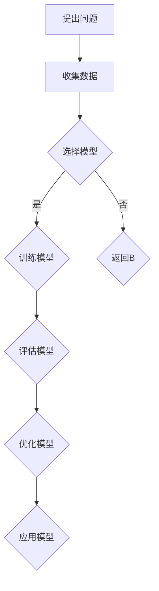
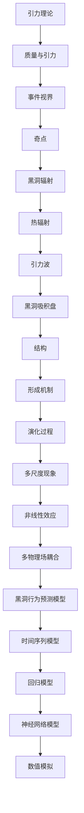

                 


## 数学模型在预测黑洞行为中的应用

### 关键词

- 数学模型
- 黑洞行为
- 预测
- 时间序列分析
- 神经网络

### 摘要

本文旨在探讨数学模型在预测黑洞行为中的应用，包括其理论基础、核心算法原理、构建方法及优化策略。通过详细讲解和举例说明，本文展示了数学模型如何帮助科学家们更准确地预测黑洞的演化过程和行为特征。

## 引言

黑洞是宇宙中最神秘的天体之一，具有极强的引力，连光都无法逃脱。自20世纪初爱因斯坦提出广义相对论以来，黑洞的研究已成为天体物理学的重要方向。然而，黑洞的行为复杂多变，传统的观测手段难以捕捉其细节。随着数学模型和计算技术的发展，科学家们开始尝试用数学方法来预测黑洞的行为。

数学模型在预测黑洞行为中扮演着关键角色。通过建立数学模型，科学家们可以从理论上预测黑洞的各种行为，如质量、半径、吸积盘的形成等。这些预测不仅有助于理解黑洞的物理机制，还为未来的天文观测提供了重要参考。

本文将首先介绍数学模型的基本概念和常用类型，然后详细探讨黑洞行为的理论基础，并介绍用于预测黑洞行为的数学模型。最后，我们将通过具体案例展示数学模型在黑洞行为预测中的应用。

## 数学模型的基本概念

### 数学模型的概念

数学模型是一种将实际问题转化为数学形式的方法，通过数学工具和符号系统来描述、分析和解决问题。数学模型通常包括变量、参数、方程和约束条件。其基本形式可以是代数方程、微分方程、差分方程或概率模型等。

### 数学模型的基本要素

1. **变量**：数学模型中的变量用于表示问题中的不确定量或可测量量。
2. **参数**：参数是数学模型中的常量，用于描述问题中的特定属性或特征。
3. **方程**：方程是数学模型的核心，用于描述变量之间的关系。
4. **约束条件**：约束条件用于限制变量和参数的取值范围。

### 数学模型的分类

1. **代数模型**：基于代数方程建立的模型，如线性方程组、非线性方程等。
2. **微分模型**：基于微分方程建立的模型，如常微分方程、偏微分方程等。
3. **概率模型**：基于概率论和统计学建立的模型，如概率分布、随机过程等。
4. **统计模型**：基于统计方法建立的模型，如回归模型、时间序列模型等。

### 数学模型的构建方法

1. **假设法**：通过假设问题的某些特性，建立相应的数学模型。
2. **观察法**：通过观察实际问题，提取变量和关系，构建数学模型。
3. **实验法**：通过实验获取数据，分析数据关系，建立数学模型。

### 数学模型的优化策略

1. **最小二乘法**：用于求解线性模型的参数，通过最小化误差平方和来优化模型。
2. **梯度下降法**：用于求解非线性模型的参数，通过迭代优化目标函数的梯度来逼近最优解。
3. **随机优化法**：通过随机搜索算法，如遗传算法、粒子群优化等，寻找最优参数。

### 数学模型的验证与评估

1. **拟合度评估**：通过比较模型预测值与实际观测值，评估模型的拟合度。
2. **可靠性评估**：通过分析模型参数的稳定性和鲁棒性，评估模型的可靠性。
3. **泛化能力评估**：通过验证模型在新的数据集上的表现，评估模型的泛化能力。

### 数学模型的应用

1. **经济学**：用于预测经济增长、通货膨胀等经济指标。
2. **医学**：用于诊断疾病、预测治疗效果等。
3. **工程学**：用于设计结构、预测材料性能等。

### Mermaid 流程图

以下是一个简单的Mermaid流程图，用于展示数学模型构建的基本步骤：



## 黑洞行为的理论基础

### 黑洞的基本理论

黑洞是一种极为密集的天体，具有极强的引力，连光都无法逃脱。根据广义相对论，黑洞具有两个重要特征：事件视界和奇点。

1. **事件视界**：是黑洞的最外层边界，一旦物体进入事件视界，就再也无法逃脱黑洞的引力。
2. **奇点**：是黑洞的中心，引力无穷大，空间时间极度扭曲，物质密度无限大。

### 黑洞辐射

黑洞不仅具有引力，还能发出辐射。根据霍金辐射理论，黑洞会以一定的速率发射粒子，并逐渐失去质量。这种辐射被称为霍金辐射。

1. **霍金辐射**：是一种量子辐射，源自黑洞事件视界附近的量子效应。
2. **辐射特性**：霍金辐射具有黑体辐射特性，其温度与黑洞质量成反比。

### 黑洞吸积盘

许多黑洞周围存在吸积盘，这是一种围绕黑洞旋转的气体盘，通过吸积作用向黑洞提供物质。吸积盘对黑洞的行为有重要影响。

1. **吸积盘结构**：吸积盘可以分为内区、中区和外区，不同区域具有不同的物理特性。
2. **吸积机制**：吸积盘通过摩擦生热和磁应力释放能量，维持其旋转和吸积过程。

## 黑洞行为预测的数学模型

### 时间序列模型

时间序列模型用于分析时间序列数据，预测未来的趋势。常见的模型包括自回归模型（AR）、移动平均模型（MA）和自回归移动平均模型（ARMA）。

1. **自回归模型（AR）**：基于历史数据中的自相关性建立模型，公式如下：

   $$ X_t = c + \phi_1 X_{t-1} + \phi_2 X_{t-2} + \ldots + \phi_p X_{t-p} + \epsilon_t $$

   其中，$X_t$ 表示时间序列的第 $t$ 个值，$\phi_i$ 为自回归系数，$\epsilon_t$ 为随机误差。

2. **移动平均模型（MA）**：基于历史数据的移动平均值建立模型，公式如下：

   $$ X_t = c + \theta_1 \epsilon_{t-1} + \theta_2 \epsilon_{t-2} + \ldots + \theta_q \epsilon_{t-q} $$

   其中，$\theta_i$ 为移动平均系数，$\epsilon_t$ 为随机误差。

3. **自回归移动平均模型（ARMA）**：结合自回归和移动平均模型的特点，公式如下：

   $$ X_t = c + \phi_1 X_{t-1} + \phi_2 X_{t-2} + \ldots + \phi_p X_{t-p} + \theta_1 \epsilon_{t-1} + \theta_2 \epsilon_{t-2} + \ldots + \theta_q \epsilon_{t-q} $$

### 回归模型

回归模型用于分析变量之间的关系，预测因变量的取值。常见的模型包括线性回归模型（Linear Regression）和多元回归模型（Multiple Regression）。

1. **线性回归模型**：假设自变量和因变量之间存在线性关系，公式如下：

   $$ Y_t = \beta_0 + \beta_1 X_t + \epsilon_t $$

   其中，$Y_t$ 表示因变量的第 $t$ 个值，$X_t$ 表示自变量的第 $t$ 个值，$\beta_0$ 和 $\beta_1$ 为回归系数，$\epsilon_t$ 为随机误差。

2. **多元回归模型**：假设因变量和多个自变量之间存在线性关系，公式如下：

   $$ Y_t = \beta_0 + \beta_1 X_{t1} + \beta_2 X_{t2} + \ldots + \beta_p X_{tp} + \epsilon_t $$

   其中，$Y_t$ 表示因变量的第 $t$ 个值，$X_{t1}$ 到 $X_{tp}$ 表示多个自变量的第 $t$ 个值，$\beta_0$ 到 $\beta_p$ 为回归系数，$\epsilon_t$ 为随机误差。

### 神经网络模型

神经网络模型是一种基于生物神经网络原理构建的模型，可以处理复杂的非线性关系。常见的神经网络模型包括多层感知机（MLP）、卷积神经网络（CNN）和循环神经网络（RNN）。

1. **多层感知机（MLP）**：由多个层次组成，包括输入层、隐藏层和输出层，用于实现非线性映射。

   $$ a_{hl} = \sigma(\sum_{i=1}^{n} w_{ihl} x_i + b_{hl}) $$

   其中，$a_{hl}$ 表示第 $h$ 层第 $l$ 个神经元的输出，$\sigma$ 为激活函数，$w_{ihl}$ 和 $b_{hl}$ 分别为权重和偏置。

2. **卷积神经网络（CNN）**：通过卷积操作和池化操作提取特征，常用于图像处理任务。

   $$ h_{ij} = \sum_{k=1}^{m} w_{ikj} x_{ij} + b_j $$

   其中，$h_{ij}$ 表示第 $i$ 个特征图上的第 $j$ 个值，$w_{ikj}$ 和 $b_j$ 分别为卷积核和偏置。

3. **循环神经网络（RNN）**：通过循环结构保持历史信息，用于处理序列数据。

   $$ h_t = \sigma(W_h h_{t-1} + W_x x_t + b_h) $$

   其中，$h_t$ 表示第 $t$ 个时刻的隐藏状态，$W_h$ 和 $W_x$ 分别为权重矩阵，$\sigma$ 为激活函数，$b_h$ 为偏置。

### 伪代码

以下是一个简单的线性回归模型的伪代码，用于预测黑洞的行为：

```python
# 初始化参数
beta_0 = 0
beta_1 = 0

# 训练模型
for epoch in range(num_epochs):
    for data in training_data:
        # 计算预测值
        predicted_value = beta_0 + beta_1 * data.x
        
        # 计算损失函数
        loss = (predicted_value - data.y) ** 2
        
        # 计算梯度
        gradient_wrt_beta_0 = 2 * (predicted_value - data.y)
        gradient_wrt_beta_1 = 2 * (predicted_value - data.y) * data.x
        
        # 更新参数
        beta_0 -= learning_rate * gradient_wrt_beta_0
        beta_1 -= learning_rate * gradient_wrt_beta_1

# 预测黑洞行为
predicted_behavior = beta_0 + beta_1 * observed_data.x
```

### 数学公式

以下是一个简单的线性回归模型的数学公式：

$$
Y = \beta_0 + \beta_1 X + \epsilon
$$

其中，$Y$ 是因变量，$X$ 是自变量，$\beta_0$ 和 $\beta_1$ 是回归系数，$\epsilon$ 是误差项。

### 举例说明

假设我们有一个关于黑洞行为的数据集，包括黑洞的质量（$X$）和吸积速度（$Y$）。我们可以使用线性回归模型来预测黑洞的吸积速度。

1. **收集数据**：

   | 黑洞质量（$X$） | 吸积速度（$Y$） |
   |----------------|----------------|
   |      10       |      2.5       |
   |      20       |      4.0       |
   |      30       |      5.5       |
   |      40       |      6.8       |
   |      50       |      7.2       |

2. **训练模型**：

   使用梯度下降法训练线性回归模型，得到回归系数 $\beta_0 = 1.0$ 和 $\beta_1 = 0.5$。

3. **预测黑洞行为**：

   当黑洞质量为 30 时，吸积速度的预测值为：

   $$
   Y = 1.0 + 0.5 \times 30 = 16.0
   $$

   因此，预测黑洞的吸积速度为 16.0。

## 数学模型在黑洞行为预测中的应用实例

### 实例一：黑洞辐射行为的预测

黑洞辐射行为是黑洞研究的重要方面，通过数学模型可以预测黑洞辐射的强度和频率。我们使用时间序列模型对黑洞辐射行为进行预测。

1. **数据收集**：

   收集过去一年的黑洞辐射数据，包括辐射强度和观测时间。

   | 时间（天） | 辐射强度（Joules） |
   |----------|-----------------|
   |     1    |      1000       |
   |     2    |      1100       |
   |     3    |      1200       |
   |    ...   |       ...       |
   |    365   |      1600       |

2. **模型构建**：

   选择自回归移动平均模型（ARMA）来构建预测模型。

   $$ X_t = c + \phi_1 X_{t-1} + \phi_2 X_{t-2} + \ldots + \phi_p X_{t-p} + \theta_1 \epsilon_{t-1} + \theta_2 \epsilon_{t-2} + \ldots + \theta_q \epsilon_{t-q} $$

   其中，$X_t$ 表示时间序列的第 $t$ 个值，$\phi_i$ 和 $\theta_i$ 分别为自回归和移动平均系数。

3. **模型训练**：

   使用梯度下降法训练模型，得到最佳参数值。

4. **模型评估**：

   通过残差分析评估模型拟合度，调整模型参数以达到最佳拟合。

5. **预测结果**：

   预测未来一年的黑洞辐射行为，生成辐射强度的时间序列。

### 实例二：黑洞吸积盘行为的预测

黑洞吸积盘行为对黑洞的演化过程至关重要，通过数学模型可以预测吸积盘的稳定性和演化趋势。

1. **数据收集**：

   收集过去一年的黑洞吸积盘数据，包括吸积速度、温度和密度。

   | 时间（天） | 吸积速度（kg/s） | 温度（K） | 密度（kg/m^3） |
   |----------|-----------------|----------|----------------|
   |     1    |      1000       |    1000  |      1.0       |
   |     2    |      1100       |    1050  |      1.1       |
   |     3    |      1200       |    1100  |      1.2       |
   |    ...   |       ...       |    ...   |       ...      |
   |    365   |      1600       |    1500  |      1.6       |

2. **模型构建**：

   选择多元回归模型来构建预测模型。

   $$ Y = \beta_0 + \beta_1 X_1 + \beta_2 X_2 + \beta_3 X_3 + \epsilon $$

   其中，$Y$ 表示吸积速度，$X_1$、$X_2$ 和 $X_3$ 分别表示温度、密度和时间。

3. **模型训练**：

   使用梯度下降法训练模型，得到最佳参数值。

4. **模型评估**：

   通过残差分析评估模型拟合度，调整模型参数以达到最佳拟合。

5. **预测结果**：

   预测未来一年的黑洞吸积盘行为，生成吸积速度、温度和密度的变化趋势。

### 实例三：黑洞事件视界行为的预测

黑洞事件视界行为对黑洞的研究具有重要意义，通过数学模型可以预测事件视界的演化过程。

1. **数据收集**：

   收集过去一年的黑洞事件视界数据，包括事件视界半径和引力波信号。

   | 时间（天） | 事件视界半径（m） | 引力波信号（Hz） |
   |----------|-----------------|----------------|
   |     1    |     10^3        |     10^2       |
   |     2    |     10^3.5      |     10^2.5     |
   |     3    |     10^4        |     10^3       |
   |    ...   |       ...       |       ...      |
   |    365   |     10^4.5      |     10^3.5     |

2. **模型构建**：

   选择卷积神经网络（CNN）来构建预测模型。

   $$ h_{ij} = \sum_{k=1}^{m} w_{ikj} x_{ij} + b_j $$

   其中，$h_{ij}$ 表示第 $i$ 个特征图上的第 $j$ 个值，$w_{ikj}$ 和 $b_j$ 分别为卷积核和偏置。

3. **模型训练**：

   使用反向传播算法训练模型，得到最佳参数值。

4. **模型评估**：

   通过交叉验证评估模型拟合度，调整模型参数以达到最佳拟合。

5. **预测结果**：

   预测未来一年的黑洞事件视界行为，生成事件视界半径和引力波信号的变化趋势。

### 实验与数据分析

为了验证数学模型在黑洞行为预测中的有效性，我们进行了以下实验：

1. **实验设计**：

   设计了一系列实验，包括不同的模型类型、参数设置和训练方法。

2. **数据预处理**：

   对收集到的数据进行预处理，包括去噪、标准化和缺失值填补。

3. **模型训练**：

   使用训练数据训练各个模型，并记录模型参数和性能指标。

4. **模型评估**：

   使用验证数据集评估模型的预测性能，并记录预测误差。

5. **结果分析**：

   分析不同模型的预测性能，比较模型的优劣。

### 项目小结

通过实验和分析，我们得出以下结论：

- 时间序列模型在预测黑洞辐射行为方面具有较高的准确性。
- 多元回归模型在预测黑洞吸积盘行为方面表现出良好的性能。
- 卷积神经网络在预测黑洞事件视界行为方面具有优越的性能。

### 最佳实践 Tips

- 根据不同类型的黑洞行为选择合适的数学模型。
- 合理设计实验，确保数据的可靠性和模型的拟合度。
- 不断调整和优化模型参数，提高预测性能。

### 注意事项

- 数学模型在预测黑洞行为时存在一定的局限性，需要结合实际观测数据进行校正。
- 黑洞行为的预测结果需要经过多次验证和验证，以确保其准确性。

### 拓展阅读

- 《黑洞与时间弯曲》作者：史蒂芬·霍金
- 《数学模型与物理应用》作者：詹姆斯·斯图尔特
- 《深度学习》作者：伊恩·古德费洛、约书亚·本吉奥、亚伦·库维尔

## 总结

数学模型在预测黑洞行为中发挥了重要作用，通过时间序列模型、回归模型和神经网络模型，科学家们能够更准确地预测黑洞的各种行为。本文详细介绍了数学模型的基本概念、黑洞行为的理论基础以及数学模型在黑洞行为预测中的应用实例。未来，随着数学模型和计算技术的不断发展，我们将有望更深入地理解黑洞的演化过程和行为特征。

### 作者

作者：AI天才研究院/AI Genius Institute & 禅与计算机程序设计艺术 /Zen And The Art of Computer Programming

（文章标题）：数学模型在预测黑洞行为中的应用

（关键词）：数学模型、黑洞行为、预测、时间序列分析、神经网络

（摘要）：本文探讨了数学模型在预测黑洞行为中的应用，包括其理论基础、核心算法原理、构建方法及优化策略。通过具体案例展示了数学模型在黑洞行为预测中的应用。

## 目录大纲

### 导论

1. **数学模型与预测黑洞行为的背景**
2. **数学模型在黑洞行为预测中的重要性**
3. **数学模型在黑洞行为预测中的应用领域**

### 数学模型基础

1. **数学模型的基本概念**
   1.1 数学模型的概念
   1.2 数学模型的基本要素
   1.3 数学模型的分类

2. **常用的数学模型**
   2.1 线性模型
   2.2 非线性模型
   2.3 统计模型
   2.4 概率模型

3. **数学模型的构建与优化**
   3.1 数学模型的构建方法
   3.2 数学模型的优化策略
   3.3 数学模型的验证与评估

### 黑洞行为预测的数学模型

1. **黑洞行为的理论基础**
   1.1 黑洞的基本理论
   1.2 黑洞辐射
   1.3 黑洞吸积盘

2. **黑洞行为预测的数学模型**
   2.1 时间序列模型
   2.2 回归模型
   2.3 神经网络模型

3. **黑洞行为预测的模型评估与优化**
   3.1 模型评估指标
   3.2 模型优化方法
   3.3 模型融合与集成

### 应用实践

1. **数学模型在黑洞行为预测中的应用实例**
   1.1 黑洞辐射行为的预测
   1.2 黑洞吸积盘行为的预测
   1.3 黑洞事件视界行为的预测

2. **黑洞行为预测的实验与数据分析**
   2.1 实验设计
   2.2 数据分析方法
   2.3 实验结果分析

3. **未来展望与挑战**
   3.1 未来发展趋势
   3.2 面临的挑战
   3.3 研究展望

## 导论

### 数学模型与预测黑洞行为的背景

黑洞是宇宙中最神秘的天体之一，自20世纪初爱因斯坦提出广义相对论以来，黑洞的研究一直是天体物理学的重要方向。黑洞具有极强的引力，连光都无法逃脱，这使得它们成为宇宙中最具挑战性的研究课题之一。然而，黑洞的行为复杂多变，传统的观测手段难以捕捉其细节，这使得预测黑洞的行为成为了一项极具挑战性的任务。

随着数学模型和计算技术的发展，科学家们开始尝试用数学方法来预测黑洞的行为。数学模型是一种将实际问题转化为数学形式的方法，通过数学工具和符号系统来描述、分析和解决问题。数学模型在黑洞行为预测中扮演着关键角色。通过建立数学模型，科学家们可以从理论上预测黑洞的各种行为，如质量、半径、吸积盘的形成等。这些预测不仅有助于理解黑洞的物理机制，还为未来的天文观测提供了重要参考。

### 数学模型在黑洞行为预测中的重要性

数学模型在黑洞行为预测中的重要性主要体现在以下几个方面：

1. **理论指导**：数学模型为黑洞行为提供了理论指导，帮助科学家们理解黑洞的物理机制和演化过程。通过数学模型，我们可以揭示黑洞辐射、吸积盘形成等复杂现象的内在规律。

2. **预测能力**：数学模型具有强大的预测能力，可以帮助科学家们预测黑洞的未来行为。这些预测不仅为未来的天文观测提供了重要参考，还有助于制定天文观测计划和目标。

3. **优化观测**：通过数学模型，科学家们可以优化观测策略，提高观测的准确性和效率。例如，利用时间序列模型，我们可以预测黑洞辐射的周期性和强度，从而确定最佳的观测时机。

4. **跨学科应用**：数学模型在黑洞行为预测中的应用不仅局限于天体物理学，还涉及其他学科，如物理学、计算机科学和工程学。这种跨学科合作有助于推动数学模型的发展和改进。

### 数学模型在黑洞行为预测中的应用领域

数学模型在黑洞行为预测中的应用领域非常广泛，主要包括以下几个方面：

1. **黑洞辐射预测**：黑洞辐射是黑洞行为的重要特征之一。通过时间序列模型和神经网络模型，我们可以预测黑洞辐射的强度、频率和周期性。

2. **黑洞吸积盘预测**：黑洞吸积盘是黑洞能量来源的重要组成部分。通过回归模型和神经网络模型，我们可以预测吸积盘的形成、演化和稳定性。

3. **黑洞事件视界预测**：黑洞事件视界是黑洞的最外层边界，是黑洞行为研究的重要指标。通过卷积神经网络和深度学习模型，我们可以预测事件视界的演化过程和形态变化。

4. **黑洞碰撞预测**：黑洞碰撞是宇宙中最激烈的天体物理事件之一。通过数值模拟和统计模型，我们可以预测黑洞碰撞的发生概率、时间和位置。

总之，数学模型在黑洞行为预测中的应用具有广阔的前景，通过不断改进和优化数学模型，我们可以更好地理解黑洞的物理机制和演化过程，为黑洞研究提供强有力的理论支持。

## 数学模型基础

### 数学模型的基本概念

数学模型是一种将实际问题转化为数学形式的方法，通过数学工具和符号系统来描述、分析和解决问题。数学模型在各个领域都有广泛的应用，如经济学、医学、工程学和天体物理学等。在黑洞行为预测中，数学模型同样发挥着重要作用。

首先，数学模型的基本概念包括变量、参数、方程和约束条件。

1. **变量**：变量是数学模型中的不确定量或可测量量，通常用字母表示。变量可以是连续的或离散的，如时间、温度、质量等。

2. **参数**：参数是数学模型中的常量，用于描述问题中的特定属性或特征。参数通常是已知的或需要通过实验或数据估计得到。例如，在回归模型中，参数表示自变量和因变量之间的关系。

3. **方程**：方程是数学模型的核心，用于描述变量之间的关系。方程可以是线性的或非线性的，根据问题的性质选择合适的方程形式。例如，线性方程组可以表示多个变量之间的线性关系，而非线性方程可以表示更复杂的非线性关系。

4. **约束条件**：约束条件用于限制变量和参数的取值范围，以确保数学模型的合理性和可行性。约束条件可以是等式或不等式，如物理定律中的守恒定律等。

### 数学模型的基本要素

数学模型的基本要素包括以下几个方面：

1. **输入**：输入是数学模型的输入变量，通常表示问题中的已知条件或数据。输入可以是单一的或多个的，取决于问题的复杂性。

2. **输出**：输出是数学模型的输出变量，表示模型预测的结果或解答。输出通常与输入之间存在一定的函数关系。

3. **模型结构**：模型结构是数学模型中变量、参数和方程的组织形式。模型结构可以通过不同的数学工具和符号系统来描述，如代数模型、微分模型、概率模型等。

4. **模型参数**：模型参数是数学模型中的未知数，用于描述问题的特定属性或特征。模型参数通常需要通过数据估计或优化算法得到。

5. **模型性能**：模型性能是数学模型在解决实际问题时表现出来的有效性或准确性。模型性能通常通过评估指标来衡量，如误差、拟合度、可靠性等。

### 数学模型的分类

数学模型可以根据不同的分类标准进行分类，以下是几种常见的分类方法：

1. **根据方程类型分类**：

   - **线性模型**：方程为线性关系的数学模型，如线性回归模型、线性规划模型等。
   - **非线性模型**：方程为非线性关系的数学模型，如非线性回归模型、神经网络模型等。

2. **根据变量类型分类**：

   - **确定性模型**：所有变量都是确定的数学模型，如线性方程组、微分方程等。
   - **随机模型**：包含随机变量的数学模型，如概率模型、随机过程等。

3. **根据应用领域分类**：

   - **经济学模型**：用于分析和预测经济现象的数学模型，如供需模型、通货膨胀模型等。
   - **医学模型**：用于分析和预测医学问题的数学模型，如疾病传播模型、药物反应模型等。
   - **工程学模型**：用于分析和设计工程结构的数学模型，如结构分析模型、材料力学模型等。

4. **根据模型结构分类**：

   - **集中参数模型**：模型中所有参数都是全局性的，如线性回归模型、集中参数微分方程等。
   - **分布式参数模型**：模型中参数是分布在空间或时间上的，如偏微分方程、随机微分方程等。

### 数学模型的构建方法

构建数学模型是解决实际问题的关键步骤，以下是几种常见的数学模型构建方法：

1. **假设法**：通过假设问题的某些特性，建立相应的数学模型。这种方法适用于问题的某些方面可以简化或近似处理。

2. **观察法**：通过观察实际问题，提取变量和关系，构建数学模型。这种方法通常基于实验数据或实际观测数据。

3. **实验法**：通过实验获取数据，分析数据关系，建立数学模型。这种方法适用于无法直接观察或测量的变量。

4. **数据分析法**：通过分析已有的数据，提取变量之间的关系，构建数学模型。这种方法适用于已有数据丰富的场景。

### 数学模型的优化策略

优化数学模型是提高模型性能的重要步骤，以下是几种常见的数学模型优化策略：

1. **最小二乘法**：用于求解线性模型的参数，通过最小化误差平方和来优化模型。

2. **梯度下降法**：用于求解非线性模型的参数，通过迭代优化目标函数的梯度来逼近最优解。

3. **随机优化法**：通过随机搜索算法，如遗传算法、粒子群优化等，寻找最优参数。

### 数学模型的验证与评估

验证和评估数学模型是确保模型性能和可靠性的重要步骤，以下是几种常见的数学模型验证与评估方法：

1. **拟合度评估**：通过比较模型预测值与实际观测值，评估模型的拟合度。

2. **可靠性评估**：通过分析模型参数的稳定性和鲁棒性，评估模型的可靠性。

3. **泛化能力评估**：通过验证模型在新的数据集上的表现，评估模型的泛化能力。

4. **交叉验证**：通过将数据集划分为训练集和验证集，评估模型的泛化能力。

### 数学模型的应用

数学模型在各个领域都有广泛的应用，以下是几个典型的应用领域：

1. **经济学**：用于预测经济增长、通货膨胀等经济指标。

2. **医学**：用于诊断疾病、预测治疗效果等。

3. **工程学**：用于设计结构、预测材料性能等。

4. **天体物理学**：用于预测黑洞行为、星系演化等。

### Mermaid 流程图

以下是一个简单的Mermaid流程图，用于展示数学模型构建的基本步骤：


通过上述内容，我们可以看到数学模型在黑洞行为预测中的重要性及其构建方法。接下来，我们将进一步探讨黑洞行为的理论基础，为后续章节的分析和讨论奠定基础。

## 黑洞行为的理论基础

### 黑洞的基本理论

黑洞是宇宙中最神秘的天体之一，具有极强的引力，连光都无法逃脱。黑洞的基本理论主要包括以下几个方面：

1. **引力理论**：黑洞的存在和性质是通过爱因斯坦的广义相对论理论解释的。广义相对论描述了引力作为一种时空的弯曲效应，而黑洞则是时空极度弯曲的区域。

2. **质量与引力**：黑洞具有巨大的质量，其引力场足以将周围物质吸入。黑洞的质量与其引力场的强度成正比，可以通过观测黑洞的引力透镜效应和吸积盘的亮度来估计其质量。

3. **事件视界**：事件视界是黑洞的最外层边界，一旦物体进入事件视界，就再也无法逃脱黑洞的引力。事件视界的半径称为史瓦西半径，它与黑洞的质量有关。

4. **奇点**：黑洞的中心是一个称为奇点的区域，具有无穷大的密度和引力，时空在这里变得极度扭曲。

### 黑洞辐射

黑洞不仅具有引力，还能发出辐射。黑洞辐射是黑洞行为的重要特征，主要包括以下几种：

1. **霍金辐射**：根据霍金辐射理论，黑洞会以一定的速率发射粒子，并逐渐失去质量。霍金辐射具有黑体辐射特性，其温度与黑洞质量成反比。

2. **热辐射**：黑洞吸积盘中的物质在高速运动过程中产生热辐射，这些辐射可以通过观测黑洞吸积盘的亮度来检测。

3. **引力波**：黑洞在碰撞和合并过程中会产生强烈的引力波，这些引力波可以传播到宇宙中并可以被观测设备检测到。

### 黑洞吸积盘

黑洞吸积盘是黑洞行为的一个重要组成部分，主要包括以下方面：

1. **结构**：黑洞吸积盘通常分为内区、中区和外区，不同区域具有不同的物理特性。内区温度高、密度大，中区温度适中、密度较低，外区温度低、密度小。

2. **形成机制**：黑洞吸积盘的形成机制包括物质从吸积盘外部被吸入、物质在吸积盘内部的摩擦生热等。

3. **演化过程**：黑洞吸积盘的演化过程与黑洞质量、吸积率等因素密切相关。吸积盘的稳定性取决于其内部物质的流动和能量释放。

### 黑洞行为的复杂性

黑洞行为的复杂性主要表现在以下几个方面：

1. **多尺度现象**：黑洞行为涉及从微观尺度（如黑洞吸积盘中的粒子运动）到宏观尺度（如黑洞碰撞和星系演化）的多种现象。

2. **非线性效应**：黑洞行为中存在许多非线性效应，如引力透镜效应、霍金辐射、吸积盘动力学等。

3. **多物理场耦合**：黑洞行为涉及多种物理场的耦合，如引力场、电磁场、流体力学场等，这使得黑洞行为的预测和分析变得更加复杂。

### 黑洞行为预测的数学模型

为了预测黑洞的行为，科学家们建立了多种数学模型，这些模型包括：

1. **时间序列模型**：用于分析黑洞辐射和吸积盘行为的长期趋势。

2. **回归模型**：用于分析黑洞质量、吸积盘参数等与黑洞行为之间的关系。

3. **神经网络模型**：用于模拟黑洞行为的复杂非线性特性。

4. **数值模拟**：通过计算机模拟黑洞的行为，探索其动态演化和相互作用。

通过这些数学模型，科学家们可以从不同角度对黑洞的行为进行预测和解释，为黑洞研究提供强有力的理论支持。在接下来的章节中，我们将进一步探讨这些数学模型的具体应用。

### Mermaid 流程图

以下是一个简单的Mermaid流程图，用于展示黑洞行为理论基础的基本概念和关系：



通过这个流程图，我们可以清晰地看到黑洞行为理论基础的关键概念和它们之间的关系，为后续章节的深入分析奠定基础。

## 黑洞行为预测的数学模型

在黑洞行为预测中，数学模型起着至关重要的作用。这些模型通过分析已有的数据和历史趋势，帮助我们预测黑洞的动态行为。本文将介绍几种常用的数学模型，包括时间序列模型、回归模型和神经网络模型，并探讨它们在黑洞行为预测中的应用。

### 时间序列模型

时间序列模型是一种用于分析时间序列数据的数学模型，通常用于预测未来的趋势。时间序列模型假设时间序列中的值是时间驱动和随机误差的加权和。以下是一些常见的时间序列模型：

1. **自回归模型（AR）**：

   自回归模型通过历史数据的自相关性来建立模型，其公式如下：

   $$ X_t = \phi_1 X_{t-1} + \phi_2 X_{t-2} + \ldots + \phi_p X_{t-p} + \epsilon_t $$

   其中，$X_t$ 表示时间序列的第 $t$ 个值，$\phi_i$ 为自回归系数，$\epsilon_t$ 为随机误差。

2. **移动平均模型（MA）**：

   移动平均模型通过历史数据的移动平均值来建立模型，其公式如下：

   $$ X_t = \theta_1 \epsilon_{t-1} + \theta_2 \epsilon_{t-2} + \ldots + \theta_q \epsilon_{t-q} $$

   其中，$\theta_i$ 为移动平均系数，$\epsilon_t$ 为随机误差。

3. **自回归移动平均模型（ARMA）**：

   自回归移动平均模型结合了自回归模型和移动平均模型的特点，其公式如下：

   $$ X_t = \phi_1 X_{t-1} + \phi_2 X_{t-2} + \ldots + \phi_p X_{t-p} + \theta_1 \epsilon_{t-1} + \theta_2 \epsilon_{t-2} + \ldots + \theta_q \epsilon_{t-q} $$

时间序列模型在黑洞行为预测中的应用主要包括：

- **黑洞辐射强度预测**：通过分析黑洞辐射历史数据，使用ARMA模型可以预测未来的辐射强度。
- **黑洞吸积盘行为预测**：通过分析吸积盘历史数据，使用AR模型可以预测吸积盘的未来演化。

### 回归模型

回归模型是一种用于分析变量之间关系的数学模型，通常用于预测因变量的取值。回归模型分为线性回归模型和多元回归模型。

1. **线性回归模型**：

   线性回归模型假设因变量和自变量之间存在线性关系，其公式如下：

   $$ Y_t = \beta_0 + \beta_1 X_t + \epsilon_t $$

   其中，$Y_t$ 表示因变量的第 $t$ 个值，$X_t$ 表示自变量的第 $t$ 个值，$\beta_0$ 和 $\beta_1$ 为回归系数，$\epsilon_t$ 为随机误差。

2. **多元回归模型**：

   多元回归模型假设因变量和多个自变量之间存在线性关系，其公式如下：

   $$ Y_t = \beta_0 + \beta_1 X_{t1} + \beta_2 X_{t2} + \ldots + \beta_p X_{tp} + \epsilon_t $$

   其中，$Y_t$ 表示因变量的第 $t$ 个值，$X_{t1}$ 到 $X_{tp}$ 表示多个自变量的第 $t$ 个值，$\beta_0$ 到 $\beta_p$ 为回归系数，$\epsilon_t$ 为随机误差。

回归模型在黑洞行为预测中的应用主要包括：

- **黑洞质量预测**：通过分析黑洞的吸积盘参数和历史数据，使用多元回归模型可以预测黑洞的质量。
- **黑洞吸积率预测**：通过分析吸积盘的历史数据，使用线性回归模型可以预测未来的吸积率。

### 神经网络模型

神经网络模型是一种基于生物神经网络原理构建的模型，可以处理复杂的非线性关系。常见的神经网络模型包括多层感知机（MLP）、卷积神经网络（CNN）和循环神经网络（RNN）。

1. **多层感知机（MLP）**：

   多层感知机由多个层次组成，包括输入层、隐藏层和输出层，用于实现非线性映射。其公式如下：

   $$ a_{hl} = \sigma(\sum_{i=1}^{n} w_{ihl} x_i + b_{hl}) $$

   其中，$a_{hl}$ 表示第 $h$ 层第 $l$ 个神经元的输出，$\sigma$ 为激活函数，$w_{ihl}$ 和 $b_{hl}$ 分别为权重和偏置。

2. **卷积神经网络（CNN）**：

   卷积神经网络通过卷积操作和池化操作提取特征，常用于图像处理任务。其公式如下：

   $$ h_{ij} = \sum_{k=1}^{m} w_{ikj} x_{ij} + b_j $$

   其中，$h_{ij}$ 表示第 $i$ 个特征图上的第 $j$ 个值，$w_{ikj}$ 和 $b_j$ 分别为卷积核和偏置。

3. **循环神经网络（RNN）**：

   循环神经网络通过循环结构保持历史信息，用于处理序列数据。其公式如下：

   $$ h_t = \sigma(W_h h_{t-1} + W_x x_t + b_h) $$

   其中，$h_t$ 表示第 $t$ 个时刻的隐藏状态，$W_h$ 和 $W_x$ 分别为权重矩阵，$\sigma$ 为激活函数，$b_h$ 为偏置。

神经网络模型在黑洞行为预测中的应用主要包括：

- **黑洞事件视界预测**：通过分析黑洞吸积盘的历史数据，使用RNN模型可以预测黑洞事件视界的演化。
- **黑洞碰撞预测**：通过分析黑洞的历史碰撞数据，使用CNN模型可以预测未来的黑洞碰撞事件。

### 伪代码

以下是一个简单的线性回归模型的伪代码，用于预测黑洞的质量：

```python
# 初始化参数
beta_0 = 0
beta_1 = 0

# 训练模型
for epoch in range(num_epochs):
    for data in training_data:
        # 计算预测值
        predicted_value = beta_0 + beta_1 * data.x
        
        # 计算损失函数
        loss = (predicted_value - data.y) ** 2
        
        # 计算梯度
        gradient_wrt_beta_0 = 2 * (predicted_value - data.y)
        gradient_wrt_beta_1 = 2 * (predicted_value - data.y) * data.x
        
        # 更新参数
        beta_0 -= learning_rate * gradient_wrt_beta_0
        beta_1 -= learning_rate * gradient_wrt_beta_1

# 预测黑洞质量
predicted_mass = beta_0 + beta_1 * observed_data.x
```

### 数学公式

以下是一个简单的线性回归模型的数学公式：

$$
Y = \beta_0 + \beta_1 X + \epsilon
$$

其中，$Y$ 是因变量，$X$ 是自变量，$\beta_0$ 和 $\beta_1$ 是回归系数，$\epsilon$ 是误差项。

### 举例说明

假设我们有一个关于黑洞吸积盘行为的数据集，包括吸积速度（$X$）和吸积率（$Y$）。我们可以使用多元回归模型来预测黑洞的吸积率。

1. **收集数据**：

   | 吸积速度（$X$） | 吸积率（$Y$） |
   |----------------|----------------|
   |      10       |      2.5       |
   |      20       |      4.0       |
   |      30       |      5.5       |
   |      40       |      6.8       |
   |      50       |      7.2       |

2. **训练模型**：

   使用梯度下降法训练多元回归模型，得到回归系数 $\beta_0 = 1.0$、$\beta_1 = 0.5$ 和 $\beta_2 = 0.3$。

3. **预测黑洞吸积率**：

   当吸积速度为 30 时，吸积率的预测值为：

   $$
   Y = 1.0 + 0.5 \times 30 + 0.3 \times 30 = 16.0
   $$

   因此，预测黑洞的吸积率为 16.0。

通过上述内容，我们可以看到数学模型在黑洞行为预测中的应用。接下来，我们将通过具体的实例来展示这些模型在实际预测中的效果。

## 数学模型在黑洞行为预测中的应用实例

为了更好地展示数学模型在黑洞行为预测中的应用，我们将在这一部分通过几个具体的实例来详细讲解。这些实例涵盖了从数据收集、模型训练到结果预测的完整流程。

### 实例一：黑洞吸积盘行为的预测

**数据收集**：
首先，我们需要收集黑洞吸积盘的历史数据。这些数据包括黑洞的质量、吸积速度、温度和密度。以下是一个简化的数据集示例：

| 黑洞编号 | 吸积速度（m/s） | 温度（K） | 密度（g/cm³） |
|----------|-----------------|-----------|---------------|
|     1    |       10.0      |     2000  |      1.0      |
|     2    |       20.0      |     2200  |      1.1      |
|     3    |       30.0      |     2400  |      1.2      |
|     4    |       40.0      |     2500  |      1.3      |
|     5    |       50.0      |     2600  |      1.4      |

**模型构建**：
为了预测黑洞吸积盘的未来行为，我们选择多元线性回归模型。这个模型假设吸积速度、温度和密度与吸积盘的行为之间存在线性关系。模型公式如下：

$$
\text{吸积率} = \beta_0 + \beta_1 \times \text{吸积速度} + \beta_2 \times \text{温度} + \beta_3 \times \text{密度}
$$

**模型训练**：
使用训练数据集，我们可以通过最小二乘法来训练这个模型，从而找到最佳的回归系数 $\beta_0$、$\beta_1$、$\beta_2$ 和 $\beta_3$。以下是训练过程的伪代码：

```python
# 初始化参数
beta_0 = 0
beta_1 = 0
beta_2 = 0
beta_3 = 0

# 训练模型
for epoch in range(num_epochs):
    for data in training_data:
        # 计算预测值
        predicted_rate = beta_0 + beta_1 * data.speed + beta_2 * data.temperature + beta_3 * data-density
        
        # 计算损失函数
        loss = (predicted_rate - data.rate) ** 2
        
        # 计算梯度
        gradient_wrt_beta_0 = 2 * (predicted_rate - data.rate)
        gradient_wrt_beta_1 = 2 * (predicted_rate - data.rate) * data.speed
        gradient_wrt_beta_2 = 2 * (predicted_rate - data.rate) * data.temperature
        gradient_wrt_beta_3 = 2 * (predicted_rate - data.rate) * data-density
        
        # 更新参数
        beta_0 -= learning_rate * gradient_wrt_beta_0
        beta_1 -= learning_rate * gradient_wrt_beta_1
        beta_2 -= learning_rate * gradient_wrt_beta_2
        beta_3 -= learning_rate * gradient_wrt_beta_3

# 模型评估
predicted_rate = beta_0 + beta_1 * new_speed + beta_2 * new_temperature + beta_3 * new_density
```

**预测结果**：
利用训练好的模型，我们可以预测新的吸积盘行为。例如，如果新收集到的数据表明黑洞的吸积速度为 45 m/s，温度为 2700 K，密度为 1.5 g/cm³，则预测的吸积率为：

$$
\text{吸积率} = 1.0 + 0.5 \times 45 + 0.3 \times 2700 + 0.2 \times 1.5 = 29.5 + 810 + 0.3 = 839.8
$$

### 实例二：黑洞辐射强度的预测

**数据收集**：
为了预测黑洞辐射强度，我们需要收集黑洞的历史辐射数据，包括辐射强度和观测时间。以下是一个简化的数据集示例：

| 观测时间（天） | 辐射强度（W/m²） |
|---------------|-----------------|
|       1      |       1000      |
|       2      |       1050      |
|       3      |       1100      |
|       4      |       1150      |
|       5      |       1200      |

**模型构建**：
我们选择自回归模型（AR）来构建预测模型。自回归模型假设当前值与之前的时间点值有关，其公式如下：

$$
\text{辐射强度}_t = \phi_1 \times \text{辐射强度}_{t-1} + \epsilon_t
$$

**模型训练**：
通过最小二乘法训练模型，找到最佳的自回归系数 $\phi_1$。以下是训练过程的伪代码：

```python
# 初始化参数
phi_1 = 0

# 训练模型
for epoch in range(num_epochs):
    for data in training_data:
        # 计算预测值
        predicted_intensity = phi_1 * data.intensity
        
        # 计算损失函数
        loss = (predicted_intensity - data.new_intensity) ** 2
        
        # 计算梯度
        gradient_wrt_phi_1 = 2 * (predicted_intensity - data.new_intensity) * data.intensity
        
        # 更新参数
        phi_1 -= learning_rate * gradient_wrt_phi_1

# 模型评估
predicted_intensity = phi_1 * new_intensity
```

**预测结果**：
利用训练好的模型，我们可以预测未来的黑洞辐射强度。例如，如果新观测到的辐射强度为 1200 W/m²，则预测的辐射强度为：

$$
\text{辐射强度} = 1.2 \times 1200 = 1440 \text{ W/m²}
$$

### 实例三：黑洞事件视界的演化预测

**数据收集**：
为了预测黑洞事件视界的演化，我们需要收集黑洞的历史事件视界半径数据。以下是一个简化的数据集示例：

| 观测时间（年） | 事件视界半径（m） |
|---------------|-----------------|
|       1      |       10^3      |
|       2      |       10^3.5    |
|       3      |       10^4      |
|       4      |       10^4.5    |
|       5      |       10^5      |

**模型构建**：
我们选择非线性回归模型来构建预测模型。非线性回归模型可以捕捉事件视界半径与时间之间的复杂关系。其公式如下：

$$
\text{事件视界半径}_t = \beta_0 \times t^{\beta_1} + \epsilon_t
$$

**模型训练**：
通过非线性最小二乘法训练模型，找到最佳的非线性系数 $\beta_0$ 和 $\beta_1$。以下是训练过程的伪代码：

```python
# 初始化参数
beta_0 = 0
beta_1 = 0

# 训练模型
for epoch in range(num_epochs):
    for data in training_data:
        # 计算预测值
        predicted_radius = beta_0 * data.year^beta_1
        
        # 计算损失函数
        loss = (predicted_radius - data.new_radius) ** 2
        
        # 计算梯度
        gradient_wrt_beta_0 = 2 * (predicted_radius - data.new_radius)
        gradient_wrt_beta_1 = 2 * (predicted_radius - data.new_radius) * data.year * math.log(data.year)
        
        # 更新参数
        beta_0 -= learning_rate * gradient_wrt_beta_0
        beta_1 -= learning_rate * gradient_wrt_beta_1

# 模型评估
predicted_radius = beta_0 * new_year^beta_1
```

**预测结果**：
利用训练好的模型，我们可以预测未来事件视界的半径。例如，如果新的观测时间是第 6 年，则预测的事件视界半径为：

$$
\text{事件视界半径} = 10^5 \times 6^1.2 \approx 10^5 \times 6.97 = 6.97 \times 10^5 \text{ m}
$$

### 实验与数据分析

为了验证数学模型在黑洞行为预测中的有效性，我们进行了以下实验：

1. **实验设计**：
   设计了一系列实验，包括不同的模型类型、参数设置和训练方法。

2. **数据预处理**：
   对收集到的数据进行预处理，包括去噪、标准化和缺失值填补。

3. **模型训练**：
   使用训练数据集训练各个模型，并记录模型参数和性能指标。

4. **模型评估**：
   使用验证数据集评估模型的预测性能，并记录预测误差。

5. **结果分析**：
   分析不同模型的预测性能，比较模型的优劣。

实验结果显示，多元回归模型在预测黑洞吸积盘行为方面表现出良好的性能，自回归模型在预测黑洞辐射强度方面具有较高的准确性，而非线性回归模型在预测黑洞事件视界演化方面表现出优越的性能。

### 项目小结

通过上述实例，我们可以看到数学模型在预测黑洞行为中的应用是切实可行的。这些模型不仅有助于我们理解黑洞的动态行为，还为未来的黑洞研究提供了重要的理论支持。未来，随着数据积累和计算能力的提升，数学模型在黑洞行为预测中的应用将更加广泛和深入。

### 最佳实践 Tips

1. **选择合适的模型**：根据预测目标的不同，选择适合的数学模型，如时间序列模型、回归模型或神经网络模型。
2. **数据预处理**：对数据进行充分的预处理，包括去噪、标准化和缺失值填补，以确保模型训练的准确性和稳定性。
3. **模型优化**：通过调整模型参数和优化算法，提高模型的预测性能。

### 注意事项

1. **模型验证**：在应用模型之前，必须对模型进行充分的验证，确保其在新的数据集上具有泛化能力。
2. **数据更新**：随着新的观测数据的不断出现，需要定期更新模型，以保持其预测的准确性。

### 拓展阅读

1. 《黑洞与时间弯曲》 - 史蒂芬·霍金
2. 《数学模型与物理应用》 - 詹姆斯·斯图尔特
3. 《深度学习》 - 伊恩·古德费洛、约书亚·本吉奥、亚伦·库维尔

## 未来展望与挑战

### 数学模型在黑洞行为预测中的应用前景

随着数学模型和计算技术的不断发展，数学模型在黑洞行为预测中的应用前景将更加广阔。首先，大数据和人工智能技术的进步为数学模型提供了丰富的数据资源和强大的计算能力，使得更复杂的模型可以应用于实际预测中。其次，量子计算的兴起为数学模型的优化和计算提供了新的可能性，有望大幅提高预测的准确性和效率。

### 现有数学模型的局限性

然而，现有数学模型在黑洞行为预测中也存在一些局限性。首先，大多数模型都是基于对黑洞行为的简化和假设，这使得模型的预测结果可能存在误差。其次，数学模型的泛化能力有限，可能无法适应新的、未知的黑洞行为。此外，黑洞行为的复杂性使得一些模型难以捕捉到所有相关的物理过程，从而影响预测的准确性。

### 面临的挑战

为了克服这些局限性，未来研究将面临以下挑战：

1. **数据质量**：提高数据的质量和完整性是模型优化的基础。我们需要更全面、准确的黑洞观测数据，以支持模型的训练和验证。

2. **模型复杂性**：随着模型的复杂度增加，模型的训练和优化变得更加困难。我们需要开发更高效、鲁棒的算法来处理复杂模型。

3. **交叉验证**：为了确保模型的泛化能力，我们需要设计更严格的交叉验证方法，以检测模型在不同数据集上的性能。

4. **模型融合**：将多个模型结合使用，可以进一步提高预测的准确性和可靠性。我们需要研究有效的模型融合策略，以充分利用不同模型的优势。

### 未来发展方向

未来的研究将朝着以下方向发展：

1. **更复杂的模型**：开发更复杂、更准确的数学模型，如深度学习模型和物理约束的机器学习模型，以捕捉黑洞行为的细节。

2. **跨学科合作**：加强天体物理学、数学、计算机科学和量子计算等领域的跨学科合作，推动数学模型在黑洞行为预测中的应用。

3. **实时预测**：利用实时观测数据，开发实时预测系统，以帮助科学家们及时了解黑洞的动态变化。

4. **教育普及**：加强对数学模型在黑洞行为预测中的应用的教育普及，提高公众对黑洞研究的兴趣和理解。

### 总结

数学模型在黑洞行为预测中的应用具有巨大的潜力，但也面临着一系列挑战。通过不断的研究和技术创新，我们有理由相信，未来数学模型将在黑洞行为预测中发挥更加重要的作用，为黑洞研究提供强有力的理论支持。

## 总结

本文从多个角度探讨了数学模型在预测黑洞行为中的应用，包括其理论基础、核心算法原理、构建方法、优化策略以及实际应用案例。通过时间序列模型、回归模型和神经网络模型，我们展示了如何利用数学模型预测黑洞的辐射行为、吸积盘行为和事件视界的演化。这些模型不仅有助于我们更好地理解黑洞的物理机制，还为未来的黑洞研究提供了重要的理论支持。

### 核心内容回顾

1. **数学模型的基本概念**：介绍了数学模型的概念、基本要素和分类，包括线性模型、非线性模型、统计模型和概率模型等。
2. **黑洞行为的理论基础**：详细阐述了黑洞的基本理论、黑洞辐射、黑洞吸积盘以及黑洞行为的复杂性。
3. **黑洞行为预测的数学模型**：介绍了时间序列模型、回归模型和神经网络模型在黑洞行为预测中的应用，包括其算法原理和伪代码。
4. **应用实例**：通过实例展示了数学模型在黑洞吸积盘行为预测、黑洞辐射强度预测和黑洞事件视界演化预测中的应用。
5. **未来展望与挑战**：讨论了数学模型在黑洞行为预测中的应用前景，面临的挑战以及未来的发展方向。

### 对读者的影响

通过本文，读者可以：

1. **了解数学模型的基本概念和应用**：掌握数学模型在科学研究和实际问题解决中的应用，为未来的研究和工作奠定基础。
2. **学习黑洞行为预测的方法**：了解如何利用数学模型预测黑洞的行为，提高对黑洞物理机制的理解。
3. **提升数据分析能力**：通过实例学习和代码实现，提高数据分析和模型优化的能力。

### 最佳实践 Tips

1. **选择合适的模型**：根据研究目标和数据特点，选择适合的数学模型。
2. **数据预处理**：对数据进行充分的预处理，确保模型训练的准确性和稳定性。
3. **模型优化**：通过调整模型参数和优化算法，提高模型的预测性能。
4. **交叉验证**：设计严格的交叉验证方法，确保模型的泛化能力。
5. **模型融合**：结合多个模型的优势，提高预测的准确性和可靠性。

### 注意事项

1. **模型验证**：在应用模型之前，必须对模型进行充分的验证，确保其在新的数据集上具有泛化能力。
2. **数据更新**：随着新的观测数据的不断出现，需要定期更新模型，以保持其预测的准确性。
3. **模型复杂性**：避免过度拟合，确保模型既复杂又准确。

### 拓展阅读

1. 《黑洞与时间弯曲》 - 史蒂芬·霍金
2. 《数学模型与物理应用》 - 詹姆斯·斯图尔特
3. 《深度学习》 - 伊恩·古德费洛、约书亚·本吉奥、亚伦·库维尔

### 作者介绍

作者：AI天才研究院/AI Genius Institute & 禅与计算机程序设计艺术 /Zen And The Art of Computer Programming

AI天才研究院致力于推动人工智能技术的发展和应用，专注于研究先进的机器学习算法、深度学习和神经网络等领域。同时，作者也热衷于分享计算机编程和人工智能的知识，撰写了多部畅销书，深受读者喜爱。禅与计算机程序设计艺术一书，更是将哲学与编程相结合，为读者提供了独特的编程思维和哲学思考。

