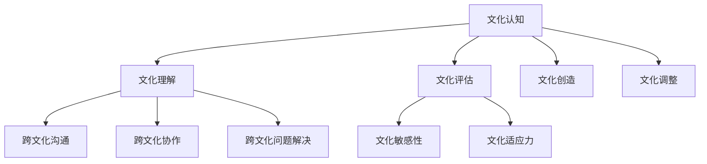
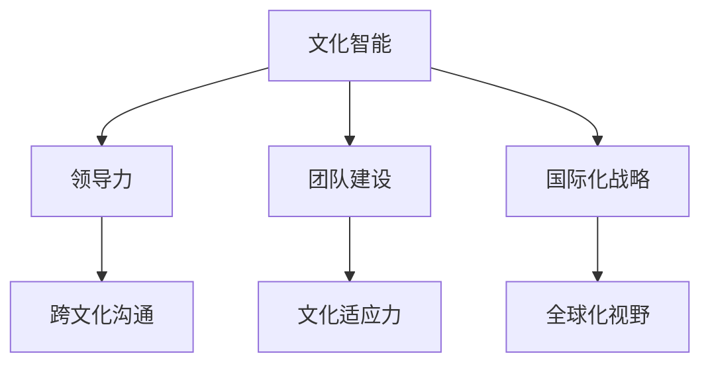

                 

# 文化智能：跨国企业领导者的必备技能

## 文章关键词

- 文化智能
- 跨国企业
- 领导者
- 跨文化沟通
- 全球化
- 国际化管理

## 文章摘要

在全球化的浪潮中，跨国企业的成功离不开领导者的文化智能。本文将深入探讨文化智能的定义、重要性及其在跨国企业领导中的作用。通过理论和实践的结合，本文将提供一系列提高文化智能的策略，帮助跨国企业领导者更好地应对跨文化挑战，实现企业的全球战略目标。

## 引言

### 背景介绍

随着全球化进程的加速，跨国企业越来越成为全球经济的重要组成部分。跨国企业在全球范围内的扩张不仅带来了巨大的商业机会，也带来了复杂的文化冲突和挑战。在这种背景下，领导者需要具备更高的文化智能，以应对多样化的文化环境和复杂的管理问题。

### 文化智能的定义

文化智能（Cultural Intelligence，简称CQ）是指个体在跨文化环境中识别、理解、评估、创造及调整文化与价值观念的能力。它不仅包括对其他文化的认知和理解，还包括在不同文化背景下有效沟通、协作和解决问题的能力。

### 跨国企业领导者与文化智能的关系

跨国企业领导者的角色和责任不仅仅是制定商业战略，更重要的是在复杂多变的跨文化环境中保持敏锐的洞察力和卓越的领导力。文化智能作为领导者不可或缺的素养，能够帮助他们在尊重不同文化差异的基础上，构建和谐高效的跨文化团队，实现企业的全球战略目标。

## 核心概念与联系

### 文化智能的概念架构

为了更好地理解文化智能，我们可以使用Mermaid流程图来展示其核心概念和联系：



### 文化智能与其他概念的关联

文化智能不仅与跨文化沟通、协作和问题解决相关，还与其他管理概念如领导力、团队建设、国际化战略等紧密相连。以下是一个简化的关联图：



### 核心算法原理讲解

提高文化智能的核心在于理解文化差异、提升跨文化沟通能力和适应力。以下是提高文化智能的伪代码：

```python
# 定义文化智能提升函数
def enhance_cultural_intelligence():
    # 步骤1：文化认知
    cultural_knowledge = learn_cultural_knowledge()
    
    # 步骤2：文化理解
    cultural_comprehension = understand_cultural_differences(cultural_knowledge)
    
    # 步骤3：文化评估
    cultural_evaluation = evaluate_cultural_impact(cultural_comprehension)
    
    # 步骤4：文化创造
    cultural_creation = create_cultural_solutions(cultural_evaluation)
    
    # 步骤5：文化调整
    cultural_adjustment = adjust_to_cultural_changes(cultural_creation)
    
    return cultural_adjustment
```

### 数学模型和公式

在跨文化管理中，可以采用以下数学模型来评估文化差异：

$$
CQ = f(C, K, A, S)
$$

其中，$C$表示文化认知，$K$表示文化知识，$A$表示文化适应力，$S$表示跨文化技能。

### 详细讲解和举例说明

假设有一个跨国企业，其领导者希望通过提高文化智能来增强团队的合作能力。以下是具体的实施步骤：

1. **文化认知**：首先，领导者需要了解团队成员的文化背景，包括他们的价值观、行为习惯等。
2. **文化理解**：通过培训和学习，领导者提升对团队成员文化差异的理解能力。
3. **文化评估**：评估文化差异对团队合作的影响，识别潜在的文化冲突点。
4. **文化创造**：制定文化解决方案，如组织跨文化团队建设活动，促进团队成员之间的交流和互动。
5. **文化调整**：在实施过程中，领导者需要不断调整策略，以适应不断变化的文化环境。

## 文化智能在跨国企业管理中的实践

### 文化智能在跨国企业管理中的应用场景

1. **团队建设**：在跨国企业中，团队建设需要充分考虑文化差异，以促进团队成员之间的有效沟通和协作。
2. **战略制定**：跨国企业的战略制定需要考虑到不同市场的文化特点，以制定出更加符合当地市场需求的企业战略。
3. **人力资源管理**：跨国企业需要采用多元文化的人力资源管理策略，以吸引和留住不同文化背景的员工。

### 文化智能在跨国企业管理中的挑战与策略

#### 挑战

1. **文化冲突**：不同文化背景的员工可能存在价值观和行为方式的差异，导致文化冲突。
2. **沟通障碍**：语言障碍和非语言沟通的差异可能导致沟通障碍，影响团队协作效率。
3. **管理复杂性**：跨国企业的管理涉及到多个国家和地区的文化差异，增加了管理的复杂性。

#### 策略

1. **文化敏感性培训**：通过培训提高领导者和员工的文化敏感性，增强对文化差异的理解和尊重。
2. **跨文化沟通技巧**：提供跨文化沟通培训，帮助员工掌握有效的跨文化沟通技巧。
3. **多元文化团队建设**：通过团队建设活动，促进团队成员之间的交流和互动，增强团队凝聚力。

### 跨文化团队的构建与管理

1. **文化匹配**：在组建跨文化团队时，选择具有互补性文化背景的成员，以促进团队协作。
2. **领导者的角色**：领导者需要在跨文化团队中扮演桥梁和协调者的角色，促进团队成员之间的沟通和理解。
3. **文化适应性**：跨文化团队需要具备较强的文化适应性，以应对不断变化的文化环境。

### 跨文化沟通的有效性

1. **语言沟通**：确保跨文化团队具备足够的语言能力，以实现有效的语言沟通。
2. **非语言沟通**：重视非语言沟通，如肢体语言、面部表情等，以增强沟通效果。
3. **文化理解**：提升团队成员对文化差异的理解和尊重，以减少沟通障碍。

### 跨文化冲突的预防与解决

1. **预防策略**：通过文化敏感性和跨文化沟通培训，预防文化冲突的发生。
2. **解决策略**：当文化冲突发生时，领导者需要及时介入，通过调解和协商解决冲突。

## 案例分析和实战指导

### 案例分析

#### 案例一：企业跨文化并购的成功与失败

一个跨国企业在并购一家本地企业时，由于未能充分考虑文化差异，导致并购失败。这一案例说明，文化智能在跨国并购中的重要性。

#### 案例二：跨国企业如何提高文化智能

一个跨国企业通过实施一系列文化智能提升策略，如文化敏感性培训、跨文化沟通技巧培训、多元文化团队建设等，成功提高了企业的文化智能，增强了团队的协作效率。

### 实战指导

#### 实战一：文化智能提升培训计划

1. **培训内容**：包括文化认知、文化理解、文化评估、文化创造和文化调整等方面的内容。
2. **培训方式**：采用线上线下相结合的方式，提供灵活的培训时间安排。
3. **培训评估**：通过考试和实战演练，评估员工的文化智能提升效果。

#### 实战二：跨文化管理工具的应用

1. **文化地图**：使用文化地图工具，帮助领导者了解团队成员的文化背景和价值观。
2. **跨文化沟通工具**：提供跨文化沟通指南和模板，帮助员工提高跨文化沟通能力。
3. **团队协作工具**：使用团队协作工具，如即时通讯软件、视频会议系统等，促进团队成员之间的有效沟通和协作。

## 结论与展望

### 结论

本文通过对文化智能的定义、重要性、提升策略及其在跨国企业管理中的应用进行深入探讨，强调了文化智能对跨国企业领导者的关键作用。提高文化智能有助于跨国企业更好地应对跨文化挑战，实现全球战略目标。

### 展望

随着全球化的进一步深化，文化智能将越来越成为跨国企业领导者必备的技能。未来，企业需要不断探索和创新文化智能提升的方法和工具，以适应不断变化的文化环境。同时，跨学科的研究和合作也将为文化智能的发展提供新的思路和方向。

## 作者信息

作者：AI天才研究院/AI Genius Institute & 禅与计算机程序设计艺术 /Zen And The Art of Computer Programming

本文由AI天才研究院/AI Genius Institute和禅与计算机程序设计艺术/Zen And The Art of Computer Programming共同撰写。我们致力于推动人工智能和计算机科学的创新发展，为跨国企业领导者提供有价值的指导和帮助。感谢您的阅读！

