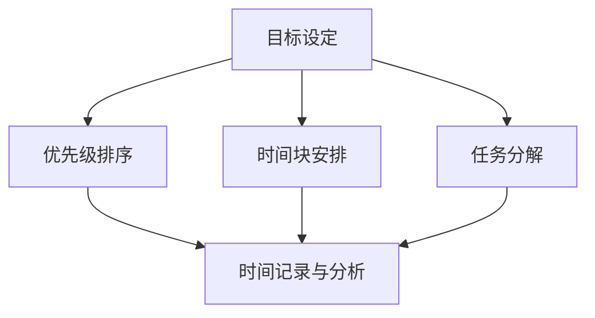

                 

### 文章标题

《时间管理大师：高效领导者的日程规划》

---

#### 关键词

时间管理、日程规划、高效领导者、时间管理策略、团队协作、跨部门沟通

---

#### 摘要

本文深入探讨时间管理在高效领导者日程规划中的重要性。通过介绍时间管理的基本概念和理论，本文将解析时间管理中的核心原则和方法，并具体探讨领导者如何在个人和团队层面应用这些策略。文章还将通过实际案例和最佳实践，提供详细的操作指南，帮助领导者提升时间管理能力，从而提高工作效率和团队绩效。

---

### 引言

在快节奏的现代工作和生活中，时间管理已成为提升个人和组织效率的关键因素。高效领导者的时间管理能力不仅关乎个人成就，更直接影响团队和组织的整体绩效。然而，时间管理并非仅仅是简单地安排日程，而是一个系统性的过程，涉及明确目标、制定优先级、合理分配时间和资源等多个方面。本文旨在探讨高效领导者如何通过科学的日程规划，实现时间管理优化，提升个人和团队的工作效率。

#### 时间管理的重要性

时间管理是现代生活和工作中不可或缺的一部分。它不仅决定了个人能否高效完成任务，还影响了团队和组织的整体运营效率。以下是时间管理的重要性体现在以下几个方面：

1. **提高工作效率**：通过合理安排时间，领导者可以确保工作任务的有序进行，减少拖延和重复劳动，从而提高工作效率。
2. **优化工作与生活平衡**：合理的时间管理有助于平衡工作与生活，避免因工作压力导致的身心疲惫。
3. **提升团队绩效**：有效的团队时间管理能够提高团队协作效率，促进团队成员之间的沟通与信任，进而提升整体绩效。
4. **实现目标**：明确的目标和合理的日程安排是实现目标的基础，通过科学的时间管理，领导者可以更好地跟踪进度，确保目标的达成。

#### 时间管理的误区

尽管时间管理的重要性不言而喻，但在实际操作中，许多领导者往往陷入一些常见的误区：

1. **优先级不明确**：许多领导者没有明确的工作优先级，导致时间和精力浪费在次要任务上。
2. **任务拖延**：由于对任务的时间估计不准确，或者缺乏执行动力，任务往往会拖延，影响整体进度。
3. **时间碎片化**：频繁的会议和邮件打扰，使得时间被碎片化，难以集中精力完成重要任务。
4. **依赖工具不足**：虽然许多领导者意识到时间管理工具的重要性，但往往因为工具选择不当或者使用不当，未能达到预期效果。

#### 时间管理的基本概念与理论

时间管理涉及多个核心概念和理论，以下是一些基本概念和理论：

1. **目标设定**：明确的目标是时间管理的基础。领导者需要设定短期和长期目标，确保工作方向一致。
2. **优先级排序**：通过对任务进行优先级排序，领导者可以明确哪些任务最为紧急和重要，从而合理安排时间和精力。
3. **时间块安排**：将时间分为不同的块，为不同类型的任务分配固定的时间段，有助于提高专注度和效率。
4. **任务分解**：将复杂的任务分解为小步骤，有助于逐步完成，避免因任务复杂而导致的拖延和压力。
5. **时间记录与分析**：通过记录和分析时间使用情况，领导者可以识别时间浪费的环节，进行优化调整。

### 核心概念与联系架构

为了更好地理解时间管理的核心概念和它们之间的联系，我们可以使用Mermaid流程图来展示这些概念及其相互关系。

这个流程图展示了目标设定、优先级排序、时间块安排、任务分解以及时间记录与分析这五个核心概念之间的相互关系。目标设定是时间管理的起点，优先级排序、时间块安排和任务分解是实现目标的关键步骤，而时间记录与分析则为不断优化时间管理提供了数据支持。

### 时间管理理论

时间管理理论为实践提供了指导框架，其中一些经典理论如下：

1. **埃克哈特的时间管理模型**：埃克哈特提出了一个基于目标和优先级的四象限时间管理模型，将任务分为紧急且重要、紧急但不重要、不紧急但重要、不紧急且不重要四个类别，帮助领导者更有效地分配时间和精力。
   
2. **莱特曼的时间管理策略**：莱特曼提出了“时间管理五步法”，包括设定目标、分析时间浪费、制定时间表、实施计划以及评估和调整。这一方法强调持续改进和适应性调整。

3. **80/20法则**：也称为帕累托法则，这一法则指出，20%的活动通常能够产生80%的成果。在时间管理中，领导者应关注这20%的高效活动，以实现最大的产出。

这些理论不仅提供了时间管理的基本框架，还为领导者如何在复杂的工作环境中进行有效的日程规划提供了实践指导。

#### 个人日程规划方法

个人日程规划是时间管理的重要组成部分。以下是一些关键步骤和方法，帮助领导者制定和执行个人日程规划：

1. **设定明确的目标**：明确的目标是日程规划的基础。领导者需要设定短期和长期目标，并将这些目标分解为具体的行动项。

2. **制定优先级**：根据目标的紧急性和重要性，对任务进行优先级排序。这有助于领导者明确哪些任务需要优先处理。

3. **时间块安排**：将时间分为不同的块，为不同类型的任务分配固定的时间段。例如，可以将上午用于处理紧急且重要的任务，下午用于处理不紧急但重要的任务。

4. **任务分解**：将复杂的任务分解为小步骤，确保每一步都有明确的完成时间，有助于逐步完成任务并减少拖延。

5. **使用工具辅助时间管理**：使用日历、任务管理应用等工具，可以帮助领导者更好地规划和管理日程。例如，使用Google日历可以设置提醒和事件，确保重要事项不被遗漏。

#### 领导者时间管理原则

作为高效领导者，时间管理不仅关乎个人，还直接影响团队和组织。以下是一些关键原则：

1. **明确角色和责任**：领导者需要明确自己的角色和责任，确保时间和精力集中在关键任务上。

2. **合理分配时间**：领导者应在个人和团队时间管理中找到平衡，确保既能够高效完成个人任务，又能够支持团队成员。

3. **培养团队时间管理意识**：领导者应通过培训和教育，提高团队成员的时间管理意识，促进团队整体效率的提升。

4. **灵活应对变化**：时间管理是一个动态过程，领导者需要灵活应对工作中的变化，及时调整日程安排。

5. **持续反思和优化**：领导者应定期反思自己的时间管理方法，识别改进机会，持续优化时间管理策略。

#### 团队时间管理策略

团队时间管理是提升整体工作效率的关键。以下是一些团队时间管理的策略：

1. **团队日程协调**：建立统一的团队日程协调机制，确保团队成员能够及时了解重要事件和任务安排，减少冲突和重复劳动。

2. **使用团队时间管理工具**：借助如Trello、Asana等团队协作工具，领导者可以更好地管理团队任务和进度，提高协作效率。

3. **定期团队时间管理会议**：通过定期召开团队时间管理会议，领导者可以了解团队成员的时间使用情况，及时解决时间管理问题。

4. **培养团队时间管理文化**：通过树立积极的时间管理文化，鼓励团队成员高效工作，提高整体团队绩效。

#### 跨部门协作与时间管理

跨部门协作是现代组织中常见且复杂的工作场景。以下是一些跨部门协作与时间管理的策略：

1. **跨部门沟通与协调**：建立有效的跨部门沟通机制，确保信息流畅传递，减少因沟通不畅导致的误解和延误。

2. **跨部门项目时间管理**：在跨部门项目中，领导者需要制定详细的时间计划和里程碑，确保项目按时完成。

3. **跨部门会议的有效管理**：通过优化会议流程，减少不必要的会议，确保会议的高效和针对性。

#### 高效领导者的日程规划案例

为了更好地理解高效领导者的日程规划实践，以下提供几个实际案例：

1. **初创企业CEO的日程规划**：初创企业CEO需要灵活应对各种突发情况，同时确保核心业务的持续推进。他们的日程规划通常包括早晨的会议、下午的市场分析和晚上的战略规划。

2. **跨国公司CEO的时间管理**：跨国公司CEO需要在全球范围内协调不同国家和地区的业务，他们的日程规划需要考虑到时差和文化差异，确保高效的远程协作。

3. **非营利组织领导者的日程规划**：非营利组织领导者需要平衡资源有限和任务繁重的挑战，他们的日程规划通常强调志愿者管理和资金筹措。

#### 时间管理工具与应用

在现代工作和生活中，时间管理工具的应用大大提高了效率。以下是一些常见的时间管理工具：

1. **Google日历**：提供日程安排、事件提醒和共享功能，方便领导者管理个人和团队日程。

2. **Trello**：基于看板式的任务管理工具，适用于项目协作和任务分配。

3. **Asana**：全面的任务和项目管理系统，支持团队协作和进度跟踪。

4. ** RescueTime **：自动记录工作活动，帮助用户了解时间使用情况，进行优化。

#### 项目实战

为了更深入地理解时间管理实践，以下是一个项目实战案例：

1. **开发环境搭建**：使用Docker搭建开发环境，确保团队成员在同一环境中工作，提高协作效率。

2. **源代码实现**：编写一个基于Python的简单任务调度系统，用于日程管理和任务分配。

3. **代码解读**：详细解读代码，解释调度系统的设计理念和实现细节。

4. **代码应用解读与分析**：分析调度系统在实际项目中的应用效果，并提出优化建议。

5. **实际案例分析**：结合实际案例，展示时间管理工具在项目中的应用，讨论效果和改进点。

#### 小结

高效领导者的日程规划是提升个人和团队工作效率的关键。通过明确目标、制定优先级、合理分配时间和资源，领导者可以更好地管理个人和团队的时间，实现工作与生活的平衡。同时，有效的团队协作和跨部门沟通也是提高整体绩效的关键。本文提供了详细的理论和实践指导，帮助领导者提升时间管理能力，实现高效工作。

### 注意事项

1. **避免任务拖延**：定期回顾任务清单，确保重要任务得到及时处理。
2. **合理利用工具**：选择适合自己的时间管理工具，并学会高效使用。
3. **保持灵活性**：根据实际情况调整日程安排，灵活应对突发情况。
4. **持续优化**：定期反思和调整时间管理策略，不断提升效率。

### 拓展阅读

1. 《高效能人士的七个习惯》史蒂芬·柯维
2. 《时间管理：如何高效利用时间》迈克尔·勒博
3. 《团队协作：如何提升团队效率》艾米丽·戴维斯

---

作者：AI天才研究院/AI Genius Institute & 禅与计算机程序设计艺术 /Zen And The Art of Computer Programming

