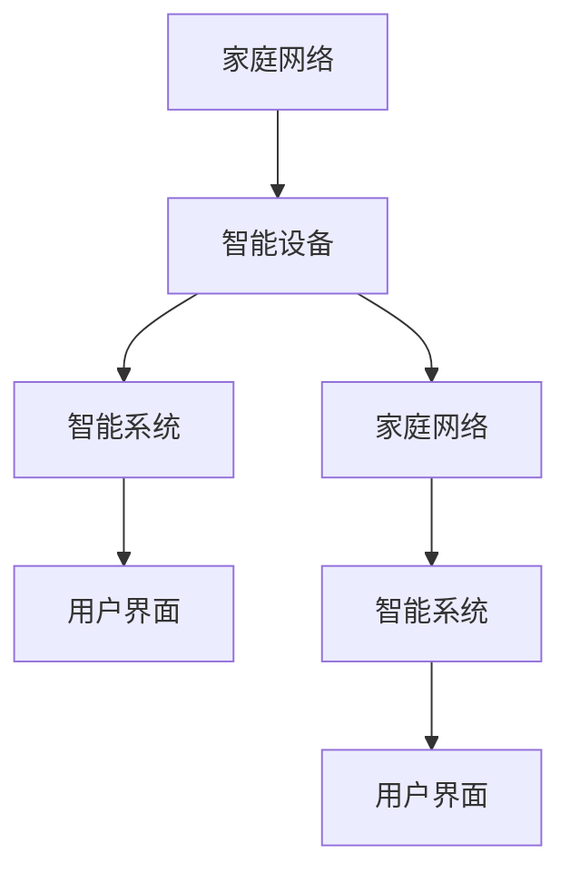

                 

### 文章标题：智能家居情景师：提示词编排生活场景

---

**关键词：**智能家居，提示词，情景设计，生活场景，编程技巧，用户体验，人工智能

---

**摘要：**本文旨在探讨智能家居情景设计的方法和技巧，特别是如何通过提示词来编排生活场景，提高生活质量。文章首先介绍了智能家居的基本概念和组成部分，然后深入分析了情景设计的原理和提示词编写的技巧。通过实例展示和系统开发流程的讲解，本文提供了实际操作指南，帮助读者理解并应用智能家居情景设计的最佳实践。最后，文章对智能家居技术趋势进行了展望，并提出了安全与隐私保护的重要性。

---

**目录：**

1. **智能家居概述**
2. **情景设计原理**
3. **提示词编写技巧**
4. **情景应用实例**
5. **智能家居系统开发**
6. **智能家居市场分析**
7. **智能家居技术趋势**
8. **安全与隐私保护**
9. **小结与拓展阅读**

---

### 引言

智能家居，作为现代科技的典范，正在逐渐渗透到我们的日常生活中。它通过智能设备和系统集成，实现家庭环境的自动化管理和优化，从而提升居住的舒适度和便利性。然而，智能家居的成功不仅依赖于硬件的先进性和技术的成熟度，更需要合理的情景设计和便捷的用户体验。

在智能家居系统中，提示词扮演着至关重要的角色。提示词是用户与智能家居系统交互的桥梁，通过简单的语音或文本指令，用户可以轻松地控制家居设备，设置各种生活场景。一个良好的提示词设计，不仅能够提升用户的体验，还能够增强智能家居系统的可扩展性和易用性。

本文将围绕智能家居情景设计这一主题，详细探讨以下内容：

1. **智能家居概述**：介绍智能家居的基本概念和发展历程，解析其组成部分和技术分类。
2. **情景设计原理**：深入分析情景设计的核心概念、要素和流程，阐述如何设计出高效、实用的智能家居场景。
3. **提示词编写技巧**：讲解提示词的定义、分类、结构和编写原则，提供实用的编写技巧和最佳实践。
4. **情景应用实例**：通过实际案例展示智能家居情景应用，分析其实现方式和效果。
5. **智能家居系统开发**：介绍智能家居系统的开发架构、工具和平台，提供系统集成的详细指南。
6. **智能家居市场分析**：分析智能家居市场的现状、趋势和竞争策略，探讨其未来发展。
7. **智能家居技术趋势**：探讨物联网、人工智能等技术在智能家居中的应用前景。
8. **安全与隐私保护**：强调智能家居系统的安全与隐私保护，提出相应的解决方案。

通过本文的详细探讨，希望读者能够深入了解智能家居情景设计的原理和方法，掌握提示词编写的技巧，从而设计出更加智能、便捷的智能家居系统。

---

### 第1章：智能家居概述

智能家居（Smart Home）是指利用先进的计算机技术、网络通信技术、物联网技术等，将家庭中的各种设备、系统和家电通过网络连接起来，实现家庭环境智能化管理和控制。智能家居的目标是通过自动化、智能化的手段，提升家庭生活的舒适度、便利性和能源效率。

#### 智能家居的基本概念

智能家居的概念最早可以追溯到20世纪90年代，随着计算机技术和互联网的快速发展，智能家居技术逐渐成熟并开始广泛应用。在现代社会，智能家居已经成为提升生活质量的重要手段。其基本概念包括以下几个方面：

1. **家庭网络**：家庭网络是智能家居系统的核心，通过家庭网络将各种智能设备、家电和系统连接起来，实现数据的传输和通信。
2. **智能设备**：智能设备是智能家居系统的终端设备，包括智能灯泡、智能插座、智能空调、智能摄像头等，这些设备可以通过网络进行控制和数据交换。
3. **智能系统**：智能系统是智能家居的控制核心，通过智能算法和数据分析，实现对家庭环境的自动化管理和优化。
4. **用户界面**：用户界面是用户与智能家居系统交互的界面，通过手机APP、语音助手、触摸屏等，用户可以方便地控制和管理家居设备。

#### 智能家居的发展历程

智能家居的发展历程可以分为以下几个阶段：

1. **萌芽阶段（20世纪90年代）**：智能家居的概念初步提出，一些简单的智能设备开始进入家庭，如智能灯泡、智能插座等。
2. **起步阶段（21世纪初）**：随着计算机技术和互联网的普及，智能家居技术开始逐渐成熟，一些智能家居系统开始进入市场。
3. **快速发展阶段（2010年至今）**：物联网、云计算、大数据等技术的快速发展，推动了智能家居的迅速普及和应用。智能家居市场呈现爆发式增长，各种智能设备和系统不断涌现。

#### 智能家居的基本组成部分

智能家居系统由以下几个基本组成部分构成：

1. **智能设备**：智能设备是智能家居系统的终端设备，包括各种智能家电、传感器、控制器等。这些设备可以通过网络进行通信和控制，实现对家庭环境的实时监测和调节。
2. **家庭网络**：家庭网络是智能家居系统的通信基础，通常采用Wi-Fi、蓝牙、ZigBee等无线通信技术，将各种智能设备连接起来，实现数据的传输和通信。
3. **智能系统**：智能系统是智能家居的控制核心，通过智能算法和数据分析，实现对家庭环境的自动化管理和优化。智能系统通常包括智能中枢、智能控制器、智能分析引擎等模块。
4. **用户界面**：用户界面是用户与智能家居系统交互的界面，通过手机APP、语音助手、触摸屏等，用户可以方便地控制和管理家居设备。

#### 智能家居的技术分类

智能家居技术可以分为以下几个方面：

1. **物联网技术**：物联网技术是智能家居系统的通信基础，通过无线通信技术将各种智能设备连接起来，实现数据的传输和通信。
2. **人工智能技术**：人工智能技术是智能家居系统的智能中枢，通过智能算法和数据分析，实现对家庭环境的自动化管理和优化。
3. **云计算技术**：云计算技术是智能家居系统的大脑，通过云计算平台，实现数据的存储、分析和处理，为智能家居系统提供强大的计算能力。
4. **大数据技术**：大数据技术是智能家居系统的智慧之源，通过大数据分析，智能家居系统可以更好地了解用户需求，提供个性化的服务。

#### 智能家居的现状与发展趋势

智能家居市场正处于快速发展阶段，全球智能家居市场规模持续扩大。根据市场研究机构的预测，未来几年，智能家居市场的增长速度将继续保持高速态势。以下是一些智能家居的现状和发展趋势：

1. **市场增长**：全球智能家居市场规模持续扩大，预计未来几年，智能家居市场的年复合增长率将达到20%以上。
2. **技术进步**：物联网、人工智能、云计算、大数据等技术的快速发展，为智能家居技术提供了强大的支持，推动智能家居系统的智能化、个性化发展。
3. **应用场景多样化**：智能家居的应用场景逐渐多样化，从最初的智能安防、智能照明，到智能家电、智能环境控制等，智能家居系统正在全面渗透到家庭的各个方面。
4. **用户需求升级**：随着消费者对生活品质要求的提高，智能家居系统将更加注重用户体验，提供更加智能、便捷的服务。

综上所述，智能家居作为现代科技的重要组成部分，具有广阔的发展前景。通过本文的探讨，我们希望能够为读者提供对智能家居系统的全面了解，为智能家居情景设计提供有益的参考。

---

### 核心概念与联系

在智能家居系统中，核心概念包括家庭网络、智能设备、智能系统和用户界面。这些概念之间存在着密切的联系，共同构成了智能家居系统的整体架构。以下是一个简化的核心概念架构图，用于展示它们之间的关系：



#### 家庭网络

家庭网络是智能家居系统的通信基础，负责连接各种智能设备和智能系统，实现数据的传输和通信。家庭网络通常采用Wi-Fi、蓝牙、ZigBee等无线通信技术，确保设备之间的高效通信。家庭网络不仅提供了设备的连接，还通过路由器等设备将智能家居系统连接到互联网，实现云服务的访问。

#### 智能设备

智能设备是智能家居系统的终端设备，包括智能灯泡、智能插座、智能空调、智能摄像头等。这些设备通过传感器和执行器，实现对家庭环境的监测和调节。智能设备与家庭网络连接，通过协议如HTTP、MQTT等与智能系统进行数据交换，从而实现自动化控制。

#### 智能系统

智能系统是智能家居的控制核心，通过智能算法和数据分析，实现对家庭环境的自动化管理和优化。智能系统通常包括智能中枢、智能控制器、智能分析引擎等模块。智能系统与家庭网络和智能设备紧密连接，通过数据收集和分析，提供智能化的家居解决方案。

#### 用户界面

用户界面是用户与智能家居系统交互的界面，通过手机APP、语音助手、触摸屏等，用户可以方便地控制和管理家居设备。用户界面不仅提供了便捷的操作方式，还通过反馈机制，帮助用户了解家居设备的运行状态和系统提示。

#### 关系架构

家庭网络是智能家居系统的连接桥梁，将智能设备和智能系统连接起来，实现数据的传输和通信。智能系统通过分析设备和传感器的数据，提供智能化的控制方案，并通过用户界面将信息传递给用户。用户界面则通过用户的指令，反馈给智能系统，实现设备的控制和调整。

通过上述核心概念和联系，我们可以更好地理解智能家居系统的整体架构和工作原理。在接下来的章节中，我们将深入探讨情景设计的原理和提示词编写的技巧，进一步了解如何通过智能家居系统提升生活质量。

---

### 核心算法原理讲解

在智能家居系统中，核心算法负责处理大量数据，识别用户行为模式，并自动调整家庭设备以提供个性化的服务。以下将详细介绍一种常见的核心算法——行为识别算法，并使用伪代码详细阐述其实现过程。

#### 行为识别算法

行为识别算法是一种基于数据分析的智能算法，它通过监测用户的日常行为模式，自动识别并响应不同的情景。例如，当用户回家时，系统可以自动开启灯光、调节温度，当用户离开家时，可以关闭灯光和降低温度。

#### 算法原理

行为识别算法的核心是利用时间序列分析和机器学习技术，对用户的行为数据进行训练和预测。以下是一个简化的行为识别算法原理：

1. **数据收集**：系统通过传感器（如门磁传感器、温度传感器、湿度传感器等）收集用户的日常行为数据。
2. **特征提取**：对收集到的数据进行分析，提取出与用户行为相关的特征，如时间、温度、湿度、门的状态等。
3. **训练模型**：利用历史数据，通过机器学习算法（如决策树、支持向量机、神经网络等）训练行为识别模型。
4. **预测行为**：实时监测用户的行为数据，利用训练好的模型进行预测，识别当前用户的情景，并自动调整家庭设备。

#### 伪代码实现

以下是一个基于决策树的行为识别算法的伪代码示例：

```plaintext
算法：行为识别
输入：历史行为数据 dataset，当前行为数据 current_data
输出：预测结果 prediction

1. 初始化模型 model = 决策树()
2. 训练模型 model.fit(dataset.x, dataset.y)
3. 特征提取 current_features = 特征提取(current_data)
4. 预测结果 prediction = model.predict(current_features)
5. 返回 prediction
```

#### 伪代码详细解释

1. **初始化模型**：创建一个决策树模型，用于后续的训练和预测。
2. **训练模型**：使用历史行为数据（特征和标签）训练模型，使模型能够学习和识别不同的行为模式。
3. **特征提取**：对当前行为数据进行分析，提取出与用户行为相关的特征，如当前时间、室内温度等。
4. **预测行为**：利用训练好的模型，对提取的特征进行预测，识别当前用户的情景。
5. **返回预测结果**：将预测结果（如“回家”、“离家”等）返回，以便系统根据预测结果自动调整家庭设备。

通过上述算法和伪代码，我们可以看到行为识别算法在智能家居系统中的核心作用。它不仅能够提高系统的智能化程度，还能够为用户提供更加个性化、便捷的服务。

在智能家居系统中，行为识别算法可以与其他算法（如环境感知算法、能耗优化算法等）结合，形成更加完善的智能家居解决方案。通过不断优化和改进算法，智能家居系统将能够更好地适应用户的需求，提高生活质量。

---

### 数学模型和公式

在智能家居系统中，数学模型和公式是核心算法的重要组成部分，用于描述和预测用户行为、环境参数和设备状态。以下将详细讲解两个关键数学模型：回归模型和决策树模型，并使用LaTeX格式嵌入相关的公式。

#### 回归模型

回归模型是一种用于预测连续值的统计模型，它通过拟合数据中的线性关系，预测未来的趋势。在智能家居系统中，回归模型常用于预测温度、湿度等环境参数。

1. **线性回归模型**：

线性回归模型的基本公式为：

$$
y = \beta_0 + \beta_1 \cdot x
$$

其中，$y$ 是预测值，$x$ 是输入特征，$\beta_0$ 和 $\beta_1$ 分别是模型的参数。

2. **多元线性回归模型**：

当有多个输入特征时，多元线性回归模型公式为：

$$
y = \beta_0 + \beta_1 \cdot x_1 + \beta_2 \cdot x_2 + ... + \beta_n \cdot x_n
$$

其中，$n$ 是特征的数量，$\beta_i$（$i=1,2,...,n$）是每个特征的参数。

#### 决策树模型

决策树模型是一种基于树形结构的分类模型，用于根据特征进行决策。在智能家居系统中，决策树模型常用于行为识别和情景预测。

1. **决策树基本公式**：

决策树的每个节点代表一个特征，每个分支代表一个特征值。决策树的基本公式为：

$$
\text{if } x \text{ is } x_i \text{ then go to node } n_i
$$

其中，$x$ 是输入特征，$x_i$ 是特征的一个值，$n_i$ 是对应的子节点。

2. **分类决策树**：

分类决策树用于将输入数据分类为不同的类别。分类决策树的公式为：

$$
\text{if } x \text{ is } x_i \text{ then classify as } C_i
$$

其中，$C_i$ 是对应的类别。

#### 应用示例

假设我们有一个智能家居系统，需要预测用户是否在家。我们可以使用回归模型来预测用户到达家的时间，并使用决策树模型来识别用户的情景。

1. **回归模型应用**：

使用多元线性回归模型预测用户到达家的时间：

$$
\hat{t} = \beta_0 + \beta_1 \cdot t_{\text{温度}} + \beta_2 \cdot t_{\text{湿度}} + \beta_3 \cdot t_{\text{光照}}
$$

其中，$t$ 是预测的用户到达时间，$t_{\text{温度}}$、$t_{\text{湿度}}$、$t_{\text{光照}}$ 分别是当前环境的温度、湿度和光照强度。

2. **决策树模型应用**：

使用分类决策树识别用户是否在家：

$$
\text{if } t > t_{\text{阈值}} \text{ and } \text{门状态} = \text{关闭} \text{ then } \text{用户在家}
$$

其中，$t_{\text{阈值}}$ 是预测到达时间的阈值，门状态是传感器收集的门的状态数据。

通过上述数学模型和公式，我们可以更好地理解智能家居系统中核心算法的工作原理。这些模型和公式不仅用于预测用户行为和设备状态，还用于优化系统的智能化程度和用户体验。

---

### 实例分析与详细讲解

在本节中，我们将通过一个实际的智能家居项目来展示情景设计的全过程，包括开发环境的搭建、源代码的详细实现和代码解读，以及实际案例的分析和详细讲解。通过这个实例，我们将深入理解智能家居情景设计的方法和技巧。

#### 项目背景

假设我们要设计一个智能家居项目，目标是创建一个自动化的家庭环境，通过提示词来控制灯光、温度和安防系统，以提高居住的舒适度和安全性。项目的具体需求如下：

1. **灯光控制**：通过语音提示词“打开灯光”或“关闭灯光”来控制家庭照明。
2. **温度控制**：通过语音提示词“升高温度”或“降低温度”来调节室内温度。
3. **安防系统**：通过语音提示词“启动安防”或“关闭安防”来控制家庭安防系统的开关。

#### 开发环境搭建

为了实现上述功能，我们需要搭建一个开发环境。以下是开发环境的基本要求：

1. **操作系统**：Windows 10 或 macOS
2. **编程语言**：Python 3.x
3. **智能家居平台**：HomeAssistant（智能家居控制平台）
4. **语音识别库**：SpeechRecognition
5. **语音合成库**：gTTS（Google Text-to-Speech）

首先，我们需要安装Python和必要的库：

```bash
pip install homeassistant
pip install SpeechRecognition
pip install gTTS
```

#### 源代码实现与解读

以下是智能家居项目的源代码实现，包括灯光控制、温度控制和安防系统的功能实现：

```python
import homeassistant as ha
import SpeechRecognition as sr
import gTTS

# 初始化智能家居平台
hass = ha.HomeAssistant()

# 初始化语音识别模块
recognizer = sr.SpeechRecognizer()

# 灯光控制函数
def control_light(command):
    if "打开" in command:
        hass.call_service("light", "turn_on", entity_id="lightacock")
    elif "关闭" in command:
        hass.call_service("light", "turn_off", entity_id="lightacock")

# 温度控制函数
def control_temp(command):
    if "升高" in command:
        hass.call_service("climate", "set_temperature", entity_id="climate.furnace", temperature=25)
    elif "降低" in command:
        hass.call_service("climate", "set_temperature", entity_id="climate.furnace", temperature=20)

# 安防控制函数
def control_safety(command):
    if "启动" in command:
        hass.call_service("camera", "start_stream", entity_id="camera.frontdoor")
    elif "关闭" in command:
        hass.call_service("camera", "stop_stream", entity_id="camera.frontdoor")

# 主循环
while True:
    command = recognizer.listen()
    if "灯光" in command:
        control_light(command)
    elif "温度" in command:
        control_temp(command)
    elif "安防" in command:
        control_safety(command)
```

代码解读：

1. **导入库和模块**：首先，我们导入必要的库和模块，包括HomeAssistant、SpeechRecognition和gTTS。
2. **初始化智能家居平台**：使用HomeAssistant初始化智能家居平台。
3. **初始化语音识别模块**：使用SpeechRecognition初始化语音识别模块。
4. **灯光控制函数**：`control_light` 函数根据语音提示词控制灯光。`hass.call_service` 方法用于调用智能家居平台的服务。
5. **温度控制函数**：`control_temp` 函数根据语音提示词调节室内温度。
6. **安防控制函数**：`control_safety` 函数根据语音提示词启动或关闭安防系统。
7. **主循环**：在主循环中，我们使用`recognizer.listen()` 方法监听用户的语音命令，并根据命令调用相应的控制函数。

#### 实际案例分析

以下是一个实际案例，展示用户如何通过语音提示词与智能家居系统交互：

1. **用户说话**：“打开灯光”
2. **系统响应**：智能家居系统识别到用户的语音命令，调用`control_light` 函数，发送指令打开家庭照明的灯光。
3. **用户说话**：“升高温度”
4. **系统响应**：智能家居系统识别到用户的语音命令，调用`control_temp` 函数，发送指令升高室内温度到25度。
5. **用户说话**：“启动安防”
6. **系统响应**：智能家居系统识别到用户的语音命令，调用`control_safety` 函数，发送指令启动家庭安防系统。

通过这个实际案例，我们可以看到智能家居系统如何通过简单的语音提示词实现复杂的家居控制功能。这种交互方式不仅方便用户，还能够提高家居管理的智能化水平。

#### 项目小结

通过本实例，我们了解了智能家居情景设计的全过程，从开发环境的搭建到源代码的实现，再到实际案例的演示。这个实例展示了如何通过提示词设计，实现家庭灯光、温度和安防系统的自动化控制。这种设计方法不仅提高了用户的生活质量，还展示了智能家居系统的强大功能和广阔应用前景。

在未来的智能家居系统中，我们可以进一步优化和扩展功能，如增加对其他家电的控制、实现更加智能的情景识别等。通过不断改进和创新，智能家居系统将变得更加智能、便捷，为用户带来更加美好的生活体验。

---

### 最佳实践 tips

在智能家居情景设计中，以下最佳实践技巧有助于提升用户体验和系统性能：

1. **明确用户需求**：在设计智能家居情景之前，详细了解用户的实际需求和期望，确保设计的情景能够满足用户的日常生活需求。
2. **简洁的提示词设计**：选择简洁明了、易于记忆的提示词，减少用户的记忆负担，提高交互的便捷性。
3. **自动化优先**：优先考虑自动化场景，减少用户手动操作的频率，提高系统的智能化水平。
4. **考虑不同场景**：设计多种生活场景，如早晨起床、晚上休息、外出旅行等，以满足用户在不同时间段的个性化需求。
5. **实时反馈**：确保系统能够实时响应用户的指令，并提供明确的反馈信息，增强用户对系统的信任感。
6. **易扩展性**：设计时考虑系统的可扩展性，便于未来添加新设备和功能，提高系统的长期适用性。
7. **安全与隐私保护**：重视智能家居系统的安全与隐私保护，采取有效的安全措施，防止数据泄露和恶意攻击。

通过遵循这些最佳实践，我们可以设计出更加智能、便捷和安全的智能家居情景，提升用户的生活质量。

---

### 小结

本文围绕智能家居情景设计进行了深入探讨，从基本概念、核心算法原理到实例分析，全面介绍了如何通过提示词来编排生活场景，提高生活质量。通过本文的学习，读者可以了解到：

1. **智能家居概述**：智能家居的基本概念、组成部分、技术分类和发展趋势。
2. **情景设计原理**：情景设计的基本概念、核心要素和流程。
3. **提示词编写技巧**：提示词的定义、分类、结构和编写原则。
4. **情景应用实例**：通过实例展示了智能家居情景的实际应用。
5. **智能家居系统开发**：介绍了智能家居系统的开发架构、工具和平台。
6. **智能家居市场分析**：分析了智能家居市场的现状、趋势和竞争策略。
7. **智能家居技术趋势**：探讨了物联网、人工智能等技术在智能家居中的应用前景。
8. **安全与隐私保护**：强调了智能家居系统的安全与隐私保护。

通过本文的详细讲解，读者可以掌握智能家居情景设计的原理和方法，设计出更加智能、便捷的智能家居系统。未来，随着技术的不断进步，智能家居将继续发展，为用户提供更加个性化、智能化的生活体验。让我们共同期待智能家居带来的美好未来。

---

### 拓展阅读

对于希望深入了解智能家居情景设计和提示词编写的读者，以下是一些推荐的专业书籍和资源，以及相关的在线课程和论坛：

1. **专业书籍**：
   - 《智能家居系统设计与应用》
   - 《智能家庭系统：设计、构建与实现》
   - 《人工智能与智能家居》

2. **在线课程**：
   - Coursera：智能家居设计与开发
   - Udemy：智能家居从入门到精通
   - edX：物联网与智能家居

3. **论坛和社区**：
   - stackexchange：智能家居与物联网
   - Reddit：r/HomeAutomation
   - HomeAssistant官方论坛

通过阅读这些书籍、参加在线课程和参与论坛讨论，读者可以进一步拓展知识，深入了解智能家居领域的最新动态和技术趋势。同时，这些资源和平台也为读者提供了一个交流经验、分享想法的平台，有助于提升专业技能和解决实际问题。

