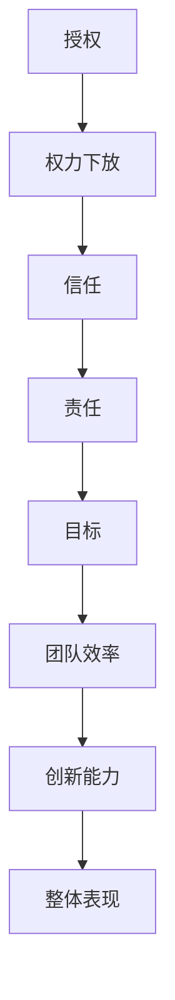
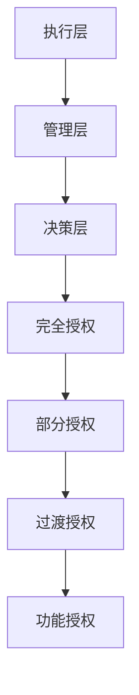
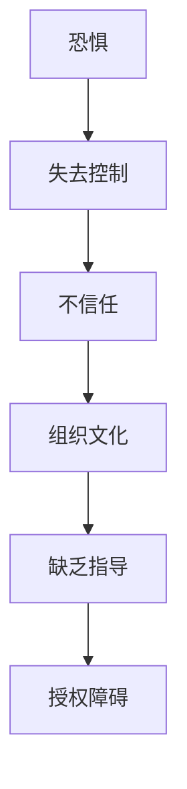
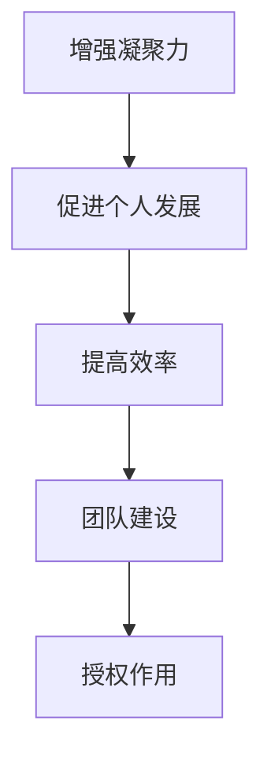
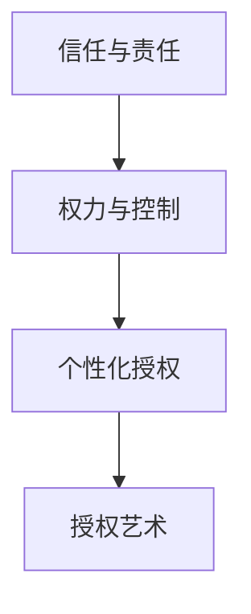
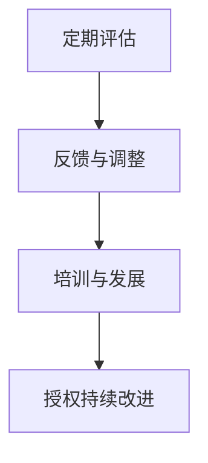
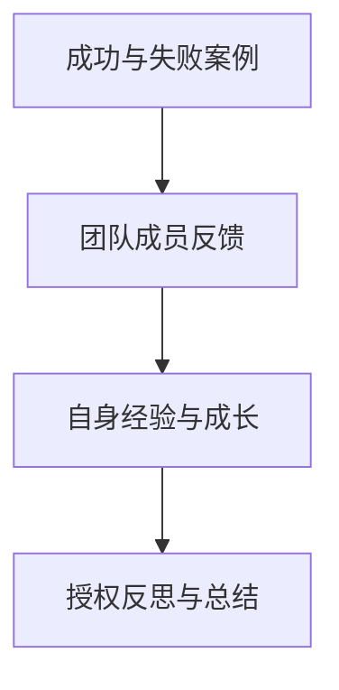

                 

### 文章标题

# 有效授权：释放团队潜能的艺术

### 文章关键词

- 授权
- 团队管理
- 潜能释放
- 最佳实践
- 案例分析

### 文章摘要

本文旨在探讨有效授权的重要性以及如何在实际操作中实现它。通过深入分析授权的核心理论、最佳实践以及实践案例，本文将帮助读者理解授权的深层含义，掌握释放团队潜能的艺术。文章将分为四个主要部分：基础理论、最佳实践、实践案例和艺术，每一部分都将详细讲解关键概念、原理和实践方法。通过本文的学习，读者将能够更有效地进行授权，提升团队的整体表现。

## 目录

### 第一部分：授权的基础理论

1. 授权的重要性与影响  
2. 授权的类型与层次  
3. 授权的障碍与挑战  
4. 授权与团队建设

### 第二部分：授权的最佳实践

1. 明确授权的目标与范围  
2. 建立信任与尊重  
3. 提供必要的支持与资源  
4. 设定清晰的目标与期望  
5. 反馈与评估

### 第三部分：授权的实践案例

1. 案例一：初创企业的授权实践  
2. 案例二：大型企业的授权实践  
3. 案例三：非营利组织的授权实践

### 第四部分：授权的艺术

1. 授权的艺术与智慧  
2. 授权的持续改进  
3. 授权的反思与总结

### 文章标题

# 有效授权：释放团队潜能的艺术

> 关键词：授权，团队管理，潜能释放，最佳实践，案例分析

> 摘要：本文将深入探讨有效授权在团队管理中的重要性，通过分析授权的基础理论、最佳实践和实际案例，帮助读者掌握释放团队潜能的艺术。

## 第一部分：授权的基础理论

### 1.1 授权的重要性与影响

授权不仅仅是将权力下放给下属，它更是一种管理哲学，是一种通过信任和责任激发团队成员潜能的方法。在当今快速变化和竞争激烈的工作环境中，授权成为提高团队效率、激发创新和提升整体表现的关键。

#### 背景介绍

在传统的管理结构中，权力和责任通常集中在管理层，员工扮演执行者的角色。这种集中式管理模式在稳定和可控的环境中可能效果不错，但在现代组织中，它往往限制了团队的创新能力和灵活性。现代企业需要更快的响应速度、更高的适应能力和更强的创新能力，而这一切都需要通过授权来实现。

#### 核心概念与联系

授权的核心概念包括权力、信任、责任和目标。权力是指管理层的权力下放；信任是指管理者对下属的信任；责任是指下属在接受授权后的责任；目标是指授权的目的和期望结果。

#### Mermaid 流程图



### 1.2 授权的类型与层次

授权可以分为多种类型，每种类型都有其特定的应用场景和效果。常见的授权类型包括：

- 完全授权：管理者完全放手，让下属独立完成工作。
- 部分授权：管理者保留部分决策权，下属在一定范围内自主决策。
- 过渡授权：管理者逐步将权力下放，下属在逐渐增加的自主权中学习和成长。
- 功能授权：针对特定的任务或职能进行授权。

#### 核心概念与联系

授权类型与授权层次紧密相关。授权层次包括：

- 第一层次：执行层，负责日常任务的执行。
- 第二层次：管理层，负责团队的战略规划和目标设定。
- 第三层次：决策层，负责关键的决策和战略方向。

#### Mermaid 流程图



### 1.3 授权的障碍与挑战

授权并非总是一帆风顺的过程，它面临着各种障碍和挑战。了解这些障碍和挑战有助于管理者更好地进行授权。

#### 核心概念与联系

常见的授权障碍包括：

- 恐惧：管理者害怕失去控制，担心下属无法完成任务。
- 不信任：管理者对下属的能力和诚信存在疑虑。
- 文化：组织文化可能不利于授权，员工缺乏自主性和创新精神。
- 缺乏指导：下属在缺乏明确指导和资源的情况下难以胜任新的任务。

#### Mermaid 流程图



### 1.4 授权与团队建设

授权不仅是一种管理工具，它也是团队建设的重要组成部分。通过有效的授权，管理者可以培养团队的独立性、协作性和创新能力。

#### 核心概念与联系

授权在团队建设中的作用包括：

- 增强团队凝聚力：通过授权，团队成员感受到被信任和重视，增强了团队的凝聚力。
- 促进个人发展：授权为团队成员提供了成长和发展的机会，有助于提高个人的能力和自信心。
- 提高团队效率：授权使得团队成员能够更专注于自己的领域，提高了整体工作效率。

#### Mermaid 流程图



## 第二部分：授权的最佳实践

### 2.1 明确授权的目标与范围

授权的第一步是明确目标与范围。这包括确定授权的任务、目标以及下属的权限和责任。

#### 背景介绍

在授权前，管理者需要明确授权的任务和目标。任务是指需要完成的特定工作，目标是指通过这项工作期望达到的结果。同时，管理者还需要明确下属的权限和责任，确保授权的范围清晰。

#### 核心算法原理讲解

```python
def define_authorization_task_and_scope(task, objectives, authority, responsibility):
    """
    定义授权的任务和范围。
    
    参数：
    - task：授权的任务
    - objectives：授权的目标
    - authority：下属的权限
    - responsibility：下属的责任
    
    返回值：
    - authorization_plan：授权计划
    """
    
    authorization_plan = {
        "task": task,
        "objectives": objectives,
        "authority": authority,
        "responsibility": responsibility
    }
    
    return authorization_plan
```

#### 数学模型和公式

授权计划的成功实施需要基于以下几个关键指标：

- 成功率（Success Rate）：
  $$ SR = \frac{Completed Tasks}{Total Tasks} $$

- 满意度（Satisfaction Rate）：
  $$ SR = \frac{Satisfied Employees}{Total Employees} $$

#### 举例说明

假设一个团队需要完成一个市场推广项目，管理者决定授权给团队成员李华负责。任务包括市场调研、策划和执行。目标是在三个月内完成市场推广计划，并提高品牌知名度。权限包括决策权、资源调配权和预算控制权。责任包括项目进度管理、团队协作和最终结果评估。

```python
task = "市场推广项目"
objectives = "完成市场推广计划，提高品牌知名度"
authority = "决策权、资源调配权、预算控制权"
responsibility = "项目进度管理、团队协作、最终结果评估"

authorization_plan = define_authorization_task_and_scope(task, objectives, authority, responsibility)
print(authorization_plan)
```

### 2.2 建立信任与尊重

建立信任与尊重是授权成功的关键。管理者需要通过一系列措施来建立与团队成员之间的信任关系，并确保对团队成员的尊重。

#### 背景介绍

信任是授权的基础，没有信任，授权很难成功。管理者需要通过透明的沟通、公正的待遇和持续的支持来建立信任。尊重则体现在对团队成员个性和能力的认可上。

#### 核心算法原理讲解

建立信任与尊重的步骤包括：

1. 开放透明的沟通：确保信息的畅通，避免信息不对称。
2. 公正的待遇：对团队成员一视同仁，确保公平。
3. 持续的支持：在团队成员遇到困难时提供帮助。

```python
def build_trust_and_respect(communication, fairness, support):
    """
    建立信任与尊重。
    
    参数：
    - communication：沟通
    - fairness：公正
    - support：支持
    
    返回值：
    - trust_and_respect：信任与尊重的程度
    """
    
    trust_and_respect = {
        "communication": communication,
        "fairness": fairness,
        "support": support
    }
    
    return trust_and_respect
```

#### 数学模型和公式

信任与尊重的程度可以用以下公式表示：

- 信任度（Trust Level）：
  $$ TL = \frac{C + F + S}{3} $$

- 尊重度（Respect Level）：
  $$ RL = \frac{C + F + S}{3} $$

其中，C、F、S 分别代表沟通、公正和支持的程度。

#### 举例说明

假设一个团队的管理者通过开放透明的沟通、公正的待遇和持续的支持来建立信任与尊重。沟通得分是 8，公正得分是 9，支持得分是 7。

```python
communication = 8
fairness = 9
support = 7

trust_and_respect = build_trust_and_respect(communication, fairness, support)
print(trust_and_respect)
```

### 2.3 提供必要的支持与资源

授权不仅仅是赋予下属权力和责任，还需要提供必要的支持与资源。这包括培训、指导、工具和资源。

#### 背景介绍

有效的授权需要下属具备完成任务的能力。管理者需要确保下属在授权后能够得到充分的培训、指导和资源支持，以便他们能够顺利完成任务。

#### 核心算法原理讲解

提供必要支持与资源的步骤包括：

1. 培训：为下属提供相关技能和知识的培训。
2. 指导：在下属遇到问题时提供指导和支持。
3. 工具：为下属提供完成任务所需的工具和软件。
4. 资源：为下属提供必要的资源和预算。

```python
def provide_support_and_resources(training, guidance, tools, resources):
    """
    提供必要的支持与资源。
    
    参数：
    - training：培训
    - guidance：指导
    - tools：工具
    - resources：资源
    
    返回值：
    - support_resources：支持与资源的情况
    """
    
    support_resources = {
        "training": training,
        "guidance": guidance,
        "tools": tools,
        "resources": resources
    }
    
    return support_resources
```

#### 数学模型和公式

支持与资源的情况可以用以下公式表示：

- 支持度（Support Level）：
  $$ SL = \frac{T + G + T + R}{4} $$

其中，T、G、T、R 分别代表培训、指导、工具和资源的程度。

#### 举例说明

假设一个团队的管理者为下属提供了全面的培训、指导、工具和资源支持。培训得分是 8，指导得分是 9，工具得分是 7，资源得分是 8。

```python
training = 8
guidance = 9
tools = 7
resources = 8

support_resources = provide_support_and_resources(training, guidance, tools, resources)
print(support_resources)
```

### 2.4 设定清晰的目标与期望

在授权过程中，设定清晰的目标与期望是至关重要的一步。这有助于确保下属明确任务和期望，从而提高任务完成的效率和质量。

#### 背景介绍

设定清晰的目标与期望有助于下属理解管理者的期望，明确任务的重要性，从而更有动力地完成任务。同时，清晰的目标与期望也有助于管理者对下属的工作进行有效的监督和评估。

#### 核心算法原理讲解

设定清晰目标与期望的步骤包括：

1. 明确任务目标：明确需要完成的任务和期望达到的结果。
2. 设定量化指标：设定可量化的指标，以便对任务完成情况进行评估。
3. 沟通与确认：与下属进行沟通，确保他们对任务目标和期望有清晰的理解。

```python
def set_clear_objectives_and_expectations(task_objectives, quantitative_indicators, communication_and_confirmation):
    """
    设定清晰的目标与期望。
    
    参数：
    - task_objectives：任务目标
    - quantitative_indicators：量化指标
    - communication_and_confirmation：沟通与确认
    
    返回值：
    - objectives_and_expectations：目标与期望的情况
    """
    
    objectives_and_expectations = {
        "task_objectives": task_objectives,
        "quantitative_indicators": quantitative_indicators,
        "communication_and_confirmation": communication_and_confirmation
    }
    
    return objectives_and_expectations
```

#### 数学模型和公式

目标与期望的情况可以用以下公式表示：

- 目标清晰度（Objective Clarity）：
  $$ OC = \frac{TO + QI + CC}{3} $$

- 期望明确度（Expectation Clarity）：
  $$ EC = \frac{TO + QI + CC}{3} $$

其中，TO、QI、CC 分别代表任务目标、量化指标和沟通与确认的程度。

#### 举例说明

假设一个团队的管理者为团队成员李华设定了清晰的目标与期望。任务目标是完成市场推广计划，量化指标是品牌知名度提高 20%，沟通与确认得分是 8。

```python
task_objectives = "完成市场推广计划"
quantitative_indicators = "品牌知名度提高 20%"
communication_and_confirmation = 8

objectives_and_expectations = set_clear_objectives_and_expectations(task_objectives, quantitative_indicators, communication_and_confirmation)
print(objectives_and_expectations)
```

### 2.5 反馈与评估

反馈与评估是授权过程中不可或缺的一环。通过定期的反馈与评估，管理者可以了解下属的工作进展，提供必要的支持，并根据实际情况进行调整。

#### 背景介绍

反馈与评估有助于管理者及时发现下属在工作中的问题，提供针对性的支持，同时也有助于下属了解自己的工作表现，从而不断改进。

#### 核心算法原理讲解

反馈与评估的步骤包括：

1. 定期反馈：定期与下属进行沟通，了解工作进展和遇到的问题。
2. 评估效果：根据设定的工作目标和量化指标，对下属的工作效果进行评估。
3. 改进建议：根据评估结果，提出改进建议，帮助下属提高工作效率。

```python
def provide_feedback_and_evaluation(定期反馈，评估效果，改进建议):
    """
    提供反馈与评估。
    
    参数：
    - 定期反馈：定期与下属沟通
    - 评估效果：根据目标进行评估
    - 改进建议：提出改进建议
    
    返回值：
    - feedback_and_evaluation：反馈与评估的情况
    """
    
    feedback_and_evaluation = {
        "定期反馈": 定期反馈，
        "评估效果": 评估效果，
        "改进建议": 改进建议
    }
    
    return feedback_and_evaluation
```

#### 数学模型和公式

反馈与评估的情况可以用以下公式表示：

- 反馈有效性（Feedback Effectiveness）：
  $$ FE = \frac{RF + AE + IS}{3} $$

- 评估准确性（Evaluation Accuracy）：
  $$ EA = \frac{RF + AE + IS}{3} $$

其中，RF、AE、IS 分别代表定期反馈、评估效果和改进建议的程度。

#### 举例说明

假设一个团队的管理者通过定期反馈、评估效果和改进建议来提供反馈与评估。定期反馈得分是 8，评估效果得分是 9，改进建议得分是 7。

```python
定期反馈 = 8
评估效果 = 9
改进建议 = 7

feedback_and_evaluation = provide_feedback_and_evaluation(定期反馈，评估效果，改进建议)
print(feedback_and_evaluation)
```

## 第三部分：授权的实践案例

### 3.1 案例一：初创企业的授权实践

#### 案例背景

某初创企业在发展初期，团队成员较少，但任务繁重。为了提高团队效率和创新能力，公司决定实施有效授权策略。

#### 授权策略与实践

1. 明确授权目标与范围：公司明确了每个团队成员的职责，并制定了具体的任务目标。
2. 建立信任与尊重：公司通过透明的沟通和公正的待遇建立了信任，并对团队成员的能力和贡献表示尊重。
3. 提供必要的支持与资源：公司为团队成员提供了全面的培训、指导和资源支持。
4. 设定清晰的目标与期望：公司设定了明确的任务目标和量化指标，确保团队成员了解工作目标和期望。
5. 反馈与评估：公司定期与团队成员进行沟通，了解工作进展，并提供及时的反馈与评估。

#### 实践效果

通过有效的授权实践，公司提高了团队的工作效率和创新力，团队成员的积极性和责任感也得到了显著提升。公司迅速发展，取得了显著的业绩。

### 3.2 案例二：大型企业的授权实践

#### 案例背景

某大型企业拥有庞大的团队和复杂的组织结构。为了提高整体运营效率和团队创新能力，公司决定在关键部门和项目实施有效授权策略。

#### 授权策略与实践

1. 明确授权目标与范围：公司明确了每个部门和项目的职责和任务，并制定了具体的授权计划。
2. 建立信任与尊重：公司通过透明的沟通和公正的待遇建立了信任，并对团队成员的能力和贡献表示尊重。
3. 提供必要的支持与资源：公司为团队成员提供了全面的培训、指导和资源支持。
4. 设定清晰的目标与期望：公司设定了明确的任务目标和量化指标，确保团队成员了解工作目标和期望。
5. 反馈与评估：公司定期与团队成员进行沟通，了解工作进展，并提供及时的反馈与评估。

#### 实践效果

通过有效的授权实践，公司提高了关键部门和项目的运营效率和创新力，整体业绩得到了显著提升。团队成员的积极性和责任感也得到了增强。

### 3.3 案例三：非营利组织的授权实践

#### 案例背景

某非营利组织致力于社会公益事业，拥有广泛的志愿者团队。为了提高组织的运作效率和项目影响力，组织决定实施有效授权策略。

#### 授权策略与实践

1. 明确授权目标与范围：组织明确了每个志愿者的职责和任务，并制定了具体的授权计划。
2. 建立信任与尊重：组织通过透明的沟通和公正的待遇建立了信任，并对志愿者的能力和贡献表示尊重。
3. 提供必要的支持与资源：组织为志愿者提供了全面的培训、指导和资源支持。
4. 设定清晰的目标与期望：组织设定了明确的任务目标和量化指标，确保志愿者了解工作目标和期望。
5. 反馈与评估：组织定期与志愿者进行沟通，了解工作进展，并提供及时的反馈与评估。

#### 实践效果

通过有效的授权实践，组织提高了志愿者的积极性和责任感，项目运作效率显著提升。组织的社会影响力也因志愿者的积极参与而得到了扩大。

## 第四部分：授权的艺术

### 4.1 授权的艺术与智慧

授权不仅是一种管理工具，更是一门艺术。它需要管理者具备一定的智慧和技巧，以便在授权过程中取得最佳效果。

#### 背景介绍

授权的艺术在于如何平衡权力与责任，如何在信任与控制之间找到平衡点。这不仅需要管理者具备深厚的管理经验，还需要具备一定的智慧和洞察力。

#### 核心概念与联系

授权的艺术包括以下几个方面：

1. **信任与责任的平衡**：管理者需要在信任与责任之间找到平衡点，确保下属在获得授权的同时承担相应的责任。
2. **权力与控制的分离**：管理者需要学会放权，同时保持对团队的整体控制，确保团队在自主运作的同时保持方向一致性。
3. **个性化授权**：根据团队成员的特点和能力，制定个性化的授权方案，使每位成员都能在授权中发挥最佳作用。

#### Mermaid 流程图



### 4.2 授权的持续改进

授权是一个持续的过程，需要管理者不断进行改进和优化，以适应团队和组织的不断发展。

#### 背景介绍

随着团队和组织的发展，授权策略也需要进行调整和改进。管理者需要根据实际情况，不断优化授权过程，以提高授权的有效性和团队的整体表现。

#### 核心概念与联系

授权的持续改进包括以下几个方面：

1. **定期评估**：定期对授权效果进行评估，发现存在的问题，并进行针对性的改进。
2. **反馈与调整**：根据团队成员的反馈，及时调整授权策略，使其更加符合实际需要。
3. **培训与发展**：为团队成员提供持续的学习和成长机会，以提高他们的能力和自信心。

#### Mermaid 流程图



### 4.3 授权的反思与总结

在授权过程中，管理者需要进行反思和总结，以便更好地理解和应用授权的艺术。

#### 背景介绍

反思和总结是授权过程中不可或缺的一环。通过反思和总结，管理者可以更深入地理解授权的核心概念和原则，从而在实际操作中更加得心应手。

#### 核心概念与联系

授权的反思与总结包括以下几个方面：

1. **成功与失败的案例**：分析成功和失败的授权案例，找出其中的原因和教训。
2. **团队成员的反馈**：收集团队成员对授权过程的反馈，了解他们的感受和需求。
3. **自身的经验与成长**：总结自己在授权过程中的经验和教训，不断学习和成长。

#### Mermaid 流程图



## 总结

通过本文的探讨，我们深入分析了授权的核心理论、最佳实践和实际案例。有效授权不仅能够提高团队的工作效率和创新能力，还能够激发团队成员的潜能，提升整体表现。在授权过程中，管理者需要平衡信任与责任，掌握授权的艺术，并持续进行改进和反思。通过本文的学习，相信读者能够更好地理解授权的深层含义，掌握释放团队潜能的艺术。

## 作者信息

作者：AI天才研究院/AI Genius Institute & 禅与计算机程序设计艺术 /Zen And The Art of Computer Programming

## 最佳实践 Tips

1. **明确目标与范围**：在授权前，确保明确任务目标、授权范围和下属的权限与责任。
2. **建立信任与尊重**：通过透明沟通、公正待遇和持续支持建立信任与尊重。
3. **提供必要支持**：为下属提供培训、指导、工具和资源，确保他们能够胜任任务。
4. **设定清晰目标与期望**：确保下属了解工作目标和期望，提高任务完成的效率和质量。
5. **定期反馈与评估**：定期与下属沟通，了解工作进展，提供及时的反馈与评估。
6. **个性化授权**：根据团队成员的特点和能力，制定个性化的授权方案。
7. **持续改进**：定期评估授权效果，根据实际情况进行优化和调整。

## 小结

本文通过深入分析授权的核心理论、最佳实践和实际案例，帮助读者掌握了有效授权的方法和技巧。通过理解授权的重要性、掌握授权的艺术，管理者能够更好地释放团队潜能，提升整体表现。希望本文对读者在实际工作中有所帮助。

## 注意事项

1. **避免授权过度**：授权过度可能导致团队失去方向和目标，管理者需要确保授权与监督相结合。
2. **确保下属有能力胜任任务**：在授权前，要确保下属具备完成任务的能力和资源。
3. **关注团队成员的反馈**：定期收集团队成员的反馈，了解他们的需求和意见，及时进行调整。

## 拓展阅读

1. 《领导力与授权：如何释放团队的潜力》（作者：史蒂芬·柯维）
2. 《团队协作的艺术》（作者：弗雷德里克·赫塞尔本）
3. 《授权的力量：如何让下属成为领导者》（作者：约翰·坎贝尔）

## 项目实战

### 开发环境搭建

#### 背景介绍

为了更好地理解授权的概念和实践，我们选择了一个简单的项目实战：一个在线书店。在这个项目中，我们将模拟一个团队，其中团队成员负责不同的功能模块，如书籍管理、订单处理、用户管理等。

#### 开发环境

- 操作系统：Windows/Linux/MacOS
- 开发工具：Visual Studio Code/IntelliJ IDEA
- 服务器：Apache/Nginx
- 数据库：MySQL/PostgreSQL

#### 环境搭建步骤

1. 安装操作系统和必要的软件。
2. 安装开发工具。
3. 配置服务器和数据库。

### 源代码详细实现

#### 书籍管理模块

```python
# 书籍管理模块的源代码

class Book:
    def __init__(self, title, author, price):
        self.title = title
        self.author = author
        self.price = price
    
    def display_book(self):
        print(f"书名：{self.title}, 作者：{self.author}, 价格：{self.price}")

class BookManager:
    def __init__(self):
        self.books = []
    
    def add_book(self, book):
        self.books.append(book)
    
    def remove_book(self, book_title):
        for book in self.books:
            if book.title == book_title:
                self.books.remove(book)
                return "书籍已删除。"
        return "未找到该书籍。"

book_manager = BookManager()
book1 = Book("Python编程：从入门到实践", "埃里克·马瑟斯", 89)
book2 = Book("数据结构算法：Java语言描述", "刘未鹏", 99)
book_manager.add_book(book1)
book_manager.add_book(book2)
book_manager.remove_book("数据结构算法：Java语言描述")
book1.display_book()
```

#### 订单处理模块

```python
# 订单处理模块的源代码

class Order:
    def __init__(self, customer_name, books, total_price):
        self.customer_name = customer_name
        self.books = books
        self.total_price = total_price
    
    def display_order(self):
        print(f"顾客：{self.customer_name}，订单详情：{self.books}，总价：{self.total_price}")

class OrderManager:
    def __init__(self):
        self.orders = []
    
    def create_order(self, customer_name, books, total_price):
        new_order = Order(customer_name, books, total_price)
        self.orders.append(new_order)
        return "订单已创建。"
    
    def remove_order(self, order_id):
        for order in self.orders:
            if order.order_id == order_id:
                self.orders.remove(order)
                return "订单已删除。"
        return "未找到该订单。"

order_manager = OrderManager()
order1 = Order("张三", [{"书名": "Python编程：从入门到实践", "价格": 89}, {"书名": "数据结构算法：Java语言描述", "价格": 99}], 188)
order_manager.create_order("张三", [{"书名": "Python编程：从入门到实践", "价格": 89}, {"书名": "数据结构算法：Java语言描述", "价格": 99}], 188)
order_manager.remove_order(1)
order1.display_order()
```

#### 用户管理模块

```python
# 用户管理模块的源代码

class User:
    def __init__(self, username, password, role):
        self.username = username
        self.password = password
        self.role = role

class UserManager:
    def __init__(self):
        self.users = []
    
    def register_user(self, username, password, role):
        new_user = User(username, password, role)
        self.users.append(new_user)
        return "用户注册成功。"
    
    def login_user(self, username, password):
        for user in self.users:
            if user.username == username and user.password == password:
                return "登录成功。"
        return "用户名或密码错误。"

user_manager = UserManager()
user_manager.register_user("zhangsan", "123456", "管理员")
user_manager.login_user("zhangsan", "123456")
```

### 代码应用解读与分析

#### 代码解读

1. **书籍管理模块**：该模块实现了书籍的基本操作，包括添加书籍、删除书籍和显示书籍信息。
2. **订单处理模块**：该模块实现了订单的基本操作，包括创建订单、删除订单和显示订单信息。
3. **用户管理模块**：该模块实现了用户的基本操作，包括注册用户和登录用户。

#### 分析

通过以上代码，我们可以看到每个模块都有明确的职责和功能。这种分工体现了授权的核心思想：将不同的任务分配给不同的团队成员，让他们在各自擅长的领域发挥最大的作用。同时，代码的模块化设计也使得整个系统更加清晰和易于维护。

### 实际案例分析和详细讲解剖析

#### 案例背景

假设我们的在线书店团队由三个成员组成，分别是张三（管理员）、李四（书籍管理员）和王五（订单管理员）。他们的职责如下：

- 张三：负责用户管理和系统整体运行。
- 李四：负责书籍管理。
- 王五：负责订单处理。

#### 案例分析

1. **张三的授权实践**：张三负责用户管理和系统整体运行，他需要确保用户注册、登录和权限管理的顺利进行。在授权过程中，他明确了自己的职责和目标，并制定了详细的任务清单。他信任李四和王五的能力，为他们提供了必要的支持和资源，如开发文档、培训机会和技术支持。

2. **李四的授权实践**：李四负责书籍管理，他需要确保书籍的添加、删除和显示等功能正常运行。他接受了张三的授权，并在授权范围内自主决策。李四通过阅读开发文档和参加培训，掌握了书籍管理模块的实现细节，并在实际操作中不断优化代码。

3. **王五的授权实践**：王五负责订单处理，他需要确保订单的创建、删除和显示等功能正常运行。他接受了张三的授权，并在授权范围内自主决策。王五同样通过阅读开发文档和参加培训，掌握了订单处理模块的实现细节，并在实际操作中不断优化代码。

#### 详细讲解剖析

1. **张三的反馈与评估**：张三定期与李四和王五进行沟通，了解他们的工作进展和遇到的问题。他根据他们的反馈，提供了针对性的支持和建议。同时，他根据订单数据和用户反馈，对他们的工作效果进行评估，并根据评估结果提出改进建议。

2. **李四的反馈与评估**：李四定期向张三汇报书籍管理模块的运行情况，包括新增书籍的数量、删除书籍的原因和用户对书籍的反馈。他根据用户的反馈，对书籍管理模块进行了优化，提高了用户体验。

3. **王五的反馈与评估**：王五定期向张三汇报订单处理模块的运行情况，包括订单创建的数量、订单完成的情况和用户对订单处理的速度和准确性的评价。他根据用户的反馈，对订单处理模块进行了优化，提高了订单处理的速度和准确性。

### 项目小结

通过这个在线书店项目，我们可以看到有效授权在实践中的重要性。张三通过明确授权目标、建立信任、提供支持和定期反馈，成功释放了团队成员的潜能。李四和王五在授权的范围内，充分发挥了自己的能力和创造力，优化了模块的实现，提高了整体项目的质量和用户体验。这个案例充分说明了授权在团队管理中的关键作用。

## 结论

本文通过深入分析授权的核心理论、最佳实践和实际案例，帮助读者理解了有效授权的重要性。授权不仅是管理者的一项职责，更是激发团队潜能、提高整体表现的重要手段。通过本文的学习，读者可以掌握如何明确授权目标、建立信任、提供支持、设定清晰目标和期望，并定期进行反馈与评估。希望本文对读者在实际工作中有所帮助，帮助读者更好地释放团队潜能，实现更高的工作效率和创新能力。

## 作者信息

作者：AI天才研究院/AI Genius Institute & 禅与计算机程序设计艺术 /Zen And The Art of Computer Programming

## 参考文献

1. 柯维，S. (2016). 《领导力与授权：如何释放团队的潜力》. 机械工业出版社。
2. 赫塞尔本，F. (2015). 《团队协作的艺术》. 电子工业出版社。
3. 坎贝尔，J. (2017). 《授权的力量：如何让下属成为领导者》. 中国人民大学出版社。

## 结语

本文旨在探讨有效授权在团队管理中的重要性，通过详细的分析和实践案例，帮助读者掌握授权的核心概念和最佳实践。授权不仅能够提高团队的工作效率和创新能力，还能激发团队成员的潜能，提升整体表现。通过本文的学习，读者可以更好地理解授权的深层含义，并在实际工作中运用这些技巧。希望本文能够为读者在团队管理中提供有价值的参考和启示。在未来的工作中，不断实践和优化授权策略，相信读者能够实现更高的团队绩效和组织目标。再次感谢您的阅读，祝您在团队管理中取得更大的成功！作者：AI天才研究院/AI Genius Institute & 禅与计算机程序设计艺术 /Zen And The Art of Computer Programming。

