                 

### 有效沟通：领导者必备的核心技能

#### 关键词：
- **领导力**
- **沟通技巧**
- **团队协作**
- **有效信息传递**
- **情绪管理**
- **非语言沟通**

#### 摘要：
本文旨在探讨有效沟通在领导力中的核心作用。通过分析沟通的基本要素、领导者沟通技能的提升方法，以及特定场景下的沟通策略，本文旨在帮助领导者理解并掌握高效沟通的艺术，从而提升团队协作效率和整体业绩。文章还将通过成功和失败的案例分析，总结出实际应用中的最佳实践。

---

### 第一部分：沟通概述与基础

#### 1.1 沟通的定义与重要性

**沟通**是指信息在两个或多个个体之间的传递和交换过程。它不仅仅是语言的交流，还包括非语言的信号，如姿态、面部表情和语调等。对于领导者来说，沟通具有至关重要的意义，它不仅影响个人决策的准确性，也影响团队的整体绩效和凝聚力。

**沟通的重要性**体现在以下几个方面：

- **信息传递**：有效的沟通可以确保信息准确无误地传递，减少误解和错误。
- **团队合作**：良好的沟通有助于团队成员之间的协作，提高团队效率。
- **领导力**：领导者通过有效的沟通能够更好地传达愿景和目标，激励团队成员。
- **冲突解决**：沟通有助于在出现分歧时，通过对话和协商找到解决问题的方法。

#### 1.1.1 沟通的内涵

沟通的内涵非常丰富，可以概括为以下几个方面：

- **信息的编码**：发送者将信息转化为可传递的形式，如语言、文字或图像。
- **信息的传递**：信息通过一定的渠道，如面对面交流、电话、电子邮件等，传递给接收者。
- **信息的解码**：接收者解读信息，理解发送者的意图。
- **反馈**：接收者对信息的理解和反应，返回给发送者，以便确认和理解的一致性。

#### 1.1.2 沟通的重要性

对于领导者而言，沟通的重要性不容忽视。以下是一些关键点：

- **领导与被领导之间的互动**：领导者需要通过沟通建立与下属的信任和合作关系。
- **决策**：有效的沟通有助于领导者收集信息，做出更明智的决策。
- **冲突管理**：沟通是解决冲突和缓解紧张关系的关键。
- **团队建设**：沟通有助于建立团队文化，增强团队凝聚力。

#### 1.1.3 领导者的沟通角色

领导者在沟通中扮演多重角色：

- **信息的发送者**：领导者需要清晰、准确地传达信息。
- **倾听者**：领导者要倾听下属的意见和反馈，理解他们的需求和关切。
- **调解者**：领导者需要在团队内部或团队与外部利益相关者之间调解分歧。
- **激励者**：领导者通过积极的沟通激励团队成员，提升士气。

---

在下一部分，我们将深入探讨有效沟通的要素，包括清晰性、简洁性、明确性和倾听。通过这些核心要素，领导者可以提升沟通效果，增强团队协作和整体绩效。

---

#### 1.2 有效沟通的要素

有效沟通不仅仅是一种技能，更是一种艺术。它要求领导者能够在复杂的环境中，通过各种渠道，以恰当的方式，清晰、准确地传递信息。以下是一些构成有效沟通的核心要素：

#### 1.2.1 清晰性

**清晰性**是有效沟通的基础。它要求信息在传递过程中不产生误解或混淆。为了确保信息的清晰性，领导者需要做到以下几点：

- **明确的目的**：在沟通前，明确信息的目的和要点，确保信息的传达具有针对性。
- **使用具体的语言**：避免使用模糊或抽象的词汇，尽量使用具体、易于理解的例子或数据。
- **简练的语言**：避免使用过于复杂的句子或术语，尽量使用简洁明了的语言。

**核心概念与联系**：

- **信息编码**：在发送信息时，领导者需要将信息转化为具体的、易于理解的编码，如文字、图表或演示。
- **信息解码**：接收者在接收信息时，需要正确解码这些编码，理解其含义。

**流程图**：

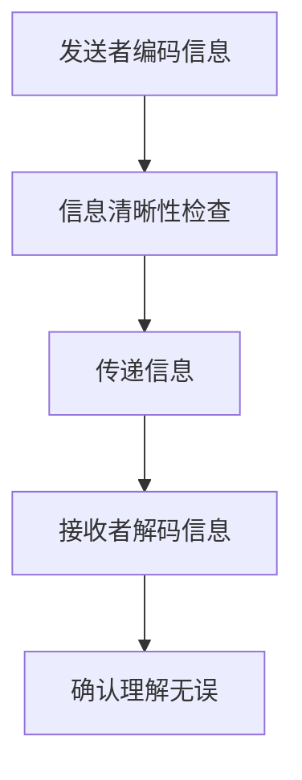

**伪代码**：

```python
def send_clear_message(message):
    # 清晰性检查
    clear_message = simplify_message(message)
    
    # 传递信息
    send_message(clear_message)
    
    # 确认理解无误
    confirmation = get_feedback(clear_message)
    if confirmation == "understood":
        return True
    else:
        return False
```

#### 1.2.2 简洁性

**简洁性**是有效沟通的另一个重要要素。它要求信息在传递过程中简洁明了，避免冗余和无关内容。简洁的沟通可以提高效率，减少误解。

**核心概念与联系**：

- **信息筛选**：在传递信息前，领导者需要筛选出关键信息，去除冗余内容。
- **简洁的表达**：领导者需要学会用最简洁的方式表达复杂信息。

**流程图**：

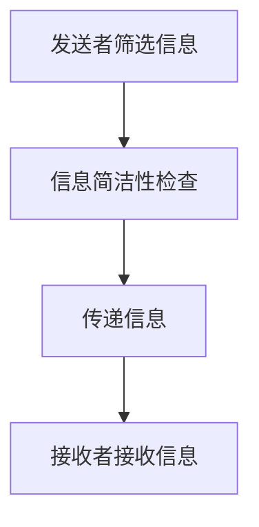

**伪代码**：

```python
def send_concise_message(message):
    # 筛选关键信息
    key_messages = filter_key_messages(message)
    
    # 传递简洁信息
    send_message(key_messages)
    
    return True
```

#### 1.2.3 明确性

**明确性**是指信息在传递过程中，接收者能够准确理解发送者的意图。为了提高沟通的明确性，领导者需要做到以下几点：

- **使用具体的例子**：在解释抽象概念时，使用具体的例子或情境，帮助接收者更好地理解。
- **确认理解**：在沟通后，领导者需要确认接收者是否理解了信息。

**核心概念与联系**：

- **信息解码**：接收者需要正确解码信息，理解其含义。
- **反馈机制**：通过反馈确认信息是否被正确理解。

**流程图**：

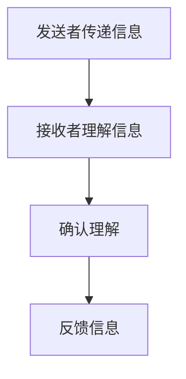

**伪代码**：

```python
def send_clear_and_concise_message(message):
    # 使用例子解释
    example_message = add_example_to_message(message)
    
    # 传递信息
    send_message(example_message)
    
    # 确认理解
    confirmation = get_feedback(example_message)
    if confirmation == "understood":
        return True
    else:
        return False
```

#### 1.2.4 倾听

**倾听**是有效沟通的重要组成部分。它不仅仅是听，更重要的是理解和感知。倾听可以建立信任，促进理解和合作。

**核心概念与联系**：

- **情感倾听**：领导者需要倾听对方的情感和需求，建立情感连接。
- **批判性倾听**：领导者需要批判性地分析信息，确保理解其真实含义。

**流程图**：

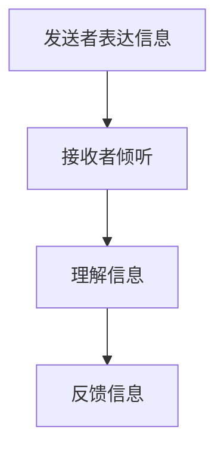

**伪代码**：

```python
def listen_and_understand(message):
    # 倾听信息
    understood_message = emotional_listening(message)
    
    # 反馈理解
    feedback = confirm_understanding(understood_message)
    return feedback
```

通过以上四个要素，领导者可以构建起有效沟通的框架，确保信息在传递过程中的准确性和效率。在下一部分，我们将探讨领导者如何提升沟通技能，以实现更高效的团队协作和领导。

---

#### 2.1 情绪管理

情绪管理是领导者提升沟通技能的关键环节。情绪不仅影响个人的决策和表现，也直接影响团队的氛围和合作效率。一个能够有效管理情绪的领导者，能够在面对压力和挑战时保持冷静和理性，从而更好地传递信息、解决问题和激励团队。

**情绪管理的重要性**：

- **减少冲突**：情绪失控会导致沟通障碍和冲突加剧，有效管理情绪可以缓解紧张关系，促进和谐团队。
- **增强决策能力**：情绪稳定有助于领导者更加客观、理性地分析问题，做出更好的决策。
- **提升沟通效果**：情绪化的沟通往往难以被接收者理解和接受，情绪管理有助于领导者传递清晰、准确的信息。

**如何管理情绪**：

1. **认识情绪**：首先，领导者需要了解自己的情绪，认识到情绪的变化和触发因素。通过自我反思和情绪记录，领导者可以更好地掌握自己的情绪状态。

2. **情绪调节**：在情绪波动时，领导者可以采取以下方法进行调节：

   - **深呼吸**：深呼吸有助于缓解紧张和焦虑，使领导者冷静下来。
   - **分散注意力**：通过转移注意力，如散步或做一些轻松的活动，可以暂时缓解负面情绪。
   - **积极思考**：用积极的态度和思维方式来调整情绪，避免过度消极。

3. **保持理性**：在情绪管理中，领导者需要保持理性，避免情绪化的决策和沟通。通过逻辑思考和客观分析，领导者可以更好地处理问题。

**情绪感染力**：

情绪具有感染力，领导者的情绪状态会直接影响团队成员的情绪和行为。因此，领导者需要意识到自己的情绪表达，并通过以下方式提升情绪感染力：

- **积极的情绪表达**：领导者应尽量表现出积极、正面的情绪，如自信、乐观和热情，以激励团队成员。
- **同理心**：领导者需要同理团队成员的感受，关注他们的情绪需求，建立情感连接。
- **情绪传染**：领导者通过积极的情绪表达和行为，可以传递正能量，提升团队的士气和工作动力。

**核心概念与联系**：

情绪管理不仅涉及个人的情绪调节，还包括情绪在团队中的传递和影响。通过有效的情绪管理，领导者可以构建积极、和谐的团队氛围，提高沟通效率和团队绩效。

**流程图**：

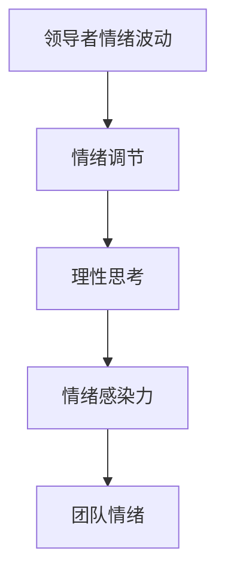

**伪代码**：

```python
def manage_leaders_emotion():
    # 情绪调节
    emotionRegulation()
    
    # 理性思考
    rationalThinking()
    
    # 情绪感染力
    positiveInfluence()
    
    return "情绪管理成功"
```

通过有效的情绪管理，领导者不仅可以提升自己的沟通技能，还能为团队创造一个积极、和谐的工作环境，从而实现更高的团队绩效。

---

#### 2.2 非语言沟通

非语言沟通是有效沟通的重要组成部分，它通过身体语言、面部表情、语调和其他非语言信号，传递信息和情感。在领导者沟通中，非语言沟通不仅能够补充和强化语言信息，还能在无声中传递领导者的意图和态度。

**非语言沟通的特点**：

1. **直观性**：非语言沟通不受语言障碍的限制，可以直接传达情感和意图，特别适用于多元文化背景下的沟通。
2. **丰富性**：非语言信号可以表达出语言难以传达的情感、态度和意图，丰富沟通的层次和深度。
3. **持续性**：非语言信号在沟通中具有持续性，可以长时间影响沟通效果，甚至超过语言本身。
4. **文化差异性**：不同文化背景下的非语言信号可能存在差异，领导者需要具备跨文化的非语言沟通能力。

**非语言沟通的类型**：

1. **身体语言**：包括站姿、手势、眼神接触、面部表情等。例如，自信的站姿和坚定的眼神可以传达领导者的决心和信心。
2. **语调**：包括语速、音量、语调和音调等。例如，平稳的语调可以传达冷静和自信，而快速的语调可能传达紧张和焦虑。
3. **视觉信号**：包括肢体动作、服装和装饰等。例如，得体的服装可以提升领导者的形象和权威性。

**非语言沟通的解读与应用**：

1. **身体语言的解读与应用**：

   - **肢体动作**：领导者可以通过积极的肢体动作，如点头、拍手和手势，来鼓励团队成员，提升团队的士气。
   - **眼神接触**：适当的眼神接触可以传达领导者的关注和理解，建立信任和亲密感。
   - **面部表情**：领导者通过面部表情，如微笑、皱眉和严肃，可以表达情感和态度，影响团队成员的情绪和行为。

2. **语调的解读与应用**：

   - **语速**：适中的语速有助于提高沟通的清晰度和理解度，过快或过慢的语速可能引起误解或疲劳。
   - **音量**：适当的音量可以确保信息的传达，避免声音过高引起不适或过低导致误解。
   - **语调**：变化的语调可以增强表达的力度和情感，使信息更加生动和有吸引力。

3. **视觉信号的解读与应用**：

   - **服装和装饰**：得体的服装可以提升领导者的形象和专业性，增强团队对领导的尊重和信任。
   - **办公环境**：整洁、有序的办公环境可以传达领导者的高效和管理能力，提升团队的工作效率。

**核心概念与联系**：

非语言沟通与语言沟通相辅相成，共同构成完整的信息传递过程。领导者需要意识到非语言信号的重要性，并在沟通中合理运用，以提升整体沟通效果。

**流程图**：

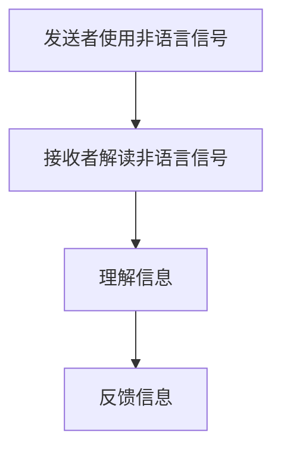

**伪代码**：

```python
def use_nonverbal_communication(signal):
    # 使用身体语言
    body_language = set_body_language(signal)
    
    # 使用语调
    tone = set_tone(signal)
    
    # 使用视觉信号
    visual_signals = set_visual_signals(signal)
    
    # 解读非语言信号
    feedback = interpret_nonverbal_signals(body_language, tone, visual_signals)
    
    return feedback
```

通过掌握和运用非语言沟通，领导者可以提升沟通的深度和广度，建立更加信任和高效的团队关系，从而实现更好的领导效果。

---

#### 2.3 听说读写沟通技能提升

在领导者的沟通技能中，听说读写是基本而关键的组成部分。提升这些技能不仅有助于领导者更加有效地传递信息，还能增强团队的协作和理解能力。

**2.3.1 听说读写技能的概述**

- **听**：倾听是领导者获取信息、理解他人观点的重要手段。倾听不仅包括听到声音，更包括理解说话者的意图和情感。
- **说**：口语表达是领导者与团队沟通的主要方式。清晰、简洁、有逻辑的表达能够有效传达领导者的意图和愿景。
- **读**：阅读是领导者获取知识和信息的重要途径。快速、准确地阅读文档和报告，有助于领导者做出及时、明智的决策。
- **写**：书面沟通是领导者传达复杂信息和政策文件的重要方式。书面沟通要求准确、严谨，以确保信息传达无误。

**2.3.2 倾听的技巧**

- **主动倾听**：领导者应专注于说话者，避免分心。通过点头、回应和眼神接触等方式，表明自己正在倾听。
- **提问**：通过提问，领导者可以确认自己的理解是否正确，同时鼓励说话者继续表达。
- **同理心**：领导者应设身处地，理解说话者的情感和需求，以建立信任和共鸣。

**2.3.3 口语表达的技巧**

- **清晰性**：使用简洁明了的语言，避免复杂的术语和模糊的表述。
- **逻辑性**：按照逻辑顺序表达观点，确保信息传达的连贯性和一致性。
- **情感性**：适当使用情感性的语言和语调，以增强说服力和感染力。

**2.3.4 书面沟通的技巧**

- **准确性**：确保信息准确无误，避免歧义和误解。
- **简洁性**：避免冗长和复杂的句子，使用简单的语言和结构。
- **格式**：遵循适当的格式和风格，如使用标题、段落和列表，提高文档的可读性。

**核心概念与联系**：

- **信息传递**：听说读写技能共同构成信息传递的完整过程。倾听是获取信息的前提，口语表达和书面沟通是传递信息的主要手段。
- **沟通效率**：提升听说读写技能，可以显著提高沟通效率，减少误解和错误。

**流程图**：

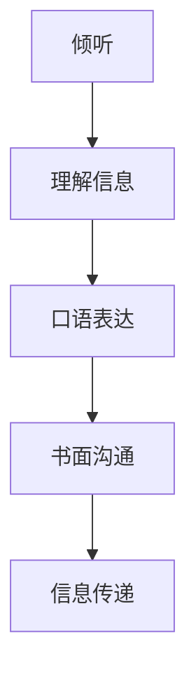

**伪代码**：

```python
def improve_communication_skills(listening, speaking, reading, writing):
    # 倾听技巧
    active_listening = activate_listening技巧(listening)
    
    # 口语表达技巧
    clear_speaking = apply_clear_speaking(speaking)
    
    # 阅读技巧
    efficient_reading = enhance_reading效率(reading)
    
    # 书面沟通技巧
    accurate_writing = improve_writing准确性(writing)
    
    # 信息传递
    transmitted_info = communicate_info(active_listening, clear_speaking, efficient_reading, accurate_writing)
    
    return transmitted_info
```

通过不断提升听说读写技能，领导者可以更加高效、准确地传递信息，建立更加信任和高效的团队关系，从而实现更好的领导效果。

---

#### 2.4 提升沟通效果的方法

**2.4.1 设置明确的目标**

为了提升沟通效果，领导者首先需要明确沟通的目标。设定明确的目标有助于确保沟通的针对性，从而提高信息传递的准确性和效率。以下是一些步骤和建议：

1. **明确沟通目标**：在每次沟通前，领导者应明确沟通的目标，如传达信息、解决问题、达成共识等。
2. **分解目标**：将大目标分解为具体的子目标，有助于在沟通过程中保持焦点和效率。
3. **设定优先级**：根据重要性和紧急性，设定沟通目标的优先级，确保关键信息得到优先传达。

**2.4.2 使用合适的信息传递渠道**

选择合适的信息传递渠道对于提升沟通效果至关重要。以下是一些常见的信息传递渠道及其特点：

- **面对面交流**：适用于需要即时反馈和深入讨论的场景，如会议、访谈和团队建设活动。
- **电话和视频会议**：适用于远程沟通和需要实时互动的场景，如跨部门协作和国际会议。
- **电子邮件和即时通讯**：适用于传达重要但不紧急的信息，如政策更新、报告和文件共享。
- **公告板和内部网站**：适用于发布公共信息和政策，如公司公告、新闻稿和内部新闻。

**2.4.3 应对冲突的策略**

冲突在沟通中是不可避免的，但领导者需要学会如何应对和解决冲突，以维护团队和谐和提高沟通效果。以下是一些应对冲突的策略：

1. **保持冷静和理性**：在冲突发生时，领导者应保持冷静和理性，避免情绪化的回应。
2. **倾听和理解**：领导者需要倾听各方意见，理解冲突的根源和各方的需求。
3. **寻求共同点**：在冲突中，寻找各方的共同点和利益，通过协商和妥协找到解决问题的方案。
4. **建立沟通渠道**：为冲突双方提供开放的沟通渠道，鼓励双方表达观点和感受，以达成共识。

**2.4.4 反馈与调整**

有效的反馈机制是提升沟通效果的重要手段。以下是一些反馈与调整的方法：

1. **即时反馈**：在沟通结束后，及时给予反馈，确认信息是否被正确理解和接收。
2. **定期回顾**：定期回顾沟通效果，分析成功和失败的原因，总结经验教训。
3. **持续改进**：根据反馈结果，不断调整沟通策略和方法，以提高沟通效果。
4. **培训与学习**：鼓励团队成员参与沟通技巧培训，提升整体沟通能力。

**核心概念与联系**：

- **目标设定**：明确沟通目标是确保信息传递准确和高效的关键。
- **信息传递渠道**：选择合适的信息传递渠道可以优化沟通效果，提高信息传递的速度和覆盖面。
- **冲突应对**：有效的冲突应对策略有助于维护团队和谐，提升沟通效果。
- **反馈与调整**：通过反馈与调整，可以持续改进沟通策略，提高沟通的整体效果。

**流程图**：

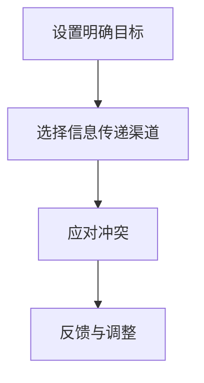

**伪代码**：

```python
def improve_communication_effectiveness(goal, channel, conflict_strategy, feedback):
    # 设置明确目标
    set_clear_goal(goal)
    
    # 选择信息传递渠道
    select_communication_channel(channel)
    
    # 应对冲突
    handle_conflict(conflict_strategy)
    
    # 反馈与调整
    provide_feedback(feedback)
    adjust_communication()
    
    return "沟通效果提升"
```

通过以上方法，领导者可以显著提升沟通效果，增强团队协作和整体绩效。

---

### 第三部分：特定场景下的沟通策略

#### 3.1 团队沟通

团队沟通是领导者日常工作中不可或缺的一部分。有效的团队沟通可以促进团队成员之间的理解、合作和共同进步。以下是一些在团队沟通中需要注意的要素和策略。

**3.1.1 团队沟通的重要性**

团队沟通的重要性体现在以下几个方面：

- **提高团队效率**：通过有效的沟通，团队成员可以明确各自的任务和目标，减少误解和重复工作，提高工作效率。
- **增强团队凝聚力**：良好的沟通有助于建立团队成员之间的信任和尊重，增强团队的凝聚力。
- **促进创新和协作**：团队沟通可以激发团队成员的创意，促进知识共享和协作，推动创新和发展。

**3.1.2 团队沟通的障碍**

尽管团队沟通对于团队绩效至关重要，但实际操作中常常会遇到以下障碍：

- **信息不对称**：团队成员之间可能存在信息差异，导致沟通不畅。
- **角色冲突**：团队成员在职责和目标上可能存在冲突，影响沟通效果。
- **文化差异**：在多元文化团队中，文化差异可能成为沟通的障碍。
- **时间管理**：团队会议和沟通活动往往时间紧张，导致沟通效率不高。

**3.1.3 提升团队沟通效率的策略**

为了克服团队沟通的障碍，提高沟通效率，领导者可以采取以下策略：

1. **建立明确的沟通目标**：在每次团队沟通前，明确沟通的目标和议程，确保团队成员对沟通内容有清晰的认识。
2. **使用多样化的沟通渠道**：根据沟通内容和需求，选择合适的沟通渠道，如面对面会议、电子邮件、即时通讯工具等。
3. **培养倾听和反馈文化**：鼓励团队成员倾听他人的意见，提供反馈，建立开放和包容的沟通氛围。
4. **加强跨部门协作**：通过跨部门会议和协作活动，促进不同部门之间的信息共享和协作。
5. **提供沟通培训**：定期为团队成员提供沟通技巧培训，提升整体沟通能力。

**核心概念与联系**：

团队沟通不仅涉及信息的传递，还包括角色协调、文化融合和协作效率的提升。通过有效的团队沟通策略，领导者可以建立高效、和谐的团队环境，推动团队目标的实现。

**流程图**：

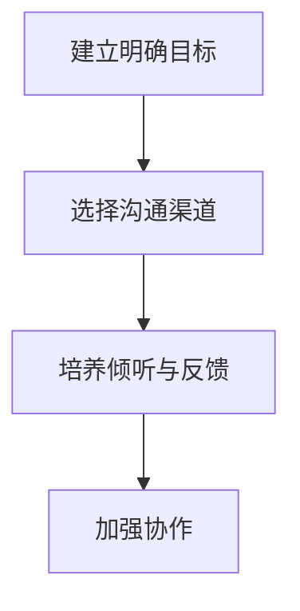

**伪代码**：

```python
def improve_team_communication(goal, channels, listening, collaboration):
    # 建立明确目标
    set_clear_communication_goal(goal)
    
    # 选择沟通渠道
    select_channels(channels)
    
    # 培养倾听与反馈
    foster_listening_and_feedback(listening)
    
    # 加强协作
    enhance_collaboration(collaboration)
    
    return "团队沟通效率提升"
```

通过有效的团队沟通策略，领导者可以促进团队成员之间的理解和合作，提高团队的整体绩效。

---

#### 3.2 内部沟通

内部沟通是组织内部信息传递和交流的重要手段，它直接影响到组织的运营效率和员工的工作体验。有效的内部沟通能够确保信息准确传递，促进团队协作，提升整体业绩。

**3.2.1 内部沟通的目的与类型**

内部沟通的主要目的是确保组织内部的各个部门和员工能够及时、准确地获取和共享信息，从而提高工作效率和决策质量。内部沟通的类型主要包括：

- **正式沟通**：通过正式渠道进行的沟通，如公司内部邮件、公告板、内部报告等。
- **非正式沟通**：通过非正式渠道进行的沟通，如团队会议、社交活动、即时通讯等。
- **向上沟通**：员工向上级汇报工作进展、提出建议或反馈。
- **向下沟通**：上级向下级传达指令、分配任务、分享公司政策等。
- **水平沟通**：同一层级员工之间的沟通，如部门之间的协作和信息共享。

**3.2.2 内部沟通的挑战与对策**

尽管内部沟通对于组织的运作至关重要，但在实际操作中常常面临以下挑战：

1. **信息过载**：随着信息量的增加，员工可能感到信息过载，难以消化和处理。
2. **沟通障碍**：不同部门、层级和员工之间的沟通障碍可能导致信息传递不畅。
3. **文化差异**：在多元文化组织中，文化差异可能影响沟通效果，导致误解和冲突。
4. **反馈机制不足**：缺乏有效的反馈机制可能导致信息传达不到位，影响决策质量和执行力。

为了应对这些挑战，组织可以采取以下对策：

- **简化沟通流程**：简化内部沟通流程，确保信息传递的简洁和高效。
- **建立沟通平台**：建立统一的内部沟通平台，如内部网站、即时通讯工具等，方便员工获取和共享信息。
- **加强培训**：定期为员工提供沟通技巧培训，提升整体沟通能力。
- **鼓励开放沟通**：建立开放的沟通文化，鼓励员工提出问题、分享意见和建议。
- **定期反馈**：建立定期的反馈机制，确保信息传达的准确性和及时性。

**3.2.3 内部沟通的优化策略**

为了提升内部沟通效果，组织可以采取以下优化策略：

1. **明确沟通目标**：每次沟通前，明确沟通的目标和预期成果，确保沟通的针对性和有效性。
2. **优化沟通渠道**：根据沟通内容和需求，选择合适的沟通渠道，如面对面会议、电子邮件、内部社交平台等。
3. **加强沟通监督**：建立沟通监督机制，确保信息传达的准确性和及时性，及时发现和解决问题。
4. **促进跨部门协作**：通过跨部门沟通和协作活动，促进不同部门之间的信息共享和协作。
5. **利用技术手段**：利用现代信息技术，如人工智能、大数据等，提升沟通效率和效果。

**核心概念与联系**：

内部沟通是组织内部信息传递和交流的重要环节，它直接影响到组织的运营效率和员工的工作体验。通过优化内部沟通策略，组织可以提升信息传递的准确性和效率，增强团队协作和整体绩效。

**流程图**：

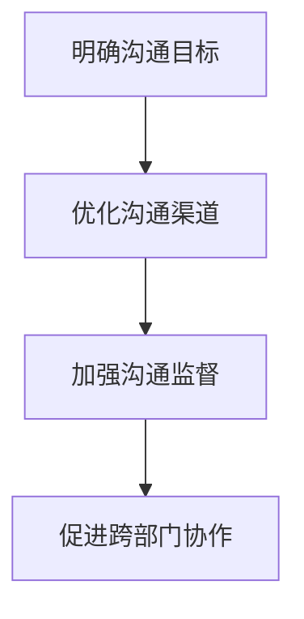

**伪代码**：

```python
def optimize_internal_communication(goal, channels, supervision, collaboration):
    # 明确沟通目标
    set_clear_communication_goal(goal)
    
    # 优化沟通渠道
    optimize_communication_channels(channels)
    
    # 加强沟通监督
    strengthen_communication_supervision(supervision)
    
    # 促进跨部门协作
    encourage_interdepartmental_collaboration(collaboration)
    
    return "内部沟通效果提升"
```

通过优化内部沟通策略，组织可以建立一个高效、透明和协作的沟通环境，从而提升整体运营效率和员工满意度。

---

#### 3.3 外部沟通

外部沟通是企业与外部利益相关者之间的信息传递和交流过程，包括客户、供应商、合作伙伴、监管机构等。有效的外部沟通对于企业的品牌形象、市场拓展和业务发展具有重要意义。

**3.3.1 外部沟通的作用与原则**

外部沟通的作用主要体现在以下几个方面：

- **品牌建设**：通过有效的沟通，企业可以塑造良好的品牌形象，提升品牌知名度和美誉度。
- **客户关系管理**：与客户保持良好的沟通，可以增进客户对企业的了解和信任，促进销售和客户忠诚度。
- **供应链管理**：与供应商和合作伙伴的沟通有助于优化供应链流程，提高供应链效率和协同性。
- **合规管理**：与监管机构的沟通可以确保企业合规运营，避免法律风险和罚款。

外部沟通应遵循以下原则：

- **透明性**：确保沟通信息的透明度，避免误导或隐瞒重要信息。
- **诚信**：在沟通中保持诚信，诚实面对问题和挑战。
- **及时性**：及时回应外部利益相关者的需求和关注，避免延误和误解。
- **适应性**：根据不同外部利益相关者的特点和需求，采取适当的沟通策略和渠道。

**3.3.2 外部沟通的渠道与方法**

外部沟通的渠道和方法多种多样，企业可以根据具体需求和情况选择合适的渠道。以下是一些常见的外部沟通渠道和方法：

- **社交媒体**：利用社交媒体平台，如微信、微博、Facebook、LinkedIn等，与客户、合作伙伴和公众进行实时互动。
- **电子邮件**：通过电子邮件发送新闻稿、产品介绍、客户告知等正式信息。
- **新闻发布会**：通过新闻发布会，向媒体和公众传达企业的最新动态和重要信息。
- **客户服务热线**：提供客户服务热线，解答客户疑问，提供售后支持。
- **合作论坛和展会**：参加行业论坛和展会，与合作伙伴和客户面对面交流，建立合作关系。
- **市场调研**：通过问卷调查、访谈等方式，了解客户需求和反馈，优化产品和服务。

**3.3.3 外部沟通的风险与管理**

外部沟通过程中，企业可能会面临以下风险：

- **信息泄露**：重要信息泄露可能导致竞争优势丧失或声誉受损。
- **误解和冲突**：沟通不当可能导致误解和冲突，影响客户关系和业务合作。
- **法律风险**：在沟通中，企业需要遵守相关法律法规，避免法律纠纷和罚款。

为了有效管理外部沟通风险，企业可以采取以下措施：

- **建立沟通规范**：制定明确的沟通规范和流程，确保沟通信息的准确性和一致性。
- **加强信息保护**：对重要信息进行加密和保护，防止信息泄露。
- **培训员工**：为员工提供沟通技巧和风险管理的培训，提高员工的沟通能力和风险意识。
- **建立反馈机制**：建立有效的反馈机制，及时收集和回应外部利益相关者的意见和建议。
- **合规审查**：定期对沟通内容进行合规审查，确保沟通符合相关法律法规要求。

**核心概念与联系**：

外部沟通是企业与外部利益相关者之间信息传递和交流的重要环节，它直接影响企业的品牌形象、客户关系和市场拓展。通过遵循外部沟通的原则和方法，并有效管理外部沟通风险，企业可以建立良好、稳定的外部关系，促进业务发展。

**流程图**：

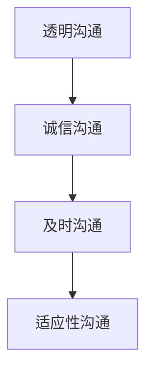

**伪代码**：

```python
def manage_external_communication(transparent, honest, timely, adaptive):
    # 确保透明沟通
    ensure_transparency(transparent)
    
    # 确保诚信沟通
    ensure_honesty(honest)
    
    # 确保及时沟通
    ensure_timeliness(timely)
    
    # 确保适应性沟通
    ensure_adaptability(adaptive)
    
    return "外部沟通风险降低"
```

通过有效的外部沟通管理，企业可以建立良好的外部关系，提升品牌形象和市场竞争力。

---

#### 4.1 成功的沟通案例

**4.1.1 案例一：苹果公司的沟通策略**

苹果公司作为全球知名的科技企业，以其卓越的沟通策略和品牌形象著称。以下是其成功沟通案例的几个方面：

1. **品牌一致性**：苹果公司在所有沟通渠道上保持品牌一致性，从产品发布会到社交媒体，苹果始终传达其创新、简洁和优雅的品牌形象。
2. **用户参与**：苹果公司注重用户参与，通过用户社区、反馈机制和用户调研，确保产品和服务满足用户需求，同时增强用户对品牌的忠诚度。
3. **透明沟通**：在产品召回、技术更新等重要事项上，苹果公司始终保持透明沟通，及时向公众披露信息，减少误解和信任危机。

**案例效果**：苹果公司的沟通策略有效地提升了品牌知名度，增强了用户忠诚度，促进了产品销售和市场拓展。

**4.1.2 案例二：谷歌团队的沟通模式**

谷歌公司以其开放、创新的企业文化著称，其沟通模式为其他企业提供了借鉴。以下是其成功沟通模式的几个方面：

1. **开放沟通**：谷歌鼓励员工自由表达意见，提供多种沟通渠道，如内部论坛、邮件、面对面交流等，确保信息畅通无阻。
2. **跨部门协作**：谷歌通过跨部门项目和团队，促进不同部门之间的信息共享和协作，提高整体工作效率。
3. **员工培训**：谷歌定期为员工提供沟通技巧和领导力培训，提升员工的整体沟通能力。

**案例效果**：谷歌的沟通模式有效地促进了团队协作和创新，提高了员工满意度和工作效率，推动了公司持续发展。

**4.1.3 案例三：特斯拉的企业文化沟通**

特斯拉公司以其独特的企业文化闻名，其沟通策略在激励员工和提升工作效率方面取得了显著成效。以下是其成功沟通策略的几个方面：

1. **愿景传递**：特斯拉通过定期会议和内部邮件，向员工传达公司的愿景和目标，激发员工的使命感和归属感。
2. **开放反馈**：特斯拉鼓励员工对公司的政策和决策提出反馈，通过开放反馈机制，不断改进和优化工作流程。
3. **员工参与**：特斯拉在产品开发和业务决策中广泛征求员工意见，增强员工的参与感和责任感。

**案例效果**：特斯拉的沟通策略有效地提升了员工的工作动力和创新能力，推动了公司快速发展和技术突破。

通过以上成功案例，我们可以看到，有效的沟通策略对于企业的发展具有重要作用。无论是在品牌建设、团队协作，还是激励员工方面，成功的沟通都能为企业带来显著的优势和成果。

---

#### 4.2 失败的沟通案例分析

**4.2.1 案例一：福特汽车的沟通失误**

福特汽车公司在20世纪80年代经历了一次重大的沟通失败，导致了公司在市场上的严重衰退。以下是这次失败沟通的几个方面：

1. **缺乏内部沟通**：福特公司在内部缺乏有效的沟通渠道，导致各部门之间的信息不对称，决策滞后。
2. **产品开发失误**：福特公司在产品开发过程中，未能充分了解市场需求和消费者偏好，导致产品不符合市场预期。
3. **对外沟通不当**：福特公司对外宣传时，未能准确传达产品的优势和特点，导致消费者对产品的误解和失望。

**案例结果**：福特汽车的沟通失误导致了产品销售不佳，市场份额大幅下降，公司陷入财务困境。

**4.2.2 案例二：泰坦尼克号的沟通障碍**

泰坦尼克号沉船事件是历史上最著名的灾难之一，其沟通障碍在灾难中起到了关键作用。以下是这次灾难的几个沟通方面：

1. **信息传递延误**：泰坦尼克号在遭遇冰山时，未能及时向船员和乘客传达危险信息，导致紧急疏散延迟。
2. **指挥混乱**：船长和船员之间的沟通不畅，导致救援行动混乱无序。
3. **对外沟通不足**：泰坦尼克号未能及时与外界沟通，请求救援，错过了最佳救援时机。

**案例结果**：泰坦尼克号的沟通障碍导致了大量人员伤亡，成为历史上最严重的海难之一。

**4.2.3 案例三：诺基亚的沟通困境**

诺基亚曾是全球领先的手机制造商，但在21世纪初期，其沟通困境导致了公司市场份额的急剧下滑。以下是诺基亚沟通困境的几个方面：

1. **内部创新不足**：诺基亚在内部沟通中，未能充分激发员工的创新思维，导致产品缺乏竞争力。
2. **市场变化应对不当**：诺基亚在市场变化中，未能及时调整战略和产品，导致市场份额被竞争对手抢占。
3. **对外沟通缺乏创新**：诺基亚在对外沟通中，未能及时传达公司的转型和创新举措，导致品牌形象受损。

**案例结果**：诺基亚的沟通困境导致了公司在智能手机市场中的失败，最终被微软收购。

通过以上失败案例，我们可以看到，沟通失误或障碍会对企业带来严重的负面影响，甚至导致企业的衰败。因此，有效的沟通策略对于企业的发展至关重要。

---

### 第五部分：持续提升沟通能力

#### 5.1 沟通能力的自我评估

自我评估是提升沟通能力的重要步骤。通过定期评估自己的沟通能力，领导者可以了解自己的优点和不足，有针对性地进行改进。

**5.1.1 自我评估的工具与方法**

以下是几种常用的自我评估工具和方法：

1. **行为观察法**：通过观察自己在日常沟通中的行为和表现，识别自己的优点和不足。
2. **360度反馈**：收集来自同事、下属和上级的反馈，从多个角度了解自己的沟通表现。
3. **沟通能力评估量表**：使用专业的沟通能力评估量表，如“沟通能力自我评估表”，量化自己的沟通能力。
4. **模拟训练**：通过模拟实际沟通场景，进行实践训练，评估自己的沟通效果。

**5.1.2 自我提升的目标设定**

在自我评估的基础上，领导者应设定具体的提升目标。以下是一些设定目标的方法：

1. **明确目标**：设定具体的、可衡量的提升目标，如提高口头表达能力、增强倾听技巧等。
2. **制定计划**：根据目标，制定详细的提升计划，包括学习资源、培训课程和实际练习。
3. **设定时间表**：为提升计划设定明确的时间表，确保目标的实现。

#### 5.2 沟通技能的持续提升

持续提升沟通能力需要长期的努力和实践。以下是一些有效的方法：

**5.2.1 学习资源推荐**

1. **书籍**：推荐一些经典的沟通技巧书籍，如《非暴力沟通》、《沟通的艺术》等。
2. **在线课程**：利用在线平台，如Coursera、Udemy等，参加专业的沟通技能培训课程。
3. **研讨会和讲座**：参加相关的研讨会和讲座，学习行业最佳实践和最新趋势。

**5.2.2 沟通技能的练习方法**

1. **模拟训练**：通过模拟实际沟通场景，进行实践训练，提高沟通实战能力。
2. **角色扮演**：与他人进行角色扮演，练习不同的沟通场景和策略。
3. **反思与总结**：每次沟通后，进行反思和总结，识别成功和失败的原因，持续改进。

**5.2.3 培养良好的沟通习惯**

1. **倾听**：培养良好的倾听习惯，确保在沟通中真正理解对方的意思。
2. **明确表达**：练习清晰、简洁地表达自己的观点和需求。
3. **积极反馈**：鼓励团队成员提供积极的反馈，建立开放、包容的沟通氛围。

通过自我评估和持续的技能提升，领导者可以不断提升自己的沟通能力，实现更高效、更和谐的团队协作和领导。

---

### 总结与展望

有效沟通是领导者不可或缺的核心技能。通过本文的探讨，我们明确了沟通的定义与重要性，详细分析了沟通的四个核心要素（清晰性、简洁性、明确性和倾听），以及情绪管理、非语言沟通和听说读写技能的提升方法。此外，我们还探讨了特定场景下的沟通策略，如团队沟通、内部沟通和外部沟通，并通过成功和失败的案例分析，总结了最佳实践和教训。

**核心结论**：

- **沟通是领导力的核心**：有效的沟通不仅有助于信息传递，还能提升团队协作和整体绩效。
- **清晰的沟通是基础**：通过明确目标、使用简洁语言和具体例子，领导者可以确保信息的准确传递。
- **倾听是关键**：领导者需要倾听他人意见，理解情感和需求，建立信任和共鸣。
- **情绪管理至关重要**：领导者需要保持情绪稳定，通过理性思考和积极情绪表达，提升沟通效果。
- **非语言沟通不可忽视**：身体语言、面部表情和语调等非语言信号在沟通中具有重要作用。

**未来展望**：

随着科技的发展和社会的进步，沟通形式和渠道也在不断变化。领导者需要不断学习和适应新的沟通方式，如数字沟通工具和跨文化沟通策略。未来，我们可以期待更多基于人工智能和大数据的沟通分析工具，帮助领导者更精准、高效地提升沟通能力。

**最佳实践**：

- **定期自我评估**：领导者应定期进行沟通能力的自我评估，设定具体提升目标。
- **多样化学习资源**：利用书籍、在线课程和研讨会，不断丰富自己的沟通知识和技能。
- **实践与反思**：通过模拟训练、角色扮演和反思总结，将理论知识转化为实际能力。

总之，有效沟通是领导者不可或缺的核心技能。通过持续的学习和实践，领导者可以不断提升沟通能力，为团队和组织创造更大的价值。

---

### 注意事项与拓展阅读

**注意事项**：

1. **文化差异**：在跨文化沟通中，领导者应特别注意语言和行为的适应性，避免文化冲突。
2. **情绪管理**：领导者需在高压环境下保持情绪稳定，避免因情绪波动而影响沟通效果。
3. **持续学习**：沟通技能需要不断更新和提升，领导者应保持学习的态度，关注行业最新动态。

**拓展阅读**：

1. 《非暴力沟通》——马歇尔·卢森堡（Marshall B. Rosenberg）
2. 《沟通的艺术》——罗杰斯（Roger Fisher）和罗恩·内森（Ronald Nelson）
3. 《领导者的语言》——约瑟夫·格里芬（Joseph Gruninger）

通过深入学习和实践，领导者可以不断提升沟通能力，为团队和组织创造更大的价值。希望本文能为您提供有价值的参考和启示。作者：AI天才研究院/AI Genius Institute & 禅与计算机程序设计艺术 /Zen And The Art of Computer Programming

---

**附录：相关术语解释**

1. **沟通（Communication）**：信息在两个或多个个体之间的传递和交换过程。
2. **编码（Encoding）**：发送者将信息转化为可传递的形式。
3. **解码（Decoding）**：接收者解读信息，理解发送者的意图。
4. **倾听（Listening）**：接收者理解发送者信息的过程。
5. **情绪管理（Emotional Management）**：控制和管理自己的情绪，避免情绪对决策和沟通的影响。
6. **非语言沟通（Nonverbal Communication）**：通过身体语言、面部表情、语调等非语言信号传递信息。
7. **情绪感染力（Emotional Contagion）**：情绪在个体之间传递和影响的能力。
8. **团队沟通（Team Communication）**：团队成员之间的信息传递和协作。
9. **内部沟通（Internal Communication）**：组织内部的信息传递和交流。
10. **外部沟通（External Communication）**：组织与外部利益相关者之间的信息传递和交流。

