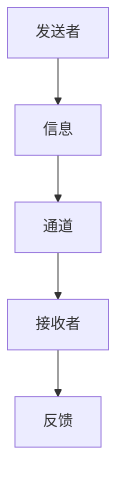
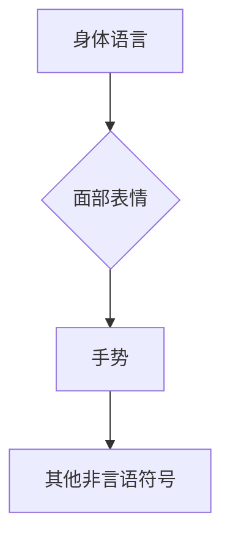
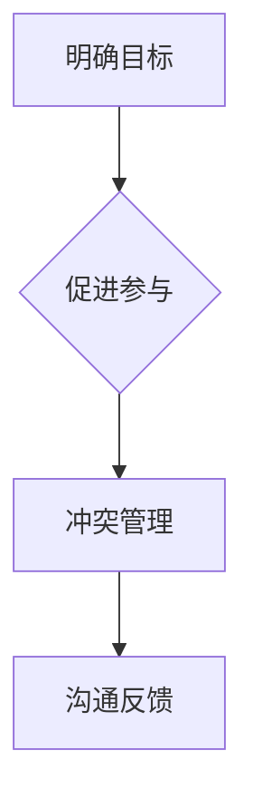

                 

# 有效沟通：领导者的核心技能

> 关键词：沟通，领导者，技能，组织效能

> 摘要：本文深入探讨了有效沟通对于领导者的重要性，分析了沟通的基本原理与技能，以及领导者沟通的特殊要求。文章还涵盖了特定场景下的沟通策略，如演讲技巧、跨文化沟通和冲突解决，并提出了实用的沟通障碍克服方法。通过本文，读者将了解如何通过有效沟通提升领导力，进而提高组织效能。

## 引言

在当今快速变化和高度互联的世界中，沟通成为了一种至关重要的能力。无论是在个人生活中，还是在职场中，沟通都是我们与他人建立联系、传递信息、解决问题和实现目标的重要手段。对于领导者而言，有效沟通更是不可或缺的核心技能。

领导者的角色不仅仅是对团队成员下达指令，更重要的是要激发团队成员的潜力，促进团队协作，以及实现组织的长期目标。在这个过程中，沟通作为领导力的基础，发挥着至关重要的作用。本文将围绕“有效沟通：领导者的核心技能”这一主题，详细探讨沟通的基本原理与技能，以及领导者沟通的特殊要求。我们还将深入分析特定场景下的沟通策略，如演讲技巧、跨文化沟通和冲突解决，并探讨如何克服沟通障碍。

本文的结构如下：

- **第一部分：沟通的基本原理与技能**：介绍沟通的基本概念，包括沟通的类型、基本模型，以及提升沟通技能的方法。
- **第二部分：领导者沟通的特殊要求**：探讨领导者沟通的重要性，以及建立信任、团队沟通等特殊要求。
- **第三部分：特定场景下的沟通策略**：分析演讲技巧、跨文化沟通和冲突解决。
- **第四部分：沟通障碍与冲突解决**：讨论常见的沟通障碍和克服方法。
- **第五部分：附录与参考资料**：提供相关的沟通工具与资源，以及参考文献。

## 第一部分：沟通的基本原理与技能

### 第1章：沟通的本质

沟通是人类社会活动的基本组成部分，它不仅包括语言交流，还涉及非言语交流、书面交流和数字交流等多种形式。沟通的类型可以根据不同的分类标准进行划分。例如，按照沟通的方向，可以分为单向沟通和双向沟通；按照沟通的方式，可以分为口头沟通、书面沟通和数字沟通。

沟通的基本模型包括发送者、信息、通道、接收者和反馈。这一模型展示了信息传递的过程，以及各个环节之间的相互作用。图1展示了这一模型。



### 第2章：沟通技能提升

有效的沟通不仅仅是信息的传递，更是一种技能的提升。以下是几种提升沟通技能的方法：

#### 听说的技巧

倾听是有效沟通的重要组成部分。倾听不仅仅是听到对方说的话，更重要的是理解对方的意图和情感。以下是一些提升倾听技巧的方法：

1. 全神贯注：保持专注，避免分心。
2. 提问：通过提问来确认理解。
3. 非言语反馈：点头、微笑等表示你在倾听。

#### 发问的技巧

提问是沟通中的关键环节，它可以帮助我们更好地理解对方，也可以引导对话的方向。以下是几种发问的技巧：

1. 开放式问题：这些问题通常以“什么”、“为什么”、“如何”开头，能够激发深入的讨论。
2. 封闭式问题：这些问题通常以“是”或“否”为答案，适用于获取具体信息。

#### 清晰表达的技巧

清晰表达是沟通成功的关键。以下是一些建议：

1. 简洁明了：避免使用复杂的词汇和长句子。
2. 结构化表达：将信息组织成有逻辑的结构。
3. 使用例子：通过具体的例子来阐述观点。

#### 有效的反馈技巧

反馈是沟通循环中不可或缺的一部分。以下是几种有效的反馈技巧：

1. 及时反馈：在沟通过程中及时给予反馈。
2. 具体明确：提供具体的信息和反馈，避免模糊不清。
3. 建设性反馈：提供积极的建议和改进方向。

### 第3章：非言语沟通

非言语沟通在整体沟通中占据了重要的地位。它包括身体语言、面部表情、手势等多种形式。以下是一些非言语沟通的要点：

1. **身体语言**：身体语言可以传达很多信息，如姿势、手势和眼神交流。
2. **面部表情**：面部表情是情感表达的重要途径，如微笑、皱眉等。
3. **手势**：手势可以增强语言表达的效果，如挥动手臂表示强调。

图2展示了非言语沟通的多种形式。



### 第一部分小结

本部分介绍了沟通的基本原理与技能，包括沟通的类型、基本模型，以及提升沟通技能的方法。同时，我们也探讨了非言语沟通的重要性。这些内容为理解领导者沟通的特殊要求奠定了基础。

## 第二部分：领导者沟通的特殊要求

### 第4章：领导者沟通的重要性

领导者是组织的核心，其沟通能力直接影响到组织的整体效能。有效沟通能够：

1. **建立信任**：通过沟通，领导者可以建立与团队成员之间的信任关系。
2. **激励员工**：通过有效的沟通，领导者可以激发员工的积极性，提高团队士气。
3. **解决问题**：沟通是解决问题的关键，领导者需要具备高效沟通的能力，以解决团队内部的矛盾和问题。
4. **传递愿景**：领导者需要通过沟通来传递组织的愿景和目标，使团队成员明确方向。

### 第5章：建立信任的沟通

信任是领导者与团队成员之间沟通的基石。以下是一些建立信任的沟通策略：

1. **诚实与透明**：领导者应该保持诚实和透明，避免隐瞒重要信息。
2. **倾听与尊重**：领导者应该倾听团队成员的意见，并给予尊重。
3. **一致性**：领导者的言行应该保持一致，避免产生误解。

### 第6章：团队沟通策略

团队沟通是领导者沟通的核心。以下是一些团队沟通的策略：

1. **明确目标**：在团队沟通中，领导者需要明确团队的目标，使团队成员明确方向。
2. **促进参与**：领导者应该鼓励团队成员参与决策过程，增强团队的凝聚力。
3. **冲突管理**：领导者需要具备有效的冲突管理能力，以解决团队内部的矛盾。

图3展示了团队沟通的核心要素。



### 第二部分小结

本部分探讨了领导者沟通的特殊要求，包括领导者沟通的重要性、建立信任的沟通策略，以及团队沟通的策略。这些内容为领导者提升沟通技能提供了指导。

## 第三部分：特定场景下的沟通策略

### 第7章：演讲技巧

演讲是领导者进行沟通的一种重要方式。以下是一些演讲技巧：

1. **准备充分**：在演讲前，领导者需要充分准备，了解听众的需求和兴趣点。
2. **清晰结构**：演讲应该有一个清晰的结构，包括引言、主体和结论。
3. **互动与参与**：在演讲过程中，领导者应该与听众互动，鼓励他们参与。

### 第8章：跨文化沟通

在全球化背景下，跨文化沟通变得尤为重要。以下是一些跨文化沟通的策略：

1. **了解文化差异**：领导者需要了解不同文化的价值观和行为习惯。
2. **尊重差异**：领导者应该尊重不同文化的差异，避免文化冲突。
3. **适应性沟通**：领导者需要根据不同的文化背景，调整沟通方式和策略。

### 第9章：冲突解决

冲突是组织中不可避免的现象。以下是一些冲突解决的策略：

1. **早期干预**：领导者应该在冲突出现时，及时进行干预，避免冲突升级。
2. **理性对话**：领导者应该通过理性对话，寻求冲突的解决方案。
3. **共同目标**：领导者需要引导团队成员关注共同目标，而不是个人利益。

### 第三部分小结

本部分探讨了特定场景下的沟通策略，包括演讲技巧、跨文化沟通和冲突解决。这些策略对于领导者在不同场景下有效沟通具有重要意义。

## 第四部分：沟通障碍与冲突解决

### 第10章：沟通障碍识别与克服

沟通障碍是有效沟通的障碍。以下是一些常见的沟通障碍和克服方法：

1. **语言障碍**：语言障碍可以通过使用简单明了的语言、避免专业术语和行话来解决。
2. **文化障碍**：文化障碍可以通过了解不同文化的价值观和行为习惯，以及尊重差异来解决。
3. **心理障碍**：心理障碍可以通过倾听、理解和尊重对方的情感和观点来解决。

### 第11章：冲突解决与领导力

冲突解决是领导者的重要职责。以下是一些冲突解决的领导力策略：

1. **冷静分析**：领导者应该在冲突发生时保持冷静，进行理性分析。
2. **有效沟通**：领导者需要通过有效沟通，寻求冲突的解决方案。
3. **调解与协调**：领导者可以扮演调解者的角色，帮助冲突双方找到共同点，达成妥协。

### 第四部分小结

本部分探讨了沟通障碍的识别与克服方法，以及冲突解决的领导力策略。这些内容对于领导者提升沟通效能具有重要意义。

## 第五部分：附录与参考资料

### 附录A：沟通工具与资源

以下是一些常用的沟通工具和资源：

- **项目管理系统**：如Trello、JIRA等。
- **团队协作工具**：如Slack、Microsoft Teams等。
- **文档共享工具**：如Google Docs、Dropbox等。

### 附录B：参考文献

- [Burns, J. M. (1978). Leadership. Harper & Row.]
- [Patton, M. Q. (2002). Qualitative research & evaluation methods (3rd ed.). Sage.]
- [Northouse, G. G. (2018). Leadership: Theory and practice (8th ed.). Sage.]

### 附录C：最佳实践与小结

以下是一些最佳实践和小结：

- **最佳实践**：保持沟通的透明度和诚实性，尊重团队成员的差异性，以及关注共同目标。
- **小结**：有效沟通是领导者提升领导力的关键，它不仅涉及到沟通技能的提升，还包括特定场景下的沟通策略和冲突解决。

### 附录D：注意事项与拓展阅读

- **注意事项**：在沟通时，注意情绪管理，避免过于情绪化；同时，注意文化差异，尊重不同观点。
- **拓展阅读**：对于有兴趣深入了解沟通理论和实践的读者，可以阅读相关经典书籍，如《沟通的艺术》、《影响力》等。

### 第五部分小结

附录部分提供了沟通工具与资源，参考文献，以及最佳实践、小结和注意事项，旨在帮助读者更好地理解和应用有效沟通的理论与实践。

## 结论

有效沟通是领导者的核心技能，它不仅关系到个人的职业发展，更关系到组织的整体效能。通过本文的探讨，我们深入了解了沟通的基本原理与技能，以及领导者沟通的特殊要求。我们还分析了特定场景下的沟通策略，以及沟通障碍与冲突解决的方法。希望本文能够为领导者提供实用的指导，帮助他们提升沟通能力，从而更好地引领组织走向成功。

## 作者信息

作者：AI天才研究院/AI Genius Institute & 禅与计算机程序设计艺术 /Zen And The Art of Computer Programming

感谢读者阅读本文，希望您能够在实践中运用这些沟通技巧，提升自己的领导力，为组织和团队创造更大的价值。如果您有任何疑问或建议，欢迎随时与我们交流。再次感谢您的关注和支持！

## 伪代码与数学模型

在本部分，我们将使用伪代码和数学模型来进一步阐述沟通的核心算法原理。这些伪代码和模型有助于我们理解沟通的内在机制，并在实践中进行优化。

### 伪代码：有效沟通模型

```plaintext
Algorithm: EffectiveCommunicationModel

Input: Sender, Receiver, Message, Context

Output: Feedback

Begin
    1. Sender encodes the Message into a clear and structured format.
    2. Sender transmits the Message through the chosen Channel.
    3. Receiver decodes the Message and provides Feedback.
    4. If Feedback is unclear or incomplete, Sender revises the Message.
    5. Sender and Receiver engage in a Feedback Loop until mutual understanding is achieved.
End
```

### 数学模型：信任度评估

```latex
$$
\text{TrustScore} = \frac{\text{HonestyScore} + \text{TransparencyScore} + \text{RespectScore}}{3}
$$`

在这里，HonestyScore、TransparencyScore和RespectScore分别代表诚实度、透明度和尊重度，信任度分数（TrustScore）是这三个分数的加权平均。通过这个模型，我们可以量化领导者的信任度，并据此改进沟通策略。

### 举例说明

假设在一个团队中，领导者的诚实度得分为90%，透明度得分为85%，尊重度得分为88%，则其信任度分数计算如下：

$$
\text{TrustScore} = \frac{90\% + 85\% + 88\%}{3} = \frac{263\%}{3} \approx 87\%
$$

通过这个例子，我们可以看到，领导者通过提高透明度和尊重度，可以显著提升其信任度。

通过伪代码和数学模型，我们不仅能够更好地理解沟通的原理，还能够将抽象的理论转化为具体的操作指南，从而在实践中更好地应用沟通技巧。

## 项目实战：开发环境搭建

在本部分，我们将详细讲解如何搭建一个用于实践沟通技能的开发环境。这个过程包括安装必要的软件、配置开发工具，以及创建一个基本的沟通应用。

### 开发环境需求

为了搭建一个沟通应用的开发环境，我们需要以下软件和工具：

- 操作系统：Windows、macOS 或 Linux
- 编程语言：Python
- 版本控制工具：Git
- 消息传递库：Flask 或 Django
- 数据库：SQLite 或 MySQL

### 安装和配置

1. **安装操作系统**：选择适合的操作系统进行安装。
2. **安装Python**：从 [Python官方网站](https://www.python.org/downloads/) 下载并安装Python。确保安装过程中选择添加Python到系统环境变量。
3. **安装Git**：从 [Git官方网站](https://git-scm.com/downloads) 下载并安装Git。同样，确保添加Git到系统环境变量。
4. **安装消息传递库**：打开命令行工具，使用pip安装Flask或Django。

```bash
pip install Flask
# 或者
pip install Django
```

5. **安装数据库**：根据操作系统，选择SQLite或MySQL进行安装。SQLite可以直接使用Python内置的sqlite3模块，而MySQL则需要从 [MySQL官方网站](https://www.mysql.com/downloads/) 下载并安装。

### 创建沟通应用

1. **初始化项目**：在命令行中创建一个新的目录，并初始化项目。

```bash
mkdir communication_app
cd communication_app
git init
```

2. **编写代码**：创建一个名为 `app.py` 的文件，并编写基础的Flask应用代码。

```python
# app.py

from flask import Flask, request, render_template

app = Flask(__name__)

@app.route('/', methods=['GET', 'POST'])
def index():
    message = ""
    if request.method == 'POST':
        message = request.form['message']
    return render_template('index.html', message=message)

if __name__ == '__main__':
    app.run(debug=True)
```

3. **创建HTML模板**：在项目目录中创建一个名为 `templates` 的文件夹，并在其中创建 `index.html` 文件。

```html
<!-- templates/index.html -->

<!DOCTYPE html>
<html lang="en">
<head>
    <meta charset="UTF-8">
    <title>沟通应用</title>
</head>
<body>
    <h1>沟通应用</h1>
    <form method="post">
        <textarea name="message" rows="4" cols="50"></textarea>
        <br>
        <input type="submit" value="发送">
    </form>
    
    <div>
        <h2>接收到的信息：</h2>
        <p>{{ message }}</p>
    </div>
    
</body>
</html>
```

4. **运行应用**：在命令行中运行 `app.py`。

```bash
python app.py
```

访问本地服务器的 `http://127.0.0.1:5000/`，即可看到沟通应用的界面。

### 代码解读

在上面的代码中，我们使用Flask创建了一个简单的Web应用。`app.py` 文件定义了一个路由 `/`，这个路由支持GET和POST请求。当用户提交表单时，应用的 `index()` 函数将获取用户输入的信息，并将其显示在页面上。

### 代码应用解读与分析

这个简单的沟通应用展示了如何使用Web技术实现基本的沟通功能。在实际应用中，我们可以扩展这个应用，添加更多功能，如消息存储、用户身份验证、实时消息推送等。

### 实际案例分析和详细讲解剖析

以一个团队协作应用为例，我们可以在这个基础上增加以下功能：

1. **用户身份验证**：使用Flask扩展如Flask-Login，为应用添加用户身份验证功能。
2. **消息存储**：使用SQLite或MySQL数据库存储消息，并添加数据库模型。
3. **实时消息推送**：使用WebSockets实现实时消息推送功能。

通过这些功能，团队可以实时沟通，提高协作效率。

### 项目小结

通过搭建这个沟通应用的开发环境，我们了解了如何使用Python和Flask创建基础的Web应用，并学会了在实际项目中应用这些技能。这个项目不仅帮助我们理解了沟通应用的基本原理，还为我们提供了一个实践的平台，以便我们进一步探索和改进。

## 最佳实践 Tips

为了确保沟通的顺利进行，以下是一些最佳实践的小贴士：

1. **明确沟通目的**：在开始沟通之前，明确沟通的目的和目标，这有助于提高沟通的效率。
2. **提前准备**：准备充分有助于提高沟通的效果，确保所有的关键信息都已整理好。
3. **专注倾听**：倾听是沟通的重要部分，确保你在对方说话时专注于倾听，避免分心。
4. **使用清晰的语言**：使用简单明了的语言，避免使用复杂的术语和行话，以便对方更容易理解。
5. **反馈与确认**：在沟通结束后，给予反馈并进行确认，确保双方对沟通的内容有共同的理解。
6. **尊重差异**：尊重不同的观点和文化背景，避免因差异而产生误解或冲突。
7. **情绪管理**：保持冷静，避免在沟通中情绪化，尤其是在处理敏感或复杂问题时。

通过遵循这些最佳实践，我们可以显著提升沟通的效果，从而更好地实现个人和组织的目标。

## 小结

本文围绕“有效沟通：领导者的核心技能”这一主题，深入探讨了沟通的基本原理与技能，以及领导者沟通的特殊要求。我们分析了特定场景下的沟通策略，如演讲技巧、跨文化沟通和冲突解决，并提出了实用的沟通障碍克服方法。通过本文，读者可以更好地理解沟通在领导力中的重要性，并掌握一系列提升沟通技能的实用技巧。

## 注意事项

1. **持续学习**：沟通是一个持续学习的过程，领导者需要不断学习和实践，以提高沟通技能。
2. **实践应用**：将学到的沟通技巧应用到实际工作中，通过实践来不断改进。
3. **个性化沟通**：不同的团队成员可能有不同的沟通风格，领导者需要根据具体情况调整沟通策略。
4. **反馈与改进**：定期收集团队成员的反馈，根据反馈进行改进，以持续提升沟通效果。

## 拓展阅读

- 《沟通的艺术》（作者：罗纳德·B·阿德勒）
- 《影响力》（作者：罗伯特·西奥迪尼）
- 《团队协作的力量》（作者：费舍尔·J·斯通）

这些书籍提供了丰富的沟通理论和实践指导，有助于进一步深化对沟通技巧的理解和应用。希望读者在阅读本文后，能够积极拓展阅读，不断提升自己的沟通能力。再次感谢您的阅读和支持！

