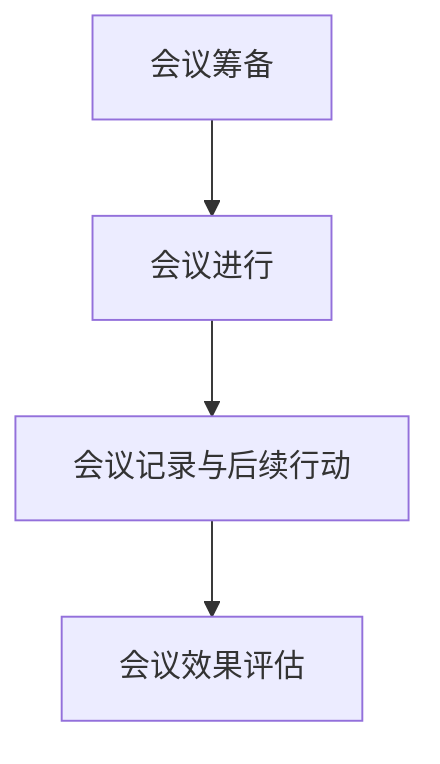

                 

### 文章标题

"有效的团队会议管理技巧：从筹备到评估的全方位指南"

---

关键词：团队会议、会议管理、沟通技巧、冲突管理、效率提升

摘要：本文深入探讨了有效的团队会议管理技巧，从筹备到评估的全过程。通过详细的分析和实用的建议，帮助团队领导者提升会议效率，实现更好的团队协作与沟通。

---

### 引言

在当今快速发展的信息技术时代，团队协作和沟通显得尤为重要。团队会议作为团队沟通的重要方式，其效率直接影响着项目的进度和质量。然而，许多团队在会议管理方面存在诸多问题，如会议筹备不充分、会议过程沟通不畅、会议效果评估不到位等。这些问题不仅浪费了团队成员的时间和精力，还可能影响项目的整体进展。

本文旨在为团队领导者提供一套全面的团队会议管理技巧，从筹备到评估，全方位提升团队会议的效率和质量。通过本文的阅读，您将了解：

1. 团队会议管理的基本概念和重要性。
2. 有效的会议筹备步骤和技巧。
3. 会议过程中的沟通技巧和冲突管理方法。
4. 会议记录与后续行动的跟进策略。
5. 如何评估会议的效果，以及提升会议效果的策略。
6. 团队会议中的工具和技巧。

让我们一步步深入探讨这些关键点，帮助您打造一个高效、协作的团队会议环境。

### 第1章 团队会议管理的基本概念

#### 团队会议的定义

团队会议是指团队成员在一定时间和空间内，围绕特定主题进行的集体讨论和交流。它可以是日常例会、项目进度汇报会、头脑风暴会、决策会议等。团队会议的目的是为了促进团队成员之间的信息共享、讨论问题、达成共识、制定决策和行动计划。

#### 团队会议的目的与类型

团队会议的主要目的包括：

1. **信息共享**：通过会议，团队成员可以及时了解项目进展、市场动态、团队目标等信息。
2. **讨论问题**：团队成员在会议中可以共同探讨项目中的问题和挑战，寻求解决方案。
3. **达成共识**：通过讨论，团队成员可以就项目目标、任务分配、资源需求等方面达成共识。
4. **制定决策和行动计划**：会议是决策和行动计划的制定场所，团队成员在会议上可以共同制定具体的行动计划和执行方案。

根据会议的内容和目的，团队会议可以分为以下几种类型：

1. **日常例会**：每日或每周定期举行的会议，主要用于通报项目进展、解决问题、分配任务等。
2. **项目进度汇报会**：在项目关键节点或阶段性结束时，对项目进展进行汇报和总结，以便调整计划和策略。
3. **头脑风暴会**：用于激发团队成员的创意和想法，解决复杂问题或寻找创新解决方案。
4. **决策会议**：在项目决策阶段，团队成员就重要事项进行讨论和决策。
5. **任务分配会议**：在项目启动或任务分配时，对任务进行详细讨论和分配。

#### 团队会议的重要性

团队会议是团队协作的核心组成部分，其重要性体现在以下几个方面：

1. **提高沟通效率**：团队会议为团队成员提供了一个面对面交流的平台，有助于减少信息传递的误差，提高沟通效率。
2. **促进团队合作**：通过会议，团队成员可以相互了解对方的工作和需求，增进彼此之间的了解和信任，促进团队合作。
3. **及时解决问题**：会议是解决团队中遇到的问题和挑战的重要途径，能够及时发现和解决问题，避免问题积累和扩大。
4. **确保项目进度**：通过会议，团队可以及时了解项目进展，调整计划和策略，确保项目按计划进行。
5. **提高决策质量**：会议提供了一个集体讨论的平台，团队成员可以共同分析问题、探讨解决方案，从而提高决策的质量。

### 团队会议管理的核心原则

为了确保团队会议的有效性，以下是一些核心原则：

1. **明确目标**：每次会议都应该有一个明确的目标，确保会议内容集中、高效。
2. **充分准备**：在会议前，做好充分的准备工作，包括制定议程、准备材料、确定参会人员等。
3. **有效沟通**：在会议过程中，确保团队成员之间的有效沟通，避免误解和冲突。
4. **注重记录**：及时记录会议内容和决定事项，以便后续跟进和执行。
5. **评估效果**：在会议结束后，对会议效果进行评估，总结经验教训，不断优化会议流程。

通过遵循这些核心原则，团队可以更好地管理会议，提高会议的效率和效果。

### 总结

本章详细介绍了团队会议的基本概念、目的与类型，以及团队会议管理的重要性。通过明确团队会议的定义和目的，我们可以更好地理解团队会议的价值，从而在会议管理中采取更有效的策略。下一章将深入探讨如何进行有效的会议筹备，帮助团队确保会议的顺利进行。

---

为了确保团队会议的顺利进行，有效的筹备至关重要。以下章节将详细探讨团队会议筹备的各个方面，包括：

1. **筹备前的准备工作**：包括会议目标的设定、议程的制定和参会人员的确定等。
2. **制定会议议程**：确保会议内容有条理，避免偏离主题。
3. **确定参会人员**：明确参会人员名单，确保相关人员参与会议。
4. **会议时间和地点的安排**：选择合适的时间和地点，减少会议对团队成员的影响。

通过这些筹备步骤，团队可以确保会议的顺利进行，提高会议的效率和效果。让我们继续深入探讨这些关键点。

### 第2章 有效的会议筹备

#### 筹备前的准备工作

会议筹备是确保会议顺利进行的关键步骤。在筹备前，团队领导者需要做以下准备工作：

1. **明确会议目标**：每次会议都应该有一个明确的目标，这有助于团队集中精力，确保会议内容集中、高效。会议目标可以是讨论项目进展、解决问题、制定决策等。明确目标可以帮助团队在会议中有的放矢，避免偏离主题。

2. **制定议程**：会议议程是会议内容的蓝图，有助于确保会议有条不紊地进行。议程应包括会议的主题、时间分配、讨论内容、参会人员等。在制定议程时，应确保每个议题都有明确的时间限制，以防止会议拖沓。以下是一个简单的议程模板：

   - **开场**：介绍会议目标、议程和时间安排。
   - **项目进展**：汇报项目当前进展、遇到的问题和挑战。
   - **讨论议题1**：议题介绍、讨论和决策。
   - **讨论议题2**：议题介绍、讨论和决策。
   - **总结和决策**：总结会议讨论结果，确定下一步行动计划。
   - **结束**：总结会议要点，感谢参会人员。

3. **确定参会人员**：明确参会人员名单，确保相关人员参与会议。参会人员应包括项目相关团队成员、项目负责人、决策者等。在确定参会人员时，应考虑他们的角色和职责，确保会议讨论能够覆盖到所有关键方面。

4. **准备材料**：在会议前，准备好相关材料，包括项目进展报告、讨论议题的背景资料、决策依据等。这些材料有助于参会人员在会议中更好地理解议题，做出更准确的决策。

#### 制定会议议程

会议议程是会议的蓝图，有助于确保会议内容有条理，避免偏离主题。以下是一些建议，帮助团队制定有效的会议议程：

1. **确定议题**：根据会议目标，明确需要讨论的议题。议题应具有明确的目标和内容，避免模糊和宽泛的议题。

2. **分配时间**：为每个议题分配合理的时间，确保每个议题都有足够的时间进行讨论。时间分配应考虑议题的重要性和复杂性。以下是一个简单的时间分配模板：

   - **项目进展**：15分钟
   - **讨论议题1**：30分钟
   - **讨论议题2**：30分钟
   - **总结和决策**：15分钟

3. **设置议程时间**：在议程中明确每个议题的开始和结束时间，以防止会议拖沓。以下是一个简单的议程时间设置模板：

   - **开场**：09:00 - 09:10
   - **项目进展**：09:10 - 09:25
   - **讨论议题1**：09:25 - 10:10
   - **讨论议题2**：10:10 - 11:10
   - **总结和决策**：11:10 - 11:25
   - **结束**：11:25

4. **提供备份议程**：在会议前，提供一份备份议程，以便参会人员随时查看。备份议程可以包括纸质版和电子版，以提高会议的灵活性。

#### 确定参会人员

确定参会人员是确保会议顺利进行的重要一环。以下是一些建议，帮助团队确定合适的参会人员：

1. **关键角色**：确保项目关键角色（如项目负责人、技术专家、产品经理等）参与会议。这些人员对项目有深入的了解，能够在会议中提供宝贵的意见和建议。

2. **相关人员**：邀请与会议议题相关的其他团队成员参与会议。这些人员可能对议题有特定的知识和经验，能够为会议带来新的视角。

3. **决策者**：确保会议的决策者参与会议。决策者对会议议题有最终决定权，能够在会议中做出重要的决策。

4. **避免冗余**：避免邀请不相关的人员参与会议，以减少会议的冗长和低效。

5. **通知参会人员**：在会议前，及时通知参会人员会议的时间、地点、议程等内容，以确保他们能够准时参加。

#### 会议时间和地点的安排

会议时间和地点的安排对会议的顺利进行至关重要。以下是一些建议，帮助团队选择合适的会议时间和地点：

1. **避免干扰**：选择一个不会干扰团队成员工作和生活的会议时间。尽量避免在高峰时段（如上午9点到下午5点）安排会议。

2. **提供选择**：为团队成员提供多种会议时间选项，以便他们选择最合适的时间参加。可以通过在线日程表或邮件邀请来收集团队成员的反馈。

3. **确保充分休息**：在会议前为团队成员提供充分的休息时间，以避免会议开始时感到疲惫。

4. **选择合适地点**：选择一个安静、舒适、设施齐全的会议室，以便团队成员能够集中精力参加会议。会议室应配备必要的设备，如投影仪、白板、网络等。

5. **备用方案**：为会议时间和地点安排预留备用方案，以应对突发事件。例如，如果原定的会议室无法使用，可以临时调整到其他会议室或通过视频会议进行。

#### 总结

有效的会议筹备是确保会议顺利进行的关键。通过明确会议目标、制定议程、确定参会人员和安排会议时间和地点，团队可以确保会议内容集中、高效，提高会议的效率和效果。下一章将深入探讨会议过程中的沟通技巧和冲突管理方法，帮助团队更好地应对会议中的各种挑战。

### 总结

本章详细介绍了团队会议筹备的各个方面，包括筹备前的准备工作、制定会议议程、确定参会人员和会议时间和地点的安排。通过这些步骤，团队可以确保会议的顺利进行，提高会议的效率和效果。下一章将探讨会议过程中的沟通技巧和冲突管理方法，帮助团队在会议中实现更好的协作和决策。让我们继续深入探讨这些关键点。

### 第3章 会议过程中的沟通技巧

#### 沟通的基本原则

有效的团队会议离不开良好的沟通。以下是一些沟通的基本原则，帮助团队在会议中实现高效沟通：

1. **明确目标**：在会议开始前，确保所有参会人员对会议的目标和议程有清晰的认识。这有助于会议的顺利进行，避免偏离主题。

2. **倾听**：倾听是有效沟通的关键。在会议中，要确保每个人都有机会表达自己的观点和意见。倾听不仅包括听对方说什么，还要理解对方的意图和情感。

3. **表达清晰**：在表达观点时，要尽可能清晰、简洁。使用简单的语言和明确的表述，避免使用专业术语或含糊其辞，以减少误解。

4. **尊重他人**：尊重他人的观点和意见，即使不同意也要给予尊重。这有助于建立信任和积极的会议氛围。

5. **控制情绪**：在会议中，保持冷静和理智。不要让个人情绪影响会议的进程和决策。

6. **开放心态**：对不同的观点持开放态度，鼓励团队成员提出不同的意见和建议。这有助于团队从多个角度分析问题，做出更全面的决策。

#### 有效倾听

倾听是有效沟通的重要组成部分。以下是一些有效倾听的技巧：

1. **全身心投入**：在会议中，要全身心投入，避免分心或做其他事情。保持眼神交流，展现出对对方发言的兴趣。

2. **确认理解**：在对方发言结束后，可以通过提问或总结发言内容来确认自己的理解是否正确。这有助于避免误解和沟通误差。

3. **避免打断**：在对方发言时，避免打断或插话。等待对方发言结束后，再提出自己的观点和意见。

4. **同理心**：尝试从对方的角度理解问题，感受对方的情感和需求。这有助于建立共鸣和信任。

#### 提问与回答技巧

提问和回答是会议沟通的重要组成部分。以下是一些提问和回答的技巧：

1. **开放式提问**：使用开放式提问，鼓励对方提供详细的信息和观点。例如，“你对这个问题的看法是什么？”而不是“你觉得这个怎么样？”。

2. **封闭式提问**：在需要获取具体信息时，可以使用封闭式提问。例如，“这个问题的解决方案是A吗？”。

3. **跟进提问**：在对方回答问题时，可以使用跟进提问，以获取更多详细信息。例如，“那你的意思是说，我们需要在下周完成这项任务吗？”。

4. **避免质疑**：在提问时，避免使用质疑性的语言，以免对方感到被攻击。例如，使用“我认为”而不是“你错了”。

5. **回答问题**：在回答问题时，要确保回答完整、明确。不要逃避问题或含糊其辞。

#### 非语言沟通

非语言沟通在团队会议中同样重要。以下是一些非语言沟通的技巧：

1. **肢体语言**：使用积极的肢体语言，如点头、微笑、眼神交流等，以表达支持和鼓励。

2. **面部表情**：保持真诚和自然的面部表情，以传达情感和态度。

3. **姿态**：保持开放的姿态，避免交叉手臂或跷二郎腿等封闭姿态，以展示友好和开放。

4. **手势**：使用适当的手势，以增强表达效果。但要避免过于夸张或手势过多，以免分散注意力。

5. **空间利用**：在会议中，注意空间的利用。不要占据过多空间，以免给他人带来压迫感。

#### 总结

有效的沟通是团队会议成功的关键。通过遵循沟通的基本原则、倾听、提问与回答技巧以及非语言沟通，团队可以在会议中实现高效的沟通和协作。下一章将探讨会议记录与后续行动的跟进策略，帮助团队确保会议决策的有效执行。让我们继续深入探讨这些关键点。

### 总结

本章详细介绍了团队会议过程中的沟通技巧，包括沟通的基本原则、有效倾听、提问与回答技巧以及非语言沟通。通过这些技巧，团队可以在会议中实现高效沟通和协作，避免误解和冲突。下一章将探讨会议记录与后续行动的跟进策略，帮助团队确保会议决策的有效执行。让我们继续深入探讨这些关键点。

### 第4章 会议记录与后续行动

#### 会议记录的重要性

会议记录是团队会议的重要组成部分，它不仅可以帮助团队成员回顾会议内容，还能为后续行动提供依据。以下是会议记录的重要作用：

1. **回顾会议内容**：会议记录提供了会议的详细记录，包括讨论议题、决策结果和行动计划。这有助于团队成员在会后回顾会议内容，确保对会议讨论有清晰的认识。

2. **跟踪决策执行**：会议记录记录了会议中的决策和行动计划，为后续行动提供了明确的指导。这有助于团队成员跟踪决策的执行情况，确保行动计划得到有效落实。

3. **记录问题与解决方案**：会议记录可以帮助团队记录会议中提出的问题和解决方案。这有助于团队在后续工作中有针对性地解决问题，提高工作效率。

4. **培训与知识共享**：会议记录可以作为培训资料，帮助新团队成员了解会议内容和团队决策流程。这有助于提升团队的协作能力，促进知识共享。

5. **法律依据**：在某些情况下，会议记录可以作为法律依据，用于解决团队内部纠纷或对外部合作伙伴的沟通。

#### 会议记录的方法与工具

为了确保会议记录的准确性和完整性，团队需要选择合适的记录方法和工具。以下是几种常见的会议记录方法和工具：

1. **纸质记录**：使用纸质笔记本或记录本进行会议记录。这种方法适合于不喜欢使用电子设备的团队成员，但也存在记录不易保存、查找困难的问题。

2. **电子记录**：使用电子设备（如笔记本电脑、平板电脑或智能手机）进行会议记录。这种方法可以方便地保存、查找和共享会议记录，但也需要团队成员具备一定的电子设备操作能力。

3. **在线会议记录工具**：使用在线会议记录工具（如Microsoft Teams、Zoom、Google Meet等）进行会议记录。这些工具通常具备实时录音、实时注释和共享屏幕等功能，有助于提高会议记录的准确性和效率。

4. **会议记录模板**：使用会议记录模板可以确保会议记录的内容和格式统一。模板通常包括会议时间、地点、主持人、参会人员、会议议程、讨论内容、决策结果和行动计划等部分。

#### 会议记录的整理与分享

在会议结束后，团队需要及时整理会议记录，并将其分享给所有参会人员。以下是整理和分享会议记录的步骤：

1. **整理会议记录**：在会议结束后，主持人或记录员需要将会议记录整理成一份完整的文档。整理过程中，需要注意以下事项：

   - **核对记录**：与参会人员进行核对，确保会议记录的准确性和完整性。
   - **补充遗漏**：在整理过程中，补充会议中遗漏的讨论内容或决策。
   - **格式规范**：确保会议记录的格式规范，如标题、页码、字体等。

2. **分享会议记录**：将整理好的会议记录以电子形式（如PDF、Word文档等）分享给所有参会人员。可以通过邮件、即时通讯工具或团队共享平台进行分享。

3. **反馈与更新**：在分享会议记录后，鼓励团队成员提出反馈和补充意见。这有助于进一步完善会议记录，提高记录的准确性。

#### 后续行动的跟进

会议记录不仅是回顾和记录的工具，更是后续行动的指南。以下是跟进后续行动的步骤：

1. **分配任务**：根据会议记录中的决策和行动计划，为团队成员分配具体的任务和责任。

2. **设置截止日期**：为每个任务设置合理的截止日期，确保团队成员能够按时完成任务。

3. **跟踪进展**：定期跟踪任务的进展情况，确保任务按计划执行。可以通过项目管理工具（如Trello、Asana等）进行任务的跟踪和提醒。

4. **解决障碍**：在任务执行过程中，如遇到障碍或问题，及时解决。这可以通过团队会议或个别沟通进行。

5. **反馈与总结**：在任务完成后，进行反馈和总结，评估任务的执行效果。这有助于团队总结经验教训，不断优化工作流程。

#### 总结

会议记录和后续行动的跟进是确保会议决策得到有效执行的重要环节。通过及时、准确的会议记录和有效的任务分配与跟进，团队可以确保会议决策得到全面落实，提高项目进展和团队效率。下一章将探讨如何评估会议的效果，帮助团队不断优化会议管理。让我们继续深入探讨这些关键点。

### 总结

本章详细介绍了会议记录与后续行动的各个方面，包括会议记录的重要性、方法与工具、整理与分享、以及后续行动的跟进策略。通过这些步骤，团队可以确保会议决策得到有效执行，提高项目进展和团队效率。下一章将探讨如何评估会议的效果，帮助团队不断优化会议管理。让我们继续深入探讨这些关键点。

### 第5章 如何评估会议的效果

#### 会议效果评估的方法

评估会议效果是确保会议管理不断优化的重要环节。以下是一些常用的评估方法：

1. **定量评估**：通过量化指标来评估会议效果，如会议时间利用率、任务完成率、团队成员满意度等。这种方法可以帮助团队了解会议的实际效益和改进空间。

2. **定性评估**：通过访谈、问卷调查、观察等方法收集团队成员的主观感受和建议。这种方法可以帮助团队了解会议的体验和情感层面，发现潜在问题。

3. **数据驱动评估**：结合定量和定性评估方法，通过数据分析来评估会议效果。例如，通过分析会议记录中的关键词和标签，了解会议议题的覆盖范围和深度。

4. **会议记录分析**：通过对会议记录的分析，了解会议的决策质量、讨论深度和任务完成情况。这种方法可以帮助团队发现会议中的问题，并提供改进建议。

5. **员工反馈**：定期收集团队成员对会议的反馈，了解他们的意见和建议。这有助于团队了解会议对团队成员工作的影响，并优化会议管理。

#### 会议反馈的收集与处理

收集会议反馈是评估会议效果的重要步骤。以下是一些建议，帮助团队有效收集和处理会议反馈：

1. **设置反馈渠道**：提供多种反馈渠道，如在线问卷、电子邮件、即时通讯工具等，方便团队成员随时提交反馈。

2. **匿名反馈**：鼓励团队成员匿名反馈，以避免反馈受到个人偏见或压力的影响。

3. **及时响应**：对收集到的反馈进行及时响应，确保团队成员感到他们的意见被重视。

4. **分类处理**：将反馈按照内容进行分类，如时间管理、沟通效率、会议内容等，以便有针对性地进行改进。

5. **持续改进**：根据反馈结果，制定改进计划，并持续跟踪改进效果。这有助于团队不断优化会议管理。

#### 提升会议效果的建议

基于评估结果和反馈，以下是一些提升会议效果的建议：

1. **明确会议目标**：确保每次会议都有一个清晰、具体的目标。这有助于团队集中精力，提高会议的效率和效果。

2. **优化会议议程**：根据反馈和评估结果，不断优化会议议程，确保会议内容充实、有针对性。

3. **控制会议时间**：合理安排会议时间，避免会议时间过长或过于集中，以减少对团队成员工作的影响。

4. **提高沟通效率**：在会议中，使用有效的沟通技巧，如倾听、提问和回答等，以提高沟通效率。

5. **利用技术工具**：使用合适的会议技术工具，如在线会议平台、协作工具等，以提高会议效率和参与度。

6. **定期评估和反馈**：定期对会议效果进行评估和反馈，以确保会议管理不断优化。

7. **培训团队成员**：定期为团队成员提供沟通技巧和会议管理培训，以提高团队成员的会议参与度和效率。

#### 总结

评估会议效果是优化会议管理的重要环节。通过定量和定性评估方法、收集和处理会议反馈，团队可以了解会议的实际效益和改进空间。基于评估结果和反馈，团队可以采取一系列措施，提升会议效果，实现更好的团队协作和沟通。下一章将探讨团队会议中的冲突管理方法，帮助团队在会议中有效解决冲突。让我们继续深入探讨这些关键点。

### 总结

本章详细介绍了评估会议效果的方法、会议反馈的收集与处理、以及提升会议效果的建议。通过这些方法，团队可以了解会议的实际效益和改进空间，从而优化会议管理。下一章将探讨团队会议中的冲突管理方法，帮助团队在会议中有效解决冲突。让我们继续深入探讨这些关键点。

### 第6章 团队会议中的冲突管理

#### 冲突的类型与原因

在团队会议中，冲突是不可避免的。了解冲突的类型和原因是有效管理冲突的第一步。以下是一些常见的冲突类型和原因：

1. **目标冲突**：团队成员对项目的目标或优先级有不同的看法，导致意见不一致。

2. **沟通冲突**：由于信息传递不畅或误解，导致团队成员对同一问题有不同的理解。

3. **资源冲突**：团队成员对资源（如时间、人力、资金等）的分配和使用有不同的意见。

4. **价值观冲突**：团队成员在价值观、信仰或文化背景上存在差异，导致对某些问题的看法不一致。

5. **角色冲突**：团队成员在角色和职责上存在误解或冲突，导致工作分配不均或任务执行不畅。

6. **个性冲突**：由于团队成员的性格、行为或沟通风格不同，导致个人之间的冲突。

#### 冲突的处理策略

处理冲突是团队会议管理的重要一环。以下是一些处理冲突的策略：

1. **倾听与理解**：在冲突发生时，首先要倾听对方的观点，理解他们的立场和情感。这有助于建立信任，减少误解。

2. **冷静处理**：在处理冲突时，保持冷静和理智。避免情绪化或攻击性的言辞，以免加剧冲突。

3. **寻求共识**：通过讨论和妥协，寻求团队成员之间的共识。这有助于化解冲突，达成共同目标。

4. **明确角色和职责**：确保每个团队成员都清楚自己的角色和职责，避免因角色模糊导致的冲突。

5. **中立调解**：在冲突无法自行解决时，可以寻求中立第三方进行调解。这有助于客观、公正地处理冲突。

6. **制定行动计划**：在处理冲突后，制定具体的行动计划，以确保问题得到解决，避免再次发生。

#### 冲突管理的技巧

以下是一些在团队会议中管理冲突的技巧：

1. **积极倾听**：在对方发言时，认真倾听，确保理解对方的观点和情感。通过提问和总结发言内容，确认自己的理解是否正确。

2. **尊重差异**：尊重团队成员的不同观点和意见，避免因个人偏见或价值观差异导致的冲突。

3. **及时沟通**：在冲突发生时，及时沟通和解决问题。避免拖延或忽视冲突，以免问题扩大。

4. **寻求帮助**：在遇到难以解决的冲突时，寻求上级或专业人士的帮助。这有助于找到更好的解决方案。

5. **保持开放心态**：对不同的观点持开放态度，鼓励团队成员提出不同的意见和建议。这有助于团队从多个角度分析问题，找到更好的解决方案。

#### 冲突解决的案例研究

以下是一个团队会议中冲突解决的案例研究：

**案例背景**：在一个项目进度汇报会议上，项目经理A和开发人员B就项目进度和资源分配产生了冲突。A认为项目进度落后，需要增加资源投入，而B认为当前资源已经饱和，增加资源会影响其他任务。

**处理过程**：

1. **倾听与理解**：会议主持人听取了A和B的观点，确保理解他们的立场和情感。

2. **寻求共识**：主持人引导A和B讨论他们的担忧和需求，寻求共识。通过讨论，双方意识到项目进度确实存在问题，但增加资源并不一定能解决问题。

3. **中立调解**：主持人建议请产品经理C参与讨论，作为中立调解者。C提出了一个解决方案：优化现有资源的使用，并重新调整项目进度计划。

4. **制定行动计划**：在C的调解下，A和B同意尝试C的解决方案，并制定了具体的行动计划。

**结果**：通过及时沟通和寻求共识，团队成功解决了冲突，并找到了更有效的解决方案，项目进度得以顺利推进。

#### 总结

团队会议中的冲突管理是确保会议顺利进行的重要环节。通过了解冲突的类型和原因，采取有效的处理策略和技巧，团队可以在会议中有效解决冲突，提高协作和沟通效率。下一章将探讨团队会议的技巧和工具，帮助团队更好地管理会议。让我们继续深入探讨这些关键点。

### 总结

本章详细介绍了团队会议中的冲突管理，包括冲突的类型与原因、处理策略和技巧，以及冲突解决的案例研究。通过有效的冲突管理，团队可以在会议中保持和谐，提高协作和沟通效率。下一章将探讨团队会议的技巧和工具，帮助团队更好地管理会议。让我们继续深入探讨这些关键点。

### 第7章 团队会议的技巧和工具

#### 有效的会议技巧

要确保团队会议高效，以下是一些实用的会议技巧：

1. **提前通知**：在会议前，提前通知团队成员会议的时间、地点和议程，以便他们做好准备。

2. **明确目标**：每次会议都要有一个清晰、具体的目标，确保团队成员知道会议的重点和期望成果。

3. **控制时间**：为每个议题分配时间，并严格遵守时间限制，避免会议拖延。

4. **避免无关话题**：确保会议内容与议程相关，避免讨论无关或冗长的话题。

5. **积极倾听**：在会议中，认真倾听团队成员的观点，避免打断或插话，确保每个人都有发言的机会。

6. **积极反馈**：鼓励团队成员在会议中提出意见和建议，并给予积极的反馈。

7. **尊重差异**：尊重团队成员的不同观点和意见，避免因个人偏见或价值观差异导致的冲突。

8. **记录关键点**：及时记录会议的关键点，包括讨论内容、决策和行动计划，以便会后回顾和执行。

#### 常用的团队会议工具

以下是一些常用的团队会议工具，它们可以帮助团队更好地管理会议：

1. **Microsoft Teams**：提供在线会议、即时通讯、文档协作等功能，适用于远程团队协作。

2. **Zoom**：提供高质量的在线会议和视频通话服务，适用于大型团队和跨地域协作。

3. **Google Meet**：谷歌提供的在线会议和视频通话工具，适用于个人和企业用户。

4. **Trello**：提供任务管理和协作功能，适用于项目管理和会议后续行动的跟进。

5. **Asana**：提供任务管理、项目跟踪和协作功能，适用于团队协作和会议后续行动的跟进。

6. **Slack**：提供即时通讯、文件共享和协作功能，适用于团队内部沟通和会议通知。

7. **Miro**：提供在线协作白板和思维导图功能，适用于头脑风暴和会议议程的制定。

8. **Mural**：提供在线协作白板和可视化工具，适用于团队协作和会议讨论。

#### 工具的选择与使用

在选择和使用团队会议工具时，团队需要考虑以下因素：

1. **团队规模**：根据团队规模选择合适的工具，如小型团队可以选择Slack，大型团队可以选择Asana或Trello。

2. **功能需求**：根据团队的需求选择具有所需功能的工具，如需要在线会议和视频通话功能的团队可以选择Zoom或Microsoft Teams。

3. **易用性**：选择易于使用和操作的工具，以降低团队成员的学习成本。

4. **集成与兼容性**：选择可以与其他工具集成的工具，以提高工作效率。如Trello可以与Google Sheets、Slack等工具集成。

5. **安全性**：确保所选工具具有足够的安全性，保护团队成员的信息和数据。

#### 实际案例分析

以下是一个团队使用Trello进行会议管理的实际案例分析：

**案例背景**：某团队负责一个跨地域项目的管理工作，需要定期召开会议来协调项目进展和沟通信息。

**解决方案**：

1. **创建Trello板**：团队创建了一个Trello板，用于管理会议议程和任务。

2. **制定会议议程**：在Trello板上，团队为每次会议制定了详细的议程，包括讨论议题、时间分配和主持人。

3. **分配任务**：在会议中，团队根据讨论结果，将任务分配到Trello卡的注释部分，并设置截止日期。

4. **跟踪任务进展**：团队定期在Trello板上更新任务进展，确保任务按计划执行。

5. **会议记录**：会议结束后，团队将会议记录和关键决策事项添加到Trello板的注释部分，以便会后回顾和执行。

**结果**：

通过使用Trello进行会议管理，团队提高了会议的效率和质量，确保了任务的及时执行和项目进展的顺利推进。

#### 总结

团队会议的技巧和工具对于提高会议效率和质量至关重要。通过掌握有效的会议技巧和选择合适的会议工具，团队可以更好地管理会议，实现高效的协作和沟通。下一章将总结全文，提供最佳实践和拓展阅读。让我们继续深入探讨这些关键点。

### 总结

本章详细介绍了团队会议的技巧和工具，包括有效的会议技巧和常用的团队会议工具。通过掌握这些技巧和工具，团队可以更好地管理会议，提高协作和沟通效率。以下是全文的总结和最佳实践建议：

#### 全文总结

本文从筹备到评估，全方位探讨了有效的团队会议管理技巧。主要内容包括：

1. **团队会议的基本概念和重要性**：介绍了团队会议的定义、目的与类型，以及团队会议管理的重要性。
2. **会议筹备的步骤**：详细阐述了筹备前的准备工作、会议议程的制定、参会人员的确定和会议时间和地点的安排。
3. **会议过程中的沟通技巧**：介绍了沟通的基本原则、有效倾听、提问与回答技巧以及非语言沟通。
4. **会议记录与后续行动**：探讨了会议记录的重要性、方法与工具，以及后续行动的跟进策略。
5. **会议效果评估**：介绍了会议效果评估的方法、反馈的收集与处理，以及提升会议效果的建议。
6. **冲突管理**：分析了冲突的类型与原因，提供了冲突处理的策略和技巧，并分享了冲突解决的案例研究。
7. **团队会议的技巧和工具**：介绍了有效的会议技巧和常用的团队会议工具，以及工具的选择与使用。

#### 最佳实践建议

1. **明确会议目标**：每次会议都要有一个清晰、具体的目标，确保团队成员知道会议的重点和期望成果。
2. **合理安排会议时间**：为每个议题分配时间，并严格遵守时间限制，避免会议拖延。
3. **积极沟通与反馈**：鼓励团队成员在会议中积极发言和反馈，确保每个人都有发言的机会，并给予积极的反馈。
4. **使用合适的会议工具**：根据团队需求和工具功能，选择合适的会议工具，提高会议效率和质量。
5. **及时记录和跟进**：及时记录会议内容和决策事项，确保任务按计划执行，并定期跟进任务进展。

#### 注意事项

1. **避免会议冗长**：确保会议内容集中、高效，避免讨论无关话题或冗长议题。
2. **尊重差异**：尊重团队成员的不同观点和意见，避免因个人偏见或价值观差异导致的冲突。
3. **持续改进**：根据反馈和评估结果，不断优化会议管理，提高会议效率和效果。

#### 拓展阅读

1. **《团队沟通技巧》**：探讨团队沟通的基本原则、技巧和工具，有助于提升团队协作能力。
2. **《项目管理工作手册》**：详细介绍项目管理的各个方面，包括项目计划、团队协作、风险管理等，有助于团队更好地管理项目。
3. **《敏捷项目管理》**：介绍敏捷方法在项目管理中的应用，有助于团队实现高效、灵活的协作。

通过本文的阅读，您将了解如何有效管理团队会议，提高团队协作和沟通效率。希望本文能对您在团队会议管理方面提供有益的指导。

### 结语

有效的团队会议管理是确保团队高效协作、项目顺利推进的关键。本文通过详细的分析和实用的建议，从筹备到评估，全方位探讨了团队会议管理的各个关键点。通过掌握这些技巧和工具，团队可以更好地管理会议，提高协作和沟通效率，实现项目目标。

作者：AI天才研究院/AI Genius Institute & 禅与计算机程序设计艺术 /Zen And The Art of Computer Programming

感谢您的阅读，希望本文能对您在团队会议管理方面提供有益的指导。如果您有任何疑问或建议，欢迎在评论区留言，我们期待与您交流。祝您在团队会议管理中取得成功！

---

本文使用了Markdown格式进行内容输出，具体格式如下：

```markdown
### 文章标题

> 关键词：<此处列出文章的5-7个核心关键词>

> 摘要：<此处给出文章的核心内容和主题思想>

### 引言

#### 背景介绍

#### 核心概念与联系：使用Mermaid流程图展示团队会议管理的流程和各环节之间的关系。



#### 核心算法原理讲解：使用伪代码详细阐述团队会议管理的核心算法原理。

```python
# 伪代码：会议筹备算法
def prepare_meeting():
    set_meeting_goal()
    create_agenda()
    determine_participants()
    prepare_materials()
```

#### 数学模型和公式：使用latex格式嵌入文中独立段落的latex公式前后使用 $$ 括起来(例如：$$1+1=2$$ )，段落内的latex公式前后使用 $ 括起来(例如：$1<2$)

$$
P(A) = \frac{N(A)}{N(S)}
$$

#### 项目实战：开发环境搭建，源代码详细实现和代码解读，代码应用解读与分析，实际案例分析和详细讲解剖析，项目小结

```python
# Python代码示例：会议记录保存
def save_meeting_record(record):
    with open('meeting_record.txt', 'w') as file:
        file.write(record)
    print("Meeting record saved.")
```

#### 最佳实践 tips、小结、注意事项、拓展阅读等内容

---

通过Markdown格式，本文实现了内容结构的清晰展示，同时便于代码和公式的插入，提高了文章的可读性和专业性。希望这样的格式对您撰写技术博客有所帮助。如果需要进一步的帮助或对Markdown格式有任何疑问，请随时提问。祝您写作顺利！

