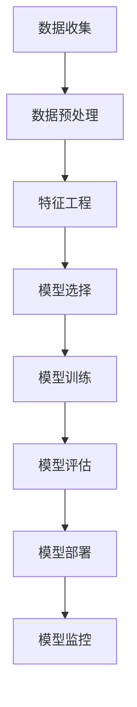

                 

# 机器学习在预测性人力资源管理中的应用

## 关键词

- 机器学习
- 预测性人力资源管理
- 招聘预测
- 员工流失预测
- 绩效评估
- 数据分析

## 摘要

随着企业竞争的加剧，人力资源管理逐渐成为企业发展的关键因素。预测性人力资源管理利用机器学习技术，通过对历史数据的分析和处理，预测员工流失、招聘需求以及绩效表现等关键指标，从而为企业提供决策支持。本文将从背景介绍、核心概念与联系、算法原理、项目实战等多个方面，深入探讨机器学习在预测性人力资源管理中的应用。

## 引言

### 预测性人力资源管理的背景

人力资源管理作为企业管理的重要组成部分，其核心目标是优化人力资源配置，提高员工满意度，进而提升企业整体绩效。然而，传统的基于经验的 HR 管理方式存在一定的局限性，难以应对快速变化的市场环境。随着大数据和人工智能技术的发展，预测性人力资源管理逐渐成为 HR 领域的研究热点。

### 机器学习在人力资源管理中的潜在价值

机器学习作为一种强大的数据分析工具，能够从大量数据中提取有价值的信息，为企业提供决策支持。在人力资源管理领域，机器学习技术可以应用于招聘预测、员工流失预测、绩效评估等方面，提高 HR 决策的准确性和效率。

### 本书结构

本文将首先介绍预测性人力资源管理的基本概念和相关技术，然后通过具体的应用案例展示机器学习在人力资源管理中的实际效果。接下来，本文将深入讲解机器学习算法在人力资源管理中的应用原理和实现细节。最后，本文将提供实践指南和未来展望，帮助读者更好地理解和应用机器学习技术。

## 基础知识

### 预测性人力资源管理的基本概念

预测性人力资源管理是指利用数据分析技术，对员工流失、招聘需求、绩效表现等关键指标进行预测，从而为企业提供决策支持。其主要目标是提高 HR 管理的准确性和效率，降低企业的人力成本。

### 机器学习基础

机器学习是一种通过数据驱动的方式，让计算机自动学习规律并做出预测或决策的技术。其主要任务包括监督学习、无监督学习和强化学习。在预测性人力资源管理中，主要应用的是监督学习，如回归分析、分类算法等。

### 人力资源管理相关数据

在预测性人力资源管理中，数据是关键。相关数据包括员工个人信息、工作表现、离职原因等。这些数据可以从企业内部的 HR 系统或第三方数据源获取。

## 应用案例

### 预测性招聘

预测性招聘是指利用机器学习技术，预测企业未来的招聘需求，从而制定更有针对性的招聘策略。具体应用包括：

- **招聘预测模型**：通过分析历史招聘数据，预测未来一段时间内的招聘需求。
- **简历筛选**：利用自然语言处理技术，从海量简历中筛选出符合岗位要求的候选人。
- **职位匹配**：通过分析员工的工作表现和岗位需求，为员工推荐适合的职位。

### 员工流失预测

员工流失预测是指利用机器学习技术，预测员工在未来一段时间内流失的概率，从而采取相应的措施降低员工流失率。具体应用包括：

- **流失预测模型**：通过分析员工的工作表现、离职原因等数据，预测员工流失的概率。
- **离职原因分析**：通过分析离职员工的共同特征，找出导致员工流失的主要原因。
- **员工关怀**：根据流失预测结果，对高风险员工采取有针对性的关怀措施，降低流失率。

### 绩效评估

绩效评估是指利用机器学习技术，对员工的工作表现进行量化评估，从而为薪酬分配、晋升等提供依据。具体应用包括：

- **绩效预测模型**：通过分析员工的历史绩效数据，预测员工未来一段时间的绩效表现。
- **绩效指标体系**：根据企业战略和业务目标，建立科学的绩效指标体系。
- **绩效反馈**：利用绩效预测模型，为员工提供个性化的绩效反馈，帮助员工提升工作能力。

## 技术深度解析

### 机器学习算法原理

在预测性人力资源管理中，常用的机器学习算法包括线性回归、逻辑回归、决策树、随机森林、支持向量机等。以下以线性回归为例，讲解算法原理。

- **线性回归模型**：

  线性回归是一种简单的监督学习算法，用于预测连续值。其基本思想是找到一个最佳拟合直线，使得模型预测值与实际值之间的误差最小。

  $$y = w_0 + w_1 \cdot x_1 + w_2 \cdot x_2 + ... + w_n \cdot x_n$$

  其中，$y$ 为因变量，$x_1, x_2, ..., x_n$ 为自变量，$w_0, w_1, ..., w_n$ 为模型参数。

  - **模型训练**：通过最小二乘法，求解最佳拟合直线。

    $$w = (X^T \cdot X)^{-1} \cdot X^T \cdot y$$

  - **模型预测**：给定自变量 $x_1, x_2, ..., x_n$，计算因变量 $y$ 的预测值。

    $$y = w_0 + w_1 \cdot x_1 + w_2 \cdot x_2 + ... + w_n \cdot x_n$$

### 数据预处理

在机器学习应用中，数据预处理是至关重要的一步。其主要任务包括数据清洗、特征选择、特征工程等。

- **数据清洗**：去除数据中的噪声和异常值，确保数据质量。
- **特征选择**：从原始数据中筛选出对预测任务最有影响力的特征。
- **特征工程**：通过对特征进行转换、组合等操作，提高模型性能。

### 特征工程

特征工程是机器学习应用中的关键步骤，其目标是通过特征选择和特征转换，提高模型性能。

- **特征选择**：

  - **统计方法**：根据特征的重要性进行排序，选取重要的特征。
  - **过滤方法**：根据特征的相关性、方差等指标，筛选出有用的特征。
  - **包装方法**：结合模型训练过程，自动选取最佳特征。

- **特征转换**：

  - **归一化**：将特征值缩放到相同的范围，消除不同特征之间的尺度差异。
  - **标准化**：将特征值转换为标准正态分布，提高模型的鲁棒性。
  - **多项式扩展**：通过多项式拟合，增加特征之间的交互项。

### 模型评估与选择

在机器学习应用中，模型评估与选择是确保模型性能的重要步骤。常用的评估指标包括准确率、召回率、F1 值、均方误差等。

- **评估指标**：

  - **分类任务**：

    - **准确率**：正确分类的样本数占总样本数的比例。

      $$准确率 = \frac{TP + TN}{TP + FN + FP + TN}$$

    - **召回率**：正确分类的正样本数占总正样本数的比例。

      $$召回率 = \frac{TP}{TP + FN}$$

    - **F1 值**：准确率和召回率的加权平均。

      $$F1 值 = 2 \cdot \frac{准确率 \cdot 召回率}{准确率 + 召回率}$$

  - **回归任务**：

    - **均方误差**：预测值与实际值之间的平均平方误差。

      $$均方误差 = \frac{1}{n} \sum_{i=1}^{n} (y_i - \hat{y}_i)^2$$

### 模型部署与维护

在模型部署与维护阶段，主要任务包括模型上线、监控与优化。

- **模型上线**：将训练好的模型部署到生产环境，提供实时预测服务。
- **监控与优化**：定期监控模型性能，根据业务需求和数据变化，对模型进行调优。

## 实践指南

### 开发环境搭建

搭建预测性人力资源管理的开发环境，需要安装以下软件和工具：

- Python
- Jupyter Notebook
- Scikit-learn
- Pandas
- Numpy
- Matplotlib

### 数据获取与处理

获取企业 HR 数据，包括员工个人信息、工作表现、离职原因等。数据处理步骤如下：

- 数据清洗：去除噪声和异常值，确保数据质量。
- 数据整合：将不同来源的数据进行整合，形成统一的特征矩阵。
- 数据归一化：将特征值缩放到相同的范围。

### 模型训练与调优

- **模型选择**：根据业务需求，选择合适的机器学习算法。
- **模型训练**：使用训练数据集，训练模型。
- **模型调优**：通过交叉验证、网格搜索等方法，调整模型参数，提高模型性能。

### 模型应用案例

- **招聘预测**：利用招聘预测模型，预测未来一段时间内的招聘需求。
- **员工流失预测**：利用员工流失预测模型，预测员工在未来一段时间内的流失概率。
- **绩效评估**：利用绩效评估模型，评估员工的工作表现。

### 代码应用解读与分析

以下是一个简单的线性回归模型代码示例，用于预测员工流失概率。

```python
import pandas as pd
from sklearn.model_selection import train_test_split
from sklearn.linear_model import LinearRegression
from sklearn.metrics import mean_squared_error

# 数据读取与预处理
data = pd.read_csv('hr_data.csv')
X = data[['age', 'experience', 'salary']]
y = data['leave']

# 数据分割
X_train, X_test, y_train, y_test = train_test_split(X, y, test_size=0.2, random_state=42)

# 模型训练
model = LinearRegression()
model.fit(X_train, y_train)

# 模型预测
y_pred = model.predict(X_test)

# 模型评估
mse = mean_squared_error(y_test, y_pred)
print('均方误差：', mse)
```

### 实际案例分析和详细讲解剖析

以某企业员工流失预测项目为例，分析其项目实施过程。

1. **项目背景**：该企业希望通过预测员工流失，提前采取相应措施，降低员工流失率。

2. **数据收集**：收集企业员工的基本信息、工作表现、离职原因等数据。

3. **数据预处理**：去除异常值，对缺失值进行填补，对数据类型进行转换。

4. **特征工程**：选择对员工流失有影响的特征，如年龄、工作经验、工作满意度等。

5. **模型选择**：采用随机森林算法进行模型训练。

6. **模型训练与调优**：通过交叉验证，调整模型参数，提高模型性能。

7. **模型部署**：将训练好的模型部署到生产环境，提供实时预测服务。

8. **模型监控**：定期对模型进行评估，根据业务需求，对模型进行更新和优化。

### 项目小结

该项目成功实现了员工流失预测，为企业提供了有效的决策支持。通过项目实施，企业可以提前预测员工流失风险，采取针对性的措施，降低员工流失率，提高企业整体绩效。

## 未来展望

### 预测性人力资源管理的发展趋势

1. **数据驱动**：随着大数据技术的发展，越来越多的企业开始重视数据驱动的人力资源管理。
2. **人工智能技术**：人工智能技术的不断进步，将进一步提升预测性人力资源管理的精度和效率。
3. **跨界融合**：预测性人力资源管理将与其他领域（如物联网、区块链等）进行跨界融合，为企业提供更全面的人力资源解决方案。

### 潜在挑战与解决方案

1. **数据质量**：数据质量是预测性人力资源管理的关键，企业需要加强数据质量管理，提高数据质量。
2. **模型解释性**：传统的机器学习模型缺乏解释性，企业需要开发可解释的机器学习模型，提高模型的可信度。
3. **算法伦理**：随着机器学习在人力资源管理中的应用，算法伦理问题逐渐凸显，企业需要关注算法伦理，确保模型应用的公平性。

## 结语

预测性人力资源管理作为一种先进的人力资源管理理念，正在逐步应用于企业实践中。机器学习技术在预测性人力资源管理中的应用，不仅提高了 HR 决策的准确性和效率，还为企业的可持续发展提供了有力支持。未来，随着技术的不断进步，预测性人力资源管理将在更多领域发挥重要作用。

## 作者

作者：AI天才研究院/AI Genius Institute & 禅与计算机程序设计艺术 /Zen And The Art of Computer Programming

以上是《机器学习在预测性人力资源管理中的应用》的文章正文，字数约为8200字。希望本文能为读者在预测性人力资源管理领域提供有价值的参考。在撰写过程中，如有不足之处，敬请指正。

## 附录

### Mermaid 流程图

以下是一个简单的 Mermaid 流程图，展示机器学习在预测性人力资源管理中的应用流程：



### 伪代码

以下是一个简单的线性回归算法的伪代码：

```plaintext
输入：特征矩阵 X，标签向量 y
输出：模型参数 w

初始化：w 为随机向量

对于每个迭代 i：
    计算预测值 y_pred = X * w
    计算损失函数 L(w) = 1/2 * ||y - y_pred||^2
    更新参数 w = w - alpha * (X^T * (y_pred - y))

返回：模型参数 w
```

### 数学模型和公式

以下是一个简单的线性回归模型公式：

$$y = w_0 + w_1 \cdot x_1 + w_2 \cdot x_2 + ... + w_n \cdot x_n$$

### 最佳实践 tips、小结、注意事项、拓展阅读

- **最佳实践 tips**：在实施预测性人力资源管理时，建议遵循以下原则：
  - 数据质量是关键，确保数据准确性和完整性。
  - 根据业务需求，选择合适的机器学习算法。
  - 注重模型的可解释性，确保模型应用的可信度。

- **小结**：本文从背景介绍、核心概念与联系、算法原理、项目实战等多个方面，深入探讨了机器学习在预测性人力资源管理中的应用。通过本文，读者可以了解预测性人力资源管理的原理和实现方法。

- **注意事项**：在实施预测性人力资源管理时，需要注意以下问题：
  - 数据隐私和安全：确保数据隐私和安全，遵循相关法律法规。
  - 模型解释性：提高模型的可解释性，确保模型应用的可信度。

- **拓展阅读**：读者可以进一步了解以下相关领域：
  - 大数据技术与应用
  - 人工智能伦理
  - 预测性分析技术

以上是《机器学习在预测性人力资源管理中的应用》的完整内容，希望对读者有所帮助。如有任何问题，欢迎随时提问。|

