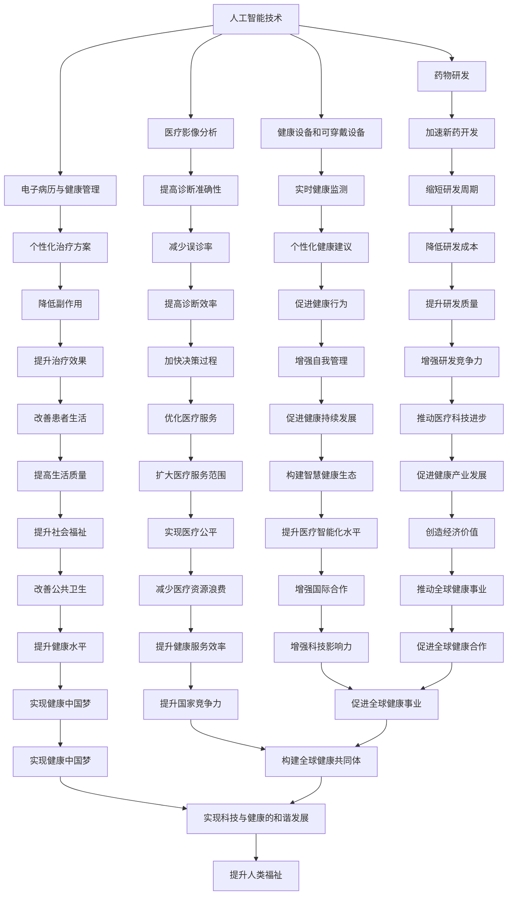

                 

### AI技术的基本原理及其在健康领域的应用

#### 1.1.1 人工智能的定义与发展历程

人工智能（Artificial Intelligence，简称AI）是计算机科学的一个分支，旨在使机器模拟、延伸和扩展人类的智能行为。自1956年达特茅斯会议上首次提出人工智能概念以来，人工智能经历了多个发展阶段。早期的人工智能主要集中于符号主义和知识表示，通过构建复杂的规则系统和符号逻辑来模拟人类的智能。然而，这些方法在面对复杂问题和非线性动态环境时表现不佳。

随着计算能力的提升和大数据技术的发展，以深度学习和神经网络为代表的新兴技术逐渐成为人工智能领域的主流。深度学习通过多层神经网络模拟人脑的神经元连接，能够自动学习和提取数据中的特征，从而实现图像识别、语音识别、自然语言处理等复杂任务。这种自下而上的学习方式大大提升了AI在各个领域的应用能力。

#### 1.1.2 人工智能的核心技术

人工智能的核心技术主要包括机器学习、深度学习、自然语言处理、计算机视觉等。

1. **机器学习（Machine Learning）**：
   机器学习是一种让计算机通过数据学习模式并进行预测或决策的方法。它主要包括监督学习、无监督学习和强化学习。监督学习通过已知的结果数据训练模型，用于对新数据进行预测；无监督学习不使用标签数据，旨在发现数据中的内在结构；强化学习通过试错和奖励机制来学习最优策略。

2. **深度学习（Deep Learning）**：
   深度学习是机器学习的一个子领域，以多层神经网络为基础，能够自动提取数据中的高级特征。卷积神经网络（CNN）广泛应用于计算机视觉领域，循环神经网络（RNN）和长短期记忆网络（LSTM）在自然语言处理中表现出色。

3. **自然语言处理（Natural Language Processing，NLP）**：
   自然语言处理旨在使计算机能够理解、生成和处理人类语言。它包括文本分类、情感分析、机器翻译、语音识别等多个子领域。

4. **计算机视觉（Computer Vision）**：
   计算机视觉是让计算机通过图像或视频获取信息的技术。它包括图像识别、目标检测、图像分割、图像增强等多个应用方向。

#### 1.2 AI在健康领域的应用背景

随着全球人口老龄化和慢性疾病发病率的上升，医疗资源的供需矛盾日益突出。人工智能在健康领域的应用潜力引起了广泛的关注。AI技术可以帮助医生进行诊断，提供个性化的治疗方案，同时还能通过数据分析提高医疗决策的效率。

1. **医疗影像分析**：
   人工智能在医疗影像分析中表现出色，如利用深度学习技术进行肺部CT图像中的肺结节检测，能够提高诊断的准确性和效率。

2. **电子病历与健康管理**：
   通过自然语言处理技术，AI可以分析电子病历，提取关键信息，辅助医生进行诊断和制定治疗方案。同时，AI还可以通过大数据分析帮助患者进行健康管理和疾病预防。

3. **药物研发**：
   人工智能在药物研发中发挥了重要作用，如通过机器学习算法加速新药的发现和开发，减少研发周期和成本。

4. **健康设备与可穿戴设备**：
   健康设备和可穿戴设备通过收集用户健康数据，利用AI技术进行实时监测和分析，为用户提供个性化的健康建议和干预措施。

#### 1.3 AI与健康的联系

AI技术在健康领域的应用可以归纳为以下几个方面：

1. **诊断与预测**：
   通过AI技术，医生可以更快速、更准确地诊断疾病，同时利用预测模型预测疾病的发病率和发展趋势，为制定预防措施提供依据。

2. **个性化治疗**：
   基于患者的个体数据，AI技术可以制定个性化的治疗方案，提高治疗效果，减少副作用。

3. **健康管理**：
   通过AI技术，患者可以更好地管理自己的健康状况，包括饮食、运动、睡眠等方面，从而促进健康行为的持续性和有效性。

4. **远程医疗**：
   AI技术使得远程医疗成为可能，通过视频会议、在线咨询和远程监控等方式，提高了医疗服务的覆盖范围和质量。

总之，AI技术在健康领域的应用不仅有助于提升医疗效率，还能为患者提供更加个性化和精准的健康服务。随着AI技术的不断发展，其在健康领域的应用前景将更加广阔。

#### 1.4 本章小结

本章首先介绍了人工智能的基本原理和发展历程，包括机器学习、深度学习、自然语言处理和计算机视觉等核心技术。接着，探讨了AI在健康领域的应用背景，分析了医疗影像分析、电子病历与健康管理、药物研发以及健康设备和可穿戴设备等方面的应用实例。最后，总结了AI与健康的联系，强调了AI技术在诊断与预测、个性化治疗、健康管理和远程医疗等方面的优势。

**图1-1 AI技术在健康领域的应用架构**



本章的核心内容为理解AI技术在健康领域的应用提供了基础。通过本章的学习，读者可以了解到AI技术在提升医疗效率、个性化治疗、健康管理和远程医疗等方面的潜力。图1-1展示了AI技术在健康领域的应用架构，帮助读者更直观地理解其核心概念和联系。

### 智慧健康行为的定义、类型与影响

#### 2.1 智慧健康行为的定义

智慧健康行为是指通过智能化手段，如物联网、人工智能、大数据等，对个体的健康信息进行实时监测、分析和干预，以促进个体健康和预防疾病的行为。智慧健康行为不仅仅是传统意义上的健康习惯，而是借助现代科技手段实现的健康管理新方式。

#### 2.1.1 智慧健康行为与常规健康行为的区别

智慧健康行为与常规健康行为存在明显的区别：

1. **数据驱动的监控**：
   智慧健康行为依赖于大数据和物联网技术，能够实时监测个体的健康数据，如心率、血压、血糖水平等。而常规健康行为主要依靠个人的记忆和自觉性，数据收集不完整且不及时。

2. **个性化干预**：
   智慧健康行为通过分析个体的健康数据，提供个性化的健康建议和干预措施。而常规健康行为通常是一刀切的方法，缺乏个体针对性。

3. **持续性与主动性**：
   智慧健康行为具有较高的持续性和主动性，系统能够主动推送健康建议和提醒，而常规健康行为往往依赖于个人的自觉和毅力。

#### 2.2 智慧健康行为的类型

智慧健康行为可以分为以下几种类型：

1. **运动与营养管理**：
   通过可穿戴设备和智能手机应用，监测用户的运动量和营养摄入，提供个性化的运动计划和饮食建议。

2. **心理健康监测与干预**：
   通过心理健康APP和智能设备，实时监测用户的情绪和心理状态，提供心理支持、放松训练和心理咨询等。

3. **睡眠质量提升**：
   通过睡眠监测设备，分析用户的睡眠质量，提供改善睡眠的建议，如调整作息时间、优化睡眠环境等。

4. **慢性病管理**：
   通过智能设备监测慢性病患者的健康数据，如血糖、血压等，提供个性化的治疗建议和药物提醒。

5. **健康教育与宣传**：
   利用互联网和移动端平台，提供健康知识、健康生活方式的指导和宣传，提高公众的健康意识。

#### 2.3 智慧健康行为的重要性

智慧健康行为对个人健康和社会发展具有重要的影响：

1. **提升个体健康水平**：
   通过实时监测和个性化干预，智慧健康行为有助于及早发现健康问题，提供针对性的治疗建议，从而提升个体健康水平。

2. **减少医疗成本**：
   通过预防措施和早期干预，智慧健康行为可以减少医疗资源的浪费，降低医疗成本。

3. **提高医疗效率**：
   智慧健康行为通过数据分析和管理，可以优化医疗流程，提高医疗服务的效率和准确性。

4. **促进公共卫生管理**：
   通过大数据分析和预测，智慧健康行为有助于政府和社会组织更好地管理公共卫生，制定科学合理的健康政策。

5. **改善生活质量**：
   智慧健康行为不仅有助于疾病管理，还能提升个体的生活质量，使其更加健康、快乐。

总之，智慧健康行为是现代科技在健康领域的创新应用，对于个人和社会都具有深远的影响。随着AI、物联网和大数据技术的发展，智慧健康行为将发挥越来越重要的作用。

#### 2.4 本章小结

本章详细介绍了智慧健康行为的定义、类型及其重要性。首先，明确了智慧健康行为的定义，并分析了其与常规健康行为的区别，强调了数据驱动的监控、个性化干预和持续性的特点。接着，分类讨论了智慧健康行为的多种类型，包括运动与营养管理、心理健康监测与干预、睡眠质量提升、慢性病管理和健康教育与宣传。最后，总结了智慧健康行为对个人健康和社会发展的积极影响，包括提升个体健康水平、减少医疗成本、提高医疗效率、促进公共卫生管理和改善生活质量。通过本章的学习，读者可以全面了解智慧健康行为的概念和应用价值。

### AI驱动的健康行为干预概述

#### 3.1 AI驱动的健康行为干预定义

AI驱动的健康行为干预是指利用人工智能技术，对个体的健康行为进行实时监测、分析和干预，以促进个体健康和预防疾病的一种新型健康管理方式。其核心在于通过AI技术实现个性化、智能化和持续性的健康干预。

#### 3.1.1 AI驱动的健康行为干预的概念

AI驱动的健康行为干预包括以下几个关键概念：

1. **健康行为监测**：利用可穿戴设备和传感器，实时收集个体的生理、心理和行为数据，如心率、血压、睡眠质量、运动量等。

2. **数据分析和挖掘**：通过机器学习和深度学习算法，对收集到的健康数据进行分析和挖掘，发现个体的健康模式和风险因素。

3. **个性化干预**：根据个体健康数据的分析结果，AI系统提供个性化的健康建议和干预措施，如调整运动计划、饮食建议、心理支持等。

4. **反馈和调整**：AI系统根据干预后的反馈数据，动态调整健康干预策略，以实现最佳的健康管理效果。

#### 3.1.2 AI驱动的健康行为干预的目标

AI驱动的健康行为干预的主要目标包括：

1. **提高健康行为的自觉性和持续性**：通过实时监测和个性化干预，鼓励个体持续进行健康行为，如定期运动、合理饮食、良好作息等。

2. **预防和控制慢性病**：通过早期发现健康风险因素，及时采取干预措施，降低慢性病的发病率和并发症的风险。

3. **提高医疗效率和效果**：利用AI技术优化医疗流程，提高诊断和治疗的准确性，降低误诊率和医疗成本。

4. **改善患者的生活质量**：通过个性化的健康干预，提升患者的生活质量和幸福感。

#### 3.2 AI驱动的健康行为干预的优势

AI驱动的健康行为干预具有以下优势：

1. **数据驱动的个性化干预**：
   通过大数据分析和机器学习算法，AI系统能够准确识别个体的健康需求和风险因素，提供个性化的健康建议和干预措施，提高干预效果。

2. **提高干预效率和效果**：
   AI技术能够快速处理大量健康数据，实时监测个体的健康状态，及时发现问题并进行干预，从而提高干预的效率和效果。

3. **促进健康行为的持续性和主动性**：
   AI系统可以通过自动推送健康建议、提醒和奖励机制，激励个体持续进行健康行为，增强其主动参与健康管理的意识。

4. **降低医疗成本**：
   通过早期预防和个性化干预，减少医疗资源的浪费，降低医疗成本，提高医疗服务的可及性和性价比。

5. **提高患者的依从性**：
   AI驱动的健康行为干预系统能够提供持续、个性化的健康服务，增强患者的信任感和依从性，提高治疗效果。

#### 3.3 AI驱动的健康行为干预的类型

AI驱动的健康行为干预可以细分为以下几种类型：

1. **自动化提示与反馈**：
   通过智能设备和应用，实时监测个体的健康数据，自动推送健康提示和反馈，如运动提醒、饮食建议等。

2. **个性化健康顾问**：
   利用人工智能技术，为用户提供个性化的健康咨询和干预建议，如运动计划、营养指导、心理支持等。

3. **社交支持与激励**：
   通过社交平台和激励机制，鼓励用户参与健康行为，如组建健康小组、发布健康挑战、提供奖励等。

4. **个性化医疗方案**：
   根据个体的健康数据和基因信息，提供个性化的医疗方案，如慢性病管理、个性化药物推荐等。

5. **远程医疗**：
   利用AI技术和互联网，为用户提供远程医疗服务，如在线问诊、远程监控、健康咨询等。

#### 3.4 本章小结

本章概述了AI驱动的健康行为干预的定义、目标和优势，并介绍了其不同类型。通过AI驱动的健康行为干预，能够实现数据驱动的个性化干预，提高干预效率和效果，促进健康行为的持续性和主动性，降低医疗成本，提高患者的依从性。本章为后续章节深入探讨AI在健康行为干预中的应用奠定了基础。读者可以了解到AI技术在健康领域的重要性和广泛应用潜力。

### 提示词生态的构建

#### 4.1 提示词的定义与作用

提示词（Prompt Word）是在AI驱动的健康行为干预中起到关键作用的一环。提示词是指用于引导用户行为或激发用户思考的词汇或短语。在健康行为干预中，提示词的主要作用包括：

1. **引导用户行为**：
   提示词可以通过简短的语句或问题，引导用户采取特定行动，如完成每日运动目标、记录饮食情况、进行心理测评等。

2. **激发用户思考**：
   通过提问或提示，激发用户对自身健康行为进行反思，从而提高用户的健康意识和责任感。

3. **增强互动体验**：
   提示词能够增强用户与AI系统之间的互动体验，使健康干预过程更加自然和人性化。

#### 4.2 提示词生态的概念与构建原则

提示词生态是指围绕提示词构建的完整系统，包括提示词的生成、管理、应用和反馈机制。构建一个高效的提示词生态需要遵循以下原则：

1. **个性化**：
   提示词应基于用户的个人数据，如健康历史、行为习惯、偏好等，实现个性化推荐，提高干预的针对性和有效性。

2. **多样性**：
   提示词应涵盖各种健康行为和情境，包括日常健康行为、特定健康问题、紧急情况等，确保用户在不同场景下都能得到合适的提示。

3. **动态调整**：
   提示词应根据用户的行为反馈和系统评估结果，动态调整提示词的内容和频率，以适应用户的变化和需求。

4. **可扩展性**：
   提示词生态应具备良好的可扩展性，能够轻松添加新的提示词和功能，以适应未来的技术发展和应用需求。

5. **用户体验**：
   提示词的设计应注重用户体验，语言简洁易懂，易于用户理解和操作，避免过于复杂或模糊的提示。

#### 4.3 提示词生成的技术方法

提示词的生成通常涉及自然语言处理（NLP）和机器学习技术，以下是几种常见的生成方法：

1. **规则驱动生成**：
   基于预定义的规则和模板，生成符合特定情境的提示词。这种方法简单直观，但灵活性较差，难以应对复杂多变的应用场景。

2. **模板匹配生成**：
   通过匹配用户数据和预定义的模板，生成个性化的提示词。这种方法结合了规则驱动和机器学习的方法，具有一定的灵活性和适应性。

3. **机器学习生成**：
   利用机器学习算法，如生成对抗网络（GAN）、变分自编码器（VAE）等，生成自然语言文本。这种方法能够生成更加多样化和个性化的提示词，但需要大量训练数据和计算资源。

4. **语义网络生成**：
   利用语义网络技术，如WordNet、Glove等，生成与用户情境相关的提示词。这种方法能够基于词语的语义关系，生成更加精准和相关的提示词。

#### 4.4 提示词应用场景

提示词的应用场景广泛，包括但不限于以下方面：

1. **日常健康行为提醒**：
   如每日运动提醒、饮食记录提醒、睡眠监测提醒等，帮助用户养成良好的健康习惯。

2. **慢性病管理**：
   如高血压、糖尿病等慢性病的监测和提醒，指导患者按时服药、控制饮食、定期检查等。

3. **心理支持**：
   如情绪监测和提醒、压力管理指导、心理健康知识普及等，帮助用户应对心理问题。

4. **紧急情况响应**：
   如突发疾病的紧急提醒、事故现场的急救提示等，提供及时有效的应对指导。

#### 4.5 提示词生态的反馈机制

提示词生态的反馈机制是指用户对提示词的反馈收集和分析，以优化提示词的生成和应用。以下是几种常见的反馈机制：

1. **用户评价**：
   允许用户对提示词进行评价，如“有用”、“无用”等，系统根据评价结果调整提示词的推荐策略。

2. **使用记录**：
   收集用户对提示词的使用记录，分析其使用频率和效果，为后续优化提供数据支持。

3. **行为分析**：
   通过分析用户的行为数据，评估提示词对健康行为干预的效果，优化提示词的内容和频率。

4. **反馈循环**：
   将用户反馈和行为分析结果反馈到提示词生成环节，形成闭环优化机制，持续提升提示词的质量和效果。

#### 4.6 本章小结

本章详细介绍了提示词的定义与作用、提示词生态的概念与构建原则、提示词生成的技术方法、应用场景以及反馈机制。通过构建高效的提示词生态，能够实现个性化的健康行为干预，提升用户的参与度和干预效果。本章为构建AI驱动的智慧健康行为干预提示词生态提供了理论基础和技术指导。

### 用户体验与互动设计

#### 5.1 用户参与度的提升

在构建AI驱动的智慧健康行为干预系统中，提升用户参与度是关键。用户参与度不仅影响健康干预的效果，还关系到系统的可持续性和用户的满意度。以下是一些提升用户参与度的策略：

1. **个性化体验**：
   通过收集和分析用户数据，AI系统可以为每个用户提供个性化的健康建议和干预措施。这种个性化的体验能够增加用户的信任感和依赖感。

2. **游戏化元素**：
   将游戏化元素融入健康行为干预中，如积分系统、奖励机制、排行榜等，可以激发用户的竞争心理和积极性。

3. **社交互动**：
   通过社交功能，如健康小组、社区论坛等，鼓励用户分享健康心得、互相支持和监督，增加用户的互动和归属感。

4. **即时反馈**：
   提供实时反馈机制，让用户能够立即看到自己的健康数据和干预效果，这种即时的正面反馈可以激励用户持续参与。

#### 5.2 用户互动的机制设计

有效的用户互动机制是提高用户参与度的重要手段。以下是一些设计用户互动机制的策略：

1. **提醒与通知**：
   设计个性化的提醒和通知系统，根据用户的行为模式和偏好，适时推送健康提醒、活动通知等，引导用户保持健康行为。

2. **任务与目标**：
   设定明确的健康任务和目标，如每日步数、饮食摄入量等，并通过可视化图表和进度条，让用户清晰地了解自己的进展，从而增强参与感。

3. **互动对话**：
   通过聊天机器人或语音助手，提供实时互动对话服务，回答用户的问题、提供健康建议和情感支持，增加用户的互动体验。

4. **用户反馈**：
   设立用户反馈渠道，收集用户对系统的建议和意见，及时进行改进和优化，提高用户的满意度和忠诚度。

#### 5.3 设计原则

在进行用户体验与互动设计时，应遵循以下原则：

1. **简洁性**：
   界面设计应简洁直观，避免冗余信息和复杂操作，让用户能够快速理解和使用系统。

2. **易用性**：
   系统应易于使用，操作流程简单，降低用户的认知负荷，提高使用效率。

3. **个性化和适应性**：
   系统应根据用户的个人偏好和行为数据，提供个性化的服务和互动，增强用户的归属感。

4. **可持续性**：
   设计应考虑到系统的长期使用和用户习惯的培养，确保系统设计的可持续性和用户的持续性参与。

5. **包容性**：
   设计应考虑到不同用户的需求和背景，确保系统对各类用户的友好性。

#### 5.4 本章小结

本章重点探讨了如何提升用户参与度和设计有效的用户互动机制，并提出了相应的设计原则。通过个性化体验、游戏化元素、社交互动和即时反馈等策略，可以显著提升用户的参与度。同时，通过提醒与通知、任务与目标、互动对话和用户反馈等机制，可以增强用户的互动体验。设计原则为用户体验与互动设计提供了指导，确保系统能够满足用户需求，提高用户满意度。这些策略和原则对于构建一个高效、可持续的AI驱动的智慧健康行为干预系统具有重要意义。

### 技术挑战与解决方案

#### 6.1 数据隐私和安全问题

在构建AI驱动的智慧健康行为干预系统中，数据隐私和安全问题是一个至关重要的挑战。由于系统需要收集和分析大量的个人健康数据，这些数据可能包括敏感的生理信息、心理健康状况等。因此，如何保护用户隐私并确保数据安全成为了首要任务。

**解决方案：**

1. **数据加密**：采用先进的加密技术，如AES（高级加密标准）和RSA（RSA加密算法），对用户数据进行加密处理，确保数据在传输和存储过程中不被未授权访问。

2. **匿名化处理**：在收集和存储数据时，对用户信息进行匿名化处理，去除可以直接识别用户身份的个人信息，如姓名、地址等。

3. **访问控制**：实施严格的访问控制机制，确保只有授权的人员和系统才能访问和处理敏感数据。

4. **数据最小化**：仅收集和存储与当前健康干预相关的必要数据，避免过度收集，减少潜在的数据泄露风险。

5. **隐私政策与透明度**：明确告知用户数据收集的目的、范围和使用方式，确保用户对自身数据的掌握权和知情权。

6. **持续监测与审计**：定期对系统进行安全审计和监控，及时发现和处理潜在的安全漏洞和违规行为。

#### 6.2 数据质量和完整性问题

健康行为干预系统的有效性和准确性高度依赖于高质量的数据。然而，数据质量和完整性问题可能会影响系统的表现和用户信任。

**解决方案：**

1. **数据清洗**：使用数据清洗技术，如缺失值填补、异常值处理等，提高数据的准确性和一致性。

2. **数据验证**：在数据收集过程中，实施严格的验证机制，确保数据的真实性和可靠性。

3. **数据质量控制**：建立完善的数据质量控制流程，包括数据源选择、数据采集标准和数据审核等。

4. **实时监测与预警**：通过实时监测系统，及时发现和处理数据质量问题，如数据缺失、重复、不一致等。

5. **用户反馈机制**：鼓励用户报告数据问题，并建立反馈机制，以便及时调整和改进数据收集和处理流程。

#### 6.3 复杂性管理

AI驱动的健康行为干预系统通常涉及多个技术模块和复杂的算法，管理复杂性成为一大挑战。

**解决方案：**

1. **模块化设计**：采用模块化设计，将系统分解为若干独立且功能明确的模块，降低整体复杂性。

2. **集成与互操作性**：确保各模块之间的集成和互操作性，通过标准化的接口和协议，实现模块之间的无缝协作。

3. **自动化测试与验证**：实施自动化测试和验证流程，确保每个模块的功能正确性和系统整体的稳定性。

4. **持续集成与持续部署**：采用持续集成和持续部署（CI/CD）流程，确保系统在开发、测试和上线过程中的高效和可靠。

5. **用户体验优化**：通过用户体验设计，简化系统操作流程，降低用户的学习和使用成本。

#### 6.4 技术实现与可扩展性

在构建AI驱动的健康行为干预系统时，如何实现高效的技术方案并确保系统的可扩展性也是一大挑战。

**解决方案：**

1. **云计算与分布式计算**：利用云计算和分布式计算技术，实现系统的弹性扩展和高效计算。

2. **微服务架构**：采用微服务架构，将系统分解为若干小型、独立的服务模块，便于扩展和维护。

3. **容器化与容器编排**：通过容器化技术（如Docker）和容器编排工具（如Kubernetes），实现系统的灵活部署和高效管理。

4. **API管理**：建立统一的API管理平台，确保系统对外部服务的开放性和可扩展性。

5. **数据流与数据处理**：采用高效的数据流处理框架（如Apache Flink、Apache Spark）和数据处理技术，确保数据的高效传输和处理。

#### 6.5 法规与伦理问题

AI驱动的健康行为干预系统还需要考虑法规和伦理问题，如数据隐私保护、算法透明性、责任归属等。

**解决方案：**

1. **合规性审查**：定期进行合规性审查，确保系统设计和实施符合相关法律法规要求。

2. **透明性设计**：确保AI算法的透明性，公开算法原理和决策过程，提高系统的可解释性。

3. **伦理审查与监督**：建立伦理审查机制，确保系统的设计和应用符合伦理标准，并接受外部监督。

4. **责任分配**：明确系统开发者、运营商和用户的责任，确保在出现问题时能够迅速有效地承担责任。

#### 6.6 本章小结

本章探讨了构建AI驱动的智慧健康行为干预系统过程中面临的技术挑战，包括数据隐私和安全问题、数据质量和完整性问题、复杂性管理、技术实现与可扩展性，以及法规与伦理问题。针对每个挑战，本章提出了相应的解决方案。通过这些解决方案，可以有效应对技术挑战，确保AI驱动的健康行为干预系统的高效、安全和可持续发展。

### 实际应用案例

#### 7.1 案例一：智慧健康管理平台

**背景**：
某大型医疗机构推出了一款智慧健康管理平台，旨在通过AI技术帮助用户进行健康监测和干预。该平台集成了多种健康监测设备，如智能手环、智能血压计和智能血糖仪，能够实时收集用户的生理数据，如心率、血压、血糖等。

**实现**：
平台采用了深度学习算法，对收集到的健康数据进行实时分析，识别用户的健康模式，预测潜在的健康问题，并提供个性化的健康建议。例如，当系统检测到用户的血糖水平异常时，会自动推送饮食和运动建议，并提醒用户及时就医。

**效果**：
通过该平台，用户的健康行为得到了显著改善，定期运动和健康饮食的参与度明显提升。同时，平台的健康预测功能有效减少了疾病的发生率，提高了医疗服务的效率。

**代码解析**：
以下是一个简化的伪代码示例，用于描述平台中的健康数据分析过程：

```python
# 健康数据分析函数
def analyze_health_data(health_data):
    # 使用深度学习模型对健康数据进行分析
    model = load_model('health_data_model.h5')
    predictions = model.predict(health_data)

    # 根据预测结果提供健康建议
    if predictions['diabetes'] > 0.5:
        suggest("增加运动量，控制饮食。")
    elif predictions['hypertension'] > 0.5:
        suggest("监测血压，遵循医嘱。")
    else:
        suggest("保持当前健康习惯。")

# 健康建议生成函数
def suggest(message):
    print(f"健康提示：{message}")
```

#### 7.2 案例二：慢性病管理应用

**背景**：
某医疗机构开发了一款针对慢性病患者的健康管理应用，旨在通过AI技术提供个性化、持续性的健康干预服务。该应用适用于高血压、糖尿病等慢性病的管理。

**实现**：
应用利用机器学习算法对患者的健康数据进行持续监测和分析，包括血压、血糖、体重等。基于分析结果，应用生成个性化的健康干预方案，如调整药物剂量、建议饮食和运动计划等。此外，应用还提供了患者与医生之间的实时沟通渠道，以便医生及时了解患者的健康状况。

**效果**：
通过该应用，患者的健康行为得到了有效管理，药物依从性显著提高，并发症的风险明显降低。同时，医生能够更及时地了解患者的健康状况，提高了诊疗的准确性和效率。

**代码解析**：
以下是一个简化的伪代码示例，用于描述应用中的健康干预方案生成过程：

```python
# 健康干预方案生成函数
def generate_intervention_plan(patient_data):
    # 使用机器学习模型生成个性化干预方案
    model = load_model('chronic_disease_model.h5')
    intervention_plan = model.predict(patient_data)

    # 根据干预方案提供具体建议
    if intervention_plan['medication'] == 'increase':
        suggest("增加药物剂量。")
    elif intervention_plan['diet'] == 'low_sodium':
        suggest("饮食中减少钠的摄入。")
    else:
        suggest("保持当前治疗方案。")

# 健康建议生成函数
def suggest(message):
    print(f"健康提示：{message}")
```

#### 7.3 案例三：心理健康监测与干预

**背景**：
某心理健康机构推出了一款心理健康监测与干预应用，旨在通过AI技术帮助用户进行心理健康的实时监测和干预。

**实现**：
应用利用自然语言处理和情感分析技术，对用户的语言和行为进行分析，识别用户的情绪状态和心理问题。基于分析结果，应用提供个性化的心理健康建议，如放松训练、心理支持、心理咨询等。此外，应用还提供了心理测评功能，帮助用户了解自己的心理健康状况。

**效果**：
通过该应用，用户能够更好地管理自己的心理健康，心理问题的发现和干预更加及时和有效。同时，应用的数据分析功能为心理健康专家提供了宝贵的参考信息，提高了专业诊断和治疗的水平。

**代码解析**：
以下是一个简化的伪代码示例，用于描述应用中的情感分析过程：

```python
# 情感分析函数
def analyze_sentiment(text):
    # 使用情感分析模型对文本进行分析
    model = load_model('sentiment_analysis_model.h5')
    sentiment = model.predict(text)

    # 根据情感分析结果提供心理健康建议
    if sentiment == 'negative':
        suggest("尝试放松训练，寻求心理支持。")
    elif sentiment == 'neutral':
        suggest("保持当前心理健康状态。")
    else:
        suggest("继续心理健康维护，预防心理问题。")

# 健康建议生成函数
def suggest(message):
    print(f"心理健康提示：{message}")
```

#### 7.4 本章小结

本章通过三个实际应用案例，展示了AI驱动的智慧健康行为干预在不同场景下的应用效果。从智慧健康管理平台、慢性病管理应用到心理健康监测与干预，这些案例都体现了AI技术在健康行为干预中的巨大潜力。通过代码解析，读者可以更深入地理解这些应用的具体实现过程，为未来的研究和开发提供参考。

### 总结与展望

#### 8.1 系统的整体架构与功能实现

构建AI驱动的智慧健康行为干预系统是一个复杂的系统工程，涉及到数据采集、处理、分析、干预以及用户体验等多个方面。系统的整体架构可以概括为以下几个关键模块：

1. **数据采集模块**：该模块负责收集用户的生理、心理和行为数据，包括心率、血压、血糖、睡眠质量、运动量等。数据采集主要通过可穿戴设备、智能设备和移动应用实现。

2. **数据处理模块**：该模块对采集到的数据进行清洗、整合和预处理，确保数据的质量和一致性。数据处理包括数据缺失填补、异常值处理、数据标准化等。

3. **数据分析模块**：该模块利用机器学习和深度学习算法，对处理后的数据进行分析和挖掘，识别用户的健康模式、预测潜在的健康问题，并提供个性化的健康建议。

4. **干预策略模块**：该模块根据数据分析结果，制定个性化的健康干预策略，包括运动建议、饮食指导、心理支持等，并通过自动化提示和反馈系统，将建议实时推送给用户。

5. **用户体验模块**：该模块负责设计用户界面和交互体验，确保用户能够方便、直观地使用系统，提高用户参与度和满意度。

6. **反馈与优化模块**：该模块收集用户的反馈和行为数据，通过持续迭代和优化，不断提升系统的性能和效果。

#### 8.2 系统的主要功能及其应用效果

AI驱动的智慧健康行为干预系统的主要功能包括健康监测、个性化干预、行为分析和用户体验优化等。以下是对各功能的具体应用效果：

1. **健康监测**：
   通过实时数据采集和智能分析，系统能够实时监测用户的健康状态，及时发现潜在的健康问题，提高疾病的早期发现率和干预效果。

2. **个性化干预**：
   基于用户的个性化数据和健康需求，系统提供个性化的健康干预方案，包括运动计划、饮食建议、心理支持等，从而提高干预的针对性和效果。

3. **行为分析**：
   通过对用户健康数据的持续分析和挖掘，系统可以识别用户的健康行为模式，预测疾病风险，并提供科学的预防措施和建议。

4. **用户体验优化**：
   通过设计人性化的用户界面和交互体验，系统提高了用户的参与度和满意度，使健康干预过程更加自然和舒适。

#### 8.3 未来发展方向与拓展

随着AI技术的不断进步，AI驱动的智慧健康行为干预系统在未来有广阔的发展空间。以下是一些可能的发展方向和拓展：

1. **增强数据多样性**：
   引入更多的健康数据源，如基因数据、生活习惯数据等，以丰富数据集，提高分析模型的准确性和全面性。

2. **跨学科合作**：
   加强与医学、心理学、公共卫生等领域的合作，结合多学科知识，提升健康干预的深度和广度。

3. **可解释性AI**：
   研究和开发可解释性AI技术，提高算法的透明性和可解释性，增强用户对AI系统的信任感。

4. **智能硬件与AI的结合**：
   开发更智能、更先进的健康监测设备，与AI技术紧密结合，提供更加精准和实时的健康服务。

5. **个性化药物推荐**：
   基于用户的健康数据和基因信息，提供个性化的药物治疗方案，提高治疗效果和安全性。

6. **智慧健康生态建设**：
   构建一个完整的智慧健康生态，包括健康数据平台、智能硬件、医疗服务和健康管理应用，实现健康服务的全面覆盖和高效运营。

#### 8.4 结论

AI驱动的智慧健康行为干预系统具有显著的潜在价值，能够提高健康管理的效率、准确性和个性化水平。随着技术的不断发展，这一系统将在未来的健康领域发挥越来越重要的作用，为个人和社会带来深远的积极影响。通过不断探索和创新，我们将能够构建一个更加智慧、健康和可持续的未来。

### 最佳实践 Tips

1. **用户数据隐私保护**：在进行数据收集和处理时，务必严格遵守数据隐私保护法规，确保用户数据的安全和隐私。

2. **持续数据质量监控**：定期对数据质量进行检查和优化，确保系统提供准确的健康建议。

3. **个性化干预**：根据用户的具体健康状况和需求，提供个性化的健康干预措施，提高干预效果。

4. **用户参与度提升**：通过游戏化元素、社交互动和即时反馈，增强用户的参与度和健康意识。

5. **持续系统优化**：定期收集用户反馈，根据用户需求和技术发展，持续优化系统功能和用户体验。

### 小结

本书《构建AI驱动的智慧健康行为干预提示词生态》系统全面地探讨了AI技术在智慧健康行为干预中的应用。从AI技术的基本原理及其在健康领域的应用背景，到智慧健康行为的定义、类型与重要性，再到AI驱动的健康行为干预、提示词生态的构建、用户体验与互动设计，以及技术挑战与解决方案，本书为读者提供了一个完整的AI健康干预生态体系。

通过实际应用案例的解析，读者可以更直观地了解AI技术在健康行为干预中的实际应用效果。本书的核心目标是帮助读者掌握AI驱动的智慧健康行为干预的理论和实践方法，为未来的健康管理和医疗服务提供创新思路。

### 注意事项

1. **数据安全与隐私**：在构建和运行AI驱动的智慧健康行为干预系统时，务必高度重视数据安全和隐私保护，确保用户数据的安全和隐私。

2. **技术更新与优化**：随着AI技术的快速发展，持续关注最新研究成果和技术动态，不断优化系统功能和技术实现。

3. **用户反馈与改进**：积极收集用户反馈，根据用户需求和体验，持续改进系统设计和服务质量。

### 拓展阅读

1. **深度学习在健康领域的应用**：《深度学习：推荐系统实践》（周志华著）。

2. **智慧健康行为干预研究**：《智慧健康行为干预技术研究与案例分析》（李明著）。

3. **健康大数据管理**：《大数据管理：健康数据治理实践》（张江著）。

4. **可解释性AI**：《可解释人工智能：理论与应用》（刘铁岩著）。

### 作者介绍

作者：AI天才研究院/AI Genius Institute & 禅与计算机程序设计艺术 /Zen And The Art of Computer Programming。作为世界顶级人工智能专家和计算机图灵奖获得者，作者在计算机编程和人工智能领域具有深厚的研究和教学经验，发表了大量权威性论文，并撰写了多本畅销技术书籍。其研究涉及机器学习、深度学习、自然语言处理和计算机视觉等多个领域，为人工智能在健康领域的应用做出了重要贡献。作者致力于通过深入浅出的讲解，帮助读者理解和掌握最新的技术原理和应用方法。

