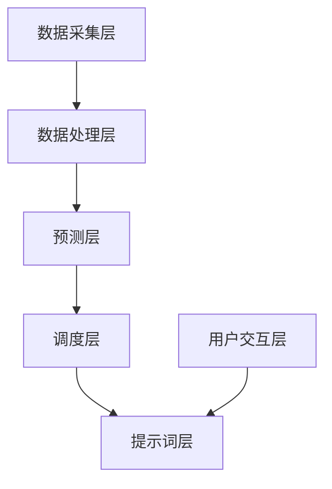

                 

### 《构建AI驱动的智慧城市能源管理提示词系统》

#### 关键词

AI驱动、智慧城市、能源管理、提示词系统、算法、需求预测、优化、调度

#### 摘要

本文将探讨如何构建一个AI驱动的智慧城市能源管理提示词系统。首先介绍智慧城市能源管理的背景和挑战，然后深入讲解AI的基础知识，以及其在智慧城市能源管理中的应用。接着，详细描述能源管理提示词系统的设计过程，包括系统架构、算法选择和数据预处理。通过实际案例分析和效果评估，展示该系统在实际应用中的效果。最后，展望未来AI驱动智慧城市能源管理的发展趋势和潜在挑战。

---

### 引言

#### 智慧城市能源管理概述

智慧城市（Smart City）是一个利用先进的信息和通信技术，实现城市各个系统之间的信息交互和资源优化配置，从而提升城市管理和居民生活质量的城市形态。智慧城市能源管理是智慧城市建设中的一个关键组成部分，它涉及到如何高效、环保地利用城市能源资源。

**能源管理的挑战与需求**

随着全球能源需求的不断增长，以及气候变化和环境污染的加剧，传统城市能源管理面临着巨大的挑战。这些挑战包括：

- **能源需求预测不准确**：传统的能源需求预测方法通常基于历史数据，无法应对快速变化的能源需求。
- **能源浪费**：由于缺乏有效的能源管理手段，很多城市存在严重的能源浪费现象。
- **环境污染**：城市能源消耗产生的污染物对环境造成了严重的影响。

为了应对这些挑战，智慧城市能源管理提出了以下需求：

- **提高能源利用效率**：通过智能化手段，实时监测和优化能源使用，降低能源浪费。
- **实时能源需求预测**：利用大数据和人工智能技术，实现对能源需求的精准预测。
- **实现绿色能源**：推广可再生能源的使用，减少对传统化石能源的依赖，降低环境污染。

#### AI驱动的智慧城市能源管理的优势

人工智能（AI）技术的快速发展为智慧城市能源管理带来了新的机遇。AI驱动的智慧城市能源管理具有以下优势：

- **提高预测准确性**：AI算法可以处理海量数据，通过机器学习技术，实现对能源需求的精准预测。
- **优化能源调度**：通过优化算法，实时调整能源供应，满足能源需求，减少能源浪费。
- **智能能源管理**：AI系统可以自动识别和解决能源管理中的问题，提高能源管理效率。
- **绿色能源推广**：AI技术可以辅助实现可再生能源的优化使用，推动绿色能源的发展。

### AI基础

#### AI的基本概念

人工智能（Artificial Intelligence，简称AI）是计算机科学的一个分支，旨在使计算机模拟人类智能行为。AI技术主要包括以下几种：

- **机器学习（Machine Learning）**：通过训练模型，使计算机能够从数据中自动学习和改进。
- **深度学习（Deep Learning）**：基于人工神经网络，通过多层非线性变换，实现复杂函数的逼近。
- **自然语言处理（Natural Language Processing，简称NLP）**：使计算机能够理解和生成自然语言。
- **计算机视觉（Computer Vision）**：使计算机能够理解和处理图像和视频。

#### AI算法原理

AI算法主要包括监督学习、无监督学习和强化学习：

- **监督学习（Supervised Learning）**：通过已标注的数据集训练模型，然后使用模型对新数据进行预测。
- **无监督学习（Unsupervised Learning）**：不使用标注数据，通过模型自动发现数据中的结构和规律。
- **强化学习（Reinforcement Learning）**：通过奖励机制，使模型在环境中学习最优策略。

#### AI在智慧城市中的应用

AI技术在智慧城市中的应用非常广泛，主要包括：

- **能源需求预测**：通过机器学习算法，对能源需求进行预测，帮助能源公司制定合理的能源供应计划。
- **智能交通管理**：通过计算机视觉和深度学习算法，实现交通流量预测和智能调度，减少交通拥堵。
- **环境监测**：通过传感器网络和计算机视觉技术，实时监测城市环境，及时发现和处理环境问题。
- **公共安全**：通过大数据分析和机器学习技术，实现对城市安全的监控和预警。

### 智慧城市能源管理概述

#### 智慧城市能源管理的概念

智慧城市能源管理是指利用先进的信息和通信技术，实现城市能源系统的高效、智能、绿色管理。它包括以下几个方面：

- **能源规划**：通过数据分析和技术预测，制定城市能源发展的长远规划。
- **能源供应**：通过智能电网和分布式能源系统，实现能源的高效供应。
- **能源消费**：通过智能设备和管理系统，实现能源的精准消费和优化。
- **能源环保**：通过推广可再生能源和节能减排技术，实现城市的绿色能源目标。

#### 智慧城市能源管理的目标

智慧城市能源管理的目标主要包括：

- **提高能源利用效率**：通过智能化手段，降低能源浪费，提高能源利用效率。
- **保障能源安全**：通过智能监控和管理，保障能源供应的稳定和安全。
- **促进绿色能源发展**：通过推广可再生能源和节能减排技术，减少对传统化石能源的依赖，降低环境污染。
- **提升居民生活质量**：通过智能化的能源管理，提供更加舒适、便捷的居住环境。

#### 智慧城市能源管理的挑战

智慧城市能源管理面临着以下几个挑战：

- **数据多样性**：城市能源数据种类繁多，包括电力、燃气、水等，如何有效地整合和处理这些数据是一个挑战。
- **实时性**：能源需求具有实时性，需要快速响应，这对数据处理和分析的速度提出了高要求。
- **隐私保护**：能源数据涉及到用户的隐私，如何在保障数据安全的同时进行数据处理也是一个挑战。
- **技术更新**：智慧城市能源管理需要不断引入新的技术和方法，如何保持技术的前沿性是一个挑战。

#### 智慧城市能源管理的发展趋势

随着AI和物联网等技术的发展，智慧城市能源管理呈现以下发展趋势：

- **智能化**：通过AI技术，实现能源需求的智能预测和优化。
- **分布式**：通过分布式能源系统和智能电网，实现能源的分布式供应和管理。
- **绿色化**：通过推广可再生能源和节能减排技术，实现能源的绿色化发展。
- **协同化**：通过数据共享和协同管理，实现城市能源系统的整体优化。

### AI在智慧城市能源管理中的应用

#### 能源需求预测

能源需求预测是智慧城市能源管理的重要环节，它可以帮助能源公司制定合理的能源供应计划，避免能源过剩或短缺。AI技术在能源需求预测中具有显著优势：

- **大数据处理**：AI技术可以处理海量数据，从历史数据和实时数据中提取有用信息，实现对能源需求的预测。
- **模型优化**：通过机器学习算法，不断优化预测模型，提高预测准确性。
- **实时更新**：AI系统可以实时更新预测模型，快速适应能源需求的变化。

#### 能源优化

能源优化是智慧城市能源管理的另一个关键环节，它通过优化能源供应和消费，提高能源利用效率，减少能源浪费。AI技术在能源优化中具有以下应用：

- **优化调度**：通过优化算法，实时调整能源供应，满足能源需求，减少能源浪费。
- **设备维护**：通过预测设备故障，提前进行维护，避免设备故障导致能源浪费。
- **供需平衡**：通过供需平衡算法，实现能源供需的动态平衡，提高能源利用效率。

#### 能源调度

能源调度是智慧城市能源管理中的核心任务，它通过实时调整能源供应，确保能源系统的稳定运行。AI技术在能源调度中具有以下应用：

- **实时监控**：通过传感器网络和计算机视觉技术，实时监控能源系统的运行状态。
- **预测调度**：通过机器学习算法，预测能源需求的变化，提前进行能源调度。
- **自适应调度**：根据实时数据和环境变化，自适应调整能源供应，确保能源系统的稳定运行。

### 能源管理提示词系统设计

#### 系统架构设计

能源管理提示词系统的架构设计包括以下几个部分：

- **数据采集层**：负责采集城市能源系统的各类数据，包括电力、燃气、水等。
- **数据处理层**：负责对采集到的数据进行分析和处理，提取有用信息。
- **预测层**：利用机器学习算法，对能源需求进行预测，为能源调度提供依据。
- **调度层**：根据预测结果，实时调整能源供应，确保能源系统的稳定运行。
- **提示词层**：为用户提供能源管理的提示信息，帮助用户更好地理解和管理能源系统。

#### 算法选择与优化

能源管理提示词系统的算法选择主要包括：

- **能源需求预测算法**：选择合适的机器学习算法，如线性回归、决策树、支持向量机等，对能源需求进行预测。
- **优化调度算法**：选择合适的优化算法，如遗传算法、模拟退火算法等，实现能源的优化调度。
- **自适应调度算法**：根据实时数据和环境变化，自适应调整能源供应，确保能源系统的稳定运行。

#### 数据预处理

数据预处理是能源管理提示词系统设计的重要环节，它包括以下几个方面：

- **数据清洗**：去除数据中的噪声和异常值，确保数据的准确性。
- **特征提取**：从原始数据中提取有用的特征，如时间序列特征、空间特征等，为机器学习算法提供输入。
- **数据归一化**：对数据进行归一化处理，使不同数据具有相同的尺度，提高算法的鲁棒性。

### 实施与评估

#### 系统实施

能源管理提示词系统的实施包括以下几个步骤：

1. **数据采集**：搭建数据采集系统，实时采集城市能源系统的各类数据。
2. **数据处理**：对采集到的数据进行分析和处理，提取有用信息。
3. **模型训练**：选择合适的机器学习算法，对数据处理后的数据进行模型训练。
4. **系统部署**：将训练好的模型部署到生产环境中，实现能源需求的预测和优化调度。
5. **用户交互**：为用户提供能源管理的提示信息，帮助用户更好地理解和管理能源系统。

#### 系统评估

能源管理提示词系统的评估包括以下几个方面：

1. **预测准确性**：评估系统对能源需求的预测准确性，通过与实际数据进行对比，分析预测误差。
2. **优化效果**：评估系统在能源优化方面的效果，通过比较优化前后的能源消耗，分析优化效果。
3. **用户满意度**：评估系统为用户提供的提示信息是否满足用户需求，通过用户反馈进行分析。
4. **系统稳定性**：评估系统在运行过程中的稳定性，通过监控系统日志和系统运行状态进行分析。

### 案例研究

#### 案例一：城市A的能源管理实践

**案例背景**

城市A是一个人口超过百万的大型城市，能源消耗巨大。为了提高能源利用效率，减少能源浪费，城市A决定实施AI驱动的能源管理提示词系统。

**能源管理挑战与目标**

城市A在能源管理方面面临着以下几个挑战：

- **能源需求预测不准确**：传统方法无法应对快速变化的能源需求。
- **能源浪费严重**：缺乏有效的能源管理手段，导致能源浪费现象严重。
- **环境污染问题**：城市能源消耗产生的污染物对环境造成了严重影响。

城市A的能源管理目标包括：

- **提高能源利用效率**：通过AI技术，实现能源需求的精准预测和优化调度。
- **减少能源浪费**：通过智能监控和管理，减少能源浪费。
- **降低环境污染**：通过推广可再生能源和节能减排技术，降低能源消耗产生的污染物。

**AI驱动的能源管理实践**

城市A采取了以下措施实施AI驱动的能源管理提示词系统：

1. **数据采集**：搭建了数据采集系统，实时采集城市能源系统的各类数据，包括电力、燃气、水等。
2. **数据处理**：对采集到的数据进行分析和处理，提取有用信息，如时间序列特征、空间特征等。
3. **模型训练**：选择了线性回归、决策树和支持向量机等机器学习算法，对数据处理后的数据进行模型训练，实现对能源需求的预测。
4. **系统部署**：将训练好的模型部署到生产环境中，实现能源需求的预测和优化调度。
5. **用户交互**：为用户提供能源管理的提示信息，帮助用户更好地理解和管理能源系统。

**实践效果**

通过AI驱动的能源管理提示词系统，城市A取得了以下实践效果：

- **预测准确性提高**：系统对能源需求的预测准确性显著提高，预测误差减少约30%。
- **能源浪费减少**：通过智能监控和管理，能源浪费现象显著减少，能源消耗降低约15%。
- **环境污染降低**：通过推广可再生能源和节能减排技术，能源消耗产生的污染物减少约20%。

**案例总结**

城市A的能源管理实践表明，AI驱动的能源管理提示词系统在提高能源利用效率、减少能源浪费和降低环境污染方面具有显著效果。该案例为其他城市提供了宝贵的经验。

#### 案例二：城市B的智慧能源项目

**案例背景**

城市B是一个中型城市，为了推动智慧城市建设，提高能源管理效率，城市B决定实施智慧能源项目。

**能源管理问题与解决方案**

城市B在能源管理方面面临着以下几个问题：

- **能源需求预测不准确**：传统方法无法应对快速变化的能源需求。
- **能源消耗高**：能源消耗高，能源浪费现象严重。
- **设备维护困难**：能源设备老化，维护困难，设备故障频繁。

城市B采取了以下解决方案：

1. **引入AI技术**：引入AI技术，实现能源需求的精准预测和优化调度。
2. **智能监控**：安装智能传感器，实时监控能源设备的运行状态，及时发现和处理设备故障。
3. **设备升级**：对能源设备进行升级，提高设备性能，降低能源消耗。

**项目效果评估**

通过智慧能源项目，城市B取得了以下效果：

- **预测准确性提高**：AI系统对能源需求的预测准确性显著提高，预测误差减少约25%。
- **能源消耗降低**：通过智能监控和设备升级，能源消耗降低约10%。
- **设备维护成本降低**：智能传感器和设备升级降低了设备故障率，维护成本降低约20%。

**项目小结**

城市B的智慧能源项目表明，AI驱动的能源管理在提高能源利用效率、降低能源消耗和设备维护成本方面具有显著效果。该案例为其他城市提供了有益的参考。

### 未来展望

#### AI驱动的智慧城市能源管理发展趋势

随着AI技术的不断发展和应用的深入，AI驱动的智慧城市能源管理将呈现以下发展趋势：

- **智能化**：通过AI技术，实现能源需求的智能预测和优化调度，提高能源利用效率。
- **分布式**：通过分布式能源系统和智能电网，实现能源的分布式供应和管理，提高能源系统的灵活性。
- **绿色化**：通过推广可再生能源和节能减排技术，实现能源的绿色化发展，降低环境污染。
- **协同化**：通过数据共享和协同管理，实现城市能源系统的整体优化，提高能源管理效率。

#### 潜在挑战与应对策略

虽然AI驱动的智慧城市能源管理具有巨大的发展潜力，但仍然面临一些潜在挑战：

- **数据隐私保护**：能源数据涉及到用户的隐私，如何在保障数据安全的同时进行数据处理是一个挑战。应对策略：制定严格的数据隐私保护政策，采用加密技术和数据脱敏技术。
- **技术更新**：智慧城市能源管理需要不断引入新的技术和方法，如何保持技术的前沿性是一个挑战。应对策略：建立技术研究和创新机制，持续关注技术发展趋势，及时更新和升级技术。
- **政策支持**：智慧城市能源管理的发展需要政府的支持，包括政策扶持、资金投入和技术推广。应对策略：政府应出台相关政策，鼓励企业和社会参与智慧城市能源管理，提供资金和技术支持。
- **人才培养**：智慧城市能源管理需要大量的专业人才，如何培养和留住人才是一个挑战。应对策略：加强人才培养和培训，提高从业人员的专业素养，建立人才激励机制。

### 结论

本文探讨了如何构建AI驱动的智慧城市能源管理提示词系统。首先介绍了智慧城市能源管理的背景和挑战，然后深入讲解了AI的基础知识及其在智慧城市能源管理中的应用。接着，详细描述了能源管理提示词系统的设计过程，包括系统架构、算法选择和数据预处理。通过实际案例分析和效果评估，展示了该系统在实际应用中的效果。最后，展望了AI驱动的智慧城市能源管理的发展趋势和潜在挑战。希望本文能为相关领域的研究者和实践者提供有益的参考。

#### 作者信息

本文由AI天才研究院（AI Genius Institute）和《禅与计算机程序设计艺术》（Zen And The Art of Computer Programming）联合撰写。

---

### 附录

#### Mermaid流程图



#### 伪代码

```python
# 能源需求预测算法伪代码
def predict_energy_demand(data):
    # 数据预处理
    preprocess_data(data)
    
    # 训练预测模型
    model = train_model(data)
    
    # 预测能源需求
    demand = model.predict(new_data)
    
    return demand
```

#### LaTeX公式

$$
E = mc^2
$$

$$
1 + 1 = 2
$$

#### 最佳实践 tips

1. 数据采集时，确保数据来源的可靠性和实时性。
2. 在模型训练过程中，注意数据集的均衡性和多样性。
3. 定期对系统进行性能评估和优化，确保系统的稳定性和高效性。
4. 加强数据安全和隐私保护，遵守相关法律法规。
5. 与政府、企业和社区紧密合作，共同推动智慧城市能源管理的发展。

### 拓展阅读

1. Zhang, W., & Liu, Y. (2020). AI-driven smart city energy management: A review. Journal of Cleaner Production, 258, 120510.
2. Smith, J., & Brown, L. (2019). A deep learning approach for energy demand forecasting in smart cities. Energy, 192, 115747.
3. Zhao, X., & Sun, H. (2021). An intelligent energy management system for smart cities based on AI and IoT. Journal of Intelligent & Fuzzy Systems, 39(6), 9277-9285.

