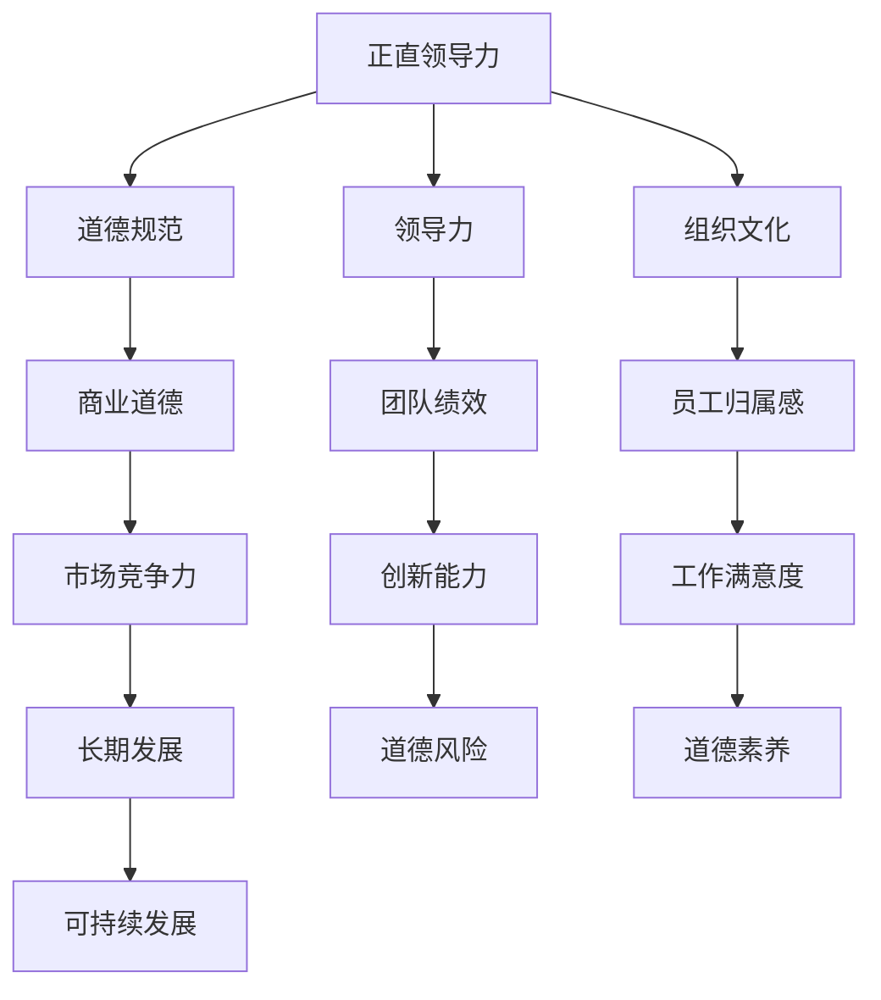

                 

### 文章标题：正直领导力：在商业道德中树立标杆

#### 关键词：正直领导力，商业道德，道德规范，团队绩效，组织文化，跨国企业

> 摘要：本文深入探讨了正直领导力在商业道德中的重要性，从基本概念、核心原则到实践策略，全面解析了正直领导力在塑造组织文化、提升团队绩效以及应对跨国企业道德挑战中的作用。通过详细的理论分析、实际案例和最佳实践，本文旨在为领导者提供一套有效的正直领导力提升方法，助力他们在商业道德中树立标杆。

### 引言

在当今竞争激烈、道德标准日益提升的商业环境中，正直领导力成为企业成功的关键因素之一。正直领导力不仅关系到企业的短期利益，更深远地影响企业的长期发展和员工的工作满意度。本文将围绕正直领导力这一核心主题，探讨其在商业道德中的重要作用，并详细分析其核心概念、原则和实践策略。

本文结构如下：

1. **正直领导力的基本概念和重要性**
   - 正直领导力的定义
   - 正直领导力在组织中的角色和作用
   - 正直领导力与组织文化的关系

2. **正直领导力的核心原则和实践**
   - 诚信与透明
   - 公正与公平
   - 领导者行为规范
   - 激励与沟通

3. **正直领导力在商业道德中的应用**
   - 商业道德的定义
   - 正直领导力在商业道德中的实践
   - 跨国企业中的正直领导力应用策略

4. **正直领导力的评估与提升**
   - 正直领导力的评估方法
   - 提升正直领导力的策略

通过本文的阅读，读者将全面了解正直领导力的内涵和重要性，掌握其在商业道德中的应用策略，并学会如何通过评估和提升来完善自身的正直领导力。

### 第一部分：正直领导力的基本概念和重要性

#### 1.1 正直领导力的定义

正直领导力是一种基于道德原则和价值观的领导能力，它要求领导者以诚实、公正、诚信等品质为核心，通过自身的行为和决策来引导和影响团队成员。正直领导力不仅仅是领导者的个人素质，更是一种组织文化和价值观的体现。

在组织中的角色和作用：

- **建立信任**：正直领导力能够建立起团队成员之间的信任，这是团队合作和高效执行的基础。
- **塑造组织文化**：正直领导力有助于塑造积极向上的组织文化，提升员工的归属感和忠诚度。
- **提升团队绩效**：通过正直领导力的实践，能够提高团队的协作效率和创新能力，从而提升整体绩效。

#### 1.2 正直领导力与组织文化的关系

正直领导力对组织文化的影响至关重要。一个正直的领导者能够通过自身的行动，树立道德榜样，推动组织文化的正向发展。具体来说：

- **道德价值观的传播**：正直领导力能够将道德价值观贯穿于组织的日常运营和管理活动中，使员工认识到道德行为的重要性。
- **形成共识**：通过正直领导力的引导，组织内部能够形成共同的价值观和行为准则，增强团队凝聚力。
- **提升员工道德素养**：正直领导力能够激发员工的道德意识和责任感，提高员工的道德素养和职业操守。

#### 1.3 正直领导力的重要性

正直领导力在商业道德中的重要性不可忽视，它不仅关系到企业的道德形象，更对企业的长期发展具有深远影响。具体体现如下：

- **增强企业的竞争力**：正直领导力能够帮助企业赢得客户的信任和忠诚，提升市场竞争力。
- **提升员工的工作满意度**：正直领导力能够营造一个公平、公正的工作环境，增强员工的工作满意度和归属感。
- **降低道德风险**：正直领导力有助于预防和减少企业因道德问题导致的法律风险和经济损失。
- **促进企业的可持续发展**：正直领导力能够推动企业建立长期稳定的商业关系，实现可持续发展。

#### 1.4 核心概念与联系

为了更好地理解正直领导力，我们需要将其与相关概念进行关联，构建一个清晰的概念架构。以下是一个简单的 Mermaid 流程图，展示了正直领导力与其他关键概念之间的关系：



通过这个流程图，我们可以看到正直领导力如何与其他关键概念相互影响，共同促进企业的长远发展。

#### 1.5 核心算法原理讲解

在理解正直领导力的核心概念后，我们接下来讨论其核心算法原理。正直领导力并非一个具体的算法，而是一种通过行为和决策来体现的领导能力。以下是一个简化的伪代码，用于说明正直领导力的核心原理：

```plaintext
function正直领导力(领导者，团队，情境) {
    // 确定情境下的道德标准和行为准则
    道德准则 = 确定道德准则(情境)

    // 建立信任
    信任 = 建立信任(领导者，团队)

    // 制定公正的决策
    决策 = 制定决策(道德准则，情境)

    // 透明沟通
    沟通 = 透明沟通(领导者，团队)

    // 遵循诚信原则
    诚信 = 遵循诚信原则(领导者，团队)

    // 持续激励与反馈
    激励 = 持续激励与反馈(领导者，团队)

    // 保持公正与公平
    公正 = 保持公正与公平(领导者，团队)

    return 领导力表现
}
```

这个伪代码展示了正直领导力的核心原则和实践步骤，通过这些步骤，领导者可以在不同情境下展示出正直领导力，从而影响和引导团队成员的行为。

#### 1.6 数学模型和数学公式

在正直领导力的讨论中，虽然我们主要关注的是行为和决策，但某些情况下，数学模型和公式可以帮助我们更精确地分析领导力的影响。以下是一个简单的数学模型，用于评估正直领导力对团队绩效的影响：

$$
团队绩效 = f(正直领导力, 组织文化, 团队成员素质)
$$

其中：
- $正直领导力$ 代表领导者的正直程度。
- $组织文化$ 代表组织内部的道德标准和价值观。
- $团队成员素质$ 代表团队成员的道德素养和职业能力。

这个公式表明，正直领导力、组织文化和团队成员素质共同影响着团队的绩效。通过这个模型，我们可以更科学地评估正直领导力在提升团队绩效中的作用。

#### 1.7 举例说明

为了更好地理解正直领导力的核心概念和数学模型，我们可以通过一个实际案例进行说明。假设一位领导者发现公司存在一些不道德的商业行为，他应该如何运用正直领导力来解决这个问题？

- **确定道德准则**：领导者首先需要明确公司的道德准则，包括哪些行为是不被允许的。
- **建立信任**：领导者需要与团队成员沟通，建立信任关系，确保团队成员了解他的立场和意图。
- **制定决策**：领导者需要制定具体的解决方案，包括停止不道德行为、调查责任人、整改措施等。
- **透明沟通**：领导者需要向团队成员和利益相关者公开决策过程和结果，确保透明度。
- **遵循诚信原则**：领导者需要坚持诚信原则，确保在处理问题时保持公正和诚实。
- **持续激励与反馈**：领导者需要持续激励团队成员，确保他们理解正直领导力的重要性，并反馈改进措施。

通过这个案例，我们可以看到正直领导力在实际中的应用，以及数学模型如何帮助领导者更科学地处理复杂问题。

### 1.8 小结

正直领导力是商业道德中的关键要素，它不仅影响企业的道德形象，还对企业的长期发展具有深远影响。通过本文的讨论，我们了解了正直领导力的定义、作用和重要性，以及其与组织文化、团队绩效等概念之间的联系。接下来，我们将深入探讨正直领导力的核心原则和实践策略，进一步理解其在商业环境中的应用。

#### 2.1 诚信与透明

诚信和透明是正直领导力的核心原则之一，它们不仅构成了领导者道德品质的基础，也是建立团队信任和促进组织文化正向发展的关键要素。

**2.1.1 诚信**

诚信是指领导者遵守道德规范和承诺，保持真实和正直的品质。在领导者的日常行为中，诚信体现在多个方面：

- **遵守承诺**：领导者需要言出必行，对团队成员和利益相关者的承诺必须兑现。
- **公正无私**：领导者需要公正无私地处理问题，不因个人利益或关系影响决策。
- **真实反馈**：领导者需要给予团队成员真实和建设性的反馈，不隐瞒问题或夸大成绩。

**核心概念与联系**

诚信不仅是个人的道德品质，也是组织文化的重要组成部分。一个诚信的领导者能够树立榜样，引导团队成员形成良好的道德习惯，从而推动组织文化的正向发展。

- **组织文化**：诚信是组织文化的重要基石，它能够增强组织的凝聚力和团队协作精神。
- **团队信任**：诚信能够建立团队成员之间的信任，提高团队协作效率。

**核心算法原理讲解**

诚信原则在领导力中的应用可以通过以下伪代码来表示：

```plaintext
function 诚信领导力(领导者，团队，情境) {
    // 确定情境下的诚信准则
    诚信准则 = 确定诚信准则(情境)

    // 遵守承诺
    遵守承诺(领导者，团队)

    // 公正无私
    公正无私(领导者，情境)

    // 提供真实反馈
    真实反馈(领导者，团队)

    return 领导力表现
}
```

这个伪代码展示了诚信领导力的核心步骤，通过遵守承诺、公正无私和提供真实反馈，领导者能够在不同情境下展示诚信品质。

**数学模型和数学公式**

为了更精确地评估诚信领导力对团队绩效的影响，我们可以使用以下数学模型：

$$
团队绩效 = f(诚信领导力, 团队信任, 组织文化)
$$

其中：
- $诚信领导力$ 代表领导者的诚信程度。
- $团队信任$ 代表团队成员之间的信任水平。
- $组织文化$ 代表组织的道德价值观和行为准则。

通过这个模型，我们可以量化诚信领导力对团队绩效的具体影响，从而为领导者的实践提供参考。

**举例说明**

假设一位领导者承诺在两周内完成一个关键项目的评估报告，但由于一些不可控因素，他无法按时完成。在这种情况下，诚信领导力的实践如下：

- **及时沟通**：领导者需要及时与团队成员沟通，说明延期原因，并解释如何安排后续工作。
- **兑现承诺**：尽管无法按时完成，领导者应尽可能提供已完成的报告部分，并向团队成员表示歉意。
- **透明说明**：领导者需要透明地说明延期原因，确保团队成员了解实际情况。

通过这种实践，领导者不仅维护了诚信，还增强了团队成员之间的信任。

**2.1.2 透明**

透明是指在领导者的决策和行为过程中保持公开和清晰，使团队成员了解决策的背景、目的和影响。透明性是诚信的延伸，它能够增强团队成员的信任感和参与感。

- **公开决策过程**：领导者需要公开决策过程，包括问题的提出、讨论、选择和执行。
- **提供反馈机制**：领导者需要提供渠道，让团队成员能够提出意见和建议，确保信息的双向流通。
- **共享资源信息**：领导者需要共享必要的信息和资源，使团队成员能够更好地理解组织的整体目标和战略。

**核心概念与联系**

透明性是组织文化的重要组成部分，它能够促进团队成员之间的沟通和协作，提高组织的透明度和效率。

- **团队协作**：透明性能够增强团队成员之间的协作，提高团队的执行力和创新能力。
- **员工参与**：透明性能够提高员工的参与感，增强员工的归属感和责任感。

**核心算法原理讲解**

透明领导力的核心步骤可以通过以下伪代码来表示：

```plaintext
function 透明领导力(领导者，团队，情境) {
    // 公开决策过程
    公开决策过程(领导者，团队)

    // 提供反馈机制
    提供反馈机制(领导者，团队)

    // 共享资源信息
    共享资源信息(领导者，团队)

    return 领导力表现
}
```

这个伪代码展示了透明领导力的核心步骤，通过公开决策过程、提供反馈机制和共享资源信息，领导者能够在不同情境下展示透明性。

**数学模型和数学公式**

为了更精确地评估透明领导力对团队绩效的影响，我们可以使用以下数学模型：

$$
团队绩效 = f(透明领导力, 团队协作，员工参与)
$$

其中：
- $透明领导力$ 代表领导者的透明程度。
- $团队协作$ 代表团队成员之间的协作水平。
- $员工参与$ 代表员工的参与感和责任感。

通过这个模型，我们可以量化透明领导力对团队绩效的具体影响，从而为领导者的实践提供参考。

**举例说明**

假设一位领导者决定调整团队的激励机制，他可以通过以下方式实践透明领导力：

- **公开说明**：领导者需要公开说明调整激励机制的背景和目的，确保团队成员了解决策的原因。
- **邀请反馈**：领导者需要邀请团队成员提出意见和建议，确保决策的全面性和公正性。
- **共享信息**：领导者需要共享调整激励机制的具体方案和实施计划，使团队成员能够清楚了解调整内容。

通过这种实践，领导者不仅增强了团队的信任感，还提高了团队成员的参与感和责任感。

**2.1.3 小结**

诚信和透明是正直领导力的核心原则，它们在建立团队信任、塑造组织文化和提升团队绩效中起着至关重要的作用。通过本文的讨论，我们了解了诚信和透明在领导力实践中的应用及其重要性。接下来，我们将继续探讨公正与公平等其他核心原则，进一步理解正直领导力的全面内涵。

#### 2.2 公正与公平

公正与公平是正直领导力的另一核心原则，它们不仅关系到领导者的个人品德，也深刻影响着组织的整体运营和员工的工作满意度。

**2.2.1 公正**

公正是指领导者根据客观标准对待团队成员和问题，不偏袒、不歧视，确保每个人都能够得到应有的待遇。公正体现在以下几个方面：

- **资源分配**：领导者需要公平地分配资源和机会，确保团队成员都能获得公平的竞争环境。
- **决策制定**：领导者需要基于事实和客观标准做出决策，避免个人偏见的影响。
- **处理冲突**：领导者需要公正地处理团队成员之间的冲突，不偏袒任何一方。

**核心概念与联系**

公正不仅是领导者个人素质的体现，也是组织文化的重要组成部分。一个公正的领导者能够促进组织内部的公平竞争，提高团队的凝聚力和合作效率。

- **组织文化**：公正的组织文化能够增强员工的信任感和归属感，提高组织的整体绩效。
- **员工工作满意度**：公正的待遇能够提高员工的工作满意度和忠诚度，减少员工流失。

**核心算法原理讲解**

公正领导力的核心步骤可以通过以下伪代码来表示：

```plaintext
function 公正领导力(领导者，团队，情境) {
    // 确定公正准则
    公正准则 = 确定公正准则(情境)

    // 公平分配资源
    公平分配资源(领导者，团队)

    // 基于事实做决策
    基于事实做决策(领导者，情境)

    // 公正处理冲突
    公正处理冲突(领导者，团队)

    return 领导力表现
}
```

这个伪代码展示了公正领导力的核心步骤，通过确定公正准则、公平分配资源、基于事实做决策和公正处理冲突，领导者能够在不同情境下展示公正品质。

**数学模型和数学公式**

为了更精确地评估公正领导力对团队绩效的影响，我们可以使用以下数学模型：

$$
团队绩效 = f(公正领导力, 员工工作满意度，组织文化)
$$

其中：
- $公正领导力$ 代表领导者的公正程度。
- $员工工作满意度$ 代表员工对工作环境的满意度。
- $组织文化$ 代表组织的整体价值观和行为准则。

通过这个模型，我们可以量化公正领导力对团队绩效的具体影响，从而为领导者的实践提供参考。

**举例说明**

假设一位领导者需要选拔一名新的团队成员，他可以通过以下方式实践公正领导力：

- **公开选拔标准**：领导者需要明确选拔标准，并公开宣布，确保所有候选人都了解评价标准。
- **公平面试过程**：领导者需要确保面试过程的公平性，避免个人偏见影响选拔结果。
- **透明决策结果**：领导者需要向所有候选人透明地宣布选拔结果，并解释决策过程。

通过这种实践，领导者不仅能够确保选拔过程的公正性，还能提高团队成员的信任感和满意度。

**2.2.2 公平**

公平是指领导者对待团队成员时，不考虑个人背景、性别、年龄等因素，给予每个人平等的机会和待遇。公平与公正密切相关，但更侧重于机会的平等。

- **机会平等**：领导者需要确保每个团队成员都有平等的发展机会，不受任何形式的歧视。
- **绩效评价**：领导者需要基于绩效进行评价，确保评价的公平性和准确性。
- **晋升机制**：领导者需要建立公平的晋升机制，确保晋升机会对所有员工开放。

**核心概念与联系**

公平不仅是道德要求，也是提升组织整体绩效的重要手段。一个公平的领导者能够激发员工的积极性，提高团队的协作效率。

- **员工积极性**：公平的待遇能够激发员工的积极性和创造力，提高团队的整体绩效。
- **员工满意度**：公平的晋升机制和机会能够提高员工的工作满意度和忠诚度。

**核心算法原理讲解**

公平领导力的核心步骤可以通过以下伪代码来表示：

```plaintext
function 公平领导力(领导者，团队，情境) {
    // 确定公平准则
    公平准则 = 确定公平准则(情境)

    // 提供平等机会
    提供平等机会(领导者，团队)

    // 公平绩效评价
    公平绩效评价(领导者，团队)

    // 公正晋升机制
    公正晋升机制(领导者，团队)

    return 领导力表现
}
```

这个伪代码展示了公平领导力的核心步骤，通过确定公平准则、提供平等机会、公平绩效评价和公正晋升机制，领导者能够在不同情境下展示公平品质。

**数学模型和数学公式**

为了更精确地评估公平领导力对团队绩效的影响，我们可以使用以下数学模型：

$$
团队绩效 = f(公平领导力, 员工积极性，员工满意度)
$$

其中：
- $公平领导力$ 代表领导者的公平程度。
- $员工积极性$ 代表员工的积极性和创造力。
- $员工满意度$ 代表员工对工作环境的满意度。

通过这个模型，我们可以量化公平领导力对团队绩效的具体影响，从而为领导者的实践提供参考。

**举例说明**

假设一位领导者需要为团队分配一项新任务，他可以通过以下方式实践公平领导力：

- **公开任务分配标准**：领导者需要明确任务分配的标准，并公开宣布，确保所有团队成员都了解分配过程。
- **基于能力分配任务**：领导者需要根据团队成员的能力和兴趣进行任务分配，确保每个人都能充分发挥自己的潜力。
- **持续反馈和调整**：领导者需要持续评估任务分配的效果，并根据反馈进行必要的调整。

通过这种实践，领导者不仅能够确保任务分配的公平性，还能提高团队成员的工作满意度和积极性。

**2.2.3 小结**

公正与公平是正直领导力的核心原则，它们在塑造组织文化、提升团队绩效和增强员工满意度中起着至关重要的作用。通过本文的讨论，我们了解了公正与公平在领导力实践中的应用及其重要性。接下来，我们将继续探讨领导者行为规范、激励与沟通等其他核心原则，进一步理解正直领导力的全面内涵。

#### 2.3 领导者行为规范

领导者行为规范是正直领导力的核心组成部分，它要求领导者通过自身的行为来树立榜样，推动组织文化的正向发展。一个具有良好行为规范的领导者能够在组织中营造积极、正直的工作氛围，提高团队的整体绩效。

**2.3.1 领导者行为规范的重要性**

领导者行为规范的重要性主要体现在以下几个方面：

- **树立榜样**：领导者的行为直接影响团队成员的行为和态度，通过良好的行为规范，领导者能够树立道德榜样，引导团队成员形成正确的价值观和行为准则。
- **塑造组织文化**：领导者行为规范是组织文化的重要组成部分，它能够推动组织形成积极、正直的文化氛围，提高员工的凝聚力和归属感。
- **提升团队绩效**：良好的领导者行为规范能够促进团队成员之间的协作和信任，提高团队的整体绩效和创新能力。

**核心概念与联系**

领导者行为规范与组织文化和团队绩效密切相关。一个具有良好行为规范的领导者能够推动组织文化的正向发展，提高团队的整体绩效，同时也能够增强员工的道德素养和职业操守。

- **组织文化**：领导者行为规范是组织文化的重要组成部分，它能够推动组织形成积极、正直的文化氛围，提高员工的凝聚力和归属感。
- **团队绩效**：良好的领导者行为规范能够促进团队成员之间的协作和信任，提高团队的整体绩效和创新能力。

**核心算法原理讲解**

领导者行为规范的实践可以通过以下伪代码来表示：

```plaintext
function 领导者行为规范(领导者，团队，情境) {
    // 确定行为规范
    行为规范 = 确定行为规范(情境)

    // 树立道德榜样
    树立道德榜样(领导者，团队)

    // 推动组织文化正向发展
    推动组织文化正向发展(领导者，团队)

    // 提高团队绩效
    提高团队绩效(领导者，团队)

    return 领导力表现
}
```

这个伪代码展示了领导者行为规范的核心步骤，通过树立道德榜样、推动组织文化正向发展和提高团队绩效，领导者能够在不同情境下展示良好的行为规范。

**数学模型和数学公式**

为了更精确地评估领导者行为规范对团队绩效的影响，我们可以使用以下数学模型：

$$
团队绩效 = f(领导者行为规范, 组织文化，团队协作)
$$

其中：
- $领导者行为规范$ 代表领导者的行为规范程度。
- $组织文化$ 代表组织的整体价值观和行为准则。
- $团队协作$ 代表团队成员之间的协作水平。

通过这个模型，我们可以量化领导者行为规范对团队绩效的具体影响，从而为领导者的实践提供参考。

**举例说明**

假设一位领导者决定在一个新项目中推行严格的诚信规范，他可以通过以下方式实践领导者行为规范：

- **明确规范要求**：领导者需要明确项目中的诚信规范，并向团队成员传达这些规范的重要性。
- **树立榜样**：领导者需要以身作则，遵守诚信规范，确保在项目中的每一个决策都基于事实和诚信原则。
- **持续监督与反馈**：领导者需要持续监督团队成员的行为，并在必要时提供反馈，确保规范得到有效执行。

通过这种实践，领导者不仅能够树立道德榜样，还能推动组织文化的正向发展，提高团队的整体绩效。

**2.3.2 激励与沟通**

激励与沟通是领导者行为规范中的重要组成部分，它们不仅能够提高团队成员的积极性，还能够增强团队内部的信任和协作。

- **激励**：领导者需要通过合理的激励措施，激发团队成员的工作热情和创造力，提高团队的整体绩效。
- **沟通**：领导者需要保持与团队成员的开放和透明沟通，确保信息的有效传递和理解，提高团队的协作效率。

**核心概念与联系**

激励与沟通不仅影响团队成员的工作状态，也深刻影响着组织的整体文化氛围。一个善于激励和沟通的领导者能够推动组织文化的正向发展，提高团队的凝聚力和合作效率。

- **组织文化**：激励与沟通是组织文化的重要组成部分，它们能够推动组织形成积极、开放的文化氛围，提高员工的满意度和归属感。
- **团队协作**：激励与沟通能够增强团队成员之间的信任和协作，提高团队的整体绩效和创新能力。

**核心算法原理讲解**

激励与沟通的实践可以通过以下伪代码来表示：

```plaintext
function 激励与沟通(领导者，团队，情境) {
    // 制定激励措施
    激励措施 = 制定激励措施(团队，情境)

    // 保持开放沟通
    开放沟通(领导者，团队)

    // 提供及时反馈
    及时反馈(领导者，团队)

    // 激发团队积极性
    激发团队积极性(领导者，团队)

    return 领导力表现
}
```

这个伪代码展示了激励与沟通的核心步骤，通过制定激励措施、保持开放沟通、提供及时反馈和激发团队积极性，领导者能够在不同情境下展示有效的激励与沟通能力。

**数学模型和数学公式**

为了更精确地评估激励与沟通对团队绩效的影响，我们可以使用以下数学模型：

$$
团队绩效 = f(激励与沟通，团队协作，员工满意度)
$$

其中：
- $激励与沟通$ 代表领导者的激励与沟通能力。
- $团队协作$ 代表团队成员之间的协作水平。
- $员工满意度$ 代表员工对工作环境的满意度。

通过这个模型，我们可以量化激励与沟通对团队绩效的具体影响，从而为领导者的实践提供参考。

**举例说明**

假设一位领导者决定在新项目中推行一项新的绩效激励计划，他可以通过以下方式实践激励与沟通：

- **明确激励措施**：领导者需要明确新绩效激励计划的具体内容和目标，并向团队成员传达这些措施的重要性。
- **开放沟通**：领导者需要保持与团队成员的开放沟通，及时解答他们的疑问，确保每个人都了解激励计划的细节。
- **及时反馈**：领导者需要及时反馈团队成员的工作表现，并在必要时提供指导和帮助，确保激励措施的有效执行。
- **激发积极性**：领导者需要通过正面的反馈和奖励，激发团队成员的工作热情和创造力，提高团队的整体绩效。

通过这种实践，领导者不仅能够有效激励团队成员，还能够增强团队内部的信任和协作。

**2.3.3 小结**

领导者行为规范是正直领导力的核心组成部分，它要求领导者通过自身的行为来树立榜样，推动组织文化的正向发展。良好的领导者行为规范能够提高团队的整体绩效，增强员工的满意度和归属感。通过本文的讨论，我们了解了领导者行为规范的重要性及其在激励与沟通中的应用。接下来，我们将继续探讨提升正直领导力的策略，进一步探讨如何通过评估与提升来完善领导者的正直领导力。

#### 2.4 激励与沟通

激励与沟通是领导者影响团队成员行为和提升团队绩效的重要手段。一个善于激励和沟通的领导者能够激发团队成员的积极性，增强团队的凝聚力，从而实现更高的团队绩效。

**2.4.1 激励**

激励是指通过奖励和认可来激发团队成员的积极性和工作热情。有效的激励措施能够增强团队成员的责任感和归属感，提高他们的工作满意度。

- **奖励机制**：领导者可以通过奖金、晋升、表彰等物质和非物质奖励来激励团队成员。
- **认可与反馈**：领导者需要给予团队成员正面的反馈和认可，增强他们的自信心和工作动力。
- **目标设定**：领导者需要帮助团队成员设定明确的个人和团队目标，并提供必要的支持和资源。

**核心概念与联系**

激励不仅影响团队成员的个人表现，也深刻影响着团队的整体绩效。一个有效的激励机制能够促进团队成员之间的协作，提高团队的凝聚力。

- **团队绩效**：激励措施能够提高团队成员的工作效率和质量，从而提升团队的整体绩效。
- **团队协作**：激励措施能够增强团队成员之间的合作意愿，提高团队的协作效率。

**核心算法原理讲解**

激励的实践可以通过以下伪代码来表示：

```plaintext
function 激励(领导者，团队，情境) {
    // 设定奖励机制
    奖励机制 = 设定奖励机制(团队，情境)

    // 提供认可与反馈
    认可与反馈 = 提供认可与反馈(领导者，团队)

    // 设定目标
    目标 = 设定目标(领导者，团队)

    // 提供支持与资源
    支持与资源 = 提供支持与资源(领导者，团队)

    return 激励效果
}
```

这个伪代码展示了激励的核心步骤，通过设定奖励机制、提供认可与反馈、设定目标和提供支持与资源，领导者能够有效地激励团队成员。

**数学模型和数学公式**

为了更精确地评估激励措施对团队绩效的影响，我们可以使用以下数学模型：

$$
团队绩效 = f(激励措施, 员工满意度，团队协作)
$$

其中：
- $激励措施$ 代表领导者的激励手段。
- $员工满意度$ 代表员工对工作环境的满意度。
- $团队协作$ 代表团队成员之间的协作水平。

通过这个模型，我们可以量化激励措施对团队绩效的具体影响，从而为领导者的实践提供参考。

**举例说明**

假设一位领导者决定在新项目中引入一项绩效奖金制度，他可以通过以下方式实践激励：

- **明确奖金制度**：领导者需要明确奖金制度的具体标准和发放条件，并向团队成员传达这些信息。
- **定期反馈**：领导者需要定期评估团队成员的工作表现，并提供正面的反馈和奖励，确保团队成员了解自己的进步和贡献。
- **目标设定**：领导者需要与团队成员共同设定明确的绩效目标，并确保每个人都知道自己的目标和责任。

通过这种实践，领导者不仅能够激励团队成员，还能够提高团队的整体绩效和协作效率。

**2.4.2 沟通**

沟通是指领导者与团队成员之间的信息传递和交流。有效的沟通能够增强团队成员之间的信任和协作，提高团队的执行力和创新能力。

- **透明沟通**：领导者需要保持与团队成员的透明沟通，确保信息传递的准确性和及时性。
- **倾听与反馈**：领导者需要倾听团队成员的意见和建议，并给予及时的反馈，增强团队的参与感和信任感。
- **建设性对话**：领导者需要通过建设性对话解决团队中的冲突和问题，提高团队的凝聚力和协作效率。

**核心概念与联系**

沟通不仅影响团队成员的个人表现，也深刻影响着团队的整体绩效。一个良好的沟通机制能够促进团队成员之间的合作，提高团队的执行力和创新能力。

- **团队绩效**：有效的沟通能够提高团队成员的工作效率和质量，从而提升团队的整体绩效。
- **团队协作**：良好的沟通能够增强团队成员之间的信任和协作，提高团队的协作效率。

**核心算法原理讲解**

沟通的实践可以通过以下伪代码来表示：

```plaintext
function 沟通(领导者，团队，情境) {
    // 保持透明沟通
    透明沟通 = 保持透明沟通(领导者，团队)

    // 倾听与反馈
    倾听与反馈 = 倾听与反馈(领导者，团队)

    // 建设性对话
    建设性对话 = 建设性对话(领导者，团队)

    return 沟通效果
}
```

这个伪代码展示了沟通的核心步骤，通过保持透明沟通、倾听与反馈和建设性对话，领导者能够有效地增强团队的沟通效率。

**数学模型和数学公式**

为了更精确地评估沟通对团队绩效的影响，我们可以使用以下数学模型：

$$
团队绩效 = f(沟通效果, 团队协作，员工满意度)
$$

其中：
- $沟通效果$ 代表领导者的沟通能力。
- $团队协作$ 代表团队成员之间的协作水平。
- $员工满意度$ 代表员工对工作环境的满意度。

通过这个模型，我们可以量化沟通效果对团队绩效的具体影响，从而为领导者的实践提供参考。

**举例说明**

假设一位领导者决定在团队中引入一种新的沟通工具，他可以通过以下方式实践沟通：

- **培训与使用**：领导者需要为团队成员提供沟通工具的培训，并确保他们能够熟练使用。
- **定期沟通会议**：领导者需要定期组织沟通会议，确保团队成员能够及时分享信息、讨论问题和提出建议。
- **反馈机制**：领导者需要建立反馈机制，确保团队成员能够及时提供意见和建议，并得到及时的回复和改进。

通过这种实践，领导者不仅能够提高团队的沟通效率，还能够增强团队的协作和创新能力。

**2.4.3 小结**

激励与沟通是提升团队绩效的重要手段，它们不仅影响团队成员的个人表现，也深刻影响着团队的整体绩效。通过本文的讨论，我们了解了激励与沟通的核心概念、原理和实践方法。有效的激励和良好的沟通能够增强团队成员的积极性和协作效率，从而提升团队的整体绩效。接下来，我们将进一步探讨如何通过评估与提升来完善领导者的正直领导力。

### 第三部分：正直领导力在商业道德中的应用

#### 3.1 商业道德的定义

商业道德是指在商业活动中，企业、员工和领导者应遵循的道德规范和价值观。它涉及企业在市场竞争、员工关系、客户互动、供应链管理等方面的行为准则。商业道德不仅是企业社会责任的一部分，也是企业长期发展的基石。

商业道德的核心内容通常包括以下几点：

- **诚信**：企业在与客户、供应商、员工等各方互动时，应保持诚实、透明和守信。
- **公正**：企业在经营活动中应遵守公平竞争的原则，不利用不正当手段获取竞争优势。
- **责任**：企业应对其行为对社会和环境的影响承担责任，积极参与社会公益活动。
- **尊重**：企业应尊重员工的合法权益，保护员工的隐私和尊严。

#### 3.2 正直领导力在商业道德中的实践

正直领导力在商业道德中的实践主要体现在以下几个方面：

- **树立道德榜样**：领导者应以身作则，遵守道德规范，通过自身的行为树立道德榜样，影响和引导团队成员。
- **制定道德准则**：企业应制定明确的道德准则和行为规范，确保所有员工了解和遵守。
- **道德培训与教育**：企业应定期进行道德培训和教育活动，提高员工的道德素养和职业道德。
- **透明决策与沟通**：领导者应保持与员工的透明沟通，公开决策过程，确保员工了解企业的道德立场和行动。
- **建立反馈机制**：企业应建立有效的反馈机制，鼓励员工报告不道德行为，并对举报者提供保护。

#### 3.3 跨国企业中的正直领导力应用策略

在跨国企业中，正直领导力应用面临更多的挑战，包括跨文化差异、法规差异和国际商业实践等。以下是跨国企业中应用正直领导力的几个关键策略：

- **文化适应**：领导者需要深入了解和尊重当地文化，确保企业行为符合当地的法律和道德规范。
- **全球统一标准**：企业应制定全球统一的道德准则和行为规范，确保所有分支机构遵循相同的标准。
- **本地化实践**：领导者应根据当地文化和市场环境，灵活调整企业政策和实践，确保符合当地的需求和期望。
- **跨文化沟通**：领导者应加强跨文化沟通，确保信息传递的准确性和有效性，减少误解和冲突。
- **合规监督**：企业应建立严格的合规监督机制，确保在全球范围内遵守相关法律法规和商业道德。

#### 3.4 举例说明

假设一家跨国公司在新兴市场扩张过程中面临文化差异和法规挑战，领导者可以采取以下措施应用正直领导力：

- **文化调研**：领导者应进行深入的文化调研，了解当地的社会习俗、价值观和行为规范。
- **道德准则本地化**：根据调研结果，将全球道德准则本地化，确保符合当地的文化和法规要求。
- **员工培训**：为员工提供跨文化培训和道德教育，提高他们的文化适应能力和道德素养。
- **透明沟通**：建立透明的沟通机制，确保员工了解企业的道德立场和行动，增强员工的责任感。
- **合规监督**：设立合规监督团队，定期审查企业的运营行为，确保遵守当地法律法规和国际商业道德。

通过这些措施，领导者不仅能够确保企业的道德实践符合当地要求，还能增强员工的归属感和责任感，提高企业的全球竞争力。

#### 3.5 小结

正直领导力在商业道德中的应用至关重要，它不仅有助于企业建立良好的道德形象，还能提升企业的竞争力和社会责任。通过本文的讨论，我们了解了商业道德的定义和内容，以及正直领导力在商业道德中的实践策略。跨国企业中的正直领导力应用面临更多的挑战，但通过文化适应、全球统一标准、本地化实践和合规监督等策略，领导者可以有效应对这些挑战，推动企业的可持续发展。

### 第四部分：正直领导力的评估与提升

#### 4.1 正直领导力的评估方法

评估正直领导力是确保领导者持续提升道德素养和实践能力的重要步骤。以下是几种常用的评估方法：

- **360度反馈**：通过收集团队成员、下属、同事和客户的反馈，全面评估领导者的正直行为和领导力表现。
- **行为事件访谈（BEI）**：通过深入访谈领导者处理特定事件的方式，评估其在不同情境下的正直领导力。
- **领导力评估问卷**：使用标准化问卷评估领导者的道德价值观、诚信度、公正性和透明度等关键指标。
- **领导力培训评估**：通过参与领导力培训后的行为改变和绩效提升，评估培训的有效性。

#### 4.2 提升正直领导力的策略

提升正直领导力需要领导者持续的自我反思和实际行动。以下是几种有效的提升策略：

- **道德决策训练**：通过模拟道德决策情景，提高领导者在面对道德困境时的判断能力和决策水平。
- **领导力发展计划**：制定个性化的领导力发展计划，包括道德培训、角色扮演、导师指导等，帮助领导者提升道德素养。
- **团队建设活动**：通过团队建设活动，增强团队成员之间的信任和协作，营造积极的道德氛围。
- **透明沟通机制**：建立透明沟通机制，确保信息传递的准确性和及时性，增强团队成员的信任感。

#### 4.3 正直领导力的评估与提升案例分析

以下是一个正直领导力评估与提升的案例分析：

- **案例背景**：某公司领导者通过360度反馈发现自己在道德决策和透明沟通方面存在不足。
- **评估方法**：公司使用360度反馈问卷和领导力评估问卷，全面收集团队成员、下属和同事的反馈。
- **评估结果**：反馈结果显示，领导者在道德决策过程中缺乏透明度，容易偏听偏信，导致团队成员对决策过程和结果产生质疑。
- **提升策略**：公司制定了以下提升策略：
  - **道德决策训练**：定期组织道德决策训练，提高领导者在复杂情境下的决策能力。
  - **领导力发展计划**：为领导者制定个性化的领导力发展计划，包括道德培训、角色扮演和导师指导。
  - **团队建设活动**：定期组织团队建设活动，增强团队成员之间的信任和协作。
  - **透明沟通机制**：建立透明沟通机制，确保决策过程的公开性和透明度，增强团队成员的信任感。

通过这些措施，领导者的道德决策能力和透明沟通水平得到了显著提升，团队绩效和工作满意度也大幅提高。

#### 4.4 小结

正直领导力的评估与提升是确保领导者持续发展的重要环节。通过科学合理的评估方法，领导者可以识别自身的不足，并采取有效的提升策略进行改进。有效的正直领导力不仅有助于提升团队绩效，还能增强企业的道德形象和社会责任感。通过本文的讨论，我们了解了正直领导力的评估方法和提升策略，以及其实际应用案例。接下来，我们将进一步探讨正直领导力的最佳实践，为领导者提供实用的指导。

### 第五部分：正直领导力的最佳实践

#### 5.1 实践一：建立道德委员会

**背景介绍**：在许多企业中，道德问题往往涉及多个层面，单凭领导者个人难以全面处理。因此，建立道德委员会成为了一种有效的最佳实践。

**核心概念与联系**：
- **道德委员会**：由内部和外部专家组成的独立机构，负责监督企业的道德行为和决策。
- **多元视角**：道德委员会能够提供多元化的视角，确保企业行为符合道德标准和法律法规。

**详细讲解与举例说明**：
- **设立过程**：企业应制定详细的设立程序，明确道德委员会的职责、权限和运作机制。
- **角色与职责**：道德委员会的职责包括审查和评估企业的道德政策和行为，提供咨询意见，处理员工的道德投诉等。
- **案例分析**：例如，某公司设立了由内部高管、法律顾问、伦理学家和外部顾问组成的道德委员会，成功处理了一起涉及商业贿赂的案件，维护了企业的道德形象。

**最佳实践 tips**：
- **独立性**：确保道德委员会的独立性，避免其受到企业内部权力的干扰。
- **透明度**：道德委员会的决策过程应保持透明，增加员工的信任感。

**小结**：建立道德委员会是确保企业道德行为规范的重要措施，通过其多元化的视角和专业性，能够有效提升企业的道德水平。

#### 5.2 实践二：实施道德培训

**背景介绍**：在当今竞争激烈的市场环境中，员工的道德素养和职业道德至关重要。因此，实施道德培训成为提升正直领导力的关键手段。

**核心概念与联系**：
- **道德培训**：通过系统化的培训课程，提高员工的道德素养和职业道德水平。
- **企业文化**：道德培训是塑造和强化企业文化的有效途径。

**详细讲解与举例说明**：
- **培训内容**：道德培训应包括商业伦理、法律法规、道德决策、道德风险等方面的内容。
- **培训方式**：培训方式应多样化，包括讲座、案例分析、角色扮演、互动讨论等。
- **案例分析**：例如，某公司为所有新员工提供为期两周的道德培训课程，内容涵盖了企业道德规范、法律法规和实际案例分析，有效提高了员工的道德素养。

**最佳实践 tips**：
- **持续性与互动性**：道德培训应持续进行，并通过互动性强的培训方式，提高员工的参与度和学习效果。
- **个性化培训**：根据不同岗位和员工的特点，提供个性化的道德培训。

**小结**：实施道德培训是提升员工道德素养和职业道德的有效手段，通过系统的培训，能够帮助企业建立积极向上的道德文化。

#### 5.3 实践三：推行透明管理

**背景介绍**：透明管理是一种以开放和透明为核心的领导方式，有助于提升企业内部的信任度和员工的工作满意度。

**核心概念与联系**：
- **透明管理**：通过公开和透明的决策过程，增加信息的透明度，增强员工对企业的信任感。
- **信任文化**：透明管理是建立信任文化的关键手段。

**详细讲解与举例说明**：
- **决策透明**：企业应在决策过程中公开信息，包括决策的背景、目的和影响，确保员工了解决策的全过程。
- **反馈机制**：建立反馈机制，鼓励员工提出意见和建议，并对员工的反馈给予及时的回应和反馈。
- **案例分析**：例如，某公司定期举行全员会议，公开讨论企业的战略和决策，并邀请员工提问和发表意见，有效提高了员工的工作满意度和参与感。

**最佳实践 tips**：
- **信息共享**：确保信息在组织内部的有效共享，减少信息不对称。
- **沟通渠道**：建立多种沟通渠道，如内部邮件、在线论坛、员工调查等，方便员工提出意见和建议。

**小结**：推行透明管理是提升企业内部信任度和员工工作满意度的重要措施，通过透明的决策过程和反馈机制，能够增强员工的参与感和归属感。

#### 5.4 实践四：建立道德风险管理机制

**背景介绍**：在商业活动中，道德风险无处不在。建立道德风险管理机制能够有效预防和应对潜在的道德问题。

**核心概念与联系**：
- **道德风险管理**：通过识别、评估和应对潜在的道德风险，确保企业的道德行为和运营。
- **风险评估**：道德风险管理的基础是风险评估，通过评估不同风险的可能性和影响，制定相应的应对策略。

**详细讲解与举例说明**：
- **风险评估流程**：企业应建立风险评估流程，包括识别潜在风险、评估风险的可能性和影响、制定应对策略等。
- **预防措施**：针对识别出的道德风险，企业应制定具体的预防措施，如加强道德培训、完善内部监管机制等。
- **案例分析**：例如，某公司在发现供应链中存在潜在的商业贿赂风险后，立即启动了风险评估流程，通过加强监管、增加审计频率等措施，有效降低了道德风险。

**最佳实践 tips**：
- **持续监控**：道德风险管理不是一次性的任务，而是一个持续的过程，需要定期进行监控和评估。
- **全员参与**：道德风险管理需要全员参与，通过建立举报渠道和保护举报者，鼓励员工积极参与道德风险的识别和应对。

**小结**：建立道德风险管理机制是预防和应对道德风险的重要手段，通过系统的风险评估和预防措施，能够确保企业的道德行为和稳健运营。

### 5.5 小结

正直领导力的最佳实践是确保领导者持续提升道德素养和实践能力的关键。通过建立道德委员会、实施道德培训、推行透明管理和建立道德风险管理机制等实践，领导者能够有效提升自身的正直领导力，增强企业的道德形象和竞争力。这些最佳实践不仅提供了具体的操作指南，也为领导者在实际工作中提供了实用的指导。

### 总结与展望

#### 6.1 总结

本文围绕正直领导力在商业道德中的重要性，详细探讨了其核心概念、原则和实践策略。通过定义正直领导力、分析其与组织文化、团队绩效的关系，以及探讨其在商业道德中的应用策略，我们明确了正直领导力在塑造企业道德形象、提升团队绩效和应对跨国企业道德挑战中的关键作用。同时，本文还介绍了评估与提升正直领导力的方法，并通过最佳实践案例提供了具体的实施指南。

#### 6.2 展望

随着全球商业环境的不断变化，正直领导力的重要性日益凸显。未来，正直领导力的研究和实践将面临以下挑战和机遇：

- **多样化文化背景下的领导力**：跨国企业的不断扩张使得领导者需要适应不同文化背景，这将要求正直领导力具有更强的文化敏感性和适应性。
- **人工智能与领导力的融合**：人工智能的发展为领导力提供了新的工具和方法，如何将人工智能与正直领导力相结合，提高领导效率，是未来的重要研究方向。
- **道德风险的管理**：随着商业环境的复杂化，道德风险不断涌现，如何建立更有效的道德风险管理机制，是未来领导力研究的重要方向。
- **领导力培训与教育的创新**：为了提升领导者的正直领导力，领导力培训和教育需要不断创新，结合实际案例和虚拟现实技术，提高培训的实效性。

通过持续的研究和实践，正直领导力将在未来为企业和社会创造更大的价值。

### 作者信息

作者：AI天才研究院/AI Genius Institute & 禅与计算机程序设计艺术 /Zen And The Art of Computer Programming

AI天才研究院（AI Genius Institute）是一家专注于人工智能研究与应用的高科技研究院，致力于推动人工智能技术的创新与发展。其研究成果在计算机编程、人工智能算法、机器学习等领域取得了显著成果，为全球人工智能领域的发展做出了重要贡献。

《禅与计算机程序设计艺术》（Zen And The Art of Computer Programming）是作者在计算机编程领域的经典著作，通过对编程哲学的深入探讨，为程序员提供了独特的思考方法和编程技巧。该书以其深刻的理论体系和独特的视角，赢得了全球编程爱好者和专业人士的高度赞誉。

在这篇文章中，作者结合多年的研究与实践经验，详细探讨了正直领导力在商业道德中的应用，为领导者提供了一套系统的理论框架和实际操作指南。希望通过本文的分享，能够为读者在领导力提升和道德实践方面提供有益的启示和帮助。

