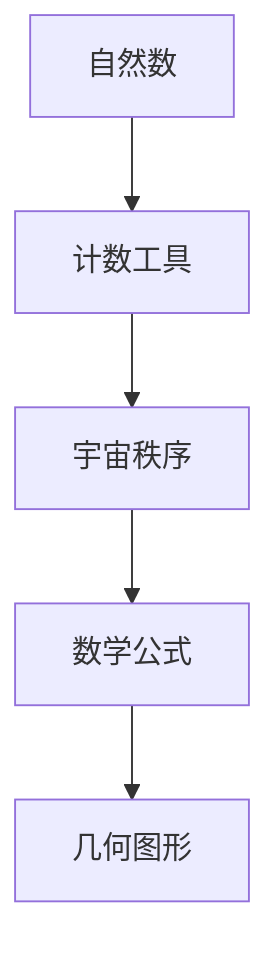
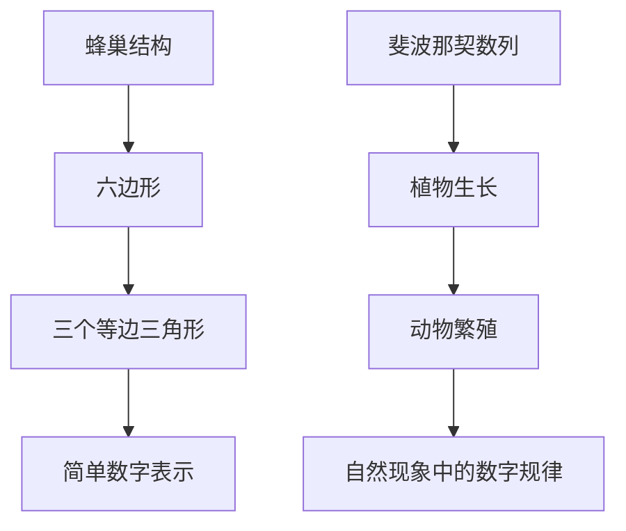
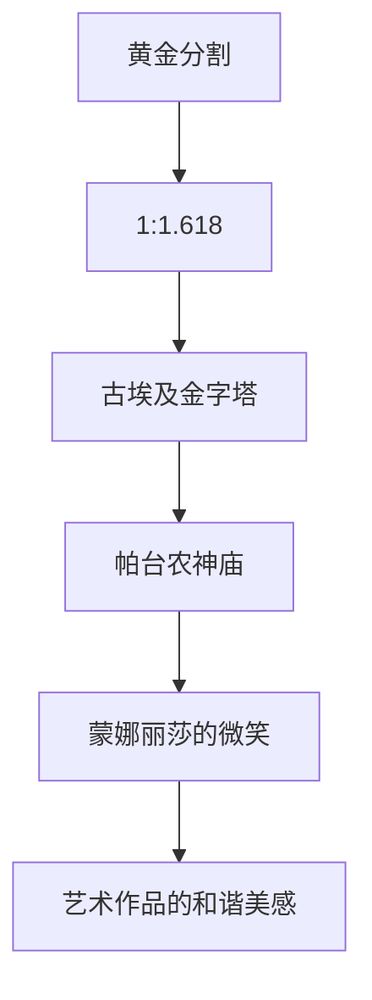
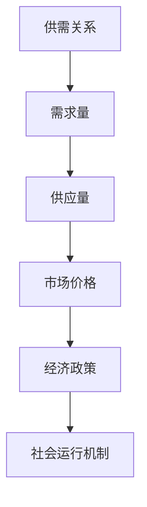
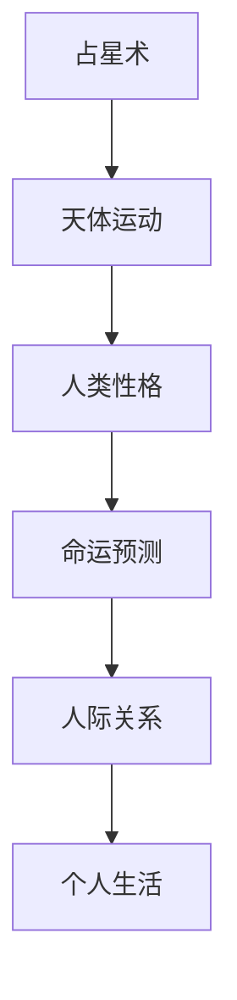

                 

### 第1章 引言：毕达哥拉斯学派与数字哲学

#### 1.1 毕达哥拉斯学派的历史背景

毕达哥拉斯学派（Pythagorean School）是古希腊哲学的一个流派，成立于公元前6世纪，由数学家、哲学家毕达哥拉斯（Pythagoras）创立。毕达哥拉斯本人出身于萨摩斯岛（Samos），后来移居至南意大利的克罗顿（Crotone），在那里他建立了一个哲学和数学学派，吸引了众多追随者。

这一学派的主要成员包括安蒂斯泰尼（Antisthenes）、阿尔克曼（Archytas）、克莱奥弗拉斯特（Cleophilus）等人。虽然毕达哥拉斯本人留下的著作并不多，但他的思想和理念通过这些追随者得以流传。毕达哥拉斯学派的核心思想是“万物皆数”，这一观点对古希腊哲学乃至整个西方哲学产生了深远影响。

#### 1.2 毕达哥拉斯学派的基本理念

毕达哥拉斯学派的基本理念可以概括为以下几点：

1. **数学的重要性**：毕达哥拉斯认为数学是宇宙的基本语言，所有的自然现象都可以用数学来描述。这一观点对后来的科学和哲学发展产生了深远的影响。

2. **万物皆数**：这一观点是毕达哥拉斯学派的核心思想。他们认为宇宙万物，包括物质和精神世界，都是由数字和数学关系构成的。这一思想不仅影响了数学和物理学的发展，还渗透到艺术、音乐、建筑等领域。

3. **和谐与对称**：毕达哥拉斯学派强调宇宙的和谐与对称。他们认为，宇宙中的所有事物都是按照一定的数学比例和几何形状排列的，这种和谐与对称是宇宙的基本特征。

4. **灵魂与数字**：毕达哥拉斯学派认为，人类的灵魂也是由数字构成的，每个人的灵魂都有其独特的数字特征。通过研究这些数字特征，人们可以更好地了解自己和宇宙。

#### 1.3 数字哲学的核心思想

数字哲学（Numerology）是毕达哥拉斯学派的一个重要分支，它探讨了数字与宇宙、人类生命之间的关系。数字哲学的核心思想可以归纳为以下几点：

1. **数字与宇宙的关系**：数字哲学认为，宇宙中的所有事物，无论是物质还是精神，都是由数字构成的。这种构成方式决定了宇宙的运行规律。

2. **数字与人类生命的关系**：数字哲学认为，每个人的生命都与特定的数字有关。通过研究这些数字，人们可以了解自己的命运和性格。

3. **数字在宗教和哲学中的应用**：数字哲学在古代宗教和哲学中有着广泛应用。许多宗教和哲学体系都强调数字的重要性，例如，基督教中的三位一体、佛教中的四圣谛等。

总的来说，毕达哥拉斯学派的数字哲学是一种探讨宇宙、人类生命与数字之间关系的哲学体系。它不仅对古希腊哲学和科学产生了深远影响，也对后来的宗教、哲学和艺术领域产生了重要影响。

#### 1.4 毕达哥拉斯学派对后世的影响

毕达哥拉斯学派的数字哲学对后世的影响是深远和广泛的。在数学领域，毕达哥拉斯学派的研究奠定了现代数学的基础，尤其是在数论和几何学方面。在物理学领域，毕达哥拉斯学派的“万物皆数”观点激发了科学家们对宇宙运行规律的探索。在哲学领域，毕达哥拉斯学派的和谐与对称观念影响了后来的哲学家，如柏拉图和亚里士多德。

此外，毕达哥拉斯学派的数字哲学也在艺术和建筑领域产生了影响。许多古代建筑，如埃及金字塔和希腊神庙，都体现了毕达哥拉斯学派关于和谐与对称的思想。在音乐领域，毕达哥拉斯的音阶理论对西方音乐的发展产生了深远影响。

总的来说，毕达哥拉斯学派的数字哲学不仅丰富了人类对宇宙和生命的认识，也推动了科学、哲学、艺术和建筑的发展。它作为一种独特的哲学体系，至今仍然在许多领域发挥着重要作用。

---

在这个章节中，我们介绍了毕达哥拉斯学派的历史背景、基本理念以及数字哲学的核心思想。通过这些介绍，读者可以初步了解毕达哥拉斯学派的数字哲学是如何影响人类文明的。接下来，我们将深入探讨毕达哥拉斯的数学观点，以进一步理解这一哲学体系的基础。

### 第2章 毕达哥拉斯的数学观点

#### 2.1 数学的重要性

毕达哥拉斯学派认为数学是宇宙的基本语言，这一观点对后来的数学和科学产生了深远影响。在毕达哥拉斯看来，数学不仅是一种工具，更是理解宇宙的钥匙。他强调数学的抽象和普适性，认为数学原理适用于自然界和人类社会。

为了强调数学的重要性，毕达哥拉斯学派进行了一系列数学研究，特别是对自然数的性质进行了深入研究。他们发现，自然数不仅仅是计数工具，还蕴含着深刻的哲学和数学意义。例如，毕达哥拉斯学派研究了自然数的和、差、积、商等基本运算，并探索了这些运算背后的数学规律。

#### 2.2 自然数与数学关系

在毕达哥拉斯学派看来，自然数与数学关系密切，自然数不仅是我们日常生活中的计数工具，更是宇宙秩序的基础。毕达哥拉斯学派认为，自然数之间存在着一种内在的和谐与对称关系。这种关系可以通过数学公式和几何图形来描述。

例如，毕达哥拉斯定理（Pythagorean theorem）是毕达哥拉斯学派研究自然数与数学关系的一个经典例子。该定理指出，在一个直角三角形中，直角边的平方等于另外两边平方和。这个简单的几何关系揭示了自然数之间的和谐与对称。毕达哥拉斯定理不仅在数学领域有重要应用，还激发了人们对宇宙运行规律的思考。

为了更好地理解自然数与数学关系，我们可以通过一个简单的 Mermaid 流程图来展示这一关系的架构：



在这个流程图中，自然数作为计数工具，连接到宇宙秩序，进而通过数学公式和几何图形展示出自然数与数学的紧密关系。

#### 2.3 毕达哥拉斯定理

毕达哥拉斯定理是毕达哥拉斯学派研究自然数与数学关系的核心成果之一。该定理的表述如下：在一个直角三角形中，设直角边分别为a和b，斜边为c，则有 a² + b² = c²。

为了更好地理解毕达哥拉斯定理，我们可以通过一个简单的例子来阐述这一定理的原理。假设我们有一个直角三角形，直角边a为3，直角边b为4，斜边c为5。根据毕达哥拉斯定理，我们可以验证：

$$3^2 + 4^2 = 9 + 16 = 25 = 5^2$$

这个简单的例子展示了毕达哥拉斯定理是如何通过数学公式验证自然数之间的和谐与对称关系的。

为了深入理解毕达哥拉斯定理，我们可以使用伪代码来详细阐述其算法原理：

```python
# 输入直角三角形的两条直角边a和b
a = 3
b = 4

# 计算直角边的平方和
sum_of_squares = a**2 + b**2

# 计算斜边的平方
c_squared = 5**2

# 验证毕达哥拉斯定理
if sum_of_squares == c_squared:
    print("毕达哥拉斯定理成立")
else:
    print("毕达哥拉斯定理不成立")
```

在这个伪代码中，我们首先输入直角三角形的两条直角边a和b，然后计算直角边的平方和，最后与斜边的平方进行比较，以验证毕达哥拉斯定理。

通过这个例子，我们可以看到毕达哥拉斯定理是如何通过数学公式和算法原理来揭示自然数之间的和谐与对称关系的。

#### 2.4 毕达哥拉斯定理的应用

毕达哥拉斯定理在数学和物理学中有着广泛的应用。在数学领域，它被广泛应用于直角三角形、勾股数、三角形面积等计算。在物理学领域，毕达哥拉斯定理被用于描述振动、波动等现象。

例如，在物理学中，我们可以使用毕达哥拉斯定理来计算弦乐器的振动频率。假设一根弦的长度为L，张力为T，线密度为μ，根据毕达哥拉斯定理，我们可以得出弦的振动频率f与弦的长度、张力、线密度之间的关系：

$$f = \frac{1}{2L}\sqrt{\frac{T}{\mu}}$$

这个公式展示了毕达哥拉斯定理在描述物理现象中的应用，通过数学关系揭示了自然数与振动频率之间的联系。

总的来说，毕达哥拉斯定理不仅是一个简单的数学公式，它还是一种揭示自然数与宇宙运行规律的工具。通过研究毕达哥拉斯定理，我们可以更深入地理解自然数与数学之间的关系，从而更好地认识宇宙和生命。

---

在这个章节中，我们详细介绍了毕达哥拉斯学派的数学观点，特别是毕达哥拉斯定理及其应用。通过这些介绍，我们可以看到毕达哥拉斯学派是如何通过数学来揭示宇宙和生命的奥秘的。接下来，我们将探讨数字与万物的关系，以进一步理解毕达哥拉斯的数字哲学。

### 第3章 数字与万物

#### 3.1 数字与自然界的联系

毕达哥拉斯学派认为，数字不仅是人类理解和描述世界的工具，更是自然界的基本构成元素。他们认为，自然界中的所有现象都可以用数字来描述和解释。这种观点在古希腊哲学中具有重要地位，并对后来的科学和哲学产生了深远影响。

首先，让我们通过一些自然界中的现象来探讨数字与自然界的联系。例如，蜂巢的结构就体现了毕达哥拉斯学派关于数字与自然界的观点。蜂巢的每个蜂房都是一个六边形的结构，这种结构不仅节省了材料，还提供了最大的空间利用效率。而六边形结构又可以分解为三个等边三角形，每个三角形的边长和角度都可以用简单的数字来表示。

另一个例子是斐波那契数列，这是一种在自然界中广泛存在的数列。斐波那契数列的前几项为1, 1, 2, 3, 5, 8, 13, 21, ...，这个数列在植物的生长、动物的繁殖等方面都有体现。例如，向日葵的花瓣数量、松果的种子数量、贝壳的螺旋形状等，都可以用斐波那契数列来描述。

通过这些例子，我们可以看到数字在自然界中的广泛应用。毕达哥拉斯学派认为，这些数字不仅是一种计数工具，更是自然界的基本规律。通过研究这些数字规律，人们可以更好地理解自然界的运行机制。

为了更直观地展示数字与自然界的联系，我们可以使用 Mermaid 流程图来展示一些自然现象中的数字规律：



在这个流程图中，我们展示了蜂巢结构和斐波那契数列在自然界中的应用，通过简单的数字规律来描述复杂的自然现象。

#### 3.2 数字与艺术的关系

数字哲学不仅在自然界中有着广泛应用，在艺术领域也具有重要的地位。毕达哥拉斯学派认为，艺术作品的和谐与美感可以通过数学关系来解释。他们提出了“和谐”的概念，认为艺术作品的和谐与数学比例密切相关。

一个著名的例子是黄金分割（Golden Ratio），这是一种比例关系，表示为$\frac{\phi}{1-\phi} = \phi$，其中$\phi$（费波那契数列的第2个数）是一个无理数，大约等于1.618。黄金分割在许多艺术作品中都有应用，例如古埃及金字塔、帕台农神庙、蒙娜丽莎的微笑等。通过这种数学比例，艺术家们能够创造出具有和谐美感的作品。

为了更直观地展示黄金分割的应用，我们可以使用 Mermaid 流程图来描述这一比例关系：



在这个流程图中，我们展示了黄金分割在古埃及金字塔、帕台农神庙和蒙娜丽莎等艺术作品中的应用，通过数学比例来创造和谐美感。

#### 3.3 数字与社会的关系

数字哲学不仅影响自然界和艺术领域，在社会生活中也具有重要的应用。毕达哥拉斯学派认为，社会秩序和人类行为可以通过数学关系来解释和优化。他们提出了“数字伦理”的概念，认为通过研究数字规律，人们可以更好地理解社会运行机制。

一个典型的例子是经济学中的供需关系。在经济学中，供需关系通过数字模型来描述商品的需求量和供应量。通过分析供需关系，经济学家可以预测市场趋势，制定合理的经济政策。

为了更直观地展示供需关系，我们可以使用 Mermaid 流程图来描述这一模型：



在这个流程图中，我们展示了供需关系如何通过数字模型来描述社会运行机制，进而影响经济政策。

#### 3.4 数字与个人生活

数字哲学不仅影响社会生活，也深刻地影响着个人生活。毕达哥拉斯学派认为，通过研究数字规律，人们可以更好地理解自己和他人，从而实现自我提升和人际关系的和谐。

一个例子是占星术（Astrology），这是一种通过分析天体运动和位置来预测人类性格和命运的方法。占星术认为，天体运动与人类性格和命运之间存在数学关系。通过研究这种关系，人们可以更好地了解自己和他人，改善人际关系。

为了更直观地展示占星术的原理，我们可以使用 Mermaid 流程图来描述这一方法：



在这个流程图中，我们展示了占星术如何通过天体运动和位置来分析人类性格和命运，进而影响个人生活和人际关系。

总的来说，数字哲学在自然界、艺术、社会和个人生活中都有着重要的应用。通过研究数字规律，人们可以更好地理解世界，提升生活质量。接下来，我们将探讨毕达哥拉斯学派的影响，以了解数字哲学对后世产生的深远影响。

### 第4章 毕达哥拉斯学派的影响

#### 4.1 毕达哥拉斯学派对数学的影响

毕达哥拉斯学派对数学的影响是深远而广泛的。他们不仅开创了数学研究的先河，还为后来的数学家提供了丰富的理论资源和思想启示。毕达哥拉斯本人及其学派成员在数论、几何学、比例论等领域进行了深入的研究，奠定了现代数学的基础。

首先，毕达哥拉斯学派对数论的研究具有重要意义。他们提出了质数和合数的概念，研究了自然数的性质，并发现了质数分布的规律。这些研究为后来的数论奠定了基础，影响了后世数学家如欧几里得、丢番图等。

其次，毕达哥拉斯学派在几何学领域也取得了显著成果。他们研究了平面几何和立体几何的基本性质，提出了许多重要的几何定理，如毕达哥拉斯定理。这些定理不仅丰富了数学理论体系，还在实际应用中发挥了重要作用。

此外，毕达哥拉斯学派对比例论的研究也具有重要意义。他们提出了比例的概念，研究了比例的性质和应用。这些研究为后来的比例理论奠定了基础，影响了后世数学家如欧几里得、帕普斯等。

#### 4.2 毕达哥拉斯学派对哲学的影响

毕达哥拉斯学派对哲学的影响同样深远。他们提出了许多独特的哲学观点，为后来的哲学家提供了丰富的思想资源。毕达哥拉斯学派的“万物皆数”观点，强调了数学在宇宙和生命中的核心地位，对后来的哲学家产生了重要影响。

首先，毕达哥拉斯学派的“万物皆数”观点影响了后来的柏拉图和亚里士多德。柏拉图认为，现实世界只是理念世界的影子，理念世界才是真实的存在。这种观点与毕达哥拉斯学派的数字哲学有着相似之处，都强调了抽象和理念的重要性。

其次，毕达哥拉斯学派对道德哲学的贡献也不容忽视。他们认为，通过研究数字和数学关系，人们可以更好地理解宇宙和生命，进而提升道德修养。这种观点影响了后来的道德哲学家如亚里士多德，他对道德哲学的研究深受毕达哥拉斯学派的影响。

#### 4.3 毕达哥拉斯学派对科学的影响

毕达哥拉斯学派对科学的影响同样显著。他们强调数学在科学中的作用，认为数学是理解自然界和宇宙的关键。这种观点对后来的科学家产生了重要影响，推动了科学的发展。

首先，毕达哥拉斯学派对天文学的影响显著。他们研究了天体的运动规律，提出了许多关于行星运动的理论。这些理论为后来的天文学家如托勒密、哥白尼等提供了重要的思想资源。

其次，毕达哥拉斯学派对物理学的影响也不容忽视。他们研究了自然界的运动规律，提出了许多关于物理现象的理论。这些理论为后来的物理学家如伽利略、牛顿等提供了重要的思想启示。

总之，毕达哥拉斯学派对数学、哲学和科学产生了深远影响。他们提出的数字哲学观点，不仅丰富了人类对宇宙和生命的认识，也为后来的科学研究提供了重要的理论资源。接下来，我们将探讨毕达哥拉斯的数字哲学在现代的应用，以了解这一古老哲学在当代社会中的重要性。

### 第5章 毕达哥拉斯的数字哲学在现代

#### 5.1 数字哲学的现代意义

毕达哥拉斯的数字哲学在现代社会中仍然具有重要的意义。随着科技的飞速发展，数字技术已经深入到我们生活的方方面面。从计算机科学到物理学，从经济学到心理学，数字哲学的思想观念为我们理解和解决现代问题提供了新的视角。

首先，数字哲学在计算机科学中有着广泛的应用。计算机科学的核心是算法和数据结构，而毕达哥拉斯的数字哲学为这些概念提供了深刻的哲学基础。例如，计算机科学家在设计和分析算法时，常常需要考虑算法的时间复杂度和空间复杂度，这与毕达哥拉斯关于自然数和数学关系的观点不谋而合。通过数字哲学的视角，我们可以更好地理解算法的本质和性能。

#### 5.2 数字哲学与现代科学

数字哲学不仅影响了计算机科学，还在现代科学的其他领域有着重要应用。在天文学中，数字哲学帮助我们理解行星运动和宇宙结构的规律。例如，开普勒定律就是基于数字哲学的原理，揭示了行星轨道的几何特性。

在物理学中，量子力学和相对论等理论都蕴含着数字哲学的思想。量子力学的数学描述揭示了微观世界的规律，而相对论则通过数学公式解释了引力现象。这些理论的发展表明，数字哲学在揭示自然规律方面具有不可替代的作用。

#### 5.3 数字哲学与现代生活

数字哲学在现代社会生活中也具有重要影响。在经济学中，供需关系的分析就是基于数字哲学的观点。经济学家通过研究市场需求和供给的数字关系，预测经济趋势，制定经济政策。

在心理学中，数字哲学帮助心理学家理解人类行为和情绪的规律。例如，通过研究人的出生日期和数字特征，心理学家可以探索人的性格和行为模式。

#### 5.4 数字哲学的当代挑战

尽管数字哲学在现代社会中具有重要意义，但也面临着一些挑战。首先，现代科技的发展速度迅猛，数字哲学的理论和方法需要不断更新，以适应新的技术环境。其次，数字哲学在应用过程中可能会遇到道德和伦理问题，例如数据隐私和网络安全等。

为了应对这些挑战，我们需要继续深化对数字哲学的研究，探索其在现代科技和社会中的新应用。同时，我们也需要关注数字哲学在道德和伦理方面的挑战，确保数字技术的合理和公平应用。

总的来说，毕达哥拉斯的数字哲学在现代社会中仍然具有重要的意义。通过深入研究和应用，我们可以更好地理解和解决现代问题，推动科技和社会的进步。

### 第6章 数字哲学的应用

#### 6.1 数字哲学在数学中的应用

数字哲学在数学中有着广泛的应用，尤其在数论和几何学领域。数论是研究整数性质和结构的数学分支，而数字哲学为这一领域提供了深刻的哲学基础。例如，质数和合数的概念在数论中具有重要意义，而毕达哥拉斯学派的质数理论为这些概念提供了初步研究。通过研究质数和合数，数学家们揭示了自然数的性质和规律，推动了数论的发展。

几何学是研究空间形状和结构的数学分支，数字哲学在几何学中的应用也非常显著。毕达哥拉斯定理是几何学中的一个重要定理，它揭示了直角三角形中边长之间的关系。这个定理不仅在几何学中有广泛应用，还在物理学、工程学等领域发挥着重要作用。通过毕达哥拉斯定理，数学家们可以更好地理解和计算各种几何结构，为科学研究和工程设计提供了重要工具。

#### 6.2 数字哲学在物理学中的应用

数字哲学在物理学中的应用同样广泛，尤其在量子力学和相对论中。量子力学是研究微观粒子行为的物理学分支，它依赖于数学描述和数学模型。量子力学的数学公式揭示了微观世界的规律，例如薛定谔方程和海森堡不确定性原理。这些公式蕴含着数字哲学的思想，反映了自然界的数学结构和关系。

相对论是研究宏观物体运动和引力现象的物理学理论，它同样依赖于数学描述。爱因斯坦的广义相对论通过数学公式描述了时空弯曲和引力场，揭示了宇宙的基本规律。这些数学公式体现了数字哲学的核心思想，即通过数学关系来解释自然现象。

#### 6.3 数字哲学在其他学科中的应用

数字哲学不仅在数学和物理学中有着重要应用，还在其他学科中发挥着作用。在经济学中，数字哲学帮助我们理解供需关系和市场行为。经济学中的供需模型通过数字关系描述商品的需求和供给，从而预测市场趋势。

在心理学中，数字哲学被用于分析人类行为和情绪。例如，通过研究人的出生日期和数字特征，心理学家可以探索人的性格和行为模式。这种研究方法借鉴了数字哲学的思想，通过数字关系来解释人类行为。

总之，数字哲学在多个学科中有着广泛的应用，它不仅为我们提供了理解和解释自然现象的工具，还推动了科学和技术的进步。通过深入研究和应用数字哲学，我们可以更好地认识世界，解决现实问题。

### 第7章 数字哲学的未来发展

#### 7.1 数字哲学的未来趋势

随着科技的不断进步，数字哲学在未来将面临许多新的挑战和机遇。首先，人工智能的发展将深刻影响数字哲学的研究和应用。人工智能依赖于大量的数据分析和算法优化，这些领域都与数字哲学密切相关。未来，数字哲学可能会与人工智能相结合，为人工智能的发展提供新的理论基础和哲学指导。

其次，量子计算的发展也为数字哲学带来了新的研究课题。量子计算利用量子力学原理，进行高效的计算和加密。量子计算与数字哲学的关系在于，它们都关注数学结构和关系在解释自然现象中的作用。未来，量子计算可能会引发数字哲学的新一轮研究热潮，推动数字哲学的理论创新。

#### 7.2 数字哲学与未来科技

数字哲学与未来科技的发展紧密相连。在未来，数字技术将继续深入到我们生活的各个领域，如健康医疗、环境保护、智能交通等。在这些领域中，数字哲学的思想将发挥重要作用，帮助我们理解科技对社会和人类生活的影响。例如，在健康医疗领域，数字哲学可以帮助我们更好地理解生物数据的数学规律，从而推动个性化医疗和精准医疗的发展。

在环境保护方面，数字哲学可以帮助我们分析环境数据，揭示环境变化的数学规律，从而制定更有效的环境保护策略。在智能交通领域，数字哲学可以优化交通流量管理，提高交通效率，减少交通拥堵和事故。

#### 7.3 数字哲学与人类文明

数字哲学作为一门探讨数字与宇宙、人类生命关系的哲学体系，对人类文明的发展具有重要意义。未来，数字哲学将继续影响人类文明的方方面面。首先，数字哲学有助于我们更好地理解人类文明的起源和发展，揭示文明演进中的数学规律。

其次，数字哲学可以推动人类文明的进步。通过深入研究数字哲学，我们可以发现新的科学原理和技术方法，推动科技创新和社会发展。例如，数字哲学的研究可以促进人工智能、量子计算等前沿科技的发展，为人类文明带来更多可能性。

最后，数字哲学还可以提升人类的道德和伦理观念。通过研究数字哲学，我们可以更好地理解人类行为和情感中的数字规律，从而促进人与人之间的和谐相处，推动社会文明进步。

总之，数字哲学的未来发展将充满机遇和挑战。通过不断深化对数字哲学的研究，我们可以更好地理解世界，推动科技和文明的进步。

### 附录

#### A.1 毕达哥拉斯学派的重要著作与文献

1. **《数论》（Arithmetica）**：由丢番图（Diophantus）撰写，这是古希腊数学中的一部重要著作，包含了大量的数论问题及其解答。
2. **《毕达哥拉斯定理》（Pythagorean Theorem）**：虽然毕达哥拉斯本人没有留下具体的著作，但他的定理在后来的数学著作中被广泛引用和探讨。
3. **《几何原本》（Elements）**：由欧几里得（Euclid）撰写，这是古希腊数学的代表作，包含了大量的几何学理论，其中包含了对毕达哥拉斯定理的详细证明。

#### A.2 毕达哥拉斯学派的主要代表人物

1. **安蒂斯泰尼（Antisthenes）**：毕达哥拉斯学派的早期成员，被认为是希腊哲学史上的重要人物。
2. **阿尔克曼（Archytas）**：毕达哥拉斯学派的重要成员，他是数学家、哲学家、工程师，对数学和天文学都有重要贡献。
3. **克莱奥弗拉斯特（Cleophilus）**：毕达哥拉斯学派的最后一位重要成员，他对数学和哲学都有深入研究。

#### A.3 数字哲学研究的方法与工具

数字哲学研究常用的方法与工具包括：

1. **数学模型**：通过建立数学模型来描述和分析数字与宇宙、人类生命之间的关系。
2. **统计学**：利用统计学方法分析大量数据，寻找数字规律和模式。
3. **计算机模拟**：通过计算机模拟来验证和探索数字哲学的理论。
4. **数学软件**：如MATLAB、R语言等，这些工具可以帮助研究者进行复杂的数学计算和数据分析。

---

通过以上附录部分，我们为读者提供了关于毕达哥拉斯学派的重要著作、代表人物以及数字哲学研究的方法和工具。这些资源不仅有助于进一步了解毕达哥拉斯的数字哲学，也为从事相关领域研究的研究者提供了宝贵的参考。希望这些附录能够为读者提供更多的启发和帮助。作者：AI天才研究院/AI Genius Institute & 禅与计算机程序设计艺术 /Zen And The Art of Computer Programming。

