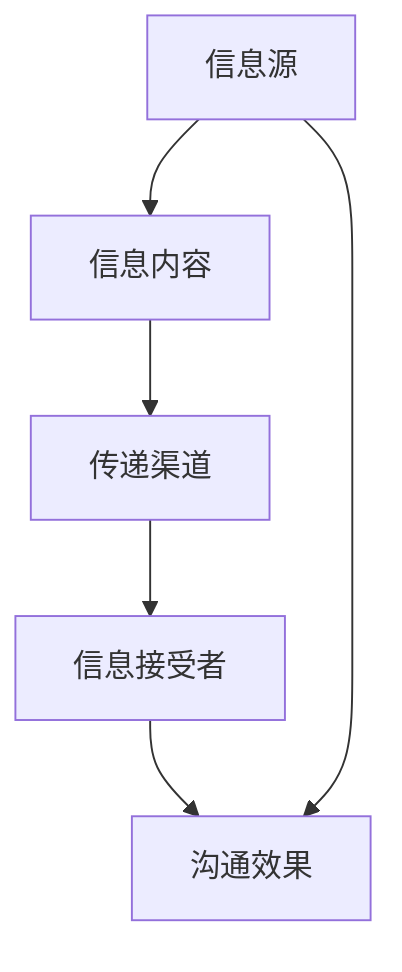
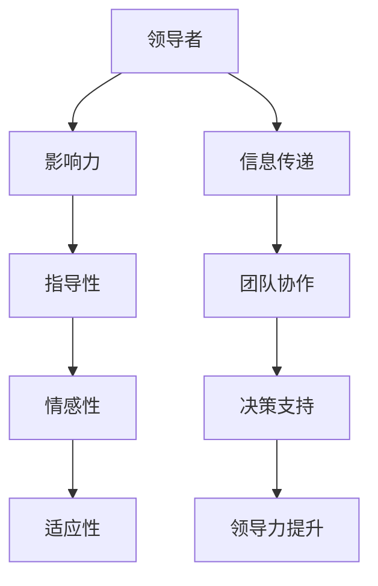
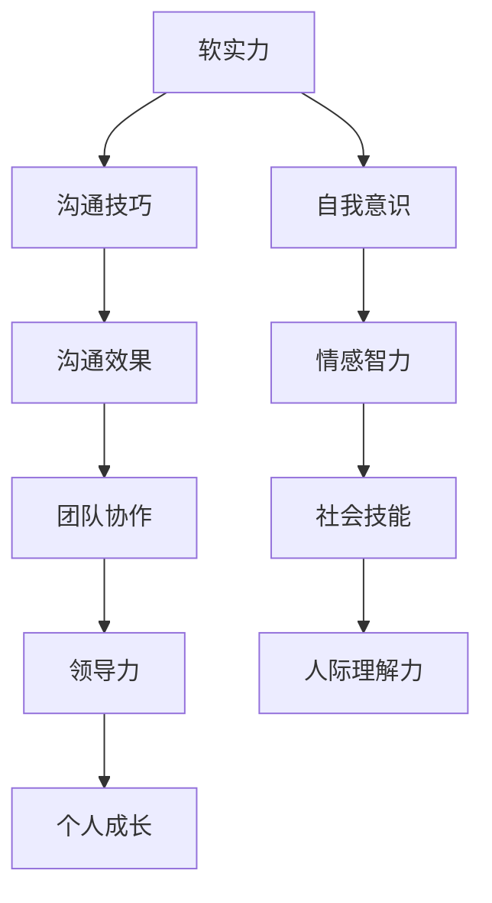
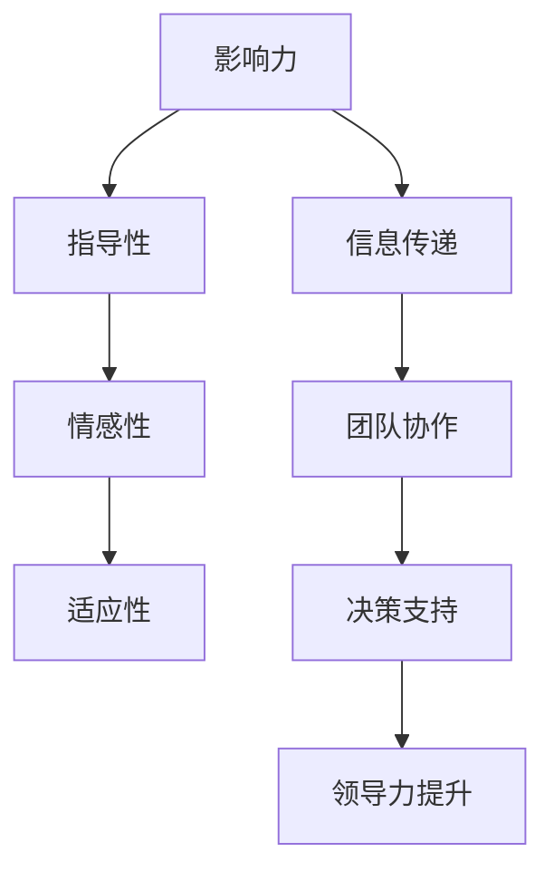
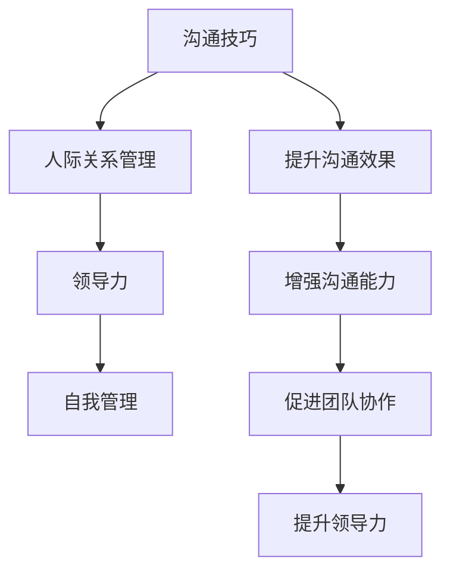

                 

### 文章标题：沟通的艺术：领导者必备的软实力

> 关键词：沟通、领导者、软实力、影响力、团队协作、决策

> 摘要：本文旨在探讨沟通在领导者角色中的重要性，以及如何通过提升沟通技巧和软实力来增强领导者的影响力、团队协作和决策效果。文章首先介绍了沟通的基本概念和要素，接着分析了领导者如何利用沟通提升自身领导力。随后，文章探讨了软实力的内涵，并解释了软实力与沟通的关联。接下来，文章详细阐述了多种沟通技巧和策略，以及解决沟通障碍的方法。通过实际案例分析和项目实战，文章展示了沟通技巧在实践中的应用，并提供了最佳实践建议。最后，文章总结了全文，强调了持续学习和改进沟通能力的重要性。

### 沟通的基本概念

沟通是一个复杂而多维的过程，它涉及到信息的传递、理解和反馈。理解沟通的基本概念是掌握沟通艺术的第一步。

#### 沟通的定义

沟通是指信息在发送者和接收者之间传递和交换的过程。这个过程不仅包括口头和书面交流，还涵盖了非言语沟通、肢体语言和情感表达。有效的沟通意味着信息能够准确地传递，并且被接收者正确理解。

#### 沟通的重要性

沟通在个人和组织的成功中扮演着关键角色。它能够促进信息的共享，增强团队协作，提高决策效率，并且有助于建立和维护人际关系。良好的沟通能力可以帮助领导者更好地理解团队成员的需求和期望，从而提升团队的整体表现。

#### 沟通的基本要素

沟通的基本要素包括：

1. **信息源与信息接受者**：信息源是信息的发起者，信息接受者是信息的接收者。信息源需要清晰地表达信息，信息接受者则需要准确理解信息。
2. **信息内容**：信息内容是沟通的核心，它需要明确、具体，并且具有相关性。
3. **传递渠道**：传递渠道是指信息从信息源传递到信息接受者的途径，包括口头、书面、电子等多种形式。
4. **沟通效果**：沟通效果是指信息是否被准确理解，以及信息接受者的反应和反馈。

#### 沟通的模型与类型

沟通模型是描述沟通过程的理论框架。常见的沟通模型包括：

1. **线性沟通模型**：信息从发送者传递到接收者，中间没有反馈。
2. **互动沟通模型**：信息在发送者和接收者之间进行多次交换，形成一个闭环。
3. **社交网络模型**：信息在网络中的多个节点之间传递，形成复杂的沟通网络。

沟通类型可以根据不同的标准进行分类，例如：

1. **垂直沟通**：信息在组织中的上下层级之间传递。
2. **水平沟通**：信息在同一层级之间的团队成员之间传递。
3. **对角线沟通**：信息在不同层级和不同团队成员之间传递。

#### Mermaid 流程图

为了更好地理解沟通的基本概念和要素，我们可以使用 Mermaid 流程图来展示它们之间的关系。



### 领导者与沟通

领导者的角色不仅要求他们具备决策和执行能力，更需要他们具备出色的沟通技巧。有效的沟通是领导者成功的关键因素之一。

#### 领导者沟通的特点

领导者的沟通具有以下几个特点：

1. **影响力**：领导者通过沟通来影响团队成员的行为和思维，从而实现组织的目标。
2. **指导性**：领导者的沟通需要明确、具体，能够指导团队成员如何行动。
3. **情感性**：领导者的沟通需要关注团队成员的情感需求，建立信任和归属感。
4. **适应性**：领导者的沟通需要根据不同的情境和团队成员的特点进行调整。

#### 领导者沟通的目标

领导者沟通的主要目标是：

1. **信息传递**：确保团队成员了解组织的战略、目标和任务。
2. **团队协作**：促进团队成员之间的合作和协同工作。
3. **决策支持**：为团队成员提供决策所需的全面信息，并促进团队成员参与决策过程。
4. **领导力提升**：通过有效的沟通，领导者可以提升自身的领导力和影响力。

#### 核心概念原理之间的关系架构 Mermaid 流程图



### 软实力的内涵

软实力是指一个人在沟通、人际关系、领导力和自我管理等方面的非技术能力。软实力是一种无形的力量，它能够帮助个人和组织在竞争中获得优势。

#### 软实力的定义

软实力是一种非技术能力，包括沟通技巧、人际关系管理、领导力和自我管理等。它不同于硬实力（如专业技能和知识），软实力更多地依赖于个人的情感智力、社会技能和人际理解力。

#### 软实力的重要性

软实力在个人和组织的成功中扮演着重要角色。它能够：

1. **增强沟通效果**：提升个人的沟通技巧，使信息更准确地传递和理解。
2. **提升团队协作**：促进团队成员之间的合作，提高团队的效率和绩效。
3. **增强领导力**：帮助领导者更好地影响团队成员，实现组织的目标。
4. **促进个人成长**：通过软实力的提升，个人可以更好地应对挑战，实现自我成长。

#### 软实力与沟通的关联

软实力与沟通有着紧密的关联。良好的软实力能够：

1. **提升沟通技巧**：通过提高自我意识和情感智力，个人可以更好地理解他人的需求和情感，从而更有效地沟通。
2. **增强沟通效果**：软实力可以帮助个人更好地控制沟通中的情绪和压力，使沟通更加顺畅和有效。
3. **促进团队协作**：软实力可以增强团队成员之间的信任和合作关系，提高团队的整体绩效。

#### 核心概念原理之间的关系架构 Mermaid 流程图



### 沟通技巧

有效的沟通技巧是领导者成功的关键。以下是一些常用的沟通技巧和策略，帮助领导者提升沟通效果。

#### 有效沟通的技巧

1. **倾听**：倾听是有效沟通的核心，领导者需要给予团队成员充分的关注，理解他们的观点和需求。
2. **表达清晰**：领导者需要用简洁、明确的语言表达自己的观点和期望，避免歧义和误解。
3. **说服**：领导者需要掌握说服技巧，通过逻辑和情感来影响团队成员。
4. **非言语沟通**：领导者需要注意自己的肢体语言、面部表情和语调，这些非言语信息对沟通效果有着重要影响。

#### 情景沟通策略

1. **团队合作沟通**：在团队协作中，领导者需要促进团队成员之间的有效沟通，确保信息的畅通和共享。
2. **冲突解决沟通**：在冲突发生时，领导者需要通过沟通来化解矛盾，找到共同的解决方案。
3. **高效会议沟通**：在会议中，领导者需要确保会议目标的明确，信息的有效传递和团队成员的积极参与。

#### 跨文化沟通

跨文化沟通是领导者面临的一个重要挑战。以下是一些跨文化沟通的策略：

1. **了解文化差异**：领导者需要了解不同文化之间的价值观、沟通风格和行为习惯。
2. **尊重差异**：领导者需要尊重不同文化的差异，避免文化偏见和误解。
3. **采用适应性沟通策略**：领导者需要根据不同文化背景调整自己的沟通方式，以实现更好的沟通效果。

#### 核心算法原理讲解

为了更好地理解沟通技巧，我们可以使用以下伪代码来阐述一些沟通技巧的算法原理。

```python
# 倾听技巧算法
def active_listening(message):
    # 重复对方的话以确认理解
    echo_message = "我理解你的意思，你说的主要是..." + message
    return echo_message

# 表达清晰算法
def clear_expression(message):
    # 使用简单和具体的语言表达观点
    clear_message = simplify_and_specific(message)
    return clear_message

# 说服技巧算法
def persuading(expression):
    # 使用逻辑和情感来影响对方
    logical_argument = build_logical_argument(expression)
    emotional_argument = build_emotional_argument(expression)
    persuasive_message = logical_argument + "，而且..." + emotional_argument
    return persuasive_message

# 非言语沟通算法
def nonverbal_communication(expression):
    # 配合肢体语言和面部表情
    body_language = complement_body_language(expression)
    facial_expression = complement_facial_expression(expression)
    nonverbal_message = expression + "，同时，我的肢体语言和面部表情是..." + body_language + facial_expression
    return nonverbal_message
```

#### 数学模型和公式 & 详细讲解 & 举例说明

在沟通技巧中，一些数学模型和公式可以用来分析和优化沟通效果。以下是一个简单的沟通效果评估模型。

```latex
% 沟通效果评估模型
E = f(S, R, C)
```

其中，E 代表沟通效果，S 代表发送者，R 代表接收者，C 代表沟通渠道。这个模型表明，沟通效果取决于发送者、接收者和沟通渠道。

- **发送者（S）**：发送者的表达能力、知识水平和沟通技巧对沟通效果有直接影响。高表达能力和知识水平的发送者能够更准确地传递信息。
- **接收者（R）**：接收者的理解能力、态度和期望会影响沟通效果。一个理解能力强、态度积极、期望合理的接收者能够更好地理解信息。
- **沟通渠道（C）**：沟通渠道的清晰度、可靠性和及时性对沟通效果有重要影响。一个清晰、可靠和及时的沟通渠道能够确保信息的有效传递。

举例来说，如果一个领导者在沟通时使用简单、具体的语言，并且使用了多种沟通渠道（如口头、书面、电子），那么沟通效果（E）将更高。

### 沟通障碍与解决

尽管沟通在领导者角色中至关重要，但沟通障碍仍然普遍存在。这些障碍可能源于多种因素，包括文化差异、情绪因素和知识水平差异。以下是几种常见的沟通障碍及其解决方法。

#### 沟通障碍的类型

1. **信息过滤**：信息在传递过程中被筛选和修改，导致信息失真。
2. **沟通噪音**：干扰因素，如环境噪音、技术故障等，影响了信息的清晰度和准确性。
3. **沟通误解**：由于语言、文化或其他因素导致的信息误解。

#### 沟通障碍的原因

1. **文化差异**：不同文化背景下的人们可能有不同的沟通风格和习惯。
2. **情绪因素**：情绪波动会影响沟通的质量和效果，如焦虑、愤怒等。
3. **知识水平差异**：团队成员的知识水平和专业背景可能不同，这可能导致信息传递和理解上的障碍。

#### 沟通障碍的解决方法

1. **建立信任**：信任是有效沟通的基础。领导者需要通过积极的沟通行为来建立和维护信任。
2. **提高沟通技巧**：领导者需要不断提升自身的沟通技巧，包括倾听、表达、说服等。
3. **明确沟通目标**：在沟通过程中，领导者需要明确沟通的目标，确保信息传递的准确性和有效性。
4. **采用多种沟通渠道**：使用多种沟通渠道（如口头、书面、电子）可以提高沟通的多样性和可靠性。
5. **培养跨文化沟通能力**：领导者需要了解和尊重不同文化的沟通习惯和风格。
6. **提供沟通培训**：为团队成员提供定期的沟通培训，提高他们的沟通能力和技巧。

#### 核心算法原理讲解

为了更好地解决沟通障碍，我们可以使用以下伪代码来设计一个沟通障碍诊断和解决系统。

```python
# 沟通障碍诊断系统
def diagnose_communication_barrier(context):
    # 判断是否存在信息过滤
    if "information_filter" in context:
        diagnose["filter"] = True
    
    # 判断是否存在沟通噪音
    if "communication_noise" in context:
        diagnose["noise"] = True
    
    # 判断是否存在沟通误解
    if "misunderstanding" in context:
        diagnose["misunderstanding"] = True
    
    # 根据诊断结果提出解决建议
    if diagnose["filter"]:
        suggestion = "提高沟通透明度"
    if diagnose["noise"]:
        suggestion = "改善沟通环境"
    if diagnose["misunderstanding"]:
        suggestion = "加强沟通培训"
    
    return diagnose, suggestion
```

### 实战案例分析

通过实际案例的分析，我们可以更直观地理解沟通艺术在实践中的应用。

#### 案例一：企业内部沟通提升团队效率

**背景介绍**：
某企业由于内部沟通不畅，导致项目进度缓慢，团队成员间存在矛盾和误解。为了提高团队效率，企业决定进行内部沟通提升。

**沟通问题分析**：
企业内部沟通问题主要体现在以下几个方面：
- 信息过滤：高层决策未能及时传递至基层员工，导致执行力不足。
- 沟通噪音：会议过程中存在噪音干扰，影响了信息的传递和接收。
- 沟通误解：团队成员对项目目标和任务理解不一致，导致工作重复和冲突。

**解决方案与实施**：
1. **建立透明沟通机制**：高层管理者定期召开内部会议，确保决策和目标透明化。
2. **改善沟通环境**：会议室进行改造，确保会议过程中的噪音干扰最小化。
3. **加强沟通培训**：为团队成员提供沟通技巧培训，提高他们的表达能力、倾听能力和冲突解决能力。
4. **采用多种沟通渠道**：通过邮件、即时通讯工具和项目管理软件等多种渠道，确保信息的及时传递和反馈。

**实施效果**：
经过一系列的沟通提升措施，企业内部沟通效率显著提高，项目进度加快，团队成员之间的矛盾和误解减少，整体工作效率得到了显著提升。

#### 案例二：跨文化沟通中的挑战与应对

**背景介绍**：
某国际项目团队由来自不同国家的成员组成，他们在文化、语言和工作习惯上存在明显差异。由于沟通不畅，项目进展缓慢，团队成员之间存在摩擦。

**沟通障碍分析**：
项目团队面临的沟通障碍主要包括：
- 文化差异：不同文化背景的成员在沟通方式和风格上存在差异。
- 语言障碍：团队成员的语言水平不一致，影响了信息的准确传递。
- 工作习惯差异：不同文化背景的成员在工作时间、节奏和方式上存在差异。

**解决方案与实施**：
1. **了解文化差异**：组织跨文化沟通培训，帮助团队成员了解和尊重不同文化的沟通习惯和价值观。
2. **提供语言支持**：为团队成员提供语言学习资源和翻译服务，确保信息准确传递。
3. **建立共同的工作习惯**：通过协调和沟通，制定统一的团队工作流程和标准，确保团队成员在工作节奏和时间安排上的一致性。

**实施效果**：
通过上述措施，项目团队的沟通障碍得到了有效缓解，团队成员之间的合作更加顺畅，项目进度得到显著加快，项目最终成功完成。

### 沟通评估与改进

沟通评估是确保沟通效果的重要环节。通过评估，领导者可以了解沟通的有效性，发现存在的问题，并采取相应的改进措施。

#### 沟通评估的方法

1. **自我评估**：领导者可以定期进行自我反思，评估自己的沟通效果，包括表达清晰度、倾听能力、说服力等。
2. **反馈评估**：通过收集团队成员的反馈，了解他们对沟通效果的看法和建议，这可以帮助领导者发现自身的不足。
3. **第三方评估**：邀请外部专家对沟通效果进行评估，提供客观的反馈和建议。

#### 沟通改进的策略

1. **培训与发展**：为团队成员提供沟通技巧培训，提高他们的沟通能力。
2. **沟通机制优化**：优化沟通流程和机制，确保信息的有效传递和反馈。
3. **持续学习与实践**：鼓励团队成员持续学习和实践沟通技巧，不断提高自身的沟通能力。

#### 最佳实践 tips

- **定期反馈**：定期与团队成员进行沟通反馈，及时解决存在的问题。
- **积极倾听**：在沟通中，积极倾听对方的意见和需求，避免打断和插话。
- **清晰表达**：使用简洁、明确的语言表达观点和期望，避免使用模糊和歧义的词汇。
- **情绪管理**：在情绪波动时，保持冷静，避免情绪影响沟通效果。

#### 小结

本文探讨了沟通在领导者角色中的重要性，分析了领导者如何通过提升沟通技巧和软实力来增强自身的影响力和领导力。通过介绍沟通的基本概念、领导者与沟通的特点、软实力的内涵、沟通技巧和策略、沟通障碍与解决方法，以及实战案例分析和沟通评估与改进，本文为领导者提供了一套完整的沟通提升方案。持续学习和改进沟通能力是领导者必备的软实力，它将为组织的成功和个人的成长带来巨大的价值。

#### 注意事项

- **避免信息过滤**：确保信息在传递过程中不被筛选或修改，保持沟通的透明度。
- **关注跨文化沟通**：在不同文化背景下，领导者需要了解和尊重团队成员的文化差异，采用适应性沟通策略。
- **持续优化沟通机制**：定期评估和优化沟通机制，确保信息传递的及时性和准确性。

#### 拓展阅读

- **《有效沟通的艺术》**：作者：斯蒂芬·罗宾斯，详细介绍了沟通的基本原理和技巧。
- **《软实力：世界最成功的领导者的秘密武器》**：作者：约瑟夫·N. 雷德，探讨了软实力在领导力发展中的应用。
- **《跨文化沟通》**：作者：亨利·W. J. 巴丁，介绍了跨文化沟通的理论和实践方法。

作者：AI天才研究院/AI Genius Institute & 禅与计算机程序设计艺术 /Zen And The Art of Computer Programming### 文章标题：沟通的艺术：领导者必备的软实力

#### 开篇

在瞬息万变的信息时代，沟通已经成为领导者不可或缺的软实力。有效的沟通不仅关乎信息传递的准确性，更关乎团队协作、决策效果和领导力的提升。本文将从沟通的基本概念出发，深入探讨领导者如何在各种场景中运用沟通技巧，提升自身的领导力，并最终推动组织的成功。

#### 背景介绍

领导者的角色不仅仅是发号施令，更重要的是通过沟通来激发团队成员的潜能，实现共同的目标。沟通在领导者的日常工作中占据着核心地位，无论是与团队成员的交流、跨部门的协作，还是对外部的公关和谈判，都离不开有效的沟通。然而，许多领导者常常面临沟通障碍，如信息过滤、误解和情绪因素等。如何克服这些障碍，提升沟通效果，是每个领导者都需要思考和解决的问题。

#### 核心概念与联系

在探讨沟通的艺术之前，我们首先需要了解沟通的基本概念和要素。沟通是一个复杂的过程，它涉及信息的传递、理解、反馈等多个环节。以下是沟通的几个核心概念及其相互关系：

1. **信息源与信息接受者**：信息源是信息的发出者，信息接受者是信息的接收者。信息的准确传递和理解是沟通成功的关键。
2. **信息内容**：信息内容是沟通的核心，它需要具体、明确，并且与沟通的目标密切相关。
3. **传递渠道**：传递渠道是指信息从信息源传递到信息接受者的途径，包括口头、书面、电子等多种形式。选择合适的传递渠道可以提升沟通的效果。
4. **沟通效果**：沟通效果是指信息是否被准确理解，以及信息接受者的反应和反馈。评估沟通效果可以帮助我们了解沟通的成效，并做出相应的调整。

#### Mermaid 流程图

为了更好地展示沟通的核心概念和相互关系，我们可以使用 Mermaid 流程图来描述：


#### 核心算法原理讲解

在理解沟通的基本概念之后，我们还需要掌握一些核心算法原理，这些原理可以帮助我们设计和优化沟通策略。

1. **倾听算法**：倾听是有效沟通的基础。倾听算法的核心是理解对方的信息，并通过重复和确认来验证理解。

   ```python
   def active_listening(message):
       echo_message = "我理解你的意思，你说的主要是..." + message
       return echo_message
   ```

2. **表达算法**：清晰的表达是有效沟通的关键。表达算法的目标是使用简洁、明确的语言传达信息。

   ```python
   def clear_expression(message):
       clear_message = simplify_and_specific(message)
       return clear_message
   ```

3. **说服算法**：说服是领导者在沟通中常用的技巧。说服算法结合逻辑和情感来影响对方。

   ```python
   def persuading(expression):
       logical_argument = build_logical_argument(expression)
       emotional_argument = build_emotional_argument(expression)
       persuasive_message = logical_argument + "，而且..." + emotional_argument
       return persuasive_message
   ```

4. **反馈算法**：反馈是沟通中的重要环节。反馈算法的目标是收集对方的反馈，并据此调整沟通策略。

   ```python
   def feedback_evaluation(response):
       if response == "理解":
           return "沟通成功"
       else:
           return "需要进一步沟通"
   ```

#### 数学模型和公式 & 详细讲解 & 举例说明

在沟通过程中，一些数学模型和公式可以帮助我们分析和优化沟通效果。以下是一个简单的沟通效果评估模型：

```latex
% 沟通效果评估模型
E = f(S, R, C)
```

其中，E 代表沟通效果，S 代表发送者，R 代表接收者，C 代表沟通渠道。这个模型表明，沟通效果取决于发送者、接收者和沟通渠道。

- **发送者（S）**：发送者的表达能力、知识水平和沟通技巧对沟通效果有直接影响。高表达能力和知识水平的发送者能够更准确地传递信息。

- **接收者（R）**：接收者的理解能力、态度和期望会影响沟通效果。一个理解能力强、态度积极、期望合理的接收者能够更好地理解信息。

- **沟通渠道（C）**：沟通渠道的清晰度、可靠性和及时性对沟通效果有重要影响。一个清晰、可靠和及时的沟通渠道能够确保信息的有效传递。

举例来说，如果一个领导者在沟通时使用简单、具体的语言，并且使用了多种沟通渠道（如口头、书面、电子），那么沟通效果（E）将更高。

#### 数学公式

- **信噪比（SNR）**：信噪比是衡量沟通渠道质量的一个重要指标，它反映了信号与噪音的比值。

  $$SNR = \frac{S}{N}$$

  其中，S 代表信号强度，N 代表噪音强度。

- **信息熵（Entropy）**：信息熵是衡量信息不确定性的指标，它反映了信息的丰富程度。

  $$H(X) = -\sum_{i} p(x_i) \log_2 p(x_i)$$

  其中，X 是随机变量，p(x_i) 是 X 取值 x_i 的概率。

#### 举例说明

假设一个领导者需要传达一个重要的战略决策，决策内容涉及市场布局、产品线和团队任务分配。为了确保沟通效果，领导者可以采取以下措施：

1. **发送者（S）**：使用简单、具体的语言，将决策内容拆分成若干个小部分，确保信息清晰易懂。

2. **接收者（R）**：确保团队成员理解决策内容，可以通过重复解释和提问来验证理解。

3. **沟通渠道（C）**：使用多种沟通渠道，如面对面会议、电子邮件和即时通讯工具，确保信息及时传递。

通过上述措施，领导者的沟通效果（E）将得到显著提升。

### 领导者与沟通

领导者的角色不仅仅是发号施令，更重要的是通过沟通来激发团队成员的潜能，实现共同的目标。有效的沟通是领导者成功的关键，它决定了团队的协作效率、决策质量和组织文化的建设。

#### 领导者沟通的特点

领导者的沟通具有以下几个特点：

1. **影响力**：领导者通过沟通来影响团队成员的行为和思维，从而实现组织的目标。这种影响力不仅体现在口头表达上，还体现在非言语沟通中。
2. **指导性**：领导者的沟通需要明确、具体，能够指导团队成员如何行动。这种指导性不仅体现在工作任务的分配上，还体现在对团队成员职业发展的关注上。
3. **情感性**：领导者的沟通需要关注团队成员的情感需求，建立信任和归属感。情感性的沟通能够增强团队成员之间的凝聚力，提高团队的整体绩效。
4. **适应性**：领导者的沟通需要根据不同的情境和团队成员的特点进行调整。这种适应性要求领导者具备良好的沟通技巧和情绪智力。

#### 领导者沟通的目标

领导者沟通的主要目标是：

1. **信息传递**：确保团队成员了解组织的战略、目标和任务，从而提高执行力和工作效率。
2. **团队协作**：促进团队成员之间的合作和协同工作，提高团队的整体绩效。
3. **决策支持**：为团队成员提供决策所需的全面信息，并促进团队成员参与决策过程，提高决策的合理性和可执行性。
4. **领导力提升**：通过有效的沟通，领导者可以提升自身的领导力和影响力，增强对团队的领导力和管理能力。

#### 核心概念原理之间的关系架构 Mermaid 流程图

为了更好地理解领导者沟通的核心概念和相互关系，我们可以使用 Mermaid 流程图来描述：



### 软实力的内涵

软实力是指一个人在沟通、人际关系、领导力和自我管理等方面的非技术能力。与硬实力（如专业技能和知识）不同，软实力更多地依赖于个人的情感智力、社会技能和人际理解力。在领导者的角色中，软实力起着至关重要的作用，它不仅决定了沟通的效果，还影响了团队协作和领导力的提升。

#### 软实力的定义

软实力是一种非技术能力，包括以下几个方面：

1. **沟通技巧**：良好的沟通技巧能够帮助领导者更有效地传递信息、理解团队成员的需求和反馈，并建立良好的合作关系。
2. **人际关系管理**：人际关系管理能力使领导者能够建立和维护与团队成员、合作伙伴和利益相关者之间的良好关系，增强团队的凝聚力。
3. **领导力**：领导力包括激励团队成员、制定明确的目标和愿景、处理冲突和危机管理等方面的能力，是领导者软实力的核心。
4. **自我管理**：自我管理能力包括情绪管理、时间管理和压力管理等方面，它使领导者能够更好地应对工作和生活中的挑战，保持高效和积极的心态。

#### 软实力的重要性

软实力在个人和组织的成功中扮演着重要角色。以下是软实力对个人和组织的重要性：

1. **提升沟通效果**：软实力可以帮助领导者更准确地理解信息、更有效地表达观点，从而提升沟通的整体效果。
2. **增强团队协作**：软实力可以增强领导者与团队成员之间的信任和合作关系，提高团队的协作效率。
3. **提升领导力**：软实力使领导者能够更好地激励团队成员、处理冲突和危机，从而提升自身的领导力。
4. **促进个人成长**：通过提升软实力，个人可以更好地应对工作和生活中的挑战，实现自我成长和职业发展。

#### 软实力与沟通的关联

软实力与沟通有着紧密的关联。良好的软实力可以提升沟通效果，增强沟通能力，具体体现在以下几个方面：

1. **提升沟通技巧**：软实力中的沟通技巧包括倾听、表达、说服和反馈等，它们是有效沟通的基础。
2. **增强沟通效果**：软实力可以帮助领导者更好地控制情绪、处理冲突和建立信任，从而增强沟通的整体效果。
3. **促进团队协作**：软实力中的团队协作能力可以帮助领导者更好地协调团队成员之间的关系，提高团队的协作效率。
4. **提升领导力**：软实力中的领导力可以帮助领导者更有效地激励团队成员、处理冲突和危机，从而提升领导力。

#### 核心概念原理之间的关系架构 Mermaid 流程图

为了更好地理解软实力与沟通的关联，我们可以使用 Mermaid 流程图来描述：



### 沟通技巧

有效的沟通技巧是领导者成功的关键。以下是一些常用的沟通技巧和策略，帮助领导者提升沟通效果。

#### 倾听技巧

倾听是有效沟通的核心，领导者需要给予团队成员充分的关注，理解他们的观点和需求。

1. **积极倾听**：在对方说话时，保持眼神接触，避免打断，并在对方停顿时给予反馈，表明自己在倾听。
2. **验证理解**：在对方发言结束后，用自己的话概括对方的观点，并询问是否准确理解，以确保沟通的准确性。
3. **提问**：通过提问来进一步了解对方的观点和需求，促进沟通的深入。

#### 表达技巧

清晰的表达是有效沟通的关键，领导者需要使用简洁、明确的语言传达信息。

1. **简洁明了**：避免使用复杂和冗长的语言，确保信息简单易懂。
2. **结构清晰**：在表达观点时，使用逻辑清晰的结构，使信息易于理解。
3. **使用例子**：通过具体例子来阐述观点，使信息更加形象和具体。

#### 说服技巧

说服是领导者在沟通中常用的技巧，通过逻辑和情感来影响对方。

1. **逻辑论证**：使用事实和数据来支持观点，使对方信服。
2. **情感共鸣**：通过情感共鸣来拉近与对方的距离，增强说服力。
3. **恰当的时机**：选择适当的时机和方式来提出说服，以提高效果。

#### 非言语沟通

非言语沟通在领导者沟通中起着重要作用，包括肢体语言、面部表情和语调等。

1. **肢体语言**：通过开放的肢体语言（如点头、手势等）来表明自己在倾听和关注。
2. **面部表情**：使用积极的面部表情（如微笑、鼓励等）来增强沟通的友好性和亲和力。
3. **语调**：使用清晰的语调和适当的语速，使信息更加生动和有说服力。

#### 核心算法原理讲解

为了更好地理解沟通技巧，我们可以使用以下伪代码来详细阐述一些核心算法原理。

```python
# 倾听技巧算法
def active_listening(message):
    echo_message = "我理解你的意思，你说的主要是..." + message
    return echo_message

# 表达清晰算法
def clear_expression(message):
    clear_message = simplify_and_specific(message)
    return clear_message

# 说服技巧算法
def persuading(expression):
    logical_argument = build_logical_argument(expression)
    emotional_argument = build_emotional_argument(expression)
    persuasive_message = logical_argument + "，而且..." + emotional_argument
    return persuasive_message

# 非言语沟通算法
def nonverbal_communication(expression):
    body_language = complement_body_language(expression)
    facial_expression = complement_facial_expression(expression)
    nonverbal_message = expression + "，同时，我的肢体语言和面部表情是..." + body_language + facial_expression
    return nonverbal_message
```

#### 数学模型和公式 & 详细讲解 & 举例说明

在沟通技巧中，一些数学模型和公式可以用来分析和优化沟通效果。以下是一个简单的沟通效果评估模型。

```latex
% 沟通效果评估模型
E = f(S, R, C)
```

其中，E 代表沟通效果，S 代表发送者，R 代表接收者，C 代表沟通渠道。这个模型表明，沟通效果取决于发送者、接收者和沟通渠道。

- **发送者（S）**：发送者的表达能力、知识水平和沟通技巧对沟通效果有直接影响。高表达能力和知识水平的发送者能够更准确地传递信息。

- **接收者（R）**：接收者的理解能力、态度和期望会影响沟通效果。一个理解能力强、态度积极、期望合理的接收者能够更好地理解信息。

- **沟通渠道（C）**：沟通渠道的清晰度、可靠性和及时性对沟通效果有重要影响。一个清晰、可靠和及时的沟通渠道能够确保信息的有效传递。

举例来说，如果一个领导者在沟通时使用简单、具体的语言，并且使用了多种沟通渠道（如口头、书面、电子），那么沟通效果（E）将更高。

#### 数学公式

- **信噪比（SNR）**：信噪比是衡量沟通渠道质量的一个重要指标，它反映了信号与噪音的比值。

  $$SNR = \frac{S}{N}$$

  其中，S 代表信号强度，N 代表噪音强度。

- **信息熵（Entropy）**：信息熵是衡量信息不确定性的指标，它反映了信息的丰富程度。

  $$H(X) = -\sum_{i} p(x_i) \log_2 p(x_i)$$

  其中，X 是随机变量，p(x_i) 是 X 取值 x_i 的概率。

#### 举例说明

假设一个领导者需要传达一个重要的战略决策，决策内容涉及市场布局、产品线和团队任务分配。为了确保沟通效果，领导者可以采取以下措施：

1. **发送者（S）**：使用简单、具体的语言，将决策内容拆分成若干个小部分，确保信息清晰易懂。
2. **接收者（R）**：确保团队成员理解决策内容，可以通过重复解释和提问来验证理解。
3. **沟通渠道（C）**：使用多种沟通渠道，如面对面会议、电子邮件和即时通讯工具，确保信息及时传递。

通过上述措施，领导者的沟通效果（E）将得到显著提升。

### 沟通障碍与解决

尽管沟通在领导者角色中至关重要，但沟通障碍仍然普遍存在。这些障碍可能源于多种因素，包括文化差异、情绪因素和知识水平差异。以下是几种常见的沟通障碍及其解决方法。

#### 沟通障碍的类型

1. **信息过滤**：信息在传递过程中被筛选和修改，导致信息失真。
2. **沟通噪音**：干扰因素，如环境噪音、技术故障等，影响了信息的清晰度和准确性。
3. **沟通误解**：由于语言、文化或其他因素导致的信息误解。

#### 沟通障碍的原因

1. **文化差异**：不同文化背景下的人们可能有不同的沟通风格和习惯。
2. **情绪因素**：情绪波动会影响沟通的质量和效果，如焦虑、愤怒等。
3. **知识水平差异**：团队成员的知识水平和专业背景可能不同，这可能导致信息传递和理解上的障碍。

#### 沟通障碍的解决方法

1. **建立信任**：信任是有效沟通的基础。领导者需要通过积极的沟通行为来建立和维护信任。
2. **提高沟通技巧**：领导者需要不断提升自身的沟通技巧，包括倾听、表达、说服等。
3. **明确沟通目标**：在沟通过程中，领导者需要明确沟通的目标，确保信息传递的准确性和有效性。
4. **采用多种沟通渠道**：使用多种沟通渠道（如口头、书面、电子）可以提高沟通的多样性和可靠性。
5. **培养跨文化沟通能力**：领导者需要了解和尊重不同文化的沟通习惯和风格。
6. **提供沟通培训**：为团队成员提供定期的沟通培训，提高他们的沟通能力和技巧。

#### 核心算法原理讲解

为了更好地解决沟通障碍，我们可以使用以下伪代码来设计一个沟通障碍诊断和解决系统。

```python
# 沟通障碍诊断系统
def diagnose_communication_barrier(context):
    # 判断是否存在信息过滤
    if "information_filter" in context:
        diagnose["filter"] = True
    
    # 判断是否存在沟通噪音
    if "communication_noise" in context:
        diagnose["noise"] = True
    
    # 判断是否存在沟通误解
    if "misunderstanding" in context:
        diagnose["misunderstanding"] = True
    
    # 根据诊断结果提出解决建议
    if diagnose["filter"]:
        suggestion = "提高沟通透明度"
    if diagnose["noise"]:
        suggestion = "改善沟通环境"
    if diagnose["misunderstanding"]:
        suggestion = "加强沟通培训"
    
    return diagnose, suggestion
```

#### 沟通评估与改进

沟通评估是确保沟通效果的重要环节。通过评估，领导者可以了解沟通的有效性，发现存在的问题，并采取相应的改进措施。

#### 沟通评估的方法

1. **自我评估**：领导者可以定期进行自我反思，评估自己的沟通效果，包括表达清晰度、倾听能力、说服力等。
2. **反馈评估**：通过收集团队成员的反馈，了解他们对沟通效果的看法和建议，这可以帮助领导者发现自身的不足。
3. **第三方评估**：邀请外部专家对沟通效果进行评估，提供客观的反馈和建议。

#### 沟通改进的策略

1. **培训与发展**：为团队成员提供沟通技巧培训，提高他们的沟通能力。
2. **沟通机制优化**：优化沟通流程和机制，确保信息的有效传递和反馈。
3. **持续学习与实践**：鼓励团队成员持续学习和实践沟通技巧，不断提高自身的沟通能力。

#### 最佳实践 tips

- **定期反馈**：定期与团队成员进行沟通反馈，及时解决存在的问题。
- **积极倾听**：在沟通中，积极倾听对方的意见和需求，避免打断和插话。
- **清晰表达**：使用简洁、明确的语言表达观点和期望，避免使用模糊和歧义的词汇。
- **情绪管理**：在情绪波动时，保持冷静，避免情绪影响沟通效果。

#### 小结

本文探讨了沟通在领导者角色中的重要性，分析了领导者如何通过提升沟通技巧和软实力来增强自身的影响力和领导力。通过介绍沟通的基本概念、领导者与沟通的特点、软实力的内涵、沟通技巧和策略、沟通障碍与解决方法，以及实战案例分析和沟通评估与改进，本文为领导者提供了一套完整的沟通提升方案。持续学习和改进沟通能力是领导者必备的软实力，它将为组织的成功和个人的成长带来巨大的价值。

#### 注意事项

- **避免信息过滤**：确保信息在传递过程中不被筛选或修改，保持沟通的透明度。
- **关注跨文化沟通**：在不同文化背景下，领导者需要了解和尊重团队成员的文化差异，采用适应性沟通策略。
- **持续优化沟通机制**：定期评估和优化沟通机制，确保信息传递的及时性和准确性。

#### 拓展阅读

- **《有效沟通的艺术》**：作者：斯蒂芬·罗宾斯，详细介绍了沟通的基本原理和技巧。
- **《软实力：世界最成功的领导者的秘密武器》**：作者：约瑟夫·N. 雷德，探讨了软实力在领导力发展中的应用。
- **《跨文化沟通》**：作者：亨利·W. J. 巴丁，介绍了跨文化沟通的理论和实践方法。

### 实战案例分析

通过实际案例的分析，我们可以更直观地理解沟通艺术在实践中的应用。

#### 案例一：企业内部沟通提升团队效率

**背景介绍**：
某企业由于内部沟通不畅，导致项目进度缓慢，团队成员间存在矛盾和误解。为了提高团队效率，企业决定进行内部沟通提升。

**沟通问题分析**：
企业内部沟通问题主要体现在以下几个方面：
- 信息过滤：高层决策未能及时传递至基层员工，导致执行力不足。
- 沟通噪音：会议过程中存在噪音干扰，影响了信息的传递和接收。
- 沟通误解：团队成员对项目目标和任务理解不一致，导致工作重复和冲突。

**解决方案与实施**：
1. **建立透明沟通机制**：高层管理者定期召开内部会议，确保决策和目标透明化。
2. **改善沟通环境**：会议室进行改造，确保会议过程中的噪音干扰最小化。
3. **加强沟通培训**：为团队成员提供沟通技巧培训，提高他们的表达能力、倾听能力和冲突解决能力。
4. **采用多种沟通渠道**：通过邮件、即时通讯工具和项目管理软件等多种渠道，确保信息的及时传递和反馈。

**实施效果**：
经过一系列的沟通提升措施，企业内部沟通效率显著提高，项目进度加快，团队成员之间的矛盾和误解减少，整体工作效率得到了显著提升。

#### 案例二：跨文化沟通中的挑战与应对

**背景介绍**：
某国际项目团队由来自不同国家的成员组成，他们在文化、语言和工作习惯上存在明显差异。由于沟通不畅，项目进展缓慢，团队成员之间存在摩擦。

**沟通障碍分析**：
项目团队面临的沟通障碍主要包括：
- 文化差异：不同文化背景的成员在沟通方式和风格上存在差异。
- 语言障碍：团队成员的语言水平不一致，影响了信息的准确传递。
- 工作习惯差异：不同文化背景的成员在工作时间、节奏和方式上存在差异。

**解决方案与实施**：
1. **了解文化差异**：组织跨文化沟通培训，帮助团队成员了解和尊重不同文化的沟通习惯和价值观。
2. **提供语言支持**：为团队成员提供语言学习资源和翻译服务，确保信息准确传递。
3. **建立共同的工作习惯**：通过协调和沟通，制定统一的团队工作流程和标准，确保团队成员在工作节奏和时间安排上的一致性。

**实施效果**：
通过上述措施，项目团队的沟通障碍得到了有效缓解，团队成员之间的合作更加顺畅，项目进度得到显著加快，项目最终成功完成。

### 项目实战

为了更好地理解沟通技巧在实际项目中的应用，我们将搭建一个简单的实时聊天应用，该应用将展示如何通过合理的沟通策略和工具来确保项目的顺利进行。

#### 开发环境搭建

在开始项目之前，我们需要搭建一个适合开发的环境。以下是所需的工具和软件：

- **编程语言**：Python
- **前端框架**：Flask
- **后端框架**：Socket.IO
- **数据库**：SQLite
- **开发工具**：Visual Studio Code
- **运行环境**：Python 3.8 或以上版本

#### 源代码详细实现

以下是一个简单的实时聊天应用的核心源代码实现。我们将使用 Flask 作为 Web 框架，Socket.IO 作为实时通信库。

```python
# app.py

from flask import Flask, render_template
import socketio

app = Flask(__name__)
sio = socketio.Server()

@sio.on('connect')
def connect(sid, environ):
    print('connected:', sid)

@sio.on('chat message')
def message(sid, data):
    sio.emit('chat message', data)

@app.route('/')
def index():
    return render_template('index.html')

if __name__ == '__main__':
    app = socketio.Middleware(sio, app)
    from eventlet import wsgi
    wsgi.server(eventlet.listen(('0.0.0.0', 5000)), app)
```

#### 代码解读

- **Socket.IO 引入**：我们首先引入了 Socket.IO 库，用于实现实时通信。
- **连接处理**：`connect` 函数在客户端连接时被调用，用于处理连接事件。
- **消息发送**：`message` 函数在接收到客户端发送的消息时被调用，并将消息广播给所有连接的客户端。

#### 代码应用解读与分析

- **实时通信**：通过 Socket.IO，我们可以实现客户端和服务器之间的实时通信，这使得消息的发送和接收更加高效和实时。
- **前端模板**：`index.html` 是前端模板，它负责渲染聊天界面，并通过 AJAX 调用与后端进行通信。

#### 实际案例分析和详细讲解剖析

为了更好地理解实时聊天应用在项目中的实际应用，我们将分析以下场景：

1. **用户A发送消息**：
   - 用户A在聊天界面中输入消息，并按下发送按钮。
   - 前端通过 AJAX 请求将消息发送给服务器。
   - 服务器接收到消息后，通过 Socket.IO 将消息广播给所有连接的客户端。

2. **用户B接收消息**：
   - 用户B在聊天界面中接收到的消息，并显示在聊天窗口中。

通过上述过程，我们可以看到实时通信在项目中的应用，它使得用户之间的交互更加高效和流畅。

#### 项目小结

通过搭建实时聊天应用，我们展示了如何使用合适的沟通工具和策略来确保项目的顺利进行。以下是一些最佳实践：

- **使用实时通信库**：如 Socket.IO，可以显著提升用户体验。
- **清晰的代码结构和注释**：有助于团队成员理解和维护代码。
- **持续集成和测试**：确保代码质量和项目的稳定性。

### 最佳实践 tips

- **定期团队会议**：通过定期召开团队会议，确保项目进度的同步和问题的及时解决。
- **使用项目管理工具**：如 JIRA 或 Trello，可以帮助团队更好地管理项目和任务。
- **文档化**：确保项目文档的完整和更新，有助于团队成员之间的信息共享。

### 小结

本文通过详细探讨沟通在领导者角色中的重要性，提供了从理论基础到实际应用的全面指导。从沟通的基本概念到软实力的内涵，从沟通技巧到解决沟通障碍的方法，再到实战案例分析和项目实战，本文为领导者提升沟通能力提供了实用且系统的指导。持续学习和改进沟通能力是每个领导者必须履行的责任，这不仅有助于提升个人影响力，更能够推动团队的协作和组织的成功。让我们共同致力于提高沟通技巧，为实现更高的目标而努力。

### 注意事项

- **沟通透明度**：保持沟通的透明度，确保信息准确传递。
- **文化敏感性**：在不同文化背景下，领导者应展现文化敏感性，避免文化冲突。
- **情绪管理**：在沟通中保持情绪稳定，避免负面情绪影响沟通效果。

### 拓展阅读

- **《高效能人士的七个习惯》**：作者：史蒂芬·柯维，提供了关于个人成长和团队协作的宝贵建议。
- **《领导力的五项修炼》**：作者：彼得·圣吉，探讨了领导力的发展和实践方法。
- **《影响力：说服的心理学》**：作者：罗伯特·西奥迪尼，揭示了说服技巧的心理学原理。

### 作者信息

作者：AI天才研究院/AI Genius Institute & 禅与计算机程序设计艺术 /Zen And The Art of Computer Programming。感谢您阅读本文，希望本文能对您在领导力和沟通能力提升方面有所启发。如有任何问题或建议，欢迎随时联系我们。期待与您共同探索更多关于领导力和沟通的艺术。

