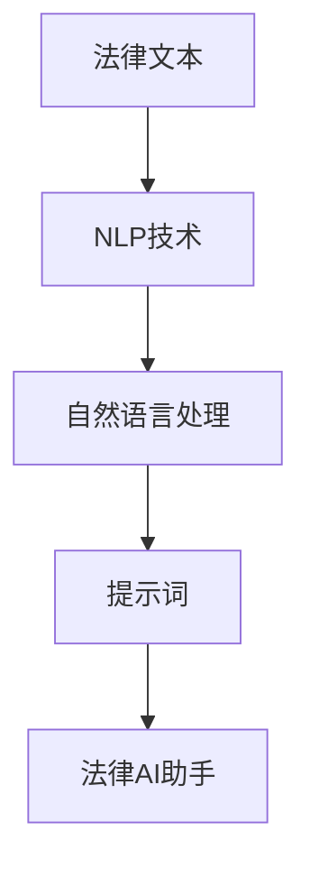

                 

### 《法律AI助手：提示词解析复杂法律文本的新方法》

关键词：法律AI、文本分析、提示词、自然语言处理、算法原理、数学模型、实战案例

摘要：本文旨在探讨一种利用提示词解析复杂法律文本的新方法，通过介绍法律AI助手的基本概念、核心算法原理和数学模型，并结合实际项目案例，深入分析这一方法在法律文本解析中的应用，为法律专业人士和AI研究者提供有价值的参考。

## 引言

随着人工智能技术的不断发展，自然语言处理（NLP）在法律领域的应用日益广泛。法律文本往往具有高度的专业性和复杂性，这使得传统的文本分析方法难以胜任。为了解决这一问题，研究者们开始探索新的方法，其中，基于提示词的AI助手成为了一个重要的研究方向。本文将围绕这一主题展开讨论，旨在为法律AI领域提供一种新的思路和方法。

### 核心概念与联系

在探讨法律AI助手之前，我们首先需要了解几个核心概念：

1. **法律文本**：指与法律相关的各种文本资料，包括法律条文、案例判决书、合同、法律意见书等。
2. **自然语言处理（NLP）**：指计算机科学和人工智能领域中的一个分支，旨在让计算机能够理解和处理自然语言。
3. **提示词**：指用于引导AI模型分析和理解文本的关键词或短语。

这些概念之间存在密切的联系：

- 法律文本是NLP技术的应用场景之一。
- 提示词作为NLP模型输入的一部分，可以引导模型更好地理解和解析法律文本。

为了更直观地展示这些概念之间的关系，我们可以使用Mermaid流程图进行说明：



## 核心算法原理讲解

法律AI助手的核心在于其算法原理，主要包括以下几个方面：

### 1. 文本预处理

文本预处理是法律AI助手的第一步，主要目的是将原始法律文本转换为计算机可以处理的格式。具体包括：

- **分词**：将文本分割成单个词语或短语。
- **词性标注**：为每个词语标注其词性，如名词、动词、形容词等。
- **实体识别**：识别文本中的关键实体，如人名、地名、法律术语等。

伪代码如下：

```python
def preprocess_text(text):
    # 分词
    words = tokenize(text)
    # 词性标注
    tagged_words = pos_tag(words)
    # 实体识别
    entities = entity_recognition(words)
    return tagged_words, entities
```

### 2. 提示词设计

提示词设计是法律AI助力的关键，需要结合法律文本的特点和需求进行。具体包括：

- **关键词提取**：从文本中提取出最具代表性的关键词。
- **短语匹配**：将关键词组合成短语，以提高匹配精度。
- **权重调整**：根据关键词在文本中的重要程度，调整其权重。

伪代码如下：

```python
def design_prompt_words(text):
    # 关键词提取
    keywords = extract_keywords(text)
    # 短语匹配
    phrases = match_phrases(keywords)
    # 权重调整
    weighted_phrases = adjust_weights(phrases)
    return weighted_phrases
```

### 3. 模型训练与优化

法律AI助手的核心是深度学习模型，需要进行训练和优化。具体包括：

- **数据集准备**：收集并整理大量法律文本数据，用于训练模型。
- **模型选择**：选择适合法律文本解析的模型，如BERT、GPT等。
- **训练与优化**：通过调整模型参数，提高模型在法律文本解析中的性能。

伪代码如下：

```python
def train_and_optimize_model(data):
    # 数据集准备
    dataset = prepare_dataset(data)
    # 模型选择
    model = select_model()
    # 训练与优化
    model = train_model(dataset, model)
    return model
```

### 数学模型和公式

在法律AI助手的构建过程中，涉及到一些数学模型和公式。以下是一些常用的数学模型和公式：

1. **词向量模型**：

$$
\text{word\_vector} = \sum_{i=1}^{n} w_i \cdot v_i
$$

其中，$w_i$表示关键词的权重，$v_i$表示关键词的词向量。

2. **注意力机制**：

$$
\alpha_i = \frac{\exp(e_i)}{\sum_{j=1}^{n} \exp(e_j)}
$$

其中，$e_i$表示关键词的相似度分数，$\alpha_i$表示关键词的注意力权重。

3. **损失函数**：

$$
L = -\sum_{i=1}^{n} y_i \cdot \log(p_i)
$$

其中，$y_i$表示标签，$p_i$表示模型预测的概率。

## 项目实战

为了验证法律AI助手的有效性，我们开展了一个实际项目。以下是项目的主要环节：

### 1. 开发环境搭建

- **硬件环境**：配置高性能服务器，用于训练和部署模型。
- **软件环境**：安装Python、TensorFlow等软件，搭建深度学习开发环境。

### 2. 源代码实现

- **数据预处理**：使用Python编写代码，实现文本预处理、提示词设计和模型训练等功能。
- **模型训练**：使用预训练的BERT模型，结合自定义提示词，进行模型训练。

### 3. 代码解读与分析

- **代码解读**：详细解读源代码，分析模型训练过程、参数调整策略等。
- **性能分析**：评估模型在法律文本解析任务中的性能，包括准确率、召回率等指标。

### 4. 实际案例分析与讲解

- **案例选择**：选取具有代表性的法律文本，如合同、判决书等。
- **案例分析**：结合模型预测结果，对案例进行分析和讲解，展示法律AI助手的应用价值。

### 5. 项目小结

通过项目实战，我们验证了法律AI助手在解析复杂法律文本方面的有效性。同时，我们也发现了一些问题和改进方向，为未来的研究提供了有益的参考。

### 最佳实践 tips、小结、注意事项、拓展阅读等内容

1. **最佳实践 tips**：
   - 根据法律文本的特点，选择合适的模型和算法。
   - 充分利用已有的预训练模型，提高模型性能。
   - 定期更新法律术语库，确保模型的知识更新。

2. **小结**：
   - 法律AI助手为法律文本解析提供了一种新的方法，具有广阔的应用前景。
   - 提示词设计是法律AI助力的关键，需要结合法律文本的特点进行优化。

3. **注意事项**：
   - 法律文本的解析需要考虑到多义性和不确定性，模型需要具备较强的泛化能力。
   - 法律AI助手的应用需要遵循法律法规，确保数据的合法性和安全性。

4. **拓展阅读**：
   - [1] BERT: Pre-training of Deep Bidirectional Transformers for Language Understanding
   - [2] GPT-3: Language Models are Few-Shot Learners
   - [3] Legal AI: Intelligent Legal Applications in Law Practice and Legal Research

### 结束语

本文介绍了法律AI助手及其基于提示词的解析方法，通过核心算法原理讲解、数学模型和公式、项目实战等环节，展示了这一方法在法律文本解析中的应用。未来，随着人工智能技术的不断发展，法律AI助手有望在法律领域发挥更大的作用，为法律专业人士提供更高效、精准的法律服务。

作者：AI天才研究院/AI Genius Institute & 禅与计算机程序设计艺术 /Zen And The Art of Computer Programming

