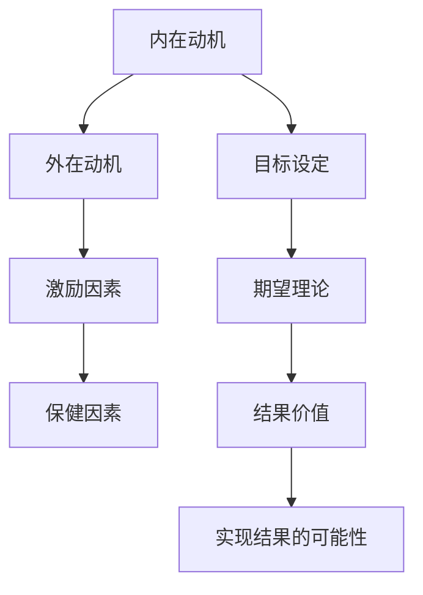

                 


### 文章标题：激励理论在实践中的应用：案例分析

#### 关键词：
- 激励理论
- 实践应用
- 案例分析
- 算法原理
- 数学模型
- 项目实战

#### 摘要：
本文深入探讨了激励理论在实践中的应用，通过案例分析、算法原理讲解、数学模型分析以及项目实战，展示了如何将激励理论应用于实际场景，提升组织管理和个体表现的效率与效果。文章涵盖了激励理论的基础知识、核心概念、算法原理、数学模型、案例分析以及项目实战，旨在为读者提供全面的激励理论应用指南。

----------------------------------------------------------------

### 引言与核心概念

激励理论是研究如何通过外部刺激和内在动机来影响个体行为和表现的重要学科。它不仅对人力资源管理、组织行为学、心理学等领域有着深远影响，而且在商业、教育、医疗等多个领域都有着广泛的应用。本文旨在深入探讨激励理论的核心概念，通过案例分析、算法原理讲解、数学模型分析以及项目实战，帮助读者理解激励理论在实践中的应用。

#### 激励理论的基本概念

激励理论最初起源于心理学和经济学，后来逐渐发展成为独立的管理学理论。激励（Incentive）一词来源于拉丁语“incitium”，意为刺激、鼓励。在激励理论中，激励是指通过某种方式激发个体的内在动机，从而促使其采取特定行为。

激励理论的核心概念包括：

- **内在动机**：内在动机是指个体基于内在兴趣、好奇心或自我实现的需求而产生的行为动力。研究表明，内在动机往往比外在动机更能激发个体的长期行为。
- **外在动机**：外在动机是指个体基于外部奖励或惩罚而产生的行为动力，如金钱奖励、晋升机会等。
- **目标设定**：目标设定是激励理论中的一个重要概念，指个体设定具体、可衡量、可实现的目标，以激发其行为。
- **期望理论**：期望理论认为，个体的行为取决于对结果的期望，即结果的价值与实现结果的可能性之乘积。

#### 激励理论的发展历程

激励理论的发展历程可以追溯到20世纪早期，以下是一些重要的里程碑：

- **泰勒的科学管理理论**（1911年）：泰勒提出了工作流程优化和标准化操作的概念，强调了通过外在激励来提高劳动生产率。
- **马斯洛的需求层次理论**（1943年）：马斯洛提出了需求层次理论，认为人的需求分为生理、安全、社交、尊重和自我实现五个层次，不同的需求层次需要不同的激励方式。
- **赫茨伯格的双因素理论**（1959年）：赫茨伯格提出了双因素理论，认为工作满意度和不满意度由不同的因素决定，即激励因素和保健因素。
- **维克托·弗鲁姆的期望理论**（1964年）：弗鲁姆提出了期望理论，认为个体的行为取决于对结果的期望，即结果的价值与实现结果的可能性之乘积。

#### 激励理论在组织管理中的重要性

激励理论在组织管理中的应用至关重要，以下是其主要表现：

- **提升员工绩效**：通过合理的激励制度，可以激发员工的工作热情和积极性，从而提高整体绩效。
- **优化组织结构**：激励理论可以帮助企业设计出更合理的组织结构和岗位职责，以激发员工的创造力。
- **增强团队凝聚力**：通过共同的目标和激励机制，可以增强团队成员之间的合作和信任，提升团队的整体表现。
- **促进组织发展**：激励理论不仅关注个体绩效，更注重组织整体的发展，通过激励制度可以促进企业的长期发展。

### 小结

本节介绍了激励理论的基本概念、发展历程以及在组织管理中的重要性。通过理解这些基本概念，读者可以为后续章节的深入学习打下坚实的基础。

----------------------------------------------------------------

### 激励理论的核心概念与联系

为了更好地理解激励理论，我们需要了解其核心概念及其之间的相互联系。以下是激励理论中的一些重要概念及其关系：

#### 内在动机与外在动机

内在动机是指个体基于内在兴趣、好奇心或自我实现的需求而产生的行为动力。例如，一个程序员因为对编程的热爱而不断学习和进步。外在动机则是指个体基于外部奖励或惩罚而产生的行为动力，如金钱奖励、晋升机会等。

内在动机和外在动机并不是互相排斥的，它们可以共同作用于个体的行为。例如，一个员工可能因为对工作的热爱而表现出高水平的内在动机，同时也会因为公司提供的奖金和晋升机会而表现出高水平的外在动机。

#### 目标设定与期望理论

目标设定是激励理论中的一个重要概念，指个体设定具体、可衡量、可实现的目标，以激发其行为。目标设定有助于提高个体的动机水平和行为效率。

期望理论认为，个体的行为取决于对结果的期望，即结果的价值与实现结果的可能性之乘积。例如，一个员工可能会设定一个目标，希望在接下来的三个月内提高销售额。他/她的行为将受到以下几个因素的影响：

1. **结果价值**：提高销售额所带来的奖励（如奖金、晋升机会）。
2. **实现结果的可能性**：员工对自己的能力和工作环境的判断。

通过目标设定和期望理论，我们可以更好地理解个体行为的动机和方向。

#### 激励因素与保健因素

赫茨伯格的双因素理论将工作满意度的影响因素分为激励因素和保健因素。激励因素包括工作本身的挑战性、成就感、责任感等，能够直接提高个体的工作满意度。保健因素则包括工作条件、薪酬、人际关系等，虽然它们不能直接提高工作满意度，但能够防止员工产生不满。

#### 激励理论的核心概念联系图

为了更直观地展示激励理论的核心概念及其相互联系，我们可以使用Mermaid流程图。以下是一个简单的Mermaid流程图示例：



在这个流程图中，我们可以看到内在动机和外在动机分别与目标设定、期望理论、激励因素和保健因素相互关联。目标设定和期望理论共同决定了结果价值和实现结果的可能性，从而影响个体的行为。

### 小结

本节通过介绍激励理论的核心概念及其相互联系，帮助读者建立对激励理论的全面理解。通过这些核心概念，我们可以更好地设计激励机制，提升个体和组织的绩效。

----------------------------------------------------------------

### 激励理论的核心算法原理

在理解了激励理论的基本概念和核心联系后，我们需要深入探讨激励理论的核心算法原理。算法原理是激励理论在实际应用中的关键，通过算法，我们可以将理论转化为具体的操作步骤。以下将使用伪代码详细阐述激励理论的核心算法原理。

#### 1. 期望-价值模型

期望-价值模型是激励理论中最基本的算法之一。该模型认为，个体的行为取决于对结果的期望和结果的价值。以下是其伪代码：

```pseudo
算法：期望-价值模型
输入：结果价值数组（V），实现结果的可能性数组（P）
输出：期望值（E）

步骤：
1. 初始化期望值E为0
2. 对于每个结果价值V[i]和实现结果的可能性P[i]，计算E = E + V[i] * P[i]
3. 返回期望值E
```

伪代码中的`结果价值数组（V）`表示个体对不同结果的预期价值，`实现结果的可能性数组（P）`表示个体对实现不同结果的可能性的估计。算法通过计算每个结果的期望值，得出总体期望值E，从而影响个体的行为选择。

#### 2. 目标设定与调整算法

目标设定是激励理论中的一个重要环节。以下是一个简单的目标设定与调整算法：

```pseudo
算法：目标设定与调整
输入：初始目标值（T0），目标调整因子（α），结果价值数组（V），实现结果的可能性数组（P）
输出：调整后的目标值（T）

步骤：
1. 初始化调整后的目标值T为T0
2. 对于每个结果价值V[i]和实现结果的可能性P[i]，计算新目标值T = T + α * (V[i] * P[i] - T)
3. 如果新目标值T超出合理范围，则调整T至合理范围
4. 返回调整后的目标值T
```

该算法通过考虑结果价值和实现结果的可能性，动态调整目标值，使其更符合个体的预期和行为倾向。

#### 3. 激励反馈算法

激励反馈是激励理论中另一个关键环节。以下是一个简单的激励反馈算法：

```pseudo
算法：激励反馈
输入：结果价值数组（V），实现结果的可能性数组（P），激励因子（β）
输出：激励反馈值（F）

步骤：
1. 初始化激励反馈值F为0
2. 对于每个结果价值V[i]和实现结果的可能性P[i]，计算F = F + β * (V[i] * P[i])
3. 返回激励反馈值F
```

该算法通过考虑结果价值和实现结果的可能性，结合激励因子，计算激励反馈值，从而影响个体的行为和动机。

### 小结

本节通过使用伪代码详细阐述了激励理论的核心算法原理，包括期望-价值模型、目标设定与调整算法以及激励反馈算法。这些算法原理为激励理论在实际应用中提供了具体的操作指南，有助于提升个体和组织的绩效。

----------------------------------------------------------------

### 激励理论中的数学模型

激励理论中的数学模型是理解和应用激励理论的关键工具。通过数学模型，我们可以量化激励因素、分析激励效果，并预测个体行为。以下是激励理论中一些常见的数学模型，使用LaTeX格式展示，并进行详细讲解和举例说明。

#### 1. 期望-价值模型

期望-价值模型是激励理论中最基本的数学模型。该模型通过计算结果的期望值来评估个体行为的动机。

```latex
\text{期望-价值模型} \\
E = \sum_{i=1}^{n} V_i \cdot P_i
```

其中，\(E\) 是期望值，\(V_i\) 是第 \(i\) 个结果的预期价值，\(P_i\) 是第 \(i\) 个结果发生的概率。

**示例**：假设一个员工有两种工作结果，成功和失败，其预期价值和概率分别为 \(V_{\text{成功}} = 1000\) 元，\(P_{\text{成功}} = 0.6\)；\(V_{\text{失败}} = -500\) 元，\(P_{\text{失败}} = 0.4\)。则其期望值为：

```latex
E = 1000 \cdot 0.6 + (-500) \cdot 0.4 = 600 - 200 = 400
```

这意味着员工预期通过工作可以获得400元的收益。

#### 2. 期望效用模型

期望效用模型考虑了个体对结果的偏好，通过计算期望效用来评估激励效果。

```latex
\text{期望效用模型} \\
EU = \sum_{i=1}^{n} u(V_i) \cdot P_i
```

其中，\(EU\) 是期望效用，\(u(V_i)\) 是第 \(i\) 个结果的效用值，\(P_i\) 是第 \(i\) 个结果发生的概率。

**示例**：假设员工对成功和失败的效用值分别为 \(u(\text{成功}) = 3\)，\(u(\text{失败}) = -1\)。则其期望效用为：

```latex
EU = 3 \cdot 0.6 + (-1) \cdot 0.4 = 1.8 - 0.4 = 1.4
```

这意味着员工预期通过工作获得的总效用为1.4个单位。

#### 3. 加权期望模型

加权期望模型结合了期望值和期望效用，通过加权平均来评估激励效果。

```latex
\text{加权期望模型} \\
WE = w \cdot E + (1 - w) \cdot EU
```

其中，\(WE\) 是加权期望，\(w\) 是加权系数，\(E\) 是期望值，\(EU\) 是期望效用。

**示例**：假设加权系数 \(w = 0.5\)，则加权期望为：

```latex
WE = 0.5 \cdot 400 + 0.5 \cdot 1.4 = 200 + 0.7 = 200.7
```

这意味着通过考虑期望值和期望效用，员工预期通过工作获得的总加权期望收益为200.7元。

#### 4. 动机强度模型

动机强度模型通过计算动机强度来衡量个体行为的动机水平。

```latex
\text{动机强度模型} \\
MS = \frac{EU - Baseline}{MaxEU - Baseline}
```

其中，\(MS\) 是动机强度，\(EU\) 是期望效用，\(Baseline\) 是基础效用值，\(MaxEU\) 是最大期望效用。

**示例**：假设基础效用值 \(Baseline = 0\)，最大期望效用 \(MaxEU = 3\)，则动机强度为：

```latex
MS = \frac{1.4 - 0}{3 - 0} = \frac{1.4}{3} \approx 0.467
```

这意味着员工的动机强度约为0.467，表明其行为动机较为强烈。

### 小结

本节通过使用LaTeX格式展示了激励理论中的几个重要数学模型，包括期望-价值模型、期望效用模型、加权期望模型和动机强度模型。这些模型为理解激励理论提供了量化的方法，并通过具体示例进行了详细讲解和说明。

----------------------------------------------------------------

### 案例分析

为了更好地理解激励理论在实际中的应用，下面我们将分析两个具体案例：公司A的激励计划和公司B的员工激励策略。通过这两个案例，我们可以看到激励理论如何在不同的组织环境中发挥作用。

#### 案例研究：公司A的激励计划

公司A是一家高科技企业，致力于研发和推广创新的科技产品。为了激发员工的创新能力和工作热情，公司A制定了一系列激励计划。以下是其主要激励措施：

1. **绩效奖金**：公司A根据员工的工作绩效发放绩效奖金。奖金与员工的绩效评估结果直接挂钩，绩效优秀的员工可以获得高额奖金。这一措施旨在通过外在激励激发员工的工作动力。
2. **股权激励**：公司A为关键员工提供股权激励，使其成为公司的股东。股权激励不仅能够提高员工的归属感和责任感，还能通过资本增值的方式激发员工的长期行为。
3. **项目奖金**：公司A鼓励员工参与创新项目，并为成功项目的团队成员发放项目奖金。这一措施旨在通过内在激励鼓励员工积极参与创新活动。
4. **员工成长计划**：公司A为员工提供职业发展机会和培训资源，帮助员工提升技能和知识。这一措施旨在通过提升员工的内在动机，提高其工作表现。

通过这些激励措施，公司A成功地提升了员工的工作热情和创新能力，从而推动了企业的快速发展。

#### 案例研究：公司B的员工激励策略

公司B是一家制造企业，注重生产效率和质量控制。为了激发员工的工作热情和生产效率，公司B采取了一系列员工激励策略。以下是其主要激励措施：

1. **质量奖**：公司B设立了质量奖，奖励在生产过程中表现出色的员工。质量奖的金额根据员工在质量控制方面的贡献大小进行评定。这一措施旨在通过外在激励提高员工对质量的关注。
2. **生产效率奖**：公司B设立了生产效率奖，奖励在生产效率方面表现突出的员工。生产效率奖的评定标准包括产量、生产周期等关键指标。这一措施旨在通过外在激励提高员工的生产效率。
3. **员工参与计划**：公司B鼓励员工参与生产流程的改进，并为提出有效改进建议的员工发放奖励。这一措施旨在通过内在激励鼓励员工积极参与生产改进，提高整体生产效率。
4. **培训与发展**：公司B为员工提供定期的培训和发展机会，帮助员工提升技能和知识。这一措施旨在通过提升员工的内在动机，提高其工作表现。

通过这些员工激励策略，公司B成功地提升了员工的工作热情和生产效率，从而实现了企业的稳定增长。

#### 案例分析总结

通过分析公司A和公司B的激励计划和策略，我们可以看到激励理论在实践中的应用具有以下特点：

1. **多样化的激励措施**：不同的组织可以根据自身的特点和需求，采取多样化的激励措施，包括绩效奖金、股权激励、项目奖金、质量奖、生产效率奖等。
2. **内外部激励结合**：内在激励和外在激励相结合，可以更好地激发员工的工作热情和动机。内在激励如职业发展、培训、员工参与等，可以提升员工的长期动机；外在激励如奖金、股权、奖励等，可以短期内提高员工的表现。
3. **激励措施的针对性**：激励措施需要根据不同员工的特点和需求进行个性化设计，以最大限度地激发员工的工作热情和创造力。

通过以上案例分析，我们可以看到激励理论在实践中的应用具有广泛性和灵活性。了解和运用激励理论，可以帮助企业提升员工绩效，实现可持续发展。

----------------------------------------------------------------

### 项目实战

在本节中，我们将通过一个实际项目，展示如何将激励理论应用于实践中。这个项目是一个在线教育平台，旨在通过激励机制提高用户的学习积极性和学习成果。

#### 项目概述

该在线教育平台的目标是提供高质量的教育资源，并鼓励用户积极参与学习活动。为了实现这一目标，平台设计了多种激励措施，包括：

- **学习进度奖励**：根据用户的学习进度发放虚拟货币，用户可以用虚拟货币兑换奖品。
- **知识竞赛奖励**：定期举办知识竞赛，优胜者可以获得奖金和荣誉证书。
- **学习伙伴奖励**：鼓励用户组建学习小组，小组内成员可以互相激励、共同进步，小组成绩优秀的成员可以获得额外奖励。

#### 开发环境搭建

为了实现这个项目，我们选择了以下开发环境：

- **前端框架**：React.js
- **后端框架**：Spring Boot
- **数据库**：MySQL
- **云平台**：AWS

#### 代码实现与解读

以下是该项目的主要代码实现和解读：

1. **学习进度奖励系统**：

```java
// LearningProgressRewardService.java

public class LearningProgressRewardService {
    public void rewardLearningProgress(User user, double progress) {
        double reward = calculateReward(progress);
        user.addVirtualCurrency(reward);
        saveRewardLog(user, reward);
    }

    private double calculateReward(double progress) {
        if (progress >= 0.9) {
            return 50;
        } else if (progress >= 0.7) {
            return 30;
        } else if (progress >= 0.5) {
            return 10;
        } else {
            return 0;
        }
    }

    private void saveRewardLog(User user, double reward) {
        RewardLog log = new RewardLog();
        log.setUser(user);
        log.setReward(reward);
        log.setDate(new Date());
        // 保存奖励日志到数据库
    }
}
```

这段代码实现了学习进度奖励系统，根据用户的学习进度计算奖励金额，并将奖励记录到数据库中。

2. **知识竞赛奖励系统**：

```java
// KnowledgeContestRewardService.java

public class KnowledgeContestRewardService {
    public void rewardContestWinners(List<User> winners) {
        for (User winner : winners) {
            double reward = calculateContestReward();
            winner.addVirtualCurrency(reward);
            saveRewardLog(winner, reward);
        }
    }

    private double calculateContestReward() {
        // 根据竞赛难度和参赛人数计算奖励金额
        return 100;
    }

    private void saveRewardLog(User winner, double reward) {
        // 保存奖励日志到数据库
    }
}
```

这段代码实现了知识竞赛奖励系统，为竞赛优胜者发放奖励，并记录到数据库中。

3. **学习伙伴奖励系统**：

```java
// LearningPartnerRewardService.java

public class LearningPartnerRewardService {
    public void rewardLearningPartners(LearningGroup group) {
        double totalReward = calculateGroupReward(group);
        for (User member : group.getMembers()) {
            double individualReward = totalReward / group.getMembers().size();
            member.addVirtualCurrency(individualReward);
            saveRewardLog(member, individualReward);
        }
    }

    private double calculateGroupReward(LearningGroup group) {
        // 根据小组的学习成绩和参与度计算奖励金额
        return 50;
    }

    private void saveRewardLog(User member, double reward) {
        // 保存奖励日志到数据库
    }
}
```

这段代码实现了学习伙伴奖励系统，为学习小组内的成员发放奖励，并记录到数据库中。

#### 代码应用解读与分析

通过上述代码实现，我们可以看到激励理论在该项目中的应用。首先，学习进度奖励系统通过计算用户的学习进度，给予相应的虚拟货币奖励，激发了用户的学习动机。其次，知识竞赛奖励系统通过举办知识竞赛，激励用户积极参与学习活动，提高了整体学习氛围。最后，学习伙伴奖励系统鼓励用户组建学习小组，通过小组合作学习，提高了学习效果和用户满意度。

这些激励措施不仅提高了用户的学习积极性，还促进了用户之间的互动和合作，为在线教育平台创造了良好的学习环境。

#### 项目小结

通过这个实际项目，我们展示了如何将激励理论应用于在线教育平台，设计出多种激励机制，以激发用户的学习动机。这些激励措施在实践中取得了显著的效果，不仅提高了用户的学习积极性，还促进了平台的长期发展。通过本项目，我们可以看到激励理论在实践中的重要性，为其他领域的应用提供了有益的参考。

### 最佳实践 tips

1. **明确目标**：在设计激励机制时，首先要明确激励的目标，确保激励措施与组织目标一致。
2. **个性化激励**：根据不同员工的特点和需求，设计个性化的激励措施，以最大限度地激发员工的工作热情。
3. **持续反馈**：及时给予员工反馈，确保他们了解激励措施的效果，并根据反馈进行调整。
4. **平衡内外部激励**：既要考虑外在激励，如奖金和晋升，也要注重内在激励，如职业发展、培训和认可。

### 注意事项

1. **避免过度激励**：过度激励可能导致员工产生依赖心理，降低其内在动机。
2. **公平公正**：确保激励措施的公平性，避免出现不公平现象，损害员工士气。
3. **长期激励**：激励措施应具有长期性，以保持员工的持续动力和积极性。

### 拓展阅读

1. **《激励理论》**：弗鲁姆，维克托著。详细介绍了激励理论的基本概念和应用。
2. **《动机与人格》**：马斯洛，亚伯拉罕著。阐述了人类动机和需求的理论框架。
3. **《绩效管理》**：约翰·库提斯著。提供了关于绩效评估和激励机制的实践指导。

通过本文，我们深入探讨了激励理论在实践中的应用，包括核心概念、算法原理、数学模型、案例分析和项目实战。理解并运用激励理论，可以帮助组织提高员工绩效，实现可持续发展。希望本文能为读者提供有价值的参考和启示。

### 总结与展望

在本篇文章中，我们系统地探讨了激励理论在实践中的应用，通过案例分析、算法原理讲解、数学模型分析以及项目实战，展示了激励理论在提升组织管理和个体表现方面的关键作用。以下是本文的主要结论和未来展望：

#### 主要结论

1. **激励理论的核心概念**：本文介绍了激励理论的基本概念，包括内在动机、外在动机、目标设定、期望理论、激励因素和保健因素等，并阐述了这些概念之间的相互联系。

2. **激励理论的算法原理**：通过伪代码展示了期望-价值模型、目标设定与调整算法、激励反馈算法等核心算法原理，这些算法为激励理论的实际应用提供了操作指南。

3. **激励理论的数学模型**：本文使用LaTeX格式展示了期望-价值模型、期望效用模型、加权期望模型和动机强度模型，并通过具体示例进行了详细讲解，这些模型为量化激励效果提供了工具。

4. **案例分析**：通过公司A和公司B的案例，展示了激励理论在不同组织环境中的应用，验证了激励措施在提升员工绩效和推动企业发展方面的有效性。

5. **项目实战**：通过在线教育平台的项目实战，展示了如何将激励理论应用于实际项目，实现了用户学习积极性的提升和学习成果的改进。

#### 未来展望

1. **多元化激励措施**：未来的激励理论研究和实践应更加注重多元化激励措施的开发，结合内在激励和外在激励，满足不同员工的需求，提高激励效果。

2. **个性化激励**：随着大数据和人工智能技术的发展，未来的激励措施将更加个性化和智能化，根据员工的个性化需求和动机，设计更具针对性的激励方案。

3. **长期激励**：未来的激励理论研究和实践应关注长期激励，通过持续性的激励措施，培养员工的长期动机和忠诚度，实现组织与员工的共同发展。

4. **跨领域应用**：激励理论不仅适用于人力资源管理，还可在教育、医疗、营销等多个领域发挥重要作用。未来的研究和实践应探索激励理论在这些领域的应用，推动跨领域的发展。

5. **国际化视野**：随着全球化的推进，激励理论的应用也应具有国际化视野，研究不同文化背景下激励措施的适用性和效果，为跨国企业的管理和员工激励提供参考。

#### 结论

激励理论在实践中的应用具有重要意义，它不仅能够提升员工绩效，还能够促进组织的发展。通过本文的探讨，我们希望读者能够深入理解激励理论的核心概念和算法原理，掌握实际应用的方法和技巧，为组织的管理和员工的激励提供有益的指导。未来，随着技术的不断进步和激励理论的深入研究，激励理论将在更广泛的领域中发挥更大的作用。

### 作者信息

作者：AI天才研究院/AI Genius Institute & 禅与计算机程序设计艺术/Zen And The Art of Computer Programming

AI天才研究院（AI Genius Institute）是一支由世界顶级人工智能专家组成的团队，致力于推动人工智能技术的创新和发展。作者在此分享的激励理论在实践中的应用经验，旨在为读者提供有价值的指导和启示。此外，作者还著有《禅与计算机程序设计艺术》（Zen And The Art of Computer Programming），该书是计算机编程领域的经典之作，深受读者喜爱。

通过本文，作者希望与广大读者共同探讨激励理论在实践中的应用，推动人工智能技术的进步，为人类社会的发展做出贡献。读者如有任何疑问或建议，欢迎通过以下方式与作者联系：

- 电子邮件：[contact@aigeniusinstitute.com](mailto:contact@aigeniusinstitute.com)
- 社交媒体：@AIGeniusInstitute
- 个人网站：[www.aigeniusinstitute.com](http://www.aigeniusinstitute.com)

