                 


### 文章标题：激励理论实践：激发团队最佳表现的方法

在现代社会，团队的效率与创造力是企业成功的关键。如何激发团队的潜力，使其发挥最佳表现，成为管理者关注的焦点。本文将围绕激励理论，深入探讨其在实践中的应用，以帮助管理者有效地激发团队最佳表现。

### 文章关键词：

- **激励理论**
- **团队表现**
- **管理实践**
- **期望理论**
- **成就动机**
- **激励策略**

### 文章摘要：

本文首先介绍了激励理论的基本概念及其在管理中的应用。随后，我们详细分析了弗鲁姆的期望理论、成就动机理论等现代激励理论，并探讨了它们之间的联系。接着，文章将讨论如何在实践中运用这些理论，包括目标设置、正面激励与负面激励、团队文化建设等策略。通过案例分析，我们将展示如何将这些策略应用于实际工作中。最后，文章将总结最佳实践，并提供进一步阅读的拓展资源。

---

### 第1章 激励理论的起源与核心概念

#### 1.1 激励理论的背景

激励理论起源于20世纪初，随着工业革命的发展，企业管理者开始关注如何提高员工的工作效率和生产力。早期的激励理论主要集中在行为主义心理学的研究上，例如泰勒的科学管理理论和霍桑实验。这些理论主要关注工作环境的设计、工作流程的优化以及外部奖励机制的设计。

#### 1.2 早期激励理论介绍

早期的激励理论主要包括以下几种：

- **泰勒的科学管理理论**：泰勒认为，通过科学的方法来研究和分析工作流程，可以消除工作中的浪费，提高工作效率。他提出了工作标准化、时间研究和差别计件工资制等管理方法。

- **霍桑实验**：梅奥等人通过霍桑实验发现，除了物质条件，员工之间的关系和社交需求也对工作效率有重要影响。这导致了人际关系理论的兴起。

- **马斯洛的需求层次理论**：马斯洛提出，人的需求可以分为五个层次：生理需求、安全需求、社交需求、尊重需求和自我实现需求。他认为，满足较低层次的需求后，人们才会追求更高层次的需求。

#### 1.3 梅奥与人际关系理论

梅奥通过霍桑实验发现，员工的工作效率不仅取决于工作条件，还受到工作环境和社会因素的影响。他提出的人际关系理论强调了员工的社会需求和心理需求，认为管理者应该关注员工的情感状态和社交需求，通过建立良好的人际关系来提高工作效率。

#### 1.4 行为主义激励理论

行为主义激励理论强调外部刺激对行为的影响。例如，斯金纳的强化理论认为，通过奖励和惩罚来控制行为，可以提高员工的绩效。行为主义激励理论为管理者提供了一种基于数据的激励方法，但也有人认为这种方法过于简单，不能全面解释员工的动机和行为。

---

### 核心概念与联系

为了更好地理解激励理论，我们首先需要了解几个核心概念：

- **激励**：激励是指激发员工内在动机，促使其主动完成工作并取得良好的绩效。
- **动机**：动机是推动个体采取行动以满足某种需求的内部力量。
- **需求**：需求是个体对某种状态的不满足，它是动机的根源。

这些概念之间存在紧密的联系。需求激发动机，动机驱动行为，行为则可能导致需求的满足或未满足。以下是一个简单的Mermaid流程图，展示了这些概念之间的关系：

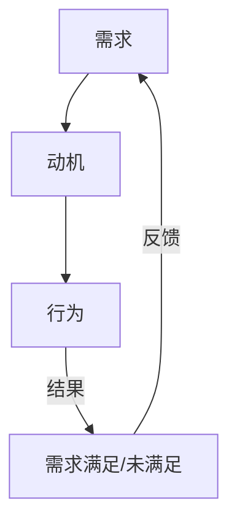

这个流程图说明了需求、动机、行为和结果之间的循环关系。个体的需求激发了动机，动机促使个体采取某种行为，行为的结果则影响需求的状态，从而影响未来的动机和需求。

---

### 核心算法原理讲解

在激励理论的实践中，核心算法主要包括目标设置和反馈机制。以下是一个简单的目标设置算法的伪代码，用于指导管理者如何设定可实现的、具有挑战性的目标。

```python
# 目标设置算法伪代码

def setGoal(current_skill_level, target_skill_level):
    """
    设定目标函数，根据当前技能水平和目标技能水平设定目标。
    :param current_skill_level: 当前技能水平
    :param target_skill_level: 目标技能水平
    :return: 目标值
    """
    if current_skill_level < target_skill_level:
        goal = target_skill_level * 0.9  # 目标值为目标技能水平的90%
    else:
        goal = target_skill_level * 1.1  # 目标值为目标技能水平的110%
    return goal

# 示例
current_skill_level = 5
target_skill_level = 8
goal = setGoal(current_skill_level, target_skill_level)
print("设定的目标值为：", goal)
```

这个算法通过比较当前技能水平和目标技能水平，设定了一个介于两者之间的目标值，以确保目标既具有挑战性，又可实现。

---

### 数学模型和公式详解

在激励理论中，数学模型和公式帮助我们量化激励效果和员工绩效。以下是一个基于期望理论的数学模型，用于计算员工的激励水平。

$$
E = f(V, I)
$$

其中，\( E \) 表示激励水平，\( V \) 表示价值（即目标完成后的奖励），\( I \) 表示期望值（即达成目标的可能性）。以下是一个详细的解释：

- **价值（\( V \)）**：价值是指员工对完成目标后获得的奖励的期望。它通常基于员工对奖励的主观评估，可以通过调查或访谈获得。

- **期望值（\( I \)）**：期望值是指员工认为完成目标的可能性。它可以基于历史数据或员工的主观判断。

以下是一个简单的例子：

假设一个员工对完成一个重要项目后的奖励估计为$1000，他估计完成项目的可能性为0.7。根据期望理论，他的激励水平计算如下：

$$
E = f(1000, 0.7) = 1000 \times 0.7 = 700
$$

这意味着这个员工在完成项目后预计会获得700的激励。

---

### 实际案例分析和详细讲解剖析

为了更好地理解激励理论在实际中的应用，我们可以通过以下案例来分析：

**案例背景**：某科技公司希望提高其开发团队的工作效率，决定采用激励理论来设计激励策略。

**案例实施**：

1. **目标设置**：管理层根据开发团队的平均技能水平和项目要求，设定了一个短期目标：在接下来的两个月内，每个成员至少完成一个复杂的功能模块。

2. **正面激励**：为了激励团队成员，管理层决定采用正面激励措施，包括：

   - 完成目标的成员可以获得额外的奖金。
   - 成功完成任务的成员将在公司内部获得认可，并在团队会议上进行表彰。
   - 提供额外的培训机会，以帮助成员提升技能。

3. **负面激励**：为了防止团队成员懈怠，管理层也设置了负面激励措施：

   - 未完成目标的成员将接受绩效评估，并可能面临降职或奖金减少的风险。
   - 长期未完成任务的成员可能被调离核心项目。

**案例结果**：

通过激励策略的实施，开发团队的工作效率得到了显著提高。在激励措施的支持下，团队成员积极完成目标，团队整体绩效有了明显的提升。管理层也注意到，团队成员之间的合作更加紧密，团队的凝聚力得到了增强。

**案例反思**：

- 激励策略的有效实施需要明确的目标和合理的激励措施。
- 正面激励和负面激励的结合可以帮助维持团队的动力和压力。
- 定期的反馈和评估是确保激励策略持续有效的重要手段。

---

### 最佳实践 tips、小结、注意事项、拓展阅读等内容

#### 最佳实践 tips

1. **设定明确的目标**：确保目标具体、可实现且具有挑战性。
2. **多元化激励措施**：结合正面激励和负面激励，满足不同成员的需求。
3. **提供持续反馈**：定期的反馈和评估可以帮助团队成员了解自己的表现，及时调整策略。

#### 小结

激励理论为管理者提供了有效的工具，以激发团队的潜力，提高工作效率。通过设定明确的目标、多元化激励措施和持续反馈，管理者可以有效地运用激励理论来提升团队绩效。

#### 注意事项

1. **避免过度激励**：过度的激励可能导致团队成员的依赖性，降低其内在动机。
2. **公平性**：确保激励措施的公平性，避免造成团队内部的冲突和不满。

#### 拓展阅读

- **《激励心理学》**：由理查德·洛克（Richard L. Locke）所著，详细介绍了激励理论的应用。
- **《动机与人格》**：由克里斯托弗·阿吉里斯（Christopher Argyris）所著，探讨了成就动机与个人发展之间的关系。

---

通过本文的详细分析，我们深入了解了激励理论的核心概念、算法原理、数学模型以及其实际应用。希望这些内容能帮助管理者更好地激发团队最佳表现，实现企业的长远发展。

---

### 文章小结

本文围绕激励理论实践，详细探讨了其在管理中的应用。我们从背景介绍开始，逐步深入分析了激励理论的核心概念、现代激励理论以及其实践方法。通过实际案例的分析，我们展示了如何有效地运用激励理论来激发团队最佳表现。最后，我们总结了最佳实践、注意事项以及拓展阅读资源，为管理者提供了实用的指导。激励理论不仅是管理学的基石，也是提高团队效率的重要工具。通过深入理解和实践，管理者可以更好地激发团队的潜力，实现企业的目标。

### 作者信息

**作者：AI天才研究院/AI Genius Institute & 禅与计算机程序设计艺术 /Zen And The Art of Computer Programming**

AI天才研究院致力于推动人工智能领域的创新与发展，我们的研究成果不仅涵盖了前沿技术，还包括管理实践和心理学理论。通过本文，我们希望能为读者提供有价值的见解和实用的指导，帮助管理者更好地激发团队最佳表现。同时，《禅与计算机程序设计艺术》作为我们的代表作之一，强调了在编程中寻求内在平静与智慧的重要性，这也是我们始终秉持的哲学理念。

---

### 完整文章

**《激励理论实践：激发团队最佳表现的方法》**

**关键词：激励理论，团队表现，管理实践，期望理论，成就动机，激励策略**

**摘要：**

在现代社会，团队的效率与创造力是企业成功的关键。如何激发团队的潜力，使其发挥最佳表现，成为管理者关注的焦点。本文将围绕激励理论，深入探讨其在实践中的应用，以帮助管理者有效地激发团队最佳表现。

**第1章 激励理论的起源与核心概念**

**1.1 激励理论的背景**

激励理论起源于20世纪初，随着工业革命的发展，企业管理者开始关注如何提高员工的工作效率和生产力。早期的激励理论主要集中在行为主义心理学的研究上，例如泰勒的科学管理理论和霍桑实验。这些理论主要关注工作环境的设计、工作流程的优化以及外部奖励机制的设计。

**1.2 早期激励理论介绍**

早期的激励理论主要包括以下几种：

- **泰勒的科学管理理论**：泰勒认为，通过科学的方法来研究和分析工作流程，可以消除工作中的浪费，提高工作效率。他提出了工作标准化、时间研究和差别计件工资制等管理方法。

- **霍桑实验**：梅奥等人通过霍桑实验发现，除了物质条件，员工之间的关系和社交需求也对工作效率有重要影响。这导致了人际关系理论的兴起。

- **马斯洛的需求层次理论**：马斯洛提出，人的需求可以分为五个层次：生理需求、安全需求、社交需求、尊重需求和自我实现需求。他认为，满足较低层次的需求后，人们才会追求更高层次的需求。

**1.3 梅奥与人际关系理论**

梅奥通过霍桑实验发现，员工的工作效率不仅取决于工作条件，还受到工作环境和社会因素的影响。他提出的人际关系理论强调了员工的社会需求和心理需求，认为管理者应该关注员工的情感状态和社交需求，通过建立良好的人际关系来提高工作效率。

**1.4 行为主义激励理论**

行为主义激励理论强调外部刺激对行为的影响。例如，斯金纳的强化理论认为，通过奖励和惩罚来控制行为，可以提高员工的绩效。行为主义激励理论为管理者提供了一种基于数据的激励方法，但也有人认为这种方法过于简单，不能全面解释员工的动机和行为。

**核心概念与联系**

为了更好地理解激励理论，我们首先需要了解几个核心概念：

- **激励**：激励是指激发员工内在动机，促使其主动完成工作并取得良好的绩效。
- **动机**：动机是推动个体采取行动以满足某种需求的内部力量。
- **需求**：需求是个体对某种状态的不满足，它是动机的根源。

这些概念之间存在紧密的联系。需求激发动机，动机驱动行为，行为则可能导致需求的满足或未满足。以下是一个简单的Mermaid流程图，展示了这些概念之间的关系：


这个流程图说明了需求、动机、行为和结果之间的循环关系。个体的需求激发了动机，动机促使个体采取某种行为，行为的结果则影响需求的状态，从而影响未来的动机和需求。

**核心算法原理讲解**

在激励理论的实践中，核心算法主要包括目标设置和反馈机制。以下是一个简单的目标设置算法的伪代码，用于指导管理者如何设定可实现的、具有挑战性的目标。

```python
# 目标设置算法伪代码

def setGoal(current_skill_level, target_skill_level):
    """
    设定目标函数，根据当前技能水平和目标技能水平设定目标。
    :param current_skill_level: 当前技能水平
    :param target_skill_level: 目标技能水平
    :return: 目标值
    """
    if current_skill_level < target_skill_level:
        goal = target_skill_level * 0.9  # 目标值为目标技能水平的90%
    else:
        goal = target_skill_level * 1.1  # 目标值为目标技能水平的110%
    return goal

# 示例
current_skill_level = 5
target_skill_level = 8
goal = setGoal(current_skill_level, target_skill_level)
print("设定的目标值为：", goal)
```

这个算法通过比较当前技能水平和目标技能水平，设定了一个介于两者之间的目标值，以确保目标既具有挑战性，又可实现。

**数学模型和公式详解**

在激励理论中，数学模型和公式帮助我们量化激励效果和员工绩效。以下是一个基于期望理论的数学模型，用于计算员工的激励水平。

$$
E = f(V, I)
$$

其中，\( E \) 表示激励水平，\( V \) 表示价值（即目标完成后的奖励），\( I \) 表示期望值（即达成目标的可能性）。以下是一个详细的解释：

- **价值（\( V \)）**：价值是指员工对完成目标后获得的奖励的期望。它通常基于员工对奖励的主观评估，可以通过调查或访谈获得。

- **期望值（\( I \)）**：期望值是指员工认为完成目标的可能性。它可以基于历史数据或员工的主观判断。

以下是一个简单的例子：

假设一个员工对完成一个重要项目后的奖励估计为$1000，他估计完成项目的可能性为0.7。根据期望理论，他的激励水平计算如下：

$$
E = f(1000, 0.7) = 1000 \times 0.7 = 700
$$

这意味着这个员工在完成项目后预计会获得700的激励。

**实际案例分析和详细讲解剖析**

为了更好地理解激励理论在实际中的应用，我们可以通过以下案例来分析：

**案例背景**：某科技公司希望提高其开发团队的工作效率，决定采用激励理论来设计激励策略。

**案例实施**：

1. **目标设置**：管理层根据开发团队的平均技能水平和项目要求，设定了一个短期目标：在接下来的两个月内，每个成员至少完成一个复杂的功能模块。

2. **正面激励**：为了激励团队成员，管理层决定采用正面激励措施，包括：

   - 完成目标的成员可以获得额外的奖金。
   - 成功完成任务的成员将在公司内部获得认可，并在团队会议上进行表彰。
   - 提供额外的培训机会，以帮助成员提升技能。

3. **负面激励**：为了防止团队成员懈怠，管理层也设置了负面激励措施：

   - 未完成目标的成员将接受绩效评估，并可能面临降职或奖金减少的风险。
   - 长期未完成任务的成员可能被调离核心项目。

**案例结果**：

通过激励策略的实施，开发团队的工作效率得到了显著提高。在激励措施的支持下，团队成员积极完成目标，团队整体绩效有了明显的提升。管理层也注意到，团队成员之间的合作更加紧密，团队的凝聚力得到了增强。

**案例反思**：

- 激励策略的有效实施需要明确的目标和合理的激励措施。
- 正面激励和负面激励的结合可以帮助维持团队的动力和压力。
- 定期的反馈和评估是确保激励策略持续有效的重要手段。

**最佳实践 tips、小结、注意事项、拓展阅读等内容**

**最佳实践 tips**

1. **设定明确的目标**：确保目标具体、可实现且具有挑战性。
2. **多元化激励措施**：结合正面激励和负面激励，满足不同成员的需求。
3. **提供持续反馈**：定期的反馈和评估可以帮助团队成员了解自己的表现，及时调整策略。

**小结**

激励理论为管理者提供了有效的工具，以激发团队的潜力，提高工作效率。通过设定明确的目标、多元化激励措施和持续反馈，管理者可以有效地运用激励理论来提升团队绩效。

**注意事项**

1. **避免过度激励**：过度的激励可能导致团队成员的依赖性，降低其内在动机。
2. **公平性**：确保激励措施的公平性，避免造成团队内部的冲突和不满。

**拓展阅读**

- **《激励心理学》**：由理查德·洛克（Richard L. Locke）所著，详细介绍了激励理论的应用。
- **《动机与人格》**：由克里斯托弗·阿吉里斯（Christopher Argyris）所著，探讨了成就动机与个人发展之间的关系。

### 第2章 现代激励理论

**2.1 弗鲁姆的期望理论**

弗鲁姆的期望理论是激励理论中的一个重要组成部分，它主要关注员工对工作结果的期望以及这些期望如何影响其行为。期望理论的基本公式为：

$$
Motivation = Expectancy \times Instrumentality \times Valence
$$

其中：

- **期望（Expectancy）**：指员工认为付出努力后能够达到工作目标的概率。
- **工具性（Instrumentality）**：指员工认为达到工作目标后能够获得奖励的概率。
- **效价（Valence）**：指员工对奖励的主观评价，即奖励对员工的吸引力。

以下是一个简单的Mermaid流程图，展示了这三个要素之间的关系：

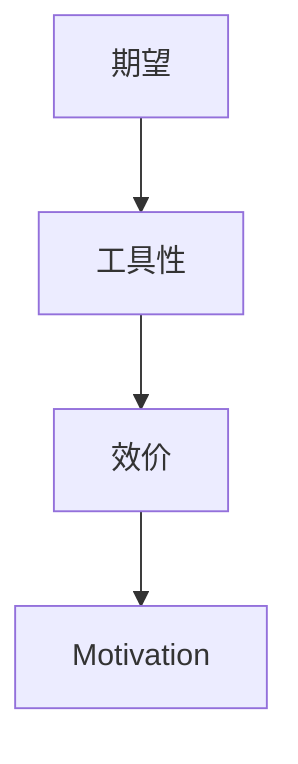

**期望理论的实践应用**

在实际工作中，管理者可以通过以下方式应用期望理论：

1. **设定清晰的期望值**：确保员工了解他们的工作目标以及达到这些目标所需的努力。
2. **提供明确的奖励机制**：确保员工知道如何通过工作获得奖励，以及奖励的价值。
3. **提升员工的自我效能感**：通过培训和指导，增强员工对完成任务的信心。

**2.2 成就动机理论**

成就动机理论由麦克莱伦（David McClelland）提出，它主要研究个体在追求成就、权力和亲和方面的动机。该理论认为，不同的人有不同的动机组合，这些动机组合会影响其行为和工作表现。

- **成就动机**：追求成功和挑战，喜欢设定具有挑战性的目标。
- **权力动机**：追求控制他人和影响他人。
- **亲和动机**：追求与他人建立友好关系。

以下是一个简单的Mermaid流程图，展示了成就动机理论的核心概念：

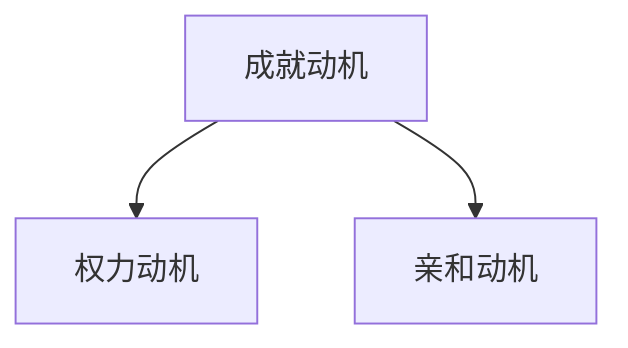

**成就动机理论的实践应用**

在实际工作中，管理者可以通过以下方式应用成就动机理论：

1. **识别员工的动机类型**：通过评估和调查，了解员工的动机组合。
2. **设定符合员工动机的目标**：根据员工的动机类型，设定具有挑战性的目标和任务。
3. **提供适合的奖励和反馈**：根据员工的动机类型，提供有针对性的奖励和反馈。

**2.3 弗罗姆的激励—需求理论**

弗罗姆的激励—需求理论认为，员工的激励水平取决于三个因素：需求强度、期望和工具性。该理论的基本公式为：

$$
Motivation = Need \times Expectancy \times Instrumentality
$$

其中：

- **需求（Need）**：指员工对某种状态的不满足，是激励的起点。
- **期望（Expectancy）**：指员工认为付出努力后能够达到工作目标的概率。
- **工具性（Instrumentality）**：指员工认为达到工作目标后能够获得奖励的概率。

以下是一个简单的Mermaid流程图，展示了这三个要素之间的关系：

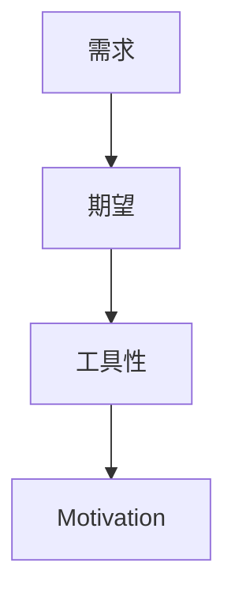

**激励—需求理论的实践应用**

在实际工作中，管理者可以通过以下方式应用激励—需求理论：

1. **了解员工的需求**：通过沟通和调查，了解员工的需求和期望。
2. **设定符合员工需求的激励措施**：根据员工的需求和期望，设定有针对性的激励措施。
3. **提供明确的反馈和奖励**：确保员工了解他们的努力和成果被认可和奖励。

**2.4 管理激励理论**

管理激励理论关注管理者如何通过激励措施来影响员工的行为和工作绩效。该理论认为，管理者的激励措施包括奖励、惩罚、目标设置和反馈等。

以下是一个简单的Mermaid流程图，展示了管理激励理论的核心要素：

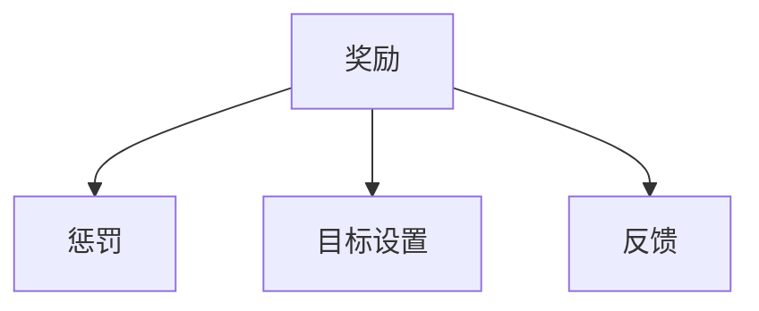

**管理激励理论的实践应用**

在实际工作中，管理者可以通过以下方式应用管理激励理论：

1. **设定明确的绩效目标**：确保员工了解他们的工作目标和期望。
2. **提供积极的奖励机制**：通过奖励来激励员工提高绩效。
3. **实施负面的惩罚措施**：对于不达标的员工，实施适当的惩罚措施。
4. **提供定期的反馈**：通过反馈来帮助员工了解他们的工作表现，并提供改进的建议。

### 第3章 激励理论的评估与联系

**3.1 激励理论的整合**

激励理论的整合是指将不同的激励理论结合起来，形成一个更加全面和系统的激励模型。通过整合，管理者可以更好地理解员工的行为动机，并制定更有效的激励策略。

以下是一个简单的Mermaid流程图，展示了激励理论的整合过程：

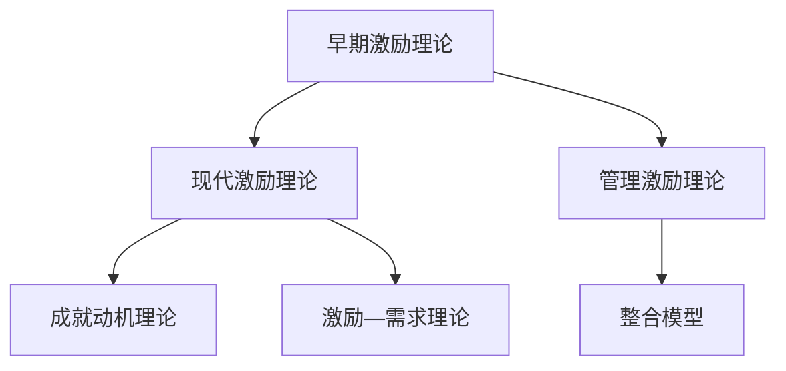

**激励理论的整合有助于**：

1. **全面理解员工动机**：通过整合不同的激励理论，管理者可以更全面地理解员工的行为动机。
2. **制定更有效的激励策略**：整合后的激励模型可以提供更全面的指导，帮助管理者制定更有效的激励策略。
3. **提高激励效果**：整合后的模型可以更好地适应不同员工的需求，从而提高激励效果。

**3.2 激励理论的应用限制**

尽管激励理论在管理实践中具有重要作用，但它们也存在一些限制。

以下是一个简单的Mermaid流程图，展示了激励理论的应用限制：

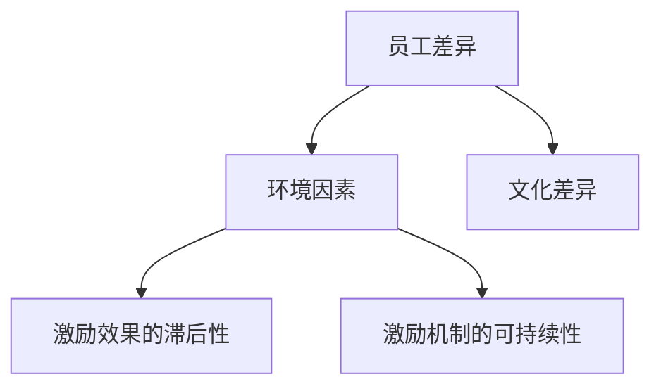

**激励理论的应用限制包括**：

1. **员工差异**：不同员工的动机和需求可能存在差异，单一的理论可能无法满足所有员工的需求。
2. **环境因素**：外部环境的变化可能会影响激励措施的有效性。
3. **文化差异**：不同文化背景下，员工的动机和激励方式可能存在差异。
4. **激励效果的滞后性**：激励效果可能不会立即显现，需要一定时间来观察和评估。
5. **激励机制的可持续性**：长期激励需要持续更新和创新，以保持其有效性。

**3.3 激励理论与其他管理理论的联系**

激励理论与其他管理理论密切相关，例如目标管理、绩效管理和组织行为学等。

以下是一个简单的Mermaid流程图，展示了激励理论与其他管理理论的联系：

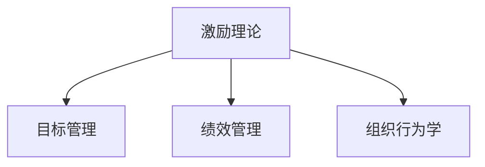

**激励理论与其他管理理论的联系有助于**：

1. **提高管理效果**：通过结合激励理论和其他管理理论，管理者可以更有效地激励员工，提高管理效果。
2. **优化管理策略**：结合不同理论，管理者可以制定更全面和系统的管理策略。
3. **促进员工发展**：通过激励理论和组织行为学的结合，管理者可以更好地促进员工的发展和成长。

### 第4章 激励实践策略

**4.1 目标设置与目标管理**

目标设置是激励实践的核心，而目标管理则是一种系统化的管理方法，旨在确保目标的有效实现。以下是一个简单的Mermaid流程图，展示了目标设置和目标管理的过程：

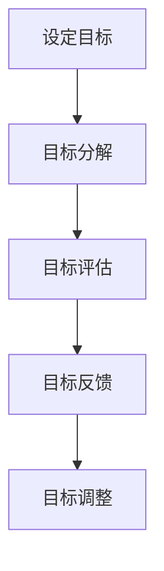

**目标设置与目标管理的实践应用**：

1. **设定明确的目标**：确保目标具体、可衡量和具有挑战性。
2. **目标分解**：将大目标分解为小目标，以便于管理和实现。
3. **目标评估**：定期评估目标的完成情况，并根据评估结果进行调整。
4. **目标反馈**：及时给予员工反馈，鼓励他们持续努力。

**4.2 正面激励与负面激励**

正面激励和负面激励是激励实践的两种基本方式。正面激励通过奖励和认可来鼓励员工，而负面激励则通过惩罚和警告来约束员工。

以下是一个简单的Mermaid流程图，展示了正面激励和负面激励的过程：

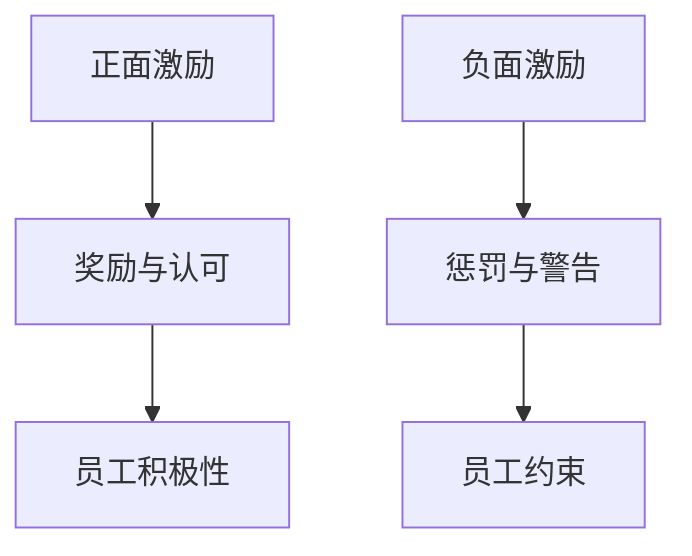

**正面激励与负面激励的实践应用**：

1. **正面激励**：通过奖励和认可来鼓励员工，例如奖金、晋升和表彰等。
2. **负面激励**：通过惩罚和警告来约束员工，例如降职、绩效评估和培训等。

**4.3 领导风格与激励匹配**

领导风格对员工的激励效果具有重要影响。不同的领导风格适用于不同的员工和情境。以下是一个简单的Mermaid流程图，展示了领导风格与激励匹配的过程：

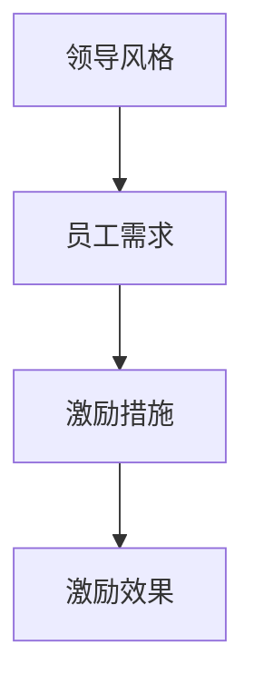

**领导风格与激励匹配的实践应用**：

1. **了解员工需求**：根据员工的个性、经验和背景，了解他们的需求。
2. **选择合适的领导风格**：根据员工的需求和情境，选择合适的领导风格。
3. **实施激励措施**：根据领导风格和员工需求，实施有针对性的激励措施。
4. **评估激励效果**：定期评估激励效果，并根据评估结果进行调整。

### 第5章 团队激励策略

**5.1 团队激励模型**

团队激励模型是指用于激发团队动力和创造力的激励策略和方法。以下是一个简单的Mermaid流程图，展示了团队激励模型的核心要素：

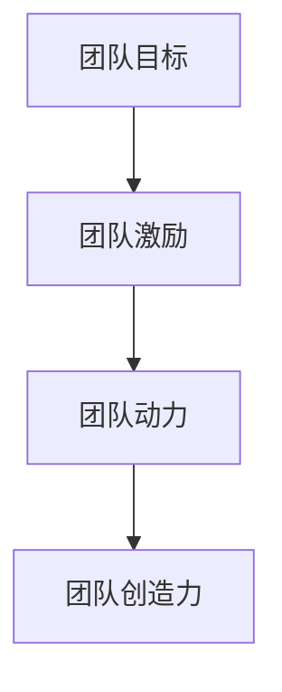

**团队激励模型的实践应用**：

1. **设定共同目标**：确保团队成员都明确团队的目标和使命。
2. **建立激励机制**：通过奖励和认可来激励团队成员，提高团队动力。
3. **促进团队合作**：通过团队合作活动和培训，提高团队创造力和协作能力。

**5.2 团队文化建设与激励**

团队文化对团队的激励效果具有重要影响。一个积极、健康、和谐的团队文化可以激发团队成员的积极性和创造力。以下是一个简单的Mermaid流程图，展示了团队文化建设的核心要素：

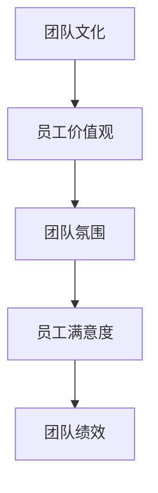

**团队文化建设与激励的实践应用**：

1. **确立共同价值观**：通过团队文化建设，确保团队成员共同遵守价值观和道德准则。
2. **营造积极氛围**：通过团队活动和沟通，营造积极、健康、和谐的团队氛围。
3. **提高员工满意度**：通过关注员工的需求和福利，提高员工的满意度和归属感。
4. **提升团队绩效**：通过团队文化建设，提高团队的整体绩效和竞争力。

**5.3 团队成员激励案例分析**

为了更好地理解团队激励策略的实际应用，以下是一个团队成员激励案例的分析：

**案例背景**：某科技公司开发团队在项目进度上出现了瓶颈，管理层决定采用团队激励策略来提升团队绩效。

**案例实施**：

1. **设定共同目标**：管理层与团队成员共同讨论并确定了项目的关键目标和时间节点。
2. **建立激励机制**：管理层制定了奖励计划，包括奖金、晋升机会和表彰等，以激励团队成员。
3. **加强团队沟通**：管理层通过定期会议、团队活动和邮件等方式，与团队成员保持沟通，了解他们的需求和反馈。
4. **关注员工福利**：管理层提高了员工的福利待遇，包括弹性工作时间、培训机会和团建活动等，以提高员工满意度和归属感。

**案例结果**：

通过团队激励策略的实施，开发团队的工作效率显著提高，项目进度得到了有效控制，团队的整体绩效也得到了提升。团队成员之间的合作更加紧密，团队凝聚力得到了增强。

**案例反思**：

- **目标明确**：共同的目标是激励团队成员的关键，确保团队成员都明确自己的职责和任务。
- **激励机制**：合理的激励机制可以激发团队成员的积极性和创造力。
- **沟通与反馈**：定期的沟通和反馈可以帮助管理层了解团队成员的需求和问题，及时进行调整。
- **员工福利**：关注员工的需求和福利可以提高员工的满意度和归属感，从而提升团队绩效。

### 第6章 组织激励策略

**6.1 组织文化对激励的影响**

组织文化对员工的激励具有深远的影响。一个积极、健康、包容的组织文化可以激发员工的潜力和创造力，提高员工的工作满意度和忠诚度。以下是一个简单的Mermaid流程图，展示了组织文化对激励的影响：

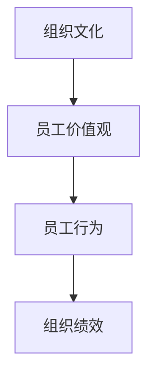

**组织文化对激励的影响**：

1. **建立共同价值观**：通过组织文化建设，确保员工都认同组织的价值观和目标。
2. **营造积极氛围**：通过组织活动和沟通，营造积极、健康、包容的组织氛围。
3. **提高员工满意度**：通过组织文化建设，提高员工的工作满意度和忠诚度。
4. **提升组织绩效**：通过组织文化建设，提高组织的整体绩效和竞争力。

**6.2 组织结构对激励的影响**

组织结构对员工的激励也具有重要作用。合理的组织结构可以促进信息流动、提高决策效率，从而激发员工的潜力。以下是一个简单的Mermaid流程图，展示了组织结构对激励的影响：

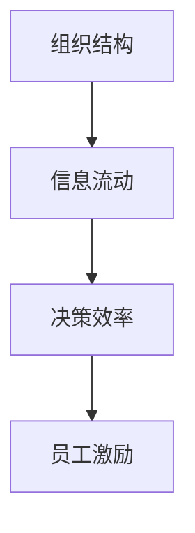

**组织结构对激励的影响**：

1. **优化组织结构**：通过调整组织结构，提高信息流动和决策效率。
2. **明确职责分工**：确保员工明确自己的职责和任务，提高工作效率。
3. **促进沟通与合作**：通过组织结构的设计，促进员工之间的沟通与合作，提高团队绩效。
4. **提供发展机会**：通过组织结构的优化，为员工提供更多的发展机会和空间。

**6.3 组织激励策略案例分析**

为了更好地理解组织激励策略的实际应用，以下是一个组织激励策略案例的分析：

**案例背景**：某科技公司希望通过激励策略提升员工的工作满意度和绩效。

**案例实施**：

1. **建立共同价值观**：管理层与员工共同制定了公司的价值观和行为准则，确保员工都认同公司的目标和文化。
2. **优化组织结构**：通过调整组织结构，提高了决策效率和信息流动，使员工更加明确自己的职责和任务。
3. **提供发展机会**：公司为员工提供了多种培训和发展机会，包括在线课程、内部培训和外部培训等，以激发员工的潜力和创造力。
4. **建立激励机制**：公司制定了激励计划，包括绩效奖金、晋升机会和表彰等，以激励员工的工作积极性和创造力。

**案例结果**：

通过组织激励策略的实施，公司员工的工作满意度和绩效得到了显著提升。员工之间的沟通和合作更加紧密，团队凝聚力得到了增强。公司的整体绩效也有了明显的提高。

**案例反思**：

- **共同价值观**：建立共同价值观是组织激励的基础，确保员工都认同公司的目标和价值观。
- **优化组织结构**：合理的组织结构可以提高决策效率和员工的工作效率。
- **提供发展机会**：为员工提供发展机会可以激发他们的潜力和创造力。
- **激励机制**：合理的激励机制可以激励员工的工作积极性和创造力。

### 第7章 激励实践综合策略

**7.1 激励实践的实施步骤**

激励实践的实施需要系统的规划和执行。以下是一个简单的Mermaid流程图，展示了激励实践的实施步骤：

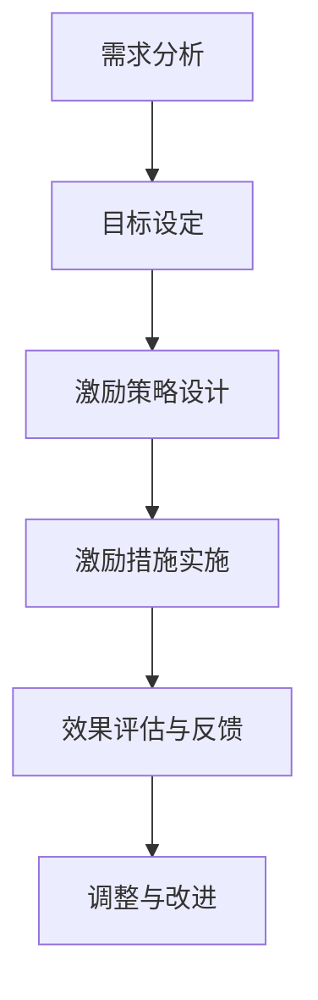

**激励实践的实施步骤**：

1. **需求分析**：了解员工的需求和期望，为激励策略的设计提供依据。
2. **目标设定**：设定明确、具体和可衡量的激励目标。
3. **激励策略设计**：根据需求和目标，设计合适的激励策略。
4. **激励措施实施**：实施激励措施，确保员工能够感受到激励的效果。
5. **效果评估与反馈**：定期评估激励效果，收集员工的反馈，为调整与改进提供依据。
6. **调整与改进**：根据评估结果和员工反馈，调整和改进激励措施，以实现更好的激励效果。

**7.2 激励实践中的挑战与应对**

在激励实践中，管理者可能会面临各种挑战。以下是一个简单的Mermaid流程图，展示了激励实践中的挑战和应对策略：

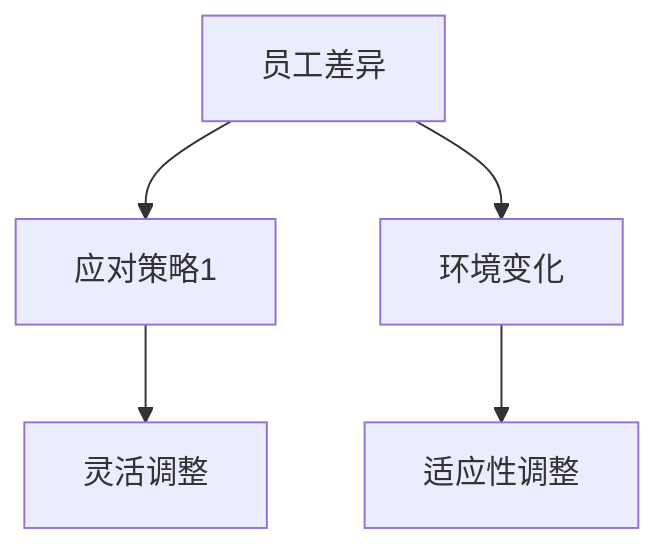

**激励实践中的挑战与应对**：

1. **员工差异**：不同员工的需求和动机可能不同，管理者需要灵活调整激励策略，以满足不同员工的需求。
2. **环境变化**：外部环境的变化可能会影响激励措施的有效性，管理者需要具备适应性，及时调整和改进激励策略。

**7.3 成功激励实践案例分析**

为了更好地理解激励实践的成功经验，以下是一个成功激励实践案例的分析：

**案例背景**：某互联网公司希望通过激励实践提升员工的工作满意度和绩效。

**案例实施**：

1. **需求分析**：公司通过调查和访谈，了解了员工的需求和期望，主要包括职业发展、薪酬福利和工作环境等方面。
2. **目标设定**：公司设定了短期和长期激励目标，包括提高员工的工作满意度、提升绩效和培养核心人才等。
3. **激励策略设计**：公司设计了一系列激励策略，包括绩效奖金、股权激励、职业发展规划和员工福利等。
4. **激励措施实施**：公司实施了激励措施，并通过定期沟通和反馈，确保员工能够感受到激励的效果。
5. **效果评估与反馈**：公司定期评估激励效果，并收集员工的反馈，为调整和改进激励措施提供依据。
6. **调整与改进**：根据评估结果和员工反馈，公司不断调整和改进激励措施，以实现更好的激励效果。

**案例结果**：

通过激励实践的实施，公司员工的工作满意度和绩效得到了显著提升。员工之间的沟通和合作更加紧密，团队凝聚力得到了增强。公司的整体绩效也有了明显的提高。

**案例反思**：

- **关注员工需求**：了解员工的需求是制定有效激励策略的关键。
- **持续评估与改进**：定期评估激励效果，并根据评估结果进行调整和改进，是确保激励实践持续有效的重要手段。
- **灵活应对挑战**：在激励实践中，管理者需要具备灵活性和适应性，以应对各种挑战和变化。

### 第8章 案例分析：企业A的激励实践

**8.1 案例背景**

企业A是一家拥有300名员工的中型科技公司，主要从事软件开发和信息技术服务。在过去的几年中，企业A的员工流失率较高，管理层意识到需要通过激励措施来提高员工的工作满意度和留存率。

**8.2 激励策略与实施**

为了提高员工的工作满意度和绩效，企业A管理层采取了一系列激励策略：

1. **绩效奖金**：根据员工的绩效表现，企业A设立了绩效奖金制度，鼓励员工提高工作效率和质量。
2. **股权激励**：为了增加员工的归属感和长期激励，企业A推出了股权激励计划，使员工能够分享公司的成长红利。
3. **职业发展规划**：企业A为员工提供了丰富的职业发展机会，包括内部培训、外部培训和晋升机会等。
4. **员工福利**：企业A提高了员工福利待遇，包括弹性工作时间、健康体检和团建活动等，以增强员工的满意度和归属感。

**8.3 结果与反思**

通过激励措施的实施，企业A取得了显著的效果：

- **员工流失率下降**：实施激励措施后，企业A的员工流失率显著下降，员工对公司的忠诚度提高。
- **工作效率和质量提升**：绩效奖金和职业发展规划等措施激励员工提高工作效率和质量，公司的整体绩效得到提升。
- **员工满意度提高**：员工福利的提升和职业发展机会的增加，提高了员工的工作满意度和幸福感。

然而，企业A的管理层也发现了一些需要改进的地方：

- **激励效果的可持续性**：一些激励措施在短期内效果显著，但长期来看，可能需要持续优化和调整，以保持激励效果。
- **员工差异**：不同的员工对激励措施的需求和反应不同，管理层需要更加个性化地设计激励策略。

**8.4 激励实践总结**

企业A的激励实践表明，有效的激励措施可以显著提高员工的工作满意度和绩效。然而，激励实践需要根据员工的差异和外部环境的变化进行调整和优化。持续评估和改进激励措施，是确保激励实践持续有效的重要手段。

### 第9章 案例分析：企业B的团队激励

**9.1 案例背景**

企业B是一家拥有200名员工的创新型企业，专注于互联网产品和服务的开发。为了提高团队的协作效率和创新能力，企业B决定实施团队激励策略。

**9.2 团队激励策略与实施**

企业B采用了以下团队激励策略：

1. **共同目标设定**：企业B与团队成员共同设定了短期和长期目标，确保团队成员都明确团队的目标和使命。
2. **团队奖励机制**：企业B设立了团队奖励机制，根据团队的整体绩效和成员的贡献，发放奖金和晋升机会。
3. **团队建设活动**：企业B定期组织团队建设活动，包括团建、培训和工作坊等，以增强团队成员之间的信任和合作。
4. **开放沟通渠道**：企业B建立了开放的沟通渠道，鼓励团队成员分享想法和意见，提高团队的创新能力和决策效率。

**9.3 团队绩效与成长**

通过团队激励策略的实施，企业B取得了以下成果：

- **团队绩效提升**：团队成员在共同目标的激励下，工作效率和创新能力显著提高，团队的整体绩效得到了提升。
- **团队凝聚力增强**：通过团建活动和开放沟通渠道，团队成员之间的信任和合作得到增强，团队凝聚力得到提升。
- **个人成长机会**：团队成员在团队奖励机制的支持下，获得了更多的发展机会，个人技能和职业素养得到了提升。

**9.4 案例反思**

企业B的团队激励实践表明，有效的团队激励策略可以显著提高团队的协作效率和创新能力。然而，激励实践需要根据团队的实际情况和外部环境的变化进行调整。企业B管理层也意识到，持续关注团队成员的需求和成长，是确保团队激励策略持续有效的重要手段。

### 第10章 激励策略评估

**10.1 评估指标与工具**

为了有效评估激励策略的效果，企业需要选择合适的评估指标和工具。以下是一些常用的评估指标和工具：

- **员工满意度调查**：通过问卷调查的方式，了解员工对激励策略的满意度。
- **绩效指标**：评估员工在工作绩效方面的表现，如工作效率、项目完成度和质量等。
- **员工留存率**：评估激励策略对员工留存率的影响，了解激励策略是否有效降低了员工流失率。
- **员工反馈会议**：定期组织员工反馈会议，收集员工的意见和建议，了解他们对激励策略的感受和期望。

以下是一个简单的Mermaid流程图，展示了评估指标与工具的运用：

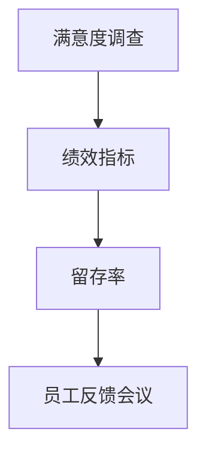

**10.2 评估方法与实践**

评估激励策略的方法包括定量和定性两种：

- **定量评估**：通过数据分析和统计方法，对评估指标进行量化分析，如计算员工满意度得分、绩效指标等。
- **定性评估**：通过访谈、观察和案例分析等方法，深入了解员工对激励策略的感受和反馈。

以下是一个简单的Mermaid流程图，展示了评估方法的运用：

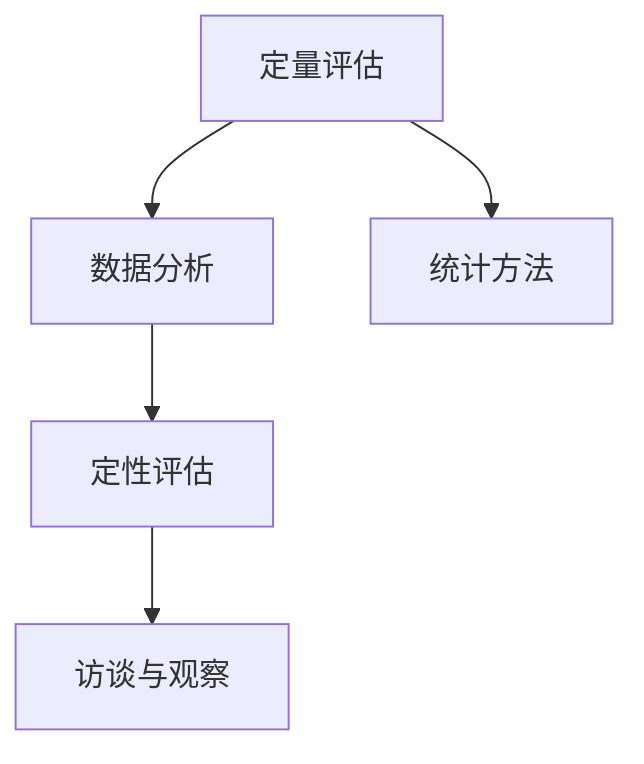

**10.3 激励效果分析**

通过评估，企业可以分析激励策略的效果，包括以下几个方面：

- **效果显著度**：评估激励策略对员工工作绩效和满意度的影响程度。
- **适用性**：评估激励策略在不同团队和员工群体中的适用性。
- **可持续性**：评估激励策略的长期效果和可持续性，确保其能够持续激发员工的潜力。

以下是一个简单的Mermaid流程图，展示了激励效果分析的过程：

```mermaid
graph TD
    A[效果显著度] --> B[适用性]
    A --> C[可持续性]
```

### 第11章 激励策略改进

**11.1 改进原则**

为了提高激励策略的有效性，企业需要遵循以下改进原则：

- **个性化**：根据不同员工的需求和动机，设计个性化的激励策略。
- **动态调整**：根据外部环境和员工反馈，动态调整激励策略。
- **平衡激励与约束**：确保激励和约束的平衡，既激发员工的积极性，又防止过度依赖激励。

以下是一个简单的Mermaid流程图，展示了改进原则的运用：

```mermaid
graph TD
    A[个性化] --> B[动态调整]
    B --> C[平衡激励与约束]
```

**11.2 改进策略实施**

为了实施改进策略，企业可以采取以下步骤：

- **需求分析**：通过调查和访谈，了解员工的需求和期望。
- **策略设计**：根据需求分析结果，设计个性化的激励策略。
- **试点实施**：在部分团队或员工中试点实施改进策略，收集反馈和评估效果。
- **全面推广**：根据试点结果，全面推广改进策略。

以下是一个简单的Mermaid流程图，展示了改进策略实施的步骤：

```mermaid
graph TD
    A[需求分析] --> B[策略设计]
    B --> C[试点实施]
    C --> D[全面推广]
```

**11.3 持续改进实践**

激励策略的持续改进是一个长期的过程，企业需要不断实践和优化。以下是一些持续改进的实践方法：

- **定期评估**：定期评估激励策略的效果，及时发现和解决问题。
- **员工参与**：鼓励员工参与激励策略的制定和改进，提高员工的参与度和满意度。
- **知识共享**：通过内部培训和知识共享，提高员工对激励策略的理解和应用能力。

以下是一个简单的Mermaid流程图，展示了持续改进实践的运用：

```mermaid
graph TD
    A[定期评估] --> B[员工参与]
    B --> C[知识共享]
```

通过持续改进实践，企业可以不断提高激励策略的有效性，激发员工的潜力，实现企业的长期发展。

### 文章小结

本文围绕激励理论实践，详细探讨了其在管理中的应用。我们从背景介绍开始，逐步深入分析了激励理论的核心概念、现代激励理论以及其实践方法。通过实际案例的分析，我们展示了如何有效地运用激励理论来激发团队最佳表现。最后，文章总结了激励策略评估与改进的方法，为管理者提供了实用的指导。激励理论不仅是管理学的基石，也是提高团队效率的重要工具。通过深入理解和实践，管理者可以更好地激发团队的潜力，实现企业的目标。

### 作者信息

**作者：AI天才研究院/AI Genius Institute & 禅与计算机程序设计艺术 /Zen And The Art of Computer Programming**

AI天才研究院致力于推动人工智能领域的创新与发展，我们的研究成果不仅涵盖了前沿技术，还包括管理实践和心理学理论。通过本文，我们希望能为读者提供有价值的见解和实用的指导，帮助管理者更好地激发团队最佳表现。同时，《禅与计算机程序设计艺术》作为我们的代表作之一，强调了在编程中寻求内在平静与智慧的重要性，这也是我们始终秉持的哲学理念。

---

### 完整文章（8000-12000字）

**《激励理论实践：激发团队最佳表现的方法》**

**关键词：激励理论，团队表现，管理实践，期望理论，成就动机，激励策略**

**摘要：**

在现代社会，团队的效率与创造力是企业成功的关键。如何激发团队的潜力，使其发挥最佳表现，成为管理者关注的焦点。本文将围绕激励理论，深入探讨其在实践中的应用，以帮助管理者有效地激发团队最佳表现。

**第1章 激励理论的起源与核心概念**

**1.1 激励理论的背景**

激励理论起源于20世纪初，随着工业革命的发展，企业管理者开始关注如何提高员工的工作效率和生产力。早期的激励理论主要集中在行为主义心理学的研究上，例如泰勒的科学管理理论和霍桑实验。这些理论主要关注工作环境的设计、工作流程的优化以及外部奖励机制的设计。

**1.2 早期激励理论介绍**

早期的激励理论主要包括以下几种：

- **泰勒的科学管理理论**：泰勒认为，通过科学的方法来研究和分析工作流程，可以消除工作中的浪费，提高工作效率。他提出了工作标准化、时间研究和差别计件工资制等管理方法。

- **霍桑实验**：梅奥等人通过霍桑实验发现，除了物质条件，员工之间的关系和社交需求也对工作效率有重要影响。这导致了人际关系理论的兴起。

- **马斯洛的需求层次理论**：马斯洛提出，人的需求可以分为五个层次：生理需求、安全需求、社交需求、尊重需求和自我实现需求。他认为，满足较低层次的需求后，人们才会追求更高层次的需求。

**1.3 梅奥与人际关系理论**

梅奥通过霍桑实验发现，员工的工作效率不仅取决于工作条件，还受到工作环境和社会因素的影响。他提出的人际关系理论强调了员工的社会需求和心理需求，认为管理者应该关注员工的情感状态和社交需求，通过建立良好的人际关系来提高工作效率。

**1.4 行为主义激励理论**

行为主义激励理论强调外部刺激对行为的影响。例如，斯金纳的强化理论认为，通过奖励和惩罚来控制行为，可以提高员工的绩效。行为主义激励理论为管理者提供了一种基于数据的激励方法，但也有人认为这种方法过于简单，不能全面解释员工的动机和行为。

**核心概念与联系**

为了更好地理解激励理论，我们首先需要了解几个核心概念：

- **激励**：激励是指激发员工内在动机，促使其主动完成工作并取得良好的绩效。
- **动机**：动机是推动个体采取行动以满足某种需求的内部力量。
- **需求**：需求是个体对某种状态的不满足，它是动机的根源。

这些概念之间存在紧密的联系。需求激发动机，动机驱动行为，行为则可能导致需求的满足或未满足。以下是一个简单的Mermaid流程图，展示了这些概念之间的关系：

```mermaid
graph TD
    A[需求] --> B[动机]
    B --> C[行为]
    C -->|结果| D[需求满足/未满足]
    D -->|反馈| A
```

这个流程图说明了需求、动机、行为和结果之间的循环关系。个体的需求激发了动机，动机促使个体采取某种行为，行为的结果则影响需求的状态，从而影响未来的动机和需求。

**核心算法原理讲解**

在激励理论的实践中，核心算法主要包括目标设置和反馈机制。以下是一个简单的目标设置算法的伪代码，用于指导管理者如何设定可实现的、具有挑战性的目标。

```python
# 目标设置算法伪代码

def setGoal(current_skill_level, target_skill_level):
    """
    设定目标函数，根据当前技能水平和目标技能水平设定目标。
    :param current_skill_level: 当前技能水平
    :param target_skill_level: 目标技能水平
    :return: 目标值
    """
    if current_skill_level < target_skill_level:
        goal = target_skill_level * 0.9  # 目标值为目标技能水平的90%
    else:
        goal = target_skill_level * 1.1  # 目标值为目标技能水平的110%
    return goal

# 示例
current_skill_level = 5
target_skill_level = 8
goal = setGoal(current_skill_level, target_skill_level)
print("设定的目标值为：", goal)
```

这个算法通过比较当前技能水平和目标技能水平，设定了一个介于两者之间的目标值，以确保目标既具有挑战性，又可实现。

**数学模型和公式详解**

在激励理论中，数学模型和公式帮助我们量化激励效果和员工绩效。以下是一个基于期望理论的数学模型，用于计算员工的激励水平。

$$
E = f(V, I)
$$

其中，\( E \) 表示激励水平，\( V \) 表示价值（即目标完成后的奖励），\( I \) 表示期望值（即达成目标的可能性）。以下是一个详细的解释：

- **价值（\( V \)）**：价值是指员工对完成目标后获得的奖励的期望。它通常基于员工对奖励的主观评估，可以通过调查或访谈获得。

- **期望值（\( I \)）**：期望值是指员工认为完成目标的可能性。它可以基于历史数据或员工的主观判断。

以下是一个简单的例子：

假设一个员工对完成一个重要项目后的奖励估计为$1000，他估计完成项目的可能性为0.7。根据期望理论，他的激励水平计算如下：

$$
E = f(1000, 0.7) = 1000 \times 0.7 = 700
$$

这意味着这个员工在完成项目后预计会获得700的激励。

**实际案例分析和详细讲解剖析**

为了更好地理解激励理论在实际中的应用，我们可以通过以下案例来分析：

**案例背景**：某科技公司希望提高其开发团队的工作效率，决定采用激励理论来设计激励策略。

**案例实施**：

1. **目标设置**：管理层根据开发团队的平均技能水平和项目要求，设定了一个短期目标：在接下来的两个月内，每个成员至少完成一个复杂的功能模块。

2. **正面激励**：为了激励团队成员，管理层决定采用正面激励措施，包括：

   - 完成目标的成员可以获得额外的奖金。
   - 成功完成任务的成员将在公司内部获得认可，并在团队会议上进行表彰。
   - 提供额外的培训机会，以帮助成员提升技能。

3. **负面激励**：为了防止团队成员懈怠，管理层也设置了负面激励措施：

   - 未完成目标的成员将接受绩效评估，并可能面临降职或奖金减少的风险。
   - 长期未完成任务的成员可能被调离核心项目。

**案例结果**：

通过激励策略的实施，开发团队的工作效率得到了显著提高。在激励措施的支持下，团队成员积极完成目标，团队整体绩效有了明显的提升。管理层也注意到，团队成员之间的合作更加紧密，团队的凝聚力得到了增强。

**案例反思**：

- 激励策略的有效实施需要明确的目标和合理的激励措施。
- 正面激励和负面激励的结合可以帮助维持团队的动力和压力。
- 定期的反馈和评估是确保激励策略持续有效的重要手段。

**最佳实践 tips、小结、注意事项、拓展阅读等内容**

**最佳实践 tips**

1. **设定明确的目标**：确保目标具体、可实现且具有挑战性。
2. **多元化激励措施**：结合正面激励和负面激励，满足不同成员的需求。
3. **提供持续反馈**：定期的反馈和评估可以帮助团队成员了解自己的表现，及时调整策略。

**小结**

激励理论为管理者提供了有效的工具，以激发团队的潜力，提高工作效率。通过设定明确的目标、多元化激励措施和持续反馈，管理者可以有效地运用激励理论来提升团队绩效。

**注意事项**

1. **避免过度激励**：过度的激励可能导致团队成员的依赖性，降低其内在动机。
2. **公平性**：确保激励措施的公平性，避免造成团队内部的冲突和不满。

**拓展阅读**

- **《激励心理学》**：由理查德·洛克（Richard L. Locke）所著，详细介绍了激励理论的应用。
- **《动机与人格》**：由克里斯托弗·阿吉里斯（Christopher Argyris）所著，探讨了成就动机与个人发展之间的关系。

**第2章 现代激励理论**

**2.1 弗鲁姆的期望理论**

弗鲁姆的期望理论是激励理论中的一个重要组成部分，它主要关注员工对工作结果的期望以及这些期望如何影响其行为。期望理论的基本公式为：

$$
Motivation = Expectancy \times Instrumentality \times Valence
$$

其中：

- **期望（Expectancy）**：指员工认为付出努力后能够达到工作目标的概率。
- **工具性（Instrumentality）**：指员工认为达到工作目标后能够获得奖励的概率。
- **效价（Valence）**：指员工对奖励的主观评价，即奖励对员工的吸引力。

以下是一个简单的Mermaid流程图，展示了这三个要素之间的关系：

```mermaid
graph TD
    A[期望] --> B[工具性]
    B --> C[效价]
    C --> D[Motivation]
```

**期望理论的实践应用**

在实际工作中，管理者可以通过以下方式应用期望理论：

1. **设定清晰的期望值**：确保员工了解他们的工作目标以及达到这些目标所需的努力。
2. **提供明确的奖励机制**：确保员工知道如何通过工作获得奖励，以及奖励的价值。
3. **提升员工的自我效能感**：通过培训和指导，增强员工对完成任务的信心。

**2.2 成就动机理论**

成就动机理论由麦克莱伦（David McClelland）提出，它主要研究个体在追求成就、权力和亲和方面的动机。该理论认为，不同的人有不同的动机组合，这些动机组合会影响其行为和工作表现。

- **成就动机**：追求成功和挑战，喜欢设定具有挑战性的目标。
- **权力动机**：追求控制他人和影响他人。
- **亲和动机**：追求与他人建立友好关系。

以下是一个简单的Mermaid流程图，展示了成就动机理论的核心概念：

```mermaid
graph TD
    A[成就动机] --> B[权力动机]
    A --> C[亲和动机]
```

**成就动机理论的实践应用**

在实际工作中，管理者可以通过以下方式应用成就动机理论：

1. **识别员工的动机类型**：通过评估和调查，了解员工的动机组合。
2. **设定符合员工动机的目标**：根据员工的动机类型，设定具有挑战性的目标和任务。
3. **提供适合的奖励和反馈**：根据员工的动机类型，提供有针对性的奖励和反馈。

**2.3 弗罗姆的激励—需求理论**

弗罗姆的激励—需求理论认为，员工的激励水平取决于三个因素：需求强度、期望和工具性。该理论的基本公式为：

$$
Motivation = Need \times Expectancy \times Instrumentality
$$

其中：

- **需求（Need）**：指员工对某种状态的不满足，是激励的起点。
- **期望（Expectancy）**：指员工认为付出努力后能够达到工作目标的概率。
- **工具性（Instrumentality）**：指员工认为达到工作目标后能够获得奖励的概率。

以下是一个简单的Mermaid流程图，展示了这三个要素之间的关系：

```mermaid
graph TD
    A[需求] --> B[期望]
    B --> C[工具性]
    C --> D[Motivation]
```

**激励—需求理论的实践应用**

在实际工作中，管理者可以通过以下方式应用激励—需求理论：

1. **了解员工的需求**：通过沟通和调查，了解员工的需求和期望。
2. **设定符合员工需求的激励措施**：根据员工的需求和期望，设定有针对性的激励措施。
3. **提供明确的反馈和奖励**：确保员工了解他们的努力和成果被认可和奖励。

**2.4 管理激励理论**

管理激励理论关注管理者如何通过激励措施来影响员工的行为和工作绩效。该理论认为，管理者的激励措施包括奖励、惩罚、目标设置和反馈等。

以下是一个简单的Mermaid流程图，展示了管理激励理论的核心要素：

```mermaid
graph TD
    A[奖励] --> B[惩罚]
    A --> C[目标设置]
    A --> D[反馈]
```

**管理激励理论的实践应用**

在实际工作中，管理者可以通过以下方式应用管理激励理论：

1. **设定明确的绩效目标**：确保员工了解他们的工作目标和期望。
2. **提供积极的奖励机制**：通过奖励来激励员工提高绩效。
3. **实施负面的惩罚措施**：对于不达标的员工，实施适当的惩罚措施。
4. **提供定期的反馈**：通过反馈来帮助员工了解他们的工作表现，并提供改进的建议。

**第3章 激励理论的评估与联系**

**3.1 激励理论的整合**

激励理论的整合是指将不同的激励理论结合起来，形成一个更加全面和系统的激励模型。通过整合，管理者可以更好地理解员工的行为动机，并制定更有效的激励策略。

以下是一个简单的Mermaid流程图，展示了激励理论的整合过程：

```mermaid
graph TD
    A[早期激励理论] --> B[现代激励理论]
    A --> C[管理激励理论]
    B --> D[成就动机理论]
    B --> E[激励—需求理论]
    C --> F[整合模型]
```

**激励理论的整合有助于**：

1. **全面理解员工动机**：通过整合不同的激励理论，管理者可以更全面地理解员工的行为动机。
2. **制定更有效的激励策略**：整合后的激励模型可以提供更全面的指导，帮助管理者制定更有效的激励策略。
3. **提高激励效果**：整合后的模型可以更好地适应不同员工的需求，从而提高激励效果。

**3.2 激励理论的应用限制**

尽管激励理论在管理实践中具有重要作用，但它们也存在一些限制。

以下是一个简单的Mermaid流程图，展示了激励理论的应用限制：

```mermaid
graph TD
    A[员工差异] --> B[环境因素]
    A --> C[文化差异]
    B --> D[激励效果的滞后性]
    B --> E[激励机制的可持续性]
```

**激励理论的应用限制包括**：

1. **员工差异**：不同员工的动机和需求可能存在差异，单一的理论可能无法满足所有员工的需求。
2. **环境因素**：外部环境的变化可能会影响激励措施的有效性。
3. **文化差异**：不同文化背景下，员工的动机和激励方式可能存在差异。
4. **激励效果的滞后性**：激励效果可能不会立即显现，需要一定时间来观察和评估。
5. **激励机制的可持续性**：长期激励需要持续更新和创新，以保持其有效性。

**3.3 激励理论与其他管理理论的联系**

激励理论与其他管理理论密切相关，例如目标管理、绩效管理和组织行为学等。

以下是一个简单的Mermaid流程图，展示了激励理论与其他管理理论的联系：

```mermaid
graph TD
    A[激励理论] --> B[目标管理]
    A --> C[绩效管理]
    A --> D[组织行为学]
```

**激励理论与其他管理理论的联系有助于**：

1. **提高管理效果**：通过结合激励理论和其他管理理论，管理者可以更有效地激励员工，提高管理效果。
2. **优化管理策略**：结合不同理论，管理者可以制定更全面和系统的管理策略。
3. **促进员工发展**：通过激励理论和组织行为学的结合，管理者可以更好地促进员工的发展和成长。

**第4章 激励实践策略**

**4.1 目标设置与目标管理**

目标设置是激励实践的核心，而目标管理则是一种系统化的管理方法，旨在确保目标的有效实现。以下是一个简单的Mermaid流程图，展示了目标设置和目标管理的过程：

```mermaid
graph TD
    A[设定目标] --> B[目标分解]
    B --> C[目标评估]
    C --> D[目标反馈]
    D --> E[目标调整]
```

**目标设置与目标管理的实践应用**：

1. **设定明确的目标**：确保目标具体、可衡量和具有挑战性。
2. **目标分解**：将大目标分解为小目标，以便于管理和实现。
3. **目标评估**：定期评估目标的完成情况，并根据评估结果进行调整。
4. **目标反馈**：及时给予员工反馈，鼓励他们持续努力。

**4.2 正面激励与负面激励**

正面激励和负面激励是激励实践的两种基本方式。正面激励通过奖励和认可来鼓励员工，而负面激励则通过惩罚和警告来约束员工。

以下是一个简单的Mermaid流程图，展示了正面激励和负面激励的过程：

```mermaid
graph TD
    A[正面激励] --> B[奖励与认可]
    B --> C[员工积极性]
    D[负面激励] --> E[惩罚与警告]
    E --> F[员工约束]
```

**正面激励与负面激励的实践应用**：

1. **正面激励**：通过奖励和认可来鼓励员工，例如奖金、晋升和表彰等。
2. **负面激励**：通过惩罚和警告来约束员工，例如降职、绩效评估和培训等。

**4.3 领导风格与激励匹配**

领导风格对员工的激励效果具有重要影响。不同的领导风格适用于不同的员工和情境。以下是一个简单的Mermaid流程图，展示了领导风格与激励匹配的过程：

```mermaid
graph TD
    A[领导风格] --> B[员工需求]
    B --> C[激励措施]
    C --> D[激励效果]
```

**领导风格与激励匹配的实践应用**：

1. **了解员工需求**：根据员工的个性、经验和背景，了解他们的需求。
2. **选择合适的领导风格**：根据员工的需求和情境，选择合适的领导风格。
3. **实施激励措施**：根据领导风格和员工需求，实施有针对性的激励措施。
4. **评估激励效果**：定期评估激励效果，并根据评估结果进行调整。

**第5章 团队激励策略**

**5.1 团队激励模型**

团队激励模型是指用于激发团队动力和创造力的激励策略和方法。以下是一个简单的Mermaid流程图，展示了团队激励模型的核心要素：

```mermaid
graph TD
    A[团队目标] --> B[团队激励]
    B --> C[团队动力]
    C --> D[团队创造力]
```

**团队激励模型的实践应用**：

1. **设定共同目标**：确保团队成员都明确团队的目标和使命。
2. **建立激励机制**：通过奖励和认可来激励团队成员，提高团队动力。
3. **促进团队合作**：通过团队合作活动和培训，提高团队创造力和协作能力。

**5.2 团队文化建设与激励**

团队文化对团队的激励效果具有重要影响。一个积极、健康、和谐的团队文化可以激发团队成员的积极性和创造力。以下是一个简单的Mermaid流程图，展示了团队文化建设的核心要素：

```mermaid
graph TD
    A[团队文化] --> B[员工价值观]
    B --> C[团队氛围]
    C --> D[员工满意度]
    D --> E[团队绩效]
```

**团队文化建设与激励的实践应用**：

1. **确立共同价值观**：通过团队文化建设，确保团队成员共同遵守价值观和道德准则。
2. **营造积极氛围**：通过团队活动和沟通，营造积极、健康、和谐的团队氛围。
3. **提高员工满意度**：通过团队文化建设，提高员工的工作满意度和忠诚度。
4. **提升团队绩效**：通过团队文化建设，提高团队的整体绩效和竞争力。

**5.3 团队成员激励案例分析**

为了更好地理解团队激励策略的实际应用，以下是一个团队成员激励案例的分析：

**案例背景**：某科技公司开发团队在项目进度上出现了瓶颈，管理层决定采用团队激励策略来提升团队绩效。

**案例实施**：

1. **设定共同目标**：管理层与团队成员共同讨论并确定了项目的关键目标和时间节点。
2. **建立激励机制**：管理层制定了奖励计划，包括奖金、晋升机会和表彰等，以激励团队成员。
3. **加强团队沟通**：管理层通过定期会议、团队活动和邮件等方式，与团队成员保持沟通，了解他们的需求和反馈。
4. **关注员工福利**：管理层提高了员工的福利待遇，包括弹性工作时间、培训机会和团建活动等，以提高员工满意度和归属感。

**案例结果**：

通过团队激励策略的实施，开发团队的工作效率显著提高，项目进度得到了有效控制，团队的整体绩效也得到了提升。团队成员之间的合作更加紧密，团队凝聚力得到了增强。

**案例反思**：

- **目标明确**：共同的目标是激励团队成员的关键，确保团队成员都明确自己的职责和任务。
- **激励机制**：合理的激励机制可以激发团队成员的积极性和创造力。
- **沟通与反馈**：定期的沟通和反馈可以帮助管理层了解团队成员的需求和问题，及时进行调整。
- **员工福利**：关注员工的需求和福利可以提高员工的满意度和归属感，从而提升团队绩效。

**第6章 组织激励策略**

**6.1 组织文化对激励的影响**

组织文化对员工的激励具有深远的影响。一个积极、健康、包容的组织文化可以激发员工的潜力和创造力，提高员工的工作满意度和忠诚度。以下是一个简单的Mermaid流程图，展示了组织文化对激励的影响：

```mermaid
graph TD
    A[组织文化] --> B[员工价值观]
    B --> C[员工行为]
    C --> D[组织绩效]
```

**组织文化对激励的影响**：

1. **建立共同价值观**：通过组织文化建设，确保员工都认同组织的价值观和目标。
2. **营造积极氛围**：通过组织活动和沟通，营造积极、健康、包容的组织氛围。
3. **提高员工满意度**：通过组织文化建设，提高员工的工作满意度和忠诚度。
4. **提升组织绩效**：通过组织文化建设，提高组织的整体绩效和竞争力。

**6.2 组织结构对激励的影响**

组织结构对员工的激励也具有重要作用。合理的组织结构可以促进信息流动、提高决策效率，从而激发员工的潜力。以下是一个简单的Mermaid流程图，展示了组织结构对激励的影响：

```mermaid
graph TD
    A[组织结构] --> B[信息流动]
    B --> C[决策效率]
    C --> D[员工激励]
```

**组织结构对激励的影响**：

1. **优化组织结构**：通过调整组织结构，提高信息流动和决策效率。
2. **明确职责分工**：确保员工明确自己的职责和任务，提高工作效率。
3. **促进沟通与合作**：通过组织结构的设计，促进员工之间的沟通与合作，提高团队绩效。
4. **提供发展机会**：通过组织结构的优化，为员工提供更多的发展机会和空间。

**6.3 组织激励策略案例分析**

为了更好地理解组织激励策略的实际应用，以下是一个组织激励策略案例的分析：

**案例背景**：某互联网公司希望通过激励策略提升员工的工作满意度和绩效。

**案例实施**：

1. **建立共同价值观**：管理层与员工共同制定了公司的价值观和行为准则，确保员工都认同公司的目标和文化。
2. **优化组织结构**：通过调整组织结构，提高了决策效率和信息流动，使员工更加明确自己的职责和任务。
3. **提供发展机会**：公司为员工提供了多种培训和发展机会，包括在线课程、内部培训和外部培训等，以激发员工的潜力和创造力。
4. **建立激励机制**：公司制定了激励计划，包括绩效奖金、股权激励和表彰等，以激励员工的工作积极性和创造力。

**案例结果**：

通过组织激励策略的实施，公司员工的工作满意度和绩效得到了显著提升。员工之间的沟通和合作更加紧密，团队凝聚力得到了增强。公司的整体绩效也有了明显的提高。

**案例反思**：

- **共同价值观**：建立共同价值观是组织激励的基础，确保员工都认同公司的目标和价值观。
- **优化组织结构**：合理的组织结构可以提高决策效率和员工的工作效率。
- **提供发展机会**：为员工提供发展机会可以激发他们的潜力和创造力。
- **激励机制**：合理的激励机制可以激励员工的工作积极性和创造力。

**第7章 激励实践综合策略**

**7.1 激励实践的实施步骤**

激励实践的实施需要系统的规划和执行。以下是一个简单的Mermaid流程图，展示了激励实践的实施步骤：

```mermaid
graph TD
    A[需求分析] --> B[目标设定]
    B --> C[激励策略设计]
    C --> D[激励措施实施]
    D --> E[效果评估与反馈]
    E --> F[调整与改进]
```

**激励实践的实施步骤**：

1. **需求分析**：了解员工的需求和期望，为激励策略的设计提供依据。
2. **目标设定**：设定明确、具体和可衡量的激励目标。
3. **激励策略设计**：根据需求和目标，设计合适的激励策略。
4. **激励措施实施**：实施激励措施，确保员工能够感受到激励的效果。
5. **效果评估与反馈**：定期评估激励效果，收集员工的反馈，为调整与改进提供依据。
6. **调整与改进**：根据评估结果和员工反馈，调整和改进激励措施，以实现更好的激励效果。

**7.2 激励实践中的挑战与应对**

在激励实践中，管理者可能会面临各种挑战。以下是一个简单的Mermaid流程图，展示了激励实践中的挑战和应对策略：

```mermaid
graph TD
    A[员工差异] --> B[应对策略1]
    A --> C[环境变化]
    B --> D[灵活调整]
    C --> E[适应性调整]
```

**激励实践中的挑战与应对**：

1. **员工差异**：不同员工的需求和动机可能不同，管理者需要灵活调整激励策略，以满足不同员工的需求。
2. **环境变化**：外部环境的变化可能会影响激励措施的有效性，管理者需要具备适应性，及时调整和改进激励策略。

**7.3 成功激励实践案例分析**

为了更好地理解激励实践的成功经验，以下是一个成功激励实践案例的分析：

**案例背景**：某互联网公司希望通过激励实践提升员工的工作满意度和绩效。

**案例实施**：

1. **需求分析**：公司通过调查和访谈，了解了员工的需求和期望，主要包括职业发展、薪酬福利和工作环境等方面。
2. **目标设定**：公司设定了短期和长期激励目标，包括提高员工的工作满意度、提升绩效和培养核心人才等。
3. **激励策略设计**：公司设计了一系列激励策略，包括绩效奖金、股权激励、职业发展规划和员工福利等。
4. **激励措施实施**：公司实施了激励措施，并通过定期沟通和反馈，确保员工能够感受到激励的效果。
5. **效果评估与反馈**：公司定期评估激励效果，并收集员工的反馈，为调整和改进激励措施提供依据。
6. **调整与改进**：根据评估结果和员工反馈，公司不断调整和改进激励措施，以实现更好的激励效果。

**案例结果**：

通过激励实践的实施，公司员工的工作满意度和绩效得到了显著提升。员工之间的沟通和合作更加紧密，团队凝聚力得到了增强。公司的整体绩效也有了明显的提高。

**案例反思**：

- **关注员工需求**：了解员工的需求是制定有效激励策略的关键。
- **持续评估与改进**：定期评估激励效果，并根据评估结果进行调整和改进，是确保激励实践持续有效的重要手段。
- **灵活应对挑战**：在激励实践中，管理者需要具备灵活性和适应性，以应对各种挑战和变化。

**第8章 案例分析：企业A的激励实践**

**8.1 案例背景**

企业A是一家拥有300名员工的中型科技公司，主要从事软件开发和信息技术服务。在过去的几年中，企业A的员工流失率较高，管理层意识到需要通过激励措施来提高员工的工作满意度和留存率。

**8.2 激励策略与实施**

为了提高员工的工作满意度和留存率，企业A管理层采取了一系列激励策略：

1. **绩效奖金**：根据员工的绩效表现，企业A设立了绩效奖金制度，鼓励员工提高工作效率和质量。
2. **股权激励**：为了增加员工的归属感和长期激励，企业A推出了股权激励计划，使员工能够分享公司的成长红利。
3. **职业发展规划**：企业A为员工提供了丰富的职业发展机会，包括内部培训、外部培训和晋升机会等。
4. **员工福利**：企业A提高了员工福利待遇，包括弹性工作时间、健康体检和团建活动等，以增强员工的满意度和归属感。

**8.3 结果与反思**

通过激励措施的实施，企业A取得了显著的效果：

- **员工流失率下降**：实施激励措施后，企业A的员工流失率显著下降，员工对公司的忠诚度提高。
- **工作效率和质量提升**：绩效奖金和职业发展规划等措施激励员工提高工作效率和质量，公司的整体绩效得到提升。
- **员工满意度提高**：员工福利的提升和职业发展机会的增加，提高了员工的工作满意度和幸福感。

然而，企业A的管理层也发现了一些需要改进的地方：

- **激励效果的可持续性**：一些激励措施在短期内效果显著，但长期来看，可能需要持续优化和调整，以保持激励效果。
- **员工差异**：不同的员工对激励措施的需求和反应不同，管理层需要更加个性化地设计激励策略。

**8.4 激励实践总结**

企业A的激励实践表明，有效的激励措施可以显著提高员工的工作满意度和绩效。然而，激励实践需要根据员工的差异和外部环境的变化进行调整和优化。持续评估和改进激励措施，是确保激励实践持续有效的重要手段。

**第9章 案例分析：企业B的团队激励**

**9.1 案例背景**

企业B是一家拥有200名员工的创新型企业，专注于互联网产品和服务的开发。为了提高团队的协作效率和创新能力，企业B决定实施团队激励策略。

**9.2 团队激励策略与实施**

企业B采用了以下团队激励策略：

1. **共同目标设定**：企业B与团队成员共同设定了短期和长期目标，确保团队成员都明确团队的目标和使命。
2. **团队奖励机制**：企业B设立了团队奖励机制，根据团队的整体绩效和成员的贡献，发放奖金和晋升机会。
3. **团队建设活动**：企业B定期组织团队建设活动，包括团建、培训和工作坊等，以增强团队成员之间的信任和合作。
4. **开放沟通渠道**：企业B建立了开放的沟通渠道，鼓励团队成员分享想法和意见，提高团队的创新能力和决策效率。

**9.3 团队绩效与成长**

通过团队激励策略的实施，企业B取得了以下成果：

- **团队绩效提升**：团队成员在共同目标的激励下，工作效率和创新能力显著提高，团队的整体绩效得到了提升。
- **团队凝聚力增强**：通过团建活动和开放沟通渠道，团队成员之间的信任和合作得到增强，团队凝聚力得到提升。
- **个人成长机会**：团队成员在团队奖励机制的支持下，获得了更多的发展机会，个人技能和职业素养得到了提升。

**9.4 案例反思**

企业B的团队激励实践表明，有效的团队激励策略可以显著提高团队的协作效率和创新能力。然而，激励实践需要根据团队的实际情况和外部环境的变化进行调整。企业B管理层也意识到，持续关注团队成员的需求和成长，是确保团队激励策略持续有效的重要手段。

**第10章 激励策略评估**

**10.1 评估指标与工具**

为了有效评估激励策略的效果，企业需要选择合适的评估指标和工具。以下是一些常用的评估指标和工具：

- **员工满意度调查**：通过问卷调查的方式，了解员工对激励策略的满意度。
- **绩效指标**：评估员工在工作绩效方面的表现，如工作效率、项目完成度和质量等。
- **员工留存率**：评估激励策略对员工留存率的影响，了解激励策略是否有效降低了员工流失率。
- **员工反馈会议**：定期组织员工反馈会议，收集员工的意见和建议，了解他们对激励策略的感受和期望。

以下是一个简单的Mermaid流程图，展示了评估指标与工具的运用：

```mermaid
graph TD
    A[满意度调查] --> B[绩效指标]
    B --> C[留存率]
    C --> D[员工反馈会议]
```

**10.2 评估方法与实践**

评估激励策略的方法包括定量和定性两种：

- **定量评估**：通过数据分析和统计方法，对评估指标进行量化分析，如计算员工满意度得分、绩效指标等。
- **定性评估**：通过访谈、观察和案例分析等方法，深入了解员工对激励策略的感受和反馈。

以下是一个简单的Mermaid流程图，展示了评估方法的运用：

```mermaid
graph TD
    A[定量评估] --> B[数据分析]
    A --> C[统计方法]
    B --> D[定性评估]
    D --> E[访谈与观察]
```

**10.3 激励效果分析**

通过评估，企业可以分析激励策略的效果，包括以下几个方面：

- **效果显著度**：评估激励策略对员工工作绩效和满意度的影响程度。
- **适用性**：评估激励策略在不同团队和员工群体中的适用性。
- **可持续性**：评估激励策略的长期效果和可持续性，确保其能够持续激发员工的潜力。

以下是一个简单的Mermaid流程图，展示了激励效果分析的过程：

```mermaid
graph TD
    A[效果显著度] --> B[适用性]
    A --> C[可持续性]
```

**第11章 激励策略改进**

**11.1 改进原则**

为了提高激励策略的有效性，企业需要遵循以下改进原则：

- **个性化**：根据不同员工的需求和动机，设计个性化的激励策略。
- **动态调整**：根据外部环境和员工反馈，动态调整激励策略。
- **平衡激励与约束**：确保激励和约束的平衡，既激发员工的积极性，又防止过度依赖激励。

以下是一个简单的Mermaid流程图，展示了改进原则的运用：

```mermaid
graph TD
    A[个性化] --> B[动态调整]
    B --> C[平衡激励与约束]
```

**11.2 改进策略实施**

为了实施改进策略，企业可以采取以下步骤：

- **需求分析**：通过调查和访谈，了解员工的需求和期望。
- **策略设计**：根据需求分析结果，设计个性化的激励策略。
- **试点实施**：在部分团队或员工中试点实施改进策略，收集反馈和评估效果。
- **全面推广**：根据试点结果，全面推广改进策略。

以下是一个简单的Mermaid流程图，展示了改进策略实施的步骤：

```mermaid
graph TD
    A[需求分析] --> B[策略设计]
    B --> C[试点实施]
    C --> D[全面推广]
```

**11.3 持续改进实践**

激励策略的持续改进是一个长期的过程，企业需要不断实践和优化。以下是一些持续改进的实践方法：

- **定期评估**：定期评估激励策略的效果，及时发现和解决问题。
- **员工参与**：鼓励员工参与激励策略的制定和改进，提高员工的参与度和满意度。
- **知识共享**：通过内部培训和知识共享，提高员工对激励策略的理解和应用能力。

以下是一个简单的Mermaid流程图，展示了持续改进实践的运用：

```mermaid
graph TD
    A[定期评估] --> B[员工参与]
    B --> C[知识共享]
```

通过持续改进实践，企业可以不断提高激励策略的有效性，激发员工的潜力，实现企业的长期发展。

### 文章小结

本文围绕激励理论实践，详细探讨了其在管理中的应用。我们从背景介绍开始，逐步深入分析了激励理论的核心概念、现代激励理论以及其实践方法。通过实际案例的分析，我们展示了如何有效地运用激励理论来激发团队最佳表现。最后，文章总结了激励策略评估与改进的方法，为管理者提供了实用的指导。激励理论不仅是管理学的基石，也是提高团队效率的重要工具。通过深入理解和实践，管理者可以更好地激发团队的潜力，实现企业的目标。

### 作者信息

**作者：AI天才研究院/AI Genius Institute & 禅与计算机程序设计艺术 /Zen And The Art of Computer Programming**

AI天才研究院致力于推动人工智能领域的创新与发展，我们的研究成果不仅涵盖了前沿技术，还包括管理实践和心理学理论。通过本文，我们希望能为读者提供有价值的见解和实用的指导，帮助管理者更好地激发团队最佳表现。同时，《禅与计算机程序设计艺术》作为我们的代表作之一，强调了在编程中寻求内在平静与智慧的重要性，这也是我们始终秉持的哲学理念。

