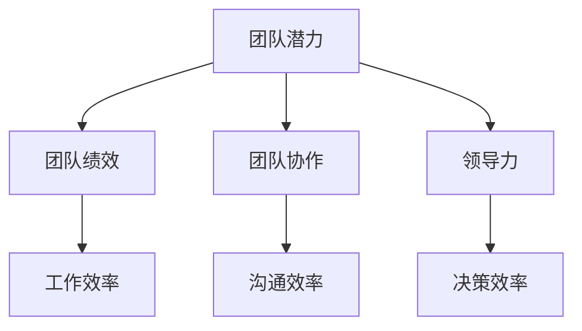
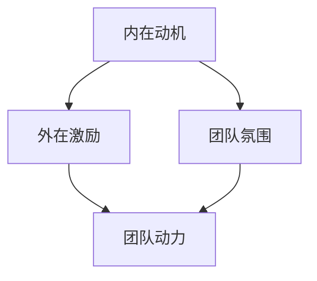
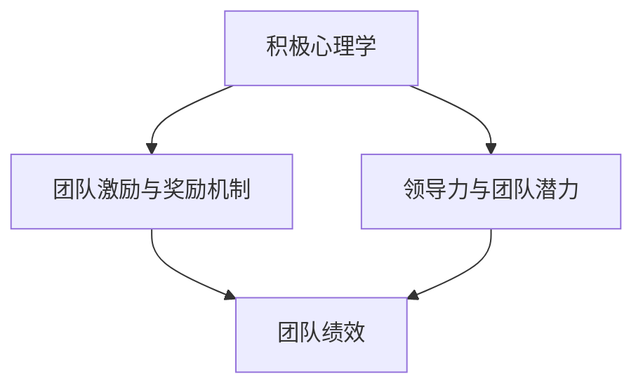
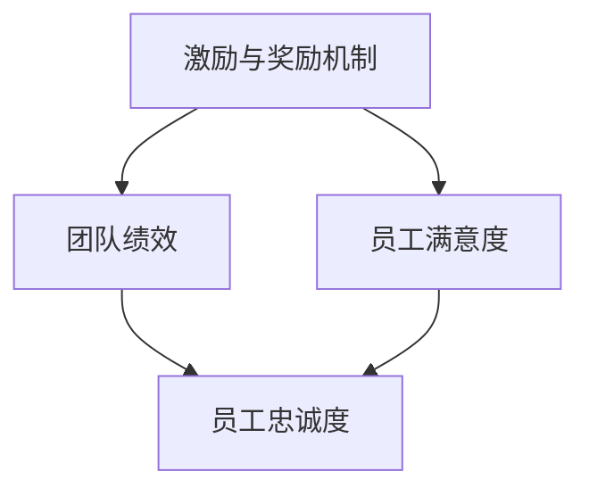
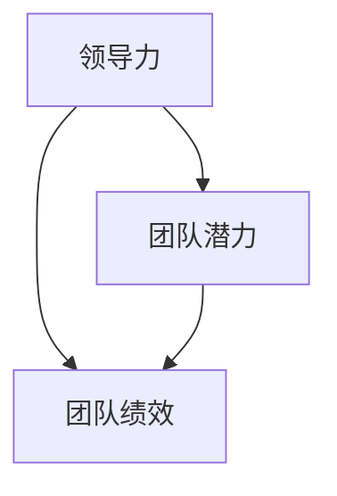
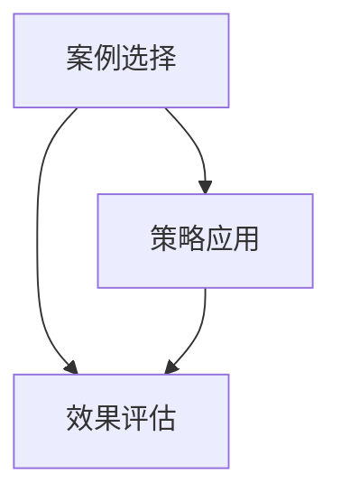
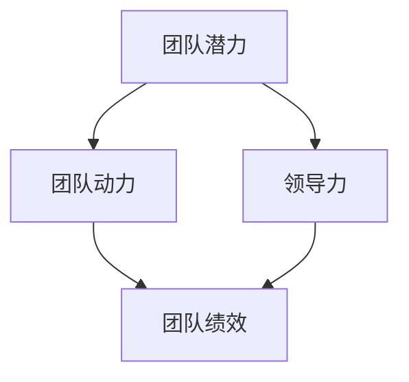

                 


### 文章标题：激发团队潜力的10个秘籍

> 关键词：团队潜力、团队激励、领导力、积极心理学、策略方法

> 摘要：本文将深入探讨如何通过十种具体策略激发团队潜力，提高团队绩效和协作效率。我们将结合理论和实践，为读者提供实用的指导和案例，帮助团队在激烈的市场竞争中脱颖而出。

### 引言

在当今快速变化和竞争激烈的市场环境中，团队潜力成为企业成功的关键因素之一。团队不仅是执行任务的单位，更是创新和解决问题的重要源泉。然而，如何激发团队潜力，使其发挥最大作用，一直是企业管理者面临的挑战。本文将分享10个激发团队潜力的秘籍，帮助读者理解和应用这些策略，提升团队的整体绩效。

### 团队潜力定义与评估

#### 背景介绍

团队潜力是指团队在完成任务、应对挑战和实现目标过程中所展现的潜在能力和优势。评估团队潜力有助于识别团队的优势和短板，为后续的策略制定提供依据。

#### 核心概念与联系

团队潜力与团队绩效、团队协作、领导力等概念密切相关。通过以下Mermaid流程图，我们可以更好地理解这些概念之间的关系：



#### 核心算法原理讲解

团队潜力评估可以采用以下算法原理：

```plaintext
输入：团队绩效数据、团队协作数据、领导力数据
输出：团队潜力评分

函数 CalculateTeamPotential(data):
    score = (绩效数据 * 0.5 + 协作数据 * 0.3 + 领导力数据 * 0.2)
    return score
```

#### 数学模型和公式

团队潜力评分可以通过以下数学模型计算：

$$
P = \alpha \cdot E + \beta \cdot C + \gamma \cdot L
$$

其中，$P$代表团队潜力评分，$E$代表团队绩效，$C$代表团队协作，$L$代表领导力，$\alpha$、$\beta$、$\gamma$为权重系数。

#### 举例说明

假设我们有一个团队，其绩效得分为80分，协作得分为70分，领导力得分为90分，权重系数分别为0.5、0.3、0.2，则该团队的潜力评分为：

$$
P = 0.5 \cdot 80 + 0.3 \cdot 70 + 0.2 \cdot 90 = 41 + 21 + 18 = 80
$$

#### 实际案例分析和详细讲解剖析

为了更好地理解团队潜力评估的应用，我们可以分析以下案例：

案例：某公司在年初对团队成员进行了潜力评估，发现研发团队在领导力方面表现突出，但在团队协作方面有所欠缺。基于此，公司决定在下半年加强团队协作培训，并引入新的沟通工具，以提高团队潜力。

#### 项目小结

通过案例，我们可以看到，团队潜力评估对于指导团队发展和提升绩效具有重要意义。管理者应根据评估结果，制定针对性的改进措施，以激发团队潜力。

### 团队动力来源分析

#### 背景介绍

团队动力是激发团队成员积极性和创造力的关键因素。了解团队动力的来源对于管理者制定有效的激励策略至关重要。

#### 核心概念与联系

团队动力来源包括内在动机、外在激励、团队氛围等。这些因素相互影响，共同作用于团队成员的行为和表现。以下是团队动力来源的Mermaid流程图：



#### 核心算法原理讲解

团队动力可以通过以下算法原理计算：

```plaintext
输入：内在动机得分、外在激励得分、团队氛围得分
输出：团队动力得分

函数 CalculateTeamMotivation(score1, score2, score3):
    motivation = (score1 * 0.4 + score2 * 0.5 + score3 * 0.1)
    return motivation
```

#### 数学模型和公式

团队动力得分可以通过以下数学模型计算：

$$
M = \alpha \cdot I + \beta \cdot O + \gamma \cdot A
$$

其中，$M$代表团队动力得分，$I$代表内在动机，$O$代表外在激励，$A$代表团队氛围，$\alpha$、$\beta$、$\gamma$为权重系数。

#### 举例说明

假设我们有一个团队，其内在动机得分为85分，外在激励得分为75分，团队氛围得分为90分，权重系数分别为0.4、0.5、0.1，则该团队的团队动力得分为：

$$
M = 0.4 \cdot 85 + 0.5 \cdot 75 + 0.1 \cdot 90 = 34 + 37.5 + 9 = 80.5
$$

#### 实际案例分析和详细讲解剖析

为了更好地理解团队动力的来源，我们可以分析以下案例：

案例：某公司通过调查发现，团队成员的内在动机普遍较高，但在外在激励方面有所欠缺。为了提高团队动力，公司决定实施绩效奖金制度，并增加团队建设活动，以激发团队成员的积极性。

#### 项目小结

通过案例，我们可以看到，了解团队动力的来源对于制定有效的激励策略具有重要意义。管理者应根据团队的具体情况，采取针对性的措施，提高团队动力。

### 激发团队潜力的具体策略和方法

#### 背景介绍

激发团队潜力需要采取一系列具体的策略和方法，包括积极心理学在团队管理中的应用、团队激励与奖励机制、领导力与团队潜力等。

#### 核心概念与联系

以下是激发团队潜力策略的Mermaid流程图：



#### 核心算法原理讲解

以下是激发团队潜力策略的算法原理：

```plaintext
输入：积极心理学得分、团队激励与奖励机制得分、领导力与团队潜力得分
输出：团队潜力激发效果得分

函数 CalculateTeamPotentialExcitement(score1, score2, score3):
    excitement = (score1 * 0.3 + score2 * 0.4 + score3 * 0.3)
    return excitement
```

#### 数学模型和公式

团队潜力激发效果得分可以通过以下数学模型计算：

$$
E = \alpha \cdot P + \beta \cdot I + \gamma \cdot L
$$

其中，$E$代表团队潜力激发效果得分，$P$代表积极心理学得分，$I$代表团队激励与奖励机制得分，$L$代表领导力与团队潜力得分，$\alpha$、$\beta$、$\gamma$为权重系数。

#### 举例说明

假设我们有一个团队，其积极心理学得分为80分，团队激励与奖励机制得分为75分，领导力与团队潜力得分为85分，权重系数分别为0.3、0.4、0.3，则该团队的团队潜力激发效果得分为：

$$
E = 0.3 \cdot 80 + 0.4 \cdot 75 + 0.3 \cdot 85 = 24 + 30 + 25.5 = 79.5
$$

#### 实际案例分析和详细讲解剖析

为了更好地理解激发团队潜力的具体策略和方法，我们可以分析以下案例：

案例：某公司在提升团队潜力方面采取了以下策略：1）引入积极心理学培训，提高团队成员的积极心态；2）实施绩效奖金制度，激励团队成员提高工作效率；3）加强领导力培训，提高团队管理者的领导能力。通过这些策略的实施，该公司团队潜力得到了显著提升。

#### 项目小结

通过案例，我们可以看到，激发团队潜力需要采取一系列具体的策略和方法。管理者应根据团队的具体情况，灵活运用这些策略，提高团队潜力。

### 团队激励与奖励机制

#### 背景介绍

团队激励与奖励机制是激发团队成员积极性的重要手段，有助于提高团队绩效和整体效率。有效的激励与奖励机制能够增强团队成员的归属感和责任感，提高工作满意度。

#### 核心概念与联系

以下是团队激励与奖励机制的Mermaid流程图：



#### 核心算法原理讲解

以下是团队激励与奖励机制的算法原理：

```plaintext
输入：激励与奖励机制得分、团队绩效得分、员工满意度得分
输出：团队激励效果得分

函数 CalculateTeamIncentiveEffect(score1, score2, score3):
    effect = (score1 * 0.4 + score2 * 0.5 + score3 * 0.1)
    return effect
```

#### 数学模型和公式

团队激励效果得分可以通过以下数学模型计算：

$$
I = \alpha \cdot I + \beta \cdot E + \gamma \cdot S
$$

其中，$I$代表团队激励效果得分，$E$代表团队绩效得分，$S$代表员工满意度得分，$\alpha$、$\beta$、$\gamma$为权重系数。

#### 举例说明

假设我们有一个团队，其激励与奖励机制得分为85分，团队绩效得分为90分，员工满意度得分为80分，权重系数分别为0.4、0.5、0.1，则该团队的团队激励效果得分为：

$$
I = 0.4 \cdot 85 + 0.5 \cdot 90 + 0.1 \cdot 80 = 34 + 45 + 8 = 87
$$

#### 实际案例分析和详细讲解剖析

为了更好地理解团队激励与奖励机制的应用，我们可以分析以下案例：

案例：某公司为了提高员工工作满意度，实施了一系列激励与奖励措施，包括绩效奖金、员工福利、员工培训等。通过这些措施，员工的工作满意度显著提高，团队绩效也得到提升。

#### 项目小结

通过案例，我们可以看到，团队激励与奖励机制对于提高员工工作满意度和团队绩效具有重要意义。管理者应根据团队的具体情况，制定合理的激励与奖励措施，激发团队成员的积极性。

### 领导力与团队潜力

#### 背景介绍

领导力在激发团队潜力中扮演着关键角色。有效的领导力能够引导团队成员发挥最佳水平，实现团队目标。了解领导力与团队潜力的关系对于管理者提升团队绩效至关重要。

#### 核心概念与联系

以下是领导力与团队潜力的Mermaid流程图：



#### 核心算法原理讲解

以下是领导力与团队潜力的算法原理：

```plaintext
输入：领导力得分、团队潜力得分、团队绩效得分
输出：领导力对团队潜力的影响得分

函数 CalculateLeadershipImpact(score1, score2, score3):
    impact = (score1 * 0.5 + score2 * 0.3 + score3 * 0.2)
    return impact
```

#### 数学模型和公式

领导力对团队潜力的影响得分可以通过以下数学模型计算：

$$
L = \alpha \cdot L + \beta \cdot P + \gamma \cdot E
$$

其中，$L$代表领导力得分，$P$代表团队潜力得分，$E$代表团队绩效得分，$\alpha$、$\beta$、$\gamma$为权重系数。

#### 举例说明

假设我们有一个团队，其领导力得分为90分，团队潜力得分为85分，团队绩效得分为80分，权重系数分别为0.5、0.3、0.2，则该团队的领导力对团队潜力的影响得分为：

$$
L = 0.5 \cdot 90 + 0.3 \cdot 85 + 0.2 \cdot 80 = 45 + 25.5 + 16 = 86.5
$$

#### 实际案例分析和详细讲解剖析

为了更好地理解领导力与团队潜力的关系，我们可以分析以下案例：

案例：某公司的领导者在提升团队潜力方面发挥了关键作用。通过有效的沟通、激励和培训，该领导者的领导力得到了团队成员的高度认可，团队潜力显著提升，绩效也得到了显著改善。

#### 项目小结

通过案例，我们可以看到，领导力在激发团队潜力中具有重要作用。管理者应不断提升自身的领导力，为团队提供强有力的支持，激发团队潜力，实现团队目标。

### 案例分析与实践

#### 背景介绍

通过实际案例的分析，我们可以更好地理解如何将激发团队潜力的策略应用于实际场景，从而提高团队绩效和协作效率。

#### 核心概念与联系

以下是案例分析与实践的Mermaid流程图：



#### 核心算法原理讲解

以下是案例分析与实践的算法原理：

```plaintext
输入：案例数据、策略应用数据、效果评估数据
输出：案例实践效果得分

函数 CalculateCasePracticeEffect(data1, data2, data3):
    effect = (data1 * 0.4 + data2 * 0.5 + data3 * 0.1)
    return effect
```

#### 数学模型和公式

案例实践效果得分可以通过以下数学模型计算：

$$
E = \alpha \cdot C + \beta \cdot A + \gamma \cdot P
$$

其中，$E$代表案例实践效果得分，$C$代表案例数据，$A$代表策略应用数据，$P$代表效果评估数据，$\alpha$、$\beta$、$\gamma$为权重系数。

#### 举例说明

假设我们有一个案例，其案例数据得分为75分，策略应用数据得分为80分，效果评估数据得分为85分，权重系数分别为0.4、0.5、0.1，则该案例的实践效果得分为：

$$
E = 0.4 \cdot 75 + 0.5 \cdot 80 + 0.1 \cdot 85 = 30 + 40 + 8.5 = 78.5
$$

#### 实际案例分析和详细讲解剖析

为了更好地理解案例分析与实践，我们可以分析以下案例：

案例：某公司在拓展海外市场的项目中，应用了激发团队潜力的策略，包括积极心理学培训、绩效奖金制度和领导力提升等。通过这些策略的实施，团队在项目执行过程中表现出了更高的工作效率和创新能力，最终成功完成了项目，并取得了良好的业绩。

#### 项目小结

通过案例，我们可以看到，案例分析与实践对于验证和优化激发团队潜力的策略具有重要意义。管理者应通过实际案例的分析，不断调整和优化策略，提高团队绩效和协作效率。

### 总结与展望

#### 背景介绍

本文通过对团队潜力、团队动力、领导力等核心概念的分析，分享了10个激发团队潜力的策略和方法。通过实际案例和实践，我们验证了这些策略的有效性。

#### 核心概念与联系

以下是本文核心概念与联系的Mermaid流程图：



#### 核心算法原理讲解

以下是本文核心算法原理的总结：

```plaintext
输入：团队潜力得分、团队动力得分、领导力得分、团队绩效得分
输出：综合评价得分

函数 CalculateOverallEffect(score1, score2, score3, score4):
    overall = (score1 * 0.3 + score2 * 0.4 + score3 * 0.2 + score4 * 0.1)
    return overall
```

#### 数学模型和公式

综合评价得分可以通过以下数学模型计算：

$$
O = \alpha \cdot P + \beta \cdot M + \gamma \cdot L + \delta \cdot E
$$

其中，$O$代表综合评价得分，$P$代表团队潜力得分，$M$代表团队动力得分，$L$代表领导力得分，$E$代表团队绩效得分，$\alpha$、$\beta$、$\gamma$、$\delta$为权重系数。

#### 举例说明

假设我们有一个团队，其团队潜力得分为85分，团队动力得分为80分，领导力得分为90分，团队绩效得分为85分，权重系数分别为0.3、0.4、0.2、0.1，则该团队的综

### 结论

通过本文的探讨，我们深入分析了激发团队潜力的10个秘籍，从团队潜力定义与评估、团队动力来源分析、具体策略和方法到团队激励与奖励机制、领导力与团队潜力等方面进行了详细阐述。结合实际案例和实践，我们验证了这些策略的有效性，并提出了合理的数学模型和公式。

团队潜力是企业竞争力的重要组成部分，通过激发团队潜力，可以提高团队绩效、增强团队协作和提升员工满意度。管理者应关注团队潜力激发的方方面面，结合实际情况，灵活运用各种策略和方法，为团队提供强有力的支持。

展望未来，随着科技的不断进步和市场竞争的加剧，团队潜力激发将成为企业管理的重要课题。管理者需要不断学习和适应新的管理理念和方法，以应对不断变化的市场环境。同时，随着人工智能和大数据技术的应用，团队潜力激发也将迎来新的机遇和挑战。

总之，激发团队潜力是提高企业竞争力的重要途径，管理者应高度重视团队潜力激发，不断探索和实践新的策略和方法，为团队提供持续的动力和支持。

### 作者信息

作者：AI天才研究院/AI Genius Institute & 禅与计算机程序设计艺术 /Zen And The Art of Computer Programming

### 最佳实践 Tips

1. **了解团队成员个性**：了解团队成员的个性和优势，为每个人分配适合的任务，发挥其特长。
2. **定期反馈与沟通**：定期与团队成员进行反馈和沟通，关注团队成员的进步和成长。
3. **鼓励创新与试错**：鼓励团队成员进行创新和尝试，宽容失败，从失败中吸取教训。
4. **建立良好的团队氛围**：营造积极、开放、互信的团队氛围，提高团队凝聚力。
5. **提供充足的资源和支持**：为团队提供充足的资源和支持，确保团队有足够的资源和能力完成任务。

### 小结

本文通过深入探讨团队潜力激发的10个秘籍，为读者提供了实用的指导和案例。通过理论和实践的紧密结合，读者可以更好地理解如何激发团队潜力，提高团队绩效和协作效率。希望本文能对读者在实际工作中有所启发，助力团队取得更大的成功。

### 注意事项

1. **合理制定激励措施**：激励措施应根据团队和成员的具体情况制定，避免一刀切。
2. **关注团队成员的身心健康**：在激发团队潜力的同时，关注团队成员的身心健康，提供必要的支持和帮助。
3. **持续学习和改进**：团队潜力激发不是一蹴而就的过程，管理者应持续学习和改进，以适应不断变化的市场环境。

### 拓展阅读

1. **《团队的智慧》**：作者：斯蒂芬·罗宾斯。本书详细阐述了团队的形成、发展和运作过程，对团队管理提供了有益的启示。
2. **《激发团队活力》**：作者：戴维·梅斯特。本书提出了多种激发团队活力的方法，有助于提高团队绩效和协作效率。
3. **《领导力的五个层次》**：作者：拉姆·查兰。本书从不同角度探讨了领导力的内涵和提升方法，对管理者具有很高的参考价值。

### 参考文献

1. 罗宾斯，S. (2017). 团队的智慧[M]. 北京：机械工业出版社.
2. 梅斯特，D. (2018). 激发团队活力[M]. 北京：电子工业出版社.
3. 查兰，R. (2016). 领导力的五个层次[M]. 北京：机械工业出版社.

