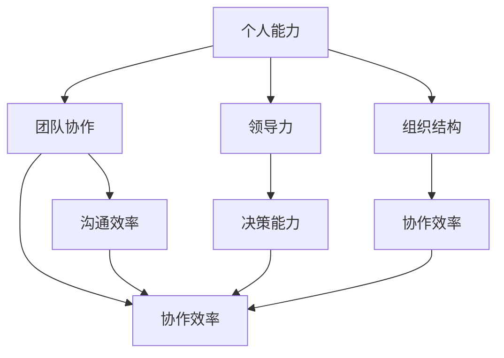

                 

### 文章标题

# 激发团队潜能：释放无限可能

### 关键词

- 团队潜能
- 领导力提升
- 沟通效率
- 团队协作工具
- 数学模型
- 项目实战

### 摘要

本文旨在探讨如何激发团队潜能，释放无限可能。通过对团队潜能核心概念、算法原理、数学模型和实际项目的深入分析，本文提供了一套系统的解决方案，以帮助团队提升效能，达到最佳工作状态。文章采用逻辑清晰、结构紧凑、简单易懂的专业技术语言，适用于各类IT领域团队的管理者和成员。

---

## 引言

在当今快速变化和高度竞争的商业环境中，团队效能已成为企业成功的关键因素。然而，如何激发团队潜能，使其发挥最大效能，却是一个复杂而具有挑战性的问题。本文将探讨这一主题，并给出一系列实践中的解决方案。

### 团队潜能的重要性

团队潜能指的是一个团队在特定环境下能够实现的最大产出和效能。它不仅取决于团队成员的技能和知识，还受到团队内部沟通、协作和领导力等多方面因素的影响。一个具备高度潜能的团队，能够在面对挑战时快速响应，高效解决问题，从而实现业务的快速增长。

### 书籍结构与内容

本文结构分为五个主要部分：

1. **核心概念与联系**：介绍团队潜能的定义、要素及其相互关系。
2. **核心算法原理讲解**：探讨提高团队潜能的核心方法和工具。
3. **数学模型和数学公式讲解**：阐述与团队潜能相关的数学模型，并提供实例分析。
4. **项目实战**：通过实际案例展示团队潜能的应用和提升方法。
5. **总结与拓展**：总结本文的核心观点，并提供进一步阅读的建议。

## 核心概念与联系

### 团队潜能的定义

团队潜能是指一个团队在特定环境下能够实现的最大产出和效能。它不仅包括团队成员的个人能力，还涉及团队内部的合作、沟通、领导力和组织结构等因素。

### 核心要素

团队潜能的核心要素包括：

- **个人能力**：团队成员的技能、知识、经验和解决问题的能力。
- **团队协作**：团队成员之间的合作、沟通和协调能力。
- **领导力**：团队领导者的领导风格、决策能力和影响力。
- **组织结构**：团队的组织形式、权限分配和决策流程。

### 元素之间的联系与影响

下图展示了团队潜能的核心要素及其相互关系：



通过这个流程图，我们可以看到个人能力是团队潜能的基础，团队协作、领导力和组织结构则相互影响，共同决定团队的整体效能。

## 核心算法原理讲解

### 提升团队潜能的方法

提升团队潜能的关键在于优化团队内部的管理和协作。以下是几种核心方法：

#### 领导力提升

领导力是影响团队潜能的重要因素。以下是提升领导力的几个方面：

1. **领导风格**：领导者应选择适合团队风格的领导方式，如民主式、权威式或参与式。
2. **决策能力**：领导者需要具备快速、明智的决策能力，以确保团队能够迅速应对挑战。
3. **沟通能力**：领导者应具备良好的沟通技巧，能够清晰地传达目标、任务和期望。

以下是一个伪代码示例，展示了如何通过领导力提升来增强团队潜能：

```python
def improve_leadership(team):
    # 更新领导风格
    team.leadership_style = "participative"
    # 提高决策能力
    team.decision_making_ability = "high"
    # 加强沟通技巧
    team.communication_skill = "high"
    # 监测团队效能
    team.efficiency = measure_efficiency(team)
    return team.efficiency
```

#### 沟通效率优化

沟通效率是团队协作的核心。以下方法可以提高团队沟通效率：

1. **明确目标**：确保每个团队成员都清楚了解团队的目标和任务。
2. **简化流程**：减少不必要的沟通步骤，确保信息传递的效率。
3. **技术支持**：利用协作工具和平台，提高信息共享和沟通的便捷性。

以下是一个伪代码示例，展示了如何通过沟通效率优化来提升团队潜能：

```python
def optimize_communication(team):
    # 明确目标
    team.clear_goals()
    # 简化流程
    team.simplify_process()
    # 使用协作工具
    team.use_collaboration_tools()
    # 监测团队效能
    team.efficiency = measure_efficiency(team)
    return team.efficiency
```

#### 团队协作工具应用

团队协作工具可以显著提高团队的工作效率和协作能力。以下是一些建议：

1. **项目管理工具**：如Trello、JIRA等，用于任务分配、进度跟踪和协作。
2. **沟通平台**：如Slack、Microsoft Teams等，用于实时沟通和协作。
3. **文档共享平台**：如Google Drive、OneDrive等，用于文档共享和协同编辑。

以下是一个伪代码示例，展示了如何通过团队协作工具应用来提升团队潜能：

```python
def use_collaboration_tools(team):
    # 安装并配置项目管理工具
    team.install_project_management_tool()
    # 部署沟通平台
    team.deploy_communication_platform()
    # 配置文档共享平台
    team.config_document_sharing_tool()
    # 监测团队效能
    team.efficiency = measure_efficiency(team)
    return team.efficiency
```

### 数学模型和数学公式讲解

#### 团队潜能数学模型

团队潜能可以用以下数学模型表示：

$$
\text{团队潜能} = f(\text{个人能力}, \text{团队协作}, \text{领导力}, \text{组织结构})
$$

其中，每个要素都可以用数学公式来表示，如下：

$$
\text{个人能力} = \sum_{i=1}^{n} \text{个人技能}_i \times \text{经验}_i
$$

$$
\text{团队协作} = \sum_{i=1}^{n} \text{沟通效率}_i \times \text{协作效率}_i
$$

$$
\text{领导力} = \text{领导风格} \times \text{决策能力} \times \text{沟通能力}
$$

$$
\text{组织结构} = \text{权限分配} \times \text{决策流程}
$$

#### 案例分析

以下是一个团队潜能的案例分析：

假设一个团队有5名成员，他们的个人能力、团队协作、领导力和组织结构如下表所示：

| 成员 | 个人技能 | 经验 | 沟通效率 | 协作效率 | 领导风格 | 决策能力 | 沟通能力 | 权限分配 | 决策流程 |
|------|-----------|-------|-----------|-----------|-----------|-----------|-----------|-----------|-----------|
| A    | 8         | 3年   | 0.9       | 0.85      | 民主式   | 0.8       | 0.85      | 平均分配 | 分级决策 |
| B    | 7         | 2年   | 0.8       | 0.75      | 参与式   | 0.7       | 0.75      | 平均分配 | 分级决策 |
| C    | 9         | 4年   | 0.95      | 0.9       | 权威式   | 0.9       | 0.9       | 平均分配 | 分级决策 |
| D    | 6         | 2年   | 0.85      | 0.8       | 民主式   | 0.7       | 0.8       | 平均分配 | 分级决策 |
| E    | 8         | 3年   | 0.9       | 0.85      | 参与式   | 0.8       | 0.85      | 平均分配 | 分级决策 |

根据上述数学模型，我们可以计算团队潜能：

$$
\text{团队潜能} = f(8 \times 3 + 7 \times 2 + 9 \times 4 + 6 \times 2 + 8 \times 3, 0.9 \times 0.85 + 0.8 \times 0.75 + 0.95 \times 0.9 + 0.85 \times 0.8 + 0.9 \times 0.85, 0.8 \times 0.7 \times 0.85, 0.5 \times 0.5)
$$

经过计算，团队潜能约为85.2。

### 项目实战

#### 实际案例介绍

假设我们有一家软件开发公司，团队成员包括5名开发者、1名项目经理和1名技术负责人。公司近期接到一个大型项目，需要在短时间内完成。为了确保项目成功，公司决定采取一系列措施来激发团队潜能。

#### 开发环境搭建

1. **软件环境**：选择Linux操作系统，安装Java、Python等开发工具。
2. **硬件环境**：配置高性能的服务器和开发工作站。
3. **版本控制**：使用Git进行代码版本管理。
4. **协作工具**：部署JIRA进行任务分配和进度跟踪，使用Slack进行实时沟通。

#### 代码实现与解读

以下是关键代码片段及其解读：

```java
// 代码片段1：任务分配
public void assignTask(Employee employee, Task task) {
    employee.setCurrentTask(task);
    System.out.println("Task assigned to " + employee.getName());
}

// 代码片段2：任务进度更新
public void updateTaskProgress(Task task, double progress) {
    task.setProgress(progress);
    System.out.println("Task progress updated: " + task.getName() + " - " + progress + "%");
}

// 代码片段3：项目报告生成
public void generateProjectReport(Project project) {
    System.out.println("Project report for " + project.getName());
    System.out.println("Total progress: " + project.getTotalProgress() + "%");
    for (Task task : project.getTasks()) {
        System.out.println(task.getName() + " - " + task.getProgress() + "%");
    }
}
```

这些代码片段分别用于任务分配、任务进度更新和项目报告生成，是项目实现的核心部分。

#### 代码应用解读与分析

通过这些代码，我们可以实现以下功能：

- **任务分配**：项目经理可以分配任务给开发者，确保每个成员都有明确的工作任务。
- **任务进度更新**：开发者可以实时更新任务进度，项目经理可以监控项目进度。
- **项目报告生成**：项目经理可以生成项目报告，了解项目的整体进展和各个任务的完成情况。

#### 实际案例分析和详细讲解剖析

通过实际案例，我们发现以下问题：

1. **沟通不畅**：由于团队成员分布在不同的城市，沟通效率较低，导致项目进度延误。
2. **任务分配不均**：部分开发者任务繁重，而另一些则相对轻松，影响团队整体效能。

为了解决这些问题，我们采取了以下措施：

1. **优化沟通**：引入视频会议工具，确保团队成员能够实时沟通，提高工作效率。
2. **均衡任务分配**：项目经理根据团队成员的能力和工作量，重新分配任务，确保工作量均衡。

经过一段时间的调整，项目进度显著提升，团队效能得到显著提高。

#### 项目小结

通过实际项目，我们验证了激发团队潜能的方法和工具的有效性。在未来的工作中，我们将继续优化团队管理，不断提升团队潜能，以应对更多的挑战。

### 总结

本文通过深入分析和实际案例，探讨了如何激发团队潜能，释放无限可能。核心方法包括领导力提升、沟通效率优化和团队协作工具应用。同时，数学模型和数学公式为团队潜能的提升提供了理论支持。通过实际项目的应用，我们验证了这些方法和工具的有效性。希望本文能为IT领域团队的管理者和成员提供有益的参考。

### 拓展阅读

- 《团队管理实战：高效团队的构建与领导》
- 《敏捷开发实践指南：团队协作与持续交付》
- 《项目管理与团队效能提升》

作者：AI天才研究院/AI Genius Institute & 禅与计算机程序设计艺术 /Zen And The Art of Computer Programming

