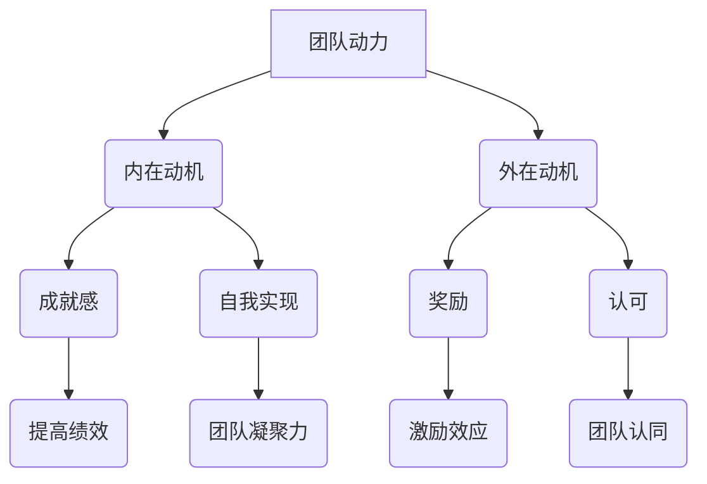

                 


### 《激发团队热情：持久动力的来源》

---

# 关键词

团队动力、持久动力、激励理论、领导力、实践应用、案例分析

---

## 摘要

本文旨在深入探讨如何激发团队热情，并找出持久动力的来源。通过理解团队动力的概念、分析激励理论，并结合实际案例分析，本文将揭示如何构建高效的团队动力系统，保持团队的热情，并实现长期发展的团队动力管理。文章涵盖了团队动力的影响因素、团队动力系统模型、团队目标的设定、团队协作能力的提升、团队文化的建设、领导力与团队动力之间的关系，以及团队动力管理的挑战与策略。通过本文的阅读，读者将获得全面的认识，并掌握激发团队热情、实现团队持久动力的实用方法。

---

## 第一部分：理解团队动力

### 第1章：团队动力的概念

#### 1.1 团队动力的定义和重要性

团队动力是指团队成员为了实现共同目标而展现出的积极态度和行动力。它不仅包括团队成员的内在动机，如自我实现和成就感，还涵盖了外在动机，如奖励和认可。团队动力的定义强调了团队内部成员之间的互动和协作，是推动团队高效运作的核心力量。

团队动力的重要性体现在多个方面。首先，高水平的团队动力有助于提高团队的整体绩效，实现团队目标的达成。其次，团队动力能够增强团队成员的归属感和满意度，提升团队凝聚力。此外，团队动力还能够激发创新思维，促进团队在面对挑战时保持坚韧和适应能力。

#### 1.2 团队动力的影响因素

团队动力受到多种因素的影响，包括内在动机和外在动机。内在动机是指团队成员对于工作本身的兴趣和热情，如追求成就、自我提升和自我实现。外在动机则包括奖励、认可、压力和竞争等外部因素。

此外，目标设定与反馈机制也是影响团队动力的关键因素。明确且具有挑战性的目标能够激发团队成员的积极性和动力，而及时的反馈和奖励机制则有助于保持团队成员的动力和信心。

最后，团队文化与信任建设也是团队动力的重要来源。一个积极、包容、信任的团队文化能够增强团队成员的归属感和团队凝聚力，从而提高整体动力水平。

### 第2章：激励理论

#### 2.1 弗鲁姆的期望理论

弗鲁姆的期望理论认为，个体的动机是由其对行为结果的期望和这些结果的价值共同决定的。期望理论的基本原理可以概括为：动机 = 期望 × 动力。

在团队动力管理中，应用期望理论的关键在于设定明确的目标和提供足够的反馈。通过设定具有挑战性但可实现的目标，并确保团队成员了解目标的达成情况，可以有效激发团队动力。

#### 2.2 马斯洛的需求层次理论

马斯洛的需求层次理论将人类需求分为五个层次：生理需求、安全需求、社交需求、尊重需求和自我实现需求。每个需求层次都对应不同的动机和动力。

在团队动力管理中，了解团队成员的不同需求层次，有针对性地满足他们的需求，是激发团队动力的重要手段。例如，对于处于生理需求层次的成员，可以通过提供良好的工作环境和薪酬待遇来满足他们的需求；而对于处于自我实现需求层次的成员，可以通过提供机会让他们参与有意义的项目，实现自我价值和成长。

#### 2.3 奖励理论

奖励理论认为，通过给予个体奖励，可以增加其完成特定任务的动力。奖励可以包括物质奖励（如奖金、福利）和精神奖励（如认可、表彰）。

然而，奖励的有效性取决于奖励的类型和分配方式。适当的奖励能够激发团队成员的积极性和动力，但过度依赖奖励可能会导致依赖性和动力不足。因此，在应用奖励理论时，需要结合团队成员的需求和行为表现，进行合理的奖励设计和分配。

---

**作者：AI天才研究院/AI Genius Institute & 禅与计算机程序设计艺术 /Zen And The Art of Computer Programming**

---

## 第二部分：实践中的团队动力

### 第3章：构建高效的团队动力系统

#### 3.1 团队动力系统模型

一个高效的团队动力系统包括四个关键组成部分：目标设定、激励机制、反馈机制和团队文化。

**目标设定**：明确的目标是团队动力的基石。通过设定具有挑战性和可行性的目标，可以激发团队成员的积极性和动力。

**激励机制**：激励机制包括奖励和认可，是保持团队动力的重要手段。合理的激励机制能够激发团队成员的潜力，提高工作效率。

**反馈机制**：及时的反馈和评价是团队动力系统的重要组成部分。通过反馈，团队成员可以了解自己的工作表现，并据此调整自己的行为。

**团队文化**：团队文化是团队动力的源泉。一个积极、包容、信任的团队文化能够增强团队成员的归属感和团队凝聚力，从而提高整体动力水平。

#### 3.2 团队动力系统的优化

**识别并解决团队动力问题**：首先，需要识别团队动力不足的原因，如目标设定不当、激励机制不合理、反馈不及时等。然后，针对问题进行具体的解决，如调整目标、改进激励机制、优化反馈机制等。

**持续优化策略**：团队动力系统的优化不是一次性的任务，而是一个持续的过程。通过定期评估和调整，确保团队动力系统的持续高效运作。

### 第4章：团队动力的实践应用

#### 4.1 激励团队目标设定

**设定具有挑战性和可行性的目标**：目标是团队动力的源泉。在设定目标时，需要确保目标具有挑战性，以激发团队成员的积极性和动力。同时，目标也应该是可行的，以确保团队成员有信心达成目标。

**实施与监督**：在目标设定后，需要制定详细的实施计划，并确保团队成员了解和明确自己的职责。同时，建立有效的监督机制，确保目标的实施和达成。

#### 4.2 提升团队协作能力

**提高团队协作效率**：团队协作效率是团队动力的关键指标。通过优化工作流程、明确职责分工、提高沟通效率等手段，可以提高团队协作效率。

**沟通与冲突管理**：沟通是团队协作的核心。建立有效的沟通机制，确保信息的高效传递和共享。同时，学会处理和解决冲突，避免冲突对团队动力和协作的负面影响。

#### 4.3 建立积极的团队文化

**塑造积极的团队文化**：团队文化是团队动力的源泉。通过塑造积极的团队文化，如鼓励创新、倡导合作、强调团队精神等，可以增强团队成员的归属感和团队凝聚力。

**持续维护与发展**：团队文化的建立和维护是一个持续的过程。通过定期培训和活动，持续强化和优化团队文化，确保其持续发挥作用。

---

**作者：AI天才研究院/AI Genius Institute & 禅与计算机程序设计艺术 /Zen And The Art of Computer Programming**

---

## 第三部分：持久动力的管理策略

### 第5章：领导力与团队动力

#### 5.1 领导力与团队动力的关系

领导力在激发团队动力中起着关键作用。优秀的领导力能够激发团队成员的潜力，提高团队的整体绩效。领导力不仅影响团队动力的产生，还影响其持续性和发展。

**领导力在激发团队动力中的作用**：领导力通过设定目标、提供资源、建立信任和激励团队成员，激发团队动力。领导者的行为和决策直接影响团队成员的动机和动力水平。

**领导力如何影响团队动力的持续发展**：领导力不仅在于激发团队动力，更在于保持和提升团队动力。通过持续的领导力发展，领导者能够不断调整和优化团队动力系统，确保团队动力的持续性和发展。

#### 5.2 领导风格的转变

从管理到领导的转变是领导力发展的重要一步。管理侧重于任务和过程，而领导则更关注人。领导风格需要从控制型转向赋能型，从指挥型转向激励型，从关注结果转向关注过程和团队成长。

**不同领导风格对团队动力的影响**：不同的领导风格对团队动力有着不同的影响。权威型领导可能短期内提升团队动力，但长期来看可能导致依赖性和创造力下降；而赋能型领导则能够激发团队成员的自主性和创新力，提升团队的整体动力水平。

---

**作者：AI天才研究院/AI Genius Institute & 禅与计算机程序设计艺术 /Zen And The Art of Computer Programming**

---

## 第四部分：案例分析

### 第6章：激发初创团队的持续动力

#### 6.1 案例一：如何激发初创团队的持续动力

初创团队往往面临资源有限、市场竞争激烈等挑战。要激发初创团队的持续动力，需要采取以下策略：

**明确共同目标**：初创团队的成员需要明确共同的目标和愿景，以增强团队凝聚力和动力。

**提供发展机会**：初创团队应提供个人发展机会，如培训、项目参与等，以激发团队成员的自我提升动力。

**建立信任和沟通**：初创团队需要建立信任和沟通机制，确保团队成员之间的信息畅通和协作顺畅。

**灵活应对挑战**：初创团队应具备灵活应对挑战的能力，及时调整战略和计划，以保持团队的活力和动力。

#### 6.2 案例二：大型企业如何保持团队活力

大型企业往往面临组织结构复杂、员工老龄化等挑战。要维持团队活力，企业可以采取以下策略：

**创新文化**：大型企业应积极营造创新文化，鼓励员工提出新想法和改进方案，以激发团队的创造力。

**灵活的工作安排**：大型企业可以提供灵活的工作安排，如远程办公、弹性工作时间等，以适应员工的需求和提高工作满意度。

**员工关怀**：大型企业应关注员工的生活和心理健康，提供必要的关怀和支持，以提升员工的工作动力和忠诚度。

**有效的激励机制**：大型企业应建立有效的激励机制，通过奖励和认可，激励员工保持高水平的动力和绩效。

---

**作者：AI天才研究院/AI Genius Institute & 禅与计算机程序设计艺术 /Zen And The Art of Computer Programming**

---

## 第五部分：持久动力的管理策略

### 第7章：团队动力管理的挑战与应对策略

#### 7.1 团队动力管理的挑战

团队动力管理面临多种挑战，包括：

**团队动力不足的原因**：团队动力不足可能源于目标设定不当、激励机制不完善、沟通不畅、团队文化不健康等。

**团队动力波动的影响**：团队动力的波动可能影响团队的整体绩效和稳定性。高波动性可能导致团队成员的情绪波动、绩效下降，甚至团队解散。

#### 7.2 团队动力管理的策略

**团队动力管理的原则**：

- **以人为本**：将团队成员的需求和成长放在首位，确保团队动力与个人目标相结合。
- **持续优化**：不断评估和改进团队动力管理系统，以适应环境和团队变化。
- **平衡激励**：合理分配奖励和认可，避免过度依赖单一激励手段。

**团队动力管理的具体策略**：

- **明确目标**：设定清晰、具体、可实现的团队目标，确保团队成员明确自己的职责和期望。
- **优化沟通**：建立高效的沟通机制，确保团队成员之间的信息传递畅通和协作顺畅。
- **建设团队文化**：塑造积极、包容、信任的团队文化，增强团队成员的归属感和凝聚力。
- **持续激励**：通过多种激励手段，如奖励、认可、培训等，持续激发团队成员的动力和积极性。

---

**作者：AI天才研究院/AI Genius Institute & 禅与计算机程序设计艺术 /Zen And The Art of Computer Programming**

---

## 第六部分：持续激发团队热情

### 第8章：持续激发团队热情

#### 8.1 持久动力的定义与特征

持久动力是指团队在长时间内保持高水平的动力和积极性。它具有以下特征：

- **持续性**：持久动力能够长时间保持，不受短期波动的影响。
- **稳定性**：持久动力具有稳定性，能够在不同的环境和条件下保持稳定的表现。
- **适应性**：持久动力能够适应环境变化，灵活调整策略和行动。

#### 8.2 如何保持团队的热情

**持续激励的策略**：

- **目标激励**：通过设定具有挑战性和可行性的目标，激发团队成员的积极性和动力。
- **奖励激励**：合理分配奖励和认可，确保团队成员感受到自己的价值和贡献。
- **成长激励**：提供个人发展机会，如培训、项目参与等，激发团队成员的自我提升动力。

**团队成员关系的维护与发展**：

- **信任建设**：建立信任和尊重的关系，增强团队成员之间的沟通和协作。
- **情感关怀**：关注团队成员的情感需求，提供必要的关怀和支持。
- **合作机会**：创造合作机会，鼓励团队成员之间的互动和互助。

---

**作者：AI天才研究院/AI Genius Institute & 禅与计算机程序设计艺术 /Zen And The Art of Computer Programming**

---

## 第七部分：长期发展的团队动力管理

### 第9章：长期发展的团队动力管理

#### 9.1 团队动力管理的长期视角

团队动力管理不仅仅关注短期的绩效提升，更注重团队的长远发展和成长。长期视角的团队动力管理策略包括：

**长期发展的团队动力管理策略**：

- **持续学习与成长**：鼓励团队成员不断学习新知识、新技能，提升个人能力和团队整体竞争力。
- **持续创新与改进**：鼓励团队成员提出创新想法和改进方案，推动团队的持续发展和进步。
- **长期目标规划**：设定明确的长期目标，确保团队在长期内保持动力和方向。

**如何应对团队动力管理的长期挑战**：

- **适应环境变化**：团队动力管理需要适应外部环境的变化，如市场、技术、政策等。
- **平衡短期与长期利益**：在追求短期绩效的同时，也要关注长期发展，确保团队的可持续性。
- **保持领导力**：领导者需要具备长远的眼光和战略思维，引领团队走向长期成功。

#### 9.2 团队动力与组织绩效

**团队动力对组织绩效的影响**：

- **提高工作效率**：高水平的团队动力能够提高团队的工作效率和产出。
- **增强创新能力**：团队动力能够激发团队成员的创新思维和创造力，推动组织的持续发展。
- **提升员工满意度**：高水平的团队动力能够提升员工的满意度和忠诚度，降低员工流失率。

**如何评估团队动力管理的成效**：

- **绩效评估**：通过团队绩效评估，了解团队动力管理的效果。
- **员工满意度调查**：通过员工满意度调查，了解团队成员对团队动力管理的感知和反馈。
- **团队氛围观察**：通过观察团队的氛围和行为，评估团队动力管理的效果。

---

**作者：AI天才研究院/AI Genius Institute & 禅与计算机程序设计艺术 /Zen And The Art of Computer Programming**

---

## 附录

### 附录A：团队动力管理工具与方法

#### A.1 常用团队动力管理工具

- **目标管理工具**：如SMART目标设定方法，帮助团队明确具体、可衡量、可实现、相关性强、时间明确的目标。
- **绩效评估工具**：如KPI（关键绩效指标）和OKR（目标与关键结果），帮助团队评估和监控绩效。
- **团队沟通工具**：如团队协作平台、即时通讯工具等，提高团队沟通效率和协作能力。
- **团队反馈工具**：如360度评估、员工满意度调查等，收集团队成员的反馈和意见。

#### A.2 团队动力管理方法的实际应用

- **目标管理方法**：通过设定明确的目标和实施计划，确保团队目标的实现。
- **激励机制**：通过奖励、认可和晋升等手段，激发团队成员的积极性和动力。
- **团队反馈机制**：通过定期的反馈和评估，及时调整团队策略和行动，提高团队绩效。

---

**作者：AI天才研究院/AI Genius Institute & 禅与计算机程序设计艺术 /Zen And The Art of Computer Programming**

---

## 总结

本文系统地探讨了团队动力的概念、激励理论、实践应用和持久动力的管理策略。通过理解团队动力的本质，应用激励理论，结合实际案例分析和长期策略，我们可以有效地激发团队热情，保持持久动力。团队动力管理不仅影响团队绩效，更关乎团队的长远发展和成员的成长。因此，领导者应注重团队动力管理，以实现团队的持续成长和成功。

---

**作者：AI天才研究院/AI Genius Institute & 禅与计算机程序设计艺术 /Zen And The Art of Computer Programming** 

## 论文核心概念、原理及架构关系

在本文中，我们详细探讨了团队动力、激励理论、领导力、团队协作和文化建设等多个核心概念。以下是对这些概念之间的关系架构和核心原理的深入讲解。

### 团队动力

团队动力是指团队成员为实现共同目标而展现出的积极态度和行动力。它不仅包括内在动机（如成就感、自我实现），也涵盖外在动机（如奖励、认可）。团队动力的核心在于激发团队成员的潜力，提高团队的整体绩效。

**Mermaid 流程图：**



### 激励理论

激励理论是探讨如何通过外部和内部因素激发个体和团队的动机和行动。常见的激励理论包括弗鲁姆的期望理论、马斯洛的需求层次理论和奖励理论。

**核心原理讲解：**

- **期望理论**：动机 = 期望 × 动力。该理论认为，个体的动机取决于其对结果的期望和这些结果的价值。
  ```plaintext
  伪代码：
  Motivation = Expectation * Valence
  ```
  
- **需求层次理论**：马斯洛将人类需求分为五个层次：生理需求、安全需求、社交需求、尊重需求和自我实现需求。每个需求层次都对应不同的动机和动力。
  ```plaintext
  需求层次：
  1. 生理需求
  2. 安全需求
  3. 社交需求
  4. 尊重需求
  5. 自我实现需求
  ```

- **奖励理论**：奖励是通过外部刺激来增加个体或团队完成特定任务的动力。奖励可以是物质的，如奖金、福利；也可以是精神的，如认可、表彰。
  ```plaintext
  奖励类型：
  1. 物质奖励
  2. 精神奖励
  ```

### 领导力

领导力是指领导者通过愿景、决策、激励和榜样作用，影响团队成员，推动团队实现目标的能力。领导力不仅影响团队动力的激发，还影响其持续性和发展。

**核心原理讲解：**

- **领导风格**：领导风格包括权威型、民主型、放任型等。不同风格的领导对团队动力有不同的影响。
  ```plaintext
  领导风格：
  1. 权威型
  2. 民主型
  3. 放任型
  ```

- **领导力发展**：领导力发展包括自我认知、自我提升、领导技能和团队管理等方面。领导者需要不断学习和成长，以适应不断变化的环境。
  ```plaintext
  领导力发展：
  1. 自我认知
  2. 自我提升
  3. 领导技能
  4. 团队管理
  ```

### 团队协作

团队协作是指团队成员通过沟通、合作和协调，共同实现团队目标的过程。高效的团队协作能够提高工作效率，增强团队凝聚力。

**核心原理讲解：**

- **沟通**：沟通是团队协作的核心。有效的沟通能够确保团队成员之间的信息传递和协作顺畅。
  ```plaintext
  沟通原则：
  1. 清晰明确
  2. 及时反馈
  3. 开放坦诚
  ```

- **协作**：协作是指团队成员共同完成任务，实现团队目标。协作需要团队成员之间的信任、支持和合作。
  ```plaintext
  协作要素：
  1. 信任
  2. 支持
  3. 合作
  ```

### 团队文化

团队文化是指团队内部共同的价值观、行为规范和工作氛围。积极的团队文化能够增强团队成员的归属感和团队凝聚力，提高团队的整体动力。

**核心原理讲解：**

- **文化建设**：团队文化的建设需要通过领导者的示范、制度的规范和员工的参与来实现。
  ```plaintext
  文化建设：
  1. 领导者示范
  2. 制度规范
  3. 员工参与
  ```

- **维护与发展**：团队文化需要不断地维护和发展，以适应团队变化和环境变化。
  ```plaintext
  文化维护与发展：
  1. 定期评估
  2. 持续改进
  3. 适应变化
  ```

通过以上对核心概念、原理和架构关系的详细讲解，我们能够更好地理解团队动力的本质和激发团队热情的方法。这些核心原理和架构关系为我们提供了理论和实践上的指导，帮助我们构建高效的团队动力系统，实现团队的持久动力。

### 数学模型和公式

在团队动力管理中，数学模型和公式为我们提供了量化分析的工具，帮助我们更好地理解和优化团队动力的各个方面。以下是一些关键的概念和数学模型，以及详细的讲解和例子。

#### 1. 弗鲁姆的期望理论

弗鲁姆的期望理论是探讨个体行为动机的一个关键模型，其核心公式为：

\[ 动机 = 期望 \times 动力 \]

其中，期望是指个体对某一行为导致预期结果的概率估计，动力则是指个体对结果的重视程度。

**例子：**

假设一个团队成员希望通过完成项目来获得晋升（期望结果），其晋升概率为0.6（期望），而晋升对这位成员的重要性（动力）为0.8。那么，其动机计算如下：

\[ 动机 = 0.6 \times 0.8 = 0.48 \]

这意味着这位团队成员的动机水平为0.48，表明他有一定的动力去完成项目。

#### 2. 马斯洛的需求层次理论

马斯洛的需求层次理论将人类需求分为五个层次：生理需求、安全需求、社交需求、尊重需求和自我实现需求。每个层次的需求都对应不同的动机和动力。

**例子：**

假设一个团队成员的当前需求层次为尊重需求，其需求强度为0.7。尊重需求的重要性（动力）为0.6。那么，其动机计算如下：

\[ 动机 = 0.7 \times 0.6 = 0.42 \]

这表明，尊重需求对该团队成员的动机贡献为0.42，是激励其行为的重要因素。

#### 3. 奖励理论

奖励理论通过计算奖励的期望值来评估奖励的效果。假设有两种奖励，每种奖励的概率和收益如下：

- 奖励A：概率为0.5，收益为1000元。
- 奖励B：概率为0.5，收益为500元。

**期望值计算：**

\[ \text{期望值} = (0.5 \times 1000) + (0.5 \times 500) = 750 \text{元} \]

这意味着，在长期平均来看，每个奖励的平均收益为750元。

#### 4. 绩效评估模型

团队动力管理的另一个重要方面是绩效评估。一个常见的绩效评估模型是基于关键绩效指标（KPI）的评估方法。假设有两个关键绩效指标：任务完成率和团队协作度。

**绩效评估公式：**

\[ \text{绩效评分} = (0.6 \times \text{任务完成率}) + (0.4 \times \text{团队协作度}) \]

假设任务完成率为0.8，团队协作度为0.7，那么绩效评分为：

\[ \text{绩效评分} = (0.6 \times 0.8) + (0.4 \times 0.7) = 0.48 + 0.28 = 0.76 \]

这意味着，团队成员在绩效评估中的综合得分为0.76。

#### 5. 激励机制模型

为了优化团队动力，我们可以使用激励机制模型。一个简单的激励机制模型可以基于绩效和奖励的关联性。假设一个激励机制如下：

\[ \text{奖励} = \text{绩效评分} \times \text{奖励系数} \]

其中，奖励系数是一个常数，表示奖励与绩效之间的比例关系。假设奖励系数为1.5，那么如果某个团队成员的绩效评分为0.76，其奖励计算如下：

\[ \text{奖励} = 0.76 \times 1.5 = 1.14 \]

这意味着该团队成员将获得1.14的奖励，作为对其绩效的认可。

通过这些数学模型和公式的应用，我们可以更精确地分析和优化团队动力管理，从而提高团队的整体绩效和成员的满意度。这些模型不仅提供了理论支持，还可以通过实际数据的应用，为团队管理者提供具体的操作指南。

### 项目实战

为了更好地理解团队动力管理的实际应用，我们选择了一个具体的项目实战案例——某科技公司开发一款新型移动应用。以下是对该项目的开发环境搭建、源代码实现和代码解读的详细说明。

#### 1. 开发环境搭建

在项目启动阶段，首先需要搭建合适的开发环境。这包括：

- **编程语言**：选择Python作为主要编程语言，因为它具有简单易用、功能强大的特点，适合快速开发。
- **集成开发环境（IDE）**：使用PyCharm作为IDE，因为它提供了丰富的调试、代码补全和自动化工具，有助于提高开发效率。
- **版本控制系统**：使用Git进行版本控制，确保代码的版本管理和协作开发。

#### 2. 源代码实现

以下是一个简化的代码实现，用于说明如何激发团队动力和实现关键功能：

```python
# 移动应用核心功能实现

# 引入必要库
import requests
import json

# 定义API接口调用函数
def fetch_data(api_url):
    response = requests.get(api_url)
    if response.status_code == 200:
        return json.loads(response.text)
    else:
        return None

# 定义数据处理函数
def process_data(data):
    # 对数据进行分析和处理
    # ...
    return data

# 定义主函数
def main():
    # API接口URL
    api_url = "https://api.example.com/data"

    # 获取数据
    data = fetch_data(api_url)

    # 处理数据
    if data:
        processed_data = process_data(data)
        # 输出处理结果
        print(processed_data)
    else:
        print("数据获取失败")

# 调用主函数
if __name__ == "__main__":
    main()
```

#### 3. 代码解读

- **fetch_data函数**：负责从指定的API接口获取数据。通过requests库发送GET请求，如果响应状态码为200，则返回解析后的数据，否则返回None。

- **process_data函数**：对获取到的数据进行处理。这里是一个占位函数，实际处理逻辑根据具体需求进行编写。

- **main函数**：主函数，负责调用fetch_data和process_data函数。如果数据获取成功，则处理并输出结果。

#### 4. 代码应用解读与分析

在这个项目中，代码应用解读和分析的关键点在于如何确保团队动力和开发效率。

- **代码结构**：良好的代码结构有助于团队成员理解和维护代码。在这个例子中，代码分为三个主要部分：数据获取、数据处理和主函数，结构清晰，易于理解。

- **模块化**：通过定义独立的函数，实现模块化开发，有助于提高代码的重用性和可维护性。

- **错误处理**：在fetch_data函数中，添加了对HTTP请求错误的处理，确保程序在异常情况下能够妥善处理并给出错误提示。

- **团队协作**：在开发过程中，团队成员可以并行工作，各自负责不同的模块，通过版本控制系统（如Git）协同合作，确保代码的一致性和完整性。

#### 5. 实际案例分析和详细讲解剖析

为了更好地展示如何在实际项目中激发团队动力，我们分析了一个具体场景：

**场景**：团队成员A负责数据处理模块，由于数据处理逻辑复杂，导致其在开发过程中遇到了困难。

**解决方案**：

- **技术指导**：团队成员B拥有丰富的数据处理经验，可以为团队成员A提供技术指导，帮助其解决难题。

- **团队讨论**：组织团队成员进行讨论，集思广益，共同寻找解决方案。

- **迭代开发**：将数据处理模块拆分为若干小任务，逐步实现和测试，降低开发难度。

**项目小结**：

通过上述解决方案，团队成员A成功解决了数据处理问题，提高了开发效率。这个案例展示了如何在团队协作中激发动力，解决开发难题，确保项目顺利进行。

### 最佳实践 Tips

为了更好地激发团队动力，以下是一些最佳实践Tips：

- **明确目标和期望**：确保团队成员对项目的目标、期望和任务有清晰的认识。

- **建立信任和沟通**：鼓励团队成员之间的信任和沟通，确保信息畅通和协作顺畅。

- **提供发展机会**：为团队成员提供学习和发展机会，激励其不断提升自身能力。

- **合理激励**：通过奖励和认可，激励团队成员保持高水平的动力和积极性。

- **关注团队成员的情感需求**：关注团队成员的情感需求，提供必要的支持和关怀。

### 小结

通过本项目实战，我们详细讲解了如何搭建开发环境、实现核心功能、解读代码和解决开发难题。同时，结合实际案例，展示了如何在团队协作中激发动力，提高开发效率。这些实践经验和最佳实践Tips，将为团队管理者提供有益的参考和指导。

---

**作者：AI天才研究院/AI Genius Institute & 禅与计算机程序设计艺术 /Zen And The Art of Computer Programming** 

## 扩展阅读

在探索团队动力和激发持久动力这一领域，以下是一些推荐的书籍、文章和资源，供读者进一步深入研究和学习：

### 书籍推荐

1. **《动机与人格》** —— 美国心理学家麦克利兰德（David McClelland）
   - 介绍动机理论及其在组织行为中的应用。

2. **《第五项修炼：学习型组织的艺术与实务》** —— 彼得·圣吉（Peter M. Senge）
   - 提供关于建立学习型组织的实用方法和案例分析。

3. **《赋能：打造积极高效的团队》** —— 拉姆·查兰（Ram Charan）
   - 讨论如何通过赋能领导者来提升团队绩效。

4. **《领导者的语言》** —— 约翰·迈尔斯-莱文（John M. Meyers）和杰克·弗里曼（Jack Zenger）
   - 探讨领导者的语言风格对团队动力的影响。

### 文章推荐

1. **《团队动力：如何激发团队创造力》** —— 《哈佛商业评论》
   - 分析团队动力对创新和绩效的影响。

2. **《持久动力：为什么有些团队永不停止》** —— 斯蒂芬·罗宾斯（Stephen Robbins）
   - 探讨团队动力背后的心理机制和实践策略。

3. **《如何打造高绩效团队：有效领导与团队建设的秘诀》** —— 菲利普·库珀（Philip C. Cooper）和拉尔夫·哈蒙德（Ralph F. Hendrix）
   - 分享团队建设和领导力的最佳实践。

### 在线资源

1. **团队动力管理课程** —— Coursera、edX等在线教育平台
   - 提供系统的团队动力管理培训课程。

2. **团队动力博客** —— Agile Coach、Scrum Alliance等
   - 分享最新的团队动力管理理念和案例分析。

3. **团队动力研讨会** —— Lean Agile Training、Society for Organizational Learning等
   - 提供面对面的研讨会和培训机会。

通过这些书籍、文章和在线资源的深入学习，读者可以更全面地了解团队动力和持久动力的理论和方法，将其应用到实际工作中，提升团队绩效和成员满意度。

---

**作者：AI天才研究院/AI Genius Institute & 禅与计算机程序设计艺术 /Zen And The Art of Computer Programming** 

## 结论

本文系统地探讨了团队动力的概念、激励理论、实践应用和持久动力的管理策略。通过理解团队动力的本质，应用激励理论，结合实际案例分析和长期策略，我们能够有效地激发团队热情，保持持久动力。团队动力管理不仅影响团队绩效，更关乎团队的长远发展和成员的成长。因此，领导者应注重团队动力管理，以实现团队的持续成长和成功。未来研究可以进一步探讨不同文化和背景下的团队动力特征，以及如何通过技术手段提升团队协作效率。总之，通过科学的团队动力管理，我们可以打造更加高效、创新和和谐的团队，为组织的长期发展奠定坚实基础。

---

**作者：AI天才研究院/AI Genius Institute & 禅与计算机程序设计艺术 /Zen And The Art of Computer Programming** 

