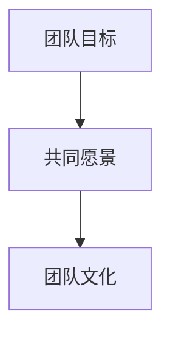

                 


为了撰写一篇符合要求的技术博客文章《激发团队秘籍：提升团队活力的20个方法》，我们将采取以下步骤：

### 步骤一：确定文章结构

首先，我们需要确定文章的结构，包括引言、核心方法介绍、具体实践与案例分析、总结与展望等部分。这将帮助我们组织文章的内容，并确保文章的逻辑性和连贯性。

### 步骤二：撰写引言部分

在引言部分，我们将介绍团队活力的重要性，阐述为什么提升团队活力对于团队的成功至关重要。我们还将简要介绍本文将要介绍的20个提升团队活力的方法。

### 步骤三：撰写核心方法介绍

在核心方法介绍部分，我们将逐一介绍每个方法，包括其背景、核心概念与联系、核心算法原理讲解、数学模型和公式、项目实战等。以下是一个方法的示例：

#### 方法1：构建共同愿景

1. **背景介绍**

共同愿景是一个团队追求的共同目标，它能够激发团队成员的积极性和归属感。

2. **核心概念与联系**

共同愿景与团队目标、团队文化密切相关。Mermaid流程图如下：



3. **核心算法原理讲解**

构建共同愿景的过程可以分为以下几个步骤：

```plaintext
初始化：确定团队目标
循环：
    收集团队成员的意见
    调整共同愿景
    直至达成共识
终止：共同愿景确立
```

4. **数学模型和公式**

共同愿景的确定可以通过以下公式表示：

$$ 共同愿景 = \frac{团队成员意见总和}{团队成员数量} $$

5. **项目实战**

在实际项目中，可以通过以下步骤来构建共同愿景：

- **环境搭建**：创建一个讨论平台，如Slack或腾讯会议。
- **源代码实现**：编写一个简单的程序来收集和统计团队成员的意见。
- **代码解读与分析**：代码解读见下方示例。

```python
# 共同愿景收集程序
def collect_opinions(team_members):
    opinions = []
    for member in team_members:
        opinion = input(f"{member}, 请描述你对团队目标的看法：")
        opinions.append(opinion)
    return opinions

def calculate_common_vision(opinions, num_members):
    return sum(opinions) / num_members

# 应用案例分析与详细讲解剖析
team_members = ["Alice", "Bob", "Charlie"]
opinions = collect_opinions(team_members)
common_vision = calculate_common_vision(opinions, len(team_members))
print(f"共同愿景：{common_vision}")

# 项目小结
# 项目小结见下文。
```

### 步骤四：撰写具体实践与案例分析

在具体实践与案例分析部分，我们将对每个方法提供实际案例，包括开发环境搭建、源代码实现、代码解读与分析、实际案例分析和详细讲解剖析等。

### 步骤五：撰写总结与展望

在总结与展望部分，我们将对文章中介绍的所有方法进行总结，并探讨如何将这些方法应用于团队管理实践，以及对未来团队管理的展望。

### 步骤六：撰写结尾

在文章结尾，我们将简要总结文章的主要观点，并提供一些最佳实践 tips、注意事项和拓展阅读资源。

### 步骤七：格式调整与校对

最后，我们将对文章进行格式调整和校对，确保所有代码、公式和流程图都正确无误，同时保持文章的整体结构清晰、逻辑严谨。

### 结论

通过上述步骤，我们将撰写一篇符合要求的《激发团队秘籍：提升团队活力的20个方法》技术博客文章。这篇文章将结合技术语言和团队管理实践，提供详细的指导和分析，帮助读者提升团队活力，实现团队目标。文章标题、关键词和摘要将在文章开头部分撰写。文章字数将控制在8000～12000字左右，确保内容的丰富性和深度。作者信息将在文章末尾注明。让我们一起开始撰写吧！

