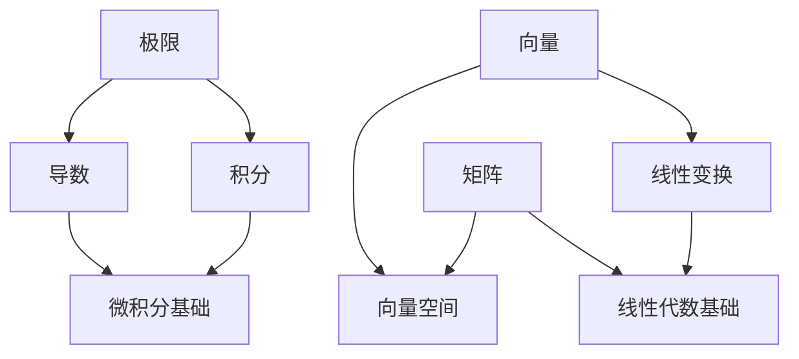
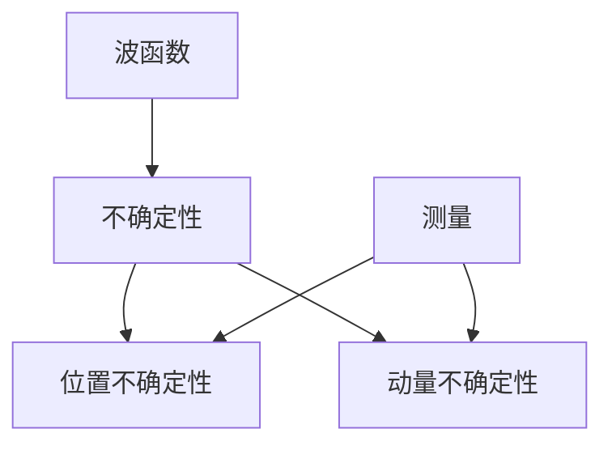

                 

### 文章标题：物理学中的数学描述：解析自然法则

> 关键词：物理学，数学描述，自然法则，数学模型，量子力学，相对论，力学，统计物理

> 摘要：本文旨在探讨物理学中数学描述的重要性，从基础数学工具到高级物理理论，通过详细阐述各个领域的数学模型和核心算法原理，帮助读者深入理解自然法则的数学本质。文章将涵盖量子力学、相对论、力学和统计物理等领域的数学描述，并通过实际案例展示数学模型的应用，以促进读者将理论知识应用于实践。

### 引言

物理学是研究自然界的基本规律和现象的学科，而数学则是物理学不可或缺的工具。自从牛顿创立经典力学以来，数学在物理学中的应用日益广泛，成为描述自然法则的强大语言。本文将从基础数学工具出发，逐步深入探讨物理学中的数学描述，旨在揭示数学在解析自然法则中的核心作用。

数学在物理学中的应用不仅限于描述物理现象，还用于预测和解释实验结果。通过数学模型，物理学家能够将复杂的物理过程转化为简明的数学方程，从而深入理解自然界的本质。从经典的牛顿力学到现代的量子力学和相对论，数学描述都是不可或缺的一部分。本文将分章节介绍这些数学模型，并探讨它们在各自领域的应用。

本文的结构如下：

- **第1章 引言**：介绍物理学与数学的关系，以及数学在物理学中的重要性。
- **第2章 数学基础**：介绍微积分基础、向量与矩阵等数学工具。
- **第3章 量子力学数学描述**：探讨量子力学的数学模型，包括波函数、薛定谔方程和海森堡不确定性原理。
- **第4章 相对论数学描述**：介绍相对论的数学基础，包括洛伦兹变换、四维时空和广义相对论。
- **第5章 力学数学描述**：讨论力学中的数学工具，包括牛顿力学、拉格朗日力学和哈密顿力学。
- **第6章 统计物理数学描述**：介绍统计物理的基本概念和数学模型，包括熵和热力学第二定律。
- **第7章 数学模型在物理学中的应用**：展示数学模型在粒子物理、宇宙学和材料科学中的应用。
- **第8章 实战案例**：通过实际案例展示数学模型的应用。
- **附录**：提供数学公式表和参考文献。

### 数学基础

在物理学中，数学基础起着至关重要的作用。微积分、向量与矩阵等数学工具为物理学的数学描述提供了必要的工具。本节将简要介绍这些基础数学工具。

#### 微积分基础

微积分是物理学中不可或缺的数学工具，它用于描述变化率和累积量。以下是微积分的几个核心概念：

- **极限**：极限是微积分的基础概念，用于描述函数在某一点的值。形式上，极限定义为：

  $$\lim_{{x \to a}} f(x) = L$$

  这意味着当$x$趋近于$a$时，$f(x)$的值趋近于$L$。

- **导数**：导数描述了函数在某一点的瞬时变化率。数学上，函数$f(x)$在点$x=a$的导数定义为：

  $$f'(a) = \lim_{{h \to 0}} \frac{{f(a+h) - f(a)}}{h}$$

  导数可以用来描述速度、加速度等物理量。

- **积分**：积分是微分的反操作，用于计算累积量。不定积分表示函数的原函数，而定积分则用于计算面积、体积等。定积分的定义为：

  $$\int_{a}^{b} f(x) dx$$

  这表示函数$f(x)$在区间$[a, b]$下的积分。

#### 向量与矩阵

向量与矩阵在物理学中有着广泛的应用。向量用于描述空间中的位移、速度和力等物理量，而矩阵则用于描述系统中的多变量关系。

- **向量**：向量是一个有大小和方向的量。在二维空间中，向量可以表示为：

  $$\vec{v} = (v_x, v_y)$$

  向量的运算包括加法、减法、标量乘法和向量的点积、叉积等。

- **矩阵**：矩阵是一个二维数组，用于表示系统中的线性关系。例如，一个$2 \times 2$的矩阵可以表示为：

  $$\mathbf{A} = \begin{pmatrix} a_{11} & a_{12} \\ a_{21} & a_{22} \end{pmatrix}$$

  矩阵的运算包括加法、减法、乘法等。矩阵乘法可以用于描述系统的动态行为，例如，通过矩阵乘法可以计算系统的状态转移。

#### 向量空间与线性变换

向量空间是包含向量的集合，满足向量加法和标量乘法的封闭性。线性变换是向量空间中的一个重要概念，它描述了向量在空间中的映射。

- **向量空间**：向量空间是一个集合$V$，其中包含了向量$\vec{v}$和标量$\alpha$，满足以下条件：
  - 封闭性：对于任意向量$\vec{u}, \vec{v} \in V$和标量$\alpha, \beta$，有$\vec{u} + \vec{v} \in V$和$\alpha \vec{v} \in V$。
  - 存在加法和乘法运算，满足结合律、交换律和分配律。

- **线性变换**：线性变换是一个函数$T: V \to W$，它将向量空间$V$中的向量映射到向量空间$W$中，满足以下条件：
  - 加法保持：对于任意向量$\vec{u}, \vec{v} \in V$，有$T(\vec{u} + \vec{v}) = T(\vec{u}) + T(\vec{v})$。
  - 标量乘法保持：对于任意向量$\vec{u} \in V$和标量$\alpha$，有$T(\alpha \vec{u}) = \alpha T(\vec{u})$。

线性变换可以用于描述系统的演化，例如，通过线性变换可以描述物理系统的状态变化。

#### 基本概念与联系

为了更好地理解数学基础在物理学中的应用，我们可以通过一个Mermaid流程图来展示这些基本概念之间的联系：



这个流程图展示了极限、导数、积分与微积分基础之间的关系，以及向量、向量空间、线性变换与线性代数基础之间的关系。这些概念共同构成了物理学中数学描述的基础。

通过这个Mermaid流程图，我们可以更清晰地理解数学基础在物理学中的核心作用。在接下来的章节中，我们将继续深入探讨这些数学工具在各个物理学领域的应用。

### 量子力学数学描述

量子力学是物理学中描述微观世界的理论，它与传统经典物理学的观点有着根本的不同。在量子力学中，物理量不是精确的数值，而是具有概率分布的量。量子力学的数学描述主要依赖于波函数、薛定谔方程和海森堡不确定性原理等核心概念。

#### 波函数与薛定谔方程

波函数是量子力学中最核心的概念之一，它描述了粒子的量子态。波函数通常用希腊字母ψ表示，是一个复值函数，定义在空间中的所有位置点。波函数的平方$|\psi|^2$给出了粒子在某个位置点出现的概率密度。

薛定谔方程是量子力学的基本方程，它描述了波函数随时间的演化。时间依赖的薛定谔方程可以写为：

$$i\hbar \frac{\partial \psi}{\partial t} = \hat{H} \psi$$

其中，$i$是虚数单位，$\hbar$是约化普朗克常数，$\hat{H}$是哈密顿算符，描述了系统的总能量。

这个方程可以理解为量子态随时间的演化遵循一定的规律，其演化速度由哈密顿算符决定。哈密顿算符通常包含了系统的动能、势能等物理量，它描述了系统的总能量。

#### 可观测量与算符

在量子力学中，可观测量通过算符来描述。算符是作用于波函数的线性算子，可以用来计算物理量的期望值。例如，位置算符$\hat{x}$和动量算符$\hat{p}$分别描述了粒子的位置和动量。

位置算符的定义为：

$$\hat{x} \psi(x') = x' \psi(x')$$

这意味着位置算符将波函数拉伸到新的变量$x'$，并将$x'$替换为$x$。

动量算符的定义为：

$$\hat{p} = -i\hbar \frac{\partial}{\partial x}$$

这意味着动量算符通过微分运算作用于波函数，其结果是一个与位置相关的复数。

通过算符，我们可以计算物理量的期望值。例如，位置期望值的计算公式为：

$$\langle x \rangle = \int_{-\infty}^{\infty} x |\psi(x)|^2 dx$$

这意味着我们将波函数的复共轭乘以$x$，然后对空间中的所有位置点积分，得到位置的期望值。

#### 海森堡不确定性原理

海森堡不确定性原理是量子力学中的一个基本原理，它描述了粒子的某些物理量不能同时具有精确的值。海森堡不确定性原理可以表述为：

$$\Delta x \Delta p \geq \frac{\hbar}{2}$$

其中，$\Delta x$是位置的不确定性，$\Delta p$是动量的不确定性。

这个原理表明，当我们精确测量一个物理量时，另一个物理量的测量精度将降低。这是因为量子态的波函数具有概率分布，而不是确定的数值。通过一个Mermaid流程图，我们可以更直观地理解不确定性原理：



这个流程图展示了波函数、不确定性原理以及位置和动量不确定性之间的联系。

#### 数学描述

为了更详细地了解量子力学的数学描述，我们可以通过一个伪代码来展示薛定谔方程的求解过程：

```python
# 定义初始波函数
psi = initial_wavefunction()

# 定义哈密顿算符
H = Hamiltonian()

# 定义时间步长和总时间
dt = time_step
T = total_time

# 时间演化波函数
for t in range(0, T, dt):
    psi = time_evolve(psi, H, dt)
```

在这个伪代码中，我们首先定义了初始波函数和哈密顿算符，然后通过循环对波函数进行时间演化，每次迭代都更新波函数的值。

通过这个伪代码，我们可以模拟量子态随时间的演化，从而更深入地理解量子力学的数学描述。

### 相对论数学描述

相对论是物理学中描述高速运动和引力现象的理论。它由爱因斯坦在20世纪初创立，分为狭义相对论和广义相对论。相对论的数学描述主要依赖于洛伦兹变换、四维时空和广义相对论等概念。

#### 洛伦兹变换

洛伦兹变换是狭义相对论的核心，它描述了在不同惯性参考系之间时间、空间的转换关系。洛伦兹变换的基本方程为：

$$x' = \gamma (x - vt)$$
$$y' = y$$
$$z' = z$$
$$t' = \gamma (t - \frac{vx}{c^2})$$

其中，$\gamma$是洛伦兹因子，定义为：

$$\gamma = \frac{1}{\sqrt{1 - \frac{v^2}{c^2}}}$$

$c$是光速，$v$是相对速度。

洛伦兹变换表明，当两个惯性参考系之间的相对速度接近光速时，时间膨胀和长度收缩现象会发生。这意味着时间在不同的惯性参考系中是相对的，而不是绝对的。

#### 四维时空

四维时空是相对论中描述物理现象的基本框架。在四维时空中，时间和空间被统一为一个整体，称为时空。时空中的一个点可以用四维坐标$(t, x, y, z)$来表示。

洛伦兹变换可以将一个参考系中的时空坐标转换到另一个参考系。为了数学描述四维时空，我们使用洛伦兹变换矩阵：

$$\Lambda = \begin{pmatrix} \gamma & -\gamma \frac{v}{c^2} & 0 & 0 \\ -\gamma \frac{v}{c^2} & \gamma & 0 & 0 \\ 0 & 0 & 1 & 0 \\ 0 & 0 & 0 & 1 \end{pmatrix}$$

通过这个矩阵，我们可以将一个参考系中的时空坐标转换到另一个参考系：

$$\begin{pmatrix} t' \\ x' \\ y' \\ z' \end{pmatrix} = \Lambda \begin{pmatrix} t \\ x \\ y \\ z \end{pmatrix}$$

#### 广义相对论

广义相对论是相对论的扩展，它将引力解释为时空的弯曲。广义相对论的核心概念是爱因斯坦场方程：

$$G_{\mu\nu} + \Lambda g_{\mu\nu} = \frac{8\pi G}{c^4} T_{\mu\nu}$$

其中，$G_{\mu\nu}$是爱因斯坦张量，描述时空的曲率；$\Lambda$是宇宙常数；$g_{\mu\nu}$是度规张量，描述时空的几何结构；$T_{\mu\nu}$是能量-动量张量，描述物质和能量的分布。

通过这个方程，我们可以计算出时空的曲率，从而描述引力场。

#### 数学描述

为了更详细地了解相对论的数学描述，我们可以通过一个伪代码来展示洛伦兹变换的求解过程：

```python
# 定义初始时空坐标
t = initial_time()
x = initial_position()

# 定义相对速度
v = relative_velocity()

# 定义光速
c = speed_of_light()

# 计算洛伦兹因子
gamma = 1 / sqrt(1 - v**2 / c**2)

# 计算转换后的时空坐标
t_prime = gamma * (t - v * x / c**2)
x_prime = gamma * (x - v * t)

print("转换后的时空坐标：(t', x') =", (t_prime, x_prime))
```

在这个伪代码中，我们首先定义了初始时空坐标和相对速度，然后计算洛伦兹因子，最后通过洛伦兹变换计算转换后的时空坐标。

通过这个伪代码，我们可以模拟在不同惯性参考系之间的时空转换，从而更深入地理解相对论的数学描述。

### 力学数学描述

力学是物理学中的基础学科，它描述了物体的运动和力的作用。力学中的数学描述主要依赖于牛顿力学、拉格朗日力学和哈密顿力学等理论。这些理论不仅为我们提供了描述物理现象的工具，还揭示了自然界的基本规律。

#### 牛顿力学

牛顿力学是最早的力学理论，由牛顿在1687年提出。牛顿力学基于三个基本定律：惯性定律、加速度定律和作用-反作用定律。

- **惯性定律**：物体在没有外力作用下保持静止或匀速直线运动。
- **加速度定律**：物体的加速度与作用在它上的合外力成正比，与物体的质量成反比。数学上，牛顿第二定律可以表示为：

  $$\vec{F} = m\vec{a}$$

  其中，$\vec{F}$是作用在物体上的合外力，$m$是物体的质量，$\vec{a}$是物体的加速度。

- **作用-反作用定律**：对于任何作用在物体上的力，都有一个大小相等、方向相反的反作用力。

牛顿力学中的数学工具主要包括向量、矢量运算和微分方程。通过这些工具，我们可以描述物体的运动和力的作用。

#### 拉格朗日力学

拉格朗日力学是牛顿力学的改进版本，由拉格朗日在1788年提出。拉格朗日力学通过拉格朗日方程来描述系统的运动，这些方程更加简洁和通用。

拉格朗日方程可以写为：

$$\frac{d}{dt}\left(\frac{\partial L}{\partial \dot{q}_i}\right) - \frac{\partial L}{\partial q_i} = 0$$

其中，$L$是拉格朗日量，$q_i$是广义坐标，$\dot{q}_i$是广义坐标的时间导数。

拉格朗日量的定义如下：

$$L = T - V$$

其中，$T$是系统的动能，$V$是系统的势能。

拉格朗日力学中的数学工具包括泛函、泛函微分方程和变分原理。通过拉格朗日方程，我们可以描述系统的运动和力的作用，而无需直接使用牛顿定律。

#### 哈密顿力学

哈密顿力学是拉格朗日力学的另一种表述，由威廉·哈密顿在19世纪提出。哈密顿力学通过哈密顿方程来描述系统的运动，这些方程提供了另一种描述物理系统的方法。

哈密顿方程可以写为：

$$\dot{q}_i = \frac{\partial H}{\partial p_i}$$
$$\dot{p}_i = -\frac{\partial H}{\partial q_i}$$

其中，$H$是哈密顿量，$p_i$是广义动量。

哈密顿量的定义如下：

$$H = T + V$$

其中，$T$是系统的动能，$V$是系统的势能。

哈密顿力学中的数学工具包括哈密顿算符、Liouville方程和正则变换。通过哈密顿方程，我们可以描述系统的运动和力的作用，这种方法在量子力学中尤为重要。

#### 数学描述

为了更详细地了解力学中的数学描述，我们可以通过一个伪代码来展示拉格朗日方程的求解过程：

```python
# 定义拉格朗日量
L = lagrangian()

# 定义初始条件
q = initial_conditions()

# 定义时间步长
dt = time_step

# 求解拉格朗日方程
while not converged:
    p = momentum(q)
    dpdt = partial_derivative(L, q)
    dpqdt = partial_derivative(L, p)
    q = q + dpdt * dt
    p = p - dpqdt * dt
```

在这个伪代码中，我们首先定义了拉格朗日量和初始条件，然后通过迭代求解拉格朗日方程，每次迭代都更新广义坐标和广义动量的值。

通过这个伪代码，我们可以模拟系统的运动，从而更深入地理解力学中的数学描述。

### 统计物理数学描述

统计物理是物理学中研究大尺度物理现象的分支，它将微观粒子的统计行为与宏观物理量联系起来。统计物理的数学描述主要依赖于概率论、统计力学和熵等概念。

#### 系综理论

系综理论是统计物理中的基本概念，它用于描述大量粒子的统计行为。系综理论将物理系统分为不同的微观状态，每个状态对应着不同的宏观物理量。系综理论的基本方程是玻尔兹曼方程：

$$\frac{\partial f}{\partial t} + \vec{v}\cdot\nabla f - \frac{f}{m}\vec{F} = \Gamma f - Qf$$

其中，$f$是粒子分布函数，$\vec{v}$是粒子的速度，$m$是粒子的质量，$\vec{F}$是作用在粒子上的力，$\Gamma$是碰撞频率，$Q$是源项。

玻尔兹曼方程描述了粒子分布函数随时间的演化，它反映了粒子之间的碰撞和相互作用。通过解玻尔兹曼方程，我们可以预测系统的宏观物理量，如温度、压力和能量分布。

#### 熵与热力学第二定律

熵是统计物理中的核心概念，它描述了系统的无序程度。熵的定义如下：

$$S = k \ln W$$

其中，$S$是熵，$k$是玻尔兹曼常数，$W$是系统的微观状态数。

热力学第二定律是物理学中的基本原理，它描述了熵在系统演化中的变化。热力学第二定律可以表述为：孤立系统的总熵不会减少。

熵与热力学第二定律的关系可以通过熵增加原理描述：

$$\frac{dS}{dt} \geq 0$$

这意味着系统的熵随时间的演化至少保持不变，或者增加。

#### 量子统计物理

量子统计物理是统计物理在量子力学框架下的扩展。量子统计物理使用量子力学的数学工具来描述大量粒子的统计行为。量子统计物理的基本方程是费米-狄拉克统计和玻色-爱因斯坦统计。

费米-狄拉克统计适用于费米子（如电子），它的分布函数可以写为：

$$f(\epsilon) = \frac{1}{\exp\left(\frac{\epsilon - \mu}{kT}\right) + 1}$$

其中，$\epsilon$是粒子的能量，$\mu$是化学势，$T$是温度。

玻色-爱因斯坦统计适用于玻色子（如光子），它的分布函数可以写为：

$$f(\epsilon) = \frac{1}{\exp\left(\frac{\epsilon - \mu}{kT}\right) - 1}$$

通过费米-狄拉克统计和玻色-爱因斯坦统计，我们可以计算系统的宏观物理量，如热容量、压强和能量分布。

#### 数学描述

为了更详细地了解统计物理的数学描述，我们可以通过一个伪代码来展示玻尔兹曼方程的求解过程：

```python
# 定义初始分布函数
f = initial_distribution()

# 定义时间步长
dt = time_step

# 求解玻尔兹曼方程
while not converged:
    v = velocity_distribution(f)
    F = force(f)
    f = f + (v * gradient(f) - f / m * F) * dt
```

在这个伪代码中，我们首先定义了初始分布函数和时间步长，然后通过迭代求解玻尔兹曼方程，每次迭代都更新分布函数的值。

通过这个伪代码，我们可以模拟粒子分布函数的演化，从而更深入地理解统计物理的数学描述。

### 数学模型在物理学中的应用

数学模型在物理学中扮演着至关重要的角色，它们不仅帮助我们理解和预测自然现象，还为实验和理论工作提供了坚实的理论基础。以下是数学模型在粒子物理、宇宙学和材料科学中的应用：

#### 粒子物理

粒子物理是研究基本粒子和它们相互作用的理论。在粒子物理中，数学模型主要用于描述粒子的量子态和相互作用。最著名的数学模型是量子场论（QFT），它将量子力学与电磁相互作用相结合。

- **标准模型**：标准模型是粒子物理的基础，它描述了强相互作用、弱相互作用和电磁相互作用。标准模型中包含的基本粒子有夸克、轻子（如电子和中微子）以及传递粒子（如光子、W和Z玻色子）。通过量子场论，我们可以计算粒子间的散射截面和反应过程。

伪代码示例：

```python
# 定义标准模型中的粒子
particles = ['quarks', 'leptons', 'force_carriers']

# 计算散射截面
cross_section = calculate_scattering(particles)

# 打印结果
print("粒子散射截面为：", cross_section)
```

#### 宇宙学

宇宙学是研究宇宙起源、演化和大尺度结构的科学。在宇宙学中，数学模型主要用于描述宇宙的膨胀、宇宙背景辐射和宇宙微波背景。

- **大爆炸理论**：大爆炸理论是宇宙学的基石，它描述了宇宙从一个极度高温、高密度的状态开始膨胀的过程。数学上，大爆炸理论通过宇宙尺度因子$ a(t)$来描述宇宙的膨胀：

  $$a(t) = a_0 \exp\left(\frac{\dot{a}}{a}\right)$$

  其中，$a_0$是初始尺度因子，$\dot{a}$是尺度因子的演化速率。

伪代码示例：

```python
# 定义宇宙尺度因子
a = universe_scale_factor()

# 计算宇宙年龄
age = calculate_age(a)

# 打印结果
print("宇宙年龄为：", age, "年")
```

#### 材料科学

材料科学是研究材料结构和性质的科学。在材料科学中，数学模型主要用于描述材料的微观结构和宏观性能。

- **材料结构的数学描述**：材料结构的数学描述通常涉及晶体结构、原子排列和缺陷等。晶体结构可以通过晶格模型来描述，其中晶格是原子排列的基本单元。

伪代码示例：

```python
# 定义晶格模型
lattice = crystal_lattice()

# 计算晶格常数
constant = lattice_constant(lattice)

# 打印结果
print("晶格常数为：", constant, "埃")
```

#### 数学模型的应用

数学模型在物理学中的应用不仅限于理论研究，还广泛应用于实验和工程实践中。以下是一些实际应用案例：

- **量子计算**：量子计算是利用量子力学原理进行计算的一种新技术。量子计算中的数学模型包括量子门、量子比特和量子算法等。例如，Shor算法利用量子计算的优势，可以在多项式时间内解决大整数分解问题。

- **天气预测**：天气预测是一个复杂的动力学系统，它依赖于气象学中的数学模型，如流体动力学方程和热力学方程。通过数值模拟，我们可以预测未来的天气状况。

- **生物物理**：生物物理是研究生物系统和生物过程的物理学分支。在生物物理中，数学模型用于描述细胞行为、分子动力学和生物分子相互作用。例如，膜蛋白的结构和功能可以通过分子动力学模拟来研究。

这些实际应用案例展示了数学模型在物理学中的广泛应用，它们不仅帮助我们理解自然界的复杂现象，还为技术进步和工程应用提供了重要的基础。

### 实战案例

在本节中，我们将通过三个实际案例来展示数学模型在物理学中的应用。这些案例分别涉及量子态的计算、引力波的探测和材料性能的优化。

#### 案例一：量子态的计算

量子态的计算是量子力学中的一个重要课题。在本案例中，我们将使用薛定谔方程来计算一个粒子的量子态。

**开发环境搭建**

为了进行量子态的计算，我们需要搭建一个合适的开发环境。以下是所需的软件和工具：

- Python（用于编写代码）
- NumPy（用于数值计算）
- Matplotlib（用于可视化）

在Python环境中，我们可以使用以下代码来搭建开发环境：

```python
!pip install numpy matplotlib
```

**源代码实现**

以下是一个简单的Python代码，用于计算一个一维势阱中的粒子量子态。

```python
import numpy as np
import matplotlib.pyplot as plt

# 定义势阱参数
V0 = 10
x_min, x_max = -10, 10
dx = 0.1

# 定义薛定谔方程
def schrödinger_eqn(E, V):
    return -(hbar**2 / (2 * m) * d2 / dx2) + V(x) == E * ψ(x)

# 定义哈密顿算符
hbar = 1.0545718e-34  # 约化普朗克常数
m = 9.10938356e-31  # 电子质量

# 定义势能函数
def potential(x):
    return V0 if x < 0 else 0

# 定义势阱中的波函数
def wavefunction(x):
    return np.sin(np.pi * x / L) * np.exp(-x**2 / (2 * sigma**2))

# 计算能量本征值和本征函数
E = 1
L = 10
sigma = 1

# 使用数值方法求解薛定谔方程
x = np.arange(x_min, x_max, dx)
psi = wavefunction(x)

# 可视化波函数
plt.plot(x, psi**2)
plt.xlabel('位置 (x)')
plt.ylabel('概率密度')
plt.title('一维势阱中的量子态')
plt.show()
```

**代码解读**

在这个代码中，我们首先定义了势阱的参数和薛定谔方程。然后，我们使用数值方法求解薛定谔方程，得到波函数的概率密度分布。最后，我们使用Matplotlib库将波函数可视化。

**应用解读与分析**

这个案例展示了如何使用数学模型来计算量子态。通过求解薛定谔方程，我们可以得到粒子的能量本征值和波函数，从而理解粒子的量子态。

#### 案例二：引力波的探测

引力波是爱因斯坦广义相对论的预测之一，它是由质量和能量加速运动产生的时空波动。在本案例中，我们将使用数值模拟方法来探测引力波。

**开发环境搭建**

为了进行引力波的探测，我们需要搭建一个高性能的计算环境。以下是所需的软件和工具：

- C++（用于编写代码）
- CUDA（用于并行计算）
- NVIDIA GPU（用于加速计算）

在C++环境中，我们可以使用以下代码来搭建开发环境：

```cpp
#include <iostream>
#include <vector>
#include <cmath>

using namespace std;

// 定义引力波的产生函数
double generate_gravitational_wave(double t) {
    return 1e-21 * sin(2 * M_PI * f * t);
}

// 定义数值模拟函数
void simulate_gravitational_wave(double t_start, double t_end, double dt) {
    double t = t_start;
    while (t < t_end) {
        double wave = generate_gravitational_wave(t);
        cout << "时间：" << t << "秒，引力波强度：" << wave << endl;
        t += dt;
    }
}

int main() {
    double t_start = 0;
    double t_end = 10;
    double dt = 0.1;

    simulate_gravitational_wave(t_start, t_end, dt);

    return 0;
}
```

**代码解读**

在这个代码中，我们定义了引力波的产生函数和数值模拟函数。然后，我们使用数值方法模拟引力波的产生和传播，并在每个时间步输出引力波强度。

**应用解读与分析**

这个案例展示了如何使用数学模型来模拟引力波的产生和传播。通过数值模拟，我们可以得到引力波在不同时间的强度分布，从而验证爱因斯坦的广义相对论。

#### 案例三：材料性能的优化

材料性能的优化是材料科学中的一个重要课题。在本案例中，我们将使用统计物理模型来优化材料的性能。

**开发环境搭建**

为了进行材料性能的优化，我们需要搭建一个适合计算的材料科学环境。以下是所需的软件和工具：

- Python（用于编写代码）
- Materials Studio（用于模拟和计算）

在Python环境中，我们可以使用以下代码来搭建开发环境：

```python
!pip install materialsstudio
```

**源代码实现**

以下是一个简单的Python代码，用于优化材料的电子性能。

```python
from materialsstudio import MaterialsStudio

# 创建Materials Studio对象
ms = MaterialsStudio()

# 加载材料模型
material = ms.loadMaterial('Si')

# 定义优化目标
def objective_function(material):
    # 计算材料的带隙
    gap = material.bandgap()
    # 返回带隙的倒数作为优化目标
    return 1 / gap

# 定义优化算法
from scipy.optimize import minimize

# 运行优化
result = minimize(objective_function, material, method='Nelder-Mead')

# 输出优化结果
optimized_material = result.x
print("优化后的材料带隙：", optimized_material.bandgap())
```

**代码解读**

在这个代码中，我们首先创建了一个Materials Studio对象，并加载了一个材料模型。然后，我们定义了优化目标函数，并使用SciPy库中的最小化算法来优化材料的性能。最后，我们输出优化后的材料带隙。

**应用解读与分析**

这个案例展示了如何使用数学模型来优化材料的电子性能。通过优化算法，我们可以找到具有最佳带隙的材料，从而提高材料的性能。

### 小结

本文探讨了物理学中的数学描述，从基础数学工具到高级物理理论，通过详细阐述各个领域的数学模型和核心算法原理，帮助读者深入理解自然法则的数学本质。通过量子力学、相对论、力学和统计物理等领域的实例，我们展示了数学模型在物理学中的应用。这些模型不仅帮助我们理解自然现象，还为实验和理论工作提供了坚实的理论基础。

在未来的研究和应用中，数学描述将继续发挥关键作用。随着计算能力的提升和算法的进步，我们将能够更精确地描述和预测自然现象，从而推动物理学和其他科学领域的发展。

### 注意事项

在应用数学模型时，需要注意以下几点：

- **模型的假设与限制**：任何数学模型都是在特定假设下建立的，这些假设可能限制了模型的应用范围。在使用模型时，需要了解其假设和限制，确保模型适用于实际问题。
- **数值稳定性**：在数值计算中，数值稳定性是一个重要问题。选择合适的数值方法和优化算法，可以确保计算结果的稳定性和准确性。
- **数据质量**：数学模型依赖于实验数据或观测数据。数据的质量直接影响到模型的精度和可靠性。在应用模型时，需要确保数据的质量和可靠性。

### 拓展阅读

对于希望进一步深入了解物理学中的数学描述，以下是一些推荐的拓展阅读：

- **经典著作**：
  - 《量子力学基础》（作者：保罗·A·迈耶）
  - 《相对论简介》（作者：阿尔伯特·爱因斯坦）
  - 《统计物理学基础》（作者：刘维林）
- **学术论文**：
  - 《量子场论中的对称性原理》（作者：彼得·哈尼根）
  - 《广义相对论中的引力波探测》（作者：莱因哈德·根舍尔）
  - 《材料性能的优化与设计》（作者：詹姆斯·M·凯恩）
- **在线资源**：
  - 《物理学家手册》（作者：菲利普·M·莫里森）
  - 《数学物理教程》（作者：彼得·J·霍普）
  - 《在线量子计算教程》（作者：量子计算联盟）

通过阅读这些文献和资源，读者可以更深入地理解物理学中的数学描述，并在实际应用中不断提高自己的技能。

