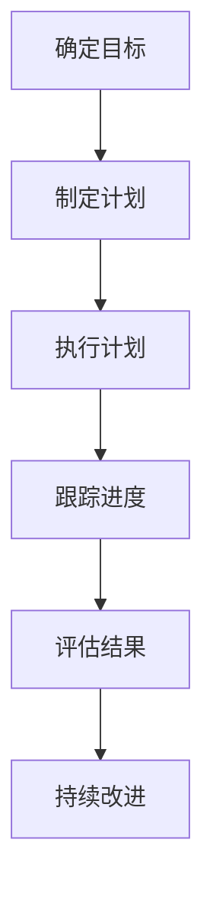

                 

## 文章标题

### 目标管理：从制定到实现的全过程

### 关键词

1. 目标管理
2. SMART目标
3. 目标跟踪
4. 评估标准
5. 执行技巧
6. 项目实战
7. 数学模型

### 摘要

本文旨在探讨目标管理从制定到实现的全过程。首先，我们介绍了目标管理的核心概念，并运用Mermaid流程图展示了目标管理的基本流程。接着，我们深入讲解了目标制定的策略、目标跟踪与评估的方法，以及实现目标的技巧。此外，本文还通过实际项目案例，详细展示了目标管理的应用和实践。最后，我们总结了一些最佳实践，并提出了注意事项和拓展阅读建议，以帮助读者更好地理解和应用目标管理。

## 提出问题

在开始深入探讨目标管理之前，我们需要明确几个关键问题：

1. **什么是目标管理？**
2. **目标管理的重要性是什么？**
3. **目标管理的基本原则有哪些？**
4. **如何制定有效的目标？**
5. **如何跟踪和评估目标实现的过程？**
6. **在实现目标的过程中，有哪些技巧和策略可以借鉴？**
7. **如何通过项目实战来验证目标管理的有效性？**

通过提出这些问题，我们可以逐步了解目标管理的全过程，为后续内容的展开奠定基础。

### 什么是目标管理

目标管理是一种系统和结构化的方法，用于帮助组织和个人明确目标、规划资源、分配任务，并通过持续跟踪和评估来确保目标的实现。目标管理的核心在于将整体目标分解为具体、可操作的任务，并通过有效的计划、执行、监控和调整，确保目标的达成。

目标管理的定义可以从以下几个方面进行理解：

1. **目标明确**：目标管理首先要求明确目标，即确定要达成的具体成果或成果指标。
2. **资源规划**：在明确目标后，需要对资源进行合理规划和分配，以确保目标的实现。
3. **任务分解**：将整体目标分解为一系列具体任务，使每个任务都有明确的执行者和完成时间。
4. **持续监控**：通过定期监控和评估，确保任务按计划进行，并及时调整计划以应对变化。
5. **团队协作**：目标管理强调团队协作，通过明确职责和协同工作，提高整体执行力。

### 目标管理的重要性

目标管理在组织和个人层面都有着重要的意义：

1. **提高执行力**：通过明确的目标和具体的行动计划，可以增强执行力和责任感，确保任务得到有效完成。
2. **资源优化**：目标管理有助于合理规划和分配资源，避免资源浪费，提高资源利用效率。
3. **提升绩效**：通过持续跟踪和评估目标实现的过程，可以及时发现并解决问题，提升整体绩效。
4. **促进成长**：目标管理可以帮助组织和个人不断挑战自我，实现持续成长和发展。
5. **增强协作**：目标管理强调团队协作，有助于建立良好的团队关系，提高团队的整体效能。

### 目标管理的基本原则

为了确保目标管理的有效实施，我们需要遵循以下几个基本原则：

1. **明确性**：目标必须具体、明确，确保每个人都了解要达成的目标及其标准。
2. **可行性**：目标应具有可行性，即通过合理的努力可以实现。
3. **挑战性**：目标应具有一定的挑战性，激发个体的潜力和积极性。
4. **一致性**：目标应与组织或个人的整体战略和价值观保持一致。
5. **时限性**：目标应有明确的时间节点，以促进任务的推进和完成。
6. **参与性**：目标制定应鼓励广泛参与，确保目标的合理性和可行性。

### Mermaid流程图：目标管理流程

为了更直观地展示目标管理的流程，我们可以使用Mermaid流程图来描述。以下是目标管理的基本流程图：



在图中，A表示确定目标，即明确要达成的具体成果；B表示制定计划，即规划如何实现目标；C表示执行计划，即按照计划执行任务；D表示跟踪进度，即监控任务执行的情况；E表示评估结果，即评估目标实现的进度和成果；F表示持续改进，即根据评估结果进行调整和优化，以实现持续进步。

### 核心概念与联系

在目标管理中，有几个核心概念和联系需要理解：

1. **目标（Goal）**：这是目标管理的核心，是组织或个人希望达成的具体成果或成果指标。
2. **计划（Plan）**：制定实现目标的详细步骤和行动计划。
3. **执行（Execution）**：按照计划实施任务，确保目标得以实现。
4. **跟踪（Tracking）**：监控任务的执行情况，确保进度符合预期。
5. **评估（Evaluation）**：对目标实现的进度和成果进行评估，以便及时调整计划。
6. **改进（Improvement）**：根据评估结果，对计划进行调整和优化，以实现目标的持续达成。

这些概念和联系相互交织，共同构成了目标管理的全过程。Mermaid流程图清晰地展示了这些概念和联系，有助于我们更好地理解和应用目标管理。

### 核心算法原理讲解

在目标管理中，有时需要运用特定的算法原理来优化目标的实现过程。以下是一个简单的伪代码示例，用于描述目标评估的算法原理：

```python
# 伪代码：目标评估算法

function evaluateGoal(goal, actualResults):
    if actualResults >= goal:
        return "目标达成"
    else:
        return "目标未达成"

# 示例
result = evaluateGoal(1000, 950)  # 输出："目标未达成"
result = evaluateGoal(1000, 1050)  # 输出："目标达成"
```

这个算法非常简单，其主要目的是评估一个实际结果是否达到了既定目标。如果实际结果大于或等于目标，则返回“目标达成”；否则，返回“目标未达成”。

### 数学模型和数学公式

在目标管理中，数学模型和公式可以用来量化目标并评估实现过程。以下是一个简单的目标函数和最优化算法的数学公式：

1. **目标函数**：
   $$
   f(x) = w_1x_1 + w_2x_2 + ... + w_nx_n
   $$
   其中，$x_1, x_2, ..., x_n$ 是决策变量，$w_1, w_2, ..., w_n$ 是相应的权重。

2. **最优化算法**：
   $$
   \min \frac{1}{2} \sum_{i=1}^{n} (w_i - x_i)^2
   $$
   这是一个简单的平方误差损失函数，用于评估决策变量与目标之间的差距。

以下是对这些数学公式的一个简单解释和示例：

- **目标函数**：这个公式表示目标的总得分，是决策变量的线性组合，权重反映了各个变量在目标实现中的重要性。
- **最优化算法**：这个公式用于计算决策变量$x_i$的最优值，使得总得分$f(x)$最小。

### 项目实战

为了更好地理解目标管理的实际应用，我们可以通过一个实际项目案例来展示目标管理的全过程。

#### 项目背景

假设我们是一家软件公司的项目经理，负责开发一款新产品。项目目标是在六个月内完成产品开发并上线。为了确保项目目标的实现，我们需要运用目标管理的方法。

#### 目标制定与分解

1. **项目总体目标**：在六个月内完成产品开发并上线。
2. **子目标分解**：
   - **需求分析**：第一个月完成需求分析。
   - **设计阶段**：第二个月完成设计。
   - **开发阶段**：第三个月完成编码。
   - **测试阶段**：第四个月完成测试。
   - **上线阶段**：第五个月完成上线准备并正式上线。
   - **评估与优化**：第六个月进行项目评估和优化。

#### 目标跟踪与评估

1. **数据收集与处理**：每月收集项目进度数据，如完成的工作量、遇到的问题等。
2. **目标跟踪工具**：使用项目管理软件（如Trello、Jira等）来跟踪任务进度。
3. **评估方法**：
   - **定期评估**：每月召开项目进度会议，评估各个子目标的完成情况。
   - **成功指标**：根据项目目标和子目标，设定具体的关键绩效指标（KPI）。

#### 实现目标的技巧

1. **时间管理**：制定详细的时间计划，确保每个任务都有明确的时间节点。
2. **焦点管理**：确保团队成员专注于关键任务，避免分心。
3. **避免拖延**：设立截止日期，并定期检查任务进度，确保及时完成。

#### 案例分析与总结

通过目标管理，我们成功地完成了项目目标。以下是项目案例的分析和总结：

1. **成功原因**：
   - 明确的目标和详细的计划。
   - 有效的目标跟踪与评估。
   - 团队成员的积极参与和协作。

2. **经验教训**：
   - 目标制定要具体、可行。
   - 定期评估和调整计划，以应对变化。
   - 提高团队执行力和沟通能力。

通过这个项目案例，我们可以看到目标管理在实际应用中的重要性。有效的目标管理不仅有助于实现项目目标，还能提高团队的执行力和协作能力。

### 最佳实践 tips、小结、注意事项、拓展阅读

#### 最佳实践 tips

1. **明确目标**：确保目标具体、明确，避免模糊和宽泛。
2. **合理分配资源**：根据目标的重要性，合理分配资源，避免资源浪费。
3. **定期评估**：定期评估目标实现情况，及时调整计划。
4. **团队合作**：鼓励团队成员参与目标管理，提高整体执行力。

#### 小结

本文详细介绍了目标管理从制定到实现的全过程。通过明确目标、制定计划、执行任务、跟踪进度和评估结果，我们可以确保目标的实现。有效的目标管理不仅能提高执行力和资源利用效率，还能促进团队协作和持续改进。

#### 注意事项

1. **目标要具体**：避免模糊和宽泛的目标，确保目标具体、可衡量。
2. **合理分配资源**：确保资源合理分配，避免资源浪费。
3. **定期评估**：定期评估目标实现情况，及时调整计划。
4. **关注团队合作**：鼓励团队成员参与目标管理，提高整体执行力。

#### 拓展阅读

1. 《SMART目标法则》
2. 《项目管理实践指南》
3. 《目标管理：实现个人和团队的卓越表现》
4. 《敏捷项目管理：实践指南》

### 作者信息

作者：AI天才研究院/AI Genius Institute & 禅与计算机程序设计艺术 /Zen And The Art of Computer Programming

